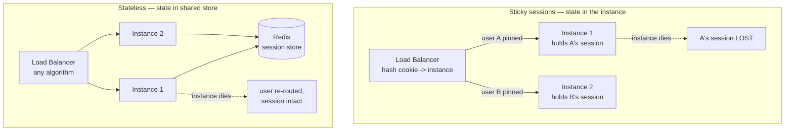
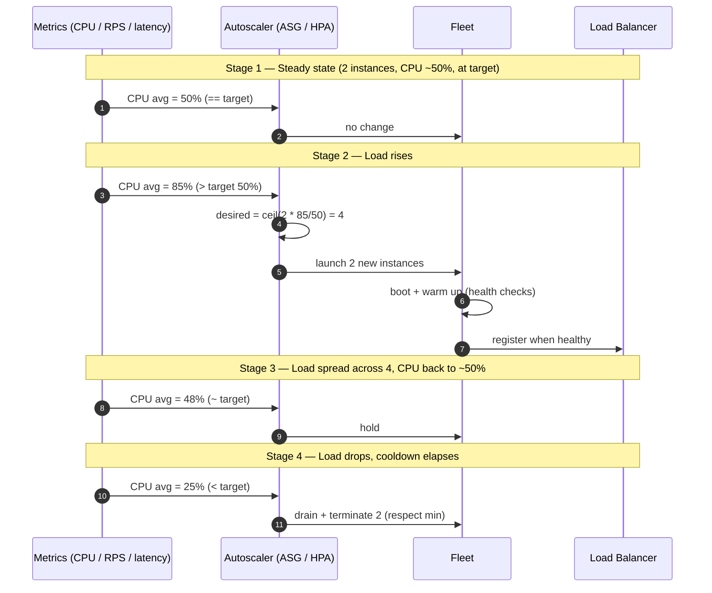

# Horizontal Scaling — Middle

<!-- level-focus -->
At middle level, focus on this question:

> Where does **Horizontal Scaling** belong in a maintainable component, and which trade-off selects the design?

Use the smallest realistic scenario that exposes the decision and its failure behavior.
## 1. The stateless invariant

Horizontal scaling has one load-bearing precondition: **any instance can serve any request without needing anything held on a specific other instance.** Call this the stateless invariant. It does not mean your application has no state — a web app that forgets who is logged in is not useful. It means the state does not live *inside the process's memory* in a way that ties a user to a machine. State still exists; it just lives in a shared tier (a cache, a database, an object store) that every instance can reach equally.

Why this matters is mechanical. A load balancer distributes requests by some algorithm — round-robin, least-connections, hashing. If it sends request 1 to instance A and request 2 to instance B, both requests must succeed identically. If instance A wrote the shopping cart into a local hash map, request 2 arriving at B finds an empty cart. Worse, the failure is *invisible under low load* — with sticky routing or few users, consecutive requests often land on the same box by luck, so the bug hides until you scale out or an instance restarts. Then a fraction of users mysteriously "lose their session," and the incident is hard to reproduce because it depends on which instance the LB happened to pick.

The stateless invariant also unlocks the two operations that make horizontal scaling worth it:

- **Elasticity** — you can add or remove instances at will, because no instance is special. Autoscaling is only safe when killing an instance loses nothing but in-flight requests (which you drain, §8).
- **Fault tolerance** — if an instance dies, the LB routes around it and users see nothing, because the dead instance held no unique state.

Both collapse the instant a process holds state no peer can reconstruct. So the first job in scaling a service horizontally is an audit: *what does each instance remember between requests?* Every answer must be moved out or made reconstructible.

## 2. Externalizing session and state

The most common local state is the **user session**: the logged-in identity, cart contents, wizard step, feature flags computed at login. Traditional frameworks default to storing this in process memory keyed by a session ID cookie. To go stateless you externalize it. There are two families of approach.

**Server-side session store.** Keep a session ID in the cookie, but store the session *body* in a shared datastore — almost always Redis, because sessions are small, hot, key-value shaped, and benefit from TTL-based expiry. Every instance reads and writes the same store, so any instance can serve any user.

```text
# Redis-backed session (conceptual)
# On login:
SET session:7f3a...e9  '{"uid":42,"role":"admin","cart":[...]}'  EX 1800
#   value = serialized session; EX 1800 = 30-min sliding expiry

# On each request, any instance does:
GET session:7f3a...e9        -> hydrate request context
EXPIRE session:7f3a...e9 1800 -> renew sliding TTL on activity
```

The cookie carries only the opaque ID; the sensitive body never leaves the server tier. TTL gives you automatic cleanup and idle logout for free. The cost is one Redis round trip per request (sub-millisecond in-datacenter) and a hard dependency: if Redis is down, sessions are unreadable. In production Redis runs as a replicated cluster precisely because it becomes a shared point of failure once every request touches it.

**Stateless tokens (client-side session).** Put the session *into the cookie itself* as a signed token — a JWT is the common form. The server signs a token containing the claims (`uid`, `role`, expiry) and hands it to the client; on each request it verifies the signature and reads the claims with no datastore lookup at all. This is maximally scalable — zero shared state to read — but you trade away easy revocation: a token stays valid until it expires because there is nothing central to invalidate. The usual compromise is short-lived access tokens (minutes) plus a refresh token checked against a store, so revocation has a bounded blast radius.

Sessions are the headline case, but the audit extends to everything an instance might keep locally:

| Local state found | Where it should live |
|---|---|
| Session / cart / login identity | Redis session store, or signed token in cookie |
| Uploaded files, generated images | Object storage (S3 / GCS), never local disk |
| In-memory cache of DB rows | Shared cache (Redis / Memcached); local cache only as a read-through layer that can be cold on any box |
| Background job / scheduled task state | External queue (SQS / Kafka) + idempotent workers, not an in-process timer |
| Rate-limit counters, feature-flag decisions | Shared store (Redis) so the limit is per-user, not per-instance |
| WebSocket connection registry | External pub/sub (Redis, or a broker) so any instance can push to any connection |

The rule of thumb: **if losing an instance would lose that data, or if the answer depends on which instance you hit, it must be externalized.**

## 3. Sticky sessions vs stateless: the real trade-off

Sticky sessions (session affinity) are the escape hatch when you *cannot* make a service stateless quickly. The load balancer pins a given client to a specific instance — usually by hashing a cookie or the client IP — so every request from that client returns to the box holding its in-memory state. It makes a stateful app *appear* to scale horizontally without touching the application code.

The appeal is obvious and the cost is real. Affinity defeats the two properties that made horizontal scaling valuable:

- **Uneven load.** Traffic is pinned by client, not by current capacity. A few heavy users, or one instance that happened to catch a burst, run hot while others idle. The LB can no longer balance based on live utilization.
- **State loss on instance death.** When an instance restarts (deploy, crash, scale-in), *every session pinned to it is gone.* Those users are logged out or lose their cart. Sticky sessions do not remove local state — they just hide it until the instance disappears.
- **Deploy pain.** A rolling deploy replaces instances one by one; each replacement evicts all its sticky sessions. On a stateless fleet a rolling deploy is invisible; on a sticky fleet it logs users out in waves.



| Dimension | Sticky sessions | Externalized state (stateless) |
|---|---|---|
| Application change | None — works with legacy in-memory sessions | Must move session/state to a shared tier |
| Load distribution | Skewed; pinned by client, not by capacity | Even; LB free to use least-connections / round-robin |
| Instance failure | Pinned sessions lost; users disrupted | Transparent re-route; no session loss |
| Rolling deploy | Evicts sessions per replaced instance | Invisible to users |
| Autoscaling scale-in | Terminating an instance drops its sessions | Safe to terminate any instance after drain |
| Extra dependency | None | Shared store (Redis) becomes a critical path |
| Per-request cost | Zero lookup (state is local) | One store round trip (sub-ms in-DC) |

The honest positioning: **sticky sessions are a migration bridge, not a destination.** They buy time to run a legacy stateful app on a scaled fleet. The target is externalized state, which makes affinity unnecessary and lets the LB balance on real load. The one durable, legitimate use of affinity is long-lived connections that are *inherently* bound to an instance — an established WebSocket lives on one box for its lifetime — and even there the *application* state behind the connection should be external so a reconnect can land anywhere.

## 4. Autoscaling: closing the loop on load

Statelessness makes it *safe* to add and remove instances. Autoscaling is the control loop that decides *when* to do it, without a human watching a graph at 3 a.m. The mechanism is a feedback controller: measure a signal, compare it to a target, adjust the number of instances to close the gap.

On AWS this is an **Auto Scaling Group (ASG)**; on Kubernetes it is the **Horizontal Pod Autoscaler (HPA)**. The shapes differ but the model is identical:

- a **desired capacity** — the number the controller currently wants running,
- **min** and **max** bounds — the floor and ceiling it will never cross,
- a **scaling policy** — the rule that maps the observed metric to a change in desired capacity.

The most robust policy is **target tracking**: you declare a target value for a metric and the controller continuously computes the instance count that would hold the metric at that target. It behaves like a thermostat — you set 50% average CPU, and it adds or removes instances to keep the fleet average near 50%. You do *not* write "if CPU > 70 add one" step rules; the controller does the arithmetic, roughly `desired = ceil(current_instances * (current_metric / target_metric))`.



Concrete config shapes make the parallel clear.

```text
# AWS ASG — target tracking on average CPU
MinSize:         2
MaxSize:         20
TargetTrackingPolicy:
  PredefinedMetric: ASGAverageCPUUtilization
  TargetValue:      50        # hold fleet-average CPU at 50%
  # scale-out is aggressive; scale-in is deliberately slower
```

```text
# Kubernetes HPA — target tracking on CPU utilization
# (kubectl autoscale deploy web --min=2 --max=20 --cpu-percent=50)
apiVersion: autoscaling/v2
kind: HorizontalPodAutoscaler
spec:
  minReplicas: 2
  maxReplicas: 20
  metrics:
  - type: Resource
    resource:
      name: cpu
      target:
        type: Utilization
        averageUtilization: 50
```

Two design choices deserve deliberate thought. **Min** is your always-on baseline — set it high enough to absorb a sudden spike *during the time it takes new instances to boot*, because scale-out is not instant. **Max** is your cost ceiling and your blast-radius limit — it caps spend during a traffic flood or a runaway retry storm, and it stops a metric-collection bug from launching a thousand instances.

## 5. Choosing the scaling metric

The metric you track *is* your definition of "busy." Pick the wrong one and the fleet scales on a signal that does not correlate with user pain. There is no universal answer; it depends on what saturates first.

| Metric | Scale out when it means | Good for | Watch out for |
|---|---|---|---|
| **CPU utilization** | Compute is the bottleneck | CPU-bound work (rendering, compression, serialization) | Misleading for I/O-bound apps that wait on the DB at low CPU |
| **Requests per instance (RPS)** | Traffic volume, independent of per-request cost | Predictable, uniform request cost | A shift in request mix (cheap → expensive) breaks the assumption |
| **Latency (p95 / p99)** | Users are already feeling slowness | Direct proxy for user experience | Lagging signal — by the time latency climbs, you are already behind |
| **Queue depth / backlog** | Consumers can't keep up with producers | Async workers, job processors | Only meaningful for queue-fed workloads |
| **In-flight / concurrent requests** | Connection or thread pool saturating | Request-per-thread servers, connection-bound services | Needs instrumentation the platform may not expose natively |

Practical guidance: **scale on the resource that saturates first, and prefer a leading signal over a lagging one.** For a CPU-bound service, average CPU is both leading and cheap — the standard default. For an I/O-bound service that spends most of its time waiting on a database, CPU stays low while the service is genuinely overwhelmed; RPS-per-instance or concurrent-request count tracks the real load far better. Latency-based scaling is tempting because it maps directly to user experience, but it is a *lagging* trigger: latency only rises once you are already saturated, so scale-out starts late and users feel the gap while new instances boot. A common robust pattern is to scale primarily on a leading resource metric (CPU or RPS) and keep a latency-based policy as a *secondary* safety net that reacts to load the primary metric misses.

Finally, autoscaling only helps if the instance is the bottleneck. If every request funnels through a single non-scaled database and the database is the ceiling, adding app instances just piles more connections onto an already-saturated backend and makes things worse. **Scale the tier that is actually saturating** — horizontal scaling of stateless app servers assumes the shared state tier behind them can absorb the added fan-out.

## 6. Cooldown, warm-up, and scaling stability

A naïve controller that reacts to every metric tick oscillates: it scales out, the new instances drop the average, it immediately scales back in, load re-concentrates, it scales out again — **thrashing** that churns instances, wastes money, and destabilizes latency. Two mechanisms damp the loop.

**Cooldown** is a quiet period after a scaling action during which the controller takes no further action, giving the last change time to show up in the metric before it acts again. Scale-out and scale-in are deliberately *asymmetric*: you want scale-out to be fast and eager (being under-provisioned hurts users immediately) and scale-in to be slow and cautious (removing an instance you'll want back 30 seconds later is pure waste, and a too-aggressive scale-in during a brief dip leaves you exposed to the next spike). Kubernetes expresses this directly with `stabilizationWindowSeconds` — a longer window on scale-*down* than on scale-*up*.

```text
# HPA behavior — eager up, patient down
behavior:
  scaleUp:
    stabilizationWindowSeconds: 0     # react immediately to rising load
  scaleDown:
    stabilizationWindowSeconds: 300   # wait 5 min of low load before shrinking
```

**Warm-up** addresses the other half: a freshly launched instance is not useful the instant it boots. It must start its process, JIT-compile or fill caches, pass health checks, and register with the LB before it can absorb traffic. If the autoscaler counts a still-booting instance as already contributing capacity, it under-provisions — it thinks the new box is helping when it isn't yet. AWS ASG exposes an **instance warm-up** period; the controller ignores the new instance's metrics until warm-up elapses, so it doesn't prematurely conclude the fleet is at target. The same idea appears as readiness probes and startup delays in Kubernetes: the LB must not route to a pod until it reports *ready*, not merely *started*.

The stability lesson: an autoscaler is a control loop, and control loops need damping. **Aggressive scale-out, patient scale-in, and honest accounting of not-yet-ready capacity** are what separate a fleet that tracks load smoothly from one that flaps.

## 7. Deploy implications: rolling updates behind the LB

A stateless fleet behind a load balancer changes how you ship code. Because any instance is interchangeable and no instance holds unique state, you can replace instances *one batch at a time while the fleet keeps serving* — a **rolling update**. The LB is the enabling piece: as you take an instance out to upgrade it, the LB stops routing to it (guided by health checks) and the remaining instances carry the traffic.

The core loop:

Two knobs govern the rollout, and both exist because *the fleet must never drop below the capacity it needs to serve current load mid-deploy*:

- **maxUnavailable** — how many instances may be down at once. Too high and you starve capacity during the deploy; a spike mid-rollout has nowhere to go. Keep it a small fraction of the fleet.
- **maxSurge** — how many *extra* instances you may add temporarily. Surging up first (launch v2 before retiring v1) means you never lose capacity at all — you briefly pay for extra instances to guarantee zero dip. This is the safe default for user-facing services.

Health checks are what make the whole thing safe. The LB only sends traffic to an instance that passes its check, and a rolling deploy must wait for a new instance to be *genuinely ready* — not just process-up — before retiring the old one. A classic incident: the readiness check probes a port that opens before the app can serve, so the LB routes traffic to instances that immediately 500. Every new instance must pass a check that exercises a real code path (a `/healthz` that confirms DB connectivity, cache reachability, and warmed state) before it counts as healthy.

The two failure modes a rolling deploy must not create:

- **Capacity dip.** Never let `maxUnavailable` plus in-flight spikes drop live capacity below demand. Surge up before draining down.
- **Routing to unready instances.** Never register a new version with the LB until its readiness check passes a real request path.

For riskier changes, teams layer a **canary** on top: route a small slice of traffic (say 5%) to v2, watch error rate and latency, and only proceed with the rolling replacement if the canary is healthy. That is senior-tier territory; at this level the essential mechanic is that a stateless fleet behind a health-checked LB makes zero-downtime rolling deploys *possible at all* — statefulness is exactly what would break it.

## 8. Connection draining and graceful shutdown

Whether you are scaling in or rolling a deploy, you routinely *remove* instances that are actively serving traffic. Doing this without dropping requests is **connection draining** (AWS calls it *deregistration delay*). The sequence: the LB stops sending the instance *new* connections, but lets *existing* in-flight requests finish — up to a timeout — before the instance is terminated. Without draining, an autoscale scale-in or a deploy would kill instances mid-request, and users would see abrupt connection resets.

The instance side must cooperate. A well-behaved shutdown:

1. receives the termination signal (`SIGTERM`),
2. stops accepting new work and fails its health check so the LB deregisters it,
3. finishes in-flight requests,
4. flushes anything buffered (logs, metrics, pending writes),
5. exits — before the platform's grace period elapses and force-kills it (`SIGKILL`).

```text
# Two timeouts that must agree
LB deregistration delay:        30s   # how long the LB waits for in-flight to drain
Pod terminationGracePeriod:     30s   # how long the platform waits before SIGKILL
# If the grace period is SHORTER than the drain window, in-flight requests
# get killed mid-flight. Keep grace period >= drain window.
```

The interaction with the earlier sections is the whole point: draining is what makes autoscale scale-in *safe* (§4), and it is what makes each batch of a rolling deploy *lossless* (§7). It is only *possible* because the service is stateless (§1) — there is no unique state on the departing instance to preserve, only in-flight requests to let finish. This is the through-line of the entire topic: **statelessness plus a health-checked load balancer plus draining is the machinery that lets a fleet grow, shrink, and redeploy while serving continuously.**

## 9. Practitioner heuristics

- **Audit for local state first.** Before touching autoscaling, find every place an instance remembers something between requests. If losing the instance loses the data, or if the answer depends on which box you hit, externalize it. Stateless is the precondition for everything else.
- **Sessions go to Redis or into a signed token.** Server-side store for easy revocation and sliding TTL; stateless token for zero-lookup scale at the cost of harder revocation. Never leave sessions in process memory on a scaled fleet.
- **Treat sticky sessions as a bridge, not a home.** Use affinity only to buy time migrating a legacy stateful app, or for inherently instance-bound long-lived connections. It defeats load balancing and turns every deploy and scale-in into a session-loss event.
- **Scale on the resource that saturates first.** CPU for compute-bound, RPS or concurrency for I/O-bound. Prefer a leading signal; keep latency-based policies as a secondary safety net, not the primary trigger.
- **Set min for the spike, max for the budget.** Min absorbs bursts during the boot delay of new instances; max caps cost and blast radius when a metric bug or retry storm tries to launch the world.
- **Scale out eager, scale in patient.** Asymmetric cooldown / stabilization windows prevent thrashing. Being briefly over-provisioned is cheap; being under-provisioned hurts users now.
- **Account for warm-up honestly.** A booting instance is not capacity. Use warm-up periods and readiness probes so the LB routes only to instances that pass a real request path, and so the autoscaler doesn't count not-yet-ready boxes as helping.
- **Surge before you drain.** For rolling deploys of user-facing services, add v2 capacity before retiring v1 (`maxSurge` up, `maxUnavailable` low) so live capacity never dips below demand.
- **Make drain window and shutdown grace period agree.** The platform's kill grace period must be at least the LB deregistration delay, or you kill in-flight requests during every scale-in and deploy.
- **Remember the shared tier is the real ceiling.** Horizontal scaling of app servers assumes the database, cache, and queues behind them can absorb the fan-out. Scale the tier that is actually saturating, not the one that is easy to scale.

*Next step:* [Horizontal Scaling — Senior](senior.md)

---

## Apply it

1. Find a real component where **Horizontal Scaling** affects an interface or dependency.
2. Write two plausible choices and the constraint that favors each one.
3. Make the smallest reversible change at that boundary.
4. Exercise the component alone, then exercise the integrated flow.
5. Keep the decision note with the evidence that selected the option.

## Verify your work

- A focused check proves the local behavior.
- An integrated check proves callers and dependencies still agree.
- Logs, traces, compiler output, or benchmarks expose the boundary.
- Reverting the change restores the previous behavior without unrelated edits.

## Review questions

- Which boundary is most affected by Horizontal Scaling?
- What constraint would make you choose the alternative design?
- How would you isolate a local defect from an integration defect?
- What evidence shows that the change remains maintainable?
