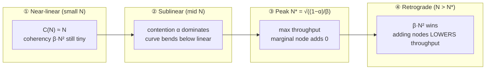
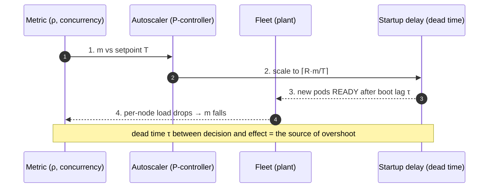

# Horizontal Scaling — Professional

<!-- level-focus -->
At professional level, focus on this question:

> How should teams adopt and operate **Horizontal Scaling** with measurable outcomes and limited coordination?

Use the smallest realistic scenario that exposes the decision and its failure behavior.
## 1. Amdahl's Law — the serialization ceiling

Amdahl's Law (Gene Amdahl, 1967) is the first-order answer to "how much does more hardware buy me?" Split a workload into a fraction `p` that can be parallelized and a fraction `(1 − p)` that is inherently serial. With `N` workers, the parallel part shrinks to `p/N` while the serial part is unchanged. The **speedup** is:

```
              1
S(N) = ─────────────────
        (1 − p) + p/N
```

As `N → ∞`, `p/N → 0`, so speedup asymptotes to `S(∞) = 1 / (1 − p)`. The serial fraction is a *hard ceiling* independent of how many machines you throw at the problem.

**Worked.** Say 95% of a request-processing pipeline parallelizes across stateless workers, but 5% is a serial write to a single primary (`p = 0.95`, `1 − p = 0.05`).

| N workers | Speedup S(N) = 1 / (0.05 + 0.95/N) | Efficiency S(N)/N |
|-----------|-------------------------------------|-------------------|
| 1 | 1.00 | 100% |
| 2 | 1.90 | 95% |
| 10 | 6.90 | 69% |
| 50 | 15.24 | 30% |
| 200 | 18.62 | 9.3% |
| ∞ | **20.00** | → 0% |

Even with infinite machines you never beat 20×, and you are already burning 91% of your fleet to waste at N = 200. The lesson for horizontal scaling: **the serial fraction is the enemy**, and it is often invisible — a shared sequence generator, a single-writer table, a global lock, a config service every node polls. Amdahl tells you the ceiling but is *optimistic*: it assumes adding workers is free of side effects. Real distributed fleets have a cost Amdahl ignores entirely — the nodes must talk to each other.

---

## 2. The Universal Scalability Law — contention and coherency

The Universal Scalability Law (Neil Gunther, *Guerrilla Capacity Planning*, 2007) generalizes Amdahl by adding a second penalty term. It models **relative capacity** `C(N)` — throughput at `N` nodes divided by throughput at one node:

```
                     N
C(N) = ────────────────────────────────
        1 + α(N − 1) + β·N·(N − 1)
```

Three regimes live in that denominator:

- **Ideal (linear):** if `α = 0` and `β = 0`, then `C(N) = N`. Perfect scaling.
- **Contention `α`** (the *serialization* / queueing coefficient): the cost of waiting for a shared, serialized resource — a lock, a single-primary write, a bottleneck link. This is Amdahl's serial fraction in disguise; with `β = 0`, USL reduces exactly to Amdahl's Law with `α = 1 − p`.
- **Coherency `β`** (the *crosstalk* coefficient): the cost of keeping nodes *consistent with each other* — cache-line invalidation, gossip, distributed-lock chatter, replica sync, connection-pool coordination. Its `N·(N − 1)` term is the number of *pairwise* interactions: every node must reconcile with every other, so this cost grows **quadratically**.

The `β` term is what makes USL predictive where Amdahl is not. Amdahl can only *flatten*; USL can *turn the curve downward*. Because the numerator grows like `N` but the coherency penalty grows like `N²`, there is always a finite `N` beyond which adding a node makes total throughput *worse*. That is the retrograde region — the empirically observed, counterintuitive phenomenon that a 200-node cluster can serve fewer requests per second than a 120-node one.

**Fitting in practice:** you do not guess `α` and `β` — you measure throughput at several load levels (or node counts), then regress `C(N)` against the two-parameter model (Gunther recommends a polynomial fit on the transformed efficiency). The fitted `α` and `β` become a *forecast*: they tell you the peak location before you provision past it.

---

## 3. Reading the USL curve: peak and retrograde region

Differentiate `C(N)` and set the derivative to zero; the throughput peak sits at:

```
N* = sqrt( (1 − α) / β )
```

Note that `N*` depends **only on `β`** relative to `α` — coherency, not contention, sets *where* the wall is. Push `β` down (less crosstalk) and the peak marches to the right.

**Worked.** Take a shared-state service with `α = 0.03` (3% serialized) and `β = 0.0005` (small but nonzero coherency cost).

| N | C(N) = N / (1 + 0.03(N−1) + 0.0005·N(N−1)) | Region |
|---|--------------------------------------------|--------|
| 1 | 1.00 | linear |
| 10 | 8.25 | near-linear |
| 20 | 13.9 | sublinear |
| 43 | **21.0** | **peak (N\* ≈ 43.5)** |
| 60 | 20.4 | retrograde |
| 100 | 17.2 | retrograde |
| 200 | 11.6 | deep retrograde |

`N* = sqrt((1 − 0.03) / 0.0005) = sqrt(1940) ≈ 43.5`. Peak capacity ≈ 21× the single node — then it *falls*. At N = 100 you have paid for 100 machines to get the throughput of ~17, and at 200 you are back near a 12-node result. This is the diagram every capacity plan should carry:



Staged reading: **①** the fleet tracks the ideal line because pairwise crosstalk `β·N(N−1)` is negligible at small `N`. **②** contention `α` accumulates and the curve peels away from linear — you are still gaining, just less per node. **③** at `N*` the marginal node contributes exactly zero; efficiency has been falling the whole time but *total* throughput now stops rising. **④** past `N*` the quadratic coherency term overwhelms the linear numerator and every added node is net-negative — more coordination than work. Operating in region ④ is the classic "we scaled out and it got slower" incident.

---

## 4. Amdahl vs USL vs linear-ideal — a comparison

| Property | Linear (ideal) | Amdahl's Law | Universal Scalability Law |
|----------|---------------|--------------|---------------------------|
| Formula | `C(N) = N` | `S(N) = 1 / ((1−p) + p/N)` | `C(N) = N / (1 + α(N−1) + βN(N−1))` |
| Parameters | none | serial fraction `1−p` | contention `α`, coherency `β` |
| Models serialization | no | **yes** (`1−p`) | yes (`α`) |
| Models node-to-node coherency | no | **no** | **yes** (`β·N²`) |
| Large-N behavior | grows ∞ | asymptotes to `1/(1−p)` | **peaks then decreases** |
| Can predict a throughput *maximum* | no | no (only a ceiling) | **yes** (`N* = √((1−α)/β)`) |
| Reduces to | — | USL with `β = 0` | superset of both |
| Best used for | marketing slides | shared-nothing, embarrassingly parallel | real distributed/shared-state fleets |

The relationships nest: **linear** is USL with `α = β = 0`; **Amdahl** is USL with `β = 0` and `α = 1 − p`. USL is the only one of the three that can explain a retrograde cluster, which is precisely the failure mode horizontal scaling introduces and vertical scaling does not. Use Amdahl to size the *ceiling* of an embarrassingly-parallel, shared-nothing tier (stateless web servers behind an LB with no shared write path). Use USL the moment nodes share *anything* — a database, a distributed lock, a cache-coherence protocol, a gossip membership list.

---

## 5. Little's Law — capacity as an exact instance count

Amdahl and USL tell you *diminishing returns*; **Little's Law** (John Little, 1961) tells you *how many nodes you need right now*. It is a theorem, not a heuristic, and holds for any stable system regardless of arrival distribution or service discipline:

```
L = λ · W
```

where `L` = mean number of requests concurrently in the system, `λ` = mean arrival rate (requests/sec), `W` = mean time in system (latency, seconds). Rearranged for capacity planning, the concurrency a fleet must sustain is `λ · W`, and if each instance can safely hold `c` concurrent requests, then:

```
                    λ · W
instances = ⌈ ───────────── ⌉
                      c
```

**Worked.** A service receives `λ = 8,000 req/s`, mean end-to-end latency `W = 250 ms = 0.25 s`, and each instance is benchmarked to handle `c = 50` concurrent in-flight requests before its own latency degrades.

```
L = λ · W = 8,000 × 0.25 = 2,000 concurrent requests in flight
instances = ⌈ 2,000 / 50 ⌉ = 40 instances
```

Forty instances is the floor to *not* queue at the fleet level. Two subtleties that separate professionals from provisioning by guesswork:

1. **Latency is not a constant you control independently.** As you approach saturation, `W` rises (queueing), so `L = λW` rises too — you need *more* instances exactly when latency is worst. Size against the `W` you observe under target load, not the idle-path `W`.
2. **Add a utilization headroom target.** Running instances at 100% of `c` leaves no slack for variance, GC pauses, or a failed node. Provision to a target utilization `ρ` (say 70%): `instances = ⌈ λW / (c · ρ) ⌉ = ⌈ 2,000 / (50 × 0.7) ⌉ = ⌈57.1⌉ = 58`. The 40 vs 58 gap is the difference between a plan that survives a traffic spike and one that cascades.

Little's Law is also the sanity check on an autoscaler's *target*: a "target 50 concurrent requests per pod" policy is Little's Law wearing an ops costume — it is choosing `c` and letting the controller solve for instance count as `λ` moves.

---

## 6. Queueing intuition: the knee before saturation

Little's Law says nothing about *why* `W` explodes near capacity — queueing theory does. Model an instance as an M/M/1 queue with utilization `ρ = λ/μ` (arrival rate over service rate). The mean time in system is:

```
        1
W = ─────────
     μ(1 − ρ)
```

The `1 − ρ` in the denominator is the whole story. As `ρ → 1`, `W → ∞` **hyperbolically**, not linearly.

| Utilization ρ | Latency multiplier 1/(1−ρ) |
|---------------|----------------------------|
| 0.50 | 2× |
| 0.70 | 3.3× |
| 0.80 | 5× |
| 0.90 | 10× |
| 0.95 | 20× |
| 0.99 | 100× |

This is the **knee**: below ~70% utilization latency is nearly flat; past ~80% it turns vertical. Horizontal scaling exists to keep each node *left of the knee*. This is also why "the CPU is only at 85%, why is it slow?" is a category error — at `ρ = 0.85` you are already at a 6.7× latency penalty. The autoscaler's job is to add nodes to pull per-node `ρ` back down the curve before the knee, which is exactly why utilization- or concurrency-based targets work better than raw traffic thresholds: they track the variable that actually determines latency.

---

## 7. Autoscaling as feedback control — why it oscillates

Target-tracking autoscaling (AWS Target Tracking, Kubernetes HPA) is a **closed-loop feedback controller**. It measures a signal `m` (CPU%, concurrency, or a custom metric), compares it to a setpoint `T`, and computes a desired replica count. The canonical HPA formula:

```
desiredReplicas = ⌈ currentReplicas · (m / T) ⌉
```

is a **proportional controller**: the correction is proportional to the ratio of current metric to target. Model the loop:



Every autoscaler is a control system with three failure modes borrowed straight from control theory:

- **Dead time (transport lag).** Steps 2→3: a scale-up decision has no effect until new pods *boot, warm caches, and pass health checks* — seconds to minutes. The controller keeps reacting to a signal that already accounts for pods not yet online, so it **overshoots**, then over-corrects downward, then up — sustained oscillation ("flapping"). This is the textbook consequence of feedback with delay and high gain.
- **Metric lag.** The measured `m` is a lagging, averaged signal (a 60s rolling CPU average). The controller acts on the past, amplifying the phase lag that drives oscillation.
- **Quantization.** `desiredReplicas` is an integer ceiling; near the setpoint the controller can chatter ±1 replica indefinitely.

**The damping mechanisms are control-theory remedies:**

| Mechanism | Control-theory analog | Effect |
|-----------|----------------------|--------|
| Scale-down cooldown / stabilization window | **derivative damping / hysteresis** | ignores transient dips; prevents removing capacity the loop is about to re-request |
| Separate faster scale-up, slower scale-down | **asymmetric gain** | react quickly to load, retreat cautiously — errs toward availability |
| Target `T` set below the knee (e.g. 60–70%) | **setpoint margin** | keeps the plant in its linear region where the loop is stable |
| Step/rate limits (max % change per interval) | **slew-rate limiting** | caps gain so a metric spike can't command a 10× jump |
| Predictive/scheduled scaling | **feed-forward** | acts on known future load (diurnal pattern) *before* the error appears, sidestepping dead time entirely |

The unifying insight: an autoscaler with **high gain and long dead time is guaranteed to oscillate** — that is not a bug in your config, it is the Nyquist stability condition asserting itself. You stabilize it the same way you stabilize a thermostat with a slow furnace: lower the gain (rate limits), add hysteresis (cooldowns), and prefer feed-forward (predictive scaling) so the controller isn't chasing a delayed measurement of its own past actions.

---

## 8. Synthesis: designing to move the peak right

The three laws compose into a single design discipline. **Amdahl** sets the optimistic ceiling from your serial fraction. **USL** corrects that ceiling into a *peak* at `N* = √((1 − α)/β)` and warns that scaling past it is destructive. **Little's Law** converts a live `(λ, W, c)` budget into the exact instance count, and **queueing theory** explains why that count must keep each node left of the `1/(1−ρ)` knee. **Control theory** governs the machine that moves you along the curve without oscillating.

The engineering payoff is that every architectural choice maps to a coefficient:

- **Lower `α` (contention):** remove serial bottlenecks — shard the single-writer table, replace the global lock with per-key locks, make the tier truly shared-nothing. This raises the Amdahl ceiling *and* pushes `N*` out.
- **Lower `β` (coherency):** this is the high-leverage move, because `N* ∝ 1/√β`. Cut node-to-node crosstalk — partition state so nodes don't reconcile, prefer eventual consistency over synchronous replication where correctness allows, avoid all-to-all gossip, keep connection pools and cache-coherence traffic bounded. Halving `β` moves the peak out by ~41% (`√2`).
- **Right-size with Little's Law, not intuition:** `⌈λW / (c·ρ)⌉` with a utilization target, re-evaluated as `W` drifts under load.
- **Damp the controller:** cooldowns, asymmetric gain, setpoints below the knee, and feed-forward for predictable diurnal load.

A principal engineer does not say "we'll add nodes if it's slow." They say: "our fitted USL has `α ≈ 0.03`, `β ≈ 0.0005`, so our peak is ~43 nodes at ~21× — we are 15 nodes from the wall; the fix is not more nodes, it's cutting the replica-sync crosstalk that dominates `β`, which moves the wall to ~80 nodes; meanwhile Little's Law says today's `λW` needs 58 pods at 70% target, and the HPA is flapping because its 300s scale-up dead time exceeds its stabilization window." That sentence — laws, fitted coefficients, an instance count, and a control diagnosis — is what horizontal-scaling mastery sounds like.


---

## Apply it

1. Define the user or business outcome that **Horizontal Scaling** should improve.
2. Assign one owner for code, contracts, operations, and incidents.
3. Split delivery into reversible increments that produce evidence early.
4. Publish responsibilities, escalation paths, and compatibility windows.
5. Stop or expand only when the agreed measures support that decision.

## Verify your work

- Each increment has an owner, rollback path, and observable exit condition.
- Adoption, reliability, delivery time, and coordination cost are measured.
- Incident and migration exercises prove that responsibility is executable.
- The old path is removed only after telemetry proves it is unused.

## Review questions

- Which measurable outcome justifies investing in Horizontal Scaling?
- Which team owns the full lifecycle and incident response?
- What reversible increment produces the earliest useful evidence?
- Which exit condition proves that migration or adoption is complete?
