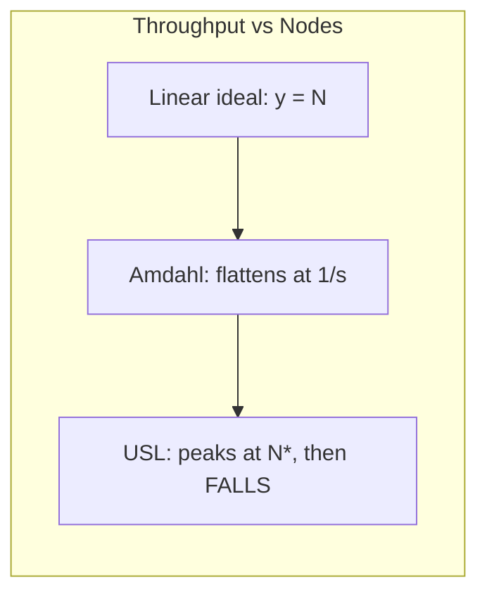
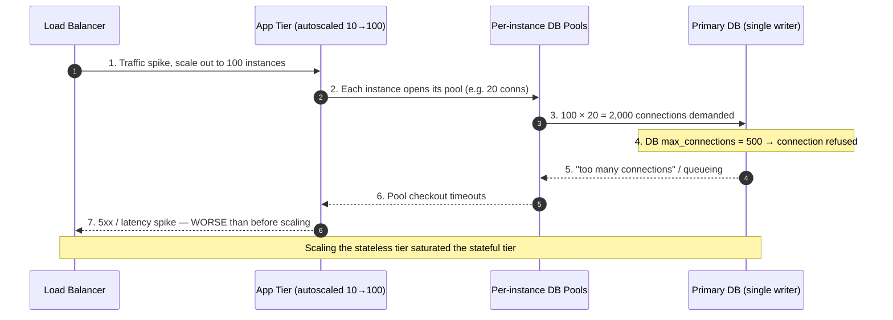

# Horizontal Scaling — Senior

<!-- level-focus -->
At senior level, focus on this question:

> Which system invariant is affected by **Horizontal Scaling** under failure, load, and change?

Use the smallest realistic scenario that exposes the decision and its failure behavior.
## 1. The Senior Reframe: Scaling Is Not Free

The junior mental model is linear: *N machines do N times the work.* That model
is a lie that holds only for embarrassingly parallel, fully shared-nothing
workloads. Every real system carries some serialized work and some coordination,
and both of those turn the throughput curve from a straight line into a curve
that first bends, then flattens, then — crucially — **falls**.

A senior engineer treats "add a node" as a hypothesis to be tested against three
questions before ever touching the autoscaler:

- **What fraction of the request is serialized?** (Amdahl.) A request that spends
  20% of its time in a lock, a single-writer DB, or a global sequence generator
  will never go faster than 5× no matter how many app servers you add.
- **What does each new node *cost* the shared tier?** (Coherency / contention.)
  Each stateless node opens connections, issues queries, invalidates caches, and
  competes for locks. Node #200 does not just fail to help — it can degrade every
  other node by intensifying contention on the one resource they all share.
- **How fast can you add capacity relative to how fast load arrives?** (Control
  theory.) If traffic doubles in 30 seconds and a new node takes 4 minutes to
  boot, warm its JIT/cache, and pass health checks, the autoscaler is
  *structurally* too slow and will always be chasing a spike it has already lost.

The rest of this file is those three questions, made quantitative.

---

## 2. Where Horizontal Scaling Breaks: Amdahl and the Universal Scalability Law

### Amdahl's Law — the serial fraction is a hard ceiling

If a fraction `s` of the work is inherently serial (cannot be parallelized), then
with `N` workers the maximum speedup is:

```text
Speedup(N) = 1 / ( s + (1 - s)/N )

As N → ∞:  Speedup → 1/s   (a hard ceiling, independent of N)
```

| Serial fraction `s` | Max speedup (N→∞) | Speedup at N=16 | Speedup at N=256 |
|---------------------|-------------------|-----------------|------------------|
| 1%  | 100×  | 13.9× | 72×   |
| 5%  | 20×   | 9.1×  | 18×   |
| 10% | 10×   | 6.4×  | 9.7×  |
| 25% | 4×    | 3.4×  | 3.98× |

The lesson: a 5% serial fraction — one shared sequence generator, one
"UPDATE counters SET n = n+1", one distributed lock on the hot path — caps you at
**20×** forever. Doubling the fleet from 128 to 256 nodes buys you almost nothing.

### The Universal Scalability Law — it's worse than a ceiling

Amdahl says extra nodes stop helping. Gunther's **Universal Scalability Law
(USL)** says extra nodes can make throughput *decrease*, because coordination is
not free — every worker that touches shared state must reconcile with every other
worker (a cost that grows with `N²`):

```text
              N
C(N) = ---------------------------
        1 + α(N-1) + β·N·(N-1)

  α = contention  (serialization; the Amdahl term)
  β = coherency   (crosstalk; pairwise coordination, the killer)
```

When `β > 0`, `C(N)` has a **peak** at `N* = sqrt((1-α)/β)` and then falls. Past
`N*`, every node you add makes the system *slower in aggregate*. This is why a
team can add 40 app servers to fix a slow API and watch p99 get *worse*: they
pushed the shared database past its coherency peak (lock manager, buffer-pool
latches, replication fan-out), and the serialized/coordinated tier is now
thrashing.



> The senior takeaway: **find your `N*` before the autoscaler does.** Load-test
> the fleet upward until aggregate throughput stops rising, and set the
> autoscaler's `maxReplicas` *below* the point where the shared tier tips over.
> An unbounded autoscaler pointed at a `β > 0` system is a loaded gun.

---

## 3. What Scales Out and What Doesn't

Horizontal scaling is a property of a *tier*, not of a *system*. The senior skill
is decomposing the request path and classifying each hop.

| Component | Scales horizontally? | Why / limiting factor |
|-----------|----------------------|-----------------------|
| Stateless app servers | **Yes, near-linear** | No shared state; LB spreads load. Bounded only by what they *call*. |
| Load balancer (L7) | Yes (add LB nodes / ECMP) | Fronted by DNS/anycast; but sticky sessions re-introduce state |
| Read-only replicas | Yes, for reads | Adds read capacity; every replica adds replication lag + primary fan-out cost |
| Primary DB (writes) | **No** (not by adding nodes) | Single writer. Scales only via **sharding** (partition the keyspace) or vertical scale |
| Distributed cache | Yes (consistent hashing) | Rebalancing cost on membership change; hot keys don't shard |
| Global counter / sequence | **No** | Inherently serial (`s`≈1); needs approximate/sharded counters (HLL, per-shard + rollup) |
| Distributed lock / coordinator | **No — anti-scales** | This is the `β·N²` term; more clients = more contention on the lock |
| Message-queue partition | Per-partition parallel | Ordering forces serialization *within* a partition; a hot key is a hot partition |

The pattern: **anything with a single point of serialization or global
coordination is your Amdahl `s` and your USL `β`.** You scale the tiers that are
shared-nothing and you *redesign* (shard, partition, approximate) the tiers that
aren't — you cannot autoscale your way past them.

---

## 4. Scaling the Stateless Tier Just Moves the Bottleneck

Here is the mistake that looks like success. Latency is high, so you scale the
app tier from 10 to 100 instances. For a few minutes it works. Then the database
saturates, because 100 instances issue 10× the queries, hold 10× the connections,
and invalidate the cache 10× as often. You did not remove the bottleneck — you
**relocated it downstream** and made it harder to see, because now no single app
server looks busy.



The senior response is to treat the **stateful tier as the real capacity budget**
and design the scale-out of the stateless tier *around* it:

- **Read replicas** to offload read traffic off the primary (only helps if the
  workload is read-heavy and can tolerate replica lag).
- **Sharding** to turn one single-writer bottleneck into `K` independent ones —
  the only true horizontal scaling for writes.
- **Caching** (with a stampede-safe fill: request coalescing / single-flight, so
  a cache miss does not become `N` simultaneous DB queries).
- A **connection budget** that is enforced, not hoped for (next section).

> Rule of thumb a senior enforces in design review: *"You are not allowed to
> propose scaling the app tier without stating what it does to the database's
> connection count, QPS, and cache-miss rate at the new instance count."*

---

## 5. Connection-Pool Exhaustion: The Multiplier Nobody Budgets For

Databases are sized in **connections**, not requests, and every connection costs
the server real memory and a backend process/thread. Postgres, for example,
forks a backend per connection; a few thousand connections can consume more RAM
in connection overhead than in useful buffer pool, and the lock manager and
`ProcArray` scans degrade super-linearly.

The trap is that the pool size is configured **per instance**, but the limit is
**global**:

```text
Total connections demanded = instances × pool_size_per_instance

  10 instances × 20 = 200      ✓ under a 500-connection DB
  50 instances × 20 = 1,000    ✗ 2× over the limit
 100 instances × 20 = 2,000    ✗ 4× over — the DB refuses connections

The app tier autoscaled on CPU. Nobody told the autoscaler that the DB has a
hard ceiling of 500 connections. Node #26 is the one that breaks production.
```

Failure signature: app-tier CPU looks *fine*, but requests pile up in the
connection-pool checkout queue. You see rising "pool wait time" and DB
`FATAL: too many connections`, not high DB CPU. It is easy to misdiagnose as a
slow database when it is actually a saturated *front door* to the database.

The senior fixes, in order of leverage:

1. **A connection pooler (PgBouncer / ProxySQL / RDS Proxy) in transaction mode.**
   Thousands of app-side connections multiplex onto a small, fixed pool of real
   backend connections. This *decouples* app-instance count from DB backend count
   — the single most important move for a fleet that autoscales wide.
2. **Budget the pool from the ceiling, backwards:**
   `pool_size = (db_max_connections − reserved_admin) / max_instances`. If the
   autoscaler can reach 100 instances and the DB allows 500, each pool is ≤ 4,
   not 20.
3. **Cap `maxReplicas`** so `instances × pool_size` can never exceed the ceiling
   even at full scale-out.
4. **Fail fast on checkout** (short pool-acquire timeout + circuit breaker) so a
   saturated DB sheds load instead of letting every instance block its threads.

---

## 6. Autoscaling Instability: Flapping, Lag, and Cold Start

Autoscaling is a **control loop**, and control loops oscillate when the feedback
is delayed, the gain is too high, or the actuator is slow. All three afflict
naive autoscaling.

### Flapping (oscillation)

Scale up on `CPU > 70%`, scale down on `CPU < 40%`. Add instances → CPU drops
below 40% → remove instances → CPU jumps above 70% → add instances… The fleet
sawtooths, and every cycle pays cold-start cost and churns the connection pool
and the load balancer's backend set.

Cures: **hysteresis** (a wide gap between scale-up and scale-down thresholds),
**cooldown / stabilization windows** (Kubernetes HPA's
`behavior.scaleDown.stabilizationWindowSeconds`, AWS ASG cooldowns), and
scaling on a **smoothed** signal (moving average, not instantaneous CPU).

### Metric lag and scale-up lag

Two different delays, both fatal to a spike response:

- **Metric lag:** the signal you scale on is already old. A 60-second metric
  scrape + a p90-over-5-minutes aggregation means you react to load that arrived
  minutes ago. During a fast ramp, you are *always* under-provisioned.
- **Scale-up lag (provisioning + warm-up):** boot the instance, pull the image,
  start the runtime, warm the JIT and local caches, register with the LB, pass
  health checks. This is often **2–5 minutes**. Traffic spikes in seconds.

The gap between *how fast load arrives* and *how fast capacity arrives* is the
core senior concern. If load can double in under your provisioning time, reactive
autoscaling **cannot** protect the SLO alone — you need **headroom** (scale on a
lower threshold so there's a buffer), **predictive/scheduled scaling** for known
peaks, and **surge protection** (rate limiting / load shedding / a queue) to
survive the minutes while capacity catches up.

### Cold start

New instances are not equal to warm ones. A JVM hasn't JIT-compiled hot paths, a
connection pool is empty, local caches are cold, and (for serverless/scale-to-zero)
there may be a container init on top. If the LB sends full traffic to a cold node
immediately, that node's p99 spikes and it may fail health checks and get killed —
right when you needed it. Cures: **slow-start / warm-up ramp** on the LB (gradually
increase weight to new backends), readiness probes that gate on cache warm-up, and
**pre-warmed / over-provisioned pools** for latency-critical services rather than
scale-to-zero.

---

## 7. The Thundering Herd on Scale-In and Scale-Out

Scaling events are correlated actions across many nodes, and correlation is what
turns a routine operation into an incident.

**Scale-in (removing nodes):**

- **Connection storms:** terminate 30 instances at once and every long-lived
  connection they held (to the DB, the cache, downstream services) drops
  simultaneously. The surviving instances now carry the rerouted load *and* the
  downstream services see a reconnection storm.
- **Cache cliff:** if instances hold a local cache, killing them throws away warm
  cache. Requests that were hitting local memory now fall through to the shared
  cache or the DB — a sudden miss-rate jump right as you *reduced* capacity.
- **In-flight request loss:** without **connection draining / graceful
  shutdown**, requests on a terminating instance are killed mid-flight → 5xx.

**Scale-out and recovery herds:**

- **Cache-miss stampede:** cold new instances all miss the same hot keys and fire
  identical queries at the DB in lockstep. Without request coalescing
  (single-flight) this is a self-inflicted DDoS on the data tier.
- **Synchronized retries:** every client retrying a failed dependency at the same
  fixed interval creates a periodic load spike. The fix is **exponential backoff
  with jitter** so retries decorrelate.
- **Reconnect / re-register herd:** N new instances registering with service
  discovery, opening connection pools, and subscribing to config all at once.

The senior mitigations are all about **decorrelating** and **draining**:

- **Connection draining** (deregistration delay): stop new traffic, let in-flight
  finish, *then* terminate. Non-negotiable for zero-5xx scale-in.
- **Jitter everywhere:** on retries, on health-check intervals, on cache TTLs
  (so a batch of entries doesn't expire in the same second).
- **Request coalescing / single-flight** at the cache layer so a miss storm
  collapses to one backend call per key.
- **Gradual scale-in** (small step size + cooldown) instead of dumping a large
  batch of nodes at once.

---

## 8. Failure Modes and Their Signatures

Owning horizontal scaling means recognizing these by their telemetry, fast.

| Failure mode | Trigger | Signature (what you see) | Fix |
|--------------|---------|--------------------------|-----|
| **Autoscale flapping** | No hysteresis/cooldown; noisy metric | Replica count sawtooths; churny LB backend set; cold-start p99 spikes each cycle | Widen thresholds, add stabilization window, smooth the metric |
| **Metric lag** | Slow scrape / long aggregation window | Capacity always trails load on ramps; SLO burns during every spike | Faster/shorter metrics, scale on leading indicator (queue depth), add headroom |
| **Scale-up lag / cold start** | Slow boot + warm-up vs fast spike | New nodes unhealthy or slow on arrival; SLO breach in the first minutes | Warm pools, slow-start LB, predictive/scheduled scaling, load shedding |
| **Downstream saturation** | App tier scaled past DB/cache capacity | App CPU fine but p99 up; DB/cache CPU or lock waits pegged; USL peak crossed | Cap `maxReplicas` below `N*`, shard/replica the data tier, cache |
| **Connection-pool exhaustion** | `instances × pool` > DB ceiling | Pool checkout timeouts; DB `too many connections`; DB CPU *not* high | Connection pooler, budget pool from ceiling, cap replicas |
| **Thundering herd (scale-in)** | Bulk termination, no draining | Reconnect storm; miss-rate cliff; 5xx from killed in-flight requests | Connection draining, gradual step-down, jittered TTLs |
| **Cache stampede (scale-out)** | Cold nodes miss hot keys in lockstep | Correlated DB query spike after each scale-out; DB latency jump | Single-flight/coalescing, cache warm-up in readiness probe |
| **Correlated retries** | Fixed-interval retry after a blip | Periodic synchronized load spikes | Exponential backoff **with jitter** |

The unifying diagnostic instinct: **when the app tier is healthy but latency is
bad, the bottleneck has moved downstream.** Look at the shared tier's connection
count, lock waits, and replication lag before you look at app CPU.

---

## 9. Owning the Scaling Policy: SLOs, Budgets, Runbook

Horizontal scaling is not "turn on the HPA." It is a set of engineered limits and
policies that a senior owns and reviews.

```text
Scaling policy a senior signs off on:

  minReplicas       ≥ enough to survive a single-AZ failure with headroom
  maxReplicas       ≤ N* (USL peak) AND ≤ (db_max_conns / pool_size)
                      → the ceiling is the DOWNSTREAM tier, not the app tier
  target metric     leading indicator preferred (queue depth, in-flight, RPS/instance)
                      over lagging CPU where possible
  scale-up          aggressive, with headroom (target 60–70%, not 90%)
  scale-down        conservative: long stabilization window + small step size
  warm-up           slow-start on LB + readiness gate on cache/pool warm
  draining          deregistration delay ≥ longest in-flight request
  surge protection  rate limit / load shed / queue for the gap during scale-up lag
```

**SLO framing.** The error budget tells you which way to bias the policy. If
scale-up lag is burning budget during spikes, you buy headroom (spend money on
idle capacity) to protect the SLO. If the budget is healthy, you tighten
utilization and save cost. Autoscaling is the knob that trades **cost** against
**latency-under-spike**, and that trade is an SLO decision, not a default.

**Runbook essentials** to have written and game-day tested:
- What to do when the DB hits its connection ceiling (raise pooler limits? shed
  load? emergency `maxReplicas` cut?).
- How to break a flapping loop (freeze autoscaling at a fixed count, then tune).
- How to handle a scale-in that triggered a herd (re-warm caches, throttle
  reconnects).
- The one dashboard that shows, on a single screen: replica count, target metric,
  DB connection count vs ceiling, downstream p99, and cache miss rate — so the
  "bottleneck moved downstream" pattern is visible in one glance.

---

## 10. Senior Checklist

- [ ] Identified the **serial fraction** and the **coordination cost** on the hot
      path — you know your Amdahl ceiling and, roughly, your USL peak `N*`.
- [ ] Every tier classified as *scales-out* vs *must-be-sharded/redesigned*; no
      global counter/lock/single-writer silently on the hot path.
- [ ] `maxReplicas` is capped by the **downstream** limit (USL peak *and* DB
      connection ceiling), not left unbounded on app-CPU.
- [ ] A **connection pooler** sits between the app fleet and the DB, and pool size
      is budgeted backwards from the DB ceiling at max scale-out.
- [ ] Autoscaling has **hysteresis + cooldown/stabilization** and scales on a
      smoothed/leading metric — flapping is designed out.
- [ ] **Scale-up lag** is measured; headroom, predictive/scheduled scaling, and
      surge protection cover the gap for spikes faster than provisioning time.
- [ ] New instances **warm up** (slow-start LB + readiness gate); no cold node
      takes full traffic on arrival.
- [ ] Scale-in uses **connection draining** + gradual step-down; retries and TTLs
      carry **jitter**; cache fills are **single-flight** — the herd is decorrelated.
- [ ] A runbook + single-screen dashboard exist for "app healthy but latency bad →
      the bottleneck moved downstream," game-day tested.

*Next step:* [Horizontal Scaling — Professional](professional.md)

---

## Apply it

1. State the system invariant that **Horizontal Scaling** must protect.
2. Mark ownership, state, and failure propagation at each boundary.
3. Compare two designs under load, dependency failure, and future change.
4. Define recovery and compatibility behavior before implementation.
5. Test the riskiest assumption with a focused experiment.

## Verify your work

- The experiment supports the design with evidence, not preference.
- Failure injection shows the blast radius and recovery path.
- Compatibility checks cover old and new callers or data.
- Operational signals reveal invariant violations and recovery progress.

## Review questions

- Which invariant must remain true when Horizontal Scaling fails?
- Where should recovery responsibility live, and why?
- Which assumption deserves an experiment before implementation?
- How can the design evolve without changing every consumer at once?
