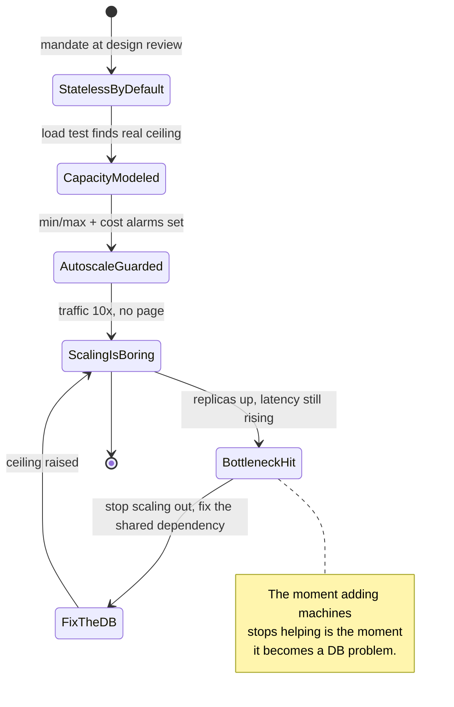
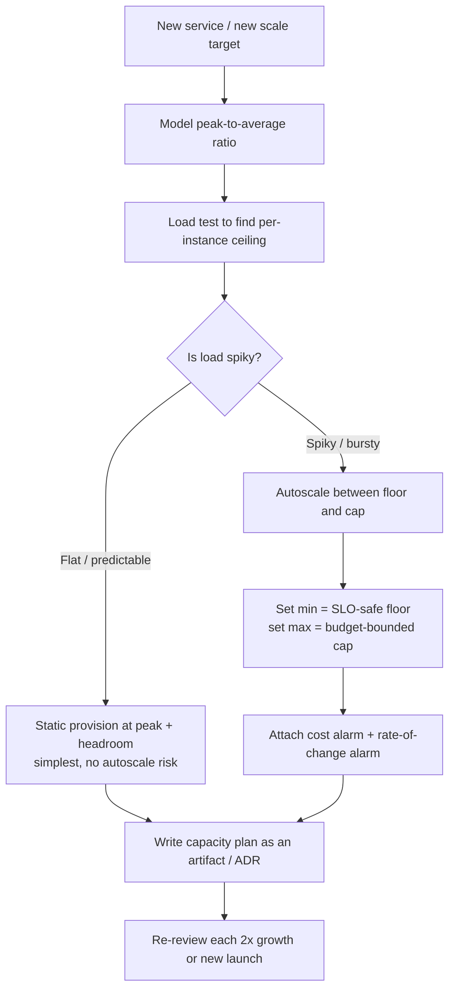
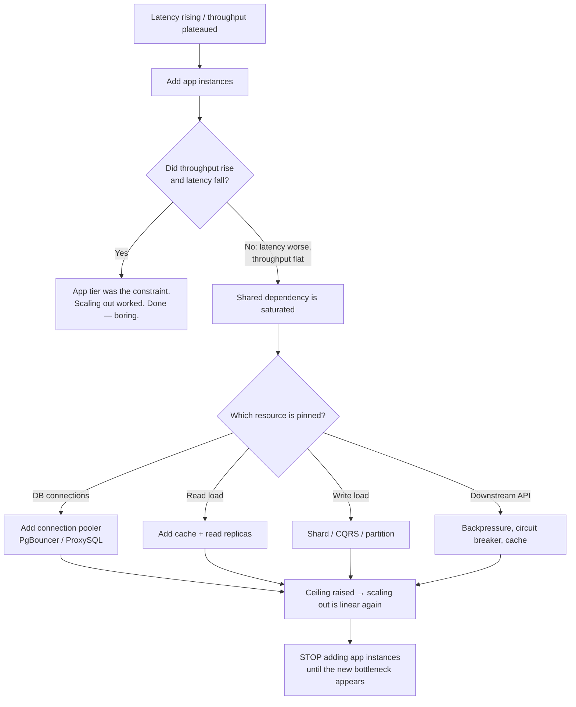
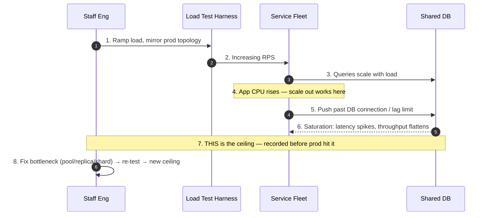

# Horizontal Scaling — Staff

> **Axis:** organizational scope & judgment — not deeper mechanism (that lives in `professional.md`).
> This file answers a different question than "how does auto-scaling work." It answers: how does a
> Staff/Principal engineer make horizontal scaling a **non-event** across dozens of services and years
> of growth — by mandating statelessness up front, planning capacity against cost rather than fear,
> and knowing the exact moment when adding machines stops helping and you must fix the bottleneck
> (usually the database) instead. Judgment over mechanism.

## Table of Contents
1. [The Staff Thesis: Scaling Should Be Boring](#1-the-staff-thesis-scaling-should-be-boring)
2. [Statelessness as an Architecture Mandate](#2-statelessness-as-an-architecture-mandate)
3. [Capacity Planning as a Cost Decision, Not a Fear Decision](#3-capacity-planning-as-a-cost-decision-not-a-fear-decision)
4. [Autoscaling: Scale-to-Zero vs Warm-Pool, and the Cloud-Bill Blast Radius](#4-autoscaling-scale-to-zero-vs-warm-pool-and-the-cloud-bill-blast-radius)
5. [Knowing When to Stop Scaling Out and Fix the Bottleneck](#5-knowing-when-to-stop-scaling-out-and-fix-the-bottleneck)
6. [Load-Testing to Find the Ceiling Before Production Does](#6-load-testing-to-find-the-ceiling-before-production-does)
7. [The Org Discipline of Statelessness](#7-the-org-discipline-of-statelessness)
8. [Second-Order Consequences and the Metrics You Watch](#8-second-order-consequences-and-the-metrics-you-watch)
9. [When NOT to Scale Horizontally](#9-when-not-to-scale-horizontally)
10. [Staff Checklist](#10-staff-checklist)

---

## 1. The Staff Thesis: Scaling Should Be Boring

The single most important thing a Staff engineer can say about horizontal scaling is that at a
healthy organization, **it is not an event**. When traffic doubles, someone raises a `maxReplicas`
number in a config file, the graph goes up, the bill goes up proportionally, and nobody is paged.
That boringness is not luck — it is the accumulated payoff of decisions made months or years earlier:
services were built stateless, session state was externalized, the database was sharded or fronted
with read replicas *before* it was the bottleneck, and a load test had already established the real
ceiling.

The failure mode looks different. In an unhealthy org, scaling is a heroic incident: a launch spikes
traffic, someone adds servers, and latency gets *worse* because every new server hammers the same
overloaded primary database. Or new servers can't take traffic because they need local session files
that only the old servers have. Or auto-scaling fires correctly but the cloud bill triples overnight
because a bad rule scaled a fleet of GPU instances to 400 and nobody set a ceiling.

The Staff job is to convert scaling from heroics into a non-event, and to do it across teams that
don't report to you. That is a **sociotechnical** problem, not a technical one. The mechanism of
adding a replica is trivial; the discipline that makes adding a replica *safe* is the hard part, and
it must be enforced organizationally.

---

## 2. Statelessness as an Architecture Mandate

Horizontal scaling works if and only if any request can be served by any instance. The instant an
instance holds state that a peer does not — an in-memory session, a local file upload, a sticky
counter, a warmed local cache that other nodes lack — you have coupled the request to the machine,
and adding machines no longer adds capacity linearly. Sticky sessions are the classic tell: they
turn a load balancer into a state-affinity router, and they make every deploy, every scale-in event,
and every instance failure a user-visible session loss.

The Staff mandate is simple to state and hard to enforce: **design every service stateless from day
one**, so that scaling is a config change rather than a re-architecture. Concretely this means:

- **Session state → external store.** Sessions live in Redis/Memcached or a signed cookie/JWT, never
  in process memory. The load balancer distributes freely; no stickiness required.
- **Uploads / temp files → object storage.** No request depends on a file written to a local disk by
  an earlier request that may have landed on a different node.
- **Local caches are optional accelerators, never sources of truth.** A cold instance must serve
  correct results; it may just be slower until its cache warms.
- **No in-process coordination.** Counters, rate-limit buckets, and locks live in a shared store
  (Redis, the database) so that N instances agree.

The reason this is a *day-one* mandate and not a *when-we-need-to-scale* task is that retrofitting
statelessness onto a mature service is one of the most expensive migrations there is. It touches the
session layer, the auth layer, the file-handling layer, and the deploy pipeline simultaneously, and
it usually cannot be done incrementally without a period of dual-writing state to both local and
external stores. Paying the small statelessness tax at design time buys you the right to treat
scaling as boring forever after. This is why statelessness belongs in the design-review checklist,
not in the incident retro.

---

## 3. Capacity Planning as a Cost Decision, Not a Fear Decision

Under-provisioning gets you paged; over-provisioning gets you a budget review. The junior instinct is
to provision for the worst case you can imagine — peak-of-peak, times a fear multiplier. The Staff
discipline is to treat capacity as an explicit cost/risk trade, modeled and written down, not
hand-waved.

The core numbers:

- **Peak-to-average ratio.** Most systems run 2–3× their daily average at peak; event-driven systems
  (ticket sales, sports, Black Friday) can spike 10–50×. Provisioning statically for peak means paying
  for idle capacity the other ~22 hours a day.
- **Headroom target.** From queueing theory (`professional.md`), latency degrades sharply as
  utilization approaches 1. Plan to run steady-state at 50–70% of capacity so a traffic bump or an
  instance failure doesn't tip you over the knee of the latency curve. That headroom is insurance you
  are deliberately buying.
- **The cost of a request.** Know your unit economics: dollars per 1M requests, per user, per GB
  egress. Without this you cannot reason about whether scaling out is the cheap fix or the expensive
  one.

The central insight is that **autoscaling is primarily a cost optimization**. If load were flat,
static provisioning would be simpler and equally safe. Autoscaling earns its complexity precisely
because load is spiky: it lets you pay for peak only during peak and shrink to a floor overnight. The
saving is real — for a 3× peak-to-average workload, autoscaling can roughly halve compute spend versus
provisioning for peak — but it is a *cost* lever first and a *reliability* lever second. Framing it as
"we autoscale so we never run out" invites the failure in the next section.

---

## 4. Autoscaling: Scale-to-Zero vs Warm-Pool, and the Cloud-Bill Blast Radius

Autoscaling policy is where cost, latency, and reliability collide, and it is where a single bad rule
can do more financial damage than a week of over-provisioning. Two axes matter.

**Scale-to-zero vs warm-pool (the floor decision).**

| Dimension | Scale-to-zero | Warm-pool (min replicas > 0) |
|---|---|---|
| Idle cost | Zero when no traffic | Pay for the floor 24/7 |
| Cold-start latency | Full spin-up on first request (seconds; worse for JVM/GPU/large images) | None — floor absorbs the first burst |
| Best fit | Dev/staging, internal tools, truly bursty low-traffic jobs, event-driven functions | User-facing production paths with an SLO |
| Failure mode | Cold-start storm when a burst hits an empty fleet; SLO miss on the burst edge | Wasted spend if the floor is set too high |
| Rule of thumb | Fine when a few seconds of first-request latency is acceptable | Required when P99 on the burst edge is user-visible |

The judgment: **user-facing production services should almost never scale to zero.** The cold-start
penalty lands exactly on the users who arrived during the surge — the worst possible time. Keep a warm
floor sized to absorb the initial burst while the autoscaler catches up. Reserve scale-to-zero for
environments where latency on the cold edge doesn't cost you anything.

**The blast radius of a bad autoscale rule (the ceiling decision).**

Autoscaling is one of the few systems where a config typo bills you in real dollars per minute.
Scaling *reactively* on the wrong signal, with no ceiling, is how orgs wake up to a 10× cloud bill:

- **Scaling on a symptom, not the cause.** If you scale on latency and the latency is caused by a slow
  *database*, adding app instances makes it worse (more connections hammering the same primary) *and*
  the autoscaler, seeing latency still high, keeps adding more. This is a positive-feedback runaway:
  the scaler fights a bottleneck it cannot fix, and the bill climbs while the SLO stays red.
- **No maximum.** `maxReplicas` is not optional — it is your financial circuit breaker. It bounds the
  worst-case bill from any bug, retry storm, or bot flood. An autoscaler without a cap is an unbounded
  liability.
- **Flapping.** Aggressive thresholds with no stabilization window cause scale-up/scale-down thrash,
  which on per-instance-hour billing (and on connection-pool warm-up) is pure waste.

Staff-level guardrails, non-negotiable: (1) a `maxReplicas` cap justified against the budget; (2) a
sensible floor for anything user-facing; (3) scale on a *leading, cause-aligned* signal (queue depth,
CPU, in-flight concurrency) rather than a lagging symptom that a shared dependency dominates; (4) a
stabilization/cooldown window to prevent flap; and (5) a **billing/rate-of-change alarm** so a runaway
pages a human within minutes, not at the end of the billing cycle.

---

## 5. Knowing When to Stop Scaling Out and Fix the Bottleneck

This is the highest-leverage judgment in the whole topic, and it is what separates a Staff engineer
from an engineer who just knows how to add replicas. **Horizontal scaling is linear only while the
resource you are adding is the constraint.** The moment the bottleneck moves to a *shared* resource
that every instance contends for — almost always the database, sometimes a cache, a queue, a
downstream third-party API, or a distributed lock — adding more app instances stops helping and often
actively hurts.

The signature is unmistakable once you know it: you add instances, throughput plateaus (or dips), and
latency keeps climbing. More app servers means more open connections to the primary DB, more lock
contention, more replication lag, more hot-partition pressure. You have scaled the stateless tier past
the point where the stateful tier can keep up, and every new machine is now part of the problem.

At that point the correct move is to **stop scaling out and fix the shared dependency**, typically via
the standard database-scaling ladder: connection pooling (PgBouncer/ProxySQL) to stop connection
exhaustion, then caching to remove read load, then read replicas for read-heavy workloads, then
sharding or CQRS for write-heavy ones. Throwing app instances at a database bottleneck is the most
common — and most expensive — anti-pattern in scaling.

| Approach | What it adds | When it wins | When it fails / hidden cost |
|---|---|---|---|
| **Scale up (vertical)** | Bigger box (CPU/RAM) | Fast stop-gap; stateful tiers that can't shard yet; low-effort headroom | Hard hardware ceiling; single point of failure; cost grows super-linearly at the top end; still one machine |
| **Scale out (horizontal)** | More identical instances | Stateless tier is the constraint; load is partitionable; need availability via redundancy | Linear **only** until a shared resource saturates; then it makes latency *worse* and multiplies DB connections |
| **Fix the bottleneck** | Pool / cache / replica / shard the shared dependency | Adding instances no longer raises throughput; DB is pegged | Highest engineering effort; touches data model; sometimes irreversible; but it is the *only* thing that raises the real ceiling |

The decision rule a Staff engineer teaches the org: **measure where the time and the saturation
actually are before adding capacity.** If the app tier is the constraint, scale out — it's cheap and
boring. If a shared dependency is the constraint, adding app instances is not just useless, it's
counterproductive; go fix the dependency. The bottleneck is a moving target, and the whole skill is
knowing which resource is currently pinned.

---

## 6. Load-Testing to Find the Ceiling Before Production Does

Every horizontally scaled service has a real ceiling — the point where a shared dependency saturates
and adding instances stops helping (Section 5). The only question is whether you discover that ceiling
in a controlled load test or during a production incident with users watching. The Staff mandate is to
find it deliberately.

A useful load test answers three concrete questions:

1. **What is the throughput ceiling of a single instance?** This is the number that turns capacity
   planning from guesswork into arithmetic: fleet capacity ≈ per-instance ceiling × instance count ×
   headroom factor.
2. **Where does the system break, and what breaks first?** Ramp load until something fails, and record
   *which* resource saturated — CPU on the app tier (good: scale out), or DB connections / replication
   lag / lock contention (the real ceiling: scaling out won't help). This is how you locate the
   bottleneck of Section 5 *before* it locates you.
3. **Does autoscaling actually keep up?** A ramp test validates that the autoscaler adds capacity fast
   enough, that cold-start latency on the burst edge is acceptable, and that scale-in doesn't drop
   in-flight requests. Testing the *policy*, not just the code, is what makes scaling boring.

Test types map to distinct risks: a **load test** confirms steady-state capacity; a **stress test**
finds the breaking point and the first-failing resource; a **spike test** validates autoscaler
reaction time and warm-pool sizing; and a **soak test** surfaces slow leaks (memory, connection,
file-descriptor) that only appear after hours and would otherwise page you at 3 a.m. on day three of a
launch.

The organizational discipline: load-test **before** the launch that needs the capacity, in an
environment that mirrors production topology (same DB tier, same connection limits, same instance
type), and re-run it at each ~2× growth checkpoint because the bottleneck *moves* as you scale. A
capacity number without a load test behind it is a hope, and hope is not a capacity plan.

---

## 7. The Org Discipline of Statelessness

Statelessness (Section 2) is not a one-time architecture decision; it is a discipline that erodes the
moment nobody is guarding it. Any single engineer, under deadline pressure, can reintroduce state — a
quick in-memory cache "just for now," a sticky session to ship a feature faster, a local temp file
because object storage felt like overkill for a prototype. Each of these is individually reasonable and
collectively fatal to boring scaling. The Staff role is to make statelessness a **default that survives
turnover and deadline pressure**, which is an organizational job, not a technical one.

The levers that make it durable:

- **Encode it in the platform, not in tribal knowledge.** If the service template, the standard
  framework, and the paved-road deployment already externalize sessions and forbid local writable
  disk, engineers get statelessness for free and have to work to break it. Defaults beat documentation.
- **Catch it at design review.** "Where does state live, and can any instance serve any request?" is a
  standing question on the review checklist. This is where retrofits get prevented, at the cost of one
  question.
- **Make regressions visible.** Sticky-session usage, local-disk writes, and instance-affinity should be
  observable and alertable — a service that suddenly needs affinity has quietly become un-scalable, and
  you want to know before the next scale-in event proves it.
- **Test scale-in, not just scale-out.** The cruel test of statelessness is *removing* an instance
  under load. Chaos-style instance termination in staging (and eventually production) proves that
  losing a node loses no state and no in-flight work. A fleet that survives scale-in survives
  everything.

The reason this deserves a Staff engineer's attention rather than a lint rule is Conway's Law:
statelessness is a property of how the whole org builds services, and it holds only if the platform,
the review culture, and the incentives all point the same way. When they do, scaling stays boring for
years. When they don't, you rediscover state the hard way — mid-incident, during the launch you were
trying to survive.

---

## 8. Second-Order Consequences and the Metrics You Watch

Horizontal scaling done well is invisible; done badly, its damage shows up months later and one layer
away from where the decision was made. The Staff engineer's job is to anticipate the downstream
effects and instrument the leading indicators.

**Second-order consequences:**

- **The bottleneck simply relocates.** Successfully scaling the app tier pushes the constraint onto the
  database, then the cache, then a downstream API, then service discovery, then the load balancer's own
  connection table. Every scaling win creates the next scaling problem one layer down. Expecting this is
  the difference between a plan and a surprise.
- **Cost scales linearly with instances but value often doesn't.** Doubling the fleet doubles the bill;
  it only doubles *served value* while the app tier is the constraint. Past the ceiling, you are paying
  linearly for zero marginal throughput — the most expensive way to fail to fix a database.
- **Connection amplification.** Each app instance opens a pool to the DB. Scaling the app tier 10×
  multiplies DB connections 10×, and databases have hard connection limits far below where CPU or
  memory would cap them. This is why "just add app servers" so often ends in connection exhaustion, and
  why a connection pooler is frequently the real fix.
- **Deploy and blast-radius surface grows.** More instances means more deploy churn, more nodes that can
  drift, and a larger surface for a bad config to fan out across. Statelessness keeps this manageable;
  without it, every deploy risks session loss.

**The metrics that tell you the decision is going wrong:**

- **Throughput per instance trending down** as fleet grows → you've passed the ceiling; the bottleneck
  is shared, not local. Stop scaling out.
- **DB connection count / connection-wait time / replication lag climbing with fleet size** → the
  amplification effect; pool or replicate before adding more app instances.
- **Cost per request rising** while RPS is flat or falling → autoscaling is fighting a bottleneck it
  can't fix, or a runaway rule; check the ceiling and the cap.
- **Cold-start rate on the burst edge** → warm-pool floor is too low for your spike profile.
- **Autoscale flap frequency** → thresholds too tight; add a stabilization window.

The single most diagnostic metric is **throughput-per-instance versus fleet size**: while it's flat,
scaling out is honest and linear; the moment it bends downward, you are burning money to make latency
worse, and it's time to fix the dependency instead.

---

## 9. When NOT to Scale Horizontally

Horizontal scaling is the default answer at scale, but a Staff engineer earns trust by naming the cases
where it is the *wrong* answer and a less experienced engineer over-engineers past a simpler fix.

- **The bottleneck is a shared, unscalable dependency.** If the DB, a single third-party API, or a
  distributed lock is pinned, more app instances make it worse (Section 5). Scale out only what is
  actually the constraint.
- **The workload isn't partitionable.** Some computations are inherently serial or require global
  state/ordering. If work can't be split, more machines just sit idle contending on the shared step.
  Fix the algorithm or the data model first.
- **Vertical scaling is the cheaper, faster stop-gap.** For a stateful component that can't yet shard,
  or when you need headroom *this week*, a bigger box is often the right pragmatic move — buying time to
  do the harder horizontal work properly rather than shipping a broken shard scheme under pressure.
- **The traffic doesn't justify it.** A low-traffic internal tool does not need a multi-instance
  autoscaling fleet; that's operational overhead and cost with no benefit. Match the mechanism to the
  scale.
- **State can't be externalized cheaply.** If a service is deeply stateful and making it stateless is a
  months-long migration, the honest short-term answer may be to scale up and schedule the statelessness
  work deliberately — not to fake horizontal scaling with sticky sessions, which gets you the cost of
  scaling out with none of the benefits.

The through-line: horizontal scaling is a tool for a *stateless, partitionable, app-tier-bound*
workload. When any of those three conditions is false, adding machines is the expensive way to avoid
the real fix.

---

## 10. Staff Checklist

- [ ] **Statelessness is a design-review gate**, not an afterthought: sessions externalized, no local
      writable disk, no in-process coordination — enforced in the service template, not just docs.
- [ ] **Capacity plan is a written artifact** (ADR): peak-to-average ratio, per-instance ceiling from a
      load test, headroom target, and the cost model behind the numbers.
- [ ] **Autoscaling has a `maxReplicas` cap** justified against budget — the financial circuit breaker —
      plus a warm floor for user-facing paths and a stabilization window against flap.
- [ ] **Autoscaling scales on a cause-aligned signal**, never a lagging symptom a shared dependency
      dominates; a billing/rate-of-change alarm pages a human on runaway within minutes.
- [ ] **Scale-to-zero is reserved for non-user-facing environments**; production burst edges are
      absorbed by a warm pool, not paid for in cold-start latency.
- [ ] **The team knows the stop-scaling-out rule**: measure which resource is pinned; if it's the DB or
      any shared dependency, fix it (pool → cache → replica → shard) rather than adding app instances.
- [ ] **The real ceiling was found by load test before the launch that needs it**, in prod-mirroring
      topology, re-run at each 2× growth checkpoint because the bottleneck moves.
- [ ] **Scale-in is tested** (chaos instance termination): losing a node loses no state and no in-flight
      work.
- [ ] **Throughput-per-instance vs fleet size is dashboarded** as the leading indicator that scaling out
      has stopped being honest.
- [ ] **A "when NOT to scale horizontally" note exists** so the org doesn't cargo-cult autoscaling onto
      unpartitionable workloads or DB-bound bottlenecks.

*Next step:* [Horizontal Scaling — Interview](interview.md)
