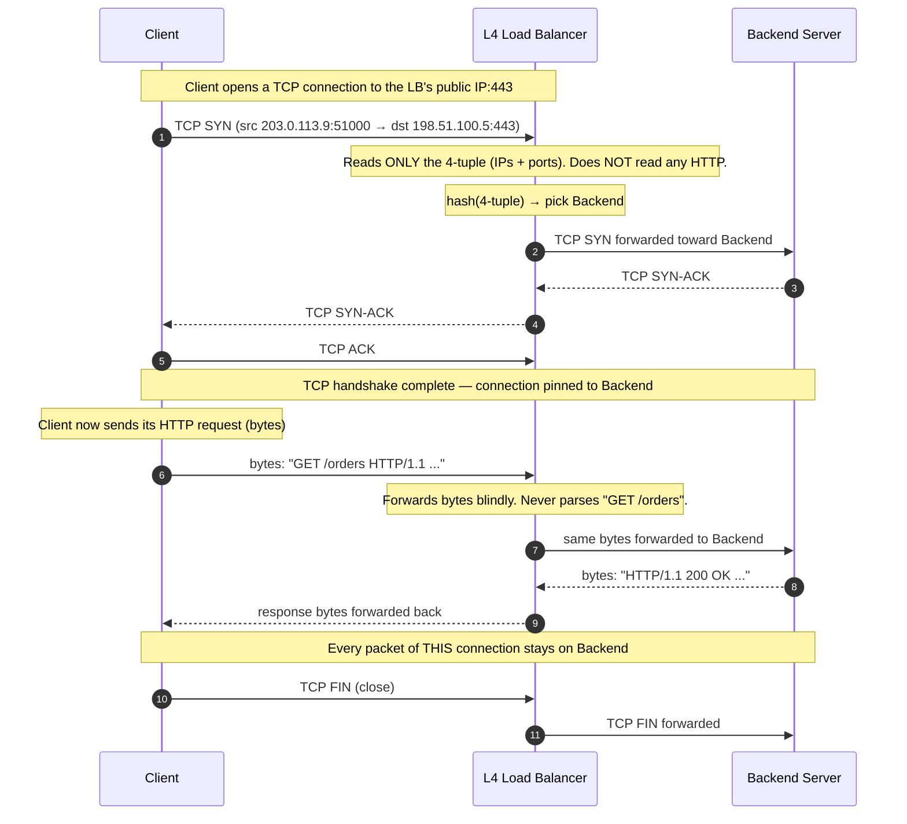

# Layer 4 Load Balancing — Junior

<!-- level-focus -->
At junior level, focus on this question:

> How can I apply **Layer 4 Load Balancing** in one small example and prove the result?

Use the smallest realistic scenario that exposes the decision and its failure behavior.
---

## 1. What Is Layer 4 Load Balancing?

A **load balancer** sits between clients and a pool of backend servers and spreads incoming traffic across them, so no single server is overwhelmed and the pool as a whole can handle more work than any one machine.

The "**Layer 4**" part tells you *how much of the traffic the balancer inspects before deciding where to send it.* Layer 4 refers to the **transport layer** of the network stack — the layer of TCP and UDP. An L4 load balancer makes its routing decision using only what lives at that layer:

- the **source IP** and **source port** (who is calling),
- the **destination IP** and **destination port** (what they are calling),
- the **protocol** (TCP or UDP).

It does **not** open the payload. It never sees the HTTP method, the URL path, the cookies, the `Host` header, or the request body. To an L4 balancer, a connection is an opaque pipe of bytes flowing between an (IP, port) on one side and an (IP, port) on the other. It picks a backend, wires the two ends together, and then just shovels bytes back and forth.

Think of a huge office building with one front desk. A **Layer 4** receptionist looks only at the envelope: "This is addressed to the 5th floor" — and forwards it up without opening it. A **Layer 7** receptionist would open the letter, read "I need the billing department," and route based on the content. L4 is faster because it never opens anything; it just reads the address on the outside.

You have relied on L4 load balancing every time you have used a large service. When millions of connections hit a service like a game server, a database front end, or the entry point of a huge website, an L4 balancer is frequently the very first thing that catches those connections and fans them out to the fleet behind it.

---

## 2. The OSI Model in One Picture

Networking is described as a stack of **layers**, each adding one envelope around the one below it. The OSI model has seven layers; for load balancing, two matter:

| Layer | Name | Example unit | What lives here |
|-------|------|--------------|-----------------|
| 7 | Application | HTTP request, gRPC call | URL path, headers, cookies, JSON body |
| 6 | Presentation | — | encoding, TLS encryption |
| 5 | Session | — | session setup/teardown |
| **4** | **Transport** | **TCP segment / UDP datagram** | **source/dest ports, TCP flags, sequence numbers** |
| 3 | Network | IP packet | source/dest **IP addresses** |
| 2 | Data link | Ethernet frame | MAC addresses |
| 1 | Physical | bits on the wire | electrical/optical signals |

The key insight: **each layer wraps the one above it.** When your browser sends an HTTP request (Layer 7), that request is placed inside a TCP segment (Layer 4), which is placed inside an IP packet (Layer 3), and so on. The outer envelopes (IP + port) are cheap to read. The inner content (the HTTP request) requires unwrapping and parsing multiple layers.

An **L4 load balancer reads the Layer 3 + Layer 4 envelopes** — the IP addresses and ports — and stops there. That is precisely why it is fast: it never pays the cost of unwrapping to Layer 7. An **L7 load balancer** (covered in the next topic) unwraps all the way up and reads the HTTP inside.

> 📚 **Learn the fundamentals:** [Cloudflare — What is the OSI model?](https://www.cloudflare.com/learning/ddos/glossary/open-systems-interconnection-model-osi/) · [MDN — Overview of the HTTP model](https://developer.mozilla.org/en-US/docs/Web/HTTP/Overview)

---

## 3. What "Routing by IP and Port" Actually Means

Every network connection is identified by a **4-tuple**: `(source IP, source port, destination IP, destination port)`. This 4-tuple uniquely names one flow of traffic between two machines.

When a client connects to your service, the client picks a random high-numbered source port, and connects to your service's public IP on a well-known destination port (443 for HTTPS, 5432 for PostgreSQL, and so on). The L4 load balancer owns that public IP. It receives the connection and must answer one question: **which backend server should this connection go to?**

To decide, it uses only the 4-tuple. A common approach is to hash the tuple and use the result to pick a backend, or simply hand each new connection to the next server in rotation (round robin). Whatever the algorithm, the input is the same small set of numbers — IPs and ports — and nothing more.

```text
Client (203.0.113.9 : 51000)  ─────►  LB public IP (198.51.100.5 : 443)

L4 LB sees only:
  source IP   = 203.0.113.9
  source port = 51000
  dest IP     = 198.51.100.5
  dest port   = 443
  protocol    = TCP

Decision:  hash(4-tuple) → Backend #2   (10.0.0.12 : 443)
```

Because the decision depends only on the tuple, **every packet of the same connection deterministically lands on the same backend** — the balancer does not need to "remember" much, and it can process traffic at wire speed.

---

## 4. What L4 Sees vs What It Cannot See

This table is the heart of the topic. L4's speed and its limitations both come directly from this short list.

| The L4 load balancer **CAN** see | The L4 load balancer **CANNOT** see |
|----------------------------------|-------------------------------------|
| Source and destination IP addresses | The URL path (`/login`, `/api/v2/orders`) |
| Source and destination ports | The HTTP method (`GET`, `POST`) |
| Protocol (TCP vs UDP) | HTTP headers, `Host`, cookies |
| TCP flags (SYN, ACK, FIN) and connection state | The request body / JSON payload |
| Rough byte volume of the connection | The response status code (`200`, `500`) |
| Whether the connection is up or torn down | Anything encrypted inside TLS |

The consequences follow directly:

- L4 **cannot** send `/images/*` to one server pool and `/api/*` to another — it has no idea what the path is.
- L4 **cannot** route based on the user's cookie or login state — it never reads cookies.
- L4 **cannot** retry a single failed HTTP request on another backend — it doesn't know where one request ends and the next begins inside the byte stream.
- L4 **can** happily balance *any* TCP/UDP protocol — HTTP, a database wire protocol, a game server, raw TCP — because it doesn't need to understand the protocol at all. It just moves bytes.

That last point is why L4 is called **protocol-agnostic**: it works the same whether the pipe carries HTTP, PostgreSQL, MQTT, or a custom binary game protocol.

---

## 5. Walkthrough: A TCP Connection Through an L4 Load Balancer

Let us trace one TCP connection end to end. The client wants to talk to your service; the L4 balancer's job is to pick a backend and then get out of the way.



Read the diagram carefully and notice three things:

1. **The decision happens once, at connection setup (step 3).** The balancer picks Backend #2 from the 4-tuple during the handshake. After that, the choice is fixed for the life of the connection.
2. **The `GET /orders` request in step 8 is invisible to the balancer.** By the time the HTTP request arrives, the connection is already pinned to Backend #2. The balancer forwards those bytes without ever parsing them. It literally cannot route `/orders` differently from `/login` — both ride the same already-chosen pipe.
3. **All subsequent packets follow the same path.** Whether the client sends one request or a hundred over this connection, they all go to Backend #2, because they all share the same 4-tuple.

This is the whole model. The balancer is a **connection switchboard**: it wires each new connection to a backend based on the address, then relays bytes without understanding them.

---

## 6. Connections, Not Requests: The Key Idea

The single most important distinction at this level: **an L4 load balancer balances connections, not requests.**

A modern HTTP client often reuses one TCP connection to send many requests (HTTP keep-alive). Because L4 picks a backend *per connection*, **all of those requests land on the same backend**, even if one backend is now much busier than the others.

```text
One TCP connection carrying three HTTP requests:

  Request 1: GET /home      ─┐
  Request 2: POST /checkout  ├─ all forced onto Backend #2 (same connection)
  Request 3: GET /profile   ─┘

L4 cannot split these across backends — it never sees the request boundaries.
```

Contrast this with an L7 load balancer, which *does* see request boundaries and can send each of those three requests to a different backend. That extra ability is exactly what L4 trades away for speed.

This is why L4 balancing is described as **coarse-grained** (per-connection) and L7 as **fine-grained** (per-request). Neither is "better" — they operate at different granularities for different jobs.

---

## 7. L4 vs L7 at a Glance

You will meet Layer 7 load balancing in the next topic. Here is the basic contrast so the L4 mental model has something to stand against.

| Aspect | Layer 4 (Transport) | Layer 7 (Application) |
|--------|---------------------|------------------------|
| Inspects | IP + port only (the 4-tuple) | Full HTTP: URL, headers, cookies, body |
| Balances | Connections | Individual requests |
| Speed | Very fast (no parsing) | Slower (parses each request) |
| Protocol support | Any TCP/UDP protocol | Mainly HTTP(S), gRPC, WebSocket |
| Content-based routing | No — it's "blind" to content | Yes — route `/api/*` vs `/img/*` |
| Can retry a failed request | No | Yes — request-aware |
| Sees data encrypted in TLS | No (unless it terminates TLS) | Yes (it must terminate TLS to read HTTP) |
| Typical mental model | A fast, dumb switchboard | A smart, content-aware router |

The one-line summary: **L4 is fast and universal but blind; L7 is smart and HTTP-aware but does more work per request.**

---

## 8. Why "Blind" Is Often a Feature

It is tempting to read "L4 can't see the content" as a weakness. Often it is exactly what you want:

- **Raw speed and scale.** Skipping HTTP parsing means an L4 balancer can push enormous connection and packet volumes with tiny CPU cost. When the only job is "spread these connections evenly," paying to parse HTTP would be wasted work.
- **Works with anything.** A database, a message broker, a game server, or a custom binary protocol has no HTTP to read. L4 balances all of them identically because it never assumed HTTP in the first place.
- **Privacy and simplicity.** Because L4 never unwraps TLS, encrypted traffic can pass straight through to the backend, which does its own TLS termination. The balancer touches no sensitive content and needs no certificates.

So the right way to hold the model is not "L4 is limited" but "**L4 does less on purpose, and that restraint is what makes it fast and universal.**" You reach for L7 only when you specifically need content-based decisions.

---

## 9. Common Misconceptions

1. **"L4 reads the URL to route."** No. It never sees the URL. If you need to route by path or host, you need L7.
2. **"L4 balances each request separately."** No. It balances *connections*. Many requests on one keep-alive connection all go to the same backend.
3. **"L4 decrypts HTTPS."** No. A pure L4 balancer passes encrypted bytes through untouched; it doesn't (and can't) read what's inside TLS.
4. **"L4 only works for HTTP."** The opposite — L4 works for *any* TCP/UDP protocol precisely because it ignores the protocol's content.
5. **"L4 is old / worse than L7."** Neither is obsolete. They solve different problems at different layers, and large systems commonly use both together (L4 in front, L7 behind).

---

## 10. Key Terms

| Term | Definition |
|------|-----------|
| Layer 4 (Transport) | The OSI layer of TCP and UDP; deals in ports and connection state, not application content |
| 4-tuple | `(source IP, source port, dest IP, dest port)` — uniquely identifies one connection/flow |
| Protocol-agnostic | Works for any TCP/UDP traffic because it never inspects the application protocol |
| Connection | A single TCP session between client and backend; L4 balances at this granularity |
| Backend / upstream | One of the pool of servers the load balancer distributes traffic to |
| TLS pass-through | Forwarding encrypted bytes to the backend without decrypting them at the balancer |
| Keep-alive | Reusing one TCP connection for many HTTP requests; on L4 they all share one backend |

---

## 11. Hands-On Exercise

**Goal:** Cement the "sees the envelope, not the letter" model with a paper walkthrough — no tools required.

1. Draw one client, one L4 load balancer, and three backend servers. Give the client an IP and a random source port; give the balancer a public IP on port 443; give each backend an internal IP.
2. Draw a client TCP SYN arriving at the balancer. Beside it, write the **exact list of fields the balancer is allowed to read** to make its decision. Confirm the HTTP request is *not* on that list.
3. Pick a backend using `hash(4-tuple) mod 3`. Draw the connection being pinned to that backend.
4. Now have the client send **three** HTTP requests over the same connection: `GET /home`, `POST /checkout`, `GET /profile`. Draw where each one goes. Convince yourself all three land on the same backend, and write one sentence explaining *why the balancer cannot split them*.
5. Finally, write down one routing rule you'd *want* here (e.g., "send `/checkout` to the payments pool") and note why an L4 balancer cannot do it — and which layer you'd need instead.

If your diagram shows all three requests on one backend and you can explain that the balancer never read the paths, you have the junior-level mental model correct.

---

*Next step:* [Layer 4 Load Balancing — Middle](middle.md)

---

## Apply it

1. Choose one small, known input for **Layer 4 Load Balancing**.
2. Predict the output or observable behavior.
3. Run the smallest example or probe that exercises the concept.
4. Change one input to trigger a failure or boundary case.
5. Explain the evidence using the guide's vocabulary.

## Verify your work

- Record the exact input, command or code path, and output.
- Repeat the probe and confirm the result is consistent.
- Show one expected success and one expected failure.
- Resolve any difference between the prediction and the evidence.

## Review questions

- What problem does Layer 4 Load Balancing solve in the example?
- Which input changes the observed result, and why?
- What is the smallest useful success check?
- Which beginner mistake would your evidence catch?
