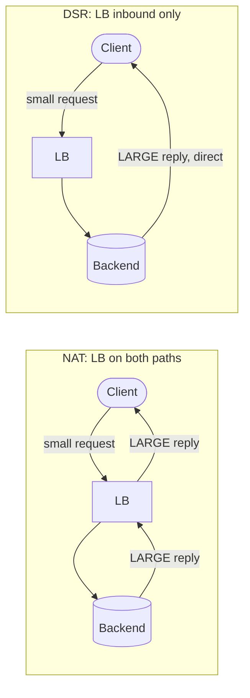

# Layer 4 Load Balancing — Middle

<!-- level-focus -->
At middle level, focus on this question:

> Where does **Layer 4 Load Balancing** belong in a maintainable component, and which trade-off selects the design?

Use the smallest realistic scenario that exposes the decision and its failure behavior.
## 1. What "Layer 4" Actually Means on the Wire

A **Layer 4 load balancer** makes its forwarding decision using only the transport-layer
addressing: the 5-tuple of `(protocol, source IP, source port, destination IP, destination
port)`. It does **not** parse the application payload — it never reads the HTTP method, the
`Host` header, the URL path, or the TLS SNI. To an L4 balancer a connection is an opaque pipe
of bytes; it decides *once*, when the connection is established, which backend gets the whole
flow, and then it just shuttles packets.

That single constraint is the source of every property in this file:

- **It is fast and cheap.** No payload parsing, no HTTP state machine, no per-request buffering.
  A software L4 balancer forwards packets in the kernel; a hardware/ASIC one forwards at line
  rate. Throughput is measured in millions of packets per second and tens of Gbit/s per node.
- **It is protocol-agnostic.** Because it never inspects the payload, it balances *anything*
  that runs over TCP or UDP — HTTP, gRPC, MQTT, PostgreSQL wire protocol, game traffic, DNS,
  QUIC — with no protocol-specific configuration.
- **It cannot do content routing.** No path-based routing (`/api` → pool A), no cookie-based
  stickiness, no header rewriting, no TLS termination. Those are Layer 7 jobs. An L4 balancer's
  affinity granularity is the *whole connection*, not the request.

Contrast with an L7 balancer, which terminates the TCP/TLS connection, reads the HTTP request,
and can route per-request. L4 trades that intelligence for raw speed and generality. The two
are frequently stacked: an L4 balancer spreads connections across a fleet of L7 balancers,
which then do the smart per-request routing.

---

## 2. The Core Question: How Does the Reply Get Back?

Everything interesting about L4 load balancing reduces to one question: **when a backend
finishes serving a packet, what path does the reply take back to the client?**

There are two answers, and they define the two forwarding modes you must know:

- **NAT mode** — the reply comes *back through the load balancer*. The LB sits on both the
  inbound and outbound path. It rewrites addresses in both directions so the client and the
  backend each see a consistent conversation.
- **Direct Server Return (DSR)** — the reply goes *straight from the backend to the client*,
  bypassing the load balancer entirely. The LB is only on the inbound (client → backend) path.

The reason this matters so much is **traffic asymmetry**. In most real workloads the response
is far larger than the request: a 200-byte HTTP `GET` returns a 2 MB image; a 100-byte video
request returns a multi-megabyte segment. If the reply must traverse the balancer (NAT), the
balancer's bandwidth budget is dominated by the large egress direction. If the reply bypasses
the balancer (DSR), the balancer only handles the small inbound direction and can front far
more backends with the same hardware.



Hold onto this: **NAT sees both directions; DSR sees only the inbound direction.** The rest of
this file is the mechanics and consequences of that split.

---

## 3. Forwarding Mode 1 — NAT (Both Directions Through the LB)

In **NAT mode** (also called "full NAT" or, in IPVS terms, **masquerading**), the load
balancer rewrites IP addresses so that it sits transparently in the middle of the flow.

The mechanics, packet by packet:

- **Inbound (client → LB → backend).** A packet arrives at the LB destined for the *virtual IP*
  (VIP) — the public service address. The LB picks a backend and **rewrites the destination IP**
  from the VIP to the chosen backend's real IP. In *full* NAT it may also rewrite the *source*
  IP to its own address (source NAT / SNAT), so the backend replies to the LB rather than to
  the client. It forwards the rewritten packet.
- **Backend processing.** The backend sees a packet addressed to its own real IP and processes
  it normally. With full NAT, it sees the *load balancer's* IP as the source, not the client's.
- **Outbound (backend → LB → client).** The backend sends its reply back to the source it saw —
  the LB. The LB looks up its connection-tracking table, **reverses the rewrite** (source IP
  back to the VIP, destination back to the client), and forwards the reply to the client.

Because the LB touches both directions, it must keep per-connection state (see §6) and it
carries the full egress bandwidth. This is the simplest mode to deploy: backends need no special
configuration, they can live on a different subnet from the LB, and it works across L3 boundaries
(routed networks). It is the default in most managed L4 balancers and in IPVS `-m` (masq) mode.

```text
NAT (full) rewrite, one TCP connection:

  Client 203.0.113.7:51000  ── dst=VIP 198.51.100.9:443 ──▶  LB
  LB rewrites:  src=LB_10.0.0.1:PORT   dst=Backend_10.0.0.21:443
  Backend replies:  src=10.0.0.21:443  dst=LB_10.0.0.1:PORT
  LB reverses:  src=VIP 198.51.100.9:443   dst=203.0.113.7:51000  ──▶ Client

  Backend sees source = 10.0.0.1 (the LB), NOT 203.0.113.7 (the client).
  → client IP is LOST at the backend unless preserved out-of-band (see §7).
```

There is a lighter variant, **half-NAT / DNAT-only**, where the LB rewrites only the
destination and leaves the source as the client. That preserves the client IP but requires the
return traffic to still route back through the LB (usually because the LB is the backends'
default gateway), so it also keeps both directions — with different trade-offs on client-IP
visibility.

---

## 4. Forwarding Mode 2 — Direct Server Return (DSR)

**Direct Server Return** (a.k.a. **DR** — direct routing, IPVS `-g`/gateway mode) removes the
load balancer from the return path entirely. The reply goes straight from backend to client.

The classic implementation is **MAC-address rewriting (L2 DSR)**:

- The client sends to the VIP. The LB receives the packet and, crucially, **does not touch the
  IP header** — the destination IP stays as the VIP. Instead it rewrites only the **destination
  MAC address** to the chosen backend's MAC and forwards the frame on the local L2 segment.
- Each backend is configured with the **VIP bound to a loopback (or dummy) interface** so it
  *accepts* packets addressed to the VIP, but it must be configured **not to ARP** for the VIP
  (otherwise multiple machines answer for the same IP and the network breaks). On Linux this is
  the `arp_ignore`/`arp_announce` sysctl dance.
- The backend processes the request and replies with **source IP = VIP** (because that is the
  destination the client used) directly to the client's IP. The reply never touches the LB.

Because the IP header is untouched, the backend sees the **real client source IP** natively —
no PROXY protocol needed for client IP in pure DSR. But L2 DSR has a hard constraint: the LB and
all backends must share the same **Layer 2 segment** (same VLAN), because MAC rewriting only
works within a broadcast domain.

To cross L3 boundaries there is **L3 DSR / IP-in-IP (or GRE) tunneling**: the LB encapsulates the
original packet inside an outer IP packet addressed to the backend (IPVS `-i`/tunnel mode). The
backend decapsulates, recovers the original VIP-destined packet, and replies directly to the
client. This is how DSR works across subnets and is the model behind large cloud L4 balancers.

```text
L2 DSR (direct routing), one TCP connection:

  Client 203.0.113.7:51000 ── dst_IP=VIP 198.51.100.9:443 ──▶ LB
  LB rewrites ONLY dst_MAC → Backend's MAC.  dst_IP stays = VIP.
  Backend (VIP on loopback, arp_ignore) accepts it, sees src = 203.0.113.7 (real client).
  Backend replies:  src=VIP 198.51.100.9:443  dst=203.0.113.7:51000  ── DIRECT ──▶ Client

  LB never sees the (large) reply. Client IP preserved natively.
  Constraint: LB + backends on same L2 segment (or use IP-in-IP/GRE for L3 DSR).
```

---

## 5. NAT vs DSR — The Return-Path Diagram

The sequence below traces the same request under both modes so the asymmetry is visible. Watch
which participant the reply arrows point at.

```mermaid
sequenceDiagram
    autonumber
    participant C as Client
    participant LB as L4 Load Balancer
    participant B as Backend

    Note over C,B: --- NAT mode (LB on both paths) ---
    C->>LB: 1. request → dst=VIP
    LB->>B: 2. rewrite dst→backend IP (and src→LB); forward
    B->>LB: 3. reply → back to LB (backend saw LB as source)
    LB->>C: 4. LB reverses rewrite; reply → client
    Note over LB: LB carries the large egress reply + holds conntrack state

    Note over C,B: --- DSR mode (LB inbound only) ---
    C->>LB: 5. request → dst=VIP
    LB->>B: 6. rewrite dst MAC only; dst IP stays = VIP
    B-->>C: 7. reply src=VIP → DIRECT to client (bypasses LB)
    Note over LB: LB never sees the reply; backend sees real client IP
```

Steps 3–4 vs step 7 are the whole story. In NAT, two arrows return through the LB (steps 3 and
4). In DSR, a single arrow (step 7) skips the LB completely. That difference decides bandwidth
budget, state cost, client-IP visibility, and network-topology requirements — quantified in §9.

---

## 6. Connection Tracking: The State That Makes It Work

An L4 balancer picks a backend **once per connection**, then must send *every subsequent packet
of that connection to the same backend*. TCP is stateful — a mid-stream packet routed to a
different backend would land on a machine with no matching socket and be reset. So the balancer
maintains a **connection tracking table** (conntrack): a map from the flow 5-tuple to the chosen
backend (plus, in NAT mode, the address translations to apply in each direction).

Key properties:

- **One entry per active connection.** A table entry holds the 5-tuple, the backend, TCP state,
  timestamps, and (for NAT) the rewrite tuples. At scale this is millions of entries consuming
  RAM; conntrack table exhaustion is a classic L4 failure mode (new connections dropped while
  the table is full). Sizing and idle-timeout tuning (`nf_conntrack_max`, TCP timeouts) is real
  operational work.
- **NAT needs full state; DSR needs less.** NAT must remember the reverse translation to fix up
  return packets, so it is inherently stateful in both directions. DSR still needs the *inbound*
  mapping (so all packets of a flow hit the same backend) but never processes the return path,
  so its per-connection cost is lighter.
- **State is a failover liability.** If the balancer restarts or fails over to a peer, in-flight
  connections whose entries are lost will break (RST) unless state is **synchronized** between
  balancer nodes (e.g., conntrackd, IPVS connection sync via multicast). High-availability L4
  pairs replicate their conntrack tables so a standby can take over live connections.
- **Stateless hashing as an alternative.** Some designs avoid a per-flow table by computing the
  backend as `hash(5-tuple) mod N` on every packet — no state to lose, trivially failover-safe.
  The catch: when the backend set changes (`N` changes), plain modulo remaps most flows and
  breaks them. Production systems use **consistent hashing / Maglev hashing** so adding or
  removing one backend disturbs only ~`1/N` of flows. This is how Google Maglev and AWS NLB
  achieve connection stability without heavyweight shared state.

---

## 7. Preserving the Client IP (Why L4 Needs PROXY Protocol)

Backends frequently need the **real client IP** — for geo-routing, rate limiting, audit logs,
abuse detection, and access-control rules. How well an L4 balancer preserves it depends entirely
on the forwarding mode:

- **DSR (L2 or tunneled):** the IP header is never rewritten, so the backend sees the real client
  IP **natively**. No extra mechanism needed for client IP.
- **Half-NAT / DNAT-only:** only the destination is rewritten; the source stays the client, so
  the client IP is preserved (at the cost of forcing return traffic back through the LB).
- **Full NAT (SNAT):** the balancer rewrites the source to its own IP, so the backend sees the
  *balancer's* IP. The real client IP is **lost** on the wire.

Here is the crux for L4: **an L4 balancer cannot inject an `X-Forwarded-For` header.** That
header is an *HTTP* (Layer 7) construct, and an L4 balancer does not parse or modify the
application payload — doing so would require terminating and re-parsing the connection, which is
exactly what makes it an L7 proxy. So the L7 trick of "just add `X-Forwarded-For`" is unavailable.

The L4 answer is the **PROXY protocol** (HAProxy's specification). Instead of touching the
application payload, the balancer prepends a small **header block at the very start of the TCP
connection**, *before* any application bytes, carrying the original source and destination
IP/port. The backend must be configured to *expect and parse* this preamble, strip it, and use
it as the real client address.

```text
PROXY protocol v1 (human-readable) example, sent as the FIRST bytes of the connection:

  PROXY TCP4 203.0.113.7 198.51.100.9 51000 443\r\n
  <then the normal application bytes: the real HTTP request, TLS ClientHello, etc.>

  Fields: family, src IP, dst IP, src port, dst port.
  v2 is a compact binary variant (fixed 12-byte signature + addresses) — preferred at scale.

  Both sides must agree: LB adds the header, backend parses+strips it.
  If a backend that does NOT expect PROXY protocol receives it, it treats "PROXY ..."
  as garbage application input → parse errors / broken requests. Enable on BOTH ends.
```

PROXY protocol is protocol-agnostic (it works for any TCP payload, including TLS, because it
sits *before* the TLS ClientHello), which is exactly why it fits the L4 model. Its trade-off is
coupling: every backend behind the balancer must speak it, and it must not be exposed on ports
reachable by untrusted clients (a spoofed PROXY header could forge a client IP). Common
consumers: NGINX (`proxy_protocol` on `listen`), HAProxy, Envoy, AWS NLB (optional
PROXY-protocol-v2 target attribute).

---

## 8. Where L4 Load Balancers Are Used (NLB, LVS/IPVS)

Concrete, load-bearing examples of L4 balancing in production:

- **LVS / IPVS (Linux Virtual Server).** The canonical open-source L4 balancer, built into the
  Linux kernel as **IPVS** (IP Virtual Server), configured with `ipvsadm`. It implements all
  three forwarding modes directly: `-m` masquerading (NAT), `-g` gateway (L2 DSR / direct
  routing), and `-i` tunnel (IP-in-IP DSR). It offers scheduling algorithms — round-robin (`rr`),
  weighted round-robin (`wrr`), least-connection (`lc`), weighted least-connection (`wlc`),
  source hashing (`sh`) — chosen per virtual service. LVS/IPVS is the workhorse behind countless
  self-hosted L4 tiers and is what **kube-proxy in IPVS mode** uses to balance Kubernetes
  ClusterIP service traffic across pod endpoints.
- **AWS Network Load Balancer (NLB).** A managed L4 balancer operating at the connection level.
  It scales to millions of requests per second with very low latency, preserves the client source
  IP by default when targeting by instance ID (native client-IP preservation), and can prepend
  **PROXY protocol v2** to hand the client address to targets addressed by IP. It uses a flow
  hash over the 5-tuple with stickiness for the life of the connection — the stateless-hashing
  model of §6.
- **Google Maglev.** Google's software L4 balancer, notable for **consistent hashing + connection
  tracking** so that a change in the backend set (or in the balancer fleet) disturbs a minimal
  fraction of live connections. It is the reference design many modern L4 balancers cite.
- **Katran (Meta), Cilium/XDP, GitHub GLB.** eBPF/XDP-based L4 balancers that forward packets in
  the kernel's earliest hook for extreme packet-per-second throughput, typically using DSR/tunnel
  return so the balancer only handles ingress.

The recurring pattern: **an L4 tier fronts an L7 tier.** The L4 balancer (NLB, IPVS, Maglev,
Katran) spreads raw connections across a pool of L7 proxies (NGINX, Envoy, HAProxy), which then
do TLS termination and per-request HTTP routing. L4 gives you scale and stability; L7 gives you
intelligence. You rarely choose one *or* the other — you layer them.

---

## 9. The Comparison Table: NAT vs DSR

| Dimension | NAT (full / masq) | DSR (direct routing / tunnel) |
|---|---|---|
| LB on which paths? | **Both** (inbound + outbound) | **Inbound only** |
| Return-path bandwidth on LB | Full egress — LB carries the large reply | ~None — reply bypasses LB |
| Effective LB throughput | Limited by egress (the big direction) | Much higher; LB handles only small ingress |
| Client IP at backend | **Lost** (full SNAT) → needs PROXY protocol | **Preserved natively** (IP header untouched) |
| Per-connection state on LB | Heavy (must reverse-translate both directions) | Lighter (inbound mapping only) |
| Backend configuration | None special; different subnet OK | VIP on loopback + `arp_ignore` (L2) or tunnel decap |
| Network topology requirement | Routed / L3 OK; LB can be a hop away | L2 DSR: same VLAN. L3 DSR: IP-in-IP/GRE tunnel |
| Handles overlapping/private nets | Yes (translation hides internals) | Trickier (VIP must be reachable/decapsulated) |
| Failover complexity | Must sync conntrack to not drop flows | Lighter state; hashing modes are failover-friendly |
| Typical use | Simple deploys, cross-subnet, managed LBs | High egress-ratio traffic (video, CDN, downloads) |
| IPVS flag | `-m` (masquerade) | `-g` (gateway/DR), `-i` (tunnel) |

Reading the table: **DSR wins on throughput and native client-IP** but demands specific network
topology and per-backend tuning. **NAT wins on deployment simplicity and topology flexibility**
but pays the full egress bandwidth and loses the client IP (requiring PROXY protocol). Choose DSR
when the response is much larger than the request and you control the L2/tunnel topology; choose
NAT when you need to cross subnets easily, front backends you cannot reconfigure, or run in an
environment (many cloud VPCs) where MAC-level DSR is not permitted.

---

## 10. Middle Checklist

- [ ] I can state the L4 decision key: the 5-tuple `(proto, src IP, src port, dst IP, dst port)`,
      decided once per connection — no payload inspection.
- [ ] I can explain NAT vs DSR by the **return path**: NAT sees both directions; DSR sees inbound
      only, reply goes backend → client directly.
- [ ] I know DSR preserves the client IP natively (IP header untouched) while full NAT loses it.
- [ ] I know L4 **cannot** add `X-Forwarded-For` (that's L7) and that the L4 answer is the
      **PROXY protocol** header prepended before application bytes — enabled on **both** LB and
      backend.
- [ ] I understand connection tracking: per-flow state, table exhaustion as a failure mode,
      conntrack sync for HA, and consistent/Maglev hashing as the stateless alternative.
- [ ] I know the concrete implementations: **IPVS/LVS** (`-m`/`-g`/`-i`, kube-proxy IPVS mode),
      **AWS NLB**, Maglev, and the "L4 fronts L7" layering pattern.
- [ ] For a given workload I can pick a mode: high egress ratio + controlled topology → DSR;
      cross-subnet / unmodifiable backends / cloud VPC → NAT.

*Next step:* [Layer 4 Load Balancing — Senior](senior.md)

---

## Apply it

1. Find a real component where **Layer 4 Load Balancing** affects an interface or dependency.
2. Write two plausible choices and the constraint that favors each one.
3. Make the smallest reversible change at that boundary.
4. Exercise the component alone, then exercise the integrated flow.
5. Keep the decision note with the evidence that selected the option.

## Verify your work

- A focused check proves the local behavior.
- An integrated check proves callers and dependencies still agree.
- Logs, traces, compiler output, or benchmarks expose the boundary.
- Reverting the change restores the previous behavior without unrelated edits.

## Review questions

- Which boundary is most affected by Layer 4 Load Balancing?
- What constraint would make you choose the alternative design?
- How would you isolate a local defect from an integration defect?
- What evidence shows that the change remains maintainable?
