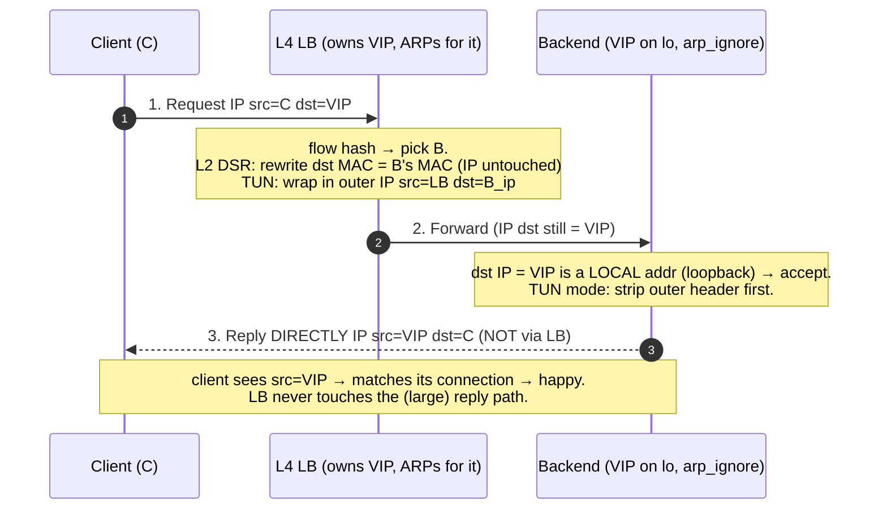
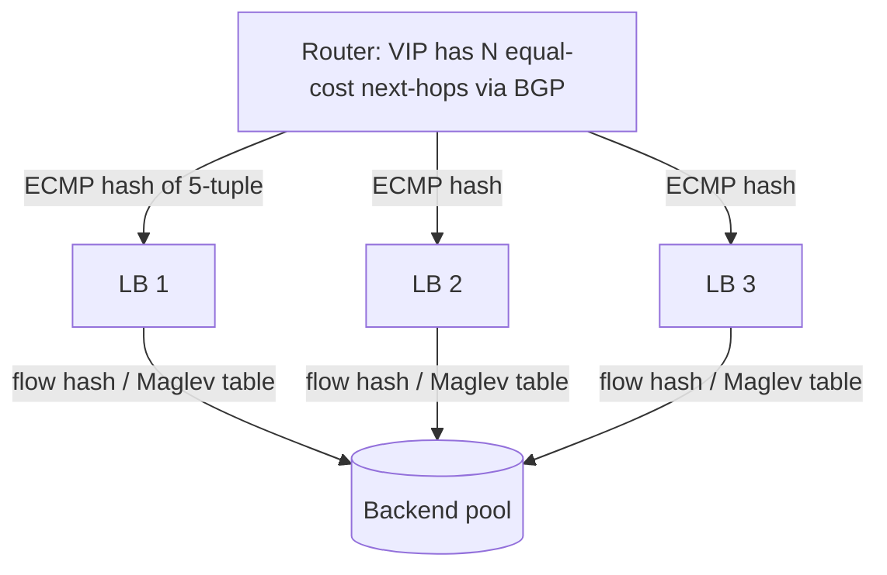

# Layer 4 Load Balancing — Professional

<!-- level-focus -->
At professional level, focus on this question:

> How should teams adopt and operate **Layer 4 Load Balancing** with measurable outcomes and limited coordination?

Use the smallest realistic scenario that exposes the decision and its failure behavior.
---

## 1. What "Layer 4" Actually Constrains

An L4 load balancer makes its forwarding decision using only the transport-layer
5-tuple. It never parses the application payload — no HTTP `Host` header, no TLS SNI
(beyond, at most, opportunistically peeking, which crosses into L7). That single
constraint drives everything else:

```text
The 5-tuple (the only thing an L4 LB is allowed to key on):
  ( src IP , src port , dst IP , dst port , L4 protocol )

Consequences:
  - Decision is PER-CONNECTION, not per-request. A single TCP connection carrying
    100 HTTP requests all land on ONE backend. No request-level spreading.
  - The LB is a stateful-flow forwarder, not a proxy. It does not terminate the
    connection (in NAT/DSR modes); it maps packets of a flow to a backend.
  - Throughput is bounded by packets-per-second (pps), not requests-per-second.
    A minimal 64-byte TCP ACK costs the same table lookup as a jumbo data frame.
```

> 🎞️ **See it animated:** [How Maglev routing works — table build & lookup (Google Cloud docs)](https://cloud.google.com/load-balancing/docs/network/maglev)

The distinction that dominates the rest of this file is **who rewrites what** and
**which way the reply travels**. Two axes:

- **Forward path rewrite** — does the LB change the destination IP (NAT) or leave the
  IP header intact and only touch the L2 frame / add an outer header (DSR)?
- **Return path** — does the reply flow back *through* the LB (so it can un-rewrite),
  or does the backend answer the client *directly*?

---

## 2. The 5-Tuple Flow Hash

Every L4 LB must map an incoming packet to the *same* backend for the life of a flow,
even though it may see millions of concurrent flows. Two mechanisms cooperate:

1. **Flow hash** — a deterministic hash of the 5-tuple picks a backend when a flow is
   first seen. Deterministic hashing means any LB in the fleet independently computes
   the *same* backend for a given flow, so no cross-LB coordination is needed for the
   common case.
2. **Connection table** — a per-LB hash map from 5-tuple → chosen backend, so that
   mid-flow the LB does not recompute (and so it survives backend-set changes; see §7).

```text
Canonical flow-hash inputs (order-normalized so both directions agree in NAT mode):
  h = HASH( src_ip, src_port, dst_ip, dst_port, proto )

Properties required of HASH:
  - Uniform: even spread across N backends → balanced load.
  - Stable: same 5-tuple → same value on every LB, every time.
  - Cheap: computed at line rate (tens of Mpps). Common choices: a seeded
    Jenkins/Toeplitz-style hash, or the NIC's RSS hash reused by the software LB.

Naive backend selection (the trap):
  backend = h mod N          # N = number of healthy backends
  Problem: when N changes (a backend drains or a new one joins), h mod N remaps
           almost EVERY flow → live TCP connections shatter (RST storms).
  This is exactly the failure that consistent hashing / Maglev exists to prevent (§7).
```

The reason a plain modulo is catastrophic: for `N → N+1`, the fraction of 5-tuples
whose `h mod N` result is unchanged is only about `1/(N+1)`. At `N = 100`, adding one
backend moves ~99% of flows. Each moved flow lands on a backend with no state for it →
the backend replies `RST` → user-visible connection resets. This is the central
problem Maglev's lookup table solves.

---

## 3. NAT Mode: Rewrite, Checksum, and Reverse Translation

In NAT (Network Address Translation) mode the LB owns the **Virtual IP (VIP)**. Clients
send to the VIP; the LB rewrites the destination to a real backend, and — critically —
the reply must return *through* the LB so it can undo the rewrite. This makes the LB a
bidirectional bump-in-the-wire and requires it to hold connection state.

### 3.1 Forward path (client → backend): destination rewrite

```text
Client packet arrives:
  IP:   src = C     dst = VIP
  TCP:  sport = cp  dport = 443

LB picks backend B (flow hash + conn table), then rewrites:
  IP:   dst = VIP  →  dst = B_ip          (Destination NAT / DNAT)
  (optionally)  src = C  →  src = LB_ip    (Source NAT / SNAT — "full NAT")

Then it MUST recompute two checksums, because both cover the changed fields:
  - IPv4 header checksum: covers the IP header (incl. dst IP) → recompute.
  - TCP checksum: covers a PSEUDO-HEADER that includes src IP + dst IP,
    plus the TCP header + payload → recompute.

Incremental update (RFC 1624) instead of full recompute:
  HC' = ~( ~HC + ~m + m' )   (16-bit one's-complement arithmetic)
  where m = old 16-bit word, m' = new word. Line-rate LBs use this so they only
  touch the delta (the changed IP words / ports), never re-sum the whole packet.
```

### 3.2 Why full-NAT (SNAT) is often required

If the LB only does DNAT (leaves `src = C`), the backend replies with `src = B_ip,
dst = C` and — depending on routing — may send it *straight to the client*, bypassing
the LB. The client then receives a reply from `B_ip` for a connection it opened to
`VIP` and drops it (`RST`). To force the return path through the LB, either:

- **Full NAT (SNAT):** rewrite `src = C → LB_ip` so the backend's reply is addressed to
  the LB, which then reverse-translates. Cost: the backend loses the client's real IP
  (must recover it via PROXY protocol or `X-Forwarded-For` if an L7 proxy exists), and
  each LB↔backend flow is now keyed by `(LB_ip, LB_port)`, so port exhaustion becomes a
  scaling limit (~64K ephemeral ports per LB IP per backend tuple).
- **Policy routing / default gateway = LB:** make the LB the backend's gateway so
  replies naturally traverse it. Avoids SNAT but couples network topology to the LB.

### 3.3 Reverse translation via the connection table (conntrack)

```mermaid
sequenceDiagram
    autonumber
    participant C as Client (C)
    participant LB as L4 LB (VIP)
    participant B as Backend (B_ip)
    C->>LB: 1. SYN  src=C dst=VIP
    Note over LB: pick B via flow hash; INSERT conntrack entry<br/>key=(C,cp,VIP,443) → B, state=SYN_SENT
    LB->>B: 2. SYN  src=LB_ip dst=B_ip  (DNAT+SNAT, checksums recomputed)
    B-->>LB: 3. SYN/ACK  src=B_ip dst=LB_ip
    Note over LB: LOOKUP reverse tuple (B_ip,..,LB_ip,..)<br/>found → un-rewrite to VIP↔C
    LB-->>C: 4. SYN/ACK  src=VIP dst=C
    C->>LB: 5. ACK ... (established; every packet does a table lookup)
    Note over LB: on FIN/RST or idle timeout → EVICT entry
```

The **conntrack (connection-tracking) table** is the heart of NAT mode. Every packet in
both directions performs a hash-table lookup keyed by the 5-tuple, retrieves the mapping,
rewrites, and forwards. The reverse direction is keyed by the *swapped/rewritten* tuple,
so the LB stores enough to translate both ways. Entry lifecycle: created on SYN,
refreshed on each packet, and evicted on FIN/RST or after an idle timeout (Linux IPVS
default TCP established timeout is 15 minutes; the tunable is `net.ipv4.vs.timeout_*` /
`ipvsadm --set`). This state is exactly what makes NAT mode memory-bound at high flow
counts (see §8) and what makes LB failover hard — a failed LB loses its table unless it
is replicated.

---

## 4. Direct Server Return (DSR): L2 and IP-in-IP

DSR (also "Direct Routing" in IPVS) removes the return path through the LB. The insight:
the reply is usually far larger than the request (think a 200-byte GET vs a 2 MB response),
so sending replies *directly* from backend to client offloads the bulk of bytes from the
LB. In DSR the LB rewrites *almost nothing* in the IP header — the destination stays the
VIP — and the backend must be configured to accept and answer VIP-addressed traffic.

### 4.1 The two DSR flavors

```text
(a) L2 DSR — "MAC rewrite" / Direct Routing (IPVS DR):
    LB leaves the IP packet 100% intact (dst = VIP), and only rewrites the
    ETHERNET destination MAC to the chosen backend's MAC.
    Requirement: LB and all backends share an L2 broadcast domain (same VLAN/subnet)
                 because a MAC address is only meaningful on the local link.
    Backend requirement: the VIP is configured on a NON-ARPing loopback interface
                 (lo:0 = VIP), with arp_ignore/arp_announce set so the backend does
                 NOT answer ARP for the VIP (only the LB does). The backend accepts the
                 packet because dst IP = VIP = a local address, then replies:
                   src = VIP, dst = C   → goes straight to the client, never via the LB.

(b) IP-in-IP tunnel DSR (IPVS TUN):
    LB ENCAPSULATES the original packet inside an outer IP header:
      outer IP:  src = LB_ip, dst = B_ip   (protocol 4 = IPIP, or GRE/UDP for others)
      inner IP:  src = C,      dst = VIP    (untouched)
    Backend must support the tunnel (decapsulate), sees the inner (VIP-addressed)
    packet, and — same as L2 DSR — has the VIP on loopback and replies directly to C.
    Advantage: backends can be in a DIFFERENT subnet / L3 hop away (no shared L2 needed).
    Cost: +20 bytes (IPIP) or +24/+28 (GRE/UDP) of outer header → MTU/fragmentation risk.
```

### 4.2 DSR packet path — staged



### 4.3 Why the backend needs the VIP on loopback with ARP suppression

Two backends and one LB all "own" the VIP at L3. If a backend answered ARP for the VIP,
the client's/router's ARP cache could point the VIP's MAC at a backend, black-holing the
LB. So every backend must (a) hold the VIP on a loopback (or dummy) interface so the
kernel accepts VIP-destined packets locally, and (b) *never* announce or reply to ARP
for the VIP. On Linux this is `arp_ignore=1` and `arp_announce=2` on the relevant
interfaces plus a `lo:0` VIP alias. Only the real LB ARPs for the VIP.

The asymmetry to internalize: **in DSR the LB sees only the forward (small) direction and
therefore cannot observe the reply — no L4 stats on responses, no L7 anything, and no
reverse checksum work because it never rewrote the IP header.**

---

## 5. NAT vs DSR vs Tunnel — Packet-Path Comparison

| Property | NAT (full/half) | L2 DSR (MAC rewrite) | IP-in-IP Tunnel DSR |
|---|---|---|---|
| **Dst IP rewritten?** | Yes (VIP → backend) | No (stays VIP) | No (inner stays VIP; outer added) |
| **Src IP rewritten?** | Full NAT: yes; half: no | No | No (outer src = LB) |
| **What LB touches** | IP dst (+src), IP & TCP checksums | Ethernet dst MAC only | Prepends outer IP header |
| **Return path** | Through the LB (must un-rewrite) | Backend → client directly | Backend → client directly |
| **LB sees replies?** | Yes (reverse translation) | No | No |
| **Topology needed** | Any (routable) | Shared L2 / same subnet | Any (L3-routable to backend) |
| **Backend config** | Normal; loses client IP under SNAT | VIP on loopback + ARP suppression | VIP on loopback + tunnel decap |
| **Checksum recompute** | IPv4 + TCP (pseudo-header) | None (IP untouched) | Outer checksum only |
| **MTU impact** | None | None | −20B (IPIP) / −24-28B (GRE/UDP) → risk of frag or need lower MSS |
| **LB throughput cost** | Both directions, per-packet rewrite | Forward only, MAC swap | Forward only, encap |
| **Client IP visible to backend** | No under SNAT (needs PROXY proto); yes half-NAT | Yes (inner IP intact) | Yes (inner IP intact) |
| **Conntrack memory** | High (bidirectional state) | Lower (forward-flow only) | Lower (forward-flow only) |

**Reading the table:** NAT is the most flexible topologically and the only mode that
sees both directions (so it can do connection accounting and works across L3), but it
pays a per-packet rewrite+checksum tax on *both* directions and holds the most state.
DSR modes win hard on reply-heavy workloads because the fat return path never touches the
LB — at the cost of intrusive backend network config (loopback VIP + ARP suppression) and,
for the tunnel variant, MTU headaches. Choose L2 DSR when backends share a rack/VLAN;
choose IPIP/GRE tunnel DSR when they don't; choose NAT when you cannot touch backend
network config or need the LB in the return path.

---

## 6. ECMP at the Router: Fanning Traffic to the LB Fleet

A single LB box is a throughput and failure bottleneck, so production L4 balancing runs a
*fleet* of identical LBs, each announcing the **same VIP** via BGP (anycast). The upstream
router then uses **ECMP (Equal-Cost Multi-Path)** to spread flows across the LB fleet.



```text
Two independent hashes are now in play:
  1. Router ECMP hash( 5-tuple ) → which LB handles the flow.
  2. LB flow/Maglev hash( 5-tuple ) → which backend the LB picks.

The failure mode to understand — ECMP is NOT consistent hashing:
  Most routers implement ECMP as `hash(5-tuple) mod (number of next-hops)`.
  When an LB is added/removed, the number of next-hops changes → the modulo remaps
  a large fraction of flows to a DIFFERENT LB. That new LB has NO conntrack entry
  for the in-flight flow.

  This is why the LB layer's backend selection MUST be consistent ACROSS LBs:
  if any LB, on seeing a "new to me" flow, deterministically computes the SAME
  backend the original LB was using, then an ECMP reshuffle causes at most a
  momentary detour — not a reset. Maglev's lookup table (§7) provides exactly this
  cross-fleet determinism, which is why it pairs with ECMP.
```

The takeaway: ECMP scales the LB tier horizontally but *introduces* flow churn on fleet
changes; the LB's consistent backend selection is what neutralizes that churn end to end.

---

## 7. Maglev's Consistent-Hash Lookup Table

Google's **Maglev** (Eisenbud et al., NSDI 2016) is the reference design for
software L4 balancing. Its core trick for backend selection is a precomputed
**lookup table**: instead of hashing each packet's 5-tuple onto a ring and walking it
(classic consistent hashing, O(log n) per packet), Maglev builds a fixed-size table of
`M` entries where each entry names a backend, and does a single array index at packet
time:

```text
Packet-time backend selection (O(1), branch-free):
  i = hash(5-tuple) mod M          # M = table size, a prime (e.g., 65537)
  backend = table[i]

Table BUILD (done off the packet path, when backend set changes):
  - Each backend i gets a pseudo-random PERMUTATION of the M table slots,
    derived from two hashes h1(name), h2(name):
        offset = h1(name) mod M
        skip   = h2(name) mod (M-1) + 1
        permutation[i][j] = (offset + j*skip) mod M
  - Round-robin over backends; each backend claims its next-preferred still-empty slot
    until all M slots are filled.
  Result properties:
    * Balance: each backend owns ~M/B slots (near-perfectly even; M >> B, e.g. M≈100×B).
    * Minimal disruption: when one backend leaves, only ~M/B slots (its share) change
      ownership → only ~1/B of flows move, and NO other flow's slot is reassigned.
```

### 7.1 Table-lookup on a 5-tuple — staged

```mermaid
sequenceDiagram
    autonumber
    participant P as Packet (5-tuple)
    participant H as Hash unit
    participant T as Maglev table[M]
    participant CT as Conn-tracking (fast path)
    P->>CT: 1. lookup existing flow entry?
    Note over CT: HIT → reuse pinned backend (survives table rebuilds)
    P->>H: 2. (on MISS) h = hash(5-tuple)
    H->>T: 3. i = h mod M
    T-->>P: 4. table[i] = backend B
    Note over P,T: connection pinned to B; insert into conn table so a later<br/>table REBUILD (backend join/leave) does not re-pick a different B
```

### 7.2 Two layers of consistency, and why both exist

Maglev combines **the lookup table** (consistency across the *fleet* and across most
backend changes) with a per-LB **connection tracking table** (consistency for a *specific*
flow through *any* table rebuild):

- The **lookup table** guarantees that two different Maglev machines, given the same
  backend set, resolve the same 5-tuple to the same backend — so an ECMP reshuffle
  (§6) that moves a flow to a new Maglev box still lands it on the right backend.
- The table alone is not perfect through rebuilds: while it *minimizes* churn, a
  backend join/leave still reshuffles ~1/B of slots. For flows whose slot *did* move,
  the **connection table** (populated on first packet) overrides the table lookup and
  keeps the flow on its original backend for its lifetime. Combined, the two give
  per-connection consistency across both fleet changes *and* backend-set changes.

```text
Why not just classic consistent hashing (a ring with virtual nodes)?
  - Ring lookup is O(log n) per packet (binary search) + pointer chasing → cache-
    unfriendly at tens of Mpps.
  - Achieving good balance needs many virtual nodes per backend → large ring, more
    memory, more variance.
  Maglev's table is O(1), branch-free, cache-resident (a few hundred KB), and gives
  TIGHTER load balance for the same memory. Trade-off: minimal-disruption is "very
  good" (~1/B moved) but not the theoretical optimum of a ring — an acceptable price.
```

---

## 8. Connection Table Memory Math

Whether you run NAT (mandatory conntrack) or DSR+Maglev (conntrack as an override), the
connection table's size sets a hard memory ceiling on how many concurrent flows an LB can
hold. Sizing it wrong causes either OOM or premature eviction (which drops long-lived
connections). The math is simple and worth internalizing.

```text
Per-entry cost (illustrative software LB conntrack entry):
  key:    5-tuple            = src_ip(4) + src_port(2) + dst_ip(4) + dst_port(2)
                              + proto(1)                         ≈ 13 bytes
  value:  backend id/ptr(8) + state/flags(4) + last_seen ts(8)
          + rewrite info (NAT: new src/dst ip+port ≈ 12)        ≈ 32 bytes
  hash-map overhead: bucket ptr, list next-ptr, alignment/padding
          (real kernels — Linux nf_conntrack — are ~256–320 B/entry
           incl. both directions + timers + accounting)

For a lean, purpose-built L4 LB entry, assume ~64 bytes/flow (cache-line friendly).
For Linux nf_conntrack, assume ~300 bytes/flow (heavier, bidirectional, generic).

Little's Law bridges flow COUNT to rate × duration:
  concurrent_flows  =  new_flows_per_sec  ×  avg_flow_lifetime
```

### 8.1 Worked example

```text
Workload:
  new connections:    200,000 conn/s   (200K CPS)
  avg flow lifetime:  30 s              (typical keep-alive'd HTTPS)
Concurrent flows (Little's Law):
  L = 200,000 × 30 = 6,000,000 concurrent flows

Memory, lean 64 B/entry LB:
  6,000,000 × 64 B   = 384,000,000 B  ≈ 366 MiB   → fits comfortably in RAM.

Memory, Linux nf_conntrack at ~300 B/entry:
  6,000,000 × 300 B  = 1,800,000,000 B ≈ 1.68 GiB → must raise
     net.netfilter.nf_conntrack_max and the hashtable buckets (nf_conntrack_buckets),
     or you hit "nf_conntrack: table full, dropping packet" and NEW flows are refused.

Sizing the hash table (target load factor ~1.0 → 1 entry/bucket avg):
  buckets ≈ 6,000,000 → round to power/prime; bucket array itself
           = 6,000,000 × 8 B (ptr) ≈ 46 MiB (separate from entry memory).

Sensitivity — a spike or a slow-loris attack that stretches lifetime to 300 s:
  L = 200,000 × 300 = 60,000,000 flows → 10× memory (3.6 GiB lean / 16.8 GiB conntrack).
  This is why idle/established TIMEOUTS (§3.3) are a capacity control, not a nicety:
  shrinking established timeout from 15 min to 2 min directly caps L.
```

**The lesson:** connection-table memory is `CPS × lifetime × bytes_per_entry`. Two of
those three (lifetime via timeouts, bytes via entry design/mode) are levers you control,
and DSR/Maglev's forward-only, leaner entries plus aggressive timeouts are what let a
single commodity LB hold tens of millions of flows without exhausting RAM.

---

## 9. Putting It Together: A Full Packet's Journey

```text
DSR + Maglev + ECMP, forward path of a brand-new HTTPS flow:

  1. Client → router: IP src=C dst=VIP, TCP dport=443. (SYN)
  2. Router: VIP has N equal-cost next-hops (the Maglev fleet, anycast BGP).
     ECMP hash(5-tuple) mod N → send frame to Maglev box #k.
  3. Maglev #k:
       a. conntrack lookup (5-tuple) → MISS (new flow).
       b. i = hash(5-tuple) mod M ; backend B = table[i].   (O(1) lookup)
       c. INSERT conntrack (5-tuple → B) so future packets & rebuilds stay on B.
       d. L2 DSR: rewrite Ethernet dst MAC = B's MAC. IP header UNTOUCHED (dst still VIP).
          (TUN mode would instead prepend outer IP src=LB dst=B_ip.)
  4. Backend B: dst IP = VIP is local (loopback), arp_ignore set → accept SYN.
  5. Backend B → Client DIRECTLY: IP src=VIP dst=C (SYN/ACK). Bypasses Maglev entirely.
  6. Every subsequent client→VIP packet: ECMP may even pick a DIFFERENT Maglev box,
     but its Maglev table resolves the SAME B (deterministic), or its conntrack does →
     flow stays pinned. The heavy reply bytes never touch any Maglev box.

Contrast — the same flow in full-NAT mode:
  Every packet in BOTH directions traverses the LB, which DNATs/SNATs and recomputes
  IPv4+TCP checksums each way, and the reply bandwidth is bounded by the LB, not the
  backend fleet. More state, more CPU, more flexibility (works across L3, sees replies).
```

This is the whole design compressed: ECMP scales the LB tier, Maglev's table gives
cross-fleet deterministic backend selection, conntrack pins each flow through rebuilds,
DSR keeps the fat reply path off the LB, and connection-table memory math tells you how
many flows one box can actually hold.

---

## 10. References

- D. E. Eisenbud et al., **"Maglev: A Fast and Reliable Software Network Load Balancer,"**
  USENIX NSDI 2016 — the lookup-table build algorithm, ECMP interaction, and connection
  tracking described above.
- **Linux Virtual Server (LVS) / IPVS documentation** — the three forwarding methods
  NAT (`-m`), Direct Routing / L2 DSR (`-g`), and Tunneling / IP-in-IP (`-i`); backend
  loopback VIP + `arp_ignore`/`arp_announce` requirements; connection timeout tuning.
- **RFC 1624**, *Computation of the Internet Checksum via Incremental Update* — the
  incremental one's-complement checksum update used when rewriting IP/TCP header fields.
- **RFC 2003**, *IP Encapsulation within IP (IP-in-IP)* — the tunnel/encapsulation mode.
- **Linux netfilter `nf_conntrack`** kernel docs — connection-tracking table sizing
  (`nf_conntrack_max`, `nf_conntrack_buckets`) and per-entry cost.


---

## Apply it

1. Define the user or business outcome that **Layer 4 Load Balancing** should improve.
2. Assign one owner for code, contracts, operations, and incidents.
3. Split delivery into reversible increments that produce evidence early.
4. Publish responsibilities, escalation paths, and compatibility windows.
5. Stop or expand only when the agreed measures support that decision.

## Verify your work

- Each increment has an owner, rollback path, and observable exit condition.
- Adoption, reliability, delivery time, and coordination cost are measured.
- Incident and migration exercises prove that responsibility is executable.
- The old path is removed only after telemetry proves it is unused.

## Review questions

- Which measurable outcome justifies investing in Layer 4 Load Balancing?
- Which team owns the full lifecycle and incident response?
- What reversible increment produces the earliest useful evidence?
- Which exit condition proves that migration or adoption is complete?
