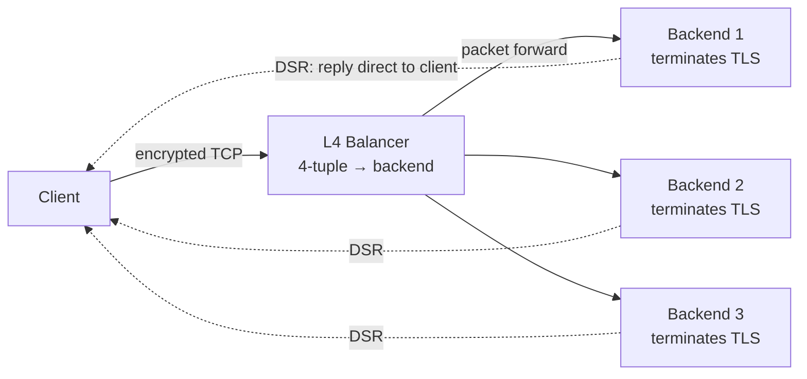
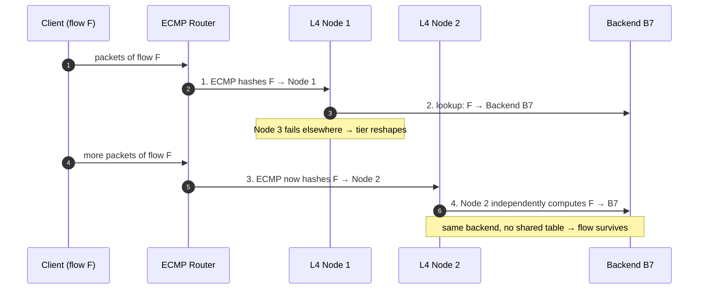
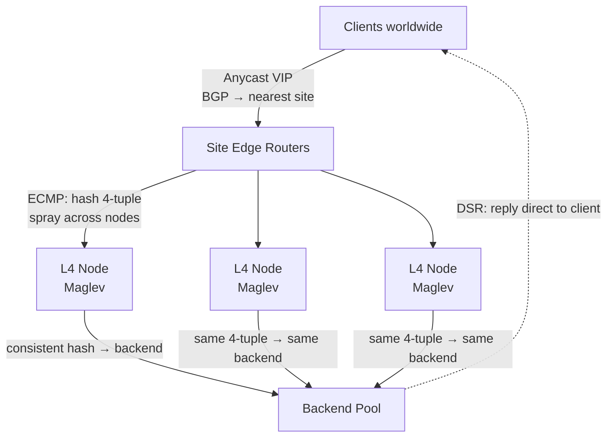

# Layer 4 Load Balancing — Senior

<!-- level-focus -->
At senior level, focus on this question:

> Which system invariant is affected by **Layer 4 Load Balancing** under failure, load, and change?

Use the smallest realistic scenario that exposes the decision and its failure behavior.
## 1. Why L4 Scales So Cheaply: Flows, Not Requests

A Layer-7 balancer is a *proxy*: it terminates the client TCP connection, reads the full HTTP request, opens a second connection to a backend, and shuttles bytes between the two. It touches every byte, holds two socket buffers per request, and often parses, buffers, and re-emits the payload. That is expensive — real CPU, real memory, real per-request cost.

A Layer-4 balancer works on the transport 4-tuple — `(src IP, src port, dst IP, dst port)` plus protocol — and makes exactly **one decision per flow**: which backend gets this connection. After that decision, every subsequent packet of the flow is forwarded on the fast path with no new work. There is:

- **No payload parsing.** The balancer never assembles the byte stream, so it is immune to slow-body attacks and pays nothing for large uploads.
- **No TLS termination** (in passthrough mode). The encrypted bytes flow straight through to the backend, which owns the handshake and the private key. The LB cannot read them and does not want to.
- **No second connection.** The client's packets are rewritten (or encapsulated) and sent onward; there is no separate backend socket buffered inside the LB.

The consequence is a throughput profile that L7 cannot touch. An L4 forwarder's cost is dominated by *packets per second*, not requests per second or bytes per second, and a flow of any size still costs only one routing decision. This is why L4 is the tier you reach for when you need to fan out **millions of concurrent connections** — game backends, message brokers, database front doors, raw TCP/UDP services — on a handful of machines.

The dashed lines are the second half of the story: with **Direct Server Return** (Section 3) the reply never traverses the balancer at all. The LB sits only on the request path — a "one-armed" design — and for asymmetric workloads (small requests, large responses) that halves or better the traffic the LB must carry.

## 2. Stateful vs Stateless L4: The Connection-Table Axis

The single most important design axis at L4 is **whether the balancer remembers flows**. A stateful balancer keeps a connection table: for each active 4-tuple it stores the backend it chose, so every subsequent packet is a fast table lookup. A stateless balancer keeps *nothing* — it re-derives the backend by hashing the 4-tuple on every packet, so the same flow deterministically lands on the same backend without a table entry.

That choice cascades into everything: memory footprint, failover behaviour, resistance to floods, and how gracefully you can add or drain backends.

| Dimension | Stateful L4 (connection table) | Stateless L4 (hash per packet) |
|---|---|---|
| Per-flow memory | One table entry per live flow (grows with connections) | Zero — nothing stored |
| Backend selection | Decided once, remembered | Recomputed from 4-tuple every packet |
| Handles asymmetric routing | Yes — remembers even if packets arrive out of path | No — every packet must hash to the same answer |
| Connection-table exhaustion | **A real DoS vector** (SYN flood fills the table) | Immune — no table to fill |
| Adding/draining a backend | Existing flows keep their entry; only new flows move | Naïve hash reshuffles **all** flows unless you use consistent hashing/Maglev |
| Failover of an LB node | Peer must have the state (sync) or flows break | Peer recomputes the same answer — flows survive |
| Typical fit | NAT, stateful firewalls, fine-grained connection control | Massive scale-out software LB tiers (Maglev, Katran) |

The stateless model is what unlocks a *distributed* L4 tier. If every node in the tier computes the same backend from the same 4-tuple, then it does not matter which node a packet lands on — any node produces the same answer. That property is exactly what you need when a stateless packet-spraying layer (ECMP, Section 5) fans traffic across many balancer nodes without coordinating which flow goes where. The price of statelessness is that a naïve `hash(4-tuple) mod N` remaps almost every flow when `N` changes — the problem Section 6 solves.

Stateful designs buy you precision (per-connection control, asymmetric-path tolerance, NAT) at the cost of a table that is finite, must be synchronised for HA, and is a flood target. Most extreme-scale front-door tiers choose statelessness and push any required state down to the backends.

## 3. Direct Server Return: Offloading the Egress Path

**Direct Server Return (DSR)** — also called Direct Routing — is the technique that makes L4 not just cheap on the request path but nearly free on the response path. In a normal proxy topology, both request and response traverse the balancer. With DSR, only the request does; the backend replies **directly to the client**, bypassing the LB entirely.

The mechanics: the LB forwards the client's packet to the chosen backend without rewriting the destination IP (it changes only the L2 MAC address, or encapsulates the packet). Each backend is configured with the service's Virtual IP (VIP) on a loopback interface, suppressing ARP for it. So when the backend crafts its reply, the source IP is already the VIP the client expects — the client's TCP stack accepts it as coming from the address it dialed, and never knows a balancer was involved.

Why this matters at scale:

- **Egress bandwidth is the scarce resource.** For a typical web or media workload the response is far larger than the request (a 200-byte GET yields a 2 MB response). DSR keeps that entire egress volume off the LB. A one-armed L4 tier can therefore front backends whose *combined* egress dwarfs the LB's own link capacity.
- **The LB becomes packet-rate bound, not byte bound.** It only ever sees the small inbound packets, so you size it for PPS, not for aggregate throughput.
- **Lower latency.** The reply takes the direct network path instead of a return trip through the balancer.

The costs you inherit: DSR generally requires the LB and backends to share an L2 segment (for the MAC-rewrite variant) or an encapsulation scheme (IPIP/GRE, as Maglev uses) to cross subnets; backends must carry the VIP and suppress ARP; and because the LB never sees return traffic, **it cannot do stateful health inference from the response path** — you lean harder on active health checks (see the health-checks topic in this section). DSR is the classic asymmetric-routing case that a stateless L4 handles naturally and a stateful one struggles with.

## 4. The Distributed L4 Consistency Problem

A single L4 box is easy. The hard system is a *tier* of L4 nodes behind ECMP, because now two independent things can change the shape of the tier, and both threaten **per-flow consistency** — the invariant that every packet of a given TCP connection must reach the *same backend* for the entire life of that connection. Break it and the receiving backend has no matching socket, sends a RST, and the user's connection dies mid-transfer.

Two events perturb the tier:

1. **The set of L4 nodes changes.** A balancer node is added, fails, or is drained. ECMP upstream re-hashes and may start steering an existing flow's packets to a *different* L4 node than before.
2. **The set of backends changes.** A backend is added, fails, or is drained. The mapping from flows to backends must change for *new* flows without disturbing *established* ones.

Put these together and you get the core requirement: **when an L4 node receives a packet for a flow it has never seen (because ECMP just moved that flow to it), it must independently choose the same backend the previous node chose.** No shared state, no coordination — just a deterministic function of the 4-tuple and the current backend set that all nodes agree on.

This is precisely why `hash(4-tuple) mod N` is not good enough. It is deterministic — every node computes the same answer for a fixed backend set — but the moment `N` changes (a backend leaves), roughly `(N-1)/N` of *all* flows remap to a different backend, breaking every one of them. What you need is a hash scheme that is both **deterministic across nodes** and **minimally disruptive when the backend set changes**. That is consistent hashing, and its high-performance refinement, Maglev (Section 6).

## 5. ECMP + Anycast in Front of the L4 Tier

Before traffic reaches any L4 node, you need something to spread it across the *many* L4 nodes, and something to route clients to the nearest *site*. Those two jobs are **ECMP** and **anycast**, and they are what turn a single L4 box into a horizontally scalable, geographically distributed front door.

**ECMP (Equal-Cost Multi-Path)** lives in the routers. When several L4 nodes advertise the same VIP as an equal-cost route (typically via BGP), the router hashes each packet's 4-tuple and picks one of the next hops. This is itself a stateless L4 balancer implemented in router silicon — line-rate, free, and already in your network. It sprays flows across the L4 tier. Its weakness is exactly the one from Section 4: most router ECMP implementations rehash when the *number* of next hops changes, so losing or adding an L4 node reshuffles flows across the tier — which is survivable *only because* the L4 nodes themselves converge on the same backend regardless of which node a packet lands on. ECMP's disruption is absorbed by the L4 layer's determinism.

**Anycast** operates one level up, across sites. The same VIP is announced from multiple data centers; BGP routes each client to the topologically nearest site. Anycast gives you geographic load distribution and a form of failover for free — if a whole site withdraws its route, clients converge onto the next-nearest site. The caveat is that a BGP reconvergence (a route change mid-connection) can move a client to a *different site*, whose L4 tier has never seen the flow and whose backends hold no matching socket — so anycast is superb for connectionless or short-lived flows and needs care for long-lived TCP.

The full front-door stack composes cleanly:

Each layer is stateless and each layer is deterministic in the same input (the 4-tuple), which is what lets the whole stack lose components without breaking established flows: anycast handles *site* selection and site failure, ECMP handles *node* selection and node failure, and the L4 layer's consistent hashing handles *backend* selection and backend failure — each absorbing the churn of the layer above.

## 6. Consistent Hashing and Maglev: Per-Flow Stability

The requirement from Section 4 — deterministic across nodes, minimally disruptive on change — is met by **consistent hashing**. Instead of `hash mod N`, backends are placed on a hash ring; each flow hashes to a point and walks to the next backend clockwise. Adding or removing a backend only remaps the flows in that backend's arc — on the order of `1/N` of flows move, not `(N-1)/N`. That bounds the blast radius of a backend change to just the flows that *have* to move.

Plain ring hashing has two weaknesses at extreme scale: **load imbalance** (arcs are uneven, so some backends get more flows unless you add many virtual nodes) and **lookup cost** (walking the ring per packet is too slow for a line-rate forwarder). Google's **Maglev** ([Eisenbud et al., NSDI 2016, *"Maglev: A Fast and Reliable Software Network Load Balancer"*](https://research.google/pubs/pub44824/)) refines the idea for a software L4 tier that must handle millions of PPS per node.

Maglev's key ideas:

- **A precomputed lookup table, not a ring walk.** Each node builds a fixed-size permutation table (a large prime number of slots, e.g. 65537) that maps hash buckets to backends. A packet lookup is a single array index — O(1), cache-friendly, line-rate.
- **Near-perfect even load.** The table-generation algorithm fills slots so each backend gets an almost equal share (Maglev reports within ~1% of even), removing the imbalance that plagues naïve ring hashing.
- **Minimal disruption on change.** When a backend is added or removed, the table is regenerated such that only a small fraction of slots change ownership — established flows to unaffected backends keep their mapping.
- **Consistency across nodes without coordination.** Every Maglev node, given the same backend set, generates an *identical* table. So any node that receives any packet computes the same backend — exactly the property Section 4 demanded. This is what makes the tier survive ECMP reshuffling.

The residual gap: a backend-set change *does* remap the minority of flows whose slots moved, and those specific flows break. Maglev narrows this further by also keeping a small **local connection-tracking table** as a hint — recently-seen flows are remembered so that even a backend-set change does not disturb them on the node that saw them first. This is a pragmatic hybrid: stateless-by-default for scale and consistency, with an optional stateful hint layer to protect the flows that a pure recompute would drop. The design lesson to carry: **stateless consistent hashing for correctness and scale; a bounded connection hint for the last mile of per-flow protection.**

> 🎞️ **See it animated:** [Consistent hashing](https://www.toptal.com/big-data/consistent-hashing)

## 7. Failure Modes You Will Actually Debug

L4's blindness to application semantics means its failures are quiet and packet-level. These are the ones that page you.

**LB-node failover breaking live connections.** When a stateful L4 node dies, every flow it was tracking is gone unless its state was synchronised to a peer. Its replacement (or the peer ECMP steers to) has no table entry, so it either drops the packet or, worse, hashes the flow to a *different* backend that sends a RST. The user sees a mid-transfer connection reset. Stateless/Maglev tiers largely sidestep this because the replacement node recomputes the same backend — but a *simultaneous* backend-set change during the failover can still catch the minority of remapped flows. Mitigation: prefer stateless consistent hashing; where you must be stateful, replicate the connection table to a hot standby and gossip it.

**Connection-table exhaustion.** A stateful L4 stores one entry per flow. A **SYN flood** — half-open connections that never complete the handshake — fills that table with entries that will never see a third packet, until the table is full and legitimate flows are refused. This is a design-level DoS vector inherent to statefulness. Mitigations: SYN cookies (encode the state in the SYN-ACK sequence number so no table entry is created until the handshake completes), aggressive half-open timeouts, per-source-IP entry caps, and — the structural answer — a stateless design with no table to exhaust.

**Silent backend death behind passthrough.** Because an L4 balancer never parses responses, it cannot tell a healthy backend from one returning HTTP 500 to every request — at L4 a TCP connection that completes its handshake *looks* healthy. It will keep steering flows into a backend that is up on the network but broken at the application. This is a fundamental L4 limitation, not a bug: you *must* run active, application-aware health checks (a real HTTP probe, not just a TCP connect) or you will pour traffic into a black hole.

**ECMP rehash on node change churning flows.** Losing one L4 node makes many routers recompute their ECMP hash, moving a swathe of *unrelated, healthy* flows to different L4 nodes. This is survivable only because the L4 layer is deterministic — but if any node in the tier is running a *different* backend set (mid-rollout, config skew), the moved flows hash to different backends and break. The operational rule: keep the backend view identical across every node in the tier, and roll config changes so all nodes converge before ECMP is allowed to move flows onto the changed nodes.

**Ephemeral-port and NAT-table pressure in SNAT mode.** If your L4 tier does source-NAT (rewriting the client IP to the LB's, common when backends can't route back to arbitrary clients), each LB IP has only ~64K ephemeral ports *per backend tuple*. High connection churn exhausts them, producing intermittent connection failures that look random. DSR avoids this entirely by never rewriting the source; where SNAT is unavoidable, add LB IPs to widen the port space.

## 8. When L4 Is the Right Layer

L4 and L7 are not competitors — they are layers, and mature designs run **L4 in front of L7** (a stateless L4/Maglev tier spraying across a fleet of L7 proxies that do the header-aware work). But when you must choose the *primary* layer for a service, the decision turns on what you need and what you can give up.

| Reach for L4 when… | Reach for L7 when… |
|---|---|
| The protocol is **not HTTP** — raw TCP/UDP, gRPC streams, database wire protocols, game traffic, MQTT | You need **content-based routing** — path, host, header, cookie |
| You need **extreme throughput / PPS** at minimal CPU | You need per-request features: retries, rewrites, auth, WAF, response caching |
| You want **TLS passthrough** — the backend must terminate TLS and hold the key | You want **TLS termination** at the edge and header inspection |
| Responses are large and asymmetric — **DSR** offloads egress | You need request/response transformation or buffering |
| You need **millions of concurrent connections** on few nodes | Per-request observability (status codes, latency by route) matters most |
| Client-IP visibility must be preserved without header tricks | You are fine terminating and forwarding as a proxy |

The distilled trade: **L4 buys you throughput and protocol-agnosticism at the cost of application blindness.** It cannot make a decision on anything above the transport header, so it cannot route by URL, cannot retry a failed request (it only ever saw packets), and cannot tell a 500 from a 200. If your service is HTTP and you want smart routing, you want L7 — but you may still put a stateless L4 tier in front of it purely to fan connections across your L7 fleet at line rate. Choosing L4 is choosing to push all application logic down to the backends and keep the front door dumb, fast, and cheap.

## 9. Owner Checklist

- **Pick the state model deliberately.** Default to stateless consistent hashing (Maglev-style) for scale and failover survivability; adopt stateful tables only where you truly need per-connection control or NAT — and then plan for table sync and flood defense.
- **Guarantee per-flow consistency across the tier.** Every node must compute the same backend for the same 4-tuple against the same backend set. Verify that backend views are identical across nodes and converge before ECMP moves flows.
- **Put DSR on the table for asymmetric workloads.** If responses dwarf requests, DSR keeps egress off the LB and turns it into a PPS-bound, one-armed tier.
- **Compose the front door as anycast → ECMP → Maglev → DSR.** Each layer is stateless and deterministic in the 4-tuple, so each absorbs the churn of the layer above.
- **Defend the connection table (if stateful).** SYN cookies, half-open timeouts, per-source caps — treat table exhaustion as a first-class DoS vector.
- **Never trust an L4 handshake as a health signal.** Run active, application-aware health checks; L4 cannot see a broken backend that still completes TCP.
- **Watch the right metrics.** PPS and new-flows/sec (not just bandwidth), connection-table occupancy, backend-set-change events, RST rate on the backends (the tell for broken per-flow consistency), and ephemeral-port utilization in SNAT mode.

## 10. Next Step

You can now reason about *why* L4 scales, the stateful/stateless trade, and how anycast + ECMP + Maglev + DSR compose into a survivable distributed tier. The professional level goes deeper into the formal and quantitative side — Maglev table-generation math, the exact disruption bounds of consistent hashing, PPS capacity modelling, and the packet-path microarchitecture (kernel bypass, XDP/eBPF, DPDK) that makes a software L4 forwarder hit line rate.

*Next step:* [Layer 4 Load Balancing — Professional](professional.md)

---

## Apply it

1. State the system invariant that **Layer 4 Load Balancing** must protect.
2. Mark ownership, state, and failure propagation at each boundary.
3. Compare two designs under load, dependency failure, and future change.
4. Define recovery and compatibility behavior before implementation.
5. Test the riskiest assumption with a focused experiment.

## Verify your work

- The experiment supports the design with evidence, not preference.
- Failure injection shows the blast radius and recovery path.
- Compatibility checks cover old and new callers or data.
- Operational signals reveal invariant violations and recovery progress.

## Review questions

- Which invariant must remain true when Layer 4 Load Balancing fails?
- Where should recovery responsibility live, and why?
- Which assumption deserves an experiment before implementation?
- How can the design evolve without changing every consumer at once?
