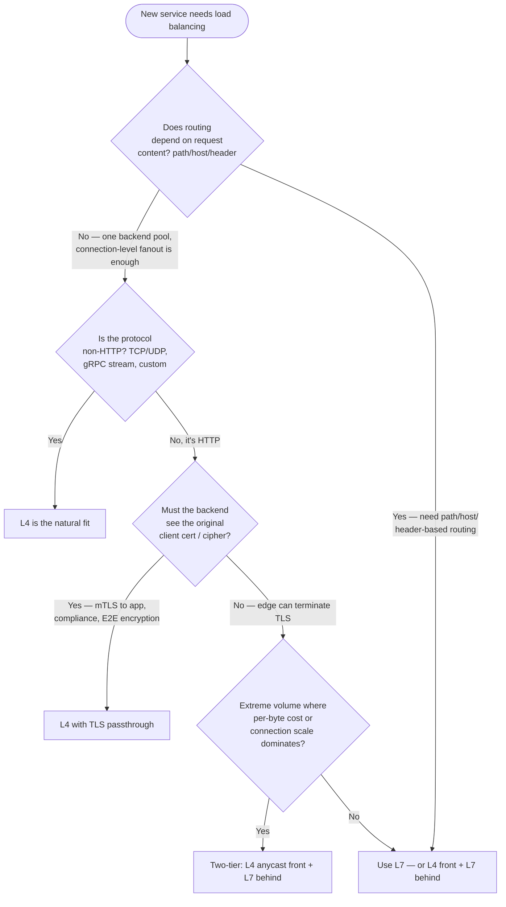
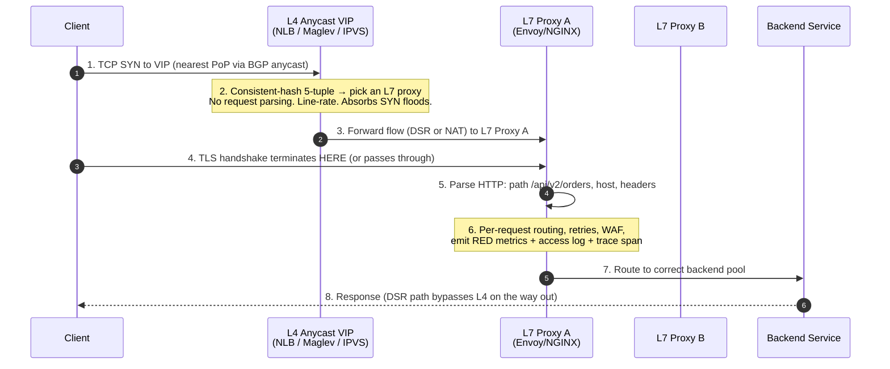
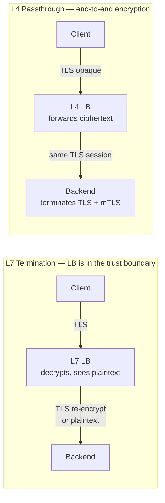
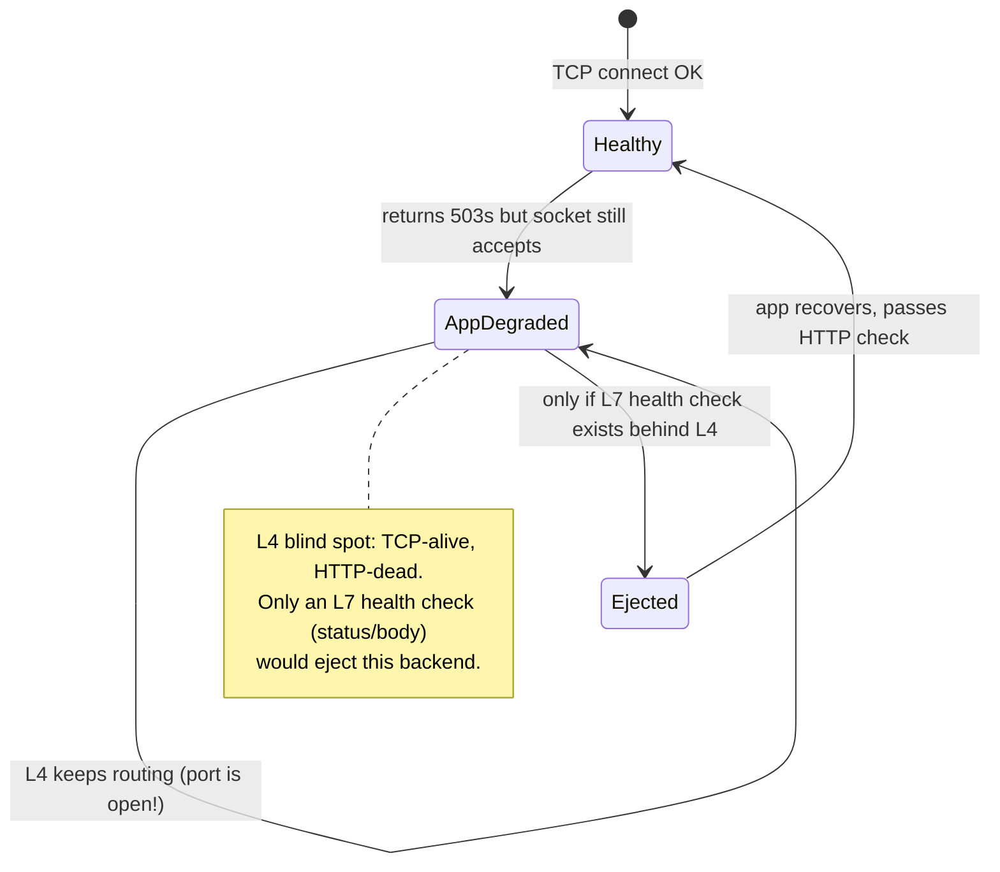

# Layer 4 Load Balancing — Staff

> **Axis:** organizational scope & judgment — NOT deeper protocol theory (that is `professional.md`).
> This file answers: when should an organization spend its scarce load-balancing budget on L4
> versus L7, who owns each tier of the common two-tier pattern, when TLS passthrough is a
> compliance requirement rather than a preference, and what you permanently lose in observability
> by pushing traffic through a connection-level device that never parses a request.

## Table of Contents
1. [The Staff-Level Framing: L4 Is a Layering Decision, Not a Product Choice](#1-the-staff-level-framing-l4-is-a-layering-decision-not-a-product-choice)
2. [L4 vs L7 — The Capability/Cost Tradeoff](#2-l4-vs-l7--the-capabilitycost-tradeoff)
3. [The Two-Tier Pattern: L4 Front, L7 Behind](#3-the-two-tier-pattern-l4-front-l7-behind)
4. [Who Owns Each Tier](#4-who-owns-each-tier)
5. [TLS Passthrough vs Termination: Compliance and End-to-End Encryption](#5-tls-passthrough-vs-termination-compliance-and-end-to-end-encryption)
6. [The Cost Model: Cheaper Per Byte, Fewer Features](#6-the-cost-model-cheaper-per-byte-fewer-features)
7. [Operational Simplicity vs Observability Loss](#7-operational-simplicity-vs-observability-loss)
8. [Build vs Buy vs Adopt](#8-build-vs-buy-vs-adopt)
9. [When NOT to Use L4](#9-when-not-to-use-l4)
10. [Second-Order Consequences](#10-second-order-consequences)
11. [Staff Checklist](#11-staff-checklist)

---

## 1. The Staff-Level Framing: L4 Is a Layering Decision, Not a Product Choice

Junior and middle engineers ask "L4 or L7?" as if it were a single either/or product selection.
At Staff level the question is almost never binary. Most large systems run **both**, in tiers,
and the real decisions are:

- **Where does each layer sit** in the request path, and what work is it allowed to do?
- **What is the cheapest tier that can absorb raw connection volume** without becoming a
  bottleneck or a cost center?
- **Where does the org draw the boundary of ownership** so that platform, networking, and
  application teams are not fighting over the same box?
- **What visibility are you knowingly giving up** by letting some traffic pass through a device
  that never sees an HTTP request?

An L4 load balancer forwards on the transport 5-tuple (src IP, src port, dst IP, dst port,
protocol). It does not terminate TCP application semantics, does not parse HTTP, and in
passthrough mode does not decrypt TLS. That constraint is the entire source of both its
advantages (line-rate, cheap, protocol-agnostic, preserves end-to-end encryption) and its
limitations (no per-request routing, no per-request metrics, no header manipulation). Every
Staff decision below traces back to that one property.

---

## 2. L4 vs L7 — The Capability/Cost Tradeoff

This is the table you defend in an architecture review. The point is not that one is "better" —
it is that they occupy different points on a capability/cost/visibility curve, and a mature
platform buys both deliberately.

| Dimension | Layer 4 (transport) | Layer 7 (application) |
|-----------|---------------------|------------------------|
| **Routing granularity** | Per-connection (5-tuple hash / flow) | Per-request (path, host, header, cookie, method) |
| **Protocols** | Any TCP/UDP (DBs, gRPC streams, MQTT, QUIC/UDP, custom) | HTTP/1.1, HTTP/2, HTTP/3, gRPC, WebSocket |
| **Throughput** | Line-rate; millions of pps; connection setup is the cost | Bounded by request parsing + TLS work per request |
| **Latency added** | ~microseconds (forwarding, sometimes DSR) | ~sub-ms to low-ms (parse, buffer, re-encrypt) |
| **TLS** | Passthrough (opaque) or terminate | Terminates by design; can re-encrypt to backend |
| **Per-request observability** | **None** — no status codes, no path, no latency histogram | Full — access logs, RED metrics, traces, header taps |
| **Content manipulation** | None (can't rewrite paths, inject headers, compress) | Full (rewrite, redirect, header inject, auth, WAF) |
| **Session persistence** | Source-IP / flow affinity only | Cookie, header, consistent-hash on app key |
| **Cost per byte** | Lowest (cloud NLB bills mostly per LCU/hour + data) | Higher (more CPU per request; ALB LCUs count requests) |
| **Failure blast radius** | Large (one pool, coarse health) | Finer (per-route, per-backend health, retries) |
| **Health checking** | TCP connect / port open | HTTP status, body match, per-endpoint |
| **DDoS absorption** | Excellent (drops at flow level, anycast) | Weaker (must parse to decide; more attackable) |

**The load-bearing asymmetries a Staff engineer keeps in mind:**

- **L4 buys you scale and protocol-agnosticism; L7 buys you routing and visibility.** You cannot
  buy the second with an L4 device no matter how much you spend — it is architecturally absent.
- **L7 cost scales with request rate and request work; L4 cost scales with bytes and
  connections.** A firehose of small requests is expensive at L7 and cheap at L4. A firehose of
  bytes over few long-lived connections is the opposite trade.
- **Observability is not a tunable on an L4 device — it is a category that does not exist there.**
  This is the single most underrated cost in the whole decision.

---

## 3. The Two-Tier Pattern: L4 Front, L7 Behind

The dominant pattern at scale is not "pick one." It is a cheap, protocol-agnostic **L4 anycast
front** that absorbs raw volume and DDoS, hashing flows to a fleet of **L7 proxies** that do the
expensive per-request work (routing, TLS termination, WAF, retries). This is how AWS layers NLB
in front of ALB/Envoy fleets, how Google fronts its GFE/Maglev tiers, and how large self-hosted
stacks run L4 (Katran/IPVS) in front of Envoy/NGINX.

**Why this layering wins:**

- **Cost efficiency at the edge.** The L4 tier is the cheapest device that can survive the full
  connection/packet volume, including attack traffic. You do not pay L7 request-parsing cost for
  packets that a firewall or SYN-cookie tier should drop anyway.
- **Independent scaling.** The L4 tier scales with connection/packet volume; the L7 fleet scales
  with request rate and CPU-heavy work (TLS, compression, WAF). Decoupling them means you don't
  overprovision expensive L7 capacity just to hold idle connections.
- **Blast-radius isolation.** An L7 proxy can be drained, upgraded, or crash without the client
  noticing, because the L4 tier re-hashes the flow to a healthy sibling. The L4 VIP is stable;
  the L7 fleet is cattle.
- **Anycast + DSR for latency.** BGP anycast pulls clients to the nearest PoP; Direct Server
  Return lets responses bypass the L4 hop entirely, so the expensive-to-scale return-path
  bandwidth never touches the load balancer.

**The trap:** teams adopt the two-tier pattern for the resilience story and then discover the L4
tier's flow-hashing works against them. If the hash key is the 5-tuple and a client renegotiates
its source port, it can land on a different L7 proxy mid-session, breaking sticky state. Staff
engineers pin the design: keep the L7 fleet **stateless** (or externalize session state) so
re-hashing is harmless, rather than trying to make L4 stickiness carry session semantics it was
never built for.

---

## 4. Who Owns Each Tier

The layering only pays off if ownership is drawn cleanly. When the boundary is fuzzy, the L4/L7
seam becomes a perennial incident-review argument ("was it the LB or the app?").

| Tier | Typical owner | What they own | What they must NOT own |
|------|---------------|---------------|------------------------|
| **L4 front (VIP, anycast, packet fanout)** | Platform / Network Infrastructure team | The VIP, BGP announcements, DDoS posture, connection-level health, per-PoP capacity | Application routing rules, TLS certs for app hostnames, per-service config |
| **L7 fleet (Envoy/NGINX/ALB config)** | Platform team (control plane) + service teams (route config via self-service) | Request routing, TLS termination, WAF baseline, RED metrics, retries/timeouts defaults | The physical/anycast network layer; per-flow packet handling |
| **Backend services** | Application / product teams | Business logic, service-level health endpoints, request-level SLOs | LB internals; they consume a stable VIP contract, not LB config |

**The Conway's Law reality (§37):** the L4/L7 split usually mirrors an existing org boundary
between a networking/infra org and an application-platform org. If those two orgs have different
on-call rotations, incident tooling, and change-management cadence, the *seam* between the tiers
becomes the least-observable, slowest-to-debug part of the whole path — precisely because no
single team sees end-to-end. Staff engineers either (a) put both tiers under one platform team
with unified telemetry, or (b) invest heavily in cross-tier tracing so the handoff is visible.
The worst outcome is two teams, two dashboards, and a blind spot exactly where L4 hands to L7.

---

## 5. TLS Passthrough vs Termination: Compliance and End-to-End Encryption

This is where L4 stops being a cost optimization and becomes a **requirement**. The question is:
*who is allowed to see plaintext?*

- **TLS termination at L7 (edge):** the load balancer decrypts, sees plaintext, can route on
  content, inject headers, run a WAF, and re-encrypt to the backend. This is the default and it
  is fine for most workloads. But it means the LB — and whoever operates it — is inside the
  trust boundary for that data.
- **TLS passthrough at L4:** the L4 device forwards encrypted bytes without decrypting. Plaintext
  exists **only** at the client and the backend service. The LB operator never holds the key and
  never sees the data.

**When passthrough is genuinely required (not just preferred):**

- **Regulatory / compliance mandates end-to-end encryption.** Some interpretations of PCI-DSS,
  HIPAA, and data-residency regimes require that cardholder/PHI data is never in plaintext on
  shared infrastructure the workload team does not fully control. A terminating L7 LB run by a
  separate team (or a cloud provider) may be out of scope only if it never sees plaintext.
- **Mutual TLS where the backend must authenticate the client certificate.** If the *application*
  must validate the client cert (not the edge), termination at L7 breaks it — the edge would
  strip or proxy the identity. Passthrough delivers the original handshake to the backend.
- **The backend needs the exact cipher/session for protocol reasons** (e.g., channel-binding,
  token-binding, or an app that pins the TLS session).
- **Zero-trust networks** where the policy is "no infrastructure component decrypts service
  traffic; every service terminates its own TLS." L4 passthrough is the only LB posture
  consistent with that policy.

**The cost of passthrough you must state out loud in the review:** you give up *everything* L7
offers — content routing, WAF, header injection, HTTP-level metrics, HTTP health checks. You
cannot run a WAF on traffic you cannot read. So the honest framing is: *passthrough trades all
L7 capability for the guarantee that only the endpoints see plaintext.* If compliance forces
passthrough, the WAF and routing must move **into** the backend (e.g., a sidecar/mesh proxy that
terminates TLS inside the service's own trust boundary), which is an org and cost decision, not
just a config flag.

---

## 6. The Cost Model: Cheaper Per Byte, Fewer Features

The reason the two-tier pattern is economically dominant is that L4 and L7 bill on different
axes, and you want the cheap axis to carry the heavy volume.

| Cost axis | L4 (e.g., cloud NLB) | L7 (e.g., cloud ALB / Envoy fleet) |
|-----------|----------------------|-------------------------------------|
| **Primary billing driver** | New connections + bandwidth (LCU-hours dominated by data + connection rate) | **Requests** + connections + bandwidth + active connections + rule evaluations |
| **Per-request overhead** | ~none (forwards flows) | Real CPU per request: parse, TLS, WAF, header rewrite |
| **Scales badly with** | Very high connection *churn* | High *request* rate, large headers, TLS renegotiation |
| **Cheapest for** | Long-lived connections, large byte volumes, non-HTTP | Rich routing where you'd otherwise build it yourself |
| **Hidden cost** | Loss of observability → longer MTTR → incident cost | CPU for TLS/WAF; per-rule pricing; larger fleet |

**Worked reasoning (illustrative, not a quote of any provider's price):** imagine 10 billion
small HTTP requests/day arriving over relatively few long-lived HTTP/2 connections. At L7 you pay
a per-request component on all 10B; at L4 you pay mostly for connections and bytes, and 10B small
requests over few connections is cheap at the connection/byte axis. Put the L4 tier in front to
absorb connections and volume, and size the L7 fleet only for the request-parsing work that
genuinely needs L7 — you stop paying L7 request cost for packets a cheaper tier could have
dropped or forwarded.

**But "cheaper per byte" is a half-truth Staff engineers refuse to state alone.** The true cost
of L4 includes the **observability tax**: when something breaks in an L4-only path, you have no
per-request signal, so mean-time-to-resolution goes up, and incident-hours are frequently more
expensive than the LB bill you saved. Always model *TCO = infra + people + incident/MTTR cost*,
not just the line item on the cloud invoice. L4 wins on infra dollars; it can lose on total
dollars if it lands on a path that pages humans and gives them nothing to debug with.

---

## 7. Operational Simplicity vs Observability Loss

This is the trade you must make explicit to the whole org, because it is invisible until an
incident.

**What L4 gives you operationally:**
- Fewer moving parts, fewer config surfaces, fewer CVE-bearing HTTP parsers, less state.
- Protocol-agnostic: one device fronts databases, gRPC, message brokers, and HTTP alike.
- Extremely stable under load and attack; the failure modes are simple (a flow lands nowhere).

**What L4 permanently costs you:**
- **No per-request metrics.** There is no RED (Rate/Errors/Duration) at the LB, no status-code
  breakdown, no per-path latency histogram, no "which endpoint is slow." The LB sees packets and
  flows, not requests.
- **No access logs of the kind you actually want.** You get connection-level logs (bytes, flow
  duration), not "GET /checkout returned 503 in 4200 ms."
- **Distributed tracing has a gap.** The L4 hop cannot inject or propagate trace context, so the
  span across the edge is a black box unless the L7 tier behind it re-establishes it.
- **Health checking is coarse.** TCP-connect health says the port is open; it does *not* say the
  app returns 200s. A backend can be TCP-alive and HTTP-dead, and an L4 tier will happily keep
  sending it traffic.

**The Staff resolution:** never run an L4-only path for HTTP traffic that carries user-facing
SLOs unless you have accepted the observability loss in writing and have compensating telemetry
at the backend (the service emits its own RED metrics and the mesh/sidecar re-establishes trace
context). The two-tier pattern exists precisely so you get L4's edge economics *and* L7's
per-request visibility — the L7 tier is where your dashboards and traces come from. If you find
yourself putting bare L4 in front of a critical HTTP service with no L7 behind it and no backend
telemetry, that is a design smell: you have optimized the invoice and blinded the on-call.

---

## 8. Build vs Buy vs Adopt

| Option | When it wins | Hidden cost |
|--------|-------------|-------------|
| **Buy (cloud NLB / GCLB / Azure LB)** | You're in one cloud; want a managed VIP, anycast, health, autoscaling with zero ops | Per-LCU/hour + data cost; provider-shaped feature ceiling; egress lock-in; limited custom flow logic |
| **Adopt OSS L4 (IPVS/LVS, HAProxy in TCP mode, Katran/Maglev-style)** | Multi-cloud or on-prem; need control over hashing, DSR, custom health; very high volume where per-LCU pricing hurts | You now own kernel/eBPF tuning, BGP, capacity planning, and 24/7 on-call for a load-bearing tier |
| **Build a custom L4 datapath (eBPF/XDP)** | Hyperscale where off-the-shelf can't hit your pps/cost point (the Katran/Maglev class of problem) | Enormous — a standing team, deep kernel expertise; justified only at a handful of companies |

**The default recommendation for almost every org:** *buy* the L4 front from the cloud provider
(it is a commodity, and DDoS + anycast are hard to run yourself) and *adopt* an OSS L7 tier
(Envoy) behind it where you need routing control and rich telemetry. **Build** the datapath only
if you are operating at a scale where the per-connection cost of managed L4 is itself a
line-item worth a team — which is a very short list of companies. If you are debating building a
custom L4 datapath and you are not one of those companies, that debate is the answer: don't.

---

## 9. When NOT to Use L4

L4 is the wrong answer — or at least insufficient alone — when:

- **Routing depends on request content.** Path-based (`/api` vs `/static`), host-based
  (multi-tenant on one VIP), or header/cookie-based routing is impossible at L4. Forcing it leads
  to grotesque workarounds (one VIP per route). Use L7.
- **You need per-request observability for a user-facing SLO** and have no compensating backend
  telemetry. Bare L4 blinds your on-call (§7).
- **You need a WAF, bot management, or content-level security** on the traffic. You cannot inspect
  what you don't parse. (And if compliance forces passthrough, the WAF has to move into the
  backend trust boundary — a bigger change than a config flag.)
- **You need response manipulation** — compression, header injection, redirects, CORS handling.
  All of that is L7.
- **Session stickiness must key on an application concept** (user ID, tenant) rather than source
  IP. L4 affinity is source-IP/flow only, which breaks behind NAT/CGNAT where thousands of users
  share an IP and all pin to one backend.
- **The workload is small and simple.** For a modest HTTP service, a single L7 LB is simpler to
  operate and reason about than a two-tier L4+L7 stack. Do not stand up an anycast L4 front for a
  service doing a few hundred requests per second — that is over-engineering the exact thing this
  document warns against. The two-tier pattern earns its complexity only at volume or under
  attack.

---

## 10. Second-Order Consequences

- **Observability debt compounds.** An L4-only path that "worked fine" accrues invisible
  operational debt: every future incident on that path is slower to resolve. Six months later the
  team is proposing to bolt on an L7 tier *reactively, during an incident postmortem* — far more
  expensive than designing it in. The metric to watch: **MTTR on the L4-fronted path vs the
  L7-fronted path.** If they diverge, the observability gap is the cause.
- **The L4/L7 ownership seam becomes an incident finger-pointing zone.** If the two tiers have
  different owners and no shared tracing, every ambiguous latency incident costs two teams' time
  and produces "not our tier" until someone builds the cross-tier trace that should have existed
  from day one. Watch: **fraction of incidents where root-cause is "the LB tier" but which tier
  is disputed.**
- **Passthrough decisions ossify the security architecture.** Choosing TLS passthrough for
  compliance pushes WAF and auth into the backend/mesh permanently. That is a large, hard-to-
  reverse commitment to a service-mesh operating model. It is a one-way-ish door — treat it as an
  ADR (§35.1), not a config choice.
- **Cost-optimizing to L4 can quietly de-fund the L7 platform.** If leadership sees "L4 is
  cheaper" and pushes traffic off the L7 tier to save money, the org loses the shared WAF,
  routing, and telemetry investment that only the L7 tier provides — and each team reinvents it
  worse. Watch: **number of teams building their own request-level metrics/WAF** because the
  central L7 tier was starved.

---

## 11. Staff Checklist

- [ ] Decision captured as an ADR (§35.1): which tiers exist, why L4 vs L7 at each, and the
      reversal criteria.
- [ ] The **two-tier boundary is drawn** with explicit ownership (L4 = infra/network, L7 =
      platform, backend = service teams) and unified or cross-tier tracing across the seam.
- [ ] **Observability loss of any L4-only path is written down and accepted**, with compensating
      backend RED metrics + trace re-establishment where user-facing SLOs are at stake.
- [ ] TLS posture (terminate vs passthrough) is justified against actual compliance/mTLS
      requirements — not defaulted — and the WAF/auth placement follows from it.
- [ ] Cost modeled as **TCO = infra + people + MTTR/incident cost**, not just the cloud invoice;
      break-even for L4 vs L7 vs two-tier identified.
- [ ] Build-vs-buy resolved: buy managed L4 unless you are provably at a scale that justifies an
      OSS or custom datapath and the standing team it requires.
- [ ] "When NOT to use L4" section shared so teams don't cargo-cult an anycast L4 front onto a
      small HTTP service.

*Next step:* [Layer 4 Load Balancing — Interview](interview.md)
