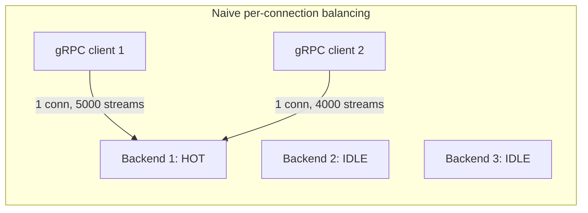
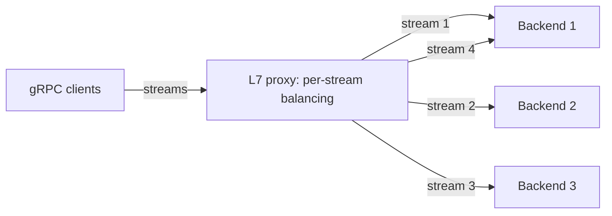
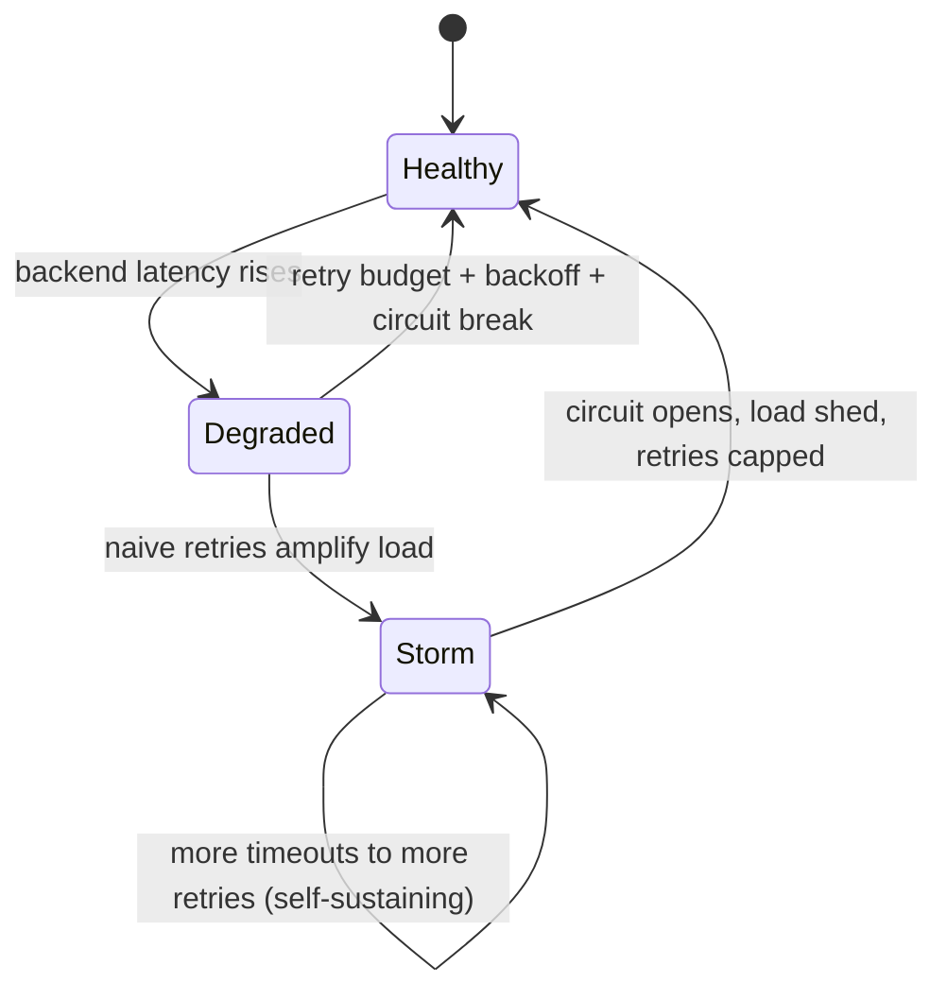
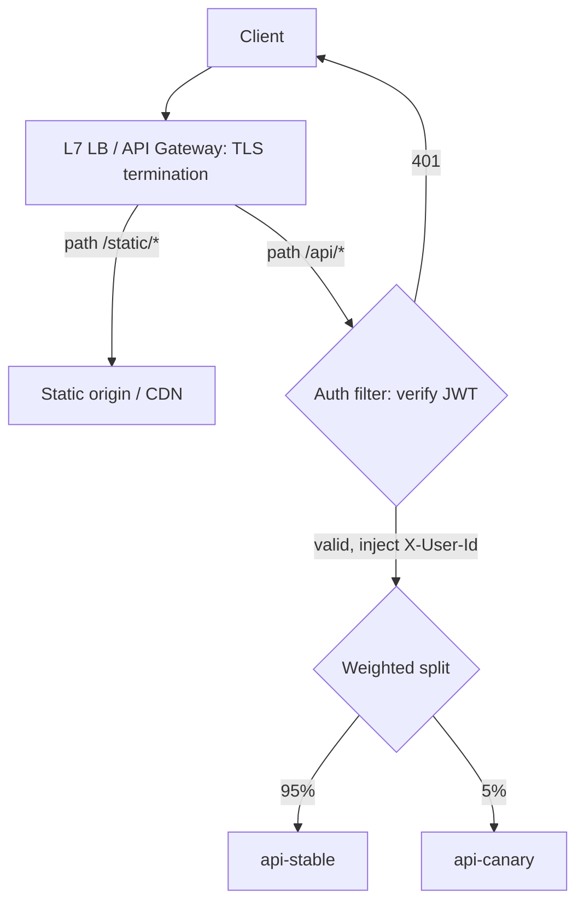

# Layer 7 Load Balancing — Interview

A Layer 7 (application-layer) load balancer terminates the client connection, parses the
HTTP request, and makes routing decisions using the *content* of that request — method,
path, host, headers, cookies. This buys capability (content routing, TLS termination,
retries, canaries, an API-gateway role) at the cost of CPU and per-request latency versus
a Layer 4 balancer that only shuffles packets by IP:port. These questions probe whether
you can reason about that trade-off precisely, and about the sharp edges — HTTP/2 stream
imbalance, retry storms, sticky-session correctness — that separate a working answer from
a strong one.

## Table of Contents
1. [Q1: What is a Layer 7 load balancer?](#q1-what-is-a-layer-7-load-balancer)
2. [Q2: L7 vs L4 — when do you choose each?](#q2-l7-vs-l4--when-do-you-choose-each)
3. [Q3: How does content / host / path routing work?](#q3-how-does-content--host--path-routing-work)
4. [Q4: Walk through what happens on a single L7 request.](#q4-walk-through-what-happens-on-a-single-l7-request)
5. [Q5: What is TLS termination and what are the models?](#q5-what-is-tls-termination-and-what-are-the-models)
6. [Q6: How do sticky sessions work at L7, and when do you need them?](#q6-how-do-sticky-sessions-work-at-l7-and-when-do-you-need-them)
7. [Q7: Why does HTTP/2 and gRPC break naive L7 load balancing?](#q7-why-does-http2-and-grpc-break-naive-l7-load-balancing)
8. [Q8: How does per-request (per-stream) balancing fix it?](#q8-how-does-per-request-per-stream-balancing-fix-it)
9. [Q9: Explain retries, circuit breaking, and outlier detection at the LB.](#q9-explain-retries-circuit-breaking-and-outlier-detection-at-the-lb)
10. [Q10: What is a retry storm and how do you prevent one?](#q10-what-is-a-retry-storm-and-how-do-you-prevent-one)
11. [Q11: How do you do a canary release at the L7 layer?](#q11-how-do-you-do-a-canary-release-at-the-l7-layer)
12. [Q12: When is an L7 LB effectively an API gateway?](#q12-when-is-an-l7-lb-effectively-an-api-gateway)
13. [Q13: What are the main failure modes of an L7 LB?](#q13-what-are-the-main-failure-modes-of-an-l7-lb)
14. [Q14: Scenario — route /api vs /static, add canary + auth at the edge.](#q14-scenario--route-api-vs-static-add-canary--auth-at-the-edge)
15. [Q15: How do you preserve the client IP after TLS termination?](#q15-how-do-you-preserve-the-client-ip-after-tls-termination)
16. [Q16: How do you load-test and capacity-plan an L7 tier?](#q16-how-do-you-load-test-and-capacity-plan-an-l7-tier)

---

## Q1: What is a Layer 7 load balancer?

> An L7 load balancer operates at the application layer of the OSI model. Unlike an L4
> balancer, it does not just forward packets — it **terminates the TCP (and usually TLS)
> connection**, reassembles the byte stream, and parses the HTTP request. Because it can
> see method, URI, `Host`, headers, and cookies, it can make routing decisions on *meaning*
> rather than on the 5-tuple. It opens a **separate** upstream connection to the chosen
> backend, so the client connection and the backend connection are decoupled (this is why
> connection reuse, buffering, and protocol translation are possible). Products: Envoy,
> NGINX, HAProxy (in `mode http`), AWS ALB, Traefik. The mental model: an L7 LB is a
> **reverse proxy that also does distribution and health-aware routing**.

---

## Q2: L7 vs L4 — when do you choose each?

> The axis is **capability vs cost**. L4 balances at the transport layer (IP:port), never
> inspects payload, and forwards at near-line-rate with microsecond latency and huge
> connection counts. L7 parses HTTP, which costs CPU, memory (buffers), and a small latency
> tax per request — but unlocks routing, observability, TLS termination, retries, and
> rewriting.

| Dimension | Layer 4 (transport) | Layer 7 (application) |
|---|---|---|
| Routing key | 5-tuple (src/dst IP, port, proto) | Method, path, host, header, cookie |
| Payload visibility | None (opaque bytes) | Full HTTP semantics |
| TLS | Passthrough (or SNI-only) | Terminates & re-encrypts (can inspect) |
| Latency added | ~microseconds | ~sub-ms to low-ms per request |
| Throughput | Very high (line rate, DSR possible) | Lower (proxying, buffering, parsing) |
| Per-request balancing | No (per-connection only) | Yes (per HTTP request / gRPC stream) |
| Retries / circuit breaking | No (can't see request boundaries) | Yes |
| Canary / A-B / header routing | No | Yes |
| Client IP preservation | Native (or DSR) | Needs `X-Forwarded-For` / PROXY protocol |

> Rule of thumb: use **L4** for raw TCP/UDP, non-HTTP protocols, ultra-high throughput, or
> when you must not decrypt (regulatory). Use **L7** when routing decisions depend on request
> content, or when you want retries/canaries/observability. Many production stacks combine
> both: an **L4 front door** (e.g., a cloud NLB or Maglev-style layer) spreads connections
> across a fleet of **L7 proxies**, getting L4 scale and L7 intelligence.

---

## Q3: How does content / host / path routing work?

> The proxy evaluates an ordered rule set against parsed request attributes and selects an
> upstream cluster:
> - **Host routing** (virtual hosting): `Host: api.example.com` → `api` cluster;
>   `Host: img.example.com` → `static` cluster. One IP/port fronts many services.
> - **Path routing**: `/api/*` → API pool, `/static/*` → object-storage/CDN origin,
>   `/ws/*` → WebSocket-capable pool. Prefix, exact, and regex matches are common; most
>   proxies apply **longest/most-specific match wins**, so put `/api/v2/checkout` before the
>   broader `/api/`.
> - **Header/cookie routing**: `X-Canary: true` → canary pool; `Accept: application/grpc`
>   → gRPC backend; a version cookie pins a user to a variant.
> - **Method/query routing**: send `GET` to read replicas' service, `POST` to the write
>   service (CQRS-style edge split).
>
> Order matters and is a classic bug source: a broad catch-all rule placed above a specific
> one shadows it. Always order rules from most specific to least specific, and keep a final
> default route.

---

## Q4: Walk through what happens on a single L7 request.

> The key insight is that there are **two independent connections** and a routing decision in
> the middle.

```mermaid
sequenceDiagram
    autonumber
    participant C as Client
    participant LB as L7 Load Balancer
    participant B as Backend (chosen upstream)
    C->>LB: 1. TCP + TLS handshake (SNI negotiated)
    C->>LB: 2. HTTP request (GET /api/orders, Host, headers)
    Note over LB: 3. Parse request; match routing rules
    Note over LB: 4. Pick cluster + healthy endpoint (algorithm)
    Note over LB: 5. Add X-Forwarded-For / X-Request-ID
    LB->>B: 6. Open/reuse upstream conn; forward (re-encrypt if mTLS)
    B-->>LB: 7. HTTP response
    Note over LB: 8. On 5xx/timeout: maybe retry another endpoint
    LB-->>C: 9. Stream response back to client
```

> Steps 3–5 and 8 are exactly what an L4 balancer *cannot* do — they require understanding
> request boundaries and semantics. Note that the client never speaks to the backend
> directly; the LB can reuse a warm pool of upstream connections across many client requests.

---

## Q5: What is TLS termination and what are the models?

> **TLS termination** means the L7 LB holds the server certificate/private key, completes the
> handshake, and decrypts the request — so it can read (and route on) HTTP. Three models:
>
> - **Termination (offload)**: decrypt at the LB, forward **plaintext** to backends over a
>   trusted network. Cheapest backend CPU, but the internal hop is unencrypted — unacceptable
>   in zero-trust environments.
> - **Re-encryption (bridging)**: decrypt at the LB to inspect/route, then **re-encrypt** to
>   the backend (often mTLS in a service mesh). Full inspection *and* encryption in transit;
>   costs a second handshake/crypto.
> - **Passthrough**: the LB does **not** decrypt — it routes on TLS **SNI** only and forwards
>   the encrypted bytes. This is really an L4/L5 behavior; you lose path/header routing and
>   L7 features but keep end-to-end encryption and avoid holding keys.
>
> Termination centralizes certificate management (ACME/Let's Encrypt automation, rotation,
> cipher policy) at the edge, enables HTTP/2 and compression, and lets you inspect requests
> for WAF/routing. The trade-off: the LB becomes a high-value key-holder and a decryption
> hotspot — plan CPU for handshakes (session resumption / TLS tickets help), and secure the
> internal leg.

---

## Q6: How do sticky sessions work at L7, and when do you need them?

> Session affinity pins a client to the same backend across requests. At L7 you have precise
> tools L4 lacks:
> - **Cookie-based affinity**: the LB injects its own cookie (e.g., HAProxy `SERVERID`, ALB
>   `AWSALB`) naming the backend; subsequent requests carry it and route back. Robust to
>   NAT/proxy IP changes because it keys on the cookie, not the source IP.
> - **Application cookie affinity**: hash an existing app cookie (e.g., `JSESSIONID`).
> - **Consistent hashing** on a header/cookie/IP: minimizes remapping when the backend set
>   changes (add/remove one node moves ~K/N keys, not all).
>
> When you need it: backends hold **in-memory session state** (server-side sessions, local
> caches, WebSocket/long-poll connections, or sticky upload state). When to avoid it: it
> undermines even load distribution, complicates draining and autoscaling, and breaks when a
> backend dies (that user's session is lost). The senior answer: **prefer stateless backends**
> — externalize session state to Redis/a shared store — and treat stickiness as an
> optimization (cache locality) rather than a correctness requirement.

---

## Q7: Why does HTTP/2 and gRPC break naive L7 load balancing?

> HTTP/2 (and thus gRPC, which runs over it) **multiplexes many concurrent streams over a
> single long-lived TCP connection**. A naive L7 or L4 balancer that distributes by
> *connection* assigns each client one backend for the connection's entire lifetime. With
> few, long-lived, high-throughput connections — the norm for internal gRPC microservices —
> this produces severe **load imbalance**: one backend can be saturated with 10,000 streams
> while another sits idle, because balancing happened once, at connect time, not per request.



> The problem is worst when the client count is small and connections are pinned — adding
> backends does **not** relieve the hot one, because no existing connection ever moves to
> them. This also interacts badly with autoscaling: new pods receive zero traffic.

---

## Q8: How does per-request (per-stream) balancing fix it?

> An HTTP/2-aware L7 proxy makes a load-balancing decision **per stream / per request**, not
> per connection. It maintains its own pool of upstream connections to *all* healthy backends
> and dispatches each incoming stream to a fresh choice (round-robin, least-request, etc.), so
> load spreads evenly regardless of how few client connections exist.



> Options in practice:
> - **Proxy load balancing** (Envoy/ALB/NGINX in HTTP/2 mode): the sidecar/edge proxy owns
>   per-request distribution. This is the standard fix and what service meshes do.
> - **Client-side / look-aside balancing**: the gRPC client itself resolves the backend list
>   and round-robins streams — no proxy hop, but every client must be balancing-aware.
> - **Connection churn / max-connection-age**: force periodic reconnects so the L4/DNS layer
>   redistributes — crude, but it lets naive L4 balancers eventually rebalance and helps new
>   backends receive traffic.
>
> The `least-request` algorithm is especially effective for gRPC because it accounts for the
> uneven, in-flight cost of concurrent streams rather than assuming equal-cost requests.

---

## Q9: Explain retries, circuit breaking, and outlier detection at the LB.

> Because the L7 LB understands request boundaries and response codes, it can implement
> resilience that L4 cannot:
> - **Retries**: on a retryable failure (connection error, timeout, 502/503, or a
>   configured status), the LB re-dispatches the request to a *different* healthy endpoint.
>   Only retry **idempotent/safe** requests (GET, or those carrying an idempotency key); a
>   naive retry of a non-idempotent POST can double-charge. Bound with a per-try timeout, a
>   total retry budget, and exponential backoff **with jitter**.
> - **Circuit breaking**: cap concurrent connections/requests/pending-requests to an upstream.
>   When limits are exceeded, the LB fails fast (returns 503) instead of piling load onto a
>   struggling backend — this contains cascading failure and preserves capacity for healthy
>   traffic.
> - **Outlier detection (passive health checking)**: track per-endpoint error rates and
>   latency; when an endpoint crosses a threshold (e.g., N consecutive 5xx), **eject** it from
>   the pool for a cooldown, then probe it back. This complements active health checks by
>   reacting to real traffic in real time.
>
> Together these turn the LB into a resilience layer: fast failover, load shedding, and
> automatic isolation of bad hosts.

---

## Q10: What is a retry storm and how do you prevent one?

> A **retry storm** is a self-amplifying overload: a backend slows down → clients/LBs time
> out and retry → retries multiply the effective request rate → the backend is pushed further
> under → more timeouts → more retries. Each layer that retries independently **multiplies**
> the amplification (LB retries × client retries × service-to-service retries = combinatorial
> blowup). The system that was merely degraded now collapses, and it cannot recover even after
> the original trigger passes, because the retry traffic sustains the overload.
>
> Prevention:
> - **Retry budgets**: cap retries to a small fraction of total traffic (e.g., "retries ≤ 10%
>   of requests"). Once exceeded, stop retrying — this converts unbounded amplification into a
>   bounded overhead.
> - **Exponential backoff with jitter**: never retry immediately or in lockstep; jitter
>   de-synchronizes clients so retries don't arrive as a thundering herd.
> - **Circuit breakers**: trip open when a backend is failing so no new retries are even
>   attempted against it.
> - **Retry at one layer only**: pick a single layer (usually the edge/mesh proxy) to own
>   retries; disable them elsewhere to avoid multiplicative stacking.
> - **Load shedding + fail-fast**: shed excess load early with 503 rather than queuing it.



---

## Q11: How do you do a canary release at the L7 layer?

> The L7 LB splits traffic between the stable and canary versions using request content or
> weighted distribution, so you expose the new build to a small, controlled slice before full
> rollout:
> - **Weighted split**: route, say, 1% → canary cluster, 99% → stable; ramp 1% → 5% → 25% →
>   100% while watching SLOs (error rate, latency, business metrics). Abort by setting the
>   canary weight back to 0 — an instant, config-only rollback with no redeploy.
> - **Header / cookie targeting**: route internal users or `X-Canary: true` to the new version
>   for a dark launch before any public traffic.
> - **Sticky canary**: once a user hits the canary, pin them (cookie affinity) so they don't
>   flip between versions mid-session.
>
> This is strictly an L7 capability: it requires understanding request boundaries and steering
> individual requests. Pair it with automated analysis (compare canary vs baseline metrics)
> for **progressive delivery**. Blue-green is the degenerate case (0% → 100% flip); canary is
> the graduated, observable version.

---

## Q12: When is an L7 LB effectively an API gateway?

> An **API gateway** is an L7 LB plus request-processing responsibilities layered on the same
> parse-and-route pipeline. Because the proxy already terminates TLS and reads the full
> request, it's the natural place to centralize cross-cutting edge concerns:
> - **Authentication/authorization** (validate JWT/OIDC, API keys, mTLS) so backends can trust
>   the identity and skip re-checking.
> - **Rate limiting / quotas** per client/key.
> - **Request/response transformation**: header injection, path rewriting, protocol
>   translation (e.g., REST↔gRPC, gRPC-Web).
> - **Aggregation/routing** across microservices behind one public surface.
> - **Observability**: request IDs, structured logs, distributed-trace propagation, metrics.
> - **WAF / security filtering**.
>
> The distinction is a spectrum, not a wall: a plain L7 LB does routing + resilience; add
> auth, rate limiting, and transformation and it becomes an API gateway (Envoy, Kong,
> Traefik, ALB with authN, cloud API gateways). The Staff-level caveat: don't overload the
> edge into a business-logic monolith ("gateway bloat") — keep it to policy and cross-cutting
> concerns, not domain logic.

---

## Q13: What are the main failure modes of an L7 LB?

> - **The LB is a decryption + CPU hotspot**: TLS handshakes and HTTP parsing are expensive;
>   under a handshake flood or large-header attack, the LB saturates before backends do.
> - **Retry storms / amplification** (see Q10) when retries are unbounded or stacked across
>   layers.
> - **Head-of-line and buffering issues**: full request/response buffering can inflate memory
>   and latency; slow clients (slowloris) tie up connections.
> - **Routing-rule misorder**: a broad rule shadows a specific one, silently sending traffic
>   to the wrong pool.
> - **Sticky-session hot spots and lost sessions**: affinity skews load and drops state when a
>   pinned backend dies.
> - **Health-check blind spots**: shallow TCP/HTTP-200 checks pass while the app is actually
>   broken (deep dependency down) → the LB keeps routing to zombies.
> - **Single point of failure**: the LB tier itself must be redundant (multiple instances,
>   fronted by L4/DNS/anycast) or it becomes the whole system's SPOF.
> - **Header trust bugs**: forwarding client-supplied `X-Forwarded-For`/auth headers without
>   sanitizing lets clients spoof identity or IP.

---

## Q14: Scenario — route /api vs /static, add canary + auth at the edge.

> **Design the edge for a web app**: `/static/*` is cacheable assets, `/api/*` is dynamic and
> auth-protected, and you want to canary a new API build.
>
> Routing rules (most-specific-first):
> 1. `/static/*` → static origin / CDN pool. No auth. Long-lived cache headers; enable gzip/
>    brotli. Cheap, high-volume, so keep it off the hot API path.
> 2. `/api/*` → API pool, but first apply an **auth filter**: validate the JWT/session at the
>    edge; reject 401 before any backend is touched. Inject a trusted `X-User-Id` header for
>    backends; strip any client-supplied copy.
> 3. Within `/api/*`, **weighted split**: 95% → `api-stable`, 5% → `api-canary`; ramp on green
>    SLOs, drop canary weight to 0 to roll back.
> 4. Default route → 404/landing.



> Add per-endpoint **rate limiting** on `/api/*`, **retries** (idempotent GETs only) with a
> retry budget, **outlier detection** to eject bad API pods, and **request-ID + tracing**
> injection. Result: one public endpoint, static and dynamic cleanly separated, auth enforced
> once at the edge, and a config-only canary/rollback knob. This is precisely why the edge is
> L7 and not L4 — every one of these decisions needs the request's path, headers, and body
> semantics.

---

## Q15: How do you preserve the client IP after TLS termination?

> When the LB terminates the connection, backends see the **LB's** source IP, not the client's
> — a problem for logging, rate limiting, geo, and abuse detection. Two mechanisms:
> - **`X-Forwarded-For`** (and `Forwarded`, `X-Forwarded-Proto`, `X-Forwarded-Host`): the L7
>   LB appends the client IP to a header. Backends read it — but must **only trust it from the
>   LB**, and the LB must **overwrite/sanitize** any client-supplied value, or attackers spoof
>   their IP. Configure the number of trusted proxy hops.
> - **PROXY protocol** (v1/v2): prepends the real src/dst addresses at the TCP-connection
>   level, useful even for TLS passthrough and non-HTTP protocols where you can't add a header.
>
> The security point interviewers look for: `X-Forwarded-For` is client-controllable, so
> unconditionally trusting it is a spoofing vulnerability — always sanitize at the trust
> boundary.

---

## Q16: How do you load-test and capacity-plan an L7 tier?

> Model the L7 LB's real cost drivers, which differ from an L4 tier:
> - **TLS handshakes/sec**: new connections are the expensive event (asymmetric crypto).
>   Measure with realistic connection reuse; enable session resumption / TLS tickets and
>   HTTP keep-alive to amortize handshakes. Capacity is often handshake-bound, not
>   request-bound.
> - **Requests/sec and parsing cost**: HTTP parsing, header processing, and any filters (auth,
>   WAF, transformation) add CPU per request; benchmark with representative header sizes and
>   filter chains, not empty requests.
> - **Concurrent connections & memory**: buffering and per-connection state set memory
>   ceilings; test with slow clients and large bodies.
> - **Latency added**: measure the LB's own added P50/P99 (should be sub-ms to low-ms); watch
>   for tail inflation from buffering or GC.
>
> Apply Little's Law to size concurrency (`L = λ × W`) and keep utilization below ~70–80% so
> latency stays stable (queueing blows up as ρ → 1). Front the L7 fleet with an L4/anycast
> layer so you scale L7 horizontally; the L7 tier is stateless per request (state lives in
> Redis/shared stores), so it scales linearly with instances. Load-test failure paths too:
> verify circuit breakers trip, retries stay within budget, and the tier sheds load rather
> than collapsing.

---

*Next step:* [Health Checks and Failover — Junior](../health-checks-and-failover/junior.md)
