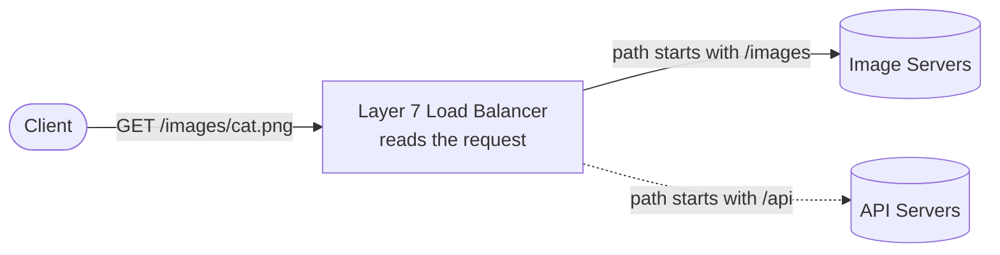
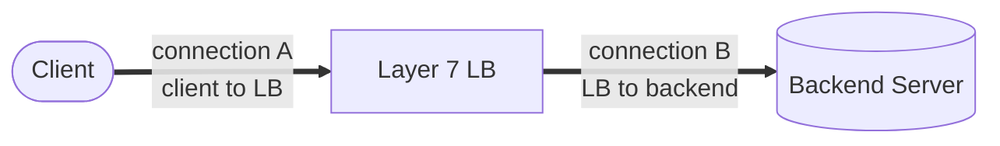
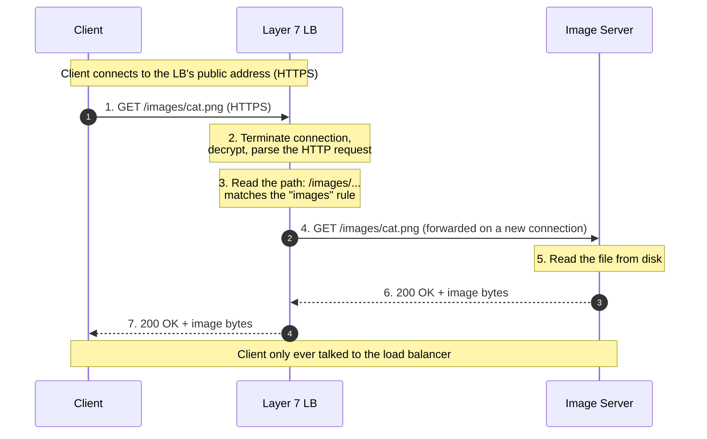
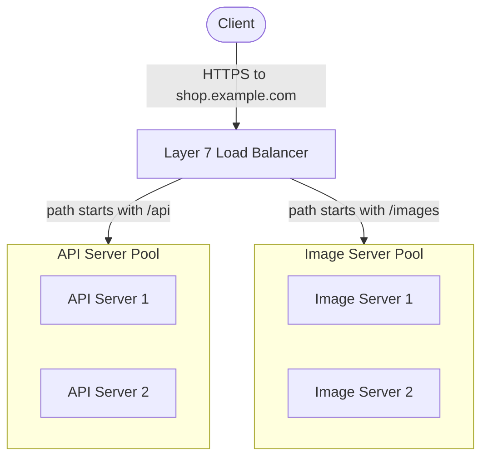

# Layer 7 Load Balancing — Junior

<!-- level-focus -->
At junior level, focus on this question:

> How can I apply **Layer 7 Load Balancing** in one small example and prove the result?

Use the smallest realistic scenario that exposes the decision and its failure behavior.
## 1. The One Idea: A Load Balancer That Reads the Request

You already know a load balancer is a middleman that spreads incoming requests across a pool
of identical backend servers. A **Layer 7 load balancer** adds one capability that changes
everything: **it opens the request and reads what is inside before deciding where to send it.**

That single ability — reading the request — is the whole seed of this topic. A plain load
balancer might only see "a connection arrived from some IP address, send it to a server." A
Layer 7 load balancer sees "this is a `GET` for `/images/cat.png` on host `shop.example.com`,
from a logged-in user, wanting JSON back." Because it understands the *content* of the request,
it can make a *smart* routing decision: send image requests to the image servers, API requests
to the API servers, and so on.



Read the diagram as a fork in the road where the load balancer picks the branch **based on
what the request is asking for**. The dotted line is the branch it did *not* take this time.
Hold this picture: the L7 load balancer is a load balancer that looks *inside* each request
and routes accordingly.

---

## 2. OSI Layer 7 in Plain Words

Networking is often described as a stack of layers, numbered 1 to 7. You do not need to
memorize all seven right now. You need exactly two ideas:

- **Layer 4 is the "transport" layer.** It deals with *connections* between machines — IP
  addresses and port numbers. At Layer 4 you know "a connection came from `203.0.113.5` and
  wants port `443`," but you do **not** know what the connection is *for*. The content is just
  an opaque stream of bytes flowing through.

- **Layer 7 is the "application" layer.** This is where the meaning lives — the actual HTTP
  request, with its method, its URL, its headers, its cookies. At Layer 7 you can read
  "`GET /api/orders`, host `shop.example.com`, cookie `session=abc123`."

So the name **Layer 7 load balancing** literally means: *a load balancer that operates at the
application layer, so it can understand HTTP*. And **Layer 4 load balancing** means: *a load
balancer that operates at the transport layer, so it only sees connections, not their content*.

The number is not the point — the *visibility* is. Lower layer, less it can see, faster it
goes. Higher layer, more it can see, more work it does. A Layer 7 load balancer trades some
speed for a lot of understanding.

---

## 3. What "Terminating the Connection" Means

Here is the mechanism that makes Layer 7 routing possible, and it is worth slowing down on.

To read an HTTP request, the load balancer cannot simply glance at bytes flying past. HTTP
rides on top of TCP (and usually TLS/HTTPS on top of that). To actually *read* the request,
the load balancer has to be a full participant in the conversation: it must complete the TCP
handshake with the client, decrypt the HTTPS if present, and assemble the bytes into a
complete HTTP message it can parse. In networking terms, we say the load balancer
**terminates the connection** — the client's connection *ends* at the load balancer.

Then the load balancer opens a **second, separate connection** to the chosen backend server
and forwards the request over it. There are two connections, not one:



This is different from a Layer 4 load balancer, which can often just *pass the connection
through* to a backend without ever reading or reassembling its contents. Terminating the
connection is exactly what buys the L7 load balancer the ability to read the request — and it
is also exactly why L7 is heavier than L4 (more on that in §9). Nothing comes for free: to
understand the request, you must first take responsibility for the whole conversation.

---

## 4. What an HTTP Request Actually Contains

Content-based routing only makes sense if you know what "content" the load balancer gets to
inspect. Every HTTP request carries several pieces of readable information. Here are the ones a
Layer 7 load balancer routinely routes on:

| Part of the request | Example value | What routing on it lets you do |
|---|---|---|
| **Method** | `GET`, `POST`, `PUT` | Send writes (`POST`/`PUT`) somewhere different from reads (`GET`) |
| **Host** | `shop.example.com` | Serve many different sites from one load balancer (virtual hosting) |
| **Path** | `/api/orders`, `/images/cat.png` | Send `/api` to one pool, `/images` to another |
| **Headers** | `Accept: application/json` | Route clients that want JSON differently from those wanting HTML |
| **Cookies** | `session=abc123` | Send a user back to the same server every time (session stickiness) |

A quick reading of a raw request makes it concrete:

```text
GET /images/cat.png HTTP/1.1
Host: shop.example.com
Accept: image/png
Cookie: session=abc123
```

A Layer 4 load balancer sees none of this text — to it, this is just encrypted or opaque bytes
on a connection. A Layer 7 load balancer sees **all** of it, and can base its routing decision
on any part: the host `shop.example.com`, the path `/images/cat.png`, the `Accept` header, or
the `session` cookie. That readable structure is the raw material for every clever thing L7
can do.

---

## 5. Content-Based Routing: The Superpower

**Content-based routing** is the headline feature of Layer 7 load balancing: choosing the
backend pool based on *what the request contains*, not just *where the connection came from*.

Because the load balancer can read the request, one public address can quietly fan out to many
specialized backend pools. A few concrete examples of routing rules you can write:

| If the request looks like this | Route it to |
|---|---|
| Path starts with `/api` | The API server pool |
| Path starts with `/images` or `/static` | The static-asset / image server pool |
| Host is `blog.example.com` | The blog service |
| Host is `shop.example.com` | The storefront service |
| Method is `POST` on `/upload` | The upload-handling pool (bigger machines) |
| `Accept: application/json` header present | The JSON API backend |
| Cookie `beta=true` present | The new experimental version of the app |

Every one of these rules is impossible for a plain Layer 4 load balancer, because L4 never
reads the path, host, header, or cookie — it only ever saw an IP and a port. Content-based
routing is the direct payoff of working at the application layer.

---

## 6. A Request, Step by Step

Let us trace one HTTPS request through a Layer 7 load balancer that routes by path. Follow the
numbers.



Reading the trace:

1. The client sends a normal HTTPS request to the load balancer's public address. It believes
   it is talking to "the application."
2. The load balancer **terminates** the connection: it completes the handshake, decrypts, and
   assembles the full HTTP request so it can read it. This is the step a Layer 4 load balancer
   skips.
3. It **reads the path**, `/images/cat.png`, and finds that it matches the rule "paths starting
   with `/images` go to the image pool."
4. It opens a fresh connection to a healthy image server and forwards the request.
5. and 6. The image server does the real work and returns the bytes to the load balancer.
7. The load balancer relays the response back to the client.

The intelligence lived entirely in step 3 — reading the request and matching a rule. That step
is what Layer 4 load balancing simply cannot perform, because it never reads the request in the
first place.

---

## 7. Worked Walk-Through: /api to One Pool, /images to Another

Now the full picture with two rules at once. Imagine one company, one public domain,
`shop.example.com`, but two very different kinds of work behind it:

- **API traffic** (`/api/...`) — dynamic requests that talk to databases, run business logic,
  and return JSON. These want fast, CPU-capable application servers.
- **Image traffic** (`/images/...`) — static files served straight from disk. These want
  simple, cheap servers optimized for shovelling bytes.

A Layer 7 load balancer lets you serve both from one address by routing on the **path**:



Trace two different requests through the same load balancer:

- A request for `GET /api/orders` arrives. The load balancer reads the path, sees it starts
  with `/api`, and forwards it to the **API pool** — then, *within* that pool, it still spreads
  the load across API Server 1 and API Server 2 (that is the ordinary load-balancing job it
  never stops doing).
- A request for `GET /images/cat.png` arrives on the *very same public address*. The load
  balancer reads the path, sees `/images`, and forwards it to the **image pool**, spreading
  across Image Server 1 and 2.

Two crucial observations:

1. **The client did nothing special.** It sent both requests to `shop.example.com`. It has no
   idea there are two separate pools; the split is the load balancer's private decision.
2. **The load balancer is doing two jobs at once.** First, content-based routing (which *pool*,
   based on the path). Second, ordinary load balancing (which *server within the pool*). L7
   never gives up the spreading job — it just adds the routing job on top.

A Layer 4 load balancer physically cannot do this split, because separating `/api` from
`/images` requires reading the path, and the path lives at Layer 7.

---

## 8. What L7 Can Do That L4 Cannot

Here is the side-by-side that captures why anyone reaches for Layer 7 in the first place.

| Capability | Layer 4 (transport) | Layer 7 (application) |
|---|---|---|
| See client IP and port | Yes | Yes |
| Read the URL **path** (`/api`, `/images`) | **No** | **Yes** |
| Route by **host** (many sites, one LB) | **No** | **Yes** |
| Route by **HTTP header** (e.g., `Accept`) | **No** | **Yes** |
| Route by **cookie** (session stickiness) | **No** | **Yes** |
| Route by HTTP **method** (`GET` vs `POST`) | **No** | **Yes** |
| Terminate TLS / decrypt HTTPS at the LB | Usually no | **Yes** |
| Inspect or modify HTTP headers | **No** | **Yes** |
| Raw speed / requests per second | **Higher** | Lower (more work per request) |
| Understands what the request *means* | **No** | **Yes** |

Read the table top to bottom and a pattern appears: **almost everything L7 can do and L4 cannot
comes from the same root cause — L7 reads the request and L4 does not.** Path routing, host
routing, header routing, cookie stickiness, TLS termination, header editing: all of them require
seeing inside the HTTP message. The only rows where L4 *wins* are the last two — raw speed — and
those are exactly the price L7 pays for its understanding.

---

## 9. The Cost: Smarter Means Heavier

Layer 7 load balancing is not free, and a junior engineer should know the trade-off honestly.

To read a request, the L7 load balancer must **terminate the connection** (§3): complete the
TCP handshake, decrypt HTTPS, and reassemble and parse the HTTP message. That is real work,
done on *every single request*. A Layer 4 load balancer, which often just forwards connections
without reading them, does far less per request — so for the same hardware it can typically push
more raw traffic.

The trade-off in one line:

- **Layer 4** — sees less (just IP and port), so it is **faster and lighter**, but it can only
  spread connections blindly.
- **Layer 7** — sees everything (the full HTTP request), so it is **smarter but heavier**, and
  it can route intelligently by path, host, header, or cookie.

Neither is "better." They sit at different points on a speed-versus-intelligence curve. You
choose Layer 7 when you need content-based routing — path splitting, virtual hosting, header
rules, session stickiness, TLS termination in one place. You choose Layer 4 when you just need
to spread raw connections as fast as possible and do not care what is inside them. Many large
systems even use both: a fast L4 layer at the very edge, and L7 load balancers deeper in to do
the smart routing.

---

## 10. Common Confusions to Clear Up Now

- **"Layer 7 is just a faster load balancer."** The opposite. Layer 7 is *smarter* but
  *slower/heavier* per request than Layer 4, precisely because it does more work — reading and
  parsing every request. It trades speed for understanding.

- **"The client picks the pool by using a different address."** No. In the walk-through the
  client sent everything to one address, `shop.example.com`. The *load balancer* decided
  `/api` versus `/images` by reading the path. Hiding that decision is the whole feature.

- **"L7 stops load balancing once it routes by path."** No. It does both at once: first choose
  the pool by content, then still spread load across the servers *within* that pool. Content
  routing is added on top of ordinary load balancing, not instead of it.

- **"You must decrypt HTTPS, so L7 is insecure."** Terminating TLS at the load balancer is a
  normal, deliberate design — it lets you handle certificates in one place. The traffic can be
  re-encrypted on the second connection to the backend. This is a design choice, not a flaw;
  the deeper details come later.

- **"L4 could route by path if configured right."** It cannot. The path lives inside the HTTP
  request, at Layer 7. A load balancer that never reads the request has no path to route on —
  that is the definition, not a configuration gap.

---

## 11. Recap and a Small Exercise

The mental model, compressed:

- **Layer 7 = the application layer**, where the actual HTTP request lives — method, host,
  path, headers, cookies.
- A **Layer 7 load balancer terminates the connection**, reads the full HTTP request, and
  routes based on its **content** — this is **content-based routing**.
- That lets it do things a **Layer 4** load balancer cannot: split `/api` from `/images`, serve
  many hosts from one address, route by header or cookie, and terminate TLS in one place.
- The price is weight: reading every request is more work, so L7 is **smarter but heavier**,
  while L4 is **faster but blind** to content.
- L7 never stops load balancing — it first picks the *pool* by content, then still spreads load
  across the servers *within* that pool.

**Exercise.** On paper, draw a client, one Layer 7 load balancer, and two pools: an API pool
(two servers) and an image pool (two servers). Now answer four questions with one sentence each:
(1) What single address does the client send *all* requests to? (2) When `GET /api/orders`
arrives, what does the load balancer *read* to decide where it goes? (3) After it picks the API
pool, does its job end, or does it do one more thing? (4) Why could a Layer 4 load balancer
*not* perform this `/api` versus `/images` split? If your answers are "one public address,"
"the request's path," "no — it still spreads the request across the two servers in the pool,"
and "because the path lives at Layer 7 and an L4 load balancer never reads it," you already hold
the Layer 7 mental model — the rest is detail on *which* parts of the request to route on and
*how* to write the rules.

Canonical references (optional, for the curious): Cloudflare Learning — *What is layer 7?* and
*What is load balancing?*; MDN Web Docs — *An overview of HTTP* (for HTTP methods, headers, and
requests); NGINX docs on HTTP load balancing and content-based routing.

*Next step:* [Layer 7 Load Balancing — Middle](middle.md)

---

## Apply it

1. Choose one small, known input for **Layer 7 Load Balancing**.
2. Predict the output or observable behavior.
3. Run the smallest example or probe that exercises the concept.
4. Change one input to trigger a failure or boundary case.
5. Explain the evidence using the guide's vocabulary.

## Verify your work

- Record the exact input, command or code path, and output.
- Repeat the probe and confirm the result is consistent.
- Show one expected success and one expected failure.
- Resolve any difference between the prediction and the evidence.

## Review questions

- What problem does Layer 7 Load Balancing solve in the example?
- Which input changes the observed result, and why?
- What is the smallest useful success check?
- Which beginner mistake would your evidence catch?
