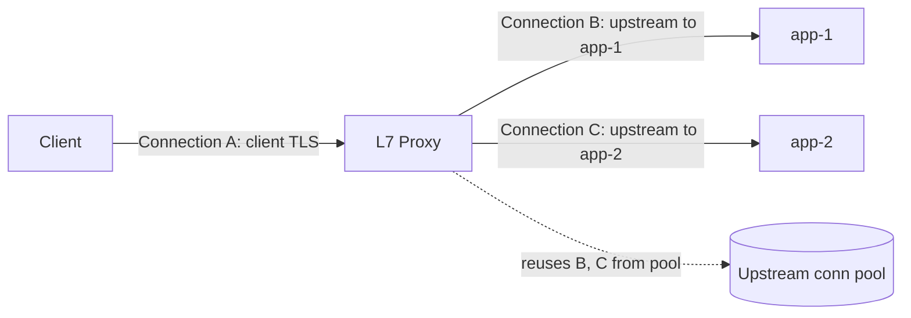
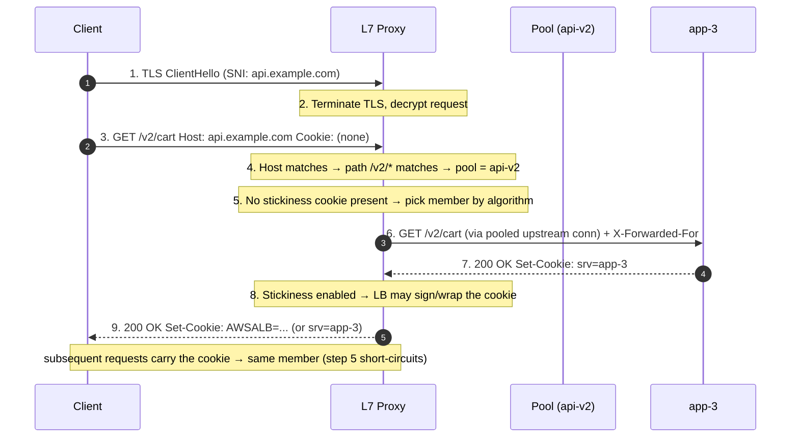

# Layer 7 Load Balancing — Middle

<!-- level-focus -->
At middle level, focus on this question:

> Where does **Layer 7 Load Balancing** belong in a maintainable component, and which trade-off selects the design?

Use the smallest realistic scenario that exposes the decision and its failure behavior.
---

## 2. What Changes When You Move to L7

An L4 balancer pins a client connection to one backend for the connection's lifetime;
every byte on that socket goes to the same server. An L7 proxy makes an independent
decision *per request*, because it has terminated the client connection and owns a
separate connection to the pool. Three consequences drive everything below.



- **Two connections, not one.** The proxy is the server to the client and a client to
  the pool. This is what enables TLS termination, connection reuse (keep-alive
  multiplexing many client requests onto few upstream connections), and protocol
  translation (HTTP/2 in front, HTTP/1.1 to legacy backends).
- **Per-request routing.** Because the request is fully parsed, the target pool can
  depend on `Host`, path, a header, or a cookie. Two requests on the *same* client
  connection can go to *different* backends.
- **The proxy can rewrite.** It can add/strip/modify headers, rewrite the path,
  buffer the body, compress the response, and inject `X-Forwarded-*`. An L4 balancer
  cannot touch any of this without breaking the byte stream.

The cost: parsing HTTP, buffering, and running two TLS stacks is more CPU and latency
per request than shovelling packets. The benefit is control — you route on *meaning*,
not on IP addresses.

---

## 3. Content-Based Routing: Host, Path, Header, Cookie

An L7 rule is a **predicate → action** pair: "if the request matches this condition,
send it to that target group / upstream." Rules are evaluated in priority order; the
first match wins (ALB and Envoy are explicitly first-match; NGINX `location` has its
own longest-prefix-then-regex ordering). The four predicates you reach for constantly:

| Predicate | Matches on | Typical use | Cheap? |
|-----------|-----------|-------------|--------|
| **Host** | `Host` header (SNI at TLS) | Multi-tenant / multi-domain on one LB (`api.x.com` vs `www.x.com`) | Yes — one header lookup |
| **Path** | request target path | Route `/api/*` to API pool, `/static/*` to CDN origin, `/checkout` to a canary | Yes — prefix/exact match is fast; regex is slower |
| **Header** | any request header value | Route by `Accept-Version: 2`, `User-Agent` (mobile vs web), internal `X-Canary: true` | Yes — one header lookup; regex on value costs more |
| **Cookie** | a named cookie's presence/value | A/B tests, beta cohorts, sticky routing to a session's shard | Moderate — must parse the `Cookie` header |
| **Method / query** | HTTP method, query string | Send writes to a primary pool, reads to replicas; route `?debug=1` traffic | Moderate |

**Ordering matters.** Put the most specific rules first and the catch-all last. A rule
that matches `/api/v2/payments` must sit above the broader `/api/*`, or the broad rule
swallows it. Combine predicates with AND semantics for precision:
`Host = api.x.com AND Path = /internal/*` → internal pool.

`ALB listener rules (path + host + header)`:
```text
Listener :443
  Rule 10 (priority 10):
    IF host-header = "api.example.com" AND path-pattern = "/v2/*"
    THEN forward → target-group "api-v2"
  Rule 20 (priority 20):
    IF path-pattern = "/static/*"
    THEN forward → target-group "static-origin"
  Rule 30 (priority 30):
    IF http-header "X-Canary" = "true"
    THEN forward → target-group "api-canary"  (weight 100)
  Default action:
    forward → target-group "api-v1"
```

`NGINX (host = server_name, path = location)`:
```nginx
server {
    listen 443 ssl;
    server_name api.example.com;

    location /v2/ { proxy_pass http://api_v2; }
    location /static/ { proxy_pass http://static_origin; }

    # header-based routing via a map (evaluated once per request)
    location / {
        if ($http_x_canary = "true") { proxy_pass http://api_canary; break; }
        proxy_pass http://api_v1;
    }
}
```

`Envoy route table (virtual host + prefix + header match)`:
```yaml
virtual_hosts:
  - name: api
    domains: ["api.example.com"]
    routes:
      - match: { prefix: "/v2/" }
        route: { cluster: api_v2 }
      - match: { prefix: "/static/" }
        route: { cluster: static_origin }
      - match:
          prefix: "/"
          headers: [{ name: "x-canary", exact_match: "true" }]
        route: { cluster: api_canary }
      - match: { prefix: "/" }
        route: { cluster: api_v1 }
```

---

## 4. Routing Decision Flow (Staged)

The following shows one request walking the full L7 pipeline: TLS termination, predicate
evaluation (host → path → cookie), sticky-cookie resolution, upstream selection, and
the `Set-Cookie` on the way back. Note that the routing decision and the stickiness
decision are *separate* stages — routing picks the pool, stickiness picks the member
within it.



---

## 5. TLS Termination at L7

Because an L7 proxy must read the HTTP request, it must first decrypt it — so the TLS
session almost always ends at the proxy. This is **TLS termination**: the client's
HTTPS connection ends at the LB, which holds the certificate and private key. From
there you choose how the LB talks to the pool:

- **Termination (edge)** — plaintext HTTP to the backend. Simplest, lowest backend CPU.
  Safe only when the LB→backend hop is a trusted network (same VPC/subnet, security-group
  locked). Backends see plaintext; the LB does all crypto.
- **Re-encryption (end-to-end / TLS bridging)** — the LB terminates the client TLS, then
  opens a *new* TLS connection to the backend. Needed for compliance ("encrypted in
  transit everywhere") and zero-trust networks. Costs a second handshake and double the
  crypto CPU, but the LB still sees plaintext in between (that is the point — it can route
  and rewrite).
- **TLS passthrough** — the LB does *not* decrypt; it forwards the TLS bytes and routes
  only on SNI. But then it is effectively an **L4** balancer for that listener: no
  path/header/cookie routing, no header injection, no compression. Use passthrough only
  when the backend must own the cert (e.g., mutual TLS to the app) and you are willing to
  give up L7 features.

What termination buys you operationally: **central certificate management** (one place
to rotate certs / run ACME / attach ACM certs), **SNI-based multi-domain** on one
listener (present the right cert per `Host`), **HTTP/2 and modern-cipher offload** so
old backends don't need to speak them, and **a single audit point** for TLS policy
(minimum version, cipher suites, OCSP stapling).

```text
Termination modes and where crypto happens:

  client --TLS--> [LB terminates] --plaintext--> backend      (edge termination)
  client --TLS--> [LB terminates] --TLS(new)---> backend      (re-encryption)
  client --TLS--------------------------------> backend       (passthrough → L4 only)
```

`Envoy: terminate TLS with SNI-selected cert, re-encrypt upstream`:
```yaml
filter_chains:
  - filter_chain_match: { server_names: ["api.example.com"] }
    transport_socket:               # downstream (client-facing) TLS: terminate
      name: envoy.transport_sockets.tls
      typed_config:
        "@type": type.googleapis.com/envoy.extensions.transport_sockets.tls.v3.DownstreamTlsContext
        common_tls_context:
          tls_params: { tls_minimum_protocol_version: TLSv1_2 }
          tls_certificates: [{ certificate_chain: {...}, private_key: {...} }]
# upstream cluster re-encrypts:
clusters:
  - name: api_v2
    transport_socket:
      name: envoy.transport_sockets.tls   # open a fresh TLS to the backend
```

Set `tls_minimum_protocol_version` to at least TLS 1.2 (prefer 1.3), disable renegotiation,
and prefer AEAD ciphers. See the MDN TLS overview and Envoy's TLS docs for policy details.

---

## 6. Cookie-Based Sticky Sessions

Some backends hold **per-user state in memory** (an in-process session, a WebSocket, an
upload assembling in RAM). If successive requests from that user land on different
members, the state is missing. **Session affinity** (a.k.a. stickiness) pins a client to
one member. At L7 the durable mechanism is a **cookie** — because the LB can read and
write cookies, affinity survives NAT and changing client IPs (unlike L4 source-IP hashing).

Two flavors:

- **Duration-based / LB-generated cookie.** The LB issues its own opaque, usually signed
  cookie (ALB's `AWSALB` / `AWSALBAPP`) encoding the chosen member plus an expiry. The LB
  reads it back on later requests and skips member selection. The app never sees the
  routing logic; the cookie is tamper-resistant because the LB signs it.
- **Application-controlled cookie.** The app sets a cookie (e.g., `JSESSIONID`, or a
  custom `srv=app-3`) and the LB is told which cookie name to hash/honor for affinity
  (NGINX `sticky cookie`, Envoy hash policy on a cookie). Affinity lifetime tracks the
  app's session, not a separate LB timer.

**The tradeoff you must state out loud:** stickiness undermines even load distribution.
A member that accumulated many long-lived sessions stays hot even after new members
join; draining a member for deploy means either breaking sessions or waiting for them to
expire. **Stickiness is a workaround for stateful backends, not a feature to enable by
default.** The senior-level answer is to externalize session state (Redis, signed
JWT/cookie state, sticky-less design) so *any* member can serve *any* request — then
stickiness becomes unnecessary. Reach for cookies only when you cannot make the backend
stateless (legacy apps, in-progress uploads, long-lived WebSockets).

`NGINX: LB-inserted sticky cookie`:
```nginx
upstream app {
    server app-1:8080;
    server app-2:8080;
    server app-3:8080;
    sticky cookie srv expires=1h domain=.example.com path=/;
    # NGINX inserts Set-Cookie: srv=<hash>; later requests routed to that member
}
```

`Envoy: hash-based affinity on an app cookie (with TTL to generate if absent)`:
```yaml
route:
  cluster: app
  hash_policy:
    - cookie: { name: "srv", ttl: 3600s }   # Envoy generates the cookie if missing
# cluster must use a hashing LB policy:
clusters:
  - name: app
    lb_policy: RING_HASH        # or MAGLEV — consistent hashing over members
```

Using **consistent hashing** (ring/maglev) for the cookie hash means adding or removing
one member reshuffles only ~1/N of sessions instead of all of them — the difference
between a rolling deploy that drops a few sessions and one that drops every session.

---

## 7. Header Manipulation and the X-Forwarded-* Family

When the LB terminates the connection, the backend no longer sees the *client's* TCP
peer — it sees the *LB's*. Every backend that logs client IPs, does geo/rate-limiting,
or builds absolute URLs would get this wrong. L7 proxies fix it by injecting forwarding
headers. Know these four cold:

| Header | Carries | Set by | Backend uses it for |
|--------|---------|--------|---------------------|
| `X-Forwarded-For` | original client IP (and proxy chain) | proxy, appended | client IP logging, rate limits, geo |
| `X-Forwarded-Proto` | original scheme (`https`/`http`) | proxy | knowing the request was TLS after termination; redirect-to-HTTPS logic |
| `X-Forwarded-Host` | original `Host` the client sent | proxy | building absolute URLs / links |
| `X-Forwarded-Port` | original client-facing port | proxy | same as above |
| `Forwarded` (RFC 7239) | all of the above, standardized | proxy | the single-header modern alternative |

**Security note on `X-Forwarded-For`:** it is a *client-supplied header* upstream of your
proxy. A client can send a fake `X-Forwarded-For: 1.2.3.4` to spoof its IP. The rule: the
edge proxy must **overwrite** (not append to) any client-supplied `X-Forwarded-For`, or
your app must trust *only* the specific value your own proxy appends (e.g., "the Nth from
the right, where N = number of trusted proxies"). Blindly trusting the leftmost value is a
common IP-spoofing / rate-limit-bypass bug.

Beyond forwarding headers, L7 proxies routinely: **strip hop-by-hop headers**
(`Connection`, `Keep-Alive`, `Proxy-*`) that must not be forwarded; **add** response
security headers (HSTS, `X-Content-Type-Options`) centrally; **remove** internal headers
(`X-Internal-*`, backend version) before responses leave; and **rewrite** the `Host` or
path for backends that expect a different value.

`NGINX: standard forwarding-header block`:
```nginx
location / {
    proxy_pass http://app;
    proxy_set_header Host              $host;
    proxy_set_header X-Real-IP         $remote_addr;
    proxy_set_header X-Forwarded-For   $proxy_add_x_forwarded_for;  # appends
    proxy_set_header X-Forwarded-Proto $scheme;
    proxy_set_header X-Forwarded-Host  $host;
    proxy_hide_header X-Internal-Token;   # strip internal header from responses
}
```
> `$proxy_add_x_forwarded_for` *appends* — safe only if a trusted edge already sanitized
> the header. At the true edge, set `X-Forwarded-For $remote_addr` to overwrite instead.

`Envoy: append client address, strip a header, add a security header`:
```yaml
http_connection_manager:
  use_remote_address: true        # Envoy manages XFF from the real peer, ignoring spoofed
  route_config:
    request_headers_to_remove: ["x-internal-token"]
    response_headers_to_add:
      - header: { key: "strict-transport-security", value: "max-age=31536000" }
```
`use_remote_address: true` makes Envoy set `X-Forwarded-For` from the actual downstream
peer — the correct, spoof-resistant default for an edge proxy.

---

## 8. Request Buffering

Because the LB is a full HTTP endpoint, it can **read the whole request (or response)
into a buffer** before forwarding. This decouples a slow client from a fast backend.

- **Request buffering.** The proxy reads the entire request body from the (possibly slow)
  client before it opens/holds an upstream connection. Benefit: the backend worker is
  occupied only for the fast LB→backend transfer, not for the seconds a mobile client
  takes to upload — this is the primary defense against **slowloris** and slow-body DoS,
  and it keeps backend worker threads free. Cost: added latency for large bodies and
  proxy memory/disk for the buffer; big uploads may spill to disk.
- **Response buffering.** The proxy reads the response from the backend quickly, frees the
  backend, then dribbles it out to a slow client at the client's pace. Frees backend
  connections sooner.

When you must **turn buffering off**: streaming responses (SSE, chunked live logs,
long-polling) and large uploads where you want to stream straight through must set
`proxy_request_buffering off` / `proxy_buffering off` (NGINX) so bytes flow immediately
rather than being held until complete. Getting this wrong is a classic "my SSE stream
doesn't arrive until the connection closes" bug.

`NGINX: buffer normal traffic, stream an SSE endpoint`:
```nginx
# default: buffering on (good for typical request/response)
location /api/upload {
    proxy_request_buffering off;   # stream large uploads straight through
    proxy_pass http://app;
}
location /events {
    proxy_buffering off;           # SSE: send each event immediately
    proxy_read_timeout 1h;         # long-lived stream
    proxy_pass http://app;
}
```

Trade-off in one line: **buffering protects the backend from slow clients but adds latency
and memory; streaming gives real-time delivery but ties up backend workers for the
client's full duration.**

---

## 9. Retries and Timeouts at the Request Level

Owning both connections lets the L7 proxy apply **per-request** timeouts and retries — it
can give up on one backend and try another *transparently to the client*.

**Timeouts to set (and why each exists):**

| Timeout | Guards against | Typical order of magnitude |
|---------|----------------|---------------------------|
| Connect timeout | dead/unreachable member | 1–5 s |
| Request/read (upstream) timeout | a backend that accepted but hangs | matched to the endpoint's SLO |
| Idle (keep-alive) timeout | reaping idle pooled connections | seconds to minutes |
| Overall route timeout | total time budget for the request | the client's own deadline |

Set timeouts *below* the client's timeout so the proxy fails fast and can retry, rather
than the client giving up first.

**Retries — the safety rule that matters:** retry **only idempotent requests**, and only
on failures that mean "this backend never processed it." Retrying a non-idempotent `POST`
that *did* run on the backend but whose response was lost will **double-charge / duplicate**
(the same problem as duplicate delivery — see the idempotency-key pattern). Safe retry
conditions: connection refused/reset, connect timeout, or an explicit "retriable" 5xx from
a *different, healthy* member. Always cap retries (e.g., 1–2) and prefer **retry with
backoff + jitter** and a **retry budget** (bound retries to a small fraction of total
traffic) so retries don't amplify an overload into a **retry storm** that finishes off a
struggling pool.

`Envoy: bounded, idempotent-safe retries with a per-try timeout`:
```yaml
route:
  cluster: app
  timeout: 3s                       # overall route budget
  retry_policy:
    retry_on: "connect-failure,reset,retriable-status-codes"
    retriable_status_codes: [503]
    num_retries: 2
    per_try_timeout: 1s             # each attempt gets its own budget
    # host_selection over healthy members ensures a retry avoids the failed one
```

`NGINX: retry next upstream on connection-level errors only`:
```nginx
location / {
    proxy_pass http://app;
    proxy_connect_timeout 2s;
    proxy_read_timeout    5s;
    proxy_next_upstream   error timeout http_502 http_503;  # NOT on non_idempotent by default
    proxy_next_upstream_tries 2;
    proxy_next_upstream_timeout 6s;
}
```
> NGINX will **not** retry non-idempotent methods on error/timeout unless you explicitly
> add `non_idempotent` to `proxy_next_upstream` — leaving it off is the safe default.

---

## 10. gRPC and HTTP/2 Awareness

Modern L7 balancing must understand **HTTP/2** (and gRPC, which rides on HTTP/2), because
a naive L4/round-robin approach silently misbehaves with it.

- **HTTP/2 multiplexes many requests (streams) over ONE long-lived connection.** An L4
  balancer picks a backend *per connection* — so with HTTP/2, *all* streams from a client
  are stuck on one backend. Under gRPC, where a client typically opens one connection and
  fires thousands of RPCs down it, this means one backend gets hammered while others sit
  idle. **L7 load balancing distributes per-request (per-stream)**, which is the whole
  reason you need L7 (or a gRPC-aware proxy) for gRPC.
- **The proxy must negotiate `h2` via ALPN** during the TLS handshake and often speak
  **HTTP/2 to the backend too** (gRPC requires HTTP/2 end-to-end; you cannot downgrade a
  gRPC call to HTTP/1.1). So `h2c`/HTTP/2 must be enabled on the *upstream* side, not just
  the client side.
- **gRPC errors are in trailers, not the status line.** A gRPC call returns HTTP `200`
  and puts the real result in a `grpc-status` **trailer**. A proxy that keys retries or
  health on the HTTP status code alone thinks every failed RPC "succeeded." A gRPC-aware
  proxy inspects `grpc-status` for retriable codes (e.g., `UNAVAILABLE`) and can do gRPC
  health checking.

| Concern | HTTP/1.1 behavior | HTTP/2 + gRPC behavior |
|---------|-------------------|------------------------|
| Concurrency | one request per connection (pipeline rarely used) | many streams multiplexed on one connection |
| L4 balancing | roughly fair (many connections) | **broken** — one backend per connection |
| Balancing unit needed | connection | **request/stream (L7)** |
| Upstream protocol | HTTP/1.1 fine | must be HTTP/2 end-to-end for gRPC |
| Error signal | HTTP status code | HTTP 200 + `grpc-status` **trailer** |

`Envoy: HTTP/2 downstream + upstream, gRPC-aware retries`:
```yaml
http_connection_manager:
  codec_type: AUTO               # ALPN-negotiate h2 with the client
routes:
  - match: { prefix: "/" , grpc: {} }
    route:
      cluster: grpc_app
      retry_policy:
        retry_on: "unavailable"   # keyed on grpc-status, not just HTTP code
        num_retries: 2
clusters:
  - name: grpc_app
    typed_extension_protocol_options:   # speak HTTP/2 to the backend too
      envoy.extensions.upstreams.http.v3.HttpProtocolOptions:
        explicit_http_config: { http2_protocol_options: {} }
```

`NGINX: gRPC pass-through`:
```nginx
location / {
    grpc_pass grpc://grpc_app;   # NGINX speaks HTTP/2 to a gRPC upstream
}
```

On AWS, ALB supports HTTP/2 and gRPC target groups with gRPC health checks; if you need
per-stream gRPC balancing that ALB's model doesn't cover, an Envoy-based proxy or a
service mesh is the usual answer.

---

## 11. Config Cheat-Sheet: ALB vs NGINX vs Envoy

The three you will most often touch, mapped to the concepts above. They differ in
*naming*, not fundamentally in *capability*.

| Concept | AWS ALB | NGINX | Envoy |
|---------|---------|-------|-------|
| Host routing | listener rule `host-header` | `server_name` | `virtual_hosts.domains` |
| Path routing | listener rule `path-pattern` | `location` (prefix/regex) | route `match.prefix` / `path` |
| Header/cookie routing | rule `http-header` / `http-request-method` | `map` / `if` on `$http_*` / `$cookie_*` | route `match.headers` / `hash_policy.cookie` |
| Backend pool | target group | `upstream` block | `cluster` |
| TLS termination | listener cert (ACM) | `ssl_certificate` | `DownstreamTlsContext` |
| Re-encrypt upstream | HTTPS target group | `proxy_pass https://` | cluster `transport_socket` TLS |
| Sticky sessions | duration/app cookie (`AWSALB*`) | `sticky cookie` | `hash_policy.cookie` + ring/maglev |
| Forwarding headers | auto `X-Forwarded-*` | `proxy_set_header X-Forwarded-*` | `use_remote_address: true` |
| Per-request retries | limited (target-group health) | `proxy_next_upstream` | `retry_policy` (richest) |
| Timeouts | idle timeout (per LB) | `proxy_*_timeout` | route `timeout` + `per_try_timeout` |
| gRPC/HTTP2 | HTTP/2 + gRPC target groups | `grpc_pass` | native, first-class |

Rule of thumb: **ALB** = managed, least config, good default for AWS HTTP(S) apps but
coarser retry/routing control; **NGINX** = ubiquitous, great single-node reverse proxy,
config directives; **Envoy** = most programmable (dynamic config, richest retry/outlier/gRPC
support), the data plane behind most service meshes. Consult the vendor docs (AWS ALB
listener rules, NGINX `ngx_http_proxy_module`, Envoy route/HTTP filter docs) for exact
syntax and version-specific fields.

---

## 12. Middle Checklist

- [ ] Routing rules are ordered most-specific-first; a catch-all default exists.
- [ ] TLS termination mode chosen deliberately (edge vs re-encrypt vs passthrough) with
      minimum TLS 1.2 and central cert management.
- [ ] Stickiness enabled *only* where the backend is genuinely stateful; a plan to
      externalize session state is noted so stickiness can be removed later.
- [ ] Sticky affinity uses consistent hashing (ring/maglev) so scaling reshuffles ~1/N,
      not all sessions.
- [ ] `X-Forwarded-For` is overwritten (not blindly appended) at the true edge; the app
      trusts only the value your proxy sets. `X-Forwarded-Proto`/`-Host` set for backends.
- [ ] Request/response buffering is on by default but OFF for SSE/streaming/large uploads.
- [ ] Timeouts (connect / read / overall) set below the client's timeout; retries are
      bounded, idempotent-only, use backoff+jitter, and have a retry budget.
- [ ] gRPC/HTTP2 services balanced per-stream (L7/gRPC-aware), HTTP/2 spoken to the
      upstream, and retries keyed on `grpc-status` — not just the HTTP status code.

*Next step:* [Layer 7 Load Balancing — Senior](senior.md)

---

## Apply it

1. Find a real component where **Layer 7 Load Balancing** affects an interface or dependency.
2. Write two plausible choices and the constraint that favors each one.
3. Make the smallest reversible change at that boundary.
4. Exercise the component alone, then exercise the integrated flow.
5. Keep the decision note with the evidence that selected the option.

## Verify your work

- A focused check proves the local behavior.
- An integrated check proves callers and dependencies still agree.
- Logs, traces, compiler output, or benchmarks expose the boundary.
- Reverting the change restores the previous behavior without unrelated edits.

## Review questions

- Which boundary is most affected by Layer 7 Load Balancing?
- What constraint would make you choose the alternative design?
- How would you isolate a local defect from an integration defect?
- What evidence shows that the change remains maintainable?
