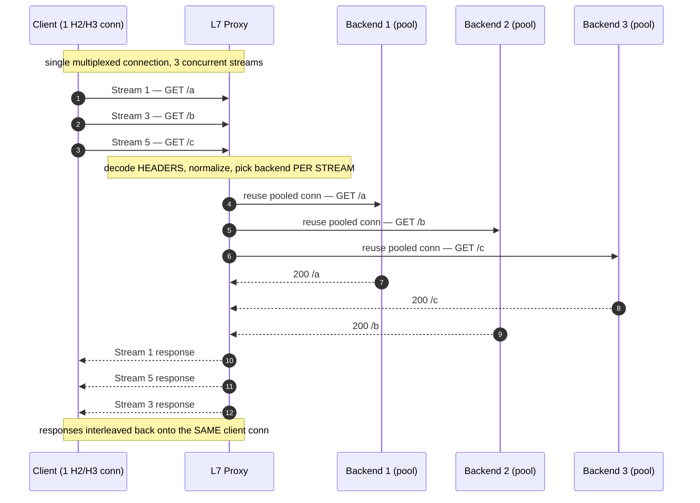
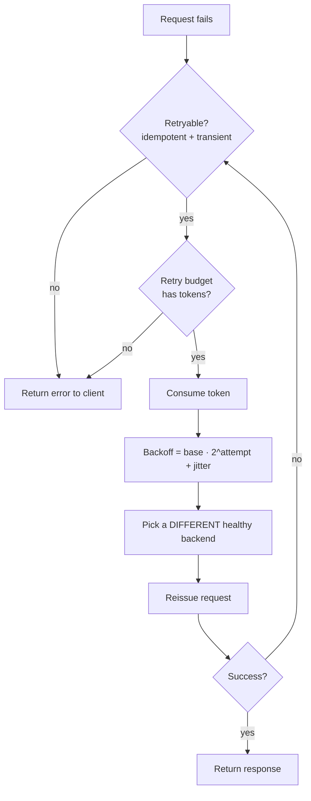

# Layer 7 Load Balancing — Professional

<!-- level-focus -->
At professional level, focus on this question:

> How should teams adopt and operate **Layer 7 Load Balancing** with measurable outcomes and limited coordination?

Use the smallest realistic scenario that exposes the decision and its failure behavior.
---

## 1. The Balancing Unit Problem: Connection vs Request vs Stream

An L4 balancer distributes **connections**. Once a TCP flow is pinned to a backend, every
byte on that flow rides to the same place; the balancer never looks inside. That is correct
and cheap when a connection carries one unit of work at a time (HTTP/1.1, one in-flight
request per connection). It is *wrong* the moment a single connection multiplexes many
independent requests.

HTTP/2 (RFC 9113) and HTTP/3 (RFC 9114) both multiplex: a single transport connection carries
many concurrent **streams**, each stream an independent request/response exchange. The load
that matters is per-request, but the transport pins per-connection. If an L7 proxy naïvely
inherited L4 semantics — "one connection, one backend for its lifetime" — then a client's
long-lived HTTP/2 connection would send *all* of its requests to one backend, defeating
balancing entirely.

The correct L7 answer: **terminate the client connection, decompose it into requests, and
choose a backend per request (per stream).** The backend-side connection is a *separate*
pooled connection, not a 1:1 relay of the client connection. This decoupling is the single
most important structural fact about modern L7 load balancing.

| Balancing unit | Where used | Failure mode it avoids | Failure mode it introduces |
|----------------|-----------|------------------------|----------------------------|
| Per-connection (L4) | TCP/UDP passthrough, TLS passthrough | Zero per-request CPU; preserves e2e TLS | Long-lived H2/H3 conns concentrate all load on one backend |
| Per-request (L7, HTTP/1.1) | Classic reverse proxy | Even distribution across requests | Head-of-line at connection level; no intra-conn concurrency |
| **Per-stream (L7, HTTP/2/3)** | Modern L7 proxy (Envoy/nginx/HAProxy) | Even distribution even with 1 client conn | Requires full protocol termination + upstream pool management |

The rest of this file assumes the per-stream model, because it is the only one that keeps a
fleet balanced under HTTP/2 and HTTP/3.

---

## 2. HTTP/2 Multiplexing and Load Concentration (RFC 9113)

### 2.1 The concentration mechanism

HTTP/2 encourages **one connection per origin** (RFC 9113 §9.1 recommends against opening
multiple connections to the same origin, and clients coalesce aggressively). A client keeps
that connection alive for minutes and pushes dozens to thousands of requests through it as
independent streams (stream IDs are 31-bit; RFC 9113 §5.1.1).

Now consider a passthrough or connection-pinned proxy in front of *N* backends. Suppose *C*
clients each hold one long-lived H2 connection. Connection-level balancing distributes *C*
connections over *N* backends, so each backend owns roughly `C/N` connections. But the request
rate per client is not uniform — it is heavy-tailed. A single "power" client generating 40%
of requests pins 40% of the total request load onto whichever backend caught its one
connection. The variance in per-backend request load is governed by the variance of
per-connection request rate, not by the (much smoother) count of connections.

Formally, if connection *i* emits requests at rate λᵢ and is assigned to backend *b(i)*, the
load on backend *j* is:

```text
L_j = Σ_{i : b(i)=j} λᵢ
```

With per-connection balancing you control only the *cardinality* of the assignment, not the
λᵢ inside each bucket. Since Var(λᵢ) is large (heavy-tailed clients), Var(L_j) stays large
even as N grows. **Adding backends does not fix the imbalance** — this is why connection-level
balancing of HTTP/2 traffic produces persistently hot backends.

### 2.2 Why per-stream fixes it

Per-stream balancing changes the assignment granularity from connections to requests. Now each
of the ΣλᵢΔt requests in a window is independently placed:

```text
L_j ≈ (1/N) · Σ_i λᵢ        (with variance shrinking like 1/√(requests) )
```

The law of large numbers now works *for* you: individual client heaviness averages out across
backends because each request is placed on its own. This is the theoretical justification for
terminating H2 and rebalancing at the stream level rather than pinning the connection.

### 2.3 Flow control and HOL considerations

RFC 9113 gives HTTP/2 per-stream and connection-level flow-control windows (§5.2). An L7 proxy
must maintain independent windows toward the client and toward each upstream, because it is now
a full protocol endpoint on both sides, not a byte relay. Note the residual HOL-blocking risk:
HTTP/2 multiplexes over one TCP connection, so a single lost TCP segment stalls *all* streams on
that connection until retransmission. The LB cannot fix TCP-level HOL blocking on the client
side — only HTTP/3 (next section) removes it.

---

## 3. HTTP/3 over QUIC: What Changes for the LB (RFC 9114)

HTTP/3 (RFC 9114) maps HTTP semantics onto QUIC. Two properties reshape the LB:

1. **Independent streams at the transport layer.** QUIC gives each stream its own delivery
   context, so a lost packet stalls only the stream(s) whose data it carried — eliminating the
   TCP-level HOL blocking that HTTP/2 still suffers. The per-stream balancing argument from §2
   applies identically; the LB still terminates and rebalances per request.

2. **Connection IDs instead of the 4-tuple.** QUIC connections are identified by a
   connection ID, not the (src IP, src port, dst IP, dst port) 4-tuple. A client can migrate
   networks (Wi-Fi → cellular) and keep the same QUIC connection under a new IP. This breaks any
   L4 balancer that hashes the 4-tuple: after migration, packets for the same connection hash to
   a *different* backend. Correct L3/L4 front-ends for HTTP/3 must route on the QUIC connection
   ID (or embed a routing hint in the server-chosen connection ID) so all packets of a connection
   reach the same QUIC terminator.

3. **UDP, not TCP.** HTTP/3 rides UDP. Health checks, MTU/PMTUD handling, and amplification
   limits (a server must not send more than a bounded multiple of the bytes received from an
   unvalidated address) become the LB/terminator's concern.

| Concern | HTTP/2 (RFC 9113, over TCP) | HTTP/3 (RFC 9114, over QUIC/UDP) |
|---------|-----------------------------|----------------------------------|
| Multiplexing | Streams over one TCP conn | Streams over one QUIC conn |
| Transport HOL blocking | Present (one TCP loss stalls all streams) | Removed (per-stream delivery) |
| Connection identity | 4-tuple | Connection ID (survives IP change) |
| L4 routing key | 4-tuple hash works | Must route on connection ID |
| Balancing unit at L7 | Per stream | Per stream |

The strategic point: **the per-request balancing model is identical across H2 and H3; what
differs is the transport-layer routing needed to deliver a connection's packets to a single
terminator so that the L7 layer can then rebalance per stream.**

---

## 4. Per-Stream Rebalancing: Mechanics and Diagram

The proxy terminates one client H2/H3 connection carrying many streams, then dispatches each
stream to a backend chosen independently, drawing backend-side connections from per-upstream
pools.



Key invariants the diagram encodes:

- The **one client connection** fans out to **three different backends** — impossible under
  connection pinning, and exactly the point of L7.
- Backend selection runs **once per stream**, on the decoded, normalized request (§9), not once
  per connection.
- Responses are re-multiplexed onto the original client connection, respecting per-stream flow
  control and stream IDs (RFC 9113 §5.1.1).
- The proxy holds two independent flow-control / congestion contexts: one toward the client, one
  per pooled upstream connection.

---

## 5. Upstream Connection Pooling and Its Math

Because client streams are decoupled from upstream connections, the proxy maintains a **pool**
of connections to each backend and multiplexes requests onto them.

### 5.1 HTTP/1.1 pools: sizing by Little's Law

With HTTP/1.1 upstreams, each connection carries one request at a time, so the number of
connections you need to a backend equals the number of concurrent in-flight requests to it —
Little's Law:

```text
L = λ · W
  L = concurrent in-flight requests (= min pool connections needed)
  λ = request rate to that backend (req/s)
  W = mean upstream service latency (s)

Example: 2,000 req/s to a backend, 20 ms mean latency
  L = 2000 × 0.020 = 40 concurrent → pool needs ≥ 40 HTTP/1.1 connections
```

Undersize the pool and requests queue *at the proxy* waiting for a free connection, adding
latency invisible to the backend. Oversize it and you burn backend file descriptors and memory.
Add a headroom factor (e.g., ×1.5) for latency variance and bursts.

### 5.2 HTTP/2 pools: multiplexing collapses the count

If the upstream also speaks HTTP/2, a single connection carries up to
`SETTINGS_MAX_CONCURRENT_STREAMS` concurrent requests (RFC 9113 §6.5.2). The pool math changes:

```text
connections_needed = ceil( L / MAX_CONCURRENT_STREAMS )

Example: L = 40 concurrent, MAX_CONCURRENT_STREAMS = 100
  connections_needed = ceil(40 / 100) = 1
```

One or two H2 connections replace dozens of H1 connections. But watch the trap: if the proxy
holds *too few* H2 connections to a backend, it recreates §2's concentration problem in reverse —
all traffic funnels through one or two TCP connections, and a single connection-level flow-control
stall or TCP loss (HOL) throttles everything. Production proxies therefore keep a small pool of
H2 connections per upstream (not just one) and cap streams per connection to spread load and
bound blast radius.

### 5.3 Connection reuse vs freshness

Pools also manage connection lifetime: idle timeouts, max requests per connection, and max
connection age (to allow DNS/endpoint changes and TLS re-handshake to take effect). A request
picked from the pool must be re-validated against outlier state (§8) before dispatch.

---

## 6. Request Hedging and Tail-Latency Theory

Tail latency of a service composed of many backend calls is dominated by the *slowest*
component. **Hedging** (a.k.a. backup requests) sends a second request to a *different* backend
if the first has not responded within a threshold, and takes whichever returns first.

### 6.1 Why it works

Let backend latency have distribution *F*. A single request has P(latency > t) = 1 − F(t). If you
send an independent hedge after delay *d* to a second, statistically independent backend, the
probability that *both* exceed a large tail bound falls roughly multiplicatively. Firing the
hedge at the p95 threshold means only ~5% of requests ever hedge, yet those are precisely the
requests that would have formed the tail — so p99 collapses toward p95 while adding only ~5%
extra load.

```text
Hedge policy:
  1. Send request to backend A at t = 0.
  2. If no response by t = hedge_delay (e.g., p95 of the endpoint), send to backend B.
  3. Return the first successful response; cancel the loser.

Tail effect (independent backends):
  P(both slow) ≈ P(A slow) · P(B slow given hedge fired)
  Firing at p95 → ~5% extra requests, p99 driven toward p95.
```

### 6.2 Constraints

- **Idempotency / safety.** Hedging duplicates a request. Only safe/idempotent requests
  (RFC 9110 §9.2.1 defines safe methods; §9.2.2 defines idempotent methods) may be hedged blindly.
  A non-idempotent POST must not be hedged unless protected by an idempotency key.
- **Cancellation.** The loser must be cancelled (RST_STREAM in HTTP/2, RFC 9113 §5.4; STOP_SENDING
  / reset in HTTP/3) or you pay for both — turning a p99 fix into a throughput regression.
- **Bounded fan-out.** Hedge at most once (or a small bounded number). Unbounded hedging under
  load is a retry storm by another name — hedge issuance must be governed by the same budget as
  retries (§7).

---

## 7. Retry Budgets: Bounding Retry Storms

A naïve retry policy ("retry up to 3× on failure") is a **positive feedback loop**: when a
backend degrades, every client retries, tripling load on an already-overloaded fleet, which fails
more, triggering more retries. This is a metastable failure — the system stays collapsed even
after the original trigger clears.

### 7.1 The budget mechanism

A retry budget caps retries as a **fraction of successful traffic** rather than a per-request
count. The invariant: retries can never exceed, say, 20% of the request base rate, no matter how
many requests are failing.

```text
retry_budget: retries allowed ≤ max(min_retries_per_sec,
                                     retry_ratio × active_request_rate)

Example: retry_ratio = 0.20, active_request_rate = 10,000 req/s
  retry ceiling = max(10, 0.20 × 10,000) = 2,000 retries/s

When a backend fully fails and 10,000 req/s would each want to retry,
the budget caps total retries at 2,000/s — a 20% surcharge, not a 100–300% amplification.
```

Because the ceiling scales with *successful* traffic, the amplification factor is bounded even in
the worst case. This is the difference between a self-limiting system and a metastable one.

| Aspect | Naïve per-request retry (3×) | Retry budget (ratio-capped) |
|--------|------------------------------|-----------------------------|
| Amplification during outage | Up to 3× (or 4× total load) | Bounded to (1 + ratio), e.g. 1.2× |
| Behavior as failure rate → 100% | Load explodes, metastable collapse | Retries capped, fleet stays serviceable |
| Coordination needed | None (dangerous) | Per-proxy token/ratio accounting |
| Backoff still needed? | Yes | Yes — budget bounds *volume*, backoff bounds *timing* |

### 7.2 Budget plus backoff plus jitter

The budget bounds retry **volume**; exponential backoff bounds retry **timing**; jitter
de-synchronizes retriers so they don't thunder in lockstep. All three are required. Retries must
also respect method semantics — only idempotent requests (RFC 9110 §9.2.2) are safe to replay, and
only on non-final failures (connection error, 502/503, timeout — not a 400).



---

## 8. Outlier Detection and Circuit-Breaking Math

Health checks (active probes) are coarse — they tell you a backend is up, not that it is
*misbehaving for real traffic*. **Outlier detection** ejects a backend based on the statistics of
live requests; **circuit breaking** caps concurrency so a degrading backend cannot drag the whole
proxy down.

### 8.1 Consecutive-failure ejection

The simplest rule: eject a host after *k* consecutive 5xx/connection failures. Under a base error
probability *p*, the probability of a false ejection from noise is `p^k`, which shrinks fast with
*k*:

```text
P(false ejection) = p^k
  p = 0.01 (1% baseline errors), k = 5 → 1e-10  (essentially never)
A truly failing host (p ≈ 1) is ejected almost immediately.
```

The ejection is temporary; the host is re-admitted after a base ejection time, which grows with the
number of times it has been ejected (multiplicative backoff), so a flapping host is ejected for
progressively longer.

### 8.2 Success-rate (statistical) ejection

More robust is to eject hosts whose success rate is a statistical outlier below the fleet mean.
Compute the fleet mean success rate *μ* and stddev *σ* across hosts (with a minimum request-count
gate so low-traffic hosts aren't judged on noise), then eject any host whose success rate falls
below:

```text
threshold = μ − (stdev_factor · σ)

Example: fleet mean success = 99.0%, σ = 0.5%, stdev_factor = 1.9
  threshold = 99.0% − 1.9 × 0.5% = 98.05%
  A host at 96% success is an outlier → ejected.
```

To avoid ejecting the whole fleet during a correlated outage, cap ejections at a **max ejection
percentage** (e.g., never eject more than 50% of hosts) — beyond that, the problem is systemic,
not per-host, and pulling hosts only worsens the survivors' load.

### 8.3 Circuit breaking as concurrency caps

Circuit breakers here are usually *concurrency limits*, not the classic tri-state open/half/closed
machine: cap max concurrent requests, max pending requests, and max active retries per upstream.
When the cap is hit, the proxy fast-fails (returns 503) instead of queueing unboundedly. This
converts an unbounded latency blow-up (queue grows without limit as ρ → 1, per M/M/1) into a
bounded, fast, sheddable failure — protecting both the proxy's memory and the backend from
overload.

```text
Why the cap matters (M/M/1 intuition):
  As utilization ρ → 1, queue length and wait time → ∞.
  A concurrency cap fixes L at L_max, so latency stays bounded and excess load is shed,
  not silently queued into a latency avalanche.
```

Together: **outlier detection removes bad hosts from selection; circuit breakers bound how much
load any one host (or the whole proxy) can absorb; retry budgets bound how much the failures
amplify.** These three interlock — a retry must skip ejected hosts (§7 diagram step "pick a
different healthy backend") and consume both a retry token and a circuit-breaker concurrency slot.

---

## 9. Parsing and Normalization for Safe Routing

L7 routing decisions are made on request content — method, `:authority`/`Host`, path, headers.
Because these drive **security-relevant** dispatch (which service, which tenant, whether to bypass
auth), the parsing must be exact and normalization must be conservative. Sloppy parsing is the root
of request smuggling and routing-bypass vulnerabilities.

### 9.1 What must be normalized before matching

- **Path normalization.** Resolve `.`/`..` segments, decode percent-encoding to a canonical form,
  collapse duplicate slashes — *before* applying route match rules and *before* forwarding, so the
  match and the upstream see the same path. Mismatched normalization between proxy and backend is a
  classic access-control bypass (`/admin/..%2f` reaching a backend that decodes differently).
- **Header field validity.** RFC 9110 §5 defines field syntax; RFC 9113 §8.2 forbids certain
  characters in HTTP/2 field values and requires rejecting malformed fields. The proxy must reject,
  not "clean up," fields it cannot safely represent.
- **Pseudo-header handling (H2/H3).** `:method`, `:scheme`, `:authority`, `:path` (RFC 9113 §8.3)
  replace the request line. The authority pseudo-header — not a possibly-conflicting `Host` header —
  is authoritative for routing; conflicting values must be rejected.
- **Content-Length / Transfer-Encoding coherence.** HTTP/2 and HTTP/3 do not use chunked
  transfer-encoding and forbid the `Transfer-Encoding` header for framing (framing is done by the
  protocol layer). When translating between HTTP/1.1 and H2/H3, the proxy must reconcile message
  length exactly (RFC 9110 §8.6) — a mismatch is a request-smuggling vector.

### 9.2 Why this is a professional-tier concern

The balancing decision is only as trustworthy as the parse that feeds it. If two hops disagree on
where a request's path ends or which host it targets, an attacker can make the routing layer and
the backend see *different requests* — smuggling. RFC 9110/9113/9114 tighten framing precisely to
close these gaps: HTTP/2 and HTTP/3 eliminate the ambiguous whitespace, line-folding, and dual
length-framing that plagued HTTP/1.1. An L7 LB must enforce that strictness rather than tolerating
the old ambiguities, and must reject malformed messages (RFC 9113 §8.1.1 requires treating certain
malformed requests as stream errors) rather than guessing.

---

## 10. Putting It Together: A Correct L7 Data Path

A production-grade L7 balancer, for each stream on each terminated H2/H3 connection:

1. **Decode** the HEADERS frame into a request; enforce framing/field validity (§9); reject
   malformed messages instead of guessing.
2. **Normalize** path and authority into canonical form used identically for matching and
   forwarding (§9).
3. **Select a backend per stream** from healthy (non-ejected) hosts using the balancing algorithm,
   so a single client connection fans out across the fleet (§2, §4).
4. **Acquire an upstream connection** from that backend's pool, sized by Little's Law for H1 or
   collapsed by multiplexing for H2 (§5); honor circuit-breaker concurrency caps (§8).
5. **Optionally hedge** (idempotent requests only, at the p95 threshold, bounded fan-out, with
   cancellation) to shave the tail (§6).
6. **On transient failure, retry** a *different* healthy host, but only if the retry budget has
   tokens and the method is idempotent (§7); apply backoff + jitter.
7. **Feed outcomes back** into outlier detection (success-rate / consecutive-failure statistics)
   so bad hosts are ejected and re-admitted with backoff (§8).
8. **Re-multiplex** responses onto the original client connection, respecting per-stream flow
   control and stream IDs (§4).

Each step is the safe interaction of the others: per-stream selection needs the pool; the pool
needs circuit breakers; hedging and retries share the budget; retries and hedges skip ejected
hosts; and every decision rests on a strict, canonical parse. That interlock — not any single
feature — is what separates a correct L7 load balancer from a naïve reverse proxy that concentrates
load, amplifies failure, and mis-routes on malformed input.

### Professional Checklist
- [ ] Balancing decision made per **stream/request**, never pinned per H2/H3 connection.
- [ ] HTTP/3 front-end routes on QUIC connection ID, surviving client IP migration (RFC 9114).
- [ ] Upstream pools sized by Little's Law (H1) or by MAX_CONCURRENT_STREAMS (H2), with headroom.
- [ ] Hedging restricted to idempotent methods (RFC 9110 §9.2.2), fired at ~p95, with loser cancellation.
- [ ] Retry budget caps retries as a **fraction** of live traffic; backoff + jitter applied; only idempotent + transient failures retried.
- [ ] Outlier detection ejects on consecutive-failure and/or success-rate outliers, with max-ejection cap and ejection backoff.
- [ ] Circuit breakers cap concurrency/pending/active-retries and fast-fail rather than queue unboundedly.
- [ ] Path/authority/framing normalized identically for match and forward; malformed messages rejected, not repaired.


---

## Apply it

1. Define the user or business outcome that **Layer 7 Load Balancing** should improve.
2. Assign one owner for code, contracts, operations, and incidents.
3. Split delivery into reversible increments that produce evidence early.
4. Publish responsibilities, escalation paths, and compatibility windows.
5. Stop or expand only when the agreed measures support that decision.

## Verify your work

- Each increment has an owner, rollback path, and observable exit condition.
- Adoption, reliability, delivery time, and coordination cost are measured.
- Incident and migration exercises prove that responsibility is executable.
- The old path is removed only after telemetry proves it is unused.

## Review questions

- Which measurable outcome justifies investing in Layer 7 Load Balancing?
- Which team owns the full lifecycle and incident response?
- What reversible increment produces the earliest useful evidence?
- Which exit condition proves that migration or adoption is complete?
