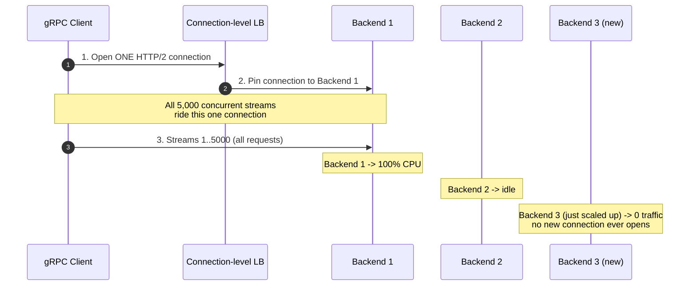
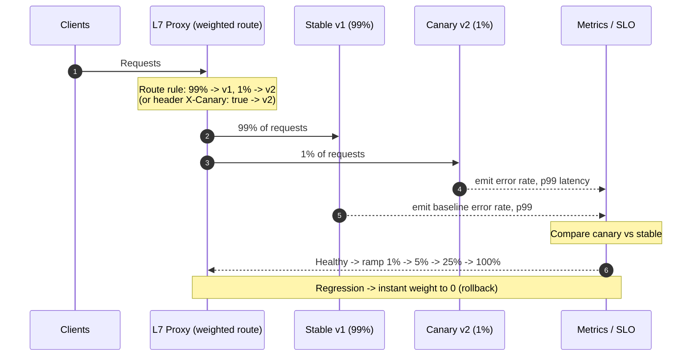
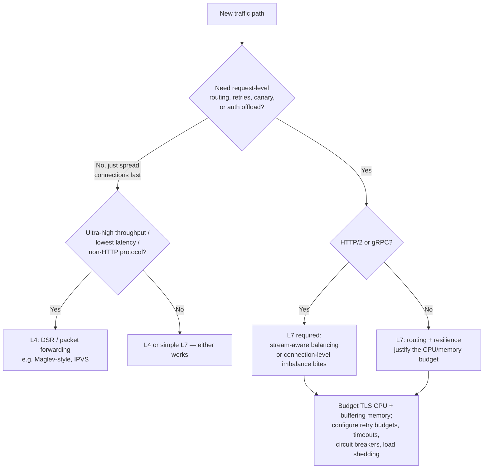

# Layer 7 Load Balancing — Senior

<!-- level-focus -->
At senior level, focus on this question:

> Which system invariant is affected by **Layer 7 Load Balancing** under failure, load, and change?

Use the smallest realistic scenario that exposes the decision and its failure behavior.
## 1. Responsibilities at This Level

- Own the decision of **where the L7 boundary sits** — edge proxy, per-service sidecar,
  internal API gateway, or all three — and the CPU/latency budget each one spends.
- Configure **retries, timeouts, circuit breakers, and outlier detection** as a coherent
  system, not per-route toggles, so they compose without amplifying load during an incident.
- Understand the **HTTP/2 and gRPC load-spreading pathology** well enough to prevent one
  hot connection from pinning a single backend at 100% while its neighbors idle.
- Define **SLOs on the proxy itself** (p99 added latency, connection-pool saturation, TLS
  handshake rate) and treat the L7 tier as a first-class, on-call service — because it is
  now in the synchronous path of every request.
- Decide **L7 vs L4** per traffic class with quantified trade-offs, not by default.

---

## 2. The Cost of L7: Where the CPU and Memory Go

An L4 load balancer can splice a TCP connection and forward at near-line-rate with tiny
per-connection state. An L7 proxy cannot: it must terminate TLS, decrypt, parse a full
HTTP message, possibly buffer it, apply rules, re-establish a connection (or reuse a pooled
one) to the backend, and often re-encrypt. Every one of those is real work per request.

```text
Per-request cost breakdown at L7 (relative to L4 packet forwarding):

  1. TLS termination (handshake + record crypto)
       - Handshake is the expensive part: asymmetric crypto (RSA/ECDSA sign).
       - A single core does O(thousands) of fresh ECDSA-P256 handshakes/sec;
         RSA-2048 is markedly slower on the private-key op.
       - Session resumption (TLS 1.3 PSK / tickets) skips the asymmetric step —
         resumed handshakes are an order of magnitude cheaper.
       - Symmetric record crypto (AES-GCM) is cheap with AES-NI but non-zero on
         large bodies.
       => Handshake rate, not throughput, is usually the first TLS ceiling.

  2. Per-request HTTP parsing
       - Parse request line + headers on every request (HTTP/1.1) or every
         stream (HTTP/2). Header decompression (HPACK) adds state.
       - Routing evaluates rules: path prefix/regex, header match, weighted
         cluster selection. Regex-heavy route tables cost CPU per request.

  3. Buffering memory
       - Many L7 proxies buffer the request (and sometimes the full response)
         to enable retries and to shield backends from slow clients.
       - Memory = concurrent_requests x avg_buffered_bytes.
         100k in-flight requests x 64 KB buffer = 6.4 GB just for buffers.
       - Streaming/pass-through mode avoids buffering but forfeits safe retries
         of non-idempotent-but-buffered bodies.

  4. Connection management
       - Upstream connection pools, keepalive, health checks, and (for HTTP/2)
         per-connection stream multiplexing state.
```

The senior mistake is treating L7 as "free routing." It is a proxy in the synchronous path:
its p99 added latency and its saturation behavior are now part of your product's latency
and availability. Budget CPU for the **peak fresh-handshake rate** (a thundering-herd
reconnect after a deploy or a mobile-network flap creates a handshake spike that dwarfs
steady state), and budget memory for the **buffering ceiling** under peak concurrency.

---

## 3. The Power of L7: Routing, Resilience, Offload

Everything L7 buys you comes from the same fact: it understands the request. The
capabilities that justify the cost:

- **Content-based routing** — `/api/v2/*` to the v2 fleet, `Host: admin.*` to the admin
  cluster, mobile clients (User-Agent) to a slimmer backend. Impossible at L4, which only
  sees IP:port.
- **Retries with hedging** — retry idempotent requests on connection failure or a 5xx from
  a *different* backend; hedged (request-based) retries fire a second attempt after a delay
  to cut tail latency. Both require understanding request boundaries and idempotency.
- **Circuit breaking / outlier detection** — track per-upstream error and latency; eject a
  backend that trips thresholds so you stop sending it traffic before it drags the fleet down.
- **Canary / weighted traffic splitting** — send 1% of requests to a new version by weight
  or by header, observe, then ramp. See §6.
- **Auth offload** — validate JWTs, terminate mTLS, enforce OAuth at the edge so backends
  trust a pre-authenticated request. Centralizes a security-critical concern.
- **Rate limiting, header manipulation, response transformation, compression** — all need
  request semantics.

| Capability | L4 | L7 |
|-----------|----|----|
| Routing granularity | 5-tuple (IP:port) | Path, header, method, cookie, JWT claim |
| TLS termination | Pass-through (or none) | Terminates; can re-encrypt to backend |
| Retries | Reconnect only (no request awareness) | Per-request, idempotency-aware, hedged |
| Circuit breaking | Coarse (drop backend on health check) | Per-upstream outlier detection on errors/latency |
| Canary / traffic split | By connection ratio (imprecise) | By request weight or attribute (precise) |
| Auth offload | No | JWT / mTLS / OAuth at the edge |
| Per-request CPU cost | Minimal (packet forwarding) | High (TLS + parse + route + buffer) |
| Added latency | Microseconds | Sub-millisecond to milliseconds |
| Observability | Connections, bytes, SYN rate | Per-route status codes, latency histograms, request logs |
| Failure blast radius | Low (thin data path) | Higher (full proxy in synchronous path) |

The observability row is under-appreciated: L7 gives you per-route status-code and latency
histograms for *free*, which is often reason enough to put L7 in front of a critical service
even when you don't need its routing.

---

## 4. L7 as API Gateway

An L7 load balancer with a rules engine *is* an API gateway; the gateway is a superset of
L7 LB responsibilities aimed at north-south (client-to-service) traffic. Typical duties:

```text
API Gateway responsibilities (all L7-native):
  - Authentication / authorization   (JWT validation, API keys, OAuth introspection, mTLS)
  - Rate limiting / quotas           (per-API-key, per-tenant, per-route)
  - Routing & versioning             (path/header -> service + version)
  - Request/response transformation  (header injection, body rewrite, protocol bridging)
  - Aggregation (sometimes)          (fan-out to N services, merge — use sparingly)
  - Observability                    (access logs, per-route metrics, distributed trace headers)
```

Design guidance a senior enforces:

- **Keep the gateway thin.** Business logic and heavy aggregation do not belong in the
  gateway — they turn a shared, latency-critical, hard-to-deploy component into a monolith
  everyone is afraid to change. Push logic down to services; keep the gateway to
  cross-cutting concerns.
- **Auth offload is a security boundary, not just plumbing.** If backends trust the
  gateway's assertion of identity, the network path from gateway to backend must be
  authenticated (mTLS) or the trust is forgeable by anything that can reach a backend
  directly. "The gateway checked the JWT" is worthless if a pod can be hit around the gateway.
- **The gateway is a shared fate.** Every team's traffic flows through it. Its SLO must be
  *stricter* than any single service's, its deploys must be canaried, and its blast radius
  must be understood (see §7).

---

## 5. HTTP/2 & gRPC Multiplexing: The Connection-Level Imbalance Trap

This is the failure mode that most surprises engineers moving from HTTP/1.1 to
HTTP/2/gRPC behind an L7 proxy, and it is squarely a senior-level concern.

**HTTP/1.1:** one request per connection at a time. A connection-level load balancer that
spreads *connections* across backends also, incidentally, spreads *requests* fairly, because
requests and connections are roughly 1:1 over time.

**HTTP/2 & gRPC:** a single long-lived TCP connection multiplexes *many* concurrent streams
(requests). A client (or an upstream proxy) often opens **one** connection to a backend and
sends thousands of requests over it. If your load balancer balances at the **connection**
level, all those requests pin to a single backend. New backends added to the pool receive
*zero* traffic until new connections are established — which, with long-lived HTTP/2
connections, may be never.



The autoscaler makes it worse: it scales up on the hot backend's CPU, the new pods get no
traffic (no new connections), CPU per existing pod stays high, and it scales up again —
burning money while imbalance persists.

**Fixes (senior must know all three and when each applies):**

| Approach | How it fixes imbalance | Cost / caveat |
|----------|------------------------|---------------|
| **Request-level (stream-aware) L7 LB** | Proxy balances each HTTP/2 *stream* to a backend, not each connection | Requires a true L7 proxy that re-multiplexes; more CPU than connection splicing |
| **Periodic connection cycling** | Backends send HTTP/2 `GOAWAY` after N requests or T seconds; client reconnects and re-picks a backend | Simple; adds reconnect churn; rebalancing is coarse and lagging |
| **Client-side / look-aside LB** | Client learns the backend set (via service discovery / xDS) and spreads its own streams | Powerful (gRPC supports this) but pushes LB logic and discovery into every client |
| **Max-connection-age on the server** | Backend closes idle-old connections, forcing rebalance | Blunt instrument; tune so you don't thrash |

The rule: **for HTTP/2 and gRPC, "L4 + connection balancing" is a bug, not a valid choice.**
You need request-level (stream-aware) balancing or an explicit connection-recycling /
client-side strategy. This is one of the strongest reasons to reach for L7 for internal gRPC.

---

## 6. Canary and Traffic Splitting

Because L7 sees requests, it can split traffic **precisely by weight or attribute** — the
foundation of safe, progressive delivery. L4 can only split by connection ratio, which is
imprecise (a connection may carry wildly different request counts) and cannot key on request
content.



Senior considerations:

- **Split by weight for a representative sample; split by attribute (header/cookie) for
  targeted rollout** (internal users, a specific tenant, a region). Attribute splitting
  gives sticky, reproducible canaries; weight gives statistical coverage.
- **Rollback is a config change, not a redeploy.** The value of L7 canary is that reverting
  is instant — set the canary weight to 0. Design so the stable version is always fully
  scaled to absorb 100%.
- **Compare canary to a concurrent control, not to yesterday.** Canary and stable receive
  live traffic at the same time; compare their metrics head-to-head to factor out diurnal
  and load effects.
- **Watch retry interaction:** if the canary emits 5xx and retries are on, retried requests
  may land on stable and mask the canary's failure rate. Scope retry and canary metrics so
  you measure the canary's *first-attempt* error rate.

---

## 7. Failure Modes: Retry Amplification, HOL Blocking, Slow-Client Exhaustion

The power of L7 comes with sharp edges. Each of these has taken down production systems.

### 7.1 Retry Amplification (the retry storm)

Retries multiply load exactly when the system is least able to absorb it. If every hop in a
call chain retries 3x, a single client request can become 3^depth backend requests during a
partial outage — the classic **retry storm** that turns a brownout into an outage.

```text
Amplification math (retries=3 per hop, i.e. up to 3 attempts):
  Chain: Client -> Gateway -> ServiceA -> ServiceB -> DB
  Worst case fan-out at the DB during failures:
     3 (gateway) x 3 (A) x 3 (B) = 27x the intended load on DB.
  The DB was already the thing failing. You just DDoS'd it.
```

Senior mitigations (apply together):

- **Retry budgets (token bucket), not fixed counts.** Cap retries to e.g. 10% of active
  requests. When the error rate spikes, the budget is exhausted and retries automatically
  stop amplifying — the system sheds instead of storms.
- **Retry only at ONE layer**, ideally closest to the client or a single designated tier.
  Do not retry at every hop. Multi-layer retries multiply.
- **Only retry idempotent, safe requests** (GET/PUT/DELETE with idempotency keys; never a
  blind POST that charges a card). Encode idempotency explicitly.
- **Exponential backoff with jitter** on the retry delay so retries don't synchronize into
  a coordinated pulse.
- **Retry on retryable conditions only** — connection refused, 503 with `Retry-After`,
  gateway-level timeouts — not on every 5xx and never on a timeout that may still be
  processing a non-idempotent write.

### 7.2 Head-of-Line (HOL) Blocking

- **TCP-level HOL (HTTP/2 over TCP):** HTTP/2 multiplexes streams over one TCP connection.
  A single lost packet stalls *all* streams on that connection until retransmission, because
  TCP delivers bytes in order. HTTP/1.1 with multiple connections doesn't share this fate;
  HTTP/3 (QUIC over UDP) fixes it with independent streams. Senior takeaway: on lossy
  networks, one TCP connection carrying everything can be *worse* than several.
- **Proxy worker HOL:** if the proxy processes a connection's requests on one worker/thread
  and one request blocks (slow backend, large body), queued requests behind it stall.
- **Backend HOL from a slow shared dependency:** one slow upstream saturates the proxy's
  connection pool to it; requests for *other* upstreams may queue behind pool acquisition.
  Isolate with per-upstream connection pools and bulkheads.

### 7.3 Slow-Client Resource Exhaustion

Because the proxy holds a connection (and often a buffer) per in-flight request, **slow or
malicious clients tie up proxy resources** far in excess of the work they represent — the
Slowloris class of attack. A client that dribbles one byte per second holds a connection,
a buffer, and a file descriptor for the whole duration.

```text
Defenses (senior must configure these — defaults are often too permissive):
  - Header/body read timeouts       (drop a client that hasn't sent a full
                                       request within N seconds)
  - Idle-connection timeouts         (reap connections doing nothing)
  - Max concurrent connections and per-IP connection limits
  - Request buffering with a hard cap; stream (don't buffer) large bodies
  - Downstream flow control (HTTP/2 window) so a slow reader can't force the
    proxy to buffer an unbounded response
  - Concurrency limits / load shedding so the proxy rejects (fast 503) rather
    than queues unboundedly when saturated
```

The unifying senior principle: **the proxy must protect itself first.** A proxy that queues
unboundedly or buffers without limit converts a client-side problem into a proxy-wide
outage. Bounded queues + fast load shedding + read timeouts keep a single bad actor or a
single slow backend from taking down the shared tier.

---

## 8. When L7 Is Worth It vs L4

The trade-off is **understanding vs cost-in-the-path**. Decide per traffic class:



Guidance:

- **Prefer L4 when:** you only need to spread load, throughput/latency is paramount, the
  protocol isn't HTTP (raw TCP/UDP, database connections, custom binary), or you want
  Direct Server Return to keep the LB out of the response path. L4 is cheaper, simpler, and
  has a smaller blast radius.
- **Prefer L7 when:** you need content routing, per-request retries/hedging, circuit
  breaking, canary, auth offload, per-route observability — or you are running **HTTP/2 or
  gRPC**, where connection-level (L4) balancing produces the imbalance in §5.
- **Common production shape:** L4 at the very edge for raw scale and DDoS absorption, L7
  behind it for routing and resilience. This layers the cheap-and-fast tier in front of the
  smart-but-expensive tier and lets each do what it's best at.

The anti-pattern is reaching for the API-gateway-shaped tool for a path that only needs to
spread connections — paying TLS CPU, buffering memory, and a fatter blast radius for
capabilities you don't use.

---

## 9. SLOs, Observability, and Runbooks

Once L7 is in the synchronous path, it is a service you own with an SLO:

```text
L7 proxy SLOs to define and dashboard:
  - Added latency:        p50/p99 latency the proxy ADDS (proxy time minus upstream time).
                          Target: p99 added latency < a few ms; alert on drift.
  - Availability:         proxy-originated 5xx rate (503 from load shedding, 504 from
                          upstream timeout) as distinct from backend 5xx.
  - Saturation:           upstream connection-pool utilization, worker CPU, active
                          connections vs limit, buffer memory vs cap.
  - TLS health:           handshake rate, handshake failures, session-resumption ratio.
  - Retry health:         retry rate and retry-budget exhaustion events (a spiking
                          retry rate is an early incident signal).

Runbooks (top failure scenarios):
  1. Retry storm            -> confirm retry-budget exhaustion metric; verify retries are
                               single-layer; tighten budget / disable per-route if needed.
  2. gRPC backend hotspot   -> confirm connection-level pinning (per-backend stream count
                               skew); enable stream-aware LB or GOAWAY-based cycling.
  3. Proxy CPU saturation   -> check fresh-handshake spike (deploy/mobile flap) vs steady
                               state; enable/verify TLS session resumption; scale the tier.
  4. Slow-client / Slowloris -> check idle + read timeouts, per-IP conn limits; shed load.
  5. Upstream brownout       -> verify outlier detection is ejecting bad backends; confirm
                               circuit breaker + fast 503 rather than unbounded queueing.
```

Distinguish **proxy-originated** from **backend-originated** errors everywhere — a 504 the
proxy generated on an upstream timeout is a very different signal from a 500 the backend
returned, and conflating them wrecks incident triage.

---

## 10. Senior Checklist

- [ ] TLS CPU budgeted for **peak fresh-handshake rate**, not steady state; session
      resumption enabled and its ratio monitored.
- [ ] Buffering memory ceiling computed (concurrent requests x buffer size); large bodies
      streamed, not buffered; hard caps set.
- [ ] For HTTP/2 / gRPC: **stream-aware (request-level) balancing** or an explicit
      connection-cycling / client-side LB strategy — never bare connection-level balancing.
- [ ] Retries are **single-layer, idempotent-only, budgeted (token bucket), with jittered
      backoff**; retry-budget exhaustion is dashboarded and alerted.
- [ ] Circuit breaking / outlier detection ejects bad upstreams; proxy sheds load (fast
      503) instead of queueing unboundedly under saturation.
- [ ] Slow-client defenses configured: header/body read timeouts, idle timeouts, per-IP
      connection limits, flow control.
- [ ] Canary is weight/attribute-based, rollback is a config change to weight 0, and the
      stable version is always scaled to absorb 100%.
- [ ] Auth offload treated as a security boundary: gateway→backend path is authenticated
      (mTLS); backends can't be reached around the gateway.
- [ ] L7-vs-L4 chosen per traffic class with a written trade-off; L7's blast radius and
      added-latency SLO are documented and on-call owns the tier.

*Next step:* [Layer 7 Load Balancing — Professional](professional.md)

---

## Apply it

1. State the system invariant that **Layer 7 Load Balancing** must protect.
2. Mark ownership, state, and failure propagation at each boundary.
3. Compare two designs under load, dependency failure, and future change.
4. Define recovery and compatibility behavior before implementation.
5. Test the riskiest assumption with a focused experiment.

## Verify your work

- The experiment supports the design with evidence, not preference.
- Failure injection shows the blast radius and recovery path.
- Compatibility checks cover old and new callers or data.
- Operational signals reveal invariant violations and recovery progress.

## Review questions

- Which invariant must remain true when Layer 7 Load Balancing fails?
- Where should recovery responsibility live, and why?
- Which assumption deserves an experiment before implementation?
- How can the design evolve without changing every consumer at once?
