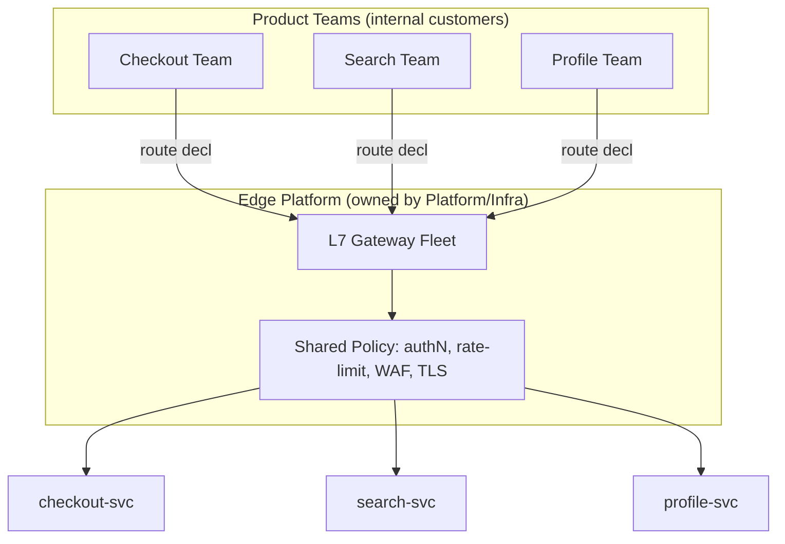
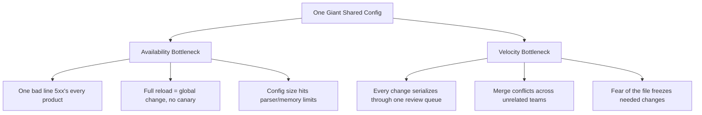

# Layer 7 Load Balancing — Staff

> **Axis:** organizational scope & judgment — NOT deeper protocol theory (that is
> `professional.md`). The L7 load balancer / API gateway is rarely a *component* at
> staff scale; it is a **shared platform surface** that every product team routes
> through. This file answers the questions a Staff/Principal engineer actually owns:
> who is allowed to change a routing rule, how hundreds of teams self-serve routes
> without taking down the edge, how much business logic is *too much* to centralize,
> whether to buy managed L7 (ALB) / run Envoy as a platform / adopt a service mesh,
> what TLS-and-compute at L7 scale actually costs, and how to keep one giant shared
> config from becoming both the availability bottleneck and the velocity bottleneck
> for the whole engineering org.

---

## Table of Contents

1. [The L7 LB as a Shared Platform Surface](#1-the-l7-lb-as-a-shared-platform-surface)
2. [Who Owns Routing? The Config Ownership Model](#2-who-owns-routing-the-config-ownership-model)
3. [Self-Serve Routes Without Blast Radius](#3-self-serve-routes-without-blast-radius)
4. [The Centralization Trap: Business Logic Creep](#4-the-centralization-trap-business-logic-creep)
5. [The Giant Shared Config as a Dual Bottleneck](#5-the-giant-shared-config-as-a-dual-bottleneck)
6. [Build vs Buy: Managed L7 vs Envoy Platform vs Service Mesh](#6-build-vs-buy-managed-l7-vs-envoy-platform-vs-service-mesh)
7. [The Cost of TLS and Compute at L7 Scale](#7-the-cost-of-tls-and-compute-at-l7-scale)
8. [Standardization and the Golden Path](#8-standardization-and-the-golden-path)
9. [Evolution, Migration, and Reversibility](#9-evolution-migration-and-reversibility)
10. [When NOT to Centralize at L7](#10-when-not-to-centralize-at-l7)
11. [Second-Order Consequences and the Staff Checklist](#11-second-order-consequences-and-the-staff-checklist)
12. [References](#12-references)

---

## 1. The L7 LB as a Shared Platform Surface

At one team's scale, the L7 load balancer is a config file. At org scale, it is a
**single point of coupling for the entire company**: every external request, from
every product, transits it before reaching any service. That makes it simultaneously
the most leveraged place to add value (auth, rate limits, canaries, observability,
WAF) and the most dangerous place to make a mistake (one bad regex in a path rule can
5xx every product at once).

The staff-level reframe: stop treating the edge as *infrastructure you configure* and
start treating it as a **product you operate for internal customers** — the product
teams. That product has an SLO, an API (how teams declare routes), a support model
(who is paged when the edge breaks), and a cost model (who pays for the TLS
termination and CPU those teams consume).



The unit of ownership is deliberately split: the **platform team owns the fleet and
the shared policy layer**; each **product team owns its own route declarations and the
health of what sits behind them**. When that boundary is fuzzy, every edge incident
becomes a cross-team fingerpointing exercise at 3 a.m.

---

## 2. Who Owns Routing? The Config Ownership Model

The single most consequential decision is the **ownership seam** for routing rules.
There are three stable models and one anti-pattern:

| Model | Who edits routes | Fits | Failure mode |
|-------|------------------|------|--------------|
| **Central ticket** | Platform team edits on request | Tiny org, high-compliance edge | Platform becomes a ticket queue; teams wait days for a route; velocity dies |
| **Federated / self-serve** | Each team owns a scoped slice of config | Most mid-to-large orgs | Needs strong guardrails or a bad slice breaks the shared fleet |
| **Mesh-delegated** | Route CRDs live *with* the service, reconciled by control plane | K8s-native orgs at scale | Control-plane complexity; harder global reasoning |
| **Free-for-all (anti-pattern)** | Anyone edits one monolith config | never | Merge conflicts, no review, one typo = global outage |

The correct answer is almost always **federated self-serve with a hard blast-radius
boundary**: a team can only touch routes under its own hostname/path prefix, changes
go through **config-as-code** (the routing spec lives in a repo, reviewed by a
`CODEOWNERS` rule that requires the platform team on shared-policy fields but *not* on a
team's own backend target). The platform sets the invariants; teams move within them.

```text
Ownership rule of thumb:
  Platform owns the VERBS (rate-limit, authN scheme, TLS, WAF, retry policy).
  Product teams own the NOUNS (my hostname, my paths, my backend, my timeouts).
  Nobody edits another team's nouns. Nobody but platform edits the verbs.
```

Making the config declarative and versioned is what makes ownership *auditable*:
every route change has an author, a reviewer, a diff, and a revert. A GUI-clicked
change in a cloud console has none of those and is how edges rot.

---

## 3. Self-Serve Routes Without Blast Radius

Self-serve is the only model that scales org velocity, but "self-serve" without
guardrails is just "shared root access to the edge." The staff job is designing the
pipeline that lets a junior engineer ship a route on a Tuesday afternoon **and be
unable to take down checkout while doing it.**

```mermaid
sequenceDiagram
    autonumber
    participant Dev as Product Engineer
    participant Repo as Route Repo (config-as-code)
    participant CI as CI Validation
    participant CP as Control Plane
    participant Edge as Gateway Fleet
    Dev->>Repo: 1. PR: add route for /search/*
    Repo->>CI: 2. lint + schema + policy-as-code checks
    Note over CI: reject overlapping paths, missing authN,<br/>unowned hostname, wildcard TLS misuse
    CI-->>Dev: 3. pass/fail with precise error
    Dev->>Repo: 4. platform approves shared-policy fields only
    Repo->>CP: 5. merge → control plane picks up spec
    CP->>Edge: 6. staged rollout (1% → 10% → 100%)
    Note over CP,Edge: xDS push is validated + reversible;<br/>auto-rollback on error-rate breach
    Edge-->>CP: 7. health signal per stage
```

The load-bearing guardrails, in order of importance:

1. **Schema + semantic validation in CI.** Reject config that doesn't parse *before*
   it reaches the fleet. Envoy's own protobuf schema plus custom lint rules (no
   overlapping path prefixes, every public route declares an auth scheme, no
   catch-all `/*` outside a sanctioned owner).
2. **Ownership enforcement.** A team's PR can only add routes under prefixes it owns
   (checked against a registry), so a mistake is contained to that team's traffic.
3. **Staged rollout of config, not just of code.** Config *is* a deploy. Push new
   xDS/route state to 1% of the fleet, watch error rate, then ramp. A global
   `reload` of a monolith config is a global deploy with no canary — forbid it.
4. **Fast, automatic revert.** Config changes must be revertible in seconds
   (previous versioned snapshot), because the fastest way out of an edge incident is
   almost always "roll the config back," not "diagnose the regex."

The principle: **the edge should be safe to change often, not scary to change ever.**
An edge nobody dares touch accumulates dead routes and stale policy — a different,
slower failure.

---

## 4. The Centralization Trap: Business Logic Creep

The L7 LB sits on the golden path of every request, so it is *irresistibly*
convenient to keep adding logic there: "just add a header transform," "just rewrite
this body," "just do the A/B split here," "just call the pricing service from a Lua
filter." Each addition is locally reasonable. The aggregate is a catastrophe.

```text
The creep gradient — from healthy to toxic at the edge:

  HEALTHY (cross-cutting, stateless, request-agnostic):
    TLS termination, authN token validation, rate limiting, WAF,
    request ID injection, coarse routing, retries/timeouts, gzip.

  GREY (defensible but watch it):
    header enrichment, canary/traffic split, response caching,
    request shadowing, simple redirects.

  TOXIC (business logic that belongs in a service):
    price calculation, entitlement decisions, request-body mutation
    that encodes domain rules, per-customer branching logic,
    "temporary" scripts that read a database.
```

Why toxic edge logic is a staff-level fire:

- **Ownership diffusion.** The pricing rule now lives in the gateway config, owned by
  no product team and understood by the platform team least of all.
- **Testing gap.** Business logic in a Lua/WASM filter escapes the service's test
  suite, its type system, and its CI. It is validated only in production.
- **Blast radius.** A bug in edge business logic doesn't degrade one service — it
  degrades *every* request that flows through that filter chain.
- **Coupling.** The edge now must deploy in lockstep with domain changes, destroying
  the independent-deploy property that justified microservices in the first place.

The staff guardrail is a **written policy of what may live at the edge**, enforced in
the same policy-as-code that validates routes: filters are allow-listed; a new filter
type requires platform review with an explicit "why can't this be in the service?"
justification. The default answer to "can we put this in the gateway?" is **no**.

---

## 5. The Giant Shared Config as a Dual Bottleneck

A single monolithic edge config that all teams edit fails along two independent axes
at once, which is what makes it so pernicious — fixing one axis doesn't fix the other.



**Availability axis.** When 400 teams share one config object, its *change surface* is
the union of all their changes, so the probability that today's edge config is being
mutated is ~1. Every mutation is a chance to break the shared parse/validation. And a
monolith typically requires a full reload to apply — turning each team's small change
into a fleet-wide event.

**Velocity axis.** A shared file with a shared review gate serializes the entire org's
edge changes through one bottleneck. Teams queue behind each other; unrelated changes
conflict; and — the quiet killer — engineers learn the file is dangerous and *stop
making changes they should make* (never deleting dead routes, never tightening a
timeout), so the config both grows and rots.

The fix is structural, not procedural: **partition the config by owner** (per-team
route files reconciled into the fleet, or per-service route CRDs in a mesh), so the
change surface any single edit touches is bounded to one team's traffic. You cannot
review your way out of a monolith; you must shard the ownership.

---

## 6. Build vs Buy: Managed L7 vs Envoy Platform vs Service Mesh

This is the defining build-vs-buy decision of the edge. The three viable options are a
**managed cloud L7** (AWS ALB, GCP HTTPS LB, Azure App Gateway), a **self-run Envoy /
gateway platform** (Envoy + a control plane, or Contour/Emissary/Kong/Gloo), and a
**service mesh** (Istio, Linkerd, Consul) whose ingress doubles as the L7 edge.

| Dimension | Managed L7 (ALB / Cloud LB) | Self-run Envoy platform | Service mesh (Istio/Linkerd) |
|-----------|-----------------------------|-------------------------|------------------------------|
| **Ownership** | Cloud owns fleet + data plane; you own only rules | You own control plane + fleet ops + on-call | You own control plane + sidecar fleet + upgrades |
| **Time to first route** | Minutes | Weeks (stand up control plane) | Weeks–months (mesh rollout) |
| **Flexibility** | Constrained to provider's feature set | Full — any Envoy filter, custom WASM | Full at edge *and* service-to-service |
| **Advanced traffic (canary, shadow, fault-inject)** | Limited / coarse | Rich | Richest (per-service, mTLS everywhere) |
| **Ops burden** | Lowest (provider runs it) | High (you run Envoy at scale) | Highest (data plane in every pod) |
| **Cost model** | Per-LB-hour + per-LCU/rule + data processed | Compute you provision + engineering headcount | Compute (sidecar CPU/mem tax) + headcount |
| **Lock-in** | High (rules, WAF, integrations are provider-shaped) | Low (Envoy is portable across clouds) | Medium (mesh CRDs are portable-ish) |
| **Best fit** | Small/mid org, one cloud, standard needs | Large org, custom edge needs, multi-cloud | Org that *also* needs service-to-service mTLS + policy |

The decision heuristics that actually matter at staff level:

- **Default to managed** until you have a concrete requirement the managed LB cannot
  meet. "We might need flexibility later" is not a requirement; it is how orgs end up
  running Envoy for three routes and paying an SRE team to do it.
- **Buy the edge, don't build it,** unless the edge is a differentiator. For 95% of
  companies the edge is a commodity and an Envoy platform is a cost center staffed by
  people who could be building product.
- **A mesh is not an edge decision — it is a service-to-service decision** that
  *also* gives you an ingress. Adopting Istio purely to get L7 ingress features is
  buying a data-plane-in-every-pod tax and a control-plane you must operate, to solve a
  problem an ingress gateway solves alone. Adopt the mesh when you genuinely need
  uniform mTLS, per-service authorization, and fine-grained traffic policy *between*
  services — then let its gateway serve the edge too.
- **The real cost of self-run Envoy is the control plane and the on-call,** not the
  proxy. Envoy is excellent; operating a fleet of it with a bespoke xDS control plane,
  config validation, staged rollout, and 24/7 on-call is a multi-engineer standing
  commitment. Model the *headcount*, not the license.

---

## 7. The Cost of TLS and Compute at L7 Scale

L7 termination is not free the way an L4 pass-through nearly is. Terminating TLS and
parsing every HTTP request costs real CPU, and at fleet scale that CPU is a line item
big enough to change architecture decisions.

```text
Where the L7 edge spends CPU (per request), roughly ordered:
  1. TLS handshake      — asymmetric crypto (ECDHE) on new connections; the expensive part
  2. TLS record crypto  — symmetric (AES-GCM) on every byte after handshake
  3. HTTP parsing       — header parse, routing match, filter chain evaluation
  4. Recompression      — if you gzip/brotli at the edge
  5. Observability       — access logs, tracing spans, metrics cardinality

The handshake dominates when connection reuse is poor.
Key levers a staff engineer pulls:
  - Session resumption / TLS 1.3 0-RTT  → amortize handshakes
  - HTTP keep-alive + HTTP/2 multiplexing → fewer handshakes per request
  - Terminate once at the edge, plaintext or mesh-mTLS internally (don't double-terminate needlessly)
  - Offload asymmetric crypto to hardware / provider-managed LB where possible
```

Two cost traps worth naming explicitly:

- **The managed-LB pricing cliff.** Cloud L7 LBs bill on some blend of hours + a
  capacity unit (LCUs) + rules + data processed. A long tail of low-traffic routes,
  each on its own LB, or a rule count that grows unbounded with self-serve, can make
  the managed bill balloon *faster than traffic*. Consolidate routes behind fewer
  LBs; watch the rule/LCU meter, not just request volume.
- **The mesh sidecar tax.** In a service mesh, every pod runs a proxy that terminates
  and re-establishes TLS for east-west traffic. At a few thousand pods, the aggregate
  sidecar CPU and memory is a substantial fraction of the cluster — a cost that is
  invisible on any per-request dashboard but very visible on the compute bill. This
  tax is often the deciding factor against a mesh for latency- or cost-sensitive
  fleets.

The staff move is to make edge compute a **tracked unit-economics metric** (cost per
million requests at the edge, sidecar CPU as % of cluster) so build-vs-buy and
mesh-vs-no-mesh are argued with numbers, not vibes.

---

## 8. Standardization and the Golden Path

The leverage of owning the edge is that it is the one place you can make *every* team
inherit good defaults without asking them. Used well, standardization is how you raise
the reliability and security floor of the whole org for free; used badly, it is how
you become the department of no.

```text
What to standardize at the edge (the golden path defaults every route inherits):
  - TLS config: cipher suites, min version (TLS 1.2+), cert rotation — teams never touch this
  - AuthN: a single token-validation scheme; a route opts into "public" explicitly
  - Rate limiting + WAF: sane org-wide defaults, tunable per route within bounds
  - Timeouts + retries: bounded retry budget so retries can't amplify an outage
  - Observability: request IDs, structured access logs, trace propagation — automatic
  - Error format: a consistent error envelope so clients aren't guessing

What to leave to teams (do NOT standardize into rigidity):
  - Their backend targets, their paths, their per-endpoint timeouts within limits
  - Their canary strategy and rollout pace
```

The standardization principle: **make the safe path the easy path.** A team should get
correct TLS, auth, rate limiting, and tracing by declaring a route and doing nothing
else — the golden path is the default, and deviating from it requires an explicit,
reviewed opt-out. If the standard is *harder* than rolling your own, teams route
around the edge (their own LB, their own ingress), you lose the central leverage, and
your security/observability floor fragments. Standardization only works when the
standard is genuinely the lowest-friction option.

---

## 9. Evolution, Migration, and Reversibility

Edge decisions are among the **stickiest** you will make, because everything routes
through the edge — migrating it is open-heart surgery on live traffic.

- **Where it bottlenecks at the next 10×.** A single monolithic config hits parser and
  reload limits; a self-run Envoy control plane that pushes full snapshots hits xDS
  scale limits; managed-LB rule counts hit provider quotas. Plan the shard/partition
  *before* the wall, not at it.
- **Reversibility — a two-way door if you engineer it that way.** Because clients bind
  to a hostname, not to the LB implementation, you *can* migrate edge technology
  behind a stable DNS name: stand the new edge up in parallel, shift traffic with
  weighted DNS / a fronting layer, and keep the old edge as instant rollback. Config
  format is the hard part to reverse (ALB rules ≠ Envoy config ≠ Istio CRDs), which is
  why keeping routing intent in a **provider-neutral declarative source** (your own
  route schema, compiled to whichever edge) preserves reversibility.
- **The migration path is always incremental and hostname-scoped.** Never "flip the
  whole company's edge." Migrate one hostname / one product at a time, prove it, move
  the next. (See §36 Large-Scale Migrations for the general playbook.)

The one-way-door risk is not the LB box — it is **letting business logic and
provider-specific features accrete at the edge** until no neutral representation of
your routing exists. Guard the neutrality and the door stays two-way.

---

## 10. When NOT to Centralize at L7

A staff engineer's credibility comes as much from what they *decline* to centralize.

- **Don't run an Envoy platform for a handful of routes.** If you have three services
  and one cloud, a managed ALB is the answer. Standing up a control plane, config
  pipeline, and on-call rotation for that is textbook over-engineering.
- **Don't adopt a service mesh just to get L7 ingress features.** The sidecar tax and
  control-plane complexity are only justified by genuine service-to-service needs
  (uniform mTLS, per-service authz). An ingress gateway alone gives you the edge.
- **Don't put per-request business logic at the edge** — covered in §4; it is the most
  common and most damaging form of over-centralization.
- **Don't force ultra-low-latency or specialized traffic through a general L7.** A
  latency-critical internal RPC path or a raw TCP/UDP workload wants L4 (or direct);
  paying HTTP-parse + TLS-terminate cost on it is pure overhead.
- **Don't centralize when teams have genuinely divergent needs** that would bloat the
  shared config into a special-case swamp. Sometimes two edges (or a team-owned
  ingress for an outlier) is cleaner than one edge trying to be everything.

The test: centralize a capability at L7 only when it is **cross-cutting, stateless,
request-agnostic, and genuinely shared.** Everything else belongs in a service.

---

## 11. Second-Order Consequences and the Staff Checklist

**Sociotechnical impact (Conway's Law — see §37).** The edge config's structure *is* an
org chart. A monolithic config implies (and forces) a central gatekeeping team; a
partitioned, self-serve config implies autonomous product teams with a small platform
team owning invariants. Choose the config topology to match the org you want, because
the config topology will shape the org you get.

**Downstream effects 6–12 months later.**

- If you centralized too much: the platform team is now a bottleneck queue, product
  velocity dropped, and the edge is a scary monolith nobody refactors.
- If you self-served without guardrails: config drift, dead routes, inconsistent auth,
  and an eventual self-inflicted edge outage from an un-reviewed change.
- If you bought a mesh you didn't need: a standing sidecar CPU tax and a control plane
  your team fights during every cluster upgrade.

**The metric that tells you it's going wrong:** the ratio of **edge changes gated by
the platform team** to **edge changes teams self-serve safely.** If that ratio is
climbing, you are centralizing into a bottleneck. Watch it alongside edge cost per
million requests and the count of non-golden-path (opt-out) routes.

### Staff Checklist
- [ ] Config-as-code: routing lives in a versioned repo with reviewed diffs and instant revert — no console clicks.
- [ ] Ownership seam is explicit: platform owns the verbs (TLS/authN/rate-limit/WAF), teams own the nouns (hostname/path/backend).
- [ ] Self-serve pipeline has hard blast-radius limits: schema + policy-as-code validation, ownership enforcement, staged config rollout, auto-rollback.
- [ ] Written allow-list of what may live at the edge; business logic is kept out and its exclusion is enforced in CI.
- [ ] Config is partitioned by owner — no single monolith that is both the availability and velocity bottleneck.
- [ ] Build-vs-buy modeled with headcount and unit economics, not features: managed default, Envoy platform only for real needs, mesh only for service-to-service.
- [ ] Edge compute cost (per-million-requests, sidecar % of cluster, managed-LB LCU/rule meter) is tracked, not hand-waved.
- [ ] Golden-path defaults make the safe route the easy route; deviations are explicit, reviewed opt-outs.
- [ ] Routing intent kept in a provider-neutral declarative form so edge migration stays a two-way door; migration is hostname-scoped and incremental.
- [ ] Decision captured as an ADR (§35.1) with reversal criteria and a named "when NOT to centralize" section so others don't cargo-cult the edge.

---

## 12. References

- Envoy Proxy documentation — architecture, xDS, filters: https://www.envoyproxy.io/docs
- Istio documentation — ingress gateway, mesh, mTLS: https://istio.io/latest/docs/
- Linkerd documentation: https://linkerd.io/2/overview/
- AWS Application Load Balancer — features and pricing (LCU model): https://aws.amazon.com/elasticloadbalancing/application-load-balancer/
- Google Cloud External HTTP(S) Load Balancing: https://cloud.google.com/load-balancing/docs/https
- Kubernetes Gateway API — declarative, role-oriented routing: https://gateway-api.sigs.k8s.io/
- Contour (Envoy-based ingress) documentation: https://projectcontour.io/docs/
- Kong Gateway documentation: https://docs.konghq.com/gateway/
- IETF RFC 8446 — TLS 1.3: https://www.rfc-editor.org/rfc/rfc8446
- Melvin Conway, "How Do Committees Invent?" (1968): https://www.melconway.com/Home/Committees_Paper.html

*Next step:* [Layer 7 Load Balancing — Interview](interview.md)
