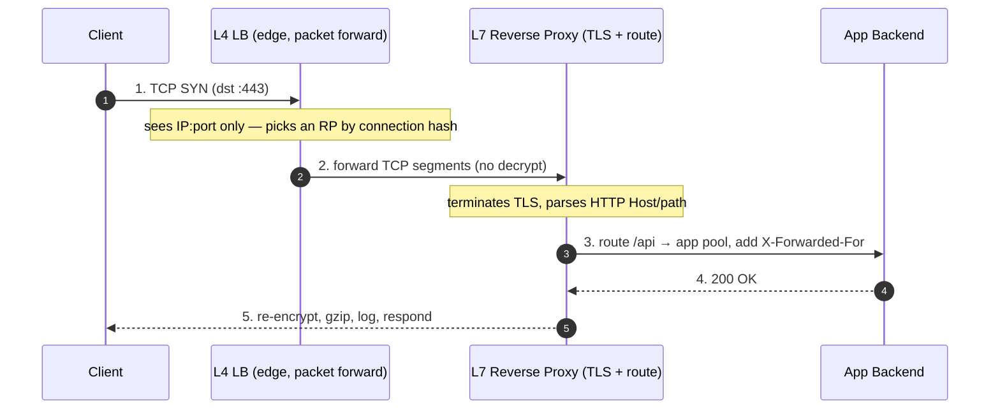
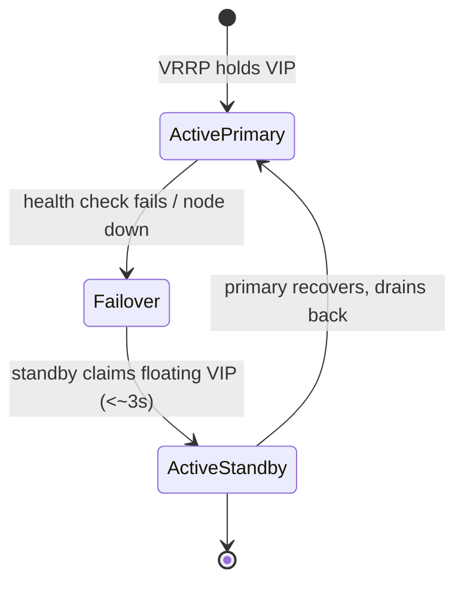
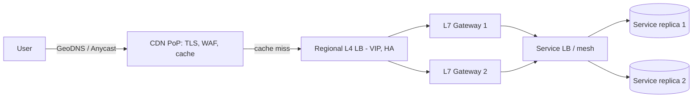

# Load Balancer vs Reverse Proxy — Interview

The single most common confusion in the edge tier: **load balancer** and **reverse proxy** name overlapping concepts, not disjoint boxes. This set drills the vocabulary until you can draw an edge and defend every hop. Answers are written to be spoken in 30–90 seconds each.

## Table of Contents
1. [Q1: Forward proxy vs reverse proxy?](#q1-what-is-the-difference-between-a-forward-proxy-and-a-reverse-proxy)
2. [Q2: Reverse proxy vs load balancer — same thing?](#q2-is-a-reverse-proxy-the-same-as-a-load-balancer)
3. [Q3: What does a reverse proxy actually add?](#q3-what-does-a-reverse-proxy-add-beyond-forwarding-a-request)
4. [Q4: How does this map to L4 vs L7?](#q4-how-does-the-lb-vs-reverse-proxy-question-map-onto-l4-vs-l7)
5. [Q5: Where does TLS termination happen and why?](#q5-where-should-tls-termination-happen-and-what-does-that-cost)
6. [Q6: Why does the backend see the proxy's IP?](#q6-why-does-my-backend-see-the-proxys-ip-instead-of-the-clients)
7. [Q7: X-Forwarded-For vs the PROXY protocol?](#q7-x-forwarded-for-vs-the-proxy-protocol--when-do-you-need-which)
8. [Q8: Isn't the proxy a single point of failure?](#q8-doesnt-putting-a-proxy-in-front-create-a-single-point-of-failure)
9. [Q9: API gateway vs load balancer vs service mesh?](#q9-api-gateway-vs-load-balancer-vs-service-mesh--how-do-they-relate)
10. [Q10: Nginx as reverse proxy and load balancer at once?](#q10-nginx-is-called-both-a-reverse-proxy-and-a-load-balancer--which-is-it)
11. [Q11: Reverse proxy for a single backend — pointless?](#q11-if-i-only-have-one-backend-is-a-reverse-proxy-pointless)
12. [Q12: Caching at the reverse proxy — when and what?](#q12-when-should-a-reverse-proxy-cache-and-what-should-it-never-cache)
13. [Q13: Design the edge for a multi-region API.](#q13-design-scenario-lay-out-the-edge-for-a-globally-distributed-api)
14. [Q14: Where do you place the proxy tier internally?](#q14-design-scenario-where-do-proxies-sit-inside-the-cluster-not-just-at-the-edge)
15. [Q15: Proxy vs mesh sidecar — who owns east-west?](#q15-if-i-have-a-service-mesh-do-i-still-need-an-internal-load-balancer)
16. [Q16: Red flags — what signals a weak answer?](#q16-what-distinguishes-a-strong-answer-from-a-weak-one-on-this-topic)

---

## Q1: What is the difference between a forward proxy and a reverse proxy?

> Both sit in the middle of a client–server conversation; the difference is **which side they represent**.
>
> - A **forward proxy** acts on behalf of the **client**. Clients are configured to route through it. It hides the client from the server and enforces client-side policy: egress filtering, corporate content control, caching outbound requests, anonymity. The origin server sees the proxy, not the user. Example: a corporate egress proxy, or a VPN gateway.
> - A **reverse proxy** acts on behalf of the **server**. Clients don't know it exists — they think they're talking to the origin. It sits in front of one or many backends and hides them: TLS termination, load balancing, caching, WAF, request routing. Example: Nginx or Envoy in front of an app fleet.
>
> Mnemonic: forward proxy protects/serves the **many clients** reaching **out**; reverse proxy protects/serves the **one origin** being reached **in**. The traffic direction (client→server) is identical; the "forward/reverse" refers to whose agent the proxy is.

| | Forward proxy | Reverse proxy |
|---|---|---|
| Acts on behalf of | Client | Server / origin |
| Configured by | Client (explicit proxy setting) | Operator (transparent to client) |
| Hides | The client from the server | The backend fleet from the client |
| Typical uses | Egress filtering, anonymity, outbound cache | TLS, LB, caching, WAF, routing |
| Sees | Which sites clients visit | Which clients hit which backend |

---

## Q2: Is a reverse proxy the same as a load balancer?

> They **overlap heavily but describe different capabilities**, and most real products do both.
>
> - A **load balancer** answers one question: *given N healthy backends, which one gets this request?* Its core job is traffic distribution + health checking + failover.
> - A **reverse proxy** answers a broader question: *how do I mediate the connection between clients and my origins?* Distribution is just one thing it may do; it also terminates TLS, caches, rewrites headers, routes by path/host, and enforces policy.
>
> So: a load balancer is (loosely) a reverse proxy specialized for distribution, and a reverse proxy is a superset that *usually includes* load balancing. A pure L4 load balancer (e.g., an AWS NLB or LVS/IPVS) that just forwards packets to a backend pool without terminating the connection is a load balancer but **not** really a reverse proxy — it never speaks the application protocol. Once a box terminates the connection and understands HTTP, the two terms effectively merge.
>
> Correct interview framing: "Every L7 reverse proxy can load balance; not every load balancer is a reverse proxy. Nginx/Envoy/HAProxy are reverse proxies that load balance. An NLB is a load balancer that isn't a reverse proxy."

---

## Q3: What does a reverse proxy add beyond forwarding a request?

> Forwarding is the trivial part. The value is everything it can do *because* it terminates the connection and sits on the critical path:
>
> - **TLS termination / origination** — one place to manage certs, offload crypto from app servers, and enforce cipher policy.
> - **Load balancing + health checks** — distribute across a pool, evict unhealthy backends, drain gracefully.
> - **Caching** — serve cacheable responses without touching the origin (static assets, cacheable GETs).
> - **Routing** — dispatch by host/path/header/method to different backend pools (`/api` → service A, `/img` → CDN origin).
> - **Header manipulation** — inject `X-Forwarded-For`/`X-Forwarded-Proto`, strip hop-by-hop headers, add request IDs.
> - **Compression** — gzip/brotli at the edge so the backend doesn't spend CPU on it per request.
> - **Buffering** — absorb slow clients so a slow reader doesn't tie up an app worker (slowloris mitigation).
> - **Security** — WAF, rate limiting, IP allow/deny, auth enforcement (mTLS, JWT validation), bot filtering.
> - **Observability** — a single choke point for access logs, latency histograms, and traffic mirroring.
>
> The theme: it's a **policy and protocol enforcement point** that keeps cross-cutting concerns out of application code and gives you one control plane for the edge.

---

## Q4: How does the LB vs reverse proxy question map onto L4 vs L7?

> This is the crux and separates strong candidates.
>
> - **L4 (transport)**: the proxy makes decisions on IP + port + connection state. It forwards TCP/UDP segments without understanding the payload. It can't see the HTTP path, host header, or cookies. Cheap, fast, protocol-agnostic (works for any TCP/UDP service, not just HTTP), and it can preserve the client IP via direct-server-return or the PROXY protocol. This is "load balancer" in the narrow sense — an NLB, LVS/IPVS, or `stream`-mode Nginx.
> - **L7 (application)**: the proxy terminates the connection, parses HTTP, and decides using path/host/headers/method/body. This unlocks path routing, caching, header rewriting, request-level retries, and cookie-based session affinity — but it costs CPU (must parse and often re-encrypt) and is protocol-specific. This is the full "reverse proxy."
>
> So the mapping is: **L4 ≈ pure load balancer**, **L7 ≈ reverse proxy that also load balances**. A common production pattern chains them: an L4 LB at the very edge for raw throughput and connection distribution, fanning out to a fleet of L7 reverse proxies that do the smart routing.

---

## Q5: Where should TLS termination happen, and what does that cost?

> The reverse proxy is the standard place to terminate TLS, and there are three models:
>
> 1. **Edge termination** — TLS ends at the reverse proxy; traffic to backends is plaintext inside a trusted network. Simplest, cheapest, centralizes cert management. Acceptable only if the internal network is genuinely trusted.
> 2. **TLS passthrough** — the L4 LB forwards encrypted bytes to the backend, which terminates. The LB can't inspect or route on HTTP (it only sees SNI at best). Used when the backend must own the cert or you need true end-to-end encryption with no middlebox decryption.
> 3. **Re-encryption (TLS bridging)** — the proxy terminates the client's TLS, inspects/routes, then opens a *new* TLS connection to the backend. Full L7 features + encryption on both legs. Highest CPU cost (two handshakes, two encrypt/decrypt paths).
>
> Cost: TLS handshakes are CPU-heavy (asymmetric crypto on connection setup). Terminating at the proxy offloads that from app servers and lets you use session resumption / hardware acceleration in one tuned place. In zero-trust environments you can't use plaintext internally, so you pay for re-encryption or push mTLS down to a service mesh. The decision is a **trust-boundary** decision, not a performance one.

---

## Q6: Why does my backend see the proxy's IP instead of the client's?

> Because the reverse proxy **terminates the client's TCP connection and opens a fresh one** to the backend. From the backend's socket, the peer is the proxy — the original client IP is gone at the transport layer. This breaks anything that depends on the real client IP: rate limiting, geo-routing, audit logs, abuse detection, allow/deny lists.
>
> Two standard remedies:
>
> - **`X-Forwarded-For` (and friends)** — the L7 proxy inserts an HTTP header carrying the original client IP (and `X-Forwarded-Proto`, `X-Forwarded-Host`). The backend reads the header instead of the socket peer. Works only for HTTP, and only if you trust the header (it's client-spoofable unless the edge strips and re-sets it).
> - **PROXY protocol** — a small header prepended to the TCP stream *before* the application bytes, carrying the real source/dest IP:port. Works for any protocol (not just HTTP), including at L4. Both proxy and backend must be configured to speak it.
>
> The trap to avoid: naively trusting `X-Forwarded-For` end-to-end. A client can send a forged `X-Forwarded-For`. Your edge must **overwrite** it (or append and only trust the rightmost hops you control), and internal services must trust only their immediate known upstream.

---

## Q7: X-Forwarded-For vs the PROXY protocol — when do you need which?

> Both preserve client connection info across a proxy hop; they operate at different layers.

| | `X-Forwarded-For` | PROXY protocol |
|---|---|---|
| Layer | L7 (HTTP header) | Between L4 and L7 (stream prefix) |
| Works for | HTTP/HTTPS only | Any TCP protocol (also TLS passthrough, gRPC, SMTP) |
| Carries | Client IP chain (list, appendable) | Exact src/dst IP:port for one hop |
| Set by | Reverse proxy inserting a header | LB prepending bytes before payload |
| Spoofable | Yes, if untrusted upstream not stripped | No (it's from the trusted proxy, not the client) |
| Requires backend to | Parse header, trust config | Explicitly enable PROXY-protocol parsing |

> Rule of thumb: for HTTP traffic terminating at an L7 proxy, `X-Forwarded-For` is the norm. When you're doing **TLS passthrough** or **L4 load balancing** — where the LB can't insert an HTTP header because it never parses HTTP — use the **PROXY protocol** so the backend still learns the real client IP. AWS NLB, HAProxy, and Envoy all support it. Critical footgun: a backend expecting the PROXY protocol header will **mis-parse normal traffic** (it treats the first line as the header), and one *not* expecting it will choke on the extra bytes — the setting must match on both ends.

---

## Q8: Doesn't putting a proxy in front create a single point of failure?

> A *single* proxy would, yes — you've funneled all traffic through one box. But that's a deployment mistake, not an inherent property. You run the proxy tier for **high availability**:
>
> - **Redundant proxies** — at least two (usually N), never one.
> - **A layer that fails over between them.** Options, roughly outermost first:
>   - **DNS** with multiple A records + health-checked failover (coarse; DNS TTL/caching slows failover).
>   - **Anycast** — the same VIP announced from multiple sites; BGP routes clients to the nearest healthy one and reroutes on failure.
>   - **A virtual IP with VRRP/keepalived** — active/passive pair; the standby claims the floating VIP within seconds if the active dies.
>   - **An upstream L4 LB** distributing across the L7 proxy fleet (the "LB in front of the proxies" pattern).
> - **Health checks + connection draining** so a dying proxy stops receiving new connections and finishes in-flight ones.
>
> The framing to give: "The proxy is a *potential* SPOF, so you never deploy exactly one. You make the proxy tier itself horizontally scalable and front it with something stateless that can reroute — anycast or VRRP for the VIP, or an L4 LB — so any single proxy can die without an outage." Then mention that proxies should hold minimal state (session affinity via consistent hashing, not local memory) so losing one doesn't lose sessions.

---

## Q9: API gateway vs load balancer vs service mesh — how do they relate?

> They live at different layers and solve different problems; a mature system runs all three.
>
> - **Load balancer** — distributes traffic across identical backend replicas. Concern: *which instance?* Operates at L4 or L7, largely stateless, no business awareness.
> - **API gateway** — a specialized **L7 reverse proxy for north-south (client→system) API traffic**. Adds API-centric concerns: authentication/authorization, rate limiting per consumer, request/response transformation, API versioning, aggregation, developer-portal/quota management, and routing to the right microservice. It's a superset of an L7 reverse proxy tuned for public/partner APIs.
> - **Service mesh** — manages **east-west (service→service) internal** traffic via sidecar proxies (e.g., Envoy) next to every service. Adds mTLS between services, fine-grained traffic shaping (canary, retries, circuit breaking), and per-hop observability — a *distributed* data plane with a central control plane.
>
> Positioning: LB is the primitive; API gateway is the smart north-south edge; mesh is the smart east-west fabric. They compose: gateway at the edge for external clients → mesh sidecars for internal calls, each backed by load balancing (the gateway across service instances, the mesh sidecar across a service's replicas).

| | Load balancer | API gateway | Service mesh |
|---|---|---|---|
| Traffic direction | Any | North-south (edge) | East-west (internal) |
| Layer | L4 / L7 | L7 | L7 (sidecar) |
| Core concern | Which replica? | API policy: auth, quota, transform, route | Inter-service mTLS, resilience, observability |
| Statefulness | Mostly stateless | Consumer/quota state | Per-service config from control plane |
| Business awareness | None | High (per-API, per-consumer) | Medium (per-service) |

---

## Q10: Nginx is called both a reverse proxy and a load balancer — which is it?

> Both, simultaneously — which is exactly why the terms confuse people. Nginx is fundamentally a **reverse proxy** (it terminates connections and speaks HTTP), and load balancing is one **feature** it offers: an `upstream` block defines a pool, and Nginx distributes across it with a chosen algorithm (round-robin, least-conn, ip-hash) plus health checks.
>
> - Configure it with one backend → it's "just" a reverse proxy (TLS, cache, routing, no distribution).
> - Configure it with an `upstream { }` of many backends → it's a reverse proxy *that is also load balancing*.
> - Configure it in `stream {}` mode → it does L4 TCP/UDP load balancing without HTTP parsing.
>
> So the right answer is: "It's a reverse proxy; load balancing is a capability of that reverse proxy. HAProxy, Envoy, and Traefik are the same story — the product is one box, the labels are two capabilities." This mirrors the general rule from Q2: L7 reverse proxies subsume load balancing.

---

## Q11: If I only have one backend, is a reverse proxy pointless?

> No — distribution is only one reason to run a reverse proxy, and often not the main one. With a single backend you still get:
>
> - **TLS termination** — keep cert management and crypto offload out of the app.
> - **Buffering / slow-client protection** — the proxy absorbs slowloris-style slow readers so your one app worker pool isn't exhausted.
> - **Caching** — serve static and cacheable responses without waking the backend.
> - **A stable public surface** — clients hit a fixed edge; you can later add backends, swap implementations, or do blue-green deploys **without changing client-facing DNS**.
> - **Security & observability** — WAF, rate limiting, and a single access-log/metrics choke point.
> - **Header hygiene & compression** — offload gzip/brotli, inject request IDs, strip hop-by-hop headers.
>
> The forward-looking argument matters most in interviews: the reverse proxy is the **seam** that lets a one-box system grow into a fleet with zero client-visible change. Putting it in from day one is cheap insurance; retrofitting it later is a migration.

---

## Q12: When should a reverse proxy cache, and what should it never cache?

> Cache at the reverse proxy when responses are **shared across users and reusable over time**: static assets (JS/CSS/images with fingerprinted URLs), public cacheable `GET`s, and semi-static API responses (e.g., a product catalog page). The proxy obeys `Cache-Control`, `ETag`, and `Vary`, and can add a stale-while-revalidate window to shield the origin during backend blips.
>
> Never (or very carefully) cache:
>
> - **Per-user / authenticated responses** unless keyed correctly — caching a response for user A and serving it to user B is a classic **cache poisoning / data-leak** bug. Respect `Cache-Control: private`, and include auth-distinguishing dimensions in `Vary` or the cache key.
> - **Anything with `Set-Cookie`** — you'd hand one user's session cookie to everyone.
> - **Non-idempotent methods** (`POST`/`PUT`/`DELETE`) — they mutate state and aren't safe to replay from cache.
> - **Highly volatile data** where staleness is unacceptable (prices at checkout, inventory counts).
>
> Two operational hazards to name: **cache stampede** (many concurrent misses hammer the origin on expiry — mitigate with request coalescing / single-flight and stale-while-revalidate), and **`Vary` explosion** (varying on a high-cardinality header shatters the cache into near-unique entries, killing hit rate).

---

## Q13: Design scenario — lay out the edge for a globally distributed API.

> I'd layer the edge from outermost to app, choosing each hop by the decision it makes:
>
> 1. **DNS + Anycast entry** — GeoDNS or an anycast VIP routes each client to the nearest **region/PoP**, giving low RTT and coarse failover if a region dies.
> 2. **CDN / edge PoP** — terminates TLS close to the user, serves cached static + cacheable API responses, runs WAF and DDoS scrubbing, and applies edge rate limiting. Cache misses go to the origin over a warm, optimized backbone.
> 3. **Regional L4 load balancer** — a highly available VIP (redundant, health-checked) that spreads connections across the region's L7 proxy fleet. Raw throughput, no HTTP parsing, preserves client IP via the PROXY protocol.
> 4. **L7 reverse proxy / API gateway** — terminates (or re-encrypts) TLS, authenticates the caller, enforces per-consumer quotas, and routes by host/path to the correct service pool. Injects `X-Forwarded-For`/request IDs, does header hygiene.
> 5. **Service load balancing** — the gateway (or a mesh sidecar) load-balances across each service's replicas with health checks and outlier ejection.
>
> Cross-cutting: everything past the L4 tier is redundant; sessions use consistent-hash affinity (not sticky local memory) so any node can fail; TLS trust boundary decides edge-terminate vs re-encrypt vs mesh-mTLS internally.

---

## Q14: Design scenario — where do proxies sit inside the cluster, not just at the edge?

> Two distinct proxy tiers, and conflating them is a common mistake:
>
> - **North-south edge proxy** — the public-facing reverse proxy / API gateway handling untrusted client traffic (auth, quotas, WAF, TLS). One (redundant) tier per region.
> - **East-west internal proxy** — how service A reaches service B. Options:
>   - A shared **internal load balancer** (e.g., an internal L4/L7 LB per service) — simple, but a central hop and a scaling/latency choke point.
>   - **Client-side load balancing** — the caller's library picks a healthy instance from service discovery (no extra network hop) — fast, but logic lives in every app.
>   - A **service mesh sidecar** — an Envoy next to each pod does mTLS, retries, circuit breaking, and per-service load balancing transparently — no app code, at the cost of running the mesh.
>
> The judgment call: use the **edge proxy** for anything crossing the trust boundary, and choose the east-west mechanism by team maturity — internal LB for a handful of services, mesh once you have dozens of services needing uniform mTLS/resilience/observability. Don't route internal calls back out through the public edge proxy (a real anti-pattern: adds latency, cost, and a bizarre trust inversion).

---

## Q15: If I have a service mesh, do I still need an internal load balancer?

> Usually **not a separate one for east-west traffic** — the mesh *is* your internal load balancer, done per-hop. Each sidecar proxy load-balances a caller's requests across the callee's healthy instances (from the mesh's service discovery), with health checks, outlier ejection, and retries built in. Adding a standalone internal LB in front would just insert an extra hop the sidecar already handles.
>
> You **do** still need:
>
> - The **north-south edge** LB / gateway — the mesh handles internal traffic, not untrusted external clients arriving at the cluster boundary. (Ingress gateways bridge the two, but they're distinct from the sidecar data plane.)
> - An **L4 LB in front of the ingress/gateway tier** for raw connection distribution and a stable VIP.
>
> So the clean answer: "The mesh replaces per-service internal load balancers with sidecar load balancing; it does **not** replace the edge load balancer or the gateway that faces external clients." Naming that boundary — mesh owns east-west, gateway+LB own north-south — is the signal an interviewer wants.

---

## Q16: What distinguishes a strong answer from a weak one on this topic?

> **Strong signals:**
>
> - Frames LB and reverse proxy as **overlapping capabilities**, not two separate boxes — and ties it to L4 vs L7 (Q4).
> - Reaches for the **PROXY protocol** the moment TLS passthrough or L4 comes up, and flags `X-Forwarded-For` spoofing.
> - Never leaves the proxy as a **single point of failure** — immediately reaches for redundancy + VRRP/anycast/L4-front.
> - Distinguishes **north-south vs east-west** and places gateway/mesh/LB accordingly.
> - Reasons about **TLS termination as a trust-boundary decision**, not a perf toggle.
> - Mentions caching hazards (per-user leaks, `Set-Cookie`, stampede) rather than "just cache it."
>
> **Weak signals / red flags:**
>
> - "A reverse proxy and a load balancer are completely different things" — false; they overlap.
> - Trusting `X-Forwarded-For` blindly, or not knowing why the backend sees the proxy IP.
> - Drawing one proxy with no HA story.
> - Calling an API gateway "just a load balancer," or thinking a mesh replaces the edge.
> - Caching authenticated responses without keying, or ignoring stampede.
>
> The meta-point: this topic rewards **precise vocabulary**. Interviewers use it to probe whether you actually understand the edge or just recognize the words.

*Next step:* [Load Balancing Algorithms — Junior](../load-balancing-algorithms/junior.md)
