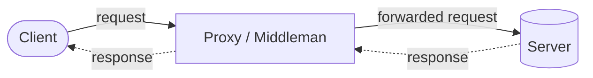
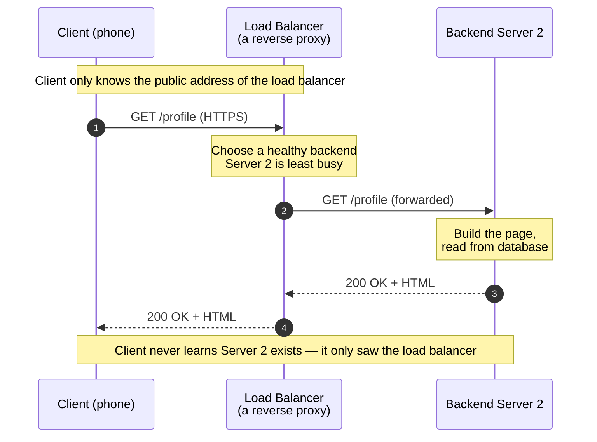

# Load Balancer vs Reverse Proxy — Junior

<!-- level-focus -->
At junior level, focus on this question:

> How can I apply **Load Balancer vs Reverse Proxy** in one small example and prove the result?

Use the smallest realistic scenario that exposes the decision and its failure behavior.
## 1. Start With One Idea: The Middleman

Every concept in this topic grows from a single primitive: a **proxy** is a machine that
sits *between* a client and a server and relays traffic on someone's behalf. The client
talks to the proxy; the proxy talks to the real server; the answer flows back the same way.

That is the whole seed. A "forward proxy," a "reverse proxy," and a "load balancer" are not
three unrelated boxes you have to memorize — they are the *same middleman*, distinguished by
**which side it works for** and **what job it does**.

Read it as a two-way street: the request goes left to right, the response comes back right
to left, and the middleman touches both directions. Once you hold that picture, the three
names become easy — they only change *whose side* the middleman stands on.

---

## 2. The Everyday Analogy

Picture a large office building.

- A **forward proxy** is the *mailroom clerk on your floor*. You (a client, an employee)
  hand every outgoing letter to the clerk. The clerk stamps it, maybe hides your desk number,
  and sends it out to the world. The outside world never learns which employee wrote it — it
  only sees the mailroom. The clerk works **for the employees**.

- A **reverse proxy** is the *receptionist at the building's front desk*. Visitors from
  outside never wander the hallways looking for a specific person. They ask the receptionist,
  who knows the internal layout, checks credentials, and routes each visitor to the right
  office. Visitors only ever see the front desk. The receptionist works **for the building
  (the servers)**.

- A **load balancer** is a *receptionist with a specific talent*: there are, say, four
  identical help desks staffed with identical people, and the receptionist sends each new
  visitor to whichever desk is least busy. It is still a front-desk receptionist — a reverse
  proxy — but its defining job is **spreading visitors evenly** so no single desk is
  overwhelmed.

Hold onto that last line: **a load balancer is a specialized reverse proxy whose primary
job is spreading load across many identical backends.**

---

## 3. Forward Proxy: A Middleman That Fronts Clients

A **forward proxy** sits in front of *clients* and represents them to the outside internet.
When a browser is configured to use a forward proxy, every request goes to the proxy first,
and the proxy makes the real request to the destination on the browser's behalf.

Who benefits, and why it exists:

- **The client's identity is hidden.** The destination server sees the proxy's address, not
  the user's. (This is how corporate VPN gateways and anonymizing proxies work.)
- **The organization controls outbound traffic.** A company can block social media, log which
  sites employees visit, or cache popular downloads so many employees share one copy.
- **The server on the far side usually has no idea the proxy exists** — from its point of
  view, a normal client connected.

The key word is **fronts clients**: the proxy stands on the *client's* side of the
conversation and speaks for the client.

---

## 4. Reverse Proxy: A Middleman That Fronts Servers

A **reverse proxy** flips the direction. It sits in front of one or more *servers* and
represents them to the outside world. Clients on the internet connect to the reverse proxy
as if it *were* the application; the proxy quietly forwards each request to a real backend
server behind it and returns the backend's response.

Who benefits, and why it exists:

- **The backends are hidden and protected.** Clients never learn the internal server
  addresses. The reverse proxy is the only publicly exposed door.
- **One public address, many private servers.** The proxy can route different paths to
  different services (`/api` to one server, `/images` to another).
- **A natural place for shared work.** Because *every* request passes through it, the reverse
  proxy is where teams put TLS/HTTPS termination, compression, and basic access filtering — do
  it once here instead of in every backend.

The key phrase is **fronts servers**: the proxy stands on the *server's* side and speaks for
the servers. NGINX in its most common configuration is exactly this.

---

## 5. Load Balancer: A Reverse Proxy Whose Job Is Spreading Load

Now suppose one backend server is not enough — traffic has grown, and you run **several
identical copies** of your application. Something must decide which copy handles each incoming
request. That "something" is a **load balancer**.

A load balancer is a reverse proxy (it fronts servers, clients see only it) with a **sharpened
mission**: distribute the incoming requests across a pool of interchangeable backends so that
work is shared, no single server is swamped, and if one server dies, traffic simply flows to
the survivors.

So the relationship is a nesting, not a rivalry:

- Every load balancer *is* a reverse proxy (it fronts servers).
- Not every reverse proxy *is* a load balancer — a reverse proxy with only one backend, or
  one whose main purpose is TLS termination or routing rather than spreading load, is not
  acting as a load balancer.

At this stage that is the entire distinction you need: **load balancer = reverse proxy +
"and its point is to spread traffic over many equal backends."**

---

## 6. A Request, Step by Step

Let us trace one HTTPS request from a phone to an app that runs three identical backend
servers behind a load balancer. Follow the numbers.

Reading the trace:

1. The client sends a normal request to the public address. It believes it is talking to
   "the application." It is actually talking to the load balancer.
2. The load balancer looks at its pool of healthy backends and picks one — here, Server 2,
   because it currently has the fewest requests in flight.
3. It forwards the request to Server 2. Server 2 does the real work.
4. Server 2 returns its response *to the load balancer* (not directly to the client).
5. The load balancer relays that response back to the client.

The client's mental model stayed simple the entire time: "I asked one server, one server
answered." The complexity — three backends, health checks, choosing the least-busy one —
lived entirely inside the middleman. That hiding of complexity is the whole point of a
reverse proxy, and spreading the work is the whole point of the load balancer flavor of it.

---

## 7. The Comparison Table

| Question | Forward Proxy | Reverse Proxy | Load Balancer |
|---|---|---|---|
| Which side does it work for? | The **clients** | The **servers** | The **servers** (it *is* a reverse proxy) |
| Who does it hide? | Hides the **client** from the server | Hides the **servers** from the client | Hides the **servers**, and hides *how many* there are |
| What does the far side see? | Server sees the proxy, not the user | Client sees the proxy, not the backends | Client sees the proxy, not the backend pool |
| Its defining job | Control/anonymize outbound client traffic | Front, protect, and route to backends | **Spread requests** across many equal backends |
| Typical example | Corporate web filter, VPN gateway | NGINX in front of one app | NGINX / cloud LB in front of a server pool |
| Number of backends | Talks out to the whole internet | One or a few | Many, interchangeable |
| Is it a specialization of another? | Its own thing | — | **Yes: a specialized reverse proxy** |

The single most important row is the first one. **Forward proxies face the clients; reverse
proxies face the servers.** Everything else follows from that.

---

## 8. How They Overlap and Where They Differ

**Where they overlap.** All three are proxies — middlemen that relay traffic and can hide one
side from the other. The *same product* (NGINX, Envoy, HAProxy, and cloud services) can be
configured to act as any of them. Because of this, people often use the words loosely, and
you will hear "reverse proxy" and "load balancer" spoken almost interchangeably.

**Where they differ.** The differences are about **direction** and **purpose**:

- Forward vs reverse is a question of **direction** — is the middleman standing on the
  client's side or the server's side?
- Reverse proxy vs load balancer is a question of **purpose** — is the middleman's headline
  job to *front and route* (reverse proxy), or specifically to *spread load across many equal
  servers* (load balancer)?

A clean way to say it: *forward and reverse proxy are opposites; reverse proxy and load
balancer are a general category and a specialization of it.*

---

## 9. Common Confusions to Clear Up Now

- **"A load balancer and a reverse proxy are two different machines."** Not fundamentally.
  A load balancer *is* a reverse proxy that specializes in spreading load. One physical box
  can do both roles at once — terminate HTTPS (reverse-proxy work) *and* balance across
  backends (load-balancer work).

- **"Forward and reverse proxy are basically the same because both are proxies."** They are
  mirror images. Confusing them is the most common beginner mistake. Anchor on: *forward =
  fronts clients, reverse = fronts servers.*

- **"The client picks which backend to talk to."** No. The client only ever addresses the
  middleman. Choosing the backend is the middleman's private decision — that hiding is the
  feature, not an accident.

- **"You need a load balancer only when you have huge traffic."** You need one the moment you
  run **more than one** copy of your server, because something must decide where each request
  goes. Scale makes it more important, but the *reason* is having multiple backends at all.

---

## 10. Recap and a Small Exercise

The mental model, compressed:

- A **proxy** is a middleman between client and server.
- A **forward proxy** fronts the **clients** (represents users to the internet).
- A **reverse proxy** fronts the **servers** (represents your servers to users, hiding them).
- A **load balancer** is a **specialized reverse proxy** whose defining job is **spreading
  requests across many identical backends**.
- Every load balancer is a reverse proxy; not every reverse proxy is a load balancer.

**Exercise.** On paper, draw a client, a middleman, and three identical app servers. Label the
middleman as a reverse proxy. Now answer three questions with a sentence each: (1) What address
does the client connect to? (2) When a request arrives, who decides which of the three servers
handles it? (3) If Server 3 crashes, what should the middleman do with the next request? If your
answers are "the middleman's public address," "the middleman," and "send it to Server 1 or 2
instead," you already have the load-balancer mental model — the rest is just detail on *how* it
picks and *how* it checks health.

Canonical references (optional, for the curious): Cloudflare Learning — *What is a reverse
proxy?* and *What is load balancing?*; NGINX docs on reverse proxying and HTTP load balancing.

*Next step:* [Load Balancer vs Reverse Proxy — Middle](middle.md)

---

## Apply it

1. Choose one small, known input for **Load Balancer vs Reverse Proxy**.
2. Predict the output or observable behavior.
3. Run the smallest example or probe that exercises the concept.
4. Change one input to trigger a failure or boundary case.
5. Explain the evidence using the guide's vocabulary.

## Verify your work

- Record the exact input, command or code path, and output.
- Repeat the probe and confirm the result is consistent.
- Show one expected success and one expected failure.
- Resolve any difference between the prediction and the evidence.

## Review questions

- What problem does Load Balancer vs Reverse Proxy solve in the example?
- Which input changes the observed result, and why?
- What is the smallest useful success check?
- Which beginner mistake would your evidence catch?
