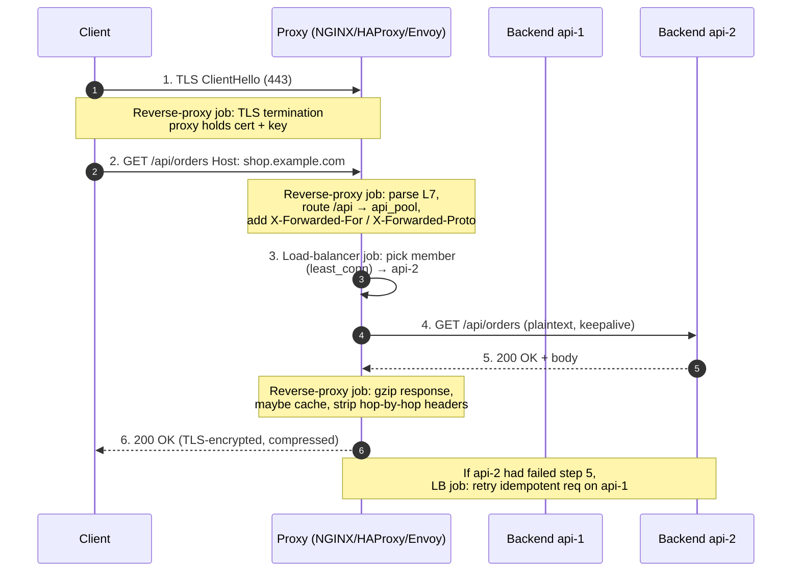

# Load Balancer vs Reverse Proxy — Middle

<!-- level-focus -->
At middle level, focus on this question:

> Where does **Load Balancer vs Reverse Proxy** belong in a maintainable component, and which trade-off selects the design?

Use the smallest realistic scenario that exposes the decision and its failure behavior.
---

## 1. The One-Box Reality

A pure load balancer operating at **L4** (transport) forwards TCP/UDP segments by rewriting the destination address; it never parses HTTP, so it cannot see a URL, a `Host` header, or a cookie. A pure reverse proxy operating at **L7** (application) terminates the client's TCP connection, reads the full HTTP request, and opens a *separate* connection to a backend. The moment your proxy makes a routing decision based on the *path* (`/api` → one pool, `/static` → another), it is doing both jobs: it is a reverse proxy (it parsed L7) *and* a load balancer (it picked a member of a pool).

So the practical mental model for this tier:

- **Reverse proxy** = the set of things you do *to the request/response* because you terminated it: TLS, caching, compression, header rewriting, path routing, auth offload, buffering.
- **Load balancing** = the set of things you do *to pick and reach a backend*: pool membership, selection algorithm, health checks, connection reuse, retries.

These are orthogonal. You can have an L7 reverse proxy pointed at a single backend (no balancing) or an L4 balancer with no proxy features. The interesting production config is the intersection, and every knob below belongs to exactly one of these two columns.

---

## 2. Reverse-Proxy Responsibilities (the L7 job)

These are the responsibilities that only exist *because* the proxy terminated the connection and can read/modify the HTTP payload.

**TLS termination.** The proxy holds the certificate and private key, decrypts inbound traffic, and forwards plaintext (or re-encrypted traffic) to backends. Backends stop paying the handshake CPU cost and stop managing certificates.

**Caching.** The proxy stores backend responses keyed by request attributes and serves subsequent hits without touching the backend. Only an L7 proxy can do this — it must read `Cache-Control`, method, and URL.

**Compression.** The proxy gzip/brotli-compresses responses on the wire, respecting the client's `Accept-Encoding`. Offloading compression from backends is a common CPU win.

**Header rewriting.** Add `X-Forwarded-For`, strip hop-by-hop headers, inject request IDs, rewrite `Location` on redirects, normalize `Host`.

**Request routing (content switching).** Choose a backend pool by path, host, method, header, or cookie — the defining L7 capability.

```nginx
server {
    listen 443 ssl;
    server_name shop.example.com;

    ssl_certificate     /etc/ssl/shop.crt;   # TLS termination
    ssl_certificate_key /etc/ssl/shop.key;

    gzip on;                                  # compression
    gzip_types application/json text/css application/javascript;

    location /static/ {                       # request routing by path
        proxy_pass http://static_pool;
        proxy_cache assets_cache;             # caching
        proxy_cache_valid 200 10m;
    }

    location /api/ {
        proxy_pass http://api_pool;           # different pool, no cache
    }
}
```

Every directive above is a *reverse-proxy* responsibility. Not one of them says anything about *how many* backends `static_pool` has or which one gets the next request — that is the other column.

---

## 3. Load-Balancing Responsibilities (the pool job)

These responsibilities are about the **backend pool** and are independent of whether you terminated TLS or cached anything.

**Backend pool (upstream) definition.** The list of servers, their addresses, ports, and per-member weights/limits.

**Selection algorithm.** How the next request is assigned to a pool member:

| Algorithm | Picks | Best when |
|-----------|-------|-----------|
| Round robin | Next member in rotation | Backends roughly equal, requests uniform |
| Weighted round robin | Next member, respecting weights | Heterogeneous instance sizes |
| Least connections | Member with fewest active connections | Request durations vary widely |
| Least response time | Fastest-responding member | Latency-sensitive, uneven backends |
| Hash (IP / URL / header) | Deterministic member per key | Session affinity, cache locality |
| Random (power-of-two-choices) | Best of two random members | Large pools, cheap and near-optimal |

**Health checks.** Removing unhealthy members from rotation (see §6).

**Connection management.** Keepalive pools to backends, max connections per member, queueing when saturated.

**Retries and failover.** Re-issue an *idempotent* request to another member when one fails or returns a designated error.

```nginx
upstream api_pool {
    least_conn;                               # selection algorithm
    server 10.0.1.11:8080 weight=2 max_fails=3 fail_timeout=15s;
    server 10.0.1.12:8080 weight=1;
    server 10.0.1.13:8080 backup;             # only used if others down
    keepalive 32;                             # connection reuse to backends
}
```

`least_conn`, `weight`, `max_fails`, `keepalive`, `backup` — all **load-balancing** knobs. They would be identical whether or not the front door did TLS or caching.

---

## 4. Request Flow Through One Box Doing Both

Here is a single request traversing one NGINX/Envoy box that terminates TLS, routes by path, then load-balances across a pool. Follow how the two responsibility sets interleave.



Steps 1, 2, 6 and the annotations on 2/5 are **reverse-proxy** work. Steps 3 and the retry note are **load-balancer** work. Step 4 is the handoff. One process, two hats — that is the entire lesson of this tier made concrete.

---

## 5. Upstream / Backend Configuration

The vocabulary differs by tool but the concept is identical: a named group of backend members with per-member and per-group settings.

**NGINX** calls it an `upstream`:

```nginx
upstream orders_backend {
    zone orders 64k;              # shared memory for state across workers
    least_conn;
    server orders-a.svc:8080 max_conns=200 max_fails=2 fail_timeout=10s;
    server orders-b.svc:8080 max_conns=200;
    keepalive 64;                 # idle upstream connections to reuse
    keepalive_timeout 60s;
}
```

**HAProxy** calls it a `backend`, referenced by a `frontend`:

```
frontend fe_https
    bind :443 ssl crt /etc/haproxy/shop.pem   # reverse-proxy: TLS termination
    default_backend orders_backend

backend orders_backend
    balance leastconn                          # load-balancing: algorithm
    option httpchk GET /healthz                # active health check
    http-request set-header X-Forwarded-Proto https
    server a orders-a.svc:8080 check maxconn 200
    server b orders-b.svc:8080 check maxconn 200
```

**Envoy** splits it into a `cluster` (the pool) plus a `route` (the L7 routing) and an `http_connection_manager` filter (the proxy engine). The cluster carries the load-balancing policy:

```yaml
clusters:
  - name: orders_backend
    connect_timeout: 1s
    lb_policy: LEAST_REQUEST          # load-balancing: algorithm
    load_assignment:
      cluster_name: orders_backend
      endpoints:
        - lb_endpoints:
            - endpoint: { address: { socket_address: { address: orders-a, port_value: 8080 }}}
            - endpoint: { address: { socket_address: { address: orders-b, port_value: 8080 }}}
    health_checks:                     # active health check
      - timeout: 1s
        interval: 5s
        http_health_check: { path: /healthz }
```

Notice the recurring split in all three: TLS/route/header directives live on the *frontend/listener/route* side (reverse proxy); the algorithm, member list, and health checks live on the *upstream/backend/cluster* side (load balancer).

**`max_conns` / `maxconn` matter.** Capping connections per backend member turns your proxy into a shock absorber: excess requests queue at the proxy instead of overwhelming a fragile backend. This is a load-balancing responsibility that directly protects backend stability.

---

## 6. Health Checks: Passive vs Active

A member in the pool is useless — worse, harmful — if it is dead but still receiving traffic. Two mechanisms keep the pool honest.

**Passive health checks** infer health from *live traffic*. NGINX's `max_fails=3 fail_timeout=15s` means: if 3 real requests to a member fail within 15 s, mark it down for 15 s, then probe again with real traffic. Zero extra requests, but the first few unlucky users hit the dead backend before it is ejected, and a member with no traffic is never checked.

**Active health checks** send *synthetic* probe requests on a schedule regardless of traffic. HAProxy's `option httpchk GET /healthz` and Envoy's `http_health_check` probe `/healthz` every interval; a member is only added to rotation once it passes. This catches failures *before* a user does and validates idle members, at the cost of probe traffic and a dedicated health endpoint.

Design the `/healthz` endpoint to check *dependencies the request path actually needs* (DB connectivity, downstream reachability) but keep it cheap — a health check that itself hammers the database can take the whole pool down under load. A good pattern: a shallow liveness endpoint (process is up) separate from a deeper readiness endpoint (can serve traffic).

---

## 7. Preserving Client Info: X-Forwarded-* and Host

The instant the proxy terminates the connection, the backend's view of "the client" becomes *the proxy*. The backend's `remote_addr` is now the proxy's IP; the original TLS is gone; the port is the proxy's. Every piece of client identity must be carried forward *as headers*, or it is lost.

| Header | Carries | Set by proxy to |
|--------|---------|-----------------|
| `X-Forwarded-For` | Original client IP (chain) | Client IP, appended to any existing chain |
| `X-Forwarded-Proto` | Original scheme | `https` (so backend knows request was secure) |
| `X-Forwarded-Host` | Original `Host` requested | The public hostname the client used |
| `X-Forwarded-Port` | Original port | `443` |
| `Host` | Which vhost | Often preserved or overridden per backend needs |
| `Forwarded` (RFC 7239) | Standardized combined form | `for=...;proto=https;host=...` |

```nginx
location /api/ {
    proxy_pass http://api_pool;
    proxy_set_header Host              $host;               # preserve requested vhost
    proxy_set_header X-Real-IP         $remote_addr;        # single client IP
    proxy_set_header X-Forwarded-For   $proxy_add_x_forwarded_for;  # append to chain
    proxy_set_header X-Forwarded-Proto $scheme;             # http or https
    proxy_set_header X-Forwarded-Host  $host;
}
```

Three failure modes to internalize at this tier:

1. **`Host` mismatch.** If the backend does name-based virtual hosting or generates absolute URLs, and you forward `proxy_pass` without preserving `Host`, the backend sees the *upstream* name (e.g. `api_pool`) and generates wrong redirect `Location` headers or 404s. Decide deliberately whether to preserve `$host` or rewrite it.

2. **`X-Forwarded-For` spoofing.** `X-Forwarded-For` is a client-supplied header. If your *edge* proxy blindly appends without stripping a client-provided value, a malicious client can inject a fake IP. The edge proxy must **overwrite** (not append) the leftmost entry it does not trust, and downstream proxies should only trust `X-Forwarded-For` from known-trusted upstreams (`set_real_ip_from` in NGINX, `trusted_hops` / `xff_num_trusted_hops` in Envoy).

3. **Losing `https`.** Without `X-Forwarded-Proto: https`, a backend that terminated on plaintext will think the request was insecure — generating `http://` redirect loops behind an HTTPS proxy, or refusing to set `Secure` cookies. This is one of the most common "redirect loop behind a proxy" bugs.

---

## 8. TLS Termination, Re-encryption, and Passthrough

Where TLS ends is a design decision with a security and capability trade-off.

**Termination (offload).** Proxy decrypts; talks plaintext to backends. Maximum L7 capability (can cache, route on path, rewrite) and cheapest backends, but traffic inside your network is unencrypted — acceptable only if that network is trusted/isolated.

**Re-encryption (TLS bridging).** Proxy decrypts (so it can still read L7 and route/cache), then opens a *fresh* TLS connection to the backend. You keep full L7 features *and* encrypt the internal hop. This is the common zero-trust default.

```nginx
location /api/ {
    proxy_pass https://api_pool;                # re-encrypt to backend
    proxy_ssl_verify on;
    proxy_ssl_trusted_certificate /etc/ssl/internal-ca.pem;
    proxy_set_header X-Forwarded-Proto https;
}
```

**Passthrough (TLS/SNI routing).** Proxy does *not* decrypt; it routes on the TLS `SNI` field and forwards the encrypted bytes untouched. The backend terminates TLS. This is genuinely closer to L4 load balancing: you get end-to-end encryption and the proxy never sees plaintext — but you **lose every L7 feature** (no path routing, no caching, no header rewriting, no `X-Forwarded-For` injection). HAProxy does this in `mode tcp` with `req.ssl_sni`; NGINX uses the `stream` module with `ssl_preread`.

The trade-off is exactly the reverse-proxy-vs-load-balancer axis restated: the more you terminate, the more of the *reverse-proxy* column you unlock; the more you pass through, the more you are just a *load balancer* moving bytes.

---

## 9. Feature Comparison and Tool Roles

Reverse-proxy responsibilities vs load-balancer responsibilities, side by side:

| Concern | Reverse-proxy column | Load-balancer column |
|---------|---------------------|----------------------|
| OSI layer | L7 (parses HTTP) | L4 or L7 |
| Terminates client TLS? | Yes (to read payload) | Only if L7; L4 passes through |
| Sees URL / headers / cookies? | Yes | Only if L7 |
| Caching | Yes | No (not its job) |
| Compression | Yes | No |
| Header rewriting (`X-Forwarded-*`) | Yes | Only if L7 |
| Path/host content routing | Yes | Only if L7 |
| Selection algorithm across pool | Not inherently | Yes (core job) |
| Health checks | Not inherently | Yes (core job) |
| Retries / failover | Yes (if L7) | Yes |
| Primary goal | Shape & secure requests | Distribute & keep pool healthy |

And the three canonical tools — all of which do *both* jobs, but with different centers of gravity:

| Tool | Center of gravity | Config style | Notable strengths |
|------|-------------------|--------------|-------------------|
| **NGINX** | Web server + reverse proxy | Directive blocks (`server`/`location`/`upstream`) | Static file serving, caching, mature reverse-proxy; LB is capable but algorithm set is smaller in OSS |
| **HAProxy** | Load balancer first | `frontend`/`backend`/`server` | Rich LB algorithms, deep health checks, high-throughput L4+L7, detailed stats |
| **Envoy** | Programmable L7 proxy / sidecar | YAML: listeners → filters → routes → clusters | Dynamic config (xDS), observability, mesh sidecar, advanced LB (outlier detection, zone-aware) |

There is no "the load balancer" and "the reverse proxy" as separate boxes in most stacks. You choose one of these engines and enable the responsibilities you need. The skill this tier builds is knowing *which column each directive belongs to*, so that when a redirect loops, a client IP is wrong, or a dead backend keeps getting traffic, you know whether to look in your `location`/route block (reverse proxy) or your `upstream`/cluster block (load balancer).

For a request-flow visualization of a proxy handling TLS and routing, NGINX's own admin guide illustrates the terminate-route-balance path step by step.

> 🎞️ **See it animated:** [NGINX reverse proxy & load balancing guide](https://docs.nginx.com/nginx/admin-guide/load-balancer/http-load-balancer/)

---

## 10. Middle Checklist

- [ ] You can point to each directive in your config and say "reverse-proxy job" or "load-balancer job."
- [ ] Upstream/backend/cluster has an explicit selection algorithm chosen for the workload (not defaulting to round robin blindly).
- [ ] Active or passive health checks configured; `/healthz` checks real readiness but is cheap.
- [ ] `X-Forwarded-For`, `X-Forwarded-Proto`, `X-Forwarded-Host` set; edge proxy overwrites (not blindly appends) untrusted `X-Forwarded-For`.
- [ ] `Host` handling decided deliberately (preserve vs rewrite) and tested against backend redirects.
- [ ] TLS boundary chosen consciously: terminate, re-encrypt, or passthrough — with the L7-feature trade-off understood.
- [ ] `max_conns`/`maxconn` per member set so the proxy queues excess load instead of drowning backends.
- [ ] `keepalive` to upstreams enabled to avoid a TCP+TLS handshake per request.
- [ ] Retries scoped to idempotent methods only.
- [ ] You verified end-to-end: dead a backend, confirmed it was ejected and traffic shifted with no client-visible error.

---

*Next step:* [Load Balancer vs Reverse Proxy — Senior](senior.md)

---

## Apply it

1. Find a real component where **Load Balancer vs Reverse Proxy** affects an interface or dependency.
2. Write two plausible choices and the constraint that favors each one.
3. Make the smallest reversible change at that boundary.
4. Exercise the component alone, then exercise the integrated flow.
5. Keep the decision note with the evidence that selected the option.

## Verify your work

- A focused check proves the local behavior.
- An integrated check proves callers and dependencies still agree.
- Logs, traces, compiler output, or benchmarks expose the boundary.
- Reverting the change restores the previous behavior without unrelated edits.

## Review questions

- Which boundary is most affected by Load Balancer vs Reverse Proxy?
- What constraint would make you choose the alternative design?
- How would you isolate a local defect from an integration defect?
- What evidence shows that the change remains maintainable?
