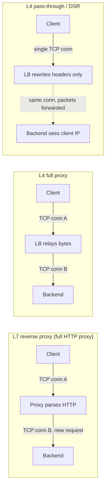
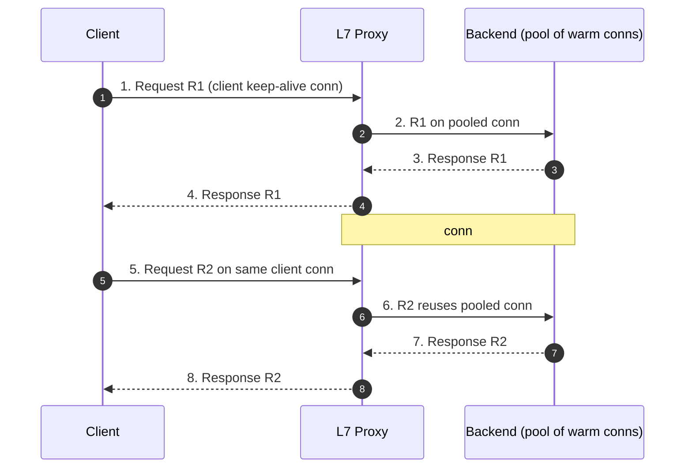

# Load Balancer vs Reverse Proxy — Professional

<!-- level-focus -->
At professional level, focus on this question:

> How should teams adopt and operate **Load Balancer vs Reverse Proxy** with measurable outcomes and limited coordination?

Use the smallest realistic scenario that exposes the decision and its failure behavior.
---

## 1. The Core Distinction, Restated Precisely

At junior/middle levels the distinction is framed by *intent*: a reverse proxy is a
server-side intermediary that fronts one or more origin servers, while a load balancer
distributes traffic across a pool. At the professional level the useful distinction is
about **where in the network stack the device operates and how many connections it holds
open**, because that single fact determines everything downstream: client-IP visibility,
TLS placement, connection reuse, and buffering behavior.

- A **Layer-7 reverse proxy** (nginx, HAProxy in HTTP mode, Envoy) parses the HTTP message.
  Per RFC 9110 §3.7 it is an **intermediary** that receives a request, may rewrite it, and
  forwards it as a *new* request on a *separate* connection. It necessarily terminates the
  client's transport connection.
- A **Layer-4 load balancer** (IPVS/LVS, AWS NLB, HAProxy in `mode tcp` without inspection)
  operates on TCP/UDP segments. It may either **terminate** the TCP connection (full proxy)
  or **pass through** at the packet level (NAT or direct routing) without ever reassembling
  the byte stream.

The words "load balancer" and "reverse proxy" describe overlapping roles played by the same
class of device; the *engineering* differences live in the connection model, which is the
subject of Section 2.



---

## 2. Connection-Handling Models: Terminating vs Pass-Through vs DSR

There are three canonical models. Understanding them at the socket level is the single most
load-bearing piece of knowledge in this topic.

### 2.1 Terminating (full) proxy

The intermediary owns **two independent TCP connections**: `client ↔ proxy` and
`proxy ↔ backend`. It calls `accept()` on the client side, reads the byte stream, and
`connect()`s to a backend, writing bytes there. The two connections have independent sequence
numbers, independent congestion windows, independent MSS, and can even use different transport
options (e.g., HTTP/2 client-side, HTTP/1.1 backend-side). This is mandatory for any L7
proxy and is one option for an L4 proxy.

Consequences:
- The backend's `getpeername()` returns the **proxy's** address, not the client's.
- The proxy can absorb slow clients (buffering), retry to a different backend, and multiplex.
- Two congestion-control loops decouple a lossy last mile from a clean datacenter LAN.

### 2.2 Pass-through (L4 NAT / packet forwarding)

The load balancer does **not** terminate TCP. It performs destination-NAT (DNAT): it rewrites
the destination IP/port of inbound packets to a chosen backend and rewrites the source of the
replies on the way back. There is one logical TCP connection, endpoint-to-endpoint, whose
packets happen to transit the LB. Because return traffic must also pass through the LB to
un-NAT it, the LB is on both the forward and reverse path (a "sandwich").

- The backend still sees the LB as the source unless additional tricks are used, **unless**
  the LB preserves the client source IP (some LVS/NAT and cloud NLB modes do preserve it).
- No byte-stream reassembly; lowest CPU cost; no ability to read or rewrite HTTP.

### 2.3 Direct Server Return (DSR / direct routing)

An optimization of pass-through. Inbound packets are steered to the backend (often via MAC
rewrite at L2, leaving IP headers untouched), but the **backend replies directly to the
client**, bypassing the LB on the return path. The backend is configured with the service's
VIP on a loopback so it accepts packets addressed to the VIP and sources replies from the VIP.

- Return traffic never touches the LB → excellent for asymmetric workloads (small request,
  large response, e.g., video). The LB handles only the inbound half.
- The backend sees the **real client IP** natively, because IP headers were never rewritten.
- Constraints: LB and backends typically must share an L2 segment (for MAC rewrite);
  health checking is harder; no L7 features possible.

### 2.4 Comparison

| Property | L7 terminating proxy | L4 full proxy | L4 pass-through (NAT) | DSR / direct routing |
|---|---|---|---|---|
| TCP connections | 2 (independent) | 2 (independent) | 1 (NAT'd) | 1 (MAC-rewritten) |
| Reassembles byte stream | Yes | Yes (relay) | No | No |
| Can read/rewrite HTTP | Yes | No | No | No |
| Backend sees client IP | No (needs `X-Forwarded-For`/PROXY protocol) | No (needs PROXY protocol) | Sometimes (mode-dependent) | Yes (native) |
| Return path via device | Yes | Yes | Yes | **No** |
| TLS termination possible | Yes | No (unless it also terminates) | No | No |
| Relative CPU cost | Highest | High | Low | Lowest |
| Connection reuse to backend | Yes | No | No | No |
| Retry to another backend | Yes (before/while buffered) | No | No | No |

---

## 3. Why a Terminating Proxy Erases the Client IP

When a proxy terminates and re-originates the connection (Sections 2.1–2.2), the backend's
TCP peer *is* the proxy. `SO_PEERADDR` / `getpeername(2)` on the backend socket returns the
proxy's source IP. The original client's IP is simply not present in any packet the backend
receives — it was consumed and discarded on the client-side connection. There are three
standard remedies, at different layers:

1. **`Forwarded` / `X-Forwarded-For` (L7, HTTP only).** The proxy inserts the client IP into
   an HTTP header. RFC 7239 standardizes `Forwarded: for=192.0.2.60;proto=https;by=203.0.113.43`;
   the older de-facto `X-Forwarded-For` is still ubiquitous. This works only for HTTP and only
   when the proxy parses HTTP. It is trivially forgeable, so backends must trust it **only**
   from known proxy addresses and strip/overwrite any client-supplied value at the edge.
2. **PROXY protocol (L4, any TCP/UDP payload).** A small header prepended to the backend
   connection carrying the real endpoints — see Section 4. This is the correct tool when the
   payload is opaque (TLS passthrough, raw TCP, non-HTTP protocols).
3. **Native preservation (DSR or IP-preserving NAT).** No header needed because the IP header
   was never rewritten (Section 2.3).

The failure mode when this is done wrong is severe and common: every request appears to come
from the load balancer's IP, so rate limiting, geo-IP, audit logging, and IP allow-lists all
collapse to a single source. A related subtle bug is **spoofing**: if a backend trusts
`X-Forwarded-For` from anyone, a client can forge its apparent IP by sending the header itself.

---

## 4. The PROXY Protocol (v1 and v2)

The PROXY protocol, defined by HAProxy Technologies (the "PROXY protocol" specification,
`proxy-protocol.txt`), solves client-IP preservation for the **L4 pass-through-style case
where the payload cannot be modified** — most importantly TLS passthrough and TCP proxying.
The proxy prepends a single header, *before any application bytes*, describing the original
connection's source and destination. Both endpoints must agree to speak it; a backend not
expecting the header will treat it as garbage application data.

### 4.1 Version 1 — human-readable

A single ASCII line terminated by CRLF, sent immediately after the TCP handshake completes:

```text
PROXY TCP4 192.0.2.60 203.0.113.43 56324 443\r\n
       └──┬─┘ └───┬───┘ └────┬────┘  └─┬─┘ └┬┘
        family  src IP    dst IP      sport dport
```

Simple to implement and debug (visible in a packet capture), but limited to TCP4/TCP6 and
carries no extensible metadata.

### 4.2 Version 2 — binary

A fixed 12-byte signature followed by a binary header. It supports IPv4/IPv6/AF_UNIX,
UDP as well as TCP, and **Type-Length-Value (TLV) extensions** — the extension mechanism that
lets the proxy pass along, e.g., the SNI hostname, the ALPN result, or the negotiated TLS
version/cipher and client-certificate details to the backend even though the backend is the
one terminating TLS in passthrough mode. The binary form is cheaper to parse at high
connection rates and unambiguous with respect to payload framing.

### 4.3 Header injection sequence

```mermaid
sequenceDiagram
    autonumber
    participant C as Client (192.0.2.60:56324)
    participant LB as L4 LB (PROXY protocol sender)
    participant B as Backend (PROXY protocol receiver)
    C->>LB: 1. TCP SYN → VIP:443
    Note over C,LB: handshake completes; LB will NOT terminate payload
    LB->>B: 2. TCP connect to backend:443
    LB->>B: 3. PROXY TCP4 192.0.2.60 203.0.113.43 56324 443\r\n
    Note over B: 4. backend records real client = 192.0.2.60:56324
    C->>LB: 5. TLS ClientHello (opaque bytes)
    LB->>B: 6. forward TLS ClientHello unchanged
    Note over B: 7. backend terminates TLS, logs/limits by real IP
```

The critical invariant: the PROXY header is the **very first thing** written to the backend
connection, ahead of the client's own first byte. The backend reads and consumes exactly the
header, then hands the remaining stream to the application unchanged. If the header is absent
when expected (or present when not), the connection is unrecoverable — there is no in-band
negotiation, which is why it must be configured explicitly on both sides.

---

## 5. HTTP Connection Reuse: Keep-Alive and Backend Pooling

A terminating L7 proxy holds two connection populations. On the **client side** it honors
HTTP persistent connections: per RFC 9112 §9.3, HTTP/1.1 connections are persistent by
default and closed only on `Connection: close` or error. On the **backend side** the proxy
maintains a **pool** of warm, reusable connections so that a client request does not pay a
fresh TCP + TLS handshake to the origin every time.

Why this matters at the byte level:

- A cold backend connection costs one TCP round trip (SYN/SYN-ACK/ACK) plus, if TLS,
  1–2 additional round trips for the handshake — easily 50–150 ms across a WAN, or a few
  hundred microseconds to low single-digit milliseconds intra-datacenter, but multiplied by
  request volume it dominates CPU (asymmetric crypto for the TLS handshake) and latency.
- With pooling, the proxy dispatches a new request onto an idle keep-alive connection from the
  pool, paying zero handshake cost. This is why an L7 proxy in front of a fleet can *reduce*
  backend load even without caching: it collapses N short-lived client connections into a
  smaller set of long-lived backend connections.

Key correctness constraints:

- **One in-flight request per HTTP/1.1 connection.** HTTP/1.1 has no request IDs; responses
  come back in request order. The proxy must not put a second request on a connection until the
  prior response is fully read (pipelining is effectively deprecated because of head-of-line
  blocking and buggy intermediaries). HTTP/2 removes this by multiplexing streams over one
  connection, so a single backend HTTP/2 connection can carry many concurrent requests.
- **Idempotency and retries.** The proxy may safely retry an idempotent request (GET, PUT,
  DELETE per RFC 9110 §9.2.2) onto a fresh backend connection if the first attempt fails before
  a response is received. Non-idempotent methods (POST) must not be blindly retried, because
  the request may have been received and acted upon before the connection dropped.
- **`Connection` and hop-by-hop headers.** Per RFC 9110 §7.6.1, headers listed in `Connection`
  (and `Connection` itself, plus `Keep-Alive`, `TE`, `Transfer-Encoding`, `Upgrade`, etc.) are
  **hop-by-hop**: they apply to a single connection and MUST be removed by the proxy, not
  forwarded. A proxy that forwards `Connection: close` verbatim would break backend pooling.



---

## 6. TLS at the Byte Level: Termination, Re-Encryption, Passthrough

Where TLS is decrypted determines what the intermediary can see and do. Three modes:

### 6.1 Termination (TLS offload / edge termination)

The proxy holds the server certificate and private key and completes the TLS handshake with
the client. From the proxy inward, bytes travel as **plaintext HTTP** over a plain TCP
connection to the backend. The proxy sees and can act on the full request (route by path,
add `X-Forwarded-For`, compress, cache). This concentrates expensive asymmetric crypto and
certificate management at the edge, but the proxy↔backend hop is unencrypted — acceptable only
inside a trusted network boundary.

### 6.2 Re-encryption (TLS bridging / end-to-end via the proxy)

The proxy terminates the client's TLS, inspects/routes the plaintext, then **opens a second,
separate TLS session** to the backend (proxy is the TLS client there). Two handshakes, two
sessions; the proxy sees plaintext in the middle. This gives full L7 capability *and*
encryption on the wire everywhere, at roughly double the crypto cost. This is the standard for
zero-trust internal networks where even east-west traffic must be encrypted.

### 6.3 Passthrough (TLS pass-through / SNI routing)

The proxy does **not** decrypt. It operates at L4 and forwards the encrypted TLS records byte
for byte to the backend, which terminates TLS itself. The proxy can still make a coarse routing
decision by reading the **SNI** field of the unencrypted `ClientHello` (the very first TLS
record), without possessing any private key. It cannot see headers, paths, or bodies. Combine
with the PROXY protocol (Section 4) to still give the backend the real client IP. Note that
Encrypted Client Hello (ECH) encrypts SNI and defeats SNI-based routing when in use.

```mermaid
sequenceDiagram
    autonumber
    participant C as Client
    participant P as Proxy
    participant B as Backend
    rect rgb(230,245,255)
    Note over C,B: Passthrough — proxy never sees plaintext
    C->>P: TLS ClientHello (SNI = api.example.com)
    P->>B: forward encrypted records; route by SNI
    B-->>C: TLS handshake completes end-to-end (via P as relay)
    end
    rect rgb(235,255,235)
    Note over C,B: Re-encryption — two TLS sessions, plaintext at P
    C->>P: TLS session 1 (P holds cert)
    Note over P: decrypt, inspect L7, re-route
    P->>B: TLS session 2 (P is TLS client)
    end
```

### 6.4 Comparison

| Mode | Proxy holds server key | Proxy sees plaintext | Wire encrypted end-to-end | L7 features | Routing basis | Crypto cost |
|---|---|---|---|---|---|---|
| Termination | Yes | Yes | No (proxy→backend cleartext) | Full | Any L7 attribute | 1 handshake |
| Re-encryption | Yes | Yes | Yes | Full | Any L7 attribute | 2 handshakes |
| Passthrough | No | No | Yes | None | SNI only (unless ECH) | 0 (relay only) |

---

## 7. Buffering vs Streaming Proxies and Head-of-Line Effects

Whether a proxy **buffers** a full message before forwarding it or **streams** bytes through as
they arrive changes latency, memory, resilience, and correctness.

### 7.1 Request/response buffering

A **buffering** proxy (nginx's default `proxy_buffering on` for responses; `proxy_request_buffering on`
for request bodies) reads the entire body into proxy memory/temp files before opening or
committing the backend exchange.

- **Slow-client absorption.** The backend connection is engaged only once the full request is
  buffered, so a slow uploader does not hold a scarce backend worker busy for seconds. This is a
  primary defense against slowloris-style resource exhaustion at the origin.
- **Enables safe retries.** Because the full request is in the proxy's memory, it can be
  replayed to another backend if the first attempt fails — impossible once bytes have started
  streaming to the origin.
- **Cost:** added latency (nothing forwarded until fully received) and memory/disk pressure for
  large bodies. Fatal for genuinely streaming workloads.

A **streaming** (unbuffered) proxy forwards each chunk as it arrives, typically via chunked
transfer coding (RFC 9112 §7.1) or by relaying an already-framed stream.

- **Required** for Server-Sent Events, gRPC streaming, WebSocket upgrades, large media, and any
  long-lived or progressive response where time-to-first-byte matters or the body is unbounded.
- **Cost:** the proxy holds a backend connection open for the full duration; it generally cannot
  retry mid-stream; and it must not have already buffered.

### 7.2 Head-of-line (HOL) blocking

HOL blocking occurs when one slow unit of work stalls others queued behind it on the same
serialization point. It appears at several layers relevant to proxies:

- **HTTP/1.1 connection reuse.** With one request in flight per connection (Section 5), a slow
  response blocks every subsequent request queued on that connection. The mitigation is a *pool*
  of parallel connections, not pipelining.
- **HTTP/2 over TCP.** HTTP/2 multiplexes many streams over one TCP connection, removing
  *application-layer* HOL blocking — but a single lost TCP segment stalls *all* streams because
  TCP must deliver bytes in order (transport-layer HOL blocking). HTTP/3 over QUIC moves
  multiplexing below the reliability layer so loss on one stream does not stall others.
- **A shared backend connection in the proxy.** If the proxy multiplexes several client requests
  onto one backend HTTP/2 connection, a stalled backend stream can create backpressure that
  affects the others sharing that connection's flow-control window.

Design rule: match the buffering mode to the payload. Buffer small, bounded request bodies for
safety and retryability; stream unbounded or latency-sensitive bodies; and never buffer a
WebSocket/gRPC/SSE stream. For connection reuse, prefer a pool sized to the concurrency you
need rather than relying on a single multiplexed connection whose HOL characteristics you do
not control.

---

## 8. Putting It Together: A Request's Full Byte Journey

Consider a typical edge deployment: an L7 reverse proxy that terminates TLS, preserves client
identity, pools backend connections, and streams a large response.

```mermaid
sequenceDiagram
    autonumber
    participant C as Client
    participant P as L7 Proxy (TLS terminate)
    participant B as Backend
    C->>P: 1. TLS handshake (P holds cert) + HTTP/2 request
    Note over P: 2. decrypt → plaintext HTTP; parse method/path/headers
    Note over P: 3. add Forwarded/X-Forwarded-For = client IP; strip hop-by-hop headers
    P->>B: 4. dispatch on pooled warm conn (no new handshake)
    B-->>P: 5. streamed response (chunked)
    P-->>C: 6. re-frame + re-encrypt; stream to client
    Note over P,B: 7. backend conn returned to pool for reuse
```

Every professional decision on this path traces back to Sections 2–7: the two-connection model
(2) forces client-IP preservation (3/4), termination (6) is what lets step 3 read headers,
pooling (5) removes per-request handshakes, and streaming (7) governs TTFB and retryability.

---

## 9. Professional Checklist

- [ ] Connection model chosen deliberately: terminating L7, L4 full proxy, NAT pass-through, or
      DSR — with the client-IP-preservation mechanism that each implies.
- [ ] Client IP preserved end-to-end: `Forwarded`/`X-Forwarded-For` for HTTP, PROXY protocol
      (v2 preferred) for opaque/TLS-passthrough TCP, or native DSR — and the edge **strips**
      client-supplied forwarding headers to prevent spoofing.
- [ ] Backend connection pooling enabled and sized; hop-by-hop headers (per RFC 9110 §7.6.1)
      stripped so pooling and keep-alive are not accidentally broken.
- [ ] Retries restricted to idempotent methods (RFC 9110 §9.2.2) and only while the request is
      still fully buffered / before any response bytes were received.
- [ ] TLS mode chosen per trust boundary: termination inside a trusted zone, re-encryption for
      zero-trust east-west, passthrough (with PROXY protocol) when the proxy must not hold keys.
- [ ] Buffering mode matched to payload: buffer bounded bodies for safety/retryability; stream
      SSE/gRPC/WebSocket/large media; never buffer an unbounded stream.
- [ ] Head-of-line risks understood at each layer (HTTP/1.1 serialization, HTTP/2-over-TCP,
      shared multiplexed backend connections) and mitigated with an appropriately sized pool.

### Standards and Primary Sources

- RFC 9110 — *HTTP Semantics* (intermediaries §3.7; connection/hop-by-hop headers §7.6.1;
  idempotent methods §9.2.2).
- RFC 9112 — *HTTP/1.1* (message framing, chunked transfer coding §7.1, persistent connections §9.3).
- RFC 7239 — *Forwarded HTTP Extension*.
- HAProxy Technologies — *The PROXY protocol* specification (`proxy-protocol.txt`), versions 1 and 2.


---

## Apply it

1. Define the user or business outcome that **Load Balancer vs Reverse Proxy** should improve.
2. Assign one owner for code, contracts, operations, and incidents.
3. Split delivery into reversible increments that produce evidence early.
4. Publish responsibilities, escalation paths, and compatibility windows.
5. Stop or expand only when the agreed measures support that decision.

## Verify your work

- Each increment has an owner, rollback path, and observable exit condition.
- Adoption, reliability, delivery time, and coordination cost are measured.
- Incident and migration exercises prove that responsibility is executable.
- The old path is removed only after telemetry proves it is unused.

## Review questions

- Which measurable outcome justifies investing in Load Balancer vs Reverse Proxy?
- Which team owns the full lifecycle and incident response?
- What reversible increment produces the earliest useful evidence?
- Which exit condition proves that migration or adoption is complete?
