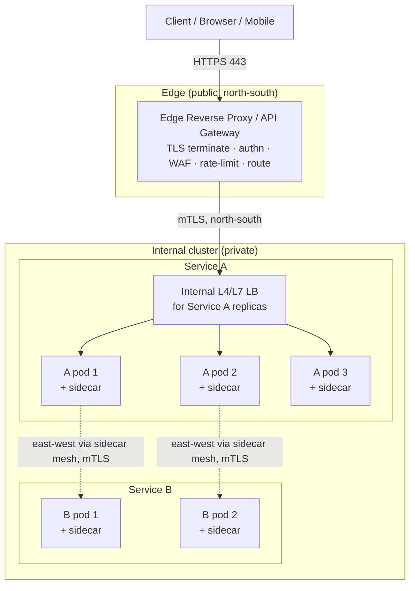
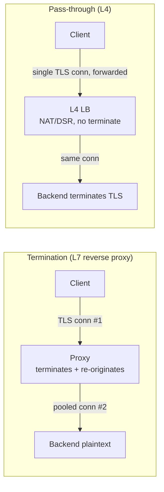

# Load Balancer vs Reverse Proxy — Senior

<!-- level-focus -->
At senior level, focus on this question:

> Which system invariant is affected by **Load Balancer vs Reverse Proxy** under failure, load, and change?

Use the smallest realistic scenario that exposes the decision and its failure behavior.
## 1. Role vs product: separating the two words

The single most common confusion in design reviews is treating "load balancer" and "reverse proxy" as two competing products you choose between. They are not. They are two *roles*, and one process usually plays both.

- A **reverse proxy** is a server-side intermediary. From the client's perspective it *is* the server: the client connects to it, and the proxy — on the client's behalf but under the operator's control — forwards the request to one or more origin servers and relays the response back. "Reverse" distinguishes it from a forward proxy, which acts on the *client's* behalf to reach arbitrary origins. A reverse proxy is deployed by the service operator, in front of servers the operator owns.
- **Load balancing** is a *function* an intermediary performs: when it has N candidate backends for a request, it picks one according to an algorithm (round-robin, least-connections, consistent-hash, EWMA/least-latency). A "load balancer" is any intermediary whose *primary* configured job is that distribution.

The overlap is total in the common case: NGINX, HAProxy, and Envoy are each a reverse proxy that load-balances, or equivalently a load balancer that reverse-proxies. So the useful question is never "proxy or LB?" It is: **what layer does this intermediary operate at (L4 or L7), what does it terminate, and what is its primary responsibility (distribution, TLS offload, routing, policy)?** Those three axes — layer, termination, responsibility — are what actually differentiate the boxes in your topology, and they are what the rest of this page reasons about.

A useful sharp edge: a pure L4 load balancer (AWS NLB, an L4 IPVS director) is *not* a reverse proxy in the classic sense when it does Direct Server Return or pure NAT forwarding without terminating the transport connection — it never becomes the server the client talks to end-to-end. The moment an intermediary terminates the client's TCP/TLS connection and originates a new one to the backend, it is unambiguously a reverse proxy, whatever the marketing label on the box.

## 2. Where each intermediary sits in the topology

The canonical large-system topology stacks several intermediaries, each with a different scope. Reading it outside-in: the client hits an **edge reverse proxy / API gateway** (public, internet-facing, TLS-terminating, north-south traffic); that forwards to an **internal service load balancer** (private, distributes across replicas of one service); and inside a service mesh, each pod's traffic passes through a **sidecar proxy** (per-instance, handles east-west service-to-service traffic).



The topology encodes a division of labor. The edge proxy owns concerns that must be enforced *once, at the boundary*, before untrusted traffic touches internal services: TLS termination for external clients, coarse authentication, WAF, DDoS shaping, and public routing (host/path → service). The internal LB owns *distribution within one service* and knows that service's health signals. The sidecar owns *per-call* concerns for east-west traffic: mTLS between services, fine-grained retries/timeouts/circuit-breaking, and telemetry, without the two application containers needing to implement any of it.

The reason to physically separate these rather than collapse them into one giant edge box is blast radius and rate of change. Edge config changes slowly and is security-critical; service routing changes constantly as teams deploy. Coupling them means every routine deploy touches the security-critical edge. The separation is a Conway's-law-friendly boundary: the platform team owns the edge, product teams own their internal LB/mesh policy.

## 3. The proxy as chokepoint and SPOF

Every intermediary you insert is, by construction, a point through which 100% of the traffic it fronts must pass. That is the source of its power — one place to enforce TLS, auth, routing, and observability — and the source of its danger — one place that, when it fails or saturates, takes down *everything behind it*, no matter how healthy the backends are.

Treat this as a first-class design fact, not an afterthought:

- **It is a hard SPOF unless made redundant.** A single edge proxy instance means a single process crash, a single kernel panic, a single bad config push, or a single host failure is a total outage. Backend redundancy is irrelevant if the only path to the backends is dead.
- **It is a capacity chokepoint.** The proxy's throughput ceiling — bounded by CPU (especially TLS handshakes), by file-descriptor / connection limits, by NIC bandwidth, or by ephemeral-port exhaustion on the backend side — is the whole system's ceiling. You can add backends all day; if the proxy tops out at 40k TLS handshakes/sec, that is your registration-storm ceiling.
- **It is a correlated-failure amplifier.** Because it sits in front of many independent backends, a proxy-level failure correlates outages that would otherwise be independent. A bad regex in a WAF rule, a memory leak in the proxy, or a slow config reload becomes a fleet-wide event.

The senior mandate is therefore: *any intermediary on a critical path must be horizontally redundant, health-checked, and drainable, and you must know its saturation ceiling before it is hit in production, not after.* The redundancy is what §4 covers; the ceiling is what §8 covers. The trap is treating the LB/proxy as "infrastructure someone else runs" — its capacity model is *your* capacity model.

## 4. HA topologies: active-passive vs active-active

Making the intermediary not-a-SPOF means running more than one, and the two families are active-passive (failover) and active-active. The choice is about how failover is triggered, how fast it is, and whether you can use the standby's capacity.

**Active-passive (VRRP / floating VIP).** Two proxy instances share a virtual IP. One is master and holds the VIP; the other is standby. A protocol like VRRP (keepalived) heartbeats between them; if the master stops advertising, the standby claims the VIP (gratuitous ARP) and takes over. Simple, well-understood, but the standby's capacity sits idle, and failover has a detection+takeover gap (typically sub-second to a few seconds) during which in-flight connections on the failed node are dropped.

```mermaid
sequenceDiagram
    autonumber
    participant C as Client
    participant M as Proxy A (master, holds VIP)
    participant S as Proxy B (standby)
    C->>M: traffic to VIP 203.0.113.10
    Note over M,S: VRRP heartbeats; A advertises priority 200
    M--xS: heartbeats stop (A crashes)
    Note over S: standby misses N heartbeats → promotes
    S->>C: gratuitous ARP: VIP now on B's MAC
    C->>S: subsequent traffic to VIP → B
    Note over C,S: in-flight connections on A were dropped; clients reconnect
```

**Active-active.** All proxy instances serve traffic simultaneously, fronted by a mechanism that spreads clients across them: DNS returning multiple A/AAAA records, anycast advertising the same IP from multiple locations, or an upstream ECMP router hashing flows across the instances. There is no idle standby — every node carries load — and losing one node removes only its share of capacity rather than causing a discrete failover event. The cost is that the layer *above* the proxies (DNS TTLs, anycast BGP convergence, ECMP rehashing) becomes the thing that must react to a failure, and connection state (TLS session, sticky sessions) must not assume a single node.

| Property | Active-passive (VRRP/VIP) | Active-active (DNS / anycast / ECMP) |
|---|---|---|
| Standby capacity | Idle (wasted) | All nodes serve — no waste |
| Failure event | Discrete failover, drops in-flight conns on failed node | Graceful degradation, lose only failed node's share |
| Failover trigger | Heartbeat timeout → VIP move (sub-second–seconds) | DNS TTL expiry / BGP withdraw / ECMP rehash |
| Capacity headroom rule | Each node must handle 100% alone | Each node must handle load/(N−1) after one loss |
| State assumptions | One active node — easier stickiness | Any node may get any client — externalize session state |
| Typical use | On-prem HA pairs, small footprints | Cloud LBs, global edge, high scale |

The senior rule that falls out of both: **you must provision for N−1 (or N−k) headroom.** In active-passive, the surviving node must handle the full load alone. In active-active with N nodes, each must handle `load / (N−1)` after one loss — running an active-active pair at 60% each means a single failure pushes the survivor to 120%, i.e., saturation and a cascading outage. HA that has no headroom is not HA; it is a slower way to fail.

## 5. The L4-vs-L7 decision as a proxy-capability decision

Whether the intermediary operates at L4 (transport: it sees IPs, ports, TCP/UDP flows) or L7 (application: it terminates and parses HTTP/gRPC/etc.) is not a performance footnote — it *defines what the proxy is capable of*, and therefore which responsibilities it can own.

An **L4 load balancer** forwards flows. It hashes the connection to a backend (by 4-tuple or 5-tuple) and moves bytes without understanding them. It cannot route by URL path, cannot inspect or add HTTP headers, cannot terminate TLS to see inside (it can pass TLS through or, at most, do SNI-based routing on the unencrypted handshake field), cannot retry a failed *request* (it only knows connections), and cannot do per-request rate limiting. In exchange it is extremely cheap and fast: minimal per-packet work, huge throughput, low latency, and — crucially — it can preserve the client connection semantics end-to-end (including Direct Server Return, where the backend replies straight to the client, bypassing the LB on the return path).

An **L7 proxy** terminates the client connection, parses the application protocol, and can therefore do everything L4 cannot: path/host routing, header manipulation, request-level retries and timeouts, request buffering, response caching, WAF, gRPC-aware load balancing (balancing *requests* across an HTTP/2 connection rather than pinning a whole connection to one backend), and content-based traffic splitting for canaries. The cost is that it must terminate and re-originate connections, parse every request, and — if TLS is involved — pay the handshake and symmetric-crypto CPU tax (§8).

The decision, then, is a capability-vs-cost trade you make per hop:

| Capability needed | L4 LB | L7 proxy |
|---|---|---|
| Path/host routing (`/api` → svc A) | ✗ | ✓ |
| TLS termination / offload | ✗ (passthrough only) | ✓ |
| Header inspection/mutation | ✗ | ✓ |
| Per-request retry / timeout | ✗ (connection-level only) | ✓ |
| gRPC / HTTP/2 request-level balancing | ✗ (pins connection) | ✓ |
| WAF / auth / rate-limit | ✗ | ✓ |
| Raw throughput / lowest latency | ✓✓ | ✓ |
| Direct Server Return | ✓ | ✗ (must relay response) |
| Preserve client TCP end-to-end | ✓ | ✗ (terminates) |

A common and correct pattern is to stack them: an L4 LB spreads raw connections across a fleet of L7 proxies (the L4 tier absorbs volume cheaply and provides the HA/anycast entry point; the L7 tier does the smart, expensive work). This is exactly how large cloud edges are built — a fast, dumb L4 front and a smart, terminating L7 behind it.

## 6. Connection termination vs pass-through

The termination decision is the heart of "proxy vs plain LB" and drives latency, feature set, and where trust and CPU cost land.

**Termination.** The intermediary completes the client's TCP (and usually TLS) handshake itself and opens a *separate* connection to the backend. There are now two connections — client↔proxy and proxy↔backend — and the proxy is the seam between them. This is what unlocks connection reuse/pooling to the backend (many short client connections multiplexed over a few long-lived, warm backend connections — a large latency and resource win), request-level intelligence, TLS offload so backends speak plaintext internally, and buffering of slow clients so backends aren't tied up by a client on a 2G link. The costs: the proxy is now a stateful participant that consumes memory and file descriptors per connection pair, adds a store-and-forward hop, and — the classic gotcha — *hides the real client IP and TLS identity* unless you explicitly restore them (X-Forwarded-For / Forwarded / PROXY protocol; client-cert info forwarded in headers). Getting client-IP propagation wrong breaks rate limiting, geo-routing, audit logs, and security controls that assume they see the true source.

**Pass-through.** The intermediary does *not* terminate; it forwards packets/flows so the backend terminates the client connection directly. TCP pass-through preserves the client's source IP naturally and lets the backend do TLS end-to-end (the proxy never sees plaintext — necessary for strict end-to-end encryption or when the proxy must not be in the trust boundary). But by not terminating, it forgoes everything termination buys: no pooling, no L7 routing, no offload, no buffering, no request retries.



The senior framing: termination is the price of admission for L7 features and backend connection efficiency, and pass-through is the tool for preserving end-to-end encryption, true client identity, and minimal per-flow cost. Most real systems terminate at the *edge* (to offload TLS, apply policy, and pool to backends) and may pass through *deeper* in the stack where end-to-end mTLS between services is required — which is exactly what the mesh sidecar does per-hop.

## 7. Reverse proxy, LB, API gateway, and mesh sidecar: overlapping roles

These four are not four different technologies; they are four *deployment roles* built from largely the same primitives (Envoy alone can be all four). Their responsibilities overlap heavily — all can terminate TLS, health-check, and load-balance — so the distinction is *what each is primarily for and where it sits*. Confusing them leads to duplicated policy (rate limiting in both the gateway and the mesh, applied twice) or gaps (nobody owns retries).

| Dimension | Reverse proxy | Load balancer | API gateway | Service mesh sidecar |
|---|---|---|---|---|
| Primary job | Terminate + forward on server's behalf | Distribute traffic across backends | Manage/secure/expose an *API surface* | Transparent per-instance L7 control for service-to-service |
| Traffic direction | North-south (edge) | North-south or east-west | North-south (edge) | East-west (internal) |
| Layer | L7 (usually) | L4 or L7 | L7 | L7 |
| Scope | In front of a set of servers | Across replicas | Across many APIs/services at the edge | One per service instance |
| Typical extras | TLS, caching, compression, buffering | Health checks, algorithms, stickiness | authn/authz, API keys, rate limits, quotas, request transformation, versioning, aggregation | mTLS, retries/timeouts, circuit breaking, fine-grained routing, per-hop telemetry |
| Config lifecycle | Slow, ops-owned | Slow, ops-owned | Per-API, product+platform owned | Per-service, dynamic (control plane) |
| Failure blast radius | Everything behind it | The service(s) it fronts | Entire public API | One service instance (contained) |

How to reason about the overlap in practice:

- **A load balancer is the distribution primitive; the others embed it.** A gateway load-balances; a reverse proxy load-balances; a sidecar load-balances. "Load balancer" as a distinct box is what you deploy when distribution is the *only* thing you need at that hop (e.g., an L4 LB in front of an L7 fleet).
- **An API gateway is a reverse proxy specialized for API *product* concerns.** It adds authn/authz, keys/quotas, request/response transformation, aggregation of multiple backend calls, and API versioning — concerns that make sense at the *public edge* where you expose a coherent API to external consumers. It is north-south.
- **A mesh sidecar is a reverse proxy (and forward proxy) pushed down to *every instance*, for east-west traffic.** It moves cross-cutting concerns (mTLS, retries, timeouts, circuit breaking, telemetry) out of application code and into a uniform data plane driven by a control plane. Its blast radius is contained to one instance, which is the whole point.

The senior's real job is drawing the responsibility boundaries so each concern is owned *once*: TLS-terminate-for-external-clients at the edge gateway; authenticate the external caller at the gateway; enforce service-to-service mTLS and retries in the mesh; do raw connection distribution at the L4 LB. When a concern lands in two places (retries at the gateway *and* in the mesh), you get retry amplification and traffic storms — a classic multi-layer-proxy incident.

## 8. Failure modes: saturation, head-of-line blocking, TLS CPU

Because the intermediary is a chokepoint, its failure modes are the system's failure modes. Three dominate at senior scale.

**Proxy saturation.** The proxy runs out of *some* resource and stops accepting or forwarding work, even though backends are healthy. The resources that saturate, roughly in order of how often they surprise people:

- **CPU from TLS** (its own section below).
- **Connection / file-descriptor limits.** Each terminated connection consumes an fd (often two: client-side and backend-side). Default ulimits and proxy `worker_connections` caps are easy to hit under connection-heavy workloads (mobile fleets, websockets). When the limit is reached, new connections are refused — an outage that looks like "the LB is down" but is a config ceiling.
- **Ephemeral-port exhaustion on the backend side.** A terminating proxy opens outbound connections to backends from a finite ephemeral port range (~28k per destination IP:port tuple by default). Under high fan-out without connection pooling and reuse, `TIME_WAIT` accumulation exhausts source ports and new backend connections fail. Fixes: connection pooling/keepalive to backends, multiple backend IPs, `SO_REUSEADDR`/tuned `tcp_tw_reuse`.
- **Memory from buffering.** Request/response buffering (needed to shield backends from slow clients) costs memory proportional to concurrent slow connections. A slowloris-style client population, or large uploads, can OOM the proxy.

The senior discipline: **know the proxy's ceiling for each resource before production hits it** (load-test TLS handshake rate, connection count, and backend fan-out), alert on utilization approaching the ceiling (not just on errors), and always provision N−1 headroom (§4). Saturation is a *capacity-planning* failure, not a mysterious outage.

**Head-of-line (HOL) blocking.** A slow or stuck work unit blocks unrelated work behind it because they share a serialized resource. This bites proxies in several places:

- **Worker/connection-level.** In event-loop proxies, a single expensive operation (a huge regex on a WAF rule, a synchronous DNS lookup, a blocking Lua call) stalls the whole event loop and every connection it serves.
- **Multiplexed-connection HOL.** With HTTP/2, many requests share one TCP connection; a single lost TCP segment stalls *all* streams on that connection (TCP-level HOL) — one slow/lost packet delays unrelated requests. This is exactly why HTTP/3 over QUIC exists, and why an L7 proxy that balances *requests* (not connections) across backends matters: if you pin a whole H2 connection to one backend, a slow backend head-of-lines every multiplexed request on it.
- **Backend HOL via a slow upstream.** If the proxy has a small backend connection pool and one backend is slow, requests queue for those pooled connections and fast backends starve. Per-request timeouts, circuit breaking, and outlier ejection (eject a slow backend from the pool) are the mitigations — mesh-sidecar territory.

**TLS CPU cost.** TLS termination is usually the proxy's single largest CPU consumer, and it is dominated by the *handshake*, not the bulk data transfer. The asymmetric public-key operation during the handshake (the certificate's private-key operation) is far more expensive than the symmetric AEAD (AES-GCM/ChaCha20) that encrypts the data afterward — modern CPUs with AES-NI do symmetric crypto nearly for free, but each new handshake costs real CPU. The consequences you must design around:

- **Handshakes/sec is your real TLS ceiling**, not bytes/sec. A registration storm or a thundering herd of new clients (cold CDN, cache purge, mobile app relaunch after an outage) is a *handshake* storm that can CPU-saturate the proxy while bandwidth is trivial.
- **Session resumption is the primary lever.** TLS session tickets / session IDs (and TLS 1.3's 0-RTT/1-RTT resumption) let returning clients skip the expensive asymmetric step. A high resumption rate can cut TLS CPU dramatically; a *low* one (e.g., tickets not shared across an active-active proxy fleet, so every reconnect lands on a "new" node) silently forces full handshakes and quietly halves your capacity.
- **Cipher and key choices matter.** ECDSA certificates are much cheaper per handshake than equivalent-security RSA; TLS 1.3 removes a round trip. These are levers, not footnotes, when handshake rate is your bottleneck.
- **Offload and placement.** Terminating TLS once at the edge (so internal hops speak plaintext or cheaper intra-cluster mTLS) concentrates the cost where you can provision for it. Some fleets use TLS-offload hardware/NICs or dedicated termination tiers. The mesh's per-hop mTLS re-introduces handshake cost internally — which is why mesh mTLS relies heavily on long-lived pooled connections between sidecars so the handshake amortizes over many requests.

## 9. Decision altitude and ownership

Owning the intermediary tier end-to-end means holding these at design-review altitude:

- **Name the role, not the product.** In a design doc, say "L7 terminating edge proxy doing TLS offload + host routing" and "L4 internal LB with DSR," not "we'll put an NGINX there." The role forces the layer/termination/responsibility questions to be answered.
- **Prove it isn't a SPOF.** Every intermediary on a critical path must be redundant (§4), and you must state the HA model, the failover behavior, and the N−1 headroom math. "It's behind the LB" is not an availability argument if the LB itself is one box.
- **Know the ceiling per resource.** TLS handshakes/sec, concurrent connections, fds, backend ephemeral ports, buffer memory. Load-test to the ceiling; alert before it.
- **Draw responsibility boundaries so each concern is owned once.** TLS termination, authn, rate limiting, retries — assign each to exactly one tier (edge gateway vs internal LB vs mesh). Duplicated concerns cause double-enforcement and retry storms; missing concerns cause gaps.
- **Preserve client identity across termination.** Whenever you terminate, you break the client's IP and TLS identity — decide explicitly how they are restored (Forwarded/XFF, PROXY protocol, forwarded client-cert) because security and observability downstream depend on it.
- **Match the L4/L7 split to need.** Push cheap volume absorption and HA entry to L4; push smart, per-request work to a terminating L7 tier behind it.

The through-line: the load balancer / reverse proxy is simultaneously the most useful control point in the system (one place for TLS, routing, policy, observability) and its most dangerous single failure and capacity chokepoint. Senior ownership is the discipline of keeping the first true while relentlessly engineering away the second.

## 10. Key takeaways

- "Load balancer" vs "reverse proxy" is a *role* distinction, not a product one: a reverse proxy is a server-side terminating intermediary; load balancing is one function it performs. Reason in three axes — layer (L4/L7), termination (terminate/pass-through), primary responsibility.
- The topology stacks intermediaries by scope: edge reverse proxy / API gateway (public, north-south, TLS + policy) → internal service LB (private, distribute across replicas) → mesh sidecar (per-instance, east-west, mTLS + retries). Separating them contains blast radius and matches config lifecycles to team ownership.
- Every intermediary is a chokepoint and a SPOF until proven otherwise. It must be redundant, health-checked, drainable, and provisioned with N−1 headroom — active-passive (VRRP/VIP, idle standby, discrete failover) or active-active (DNS/anycast/ECMP, graceful degradation, but state must be externalized).
- L4 vs L7 is a *capability* decision: L4 is cheap, fast, DSR-capable, and connection-only; L7 terminates and unlocks routing, TLS offload, header/request manipulation, request-level retries, and gRPC-aware balancing at CPU cost. Stacking a fast L4 front over a smart L7 tier is the canonical pattern.
- Termination buys L7 features and backend connection pooling but breaks client identity (restore via XFF/Forwarded/PROXY protocol) and adds a stateful hop; pass-through preserves end-to-end encryption and true source IP but forgoes L7 intelligence.
- API gateway = reverse proxy specialized for public API *product* concerns (authn, keys, quotas, transformation); mesh sidecar = reverse proxy pushed to every instance for east-west cross-cutting concerns. Assign each cross-cutting concern to exactly one tier to avoid double-enforcement and retry storms.
- The three failure modes to design against: **saturation** (CPU, fds/connections, backend ephemeral ports, buffer memory — a capacity-planning failure; know the ceiling before production), **head-of-line blocking** (event-loop stalls, TCP-level HOL on multiplexed H2, slow-backend queueing — mitigate with request-level balancing, timeouts, outlier ejection), and **TLS CPU** (handshakes, not bytes, are the ceiling — maximize session resumption across the fleet, prefer ECDSA + TLS 1.3, offload once at the edge).

*Next step:* [Load Balancer vs Reverse Proxy — Professional](professional.md)

---

## Apply it

1. State the system invariant that **Load Balancer vs Reverse Proxy** must protect.
2. Mark ownership, state, and failure propagation at each boundary.
3. Compare two designs under load, dependency failure, and future change.
4. Define recovery and compatibility behavior before implementation.
5. Test the riskiest assumption with a focused experiment.

## Verify your work

- The experiment supports the design with evidence, not preference.
- Failure injection shows the blast radius and recovery path.
- Compatibility checks cover old and new callers or data.
- Operational signals reveal invariant violations and recovery progress.

## Review questions

- Which invariant must remain true when Load Balancer vs Reverse Proxy fails?
- Where should recovery responsibility live, and why?
- Which assumption deserves an experiment before implementation?
- How can the design evolve without changing every consumer at once?
