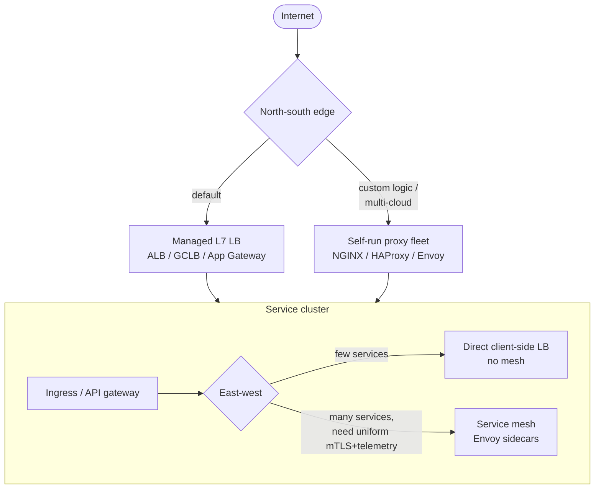
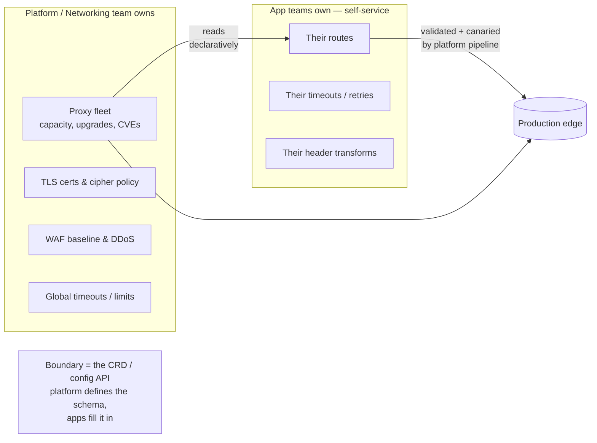
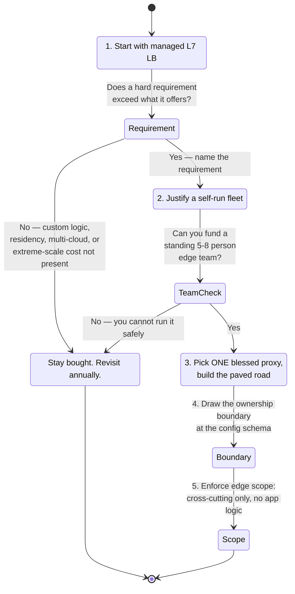

# Load Balancer vs Reverse Proxy — Staff

At Staff and Principal scope the question is not "what is the difference between a load balancer and a reverse proxy" — you have known that since the junior page. The question is *who in the org owns the box that every request flows through, what it costs to run it, and how it becomes a shared chokepoint that quietly caps the velocity of teams that have never heard its name.* An L7 reverse proxy or API gateway is one of the very few pieces of infrastructure that is simultaneously on the hot path of 100% of production traffic and a place where dozens of teams need to make changes. That combination — total blast radius plus shared write-access — is what makes it a sociotechnical problem, not a networking one. This page is about the build-vs-buy decision, the ownership boundary, the operational economics of running your own proxy fleet, and the organizational failure modes of a shared edge.

## Table of Contents

1. [The framing: the edge is an org chart, not a config file](#1-the-framing-the-edge-is-an-org-chart-not-a-config-file)
2. [Managed cloud LB vs self-run proxy vs service mesh](#2-managed-cloud-lb-vs-self-run-proxy-vs-service-mesh)
3. [Build-vs-buy: the real cost of running your own proxy fleet](#3-build-vs-buy-the-real-cost-of-running-your-own-proxy-fleet)
4. [The ownership boundary: who owns the edge, who owns the route](#4-the-ownership-boundary-who-owns-the-edge-who-owns-the-route)
5. [Standardize org-wide vs let each team choose](#5-standardize-org-wide-vs-let-each-team-choose)
6. [When the reverse proxy / API gateway becomes a chokepoint](#6-when-the-reverse-proxy--api-gateway-becomes-a-chokepoint)
7. [A staged build-vs-buy decision framework](#7-a-staged-build-vs-buy-decision-framework)
8. [Failure modes and cost table](#8-failure-modes-and-cost-table)
9. [What to standardize as a platform team](#9-what-to-standardize-as-a-platform-team)
10. [Staff-level takeaways](#10-staff-level-takeaways)

---

## 1. The framing: the edge is an org chart, not a config file

A load balancer distributes connections across a pool. A reverse proxy terminates the client connection and speaks to backends on the client's behalf — adding TLS termination, routing, header rewriting, auth, and caching. Every managed cloud LB above L4 *is* a reverse proxy (AWS ALB, GCP's global HTTPS LB, Azure Application Gateway are all L7 proxies you did not write); an NLB or GCP TCP/UDP LB is an L4 balancer that does not proxy L7 at all. The taxonomy is settled. What is not settled, and what defines the Staff decision, is **the seam between three teams that all touch the same request path:**

- The **networking/platform team** that owns the edge proxy as a fleet — its capacity, its TLS certs, its upgrade cadence, its on-call.
- The **app teams** that own *routes* — the mapping from `/checkout` to the checkout service, the timeouts, the retries, the header transforms specific to their product.
- The **security team** that wants a single place to enforce WAF rules, mTLS, and auth, and therefore wants the edge to be a chokepoint on purpose.

These three want incompatible things from the same object. Platform wants it boring, uniform, and rarely changed. App teams want it flexible and self-service. Security wants it centralized and gated. Every architecture on this page is really a different answer to *how do you let all three win at once*, and the honest answer is that you cannot fully — you are choosing which team eats the friction.

The Staff mistake is to treat "LB vs reverse proxy" as a technology comparison and pick the one with better benchmarks. The technology is nearly fungible: NGINX, HAProxy, and Envoy will all move your packets. The decision that actually matters is **who operates it, who is allowed to change its config, and how a change by one team reaches production without endangering the other ninety-nine.** Get that wrong and the fastest proxy in the world becomes the slowest thing in your org.

## 2. Managed cloud LB vs self-run proxy vs service mesh

There are three broad postures for the traffic-routing layer, and most large orgs run all three in different tiers. The Staff job is knowing which belongs where.

| Dimension | Managed cloud LB (ALB / NLB / GCLB) | Self-run proxy fleet (NGINX / HAProxy / Envoy) | Service mesh (Envoy sidecars + control plane) |
| --- | --- | --- | --- |
| **What you buy** | The whole edge as a service | Software + full ops responsibility | East-west routing as a platform product |
| **Control over routing** | Cloud's feature set only | Total — any header, any Lua/VCL/filter | Total, expressed as declarative CRDs |
| **Ops burden** | Near-zero; provider carries it | High: capacity, upgrades, CVEs, on-call | Very high: control plane + N sidecars |
| **Marginal cost model** | $/hour + $/LCU or $/GB processed | EC2/pods + engineer salaries | Sidecar CPU/RAM tax × every pod + platform team |
| **Blast radius of a change** | Small (cloud tested it) | Yours to contain | Config push can hit the whole mesh at once |
| **Where it fits** | North-south edge, TLS, simple path/host routing | Edge needing custom logic cloud can't do | East-west service-to-service, mTLS, uniform telemetry |
| **Lock-in** | High (config not portable) | Low (portable across clouds) | Medium (Envoy portable, control plane less so) |
| **Time-to-first-value** | Minutes | Weeks to a hardened fleet | Quarters to a safe rollout |
| **Who you page at 3 a.m.** | The cloud (open a ticket) | Your platform on-call | Your platform on-call, harder to debug |

The decomposition that keeps orgs sane:

- **North-south edge (internet → you):** default to a **managed L7 LB** unless you have a concrete requirement it cannot meet. TLS termination, ACME cert rotation, DDoS scrubbing, and anycast are things you should almost never rebuild. You reach for self-run NGINX/HAProxy/Envoy at the edge only when you need routing logic the cloud LB genuinely cannot express (complex Lua/VCL, request coalescing, edge caching semantics, a WAF you must own) or when multi-cloud portability is a first-class requirement.
- **East-west (service → service):** this is where a **mesh** earns its keep — uniform mTLS, retries, circuit breaking, and golden-signal telemetry without every team reimplementing them. It is also where the mesh's sidecar tax and control-plane complexity are most likely to exceed its value if you have twenty services instead of two thousand.

The trap is picking one posture for everything. Meshing your north-south edge buys you complexity with no upside; hand-rolling an NGINX fleet for a workload a managed LB handles verbatim buys you an on-call rotation you did not need. The Staff answer is almost always *managed at the edge, mesh (or nothing) in the middle,* with self-run proxies as a deliberate exception you can name a reason for.

## 3. Build-vs-buy: the real cost of running your own proxy fleet

"NGINX is free" is the single most expensive sentence in infrastructure planning. The binary is free. The fleet is not. When you compare a self-run proxy to a managed LB, you must compare **total cost of ownership over the years the decision lives**, and TCO is dominated by human cost, not compute.

The line items a build decision actually signs up for:

- **Capacity and headroom.** You now own sizing the fleet for peak plus failure headroom, autoscaling it, and eating the idle cost of the headroom. A managed LB's headroom is the provider's problem, priced into the per-hour/per-LCU rate.
- **Upgrades and CVEs.** Every proxy is on the hot path of 100% of traffic and is internet-facing, which makes it a top-tier CVE target (recall the recurring HTTP/2 rapid-reset and request-smuggling classes). You now own an *emergency patch* pipeline that can roll the whole fleet in hours without dropping connections. This is a standing on-call obligation, not a one-time build.
- **Config safety.** A bad config push to a self-run proxy is a global outage. You now own config validation, staged rollout, canarying, and instant rollback for config *as well as* binaries. Most self-run-proxy outages are config, not code.
- **TLS lifecycle.** Cert issuance, rotation, OCSP stapling, cipher policy, and the audit trail for all of it. ACME automation you build and keep running.
- **Observability.** The proxy's own golden signals (its saturation, its upstream error rates, its p99 added latency) plus the plumbing to ship them. A managed LB emits these to the cloud's monitoring for free.
- **The on-call rotation itself.** A fleet that fronts all traffic needs 24/7 coverage with people who can debug it under pressure. That is 5–8 engineers of sustained staffing to run a rotation humanely — the largest single line item and the one build proposals routinely omit.

A rule of thumb that survives contact with reality: a hardened, self-run edge-proxy fleet is a **small standing team's full-time job**, not a project you finish. The managed LB's premium over raw compute is that team's salary, and it is almost always cheaper than the team. You build your own proxy when you have a *requirement the managed option cannot meet* (custom edge logic, data residency, multi-cloud, cost at extreme scale where per-GB LB pricing dominates) — never merely because the software is free or because you can. "We could run it ourselves" is true and irrelevant; the question is whether the differentiated value clears the standing operational cost.

The one place the arithmetic flips: **at very large scale, per-GB or per-LCU managed pricing can exceed the fully-loaded cost of a self-run fleet.** Hyperscalers and large CDNs run their own proxies for exactly this reason. If your traffic is large enough that the managed bill is measured in millions per year, a self-run fleet *plus* its team can be cheaper — but you only know that after you have done the estimation, and you should re-do it annually because both the managed pricing and your traffic move.

## 4. The ownership boundary: who owns the edge, who owns the route

The edge proxy has two kinds of state that must be owned by two different teams, and conflating them is the root cause of most edge dysfunction:

- **Fleet state** — the proxy binaries, the machines/pods, TLS certs, global timeouts, resource limits, the WAF baseline. This is *platform/networking* territory. App teams should never touch it.
- **Route state** — "requests for `api.example.com/checkout` go to the checkout service with these timeouts, retries, and header transforms." This is *app team* territory. Platform should not be a ticket queue for it.

The healthy pattern is **platform owns the machine, apps own the config, and the config is a declarative product with guardrails.** Kubernetes Ingress/Gateway API and Envoy's xDS/CRD model exist precisely to encode this: the platform defines a schema and the safety rails (which fields are settable, what the max timeout is, what rollout process applies), and app teams submit routes through it via their own PRs. Platform never becomes a bottleneck because it is not in the request-config loop — it is in the *schema* loop. That is the difference between a platform and a shared service desk.

The two anti-patterns:

- **Platform owns everything, including routes.** Every routing change becomes a ticket to the networking team. The networking team becomes a bottleneck for every product launch, resents being a change-approval body for logic it does not understand, and app teams start routing *around* the edge (their own ELBs, their own gateways) to escape the queue — which fragments the very thing the edge was supposed to centralize.
- **Apps own everything, including the fleet.** Now there is no coherent capacity plan, no unified CVE-patch story, five different TLS-cert-rotation half-solutions, and a config change by one team can and will take down another team's traffic because they share a proxy nobody clearly owns. The blast radius has an owner of "nobody."

The boundary you draw *is* the architecture. Draw it at the config schema — platform owns the schema and the rails, apps own the values — and both the "platform is a bottleneck" and the "blast radius has no owner" failure modes disappear at once.

## 5. Standardize org-wide vs let each team choose

Should the whole org run one proxy technology, or should each team pick NGINX, HAProxy, or Envoy as they see fit? This is the classic **standardization vs autonomy** tension, and on the edge the answer leans harder toward standardization than almost anywhere else, because the edge is shared-fate.

The case for one blessed proxy org-wide:

- **One CVE-response pipeline.** When the next HTTP/2 reset or request-smuggling CVE drops, you patch *one* thing, not three ecosystems with three patch cadences and three sets of gaps.
- **One set of runbooks and one on-call skill set.** An incident on the edge can be debugged by anyone on the rotation, not only the two people who know HAProxy's ACL syntax.
- **One observability schema.** Latency, saturation, and error signals mean the same thing across the fleet, so dashboards and alerts compose.
- **Portable expertise.** An engineer moving between teams already knows the tool.

The case for per-team choice is real but narrow: a team with a genuinely different workload (say, an edge that needs Envoy's dynamic xDS and gRPC-transcoding while the rest of the org is happy with NGINX) should not be forced onto the wrong tool to satisfy uniformity. The Staff answer is a **"paved road" model**: there is one blessed, fully-supported proxy with self-service tooling, golden configs, and platform on-call behind it. You *may* go off-road and run something else — but off-road means you own the fleet, the CVE response, the on-call, and the observability yourself, and you sign up for that explicitly. The paved road is so much easier that 95% of teams stay on it, and the 5% who leave have a real reason and carry the cost. This gets you the CVE/runbook/observability benefits of standardization without turning the platform into a tool-choice police force.

Convergence usually settles on **Envoy for anything dynamic** (its xDS API makes it the natural data plane for a mesh and for config-as-a-product edges) and **NGINX/HAProxy for static, high-throughput, simple edges** where their maturity and lower resource footprint win. The point is not which one — it is that *the org has an answer*, published, with a support model, so that "which proxy?" is not re-litigated in every design review.

## 6. When the reverse proxy / API gateway becomes a chokepoint

The reverse proxy or API gateway is the most seductive place to put shared logic — auth, rate limiting, request validation, transformation, A/B routing — because it sees every request. That is exactly why it becomes an organizational chokepoint. Three distinct chokepoints, each with its own failure mode:

- **The change-velocity chokepoint.** When every team must route changes through a single gateway team, the gateway becomes a serialization point on org velocity. Product launches wait in a config queue. The symptom is app teams building shadow gateways to escape. The fix is section 4's boundary: make route config self-service so the gateway team is never in the per-change loop.
- **The blast-radius chokepoint.** Because 100% of traffic flows through it, any bug, bad config, or capacity miss on the gateway is a *total* outage, not a partial one. A shared edge is a single failure domain by construction. The fix is not to un-share it but to *contain* it: staged config rollout with canaries, per-route resource isolation so one route's overload cannot starve another, and the discipline that the edge does the *least* logic that must be central — every business rule you push into the gateway is a business rule whose outage is now global.
- **The "god object" chokepoint.** Over years, the gateway accretes logic that had nowhere else to live — a bespoke auth quirk here, a special-case rewrite there, a legacy header hack that three services still depend on. It becomes an undocumented, un-refactorable business-logic monolith that no one dares change, on the hot path of everything. This is the most dangerous state because it is invisible until you try to modify it. The prevention is a standing rule: **the edge does cross-cutting concerns (TLS, auth handoff, rate limits, routing) and nothing app-specific.** App-specific logic belongs in app services. Enforce it in code review of gateway configs, because it accretes one "just this once" at a time.

The meta-point: centralization at the edge is a genuine benefit (one place for security, one place for observability, one place for policy) *and* a genuine liability (one place to fail, one place to bottleneck). You do not resolve the tension — you manage it by being ruthless about what is allowed to live at the edge and by making the edge self-service for the things that must. A shared edge with strict scope and self-service config is a platform. A shared edge that accepts every team's special case through a ticket queue is a chokepoint wearing a platform's clothes.

## 7. A staged build-vs-buy decision framework

Walk the decision in this order; stop at the first honest answer.

The framework encodes four rules that are easy to state and hard to hold:

1. **Buy by default; build against a named requirement.** "We could" is not a requirement. "Managed cannot do request coalescing / cannot meet our data-residency law / costs $4M/yr at our GB volume" is.
2. **A build decision is a *team* decision.** If you cannot fund the standing on-call, you cannot build safely, regardless of the technical case. Revisit as a hiring/headcount question, not just an architecture one.
3. **Standardize the technology before you scale the fleet.** Choosing your one proxy is cheaper before you have three.
4. **Draw the boundary and scope the edge on day one.** These are load-bearing decisions that are nearly impossible to retrofit once a god-object gateway has formed.

Revisit the whole tree **annually**, because the two inputs that decide it — managed-LB pricing and your traffic volume — both move, and the decision that was right at 10 GB/s may be wrong at 1 TB/s and vice versa.

## 8. Failure modes and cost table

| Failure mode | Root cause | Symptom | Prevention |
| --- | --- | --- | --- |
| Gateway team is the launch bottleneck | Platform owns route config, not just the fleet | Product launches wait in a config ticket queue | Self-service route config via a schema with guardrails (§4) |
| Shadow gateways proliferate | Teams route around the slow central edge | Fragmented TLS, no unified WAF, "where does auth happen?" | Make the paved road faster than going around it |
| Total outage from one config push | Shared edge is one failure domain | 100% of traffic down from one team's change | Staged rollout + canary + instant rollback for *config* (§3) |
| Unpatched edge CVE | Self-run fleet with no emergency-patch pipeline | Internet-facing proxy on a known-vuln version for weeks | Fund the standing team; one blessed proxy, one patch pipeline (§3, §5) |
| God-object gateway | App-specific logic accreted at the edge over years | Un-refactorable, undocumented, everyone afraid to touch it | Enforce "cross-cutting only" in config review (§6) |
| Build TCO blowout | "NGINX is free" costed only the binary | Under-staffed fleet, burned-out on-call, missed CVEs | TCO includes the 5–8 person team; buy unless a requirement clears it (§3) |
| Mesh tax exceeds mesh value | Adopted a service mesh at 20 services | Sidecar CPU/RAM tax + control-plane complexity for little gain | Mesh only when uniform mTLS/telemetry across many services is the requirement (§2) |
| Vendor lock-in surprise | Managed-LB config is not portable | Multi-cloud or cost-arbitrage move blocked by non-portable edge | Name portability as a requirement *before* choosing, if it matters |

## 9. What to standardize as a platform team

The deliverables a platform team should own so that "LB vs reverse proxy" stops being a per-project debate:

- **One blessed edge posture per tier:** managed L7 LB for north-south by default; a documented self-run exception process; mesh-or-nothing for east-west with a services-count threshold for when the mesh turns on.
- **A route-config product**, not a ticket queue: a schema (Gateway API / xDS / equivalent) with guardrails, self-service submission through app-team PRs, and automated validation, canary, and rollback.
- **The ownership boundary written down:** platform owns fleet + certs + WAF baseline + global limits; apps own routes + their timeouts + their transforms. Publish it so no one has to ask.
- **One emergency-patch pipeline** that can roll the whole self-run fleet within hours without dropping connections, exercised on a schedule so it works when the CVE is real.
- **One observability schema** for the edge's own golden signals (saturation, upstream error rate, added p99), consistent across the fleet.
- **An edge-scope policy** enforced in review: cross-cutting concerns only, no app-specific business logic at the edge, so the god-object never forms.
- **An annual build-vs-buy review** driven by current managed pricing and current traffic, so the decision stays right as both move.

## 10. Staff-level takeaways

- The LB-vs-reverse-proxy technology comparison is *settled and nearly fungible*; the Staff decision is **who operates the box, who may change it, and how a change reaches production without endangering everyone else.**
- **Buy the edge by default.** "NGINX is free" costs a 5–8 person standing team; the managed LB's premium over compute is that team's salary and it is almost always cheaper than the team. Build only against a *named* requirement managed cannot meet — and only if you can fund the on-call.
- **The arithmetic flips only at extreme scale**, where per-GB/per-LCU managed pricing can exceed a self-run fleet plus its team. Re-run the estimation annually; both inputs move.
- **Draw the ownership boundary at the config schema:** platform owns the fleet and the rails, app teams own the route values self-service. This kills both the "platform is a bottleneck" and the "blast radius has no owner" failure modes at once.
- **Standardize on one blessed proxy** with a paved road; allow off-road only with the team owning its own fleet, CVE response, and on-call. One patch pipeline, one runbook, one observability schema.
- **The edge is centralization's double edge:** one place for security and observability *and* one place to fail and to bottleneck. Manage it by being ruthless about scope — cross-cutting concerns only, no app logic — and by making route config self-service. A shared edge with strict scope is a platform; a shared edge with a ticket queue is a chokepoint.

*Next step:* [Load Balancer vs Reverse Proxy — Interview](interview.md)
