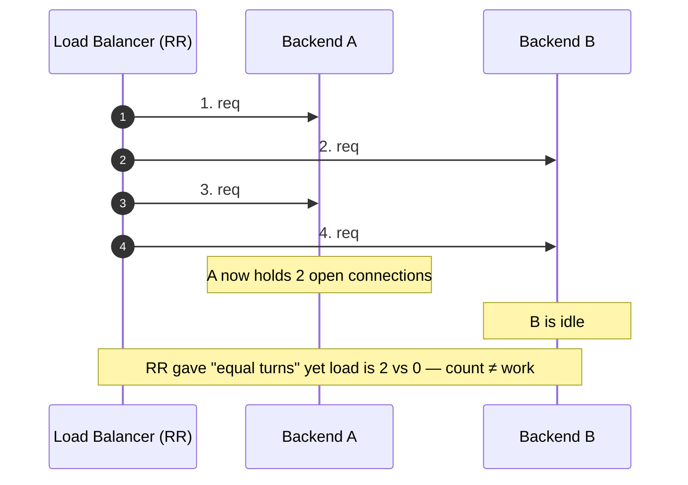
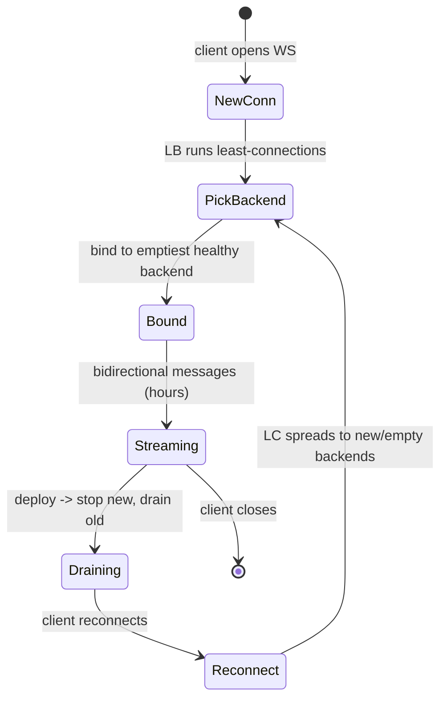
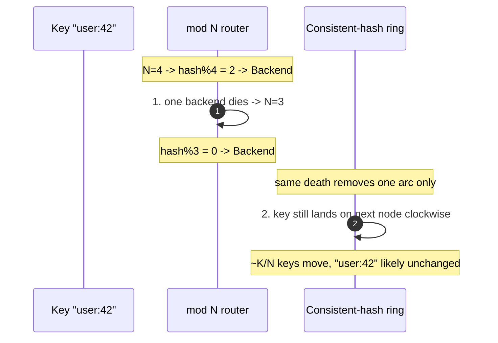

# Load Balancing Algorithms — Interview

Fast, quotable answers for the algorithm layer of a load balancer: how requests are assigned to backends, why the "obvious" choice (round-robin) fails under real workloads, and when to reach for power-of-two-choices or consistent hashing. Answers assume the interviewer wants trade-off reasoning, not definitions.

## Table of Contents
1. [Q1: Name the core LB algorithms and their one-line intent](#q1-name-the-core-lb-algorithms-and-their-one-line-intent)
2. [Q2: Round-robin vs weighted round-robin — when is each right?](#q2-round-robin-vs-weighted-round-robin--when-is-each-right)
3. [Q3: Why does round-robin fail for long-lived or uneven requests?](#q3-why-does-round-robin-fail-for-long-lived-or-uneven-requests)
4. [Q4: Least-connections — how it works and its blind spot](#q4-least-connections--how-it-works-and-its-blind-spot)
5. [Q5: Least-response-time vs least-connections](#q5-least-response-time-vs-least-connections)
6. [Q6: What is power-of-two-choices and why is it so good so cheaply?](#q6-what-is-power-of-two-choices-and-why-is-it-so-good-so-cheaply)
7. [Q7: IP-hash and session affinity — mechanics and hazards](#q7-ip-hash-and-session-affinity--mechanics-and-hazards)
8. [Q8: Consistent hashing — what problem does it solve here?](#q8-consistent-hashing--what-problem-does-it-solve-here)
9. [Q9: When do you actually need consistent hashing vs plain round-robin?](#q9-when-do-you-actually-need-consistent-hashing-vs-plain-round-robin)
10. [Q10: Least-connections + aggressive retries — the cascade risk](#q10-least-connections--aggressive-retries--the-cascade-risk)
11. [Q11: Distributed LB fleet — why local least-connections lies](#q11-distributed-lb-fleet--why-local-least-connections-lies)
12. [Q12: How do health checks and slow-start interact with the algorithm?](#q12-how-do-health-checks-and-slow-start-interact-with-the-algorithm)
13. [Q13: Comparison table — pick the algorithm](#q13-comparison-table--pick-the-algorithm)
14. [Q14: Scenario — design LB for a WebSocket-heavy service](#q14-scenario--design-lb-for-a-websocket-heavy-service)
15. [Q15: Scenario — pick an algorithm for a cache-fleet read path](#q15-scenario--pick-an-algorithm-for-a-cache-fleet-read-path)
16. [Q16: What goes wrong with hash-based balancing when the backend set changes?](#q16-what-goes-wrong-with-hash-based-balancing-when-the-backend-set-changes)

---

## Q1: Name the core LB algorithms and their one-line intent

> - **Round-robin (RR):** rotate through backends in order. Assumes requests are cheap and uniform.
> - **Weighted round-robin (WRR):** RR but each backend gets a share proportional to its weight (capacity).
> - **Least-connections (LC):** send to the backend with the fewest active connections. Adapts to request duration.
> - **Weighted least-connections:** LC normalized by weight — pick min of `active/weight`.
> - **Least-response-time / least-load:** send to the backend with the lowest measured latency (or latency × active).
> - **Power-of-two-choices (P2C):** sample two backends at random, pick the less loaded of the two.
> - **IP-hash / hash-based:** deterministically map a key (client IP, session id, cache key) to a backend.
> - **Consistent hashing:** hash-based, but adding/removing a backend remaps only ~1/N of keys instead of all of them.
>
> The axis that matters: **stateless & uniform → RR/WRR; variable request cost → LC/P2C; must stick a key to a backend → hash/consistent-hash.**

---

## Q2: Round-robin vs weighted round-robin — when is each right?

> **Round-robin** is correct only when backends are homogeneous *and* requests are roughly equal-cost. Then even distribution ≈ even load, at zero coordination cost — it needs no per-backend state, just a counter.
>
> **Weighted round-robin** is what you use the moment the fleet is heterogeneous: a mix of instance sizes, a canary you want to receive 1% of traffic, or backends in different generations. Weight is usually proportional to core count or measured capacity. Naive WRR (emit backend A `w_A` times, then B `w_B` times) produces bursty, clumped traffic; production implementations use **smooth/interleaved WRR** (the algorithm nginx uses) so a `{5,1,1}` weighting yields `A B A C A A B ...` rather than `A A A A A B C`.
>
> Both share the same fatal assumption — that *request count* is a good proxy for *load*. When it isn't (Q3), you need a feedback-driven algorithm.

---

## Q3: Why does round-robin fail for long-lived or uneven requests?

> Round-robin balances **request count, not work.** It has no feedback signal about how busy a backend actually is. Two failure modes:
>
> 1. **Uneven request cost.** If one in twenty requests is 100× heavier (a report export, a fan-out query), RR will happily deal those heavy requests to already-saturated backends because it only counts turns. Load variance grows even though counts are perfectly even.
> 2. **Long-lived connections.** With WebSockets, gRPC streams, or DB connections, a "request" pins a backend for minutes to hours. RR distributes *new* connections evenly, but connections don't drain evenly — a backend that came up early, or survived a deploy, accumulates a large stable population. After a rolling restart, newly-added backends are near-empty while survivors are hot, and RR does nothing to correct it because it never looks at current occupancy.
>
> Concretely: RR is memoryless about the past. The instant durations differ, "next in rotation" stops meaning "least loaded." That's why real traffic managers default to least-connections or P2C for anything but cheap, short, uniform HTTP.

---

## Q4: Least-connections — how it works and its blind spot

> Least-connections routes each new request to the backend with the fewest **currently active** connections. Because a heavy or long-lived request keeps its connection count elevated, LC naturally steers new traffic away from busy backends — it self-corrects for the variance that breaks RR. **Weighted LC** divides the active count by the backend's weight so a 2× machine can carry ~2× connections before being deprioritized.
>
> **Blind spots:**
> - **Connections ≠ CPU.** A backend can hold few connections but be pinned on CPU (or GC-thrashing); LC can't see that. Least-response-time (Q5) reads the symptom instead of the proxy.
> - **New/empty backends get dogpiled.** A freshly added or just-recovered backend has *zero* connections, so LC dumps a thundering herd onto it before it's warmed (cold caches, JIT, connection pools). Mitigate with **slow-start** (Q12).
> - **It requires accurate global state.** In a fleet of LBs, each LB only knows *its own* connection counts, so "least" is locally true but globally wrong (Q11).

---

## Q5: Least-response-time vs least-connections

> **Least-connections** uses active connection count as a *proxy* for load. **Least-response-time** (a.k.a. least-time, least-load, EWMA-latency) uses the *measured* signal: pick the backend with the lowest recent response time, often combined as `active_connections × latency` or a decaying (EWMA) latency estimate.
>
> Why prefer least-response-time: it catches backends that are slow for reasons connection count can't reveal — a GC pause, a noisy neighbor, a degraded disk, a backend one AZ farther away. It's the closest cheap proxy to "actual load."
>
> Why not always use it: it needs **per-backend latency telemetry** and smoothing (raw last-latency is jittery; you want EWMA or a windowed percentile), it can **overreact and oscillate** (everyone piles onto the momentarily-fastest node, making it slow, then flees), and stale measurements mislead. Envoy's `LEAST_REQUEST` and P2C-with-weights variants exist precisely to get most of the benefit without the oscillation.

---

## Q6: What is power-of-two-choices and why is it so good so cheaply?

> **Power-of-two-choices (P2C):** instead of scanning all N backends for the global minimum, pick **two backends uniformly at random** and route to the less-loaded of the two.
>
> The magic is the math. Pure random placement gives a maximum load that grows like `Θ(log N / log log N)` above the average — some backend gets badly unlucky. Making **one extra comparison** (two choices instead of one) collapses the maximum imbalance to `Θ(log log N)` — an *exponential* improvement — and more choices `d` only shave a `1/d` constant factor after that. So two is where nearly all the benefit already is; this is the "power of two choices" result (Azar/Mitzenmacher).
>
> Why it's cheap and practical:
> - **O(1) per decision** — sample two, no full scan, no globally-sorted structure. Scales to huge backend sets.
> - **Robust to stale state.** Global least-connections with slightly stale counts stampedes the apparent minimum. P2C only ever compares two random nodes, so a stale "0" can't attract *all* traffic — at most the fraction that happens to sample it. This makes P2C the go-to for distributed/decentralized LBs where perfect global state is impossible.
> - **No thundering-herd on new backends** the way global-minimum LC has, for the same reason.
>
> This is why Envoy, HAProxy, Nginx (and many service meshes) default effective load balancing to **P2C (often weighted, comparing two on `active/weight`)** rather than true least-connections.

---

## Q7: IP-hash and session affinity — mechanics and hazards

> **IP-hash / hash-based** balancing computes `backend = hash(key) mod N` where the key is typically the client source IP (or a 5-tuple, or a cookie/session id). The same key deterministically lands on the same backend — that's **session affinity / stickiness**, useful when a backend holds per-session state (in-memory sessions, a warmed local cache, a stateful stream).
>
> Hazards:
> - **Skew.** Source-IP hashing behind a corporate NAT or a mobile carrier CGNAT means thousands of users share one IP → one hash → one hot backend. Distribution is only as uniform as the key's entropy.
> - **`mod N` is brittle.** If N changes (add/remove a backend, one fails health check), nearly every key remaps to a different backend — every sticky session breaks at once (Q16). This is the exact reason consistent hashing exists.
> - **Affinity ≠ correctness.** Sticky sessions are a crutch for server-side state you should externalize (put sessions in Redis, make backends stateless). Affinity trades load-balance quality and resilience for the convenience of local state — treat it as a deliberate trade-off, not a default.
>
> Prefer **cookie-based** affinity over source-IP affinity when you can: it survives IP changes (mobile roaming) and isn't defeated by NAT.

---

## Q8: Consistent hashing — what problem does it solve here?

> Consistent hashing solves the **`mod N` remap catastrophe.** With plain `hash(key) mod N`, changing N remaps ~all keys. Consistent hashing places both backends and keys on a hash ring; a key is served by the next backend clockwise. Add or remove a backend and only the keys in that backend's arc move — about **K/N keys** (K keys, N backends) — everything else stays put.
>
> Two refinements you should mention:
> - **Virtual nodes (vnodes):** each physical backend is hashed to many points on the ring, which smooths distribution and lets you weight capacity (more vnodes = bigger share). Without vnodes, ring arcs are uneven and load is skewed.
> - **Bounded loads:** vanilla consistent hashing can still overload a node when key popularity is skewed (a hot key). **Consistent hashing with bounded loads** caps any node at `(1+ε)` times the average and overflows to the next node, keeping affinity *and* balance — this is what caching/CDN layers (e.g. Google's Maglev-adjacent designs, Vimeo's write-up) use.
>
> Use it wherever a key must keep mapping to the same backend across membership changes: distributed caches, shard routers, stateful stream partitioning, sticky RPC to a warmed replica.

> 🎞️ **See it animated:** [Consistent hashing](https://www.toptal.com/big-data/consistent-hashing)

---

## Q9: When do you actually need consistent hashing vs plain round-robin?

> Ask one question: **does the request need to reach the *same* backend as related prior requests?**
>
> - **No →** the backends are interchangeable (stateless app servers reading from a shared DB/cache). Use **RR / WRR / P2C**. Consistent hashing here just buys you skew and complexity for nothing.
> - **Yes, and the mapping must survive membership changes →** use **consistent hashing.** Examples: a client-side cache shard router (you want cache locality — the same key hits the same cache node so it stays warm), routing a user to a backend that holds their in-memory game/session state, partitioning a stream so a given key is processed by one worker.
>
> The trap: reaching for consistent hashing for load balancing *quality*. It's the opposite — hashing generally balances *worse* than P2C/LC because it can't react to load; you accept that cost to gain locality/affinity. If you don't need affinity, don't pay for it.

---

## Q10: Least-connections + aggressive retries — the cascade risk

> Least-connections can *amplify* an incipient failure when paired with client/LB retries, turning a slow backend into a fleet-wide outage:
>
> 1. Backend A starts degrading (GC pause, slow dependency). Requests to A take longer, so their connections stay open longer.
> 2. Longer-held connections *should* make LC avoid A — but if A is failing *fast* (immediate errors / resets), its connections close instantly, so A looks **least-loaded** and LC sends it **more** traffic. LC can preferentially route to the sickest node.
> 3. Each failed request triggers a **retry**, so one user request becomes two or three. Total offered load spikes exactly when capacity dropped.
> 4. Retries pile onto the remaining healthy backends, pushing *them* past capacity → they slow → they get retried against → **cascading / metastable failure.**
>
> Mitigations to name:
> - **Retry budgets / circuit breakers:** cap retries to a small % of requests (e.g. Envoy retry budgets), and stop routing to a backend that's tripping (outlier detection / ejection).
> - **Health-aware LC:** eject fast-failing backends so "0 connections" from instant errors doesn't read as "idle and healthy."
> - **Deadline propagation + jittered backoff:** don't retry work whose deadline already passed; jitter to avoid synchronized retry storms.
> - **Load shedding:** shed at the edge before retries multiply.
>
> Root cause phrased crisply: *count-based "least" can mistake a fast-failing node for an idle one, and retries convert reduced capacity into increased load.*

---

## Q11: Distributed LB fleet — why local least-connections lies

> When you run **many LB instances** (each L7 proxy, each service-mesh sidecar), each one only sees the connections *it* opened. "Least-connections" is computed over local state, so a backend that looks idle to LB-1 may be swamped by LB-2..LB-50. With M independent LBs, each independently dumping onto its locally-least backend, you get **synchronized herding** onto whichever backend happens to look empty from several LBs at once.
>
> This is the single biggest reason **P2C beats global least-connections at scale:** P2C's decision is inherently local and randomized, so stale/partial state can't create a global stampede — the worst any lucky-looking backend attracts is the fraction of LBs that randomly sampled it. Alternatives when you need better: share aggregate load via the data plane (e.g. Envoy load reports / ORCA endpoint load feedback) so proxies bias toward true global load rather than local counts.

---

## Q12: How do health checks and slow-start interact with the algorithm?

> The algorithm chooses *among healthy backends*, so the **health-check / membership layer defines the candidate set the algorithm balances over.** Two interactions worth calling out:
>
> - **Ejection changes N.** A failing backend removed from rotation shrinks the pool; for hash-based schemes this is exactly the membership change that consistent hashing tames (Q16). For LC/P2C it just means fewer choices.
> - **Slow-start / warm-up.** A freshly healthy backend has zero connections and (for LC/least-time) looks maximally attractive — the thundering-herd problem (Q4). **Slow-start** ramps a new backend's effective weight from ~0 up to full over a window (e.g. 30–60s), so RR/LC/P2C send it a trickle while its caches, JITs, and pools warm. Without it, a backend added under load can get instantly overwhelmed and flap back unhealthy.
> - **Outlier detection** is passive health: eject backends that emit too many 5xx/timeouts even if active health checks pass — critical for breaking the Q10 cascade.

---

## Q13: Comparison table — pick the algorithm

> | Algorithm | Reacts to load? | Cost per decision | State needed | Best for | Main weakness |
> |---|---|---|---|---|---|
> | Round-robin | No | O(1) | counter | cheap, uniform, short HTTP | count ≠ work (Q3) |
> | Weighted RR | No (capacity only) | O(1) | weights | heterogeneous fleet, canary | still count-based |
> | Least-connections | Yes (proxy) | O(N) or heap | live conn counts | variable/long request cost | new-node dogpile; local-only in a fleet |
> | Least-response-time | Yes (measured) | O(N) + telemetry | EWMA latency | latency-sensitive, mixed hardware | oscillation; needs smoothing |
> | Power-of-two-choices | Yes (proxy) | O(1), 1 compare | 2 sampled counts | large fleets, many LBs, stale state | slightly worse than perfect LC in the ideal single-LB case |
> | IP-hash / affinity | No | O(1) | none | stateful sessions/local cache | skew (NAT); breaks on membership change |
> | Consistent hashing | No | O(log N) ring lookup | ring + vnodes | cache locality, sticky shards | balances worse; hot-key skew (use bounded loads) |

---

## Q14: Scenario — design LB for a WebSocket-heavy service

> **The trap this scenario tests: WebSocket connections are long-lived, so *connection-count* is your load metric, not request rate — and RR is wrong.**
>
> Answer:
> 1. **Algorithm: least-connections (or weighted LC / P2C-on-connections), never round-robin.** A WS connection pins a backend for its whole lifetime; RR would balance *new* connections evenly but let occupancy skew badly, and after a deploy new backends would sit empty while survivors stay hot. LC steers new connections to the least-occupied backend, which is exactly the right objective for long-lived connections. P2C is the better choice if you have many LB instances (Q11).
> 2. **L4 vs L7:** WebSocket starts as an HTTP/1.1 `Upgrade`, so an L7 proxy must explicitly pass the `Upgrade`/`Connection` headers and support long-lived, non-buffered, bidirectional streams. L4 (TCP) pass-through also works and is cheaper per-byte but loses per-message routing. Either way, **disable short idle timeouts** — the default HTTP idle timeout will kill idle-but-alive sockets; use WS ping/pong keepalives.
> 3. **Affinity:** you generally do *not* need IP-hash for WS — the socket itself is the sticky binding once established, so LC + a stable connection is enough. Only add affinity if reconnects must land on the same backend for local state (better: keep session state in Redis so any backend can serve a reconnect).
> 4. **Draining on deploy:** the real operational problem. Because connections live for hours, you need **graceful connection draining** — stop routing new connections to a backend, then let existing ones close or force-migrate clients to reconnect (which LC then spreads to the emptiest backends). Combine with **slow-start** so a just-restarted backend isn't dogpiled by a wave of reconnects.
> 5. **Capacity metric:** size and autoscale on **concurrent connections + memory/FDs per backend**, not requests/sec.

---

## Q15: Scenario — pick an algorithm for a cache-fleet read path

> **Scenario:** you have N cache nodes (Redis/Memcached/CDN edge) in front of a DB, and want reads to hit warm caches.
>
> **Answer: consistent hashing on the cache key** (with virtual nodes, and ideally **bounded loads**). Reasoning:
> - You want **key locality** — the same key should hit the same cache node so it stays resident; RR/P2C would scatter the same key across all N nodes, N-fold-ing your memory footprint and tanking hit rate.
> - Cache nodes **come and go** (scale-out, failures, deploys). Plain `mod N` would remap ~every key on any change → a fleet-wide cold-cache stampede against the DB. Consistent hashing moves only ~1/N of keys, so a node change costs at most a small slice of hit rate.
> - **Hot keys** (one viral object) would overload the one node that owns it under vanilla consistent hashing → use **consistent hashing with bounded loads** so an over-cap node overflows to the next, preserving affinity while capping skew. For truly hot keys, add a small local/L1 cache in front.
>
> Contrast with the app-server read path *behind* the cache: those app servers are stateless and interchangeable, so balance them with **P2C/LC**, not hashing. Right answer depends entirely on whether the tier holds per-key state.

---

## Q16: What goes wrong with hash-based balancing when the backend set changes?

> With naive `hash(key) mod N`, **N is baked into every mapping**, so any change to N reshuffles almost all keys:
>
> - Go from 4 → 5 backends and roughly **4/5 of all keys** map somewhere new. For a cache fleet that's near-total invalidation and a DB stampede; for sticky sessions it's every session dropping at once; for a shard router it's mass data-locality loss.
> - A single backend **failing a health check** counts as a membership change too — so hash-based LB is maximally fragile exactly when a node dies, the moment you most need stability.
>
> **Fix: consistent hashing.** By mapping keys and nodes onto a ring and assigning each key to the next node clockwise, a membership change only relocates the keys in the affected arc — about **K/N keys** — leaving the rest untouched. Add **virtual nodes** for smoothness/weighting and **bounded loads** for hot-key protection. This is precisely the "only 1/N moves" property that makes consistent hashing the default for any hash-based balancing over a changing backend set.

---

*Next step:* [Layer 4 Load Balancing — Junior](../layer-4-load-balancing/junior.md)
