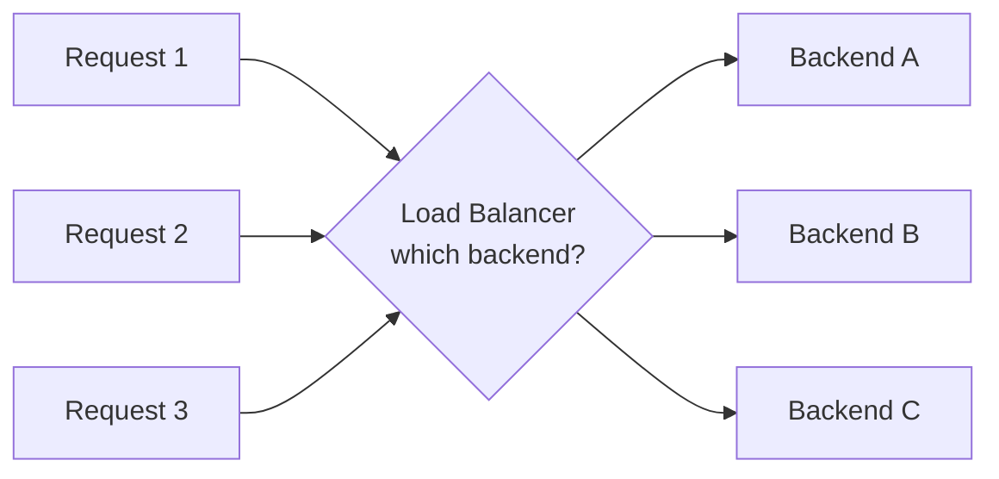
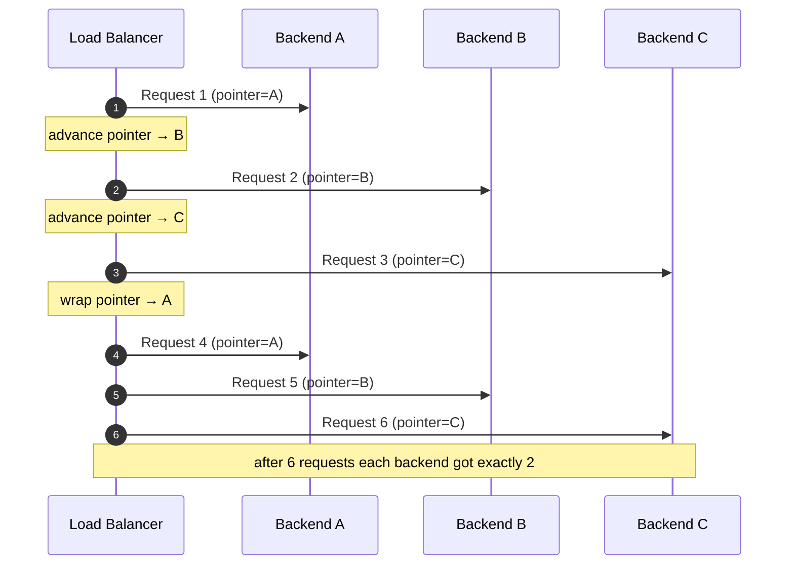
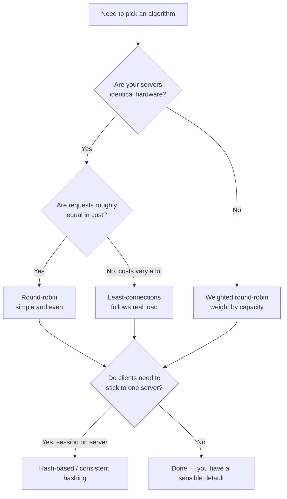

# Load Balancing Algorithms — Junior

<!-- level-focus -->
At junior level, focus on this question:

> How can I apply **Load Balancing Algorithms** in one small example and prove the result?

Use the smallest realistic scenario that exposes the decision and its failure behavior.
## 1. The one job: pick the next backend

Strip everything else away and a load balancer does one thing: it receives a request and forwards it to one backend server out of a pool. The **algorithm** is the rule it uses to choose.



The goal of a good rule is **balance**: keep every backend doing roughly the same amount of work, so no single server becomes the bottleneck. When work is spread evenly, the whole pool can handle more traffic and each request finishes faster.

The tension that makes this interesting: the smartest possible rule would perfectly measure each server's exact load and send every request to the least-loaded one. But measuring is not free — it costs time and coordination, and the load balancer must decide *right now*. So real algorithms trade **accuracy** (how well-balanced the result is) against **cost** (how much work the balancer does to decide). The three foundational algorithms below sit at different points on that trade-off.

---

## 2. Round-robin: take turns

**Round-robin is the "take turns" rule.** Line the backends up in a fixed order and hand each incoming request to the next one in line, wrapping back to the start after the last. Backend A, then B, then C, then A again, forever.

The load balancer keeps a single number — a pointer to whose turn it is — and increments it after each request. That's the entire algorithm. No measuring, no asking servers anything.

Here is the rotation across three backends over six requests, staged step by step:



**Concrete example.** You run three stateless API servers, each on identical hardware, each handling requests that take about the same time (say, a simple "look up a product by ID"). Round-robin sends request 1→A, 2→B, 3→C, 4→A… After 300 requests, each server has handled exactly 100. Perfectly even, and the balancer did almost nothing to achieve it.

**Why you'd pick it:** it is the simplest thing that works, it's predictable, and when your servers are equal and your requests are roughly equal in cost, it produces near-perfect balance for free. It is the sensible default.

---

## 3. Random: flip a coin

**Random is even simpler than taking turns.** For each request, pick a backend at random. No pointer to maintain, no order to keep. With three backends you effectively roll a three-sided die per request.

It sounds crude, but over many requests randomness *averages out*. Send a million requests to three backends at random and each ends up with very close to a third — the same even split round-robin gives you, arrived at differently.

**Concrete example.** You run the same three identical API servers, but now you have *many* load balancer instances running in parallel (common in the cloud — each region or each front-end node has its own balancer). If every one of them ran round-robin independently, their pointers could accidentally sync up and all send to Backend A at the same instant. Random has no shared pointer to get out of sync, so independent balancers naturally spread load without coordinating. That statelessness is exactly why random is attractive when you have many balancers.

**Why you'd pick it:** it needs zero shared state, so it scales trivially across many load balancer instances. The catch is that "even on average" is not "even right now" — in any short burst, random can send three requests in a row to the same server by pure chance. Over time it self-corrects; in the moment it can be lumpy.

---

## 4. Least-connections: ask who's busy

Round-robin and random ignore what the servers are actually doing. **Least-connections looks before it leaps:** it tracks how many requests are currently in flight on each backend and sends the new request to whichever server has the fewest open connections right now.

The intuition: an open connection is a rough proxy for "this server is busy." A server with 2 active requests is probably less loaded than one juggling 40, so give the newcomer to the quiet one.

**Concrete example — where this shines.** Imagine a service where some requests are cheap (return a cached value in 5 ms) and others are expensive (generate a PDF report in 8 seconds). With round-robin, a server might get unlucky and receive several PDF requests in a row; it now has three 8-second jobs queued while its neighbor breezes through cheap requests and sits mostly idle. Round-robin can't see this — it only counts turns, not load. Least-connections *can* see it: the server tied up with slow PDF jobs accumulates open connections, so the balancer stops sending it new work until it catches up. Load follows actual capacity, not just a rotation.

**Why you'd pick it:** when request durations vary a lot, or when servers aren't perfectly identical, least-connections adapts to reality instead of assuming everything is equal. The cost is that the balancer must track live connection counts per backend — more state and more work than a simple pointer or coin flip.

---

## 5. Why "just take turns" can go wrong

It helps to see round-robin *fail*, because that failure is the whole reason smarter algorithms exist.

Suppose three servers, round-robin, but requests have wildly different costs — most finish in 10 ms, but 1 in 6 is a heavy 3-second job. Round-robin doesn't know which is which; it just rotates. By bad luck, the heavy jobs can land disproportionately on one server:

```text
Request:   1     2     3     4     5     6     7     8     9
Cost:     10ms  3s   10ms  10ms  3s   10ms  10ms  3s   10ms
Goes to:   A     B     C     A     B     C     A     B     C
                 ^           heavy         heavy       heavy
Result:  Backend B is handed request 2, 5, 8 — all three heavy jobs.
         B is now saturated with 9 seconds of work.
         A and C are nearly idle.
```

Round-robin gave each server the same *number* of requests (three each) but wildly different *amounts of work*. That is the core weakness: **round-robin balances request count, not load.** When request count is a good proxy for load (identical, fast requests), round-robin is great. When it isn't, least-connections — which watches actual busyness — recovers the balance round-robin lost.

---

## 6. Weighted round-robin: not all servers are equal

So far we've assumed the backends are identical. Often they aren't: maybe you've got two large servers and one small one, or you're mid-upgrade and running mixed hardware. Sending everyone an equal share would overload the small server.

**Weighted round-robin fixes this by giving each server a weight** — a number saying "this server can take N times the share of a baseline server." A server with weight 3 gets three requests in the rotation for every one request the weight-1 server gets.

**Concrete example.** Backend A and B are beefy (weight 3 each); Backend C is a small legacy box (weight 1). Out of every 7 requests, A gets 3, B gets 3, C gets 1 — matching their relative capacity, so all three run at a similar *percentage* of their limit rather than the small one drowning. Weighted round-robin is still "take turns," just with some servers getting more turns than others. (The same weighting idea applies to random and least-connections too, but weighted round-robin is the one you'll meet first.)

---

## 7. The comparison table

| Algorithm | How it decides | What it balances | Cost to the balancer | Shines when… | Struggles when… |
|-----------|----------------|------------------|----------------------|--------------|-----------------|
| **Round-robin** | Rotate through a fixed order, one turn each | Request **count** | Almost none (just a pointer) | Servers identical, requests roughly equal cost | Request costs vary a lot → uneven load |
| **Random** | Pick a backend at random per request | Request count *on average* | Zero shared state | Many independent balancers; no coordination wanted | Short bursts can be lumpy; ignores server load |
| **Least-connections** | Send to the backend with fewest live connections | Actual **in-flight work** | Higher — must track live counts | Request durations vary; servers unequal | Adds state/complexity; connection count isn't perfect load |

Read this table as a progression, not a ranking. Each row buys more balance accuracy by paying more cost. As a junior, know all three and know *why* one is worth its extra cost over another.

---

## 8. A first look at the smarter algorithms

You'll hear three more names. You don't need to implement them yet — just recognize what problem each one attacks. They all refine the same core decision.

- **Power of two choices.** Least-connections' weakness is that checking *every* server's load is expensive at large scale, and a naive "always pick the globally least-loaded" can cause a herd — every balancer piling onto the same idle server at once. The trick: pick **two** backends at random, then send to whichever of those two has fewer connections. Checking two instead of all N is cheap, yet this small peek dramatically flattens the worst-case imbalance. It's the sweet spot between random (no info) and full least-connections (all the info).

- **Least-response-time.** Like least-connections, but instead of counting open connections it favors the server that has been *answering fastest* lately. Response time captures more than connection count — a server can hold few connections yet still be slow because its disk is thrashing. Picking by observed speed steers traffic toward servers that are genuinely healthy right now.

- **IP-hash / hash-based, and consistent hashing.** Sometimes you *want* the same client to keep hitting the same backend — for example, so a user's session data cached on that server stays useful. Hashing takes something stable about the request (like the client's IP address), runs it through a hash function, and maps it to a backend. The same IP always lands on the same server. The naive version breaks badly when you add or remove a server (nearly everyone gets reshuffled). **Consistent hashing** is the clever fix: when the pool changes, only a small fraction of clients move, not all of them. You'll study it properly later — for now, just file it under "hashing, but stable when the server set changes."

---

## 9. How to choose, as a junior

A simple decision path that will serve you well before you learn the nuances:



In practice, **round-robin is the default** most systems reach for first, and it's often the right call. Move to least-connections when you can *observe* uneven load despite even request counts. Reach for weighted variants when hardware differs. Use hashing only when you specifically need a client pinned to a server. Don't reach for the fanciest algorithm out of instinct — reach for the simplest one that keeps your servers balanced.

---

## 10. Common misconceptions

- **"Round-robin sends equal *load* to each server."** No — it sends an equal *number of requests*. Those are the same only when requests cost the same. When costs vary, equal counts produce unequal load (see §5).
- **"Random is worse because it's not orderly."** Over enough requests, random and round-robin distribute nearly identically. Random trades short-term evenness for needing zero shared state — a real advantage when many balancers run in parallel.
- **"Least-connections always beats round-robin."** It's better when load varies, but it costs more to run and its signal (connection count) is only a proxy. For a fleet of identical servers handling uniform requests, plain round-robin can be just as balanced and far simpler.
- **"The load balancer knows exactly how loaded each server is."** It doesn't. Algorithms use cheap *proxies* — a turn counter, a connection count, a recent response time. Part of the craft is knowing how good each proxy is for your traffic.
- **"Hashing is just for spreading load."** Its distinctive purpose is **stickiness** — pinning a client to a server — not evenness. If all you want is even spread, round-robin or random is simpler.

---

## 11. Key takeaways

- A load balancing algorithm answers one repeated question: **which backend gets the next request?** Everything else is detail on that choice.
- The universal trade-off is **balance accuracy vs. decision cost.** Cheaper rules assume things about your traffic; costlier rules measure reality.
- **Round-robin** takes turns — perfect when servers and requests are equal, and the sensible default.
- **Random** picks a backend by chance — evens out over time, needs no shared state, ideal across many independent balancers.
- **Least-connections** sends to the least-busy server — the right tool when request costs vary or servers aren't identical.
- **Weighted** variants let unequal servers pull their proportional share.
- Smarter algorithms — **power of two choices**, **least-response-time**, and **consistent hashing** — refine the same decision to scale better, track health, or pin clients to servers. You'll go deep on these next.

*Next step:* [Load Balancing Algorithms — Middle](middle.md)

---

## Apply it

1. Choose one small, known input for **Load Balancing Algorithms**.
2. Predict the output or observable behavior.
3. Run the smallest example or probe that exercises the concept.
4. Change one input to trigger a failure or boundary case.
5. Explain the evidence using the guide's vocabulary.

## Verify your work

- Record the exact input, command or code path, and output.
- Repeat the probe and confirm the result is consistent.
- Show one expected success and one expected failure.
- Resolve any difference between the prediction and the evidence.

## Review questions

- What problem does Load Balancing Algorithms solve in the example?
- Which input changes the observed result, and why?
- What is the smallest useful success check?
- Which beginner mistake would your evidence catch?
