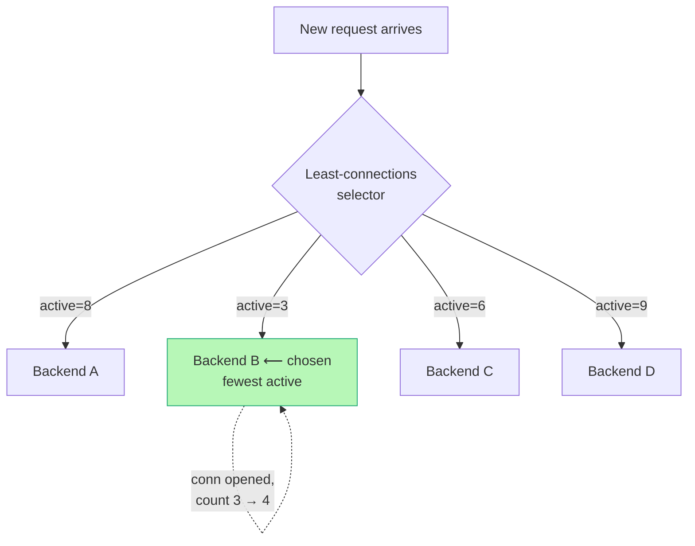

# Load Balancing Algorithms — Middle

<!-- level-focus -->
At middle level, focus on this question:

> Where does **Load Balancing Algorithms** belong in a maintainable component, and which trade-off selects the design?

Use the smallest realistic scenario that exposes the decision and its failure behavior.
## 1. The state each algorithm needs

The single most useful lens for choosing an algorithm is: *how much state does the balancer have to keep, and how fresh does it have to be?* This is what separates a cheap L4 balancer from an L7 one, a stateless DNS round-robin from a per-request least-response-time pool.

- **Stateless / near-stateless.** Round-robin needs only a rotating cursor. A hash algorithm needs nothing per-request — the destination is a pure function of the key. These scale trivially and survive balancer restarts without warm-up.
- **Connection-counting.** Least-connections must track, per backend, how many in-flight connections (or requests) it currently holds. That counter is local to one balancer instance and updated on every accept and every close.
- **Latency-tracking.** Least-response-time keeps a smoothed latency estimate per backend, updated on every completed request. It is the most "alive" of the algorithms and the most sensitive to noise, which is why it is almost always smoothed with an EWMA rather than a raw last-sample.

The subtlety that bites teams: **connection and latency counts are per-balancer, not global.** If you run four balancer instances, each least-connections pool sees only its own quarter of traffic. Four instances each independently sending their "least loaded" backend a burst can converge on the *same* backend and overload it — a herd effect. Weighting and randomization (§5) exist partly to blunt this.

## 2. Weighted round-robin for heterogeneous backends

Plain round-robin assumes every backend is identical. Real fleets are not: you retire hardware in waves, you run c5.2xlarge next to c5.4xlarge, a canary runs on one host, or a backend is CPU-bound while sharing a box. **Weighted round-robin (WRR)** assigns each backend an integer weight and distributes requests in proportion to weight.

A backend with `weight=4` receives four times the share of a `weight=1` backend. The naïve implementation — emit backend A four times, then B once, repeat — produces bursty, clumped traffic (`A A A A B A A A A B`). Production balancers use **smooth weighted round-robin** (the algorithm NGINX uses), which interleaves so the sequence for weights A=4, B=1 comes out `A A B A A A B ...`-style spread rather than clumped, keeping instantaneous load even.

Smooth WRR works with a per-backend `current_weight` that accumulates the `effective_weight` each round; the backend with the highest running `current_weight` is selected and then has the total weight subtracted from it:

```text
Backends: A(weight=5), B(weight=1), C(weight=1)   total = 7

round  current_weight (A,B,C) after +weight   pick   after -total
  1        (5, 1, 1)                            A     (-2, 1, 1)
  2        (3, 2, 2)                            A     (-4, 2, 2)
  3        (1, 3, 3)                            B     ( 1,-4, 3)
  4        (6,-3, 4)                            A     (-1,-3, 4)
  5        (4,-2, 5)                            C     ( 4,-2,-2)
  6        (9,-1,-1)                            A     ( 2,-1,-1)
  7        (7, 0, 0)                            A     ( 0, 0, 0)
```

Over 7 picks A is chosen 5 times, B once, C once — exactly the weight ratio — and the picks are interleaved, not clumped. **Set weights proportional to a real capacity signal**, typically vCPU count or a benchmark of requests-per-second the box sustains at target latency. Do not eyeball weights; a backend given twice its true share becomes the tail-latency source for the whole service.

WRR's limitation is that it is **open-loop**: it distributes by static ratio and ignores what is actually happening on each backend right now. A `weight=5` backend that has gone slow (GC pause, noisy neighbor) keeps receiving five times the traffic and piles requests onto the sickest host. That is precisely the gap least-connections closes.

## 3. Least-connections: the load-aware default

**Least-connections** sends each new request to the backend currently holding the fewest active connections. It is *closed-loop*: a backend that is slow accumulates in-flight connections (because its responses take longer to complete and free the connection), so its count rises and the balancer naturally steers traffic away. No configured weight required — the connection count is a live proxy for "how busy is this box."



This makes least-connections the right default whenever **request cost or duration varies** — mixed cheap and expensive endpoints, long-lived connections, uploads, or streaming. Under those conditions round-robin will happily send a new heavy request to a backend already grinding on three heavy ones, because round-robin cannot see occupancy; least-connections will route around it.

Two refinements matter in practice:

- **Weighted least-connections.** You can combine both ideas: the selector minimizes `active_connections / weight`, so a `weight=4` backend can hold four times the connections before it looks "busy." This is what you want for a heterogeneous fleet with variable request cost — capacity-aware *and* load-aware. NGINX exposes this as `least_conn` with `weight=` on each `server`.
- **Least-request at L7.** For HTTP/2 and gRPC, a single connection multiplexes many requests, so counting *connections* is meaningless — one connection can carry a thousand concurrent streams. L7 balancers count **active requests** instead. Envoy's `LEAST_REQUEST` policy does exactly this, and for weighted hosts it applies power-of-two-choices (see §5) rather than a full scan.

Least-connections' weakness is that connection count is a *lagging* and *coarse* signal. A backend can be at low connection count yet high latency (e.g., saturated on CPU while connections turn over quickly), and a request that just landed hasn't yet manifested as latency. When latency itself is the thing you want to optimize, you reach for a response-time-aware method.

## 4. Least-response-time and EWMA

**Least-response-time** (HAProxy's `leastconn` cousin; NGINX Plus's `least_time`; Envoy's `LEAST_REQUEST` tuned by RTT via outlier detection) selects the backend with the best *measured* latency, not just the fewest connections. The obvious naïve version — "route to whoever answered fastest last time" — is a disaster: a single fast sample makes a backend a magnet until it is overwhelmed, then a single slow sample banishes it, producing oscillation.

The fix is to smooth the estimate with an **exponentially weighted moving average (EWMA)**. Each completed request updates a per-backend estimate:

```text
ewma_new = α · sample + (1 − α) · ewma_old

  α ∈ (0,1)  is the smoothing factor:
    α close to 1  → reacts fast, noisy, follows spikes
    α close to 0  → stable, slow to notice a genuinely degraded backend

  Typical α ≈ 0.1–0.3, or time-decayed so recent samples weigh more
  and stale estimates decay toward neutral when a backend is idle.
```

The balancer then routes to the backend minimizing the EWMA (often `ewma × in_flight` or `ewma / weight` to fold in occupancy and capacity). The virtue over least-connections: it catches a backend that is *slow but not yet congested* — a host doing GC, hitting a cold cache, or on degraded hardware shows rising response time before its connection count spikes. The cost: it needs per-request latency measurement and per-backend state, which is why it lives in L7 balancers and service meshes, not in cheap L4 pools.

A well-known production instance is **Twitter Finagle / Envoy-style "P2C + EWMA"**: pick two backends at random, compare their EWMA-weighted load, send to the better one. This gets most of the benefit of least-response-time without scanning the whole fleet on every request.

## 5. Power of two choices

Scanning all N backends to find the global minimum is O(N) per request and, worse, causes the **herd effect**: multiple balancers (or multiple concurrent requests on one balancer) all independently identify the *same* least-loaded backend and stampede it, so it goes from least-loaded to overloaded in one burst.

**Power of two choices (P2C)** fixes both. Pick two backends uniformly at random; route to whichever of the two has the lower load. This is O(1), needs no global coordination, and — the elegant part — the *expected maximum load* across the fleet drops from `O(log N / log log N)` (pure random) to `O(log log N)`, an exponential improvement, for the cost of one extra sample. Because the two candidates are random, no two balancers reliably converge on the same victim, so the herd effect dissolves.

P2C is the modern default for load-aware balancing at scale: Envoy uses it for `LEAST_REQUEST` when there are more than a small number of hosts, and most service meshes (Linkerd, Istio via Envoy) lean on P2C + EWMA. When you see "least request" in a mesh config, it is almost always P2C under the hood, not a full-fleet scan.

## 6. IP-hash, consistent hashing, and session affinity

Sometimes you *want* the same client to keep hitting the same backend — the backend holds in-memory session state, a warm per-user cache, or a WebSocket/long-poll connection that must not migrate. This is **session affinity** (sticky sessions), and it is implemented by hashing a stable request key to a backend.

- **IP-hash** hashes the client source IP (NGINX `ip_hash`). Same client IP → same backend, as long as the backend set is unchanged. Cheap and stateless on the balancer. Its weaknesses are real: users behind a corporate NAT or mobile carrier CGNAT share one IP and all land on one backend (skew), and a client whose IP changes (mobile handoff) loses its affinity.
- **Cookie-based affinity** is the L7 answer: the balancer sets a cookie naming the chosen backend (HAProxy `cookie SRV insert`, NGINX `sticky cookie`), and routes by that cookie thereafter. This is per-*session* rather than per-IP, so NAT'd users spread correctly and affinity survives IP changes. It requires L7 (the balancer must parse HTTP).
- **Consistent hashing** is the key refinement for affinity under a changing backend set. Plain `hash(key) mod N` remaps *almost every* key when N changes — add or drop one backend and nearly all sessions relocate, dumping cold traffic on the fleet and blowing away per-backend caches. Consistent hashing (and its improvement, bounded-load consistent hashing) remaps only ~`K/N` keys when one backend joins or leaves. This is what NGINX's `hash ... consistent`, HAProxy's `balance uri`/`hash-type consistent`, and Envoy's `RING_HASH` / `MAGLEV` policies provide, and it is essential for cache-affinity fleets (e.g., hashing on a cache key so each object has a home shard).

The universal cost of affinity: **it fights load balancing.** By pinning traffic you forfeit the balancer's ability to spread it, so a hot user or a big NAT block becomes a hot backend. Use affinity only when the backend genuinely cannot be stateless; the better long-term move is usually to externalize session state (Redis, signed tokens) so *any* backend can serve *any* request and you can go back to a load-aware algorithm.

## 7. When round-robin fails

Round-robin is the intuitive default and the wrong one for several common workloads. Knowing the failure modes tells you exactly when to switch.

- **Long-lived connections.** Round-robin balances *connections at assignment time*, not ongoing load. With WebSockets, gRPC streams, SSE, or DB connection pools, connections are assigned once and then persist for minutes or hours. If backends are added later, round-robin has already handed the existing connections to the old backends and the new backend sits idle — the fleet is unbalanced for the entire connection lifetime. Least-connections (or least-request) fixes this because a fresh backend, with zero connections, immediately looks most attractive.
- **Uneven request cost.** If one endpoint costs 5 ms and another 2 s, round-robin's uniform rotation sends the same *count* to each backend but a wildly different *amount of work*. One backend can be saturated on expensive requests while the next is idle, yet round-robin keeps feeding both equally. Load-aware algorithms see the occupancy and route around the busy one.
- **Heterogeneous backends.** A mixed fleet under plain (unweighted) round-robin overloads the small boxes and underuses the big ones, because every box gets an equal share regardless of capacity. Weighted RR or weighted least-connections is required.
- **Slow/degraded backends.** A backend that is up (passing health checks) but slow keeps receiving its full round-robin share, turning it into the tail-latency source. Only a closed-loop algorithm (least-connections, least-response-time) or active outlier ejection steers away from it.

The unifying theme: round-robin is **open-loop and count-based**. It is excellent when requests are cheap, uniform, short-lived, and backends are identical — a classic stateless HTTP API in front of a homogeneous fleet. Outside that box, prefer a load-aware algorithm.

## 8. Choosing an algorithm: comparison

| Algorithm | Best for | Pitfalls | State needed |
|-----------|----------|----------|--------------|
| **Round-robin** | Uniform, cheap, short requests on identical backends | Ignores load & capacity; fails on uneven cost, long-lived conns, degraded hosts | Rotating cursor only |
| **Weighted round-robin** | Heterogeneous fleet, uniform request cost | Still open-loop — a slow high-weight host gets more, not less, traffic | Per-backend static weight + cursor |
| **Least-connections** | Variable request duration/cost; long-lived connections | Connection count lags CPU saturation; per-balancer counters can herd | Per-backend live active-connection count |
| **Weighted least-connections** | Heterogeneous fleet *and* variable request cost | Same lag; weights must reflect real capacity | Active count + weight per backend |
| **Least-request (L7)** | HTTP/2 / gRPC where one conn = many requests | Needs L7 termination; per-request accounting | Per-backend active-request count |
| **Least-response-time (EWMA)** | Latency-sensitive services; catch slow-but-not-congested hosts | Noisy without smoothing; needs α tuning; per-request latency measurement | Per-backend smoothed latency (EWMA) |
| **Power of two choices (+EWMA)** | Large fleets, service meshes; avoid herd + O(N) scan | Slightly worse than true minimum; needs a load signal per host | Load estimate per host (sampled 2) |
| **IP-hash** | Cheap L4 stickiness when session state is server-local | NAT/CGNAT skew; breaks on client IP change; fights balance | Hash function (stateless) |
| **Cookie affinity** | Per-session stickiness at L7 | Requires L7; pinned users can hot-spot a backend | Cookie ↔ backend mapping |
| **Consistent hashing** | Cache-affinity or affinity under changing backend set | Load skew for hot keys (use bounded-load variant) | Hash ring / lookup table |

## 9. Configuring weights and algorithms in a real LB

The concepts above map directly onto config. The three canonical balancers each express them slightly differently.

**NGINX** — algorithm is chosen by a directive inside the `upstream` block; the *default is round-robin* if you write nothing. Weights are per-`server`:

```nginx
upstream backend {
    least_conn;                      # load-aware; default would be round-robin
    server 10.0.0.1:8080 weight=4;   # big box: 4× share
    server 10.0.0.2:8080 weight=1;
    server 10.0.0.3:8080 weight=1 backup;   # only used if others are down
}

# affinity variants (mutually exclusive with least_conn):
upstream sticky_pool {
    ip_hash;                         # source-IP affinity, L4-ish, stateless
    server 10.0.0.1:8080;
    server 10.0.0.2:8080;
}

upstream cache_pool {
    hash $request_uri consistent;    # consistent hashing on the URI
    server 10.0.0.1:8080;
    server 10.0.0.2:8080;
}
```

**HAProxy** — algorithm is the `balance` directive; default is `roundrobin`. Weights are per-`server`; `leastconn` is the load-aware option, and stickiness is via `cookie`:

```haproxy
backend app
    balance leastconn                # or 'roundrobin', 'source' (IP-hash), 'uri'
    cookie SRV insert indirect nocache
    server s1 10.0.0.1:8080 weight 40 check cookie s1
    server s2 10.0.0.2:8080 weight 10 check cookie s2

backend cache
    balance uri
    hash-type consistent             # consistent hashing, not modulo
    server c1 10.0.0.1:8080 check
    server c2 10.0.0.2:8080 check
```

**Envoy** — the policy is a field on the cluster (`lb_policy`); weights are per-endpoint `load_balancing_weight`. `LEAST_REQUEST` is P2C-based, `RING_HASH`/`MAGLEV` give consistent hashing:

```yaml
clusters:
- name: app
  lb_policy: LEAST_REQUEST          # P2C on active requests; ROUND_ROBIN is default
  load_assignment:
    cluster_name: app
    endpoints:
    - lb_endpoints:
      - endpoint: { address: { socket_address: { address: 10.0.0.1, port_value: 8080 }}}
        load_balancing_weight: 4
      - endpoint: { address: { socket_address: { address: 10.0.0.2, port_value: 8080 }}}
        load_balancing_weight: 1
```

Three cross-cutting rules when you write this config: (1) weights are *relative* integers — `4:1` and `40:10` are identical; use larger numbers when you want room to fine-tune. (2) Weighted round-robin and weighted least-connections both honor weight, but only least-connections also reacts to live load — pick weighted *least-connections* if request cost varies. (3) Affinity directives (`ip_hash`, `hash ... consistent`, `balance source`) generally *replace* the load-aware selector; you cannot have both full stickiness and full load-awareness — that is the trade in §6.

## 10. Interaction with health checks and slow start

Algorithms do not run in a vacuum; they operate over the *set of currently healthy backends*, and how a backend enters and leaves that set changes the effective distribution.

- **Health checks gate the pool.** A backend failing active health checks is removed from rotation, so a `weight=4` failed backend contributes nothing and its share is redistributed. Passive health checks / **outlier detection** (Envoy) eject a backend that returns errors or times out even while passing active checks — this is the mechanism that finally steers round-robin away from a degraded host it would otherwise keep feeding.
- **Slow start prevents cold-start overload.** When a backend (re)joins — freshly deployed, cold cache, cold JIT — least-connections sees it at zero connections and, absent mitigation, floods it with the *entire* new-request stream at once, spiking its latency and possibly tripping it back out. **Slow start** ramps a rejoining backend's effective weight from near-zero up to full over a configured window (NGINX Plus `slow_start=30s`, Envoy `slow_start_config`, HAProxy `slowstart`). This is essential for any load-aware algorithm plus any fleet where backends restart frequently (rolling deploys, autoscaling).
- **Draining is the mirror image.** On graceful shutdown a backend is marked draining: it takes no new connections but existing ones finish. Long-lived-connection fleets need a generous drain timeout or you sever active WebSocket/stream sessions on every deploy.

The takeaway: choosing `least_conn` is only half the decision. Pair it with active + passive health checks and slow start, or a load-aware algorithm will reliably hammer any backend at the moment it is least able to cope — right after it comes up.

## 11. Practitioner heuristics

- **Default to round-robin only for stateless, uniform, short requests on identical backends.** The moment any of those four assumptions breaks, move to a load-aware algorithm.
- **Use weighted least-connections for heterogeneous fleets with variable request cost** — it is both capacity-aware (weights) and load-aware (live counts), covering the two most common real-world deviations at once.
- **Set weights from a real capacity signal** (vCPU count or a sustained-RPS benchmark), never by intuition; a mis-set weight makes one backend the tail-latency source for the whole service.
- **For HTTP/2 / gRPC, count requests, not connections** — one multiplexed connection carries many streams, so connection-based least-connections is blind. Use `LEAST_REQUEST`.
- **Prefer P2C + EWMA at scale** — it avoids both the O(N) scan and the herd effect, which is why service meshes standardized on it.
- **Treat affinity as a last resort.** If you need stickiness, ask first whether session state can be externalized (Redis, signed tokens) so any backend serves any request; if you must pin, use consistent hashing so the pool can change without a full remap.
- **Never ship a load-aware algorithm without slow start and outlier detection** — otherwise the balancer floods cold or degraded backends exactly when they are weakest.
- **Remember counters are per-balancer.** With multiple balancer instances, "least loaded" is a local view; expect some herd behavior and rely on P2C/randomization to blunt it.

*Next step:* [Load Balancing Algorithms — Senior](senior.md)

---

## Apply it

1. Find a real component where **Load Balancing Algorithms** affects an interface or dependency.
2. Write two plausible choices and the constraint that favors each one.
3. Make the smallest reversible change at that boundary.
4. Exercise the component alone, then exercise the integrated flow.
5. Keep the decision note with the evidence that selected the option.

## Verify your work

- A focused check proves the local behavior.
- An integrated check proves callers and dependencies still agree.
- Logs, traces, compiler output, or benchmarks expose the boundary.
- Reverting the change restores the previous behavior without unrelated edits.

## Review questions

- Which boundary is most affected by Load Balancing Algorithms?
- What constraint would make you choose the alternative design?
- How would you isolate a local defect from an integration defect?
- What evidence shows that the change remains maintainable?
