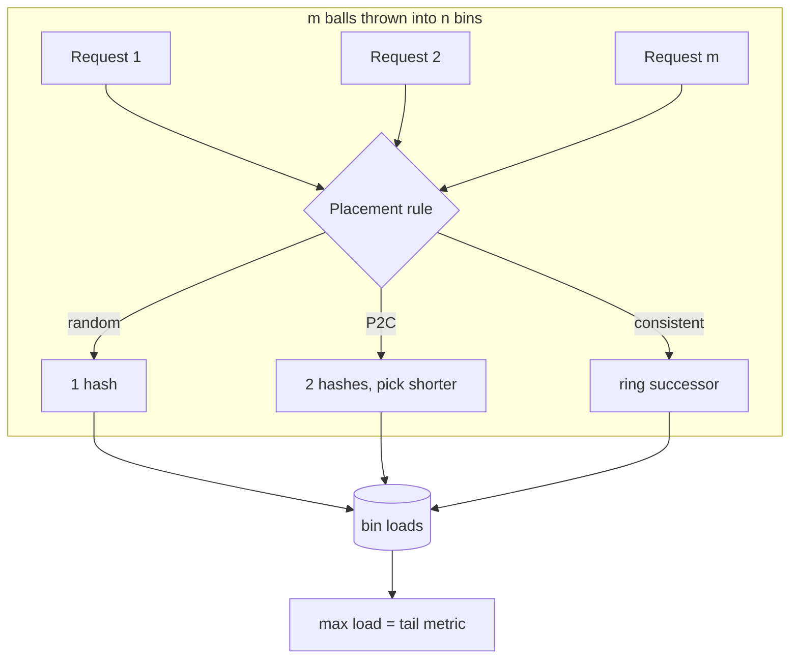
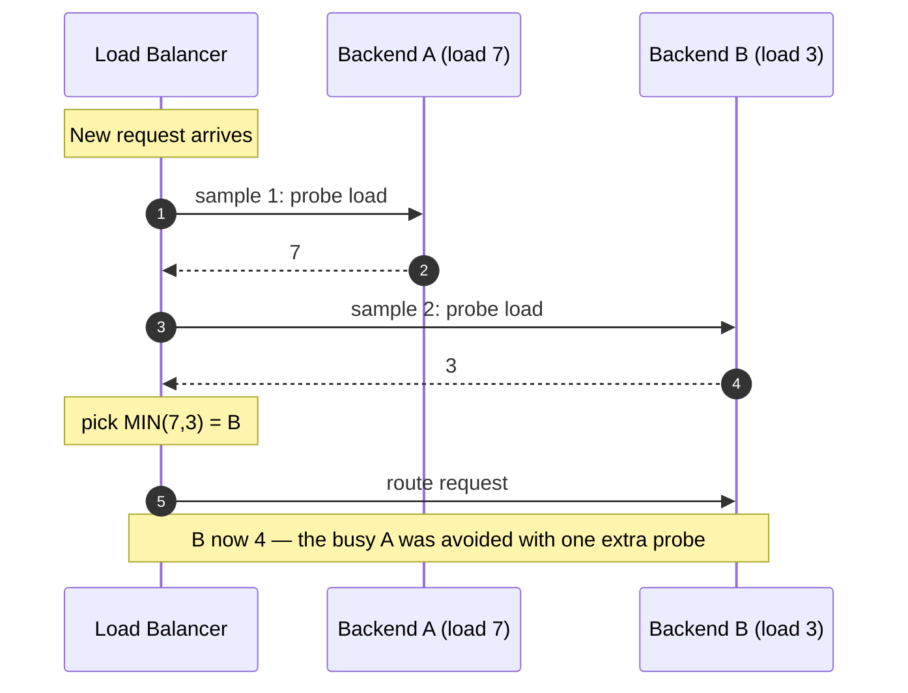
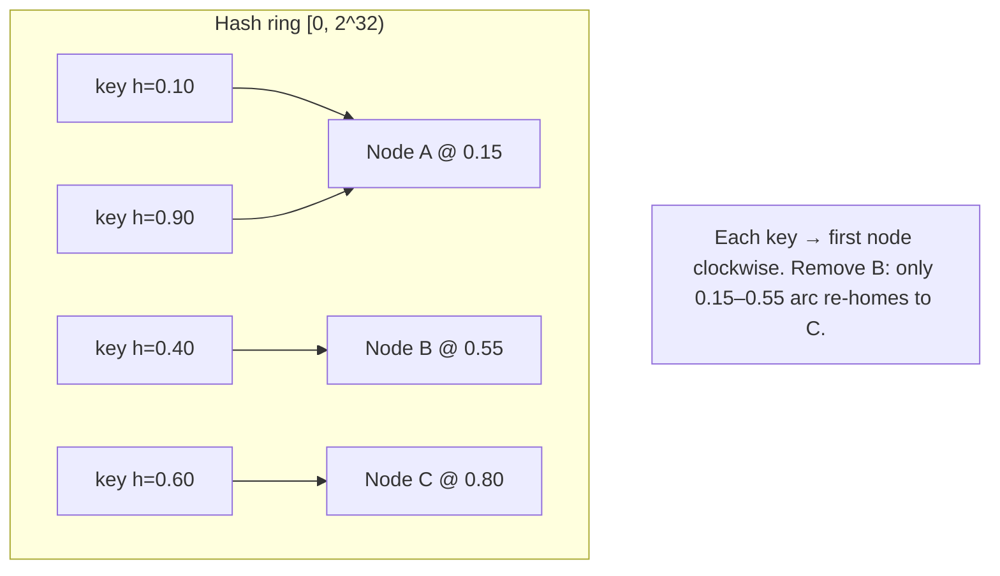

# Load Balancing Algorithms — Professional

<!-- level-focus -->
At professional level, focus on this question:

> How should teams adopt and operate **Load Balancing Algorithms** with measurable outcomes and limited coordination?

Use the smallest realistic scenario that exposes the decision and its failure behavior.
## 1. The Balls-into-Bins Model

Every stateless load-balancing algorithm is an instance of the classical **balls-into-bins**
problem: throw `m` balls (requests) into `n` bins (backends) and ask about the **maximum
load** — the fullness of the most loaded bin. Max load, not average, is what matters:
the P99 tail, the first backend to saturate, the hot shard that pages you at 3 a.m. Average
load is trivially `m/n`; the whole game is bounding the *gap above average*.

We study two regimes:

- **Heavily loaded:** `m ≫ n` (many requests per backend). Here the interesting quantity
  is the **gap** `max_load − m/n`.
- **Lightly loaded:** `m = n` (one ball per bin on average). This is the cleanest regime
  for comparing strategies and where the famous bounds are stated.



**See it animated:** [Consistent hashing](https://www.toptal.com/big-data/consistent-hashing)

The key results below are all statements about the distribution of that `max load` random
variable under different placement rules.

---

## 2. Random: Max Load ~ ln n / ln ln n

Throw `n` balls uniformly at random into `n` bins. The load of a fixed bin is
`Binomial(n, 1/n) ≈ Poisson(1)`. The probability a fixed bin gets exactly `k` balls is
`≈ e^{-1} / k!`. By a union bound over `n` bins, the max load `M` satisfies:

```text
Classic result (Gonnet 1981; see Motwani–Raghavan, "Randomized Algorithms"):
  With high probability,
      M  =  (1 + o(1)) · ln n / ln ln n

Derivation sketch (why ln n / ln ln n):
  Pr[a fixed bin ≥ k]  ≲  1/k!         (Poisson tail, dominant term)
  Expected # bins with ≥ k balls  ≈  n / k!
  Set n / k! ≈ 1  ⇒  k! ≈ n  ⇒  ln(k!) ≈ ln n
  Stirling: ln(k!) ≈ k ln k
  ⇒  k ln k ≈ ln n  ⇒  k ≈ ln n / ln ln n.  ∎
```

This grows — slowly, but without bound — as `n` increases. A random balancer's worst bin
is a factor `~ln n / ln ln n` above average even under a perfectly uniform hash.

```text
Worked numbers (n balls into n bins, random):
  n = 10^3   :  M ≈ ln(1000)/ln ln(1000) = 6.91 / 1.93  ≈ 3.6   → ~4 balls
  n = 10^6   :  M ≈ ln(10^6)/ln ln(10^6) = 13.8 / 2.62  ≈ 5.3   → ~5 balls
  n = 10^9   :  M ≈ ln(10^9)/ln ln(10^9) = 20.7 / 3.03  ≈ 6.8   → ~7 balls
```

In the **heavily loaded** regime (`m ≫ n`), random's gap above average is
`Θ(√((m/n) · ln n))` — the max bin overshoots the mean by roughly the square root of the
mean times `ln n`. Both facts say the same thing: random alone leaves a stubborn,
growing tail.

---

## 3. Power-of-Two-Choices: The Exponential Improvement

**The trick (Azar, Broder, Karlin, Upfal 1994; Mitzenmacher 1996):** for each ball, sample
`d ≥ 2` bins independently at random and place the ball in the **least loaded** of them.
This is *power-of-d-choices*; `d = 2` is *power-of-two-choices* (P2C), often called "the
power of two random choices."

The effect is not incremental — it is a doubly-logarithmic collapse of the max load:

```text
Power-of-d-choices, n balls into n bins (Azar–Broder–Karlin–Upfal):
      M  =  ln ln n / ln d  +  Θ(1)        w.h.p.

For d = 2:
      M  =  ln ln n / ln 2  +  Θ(1)

Contrast with random (d = 1):
      random :  M ~ ln n / ln ln n         (grows without bound, "fast")
      P2C    :  M ~ ln ln n / ln 2         (grows without bound, "glacially")

The improvement from d=1 to d=2 is EXPONENTIAL; going d=2 → d=3 only shaves a
constant factor (ln d in the denominator). Hence: the first extra choice is
worth an exponential amount; further choices are worth little.
```

```text
Worked numbers (n balls into n bins):
                 random             P2C (d=2)
  n = 10^3  :   ln n / ln ln n     ln ln n / ln 2
              = 6.91 / 1.93 ≈ 3.6  = ln(6.91)/0.693 = 1.93/0.693 ≈ 2.8  → ~3
  n = 10^6  :   13.8 / 2.62  ≈ 5.3  = ln(13.8)/0.693 = 2.62/0.693 ≈ 3.8  → ~4
  n = 10^9  :   20.7 / 3.03  ≈ 6.8  = ln(20.7)/0.693 = 3.03/0.693 ≈ 4.4  → ~5

The gap is modest at these n, but P2C's curve is ln ln n — essentially flat.
Push to n = 10^18 and random climbs while P2C barely moves:
  random :  ln(10^18)/ln ln(10^18) = 41.4 / 3.72 ≈ 11.1
  P2C    :  ln ln(10^18)/ln 2      = ln(41.4)/0.693 = 3.72/0.693 ≈ 5.4
```

In the **heavily loaded** regime the contrast is even starker: P2C's gap above average is
`ln ln n / ln 2 + Θ(1)` — **independent of `m`**. Random's gap is `Θ(√((m/n) ln n))`, which
grows with `m`. So under heavy load, P2C's worst backend stays a *constant* above average
while random's tail widens indefinitely.



**Practical caveat — stale load ("herd behavior"):** the proof assumes each ball sees
current loads. In a real distributed LB, load readings are stale (gossiped/sampled), so many
balancers may see the same idle backend and all pile onto it. The fix used in practice
(NGINX, Envoy, HAProxy `random(2)`, Google's work) is exactly P2C over *locally* cached
counters — pick two, route to the shorter — which keeps the doubly-log guarantee robust to
mild staleness far better than a global "route to the single least loaded" rule does.

---

## 4. Consistent Hashing: The K/n Movement Result

Random and P2C are **stateless** — they don't need a request to return to the *same*
backend. When you *do* (cache affinity, sticky sessions, sharded stores), you need a hash
that is stable under membership change. Naïve `hash(key) mod n` fails: change `n` and almost
every key remaps.

**Consistent hashing (Karger et al., STOC 1997)** places both keys and nodes on a ring
`[0, 2^b)`. A key is owned by the first node clockwise from `hash(key)` (its *successor*).

```text
Movement guarantee — the headline result:
  Adding or removing ONE node remaps only the keys in that node's arc.
  In expectation that is  K / n  keys, where
      K = number of keys,  n = number of nodes.

  Compare with hash-mod-n:
      mod-n on going n → n+1 remaps  ≈ K · (n / (n+1))  ≈ K keys  (nearly ALL).
      consistent hashing remaps      ≈ K / n keys.

Worked number:
  K = 1,000,000 cache keys, n = 100 nodes.
    Add the 101st node:
      consistent hashing moves ≈ K/(n+1) = 1,000,000 / 101 ≈ 9,901 keys  (~1%).
      hash-mod-n moves          ≈ 1,000,000 · (1 − 1/101) ≈ 990,099 keys (~99%).
    Remove one node (100 → 99):
      consistent hashing moves ≈ K/n = 1,000,000 / 100 = 10,000 keys  (~1%).
```

That `K/n` versus `~K` gap is the entire reason consistent hashing exists: a node flap costs
you a 1% cache-miss storm, not a 99% one.



**Failure of naive placement — load skew:** with one point per node, the ring arcs are
`n` uniform gaps, and the *largest* arc is `Θ(log n / n)` of the ring — so the busiest node
can own `Θ(log n)` times the average. That is unacceptable, which motivates virtual nodes.

---

## 5. Virtual Nodes and Load Variance

Give each physical node `v` **virtual nodes** — hash it `v` times onto the ring under
distinct labels (`hash(node#i)`). A node now owns the union of `v` small arcs. This does two
things at once:

1. **Cuts load variance.** The total arc a node owns is a sum of `v` independent-ish pieces.
   By concentration, the coefficient of variation of per-node load scales like `1/√v`:

```text
Load variance with v virtual nodes per physical node:
      CV(load)  ≈  1 / √v          (standard deviation / mean)

  v = 1    : CV ≈ 100%   — wildly uneven, one node can own log n × average.
  v = 100  : CV ≈ 10%    — ±10% spread; the Dynamo-era default region.
  v = 1000 : CV ≈ 3.2%   — near-uniform; Cassandra's num_tokens=256 lives near here.

To hold peak load within (1 + ε) of average with high probability, choose
      v  =  Θ( (1/ε²) · log n ).
  ε = 0.1, n = 1000 : v on the order of a few hundred per node.
```

2. **Enables weighting.** Give a 2× machine 2× the virtual nodes → it draws 2× the keys.
   Heterogeneous fleets balance by simply scaling `v`.

**The cost of virtual nodes:** ring metadata is `O(n · v)` points, and a lookup is a binary
search over `n · v` entries — `O(log(n·v))`. With `n = 1000, v = 200` that is 200k ring
points and a ~18-comparison lookup per request. Memory and the "adding a node touches many
tiny arcs" bookkeeping are the price you pay for the `1/√v` smoothing. This `O(n·v)` blow-up
plus the `1/√v` (not exponential) convergence is precisely what Maglev was designed to beat.

---

## 6. Maglev Hashing: Even Spread + Minimal Disruption

Google's **Maglev** (Eisenbud et al., NSDI 2016) is a consistent hash that abandons the ring
for a **fixed-size lookup table** of `M` entries (`M` prime, `M ≫ n`, e.g. `M = 65537`).
It targets two properties consistent-hashing-with-vnodes only approximates well:

- **Even spread:** each backend owns almost exactly `M/n` table slots (spread → 1).
- **Minimal disruption:** removing one backend rewrites only `≈ M/n` slots (`~1/n` of the
  table), like consistent hashing — but with *tighter* balance and *no* per-node metadata
  blow-up.

**Table build.** Each backend `i` gets a **permutation** of `[0, M)` from two hashes:

```text
For backend i:
    offset[i] = h1(name_i) mod M
    skip[i]   = h2(name_i) mod (M − 1) + 1        # 1..M−1, coprime with prime M
    permutation[i][j] = (offset[i] + j · skip[i]) mod M    # a full cycle over [0,M)

Populate: round-robin over backends; each backend proposes its next-preferred
still-empty slot from its permutation, until all M slots are filled.
```

```mermaid
sequenceDiagram
    autonumber
    participant Ctrl as Table Builder
    participant P as Permutations
    participant T as Lookup Table (M slots)
    Ctrl->>P: compute offset, skip → per-backend preference order
    loop until all M slots filled
        Ctrl->>P: backend b0 proposes next preferred empty slot
        P-->>T: claim slot for b0
        Ctrl->>P: backend b1 proposes next preferred empty slot
        P-->>T: claim slot for b1
        Note over T: round-robin continues; ties broken by permutation order
    end
    Note over T: result — each backend owns ~M/n slots (even), lookup = table[h(key) mod M]
```

**Lookup is O(1):** `backend = table[ hash(5-tuple) mod M ]`. No binary search, no ring walk —
one array index per packet, which is why Maglev runs in a software LB at line rate.

```text
Disruption on a backend change (M = 65537, n = 100):
  Each backend owns ≈ M/n = 655 slots.
  Remove one backend: its 655 slots are re-filled by re-running the fill;
    ONLY those ~655 slots (≈ 1/n = 1% of the table) change owner.
  Maglev's paper reports disruption within a small constant of the K/n optimum,
  while spread stays ≈ 1.00 (Maglev) vs the wider tail of ring hashing.

Trade-off vs consistent hashing:
  + Perfectly even spread and O(1) lookup with a single flat array (no n·v metadata).
  − Disruption is "minimal" but not the strict K/n minimum: a membership change can
    shuffle a few extra slots because filling is global, not purely local to an arc.
    Larger M shrinks this residual (finer granularity) at the cost of table memory.
```

Rule of thumb from the paper: pick `M ≈ 100 × n` (and prime) so each backend owns ~100 slots,
giving spread very close to 1 and disruption close to `1/n`.

---

## 7. EWMA for Least-Response-Time

"Least-response-time" (a.k.a. *peak-EWMA* in Envoy/Finagle) routes to the backend with the
lowest *estimated* latency. Raw per-request latency is far too noisy to compare directly, so
you smooth it with an **exponentially weighted moving average**:

```text
EWMA update on each observed sample x_t:
      S_t  =  α · x_t  +  (1 − α) · S_{t−1}          0 < α ≤ 1

  α (the smoothing factor) sets memory:
      large α (→1) : reacts fast, noisy      (short memory)
      small α (→0) : smooth, laggy           (long memory)

  Effective window ≈ 1/α samples.
  Time-decay form (handles irregular arrivals):  α = 1 − e^{−Δt / τ},
      where Δt = time since last sample, τ = decay time constant.
```

```text
Worked EWMA (α = 0.2, i.e. ~5-sample memory), latency samples in ms:
  start S = 50
  x=48 : S = 0.2·48 + 0.8·50 = 49.6
  x=52 : S = 0.2·52 + 0.8·49.6 = 50.08
  x=120: S = 0.2·120 + 0.8·50.08 = 64.06   ← one spike nudges but does not dominate
  x=51 : S = 0.2·51 + 0.8·64.06 = 61.45
  x=49 : S = 0.2·49 + 0.8·61.45 = 58.96     ← estimate decays back toward baseline
```

Two refinements that make it usable as a routing signal:

- **Peak-EWMA / inflight penalty:** score `= EWMA_latency × (inflight + 1)`. Multiplying by
  outstanding requests makes a backend look worse *the moment* you send it work — this closes
  the stale-load / herd loophole from §3 without a fresh probe, because your own in-flight
  count updates instantly.
- **Combine with P2C:** production balancers (Envoy `LEAST_REQUEST`, Finagle P2C-EWMA) do
  **not** scan all `n` backends for the global minimum — that both is `O(n)` and re-creates
  herding. They sample **two** and pick the lower EWMA score. This fuses §3's doubly-log max-load
  guarantee with §7's latency-awareness: two choices, scored by smoothed response time.

---

## 8. Comparison Table

| Algorithm | Max load (n balls→n bins) | Disruption on Δnode | State / lookup cost | Latency-aware? | Best for |
|-----------|---------------------------|---------------------|---------------------|----------------|----------|
| **Random / round-robin** | `~ ln n / ln ln n` (grows) | N/A (stateless) | none, `O(1)` | no | uniform, stateless backends |
| **Power-of-two-choices** | `~ ln ln n / ln 2` (~flat) | N/A (stateless) | 2 load reads, `O(1)` | via load counters | general default; robust to skew |
| **Consistent hashing (+vnodes)** | CV `≈ 1/√v` per node | `≈ K/n` keys | `O(n·v)` ring, `O(log n·v)` lookup | no | affinity/sharding, caches |
| **Maglev** | spread `≈ 1.00` (near-even) | `≈ 1/n` slots (small const over K/n) | `O(M)` table, `O(1)` lookup | no | line-rate L4 LB, connection affinity |
| **Least-response-time (EWMA)** | depends on scoring; with P2C `~ ln ln n` | N/A | EWMA per backend, `O(1)` w/ P2C | **yes** | heterogeneous/variable backends |

Reading the table: P2C is the pragmatic **stateless** default (exponentially better tail than
random, no per-key state). Consistent hashing / Maglev are the **stateful-affinity** choices
(Maglev when you also need `O(1)` line-rate lookup and near-perfect spread). EWMA layers a
*latency* signal on top and is almost always deployed *as P2C over EWMA scores*, not as a
global scan.

---

## 9. Worked End-to-End Example

**Scenario.** An L7 LB fronts `n = 100` app servers, serving `m = 10,000` concurrent requests,
plus a session-affinity cache keyed by user with `K = 1,000,000` entries.

```text
(a) If we route stateless requests at RANDOM (heavily loaded, m/n = 100 avg):
      gap ≈ √((m/n)·ln n) = √(100 · ln 100) = √(100 · 4.6) = √460 ≈ 21
      → busiest server ≈ 100 + 21 = 121 in-flight  (21% over average)

(b) Same load under POWER-OF-TWO-CHOICES:
      gap ≈ ln ln n / ln 2 = ln(ln 100)/0.693 = ln(4.6)/0.693 = 1.53/0.693 ≈ 2.2
      → busiest server ≈ 100 + 2 ≈ 102 in-flight  (~2% over average)
      One extra probe per request turned a 21% tail into a 2% tail.

(c) Session cache under CONSISTENT HASHING, one server dies (100 → 99):
      keys re-homed ≈ K/n = 1,000,000 / 100 = 10,000  (1% miss storm)
      Under hash-mod-n it would have been ≈ 990,000 keys (99%) — a full cold cache.

(d) Same cache under MAGLEV, M = 65537 (≈ 655×n... use M ≈ 100·n = 10007 prime):
      each backend owns ≈ M/n = 10007/100 ≈ 100 slots.
      Losing one backend rewrites ≈ 100 slots (~1% of table) → ~1% of flows re-homed,
      with spread staying ≈ 1.00 across the surviving 99 backends.

(e) Choosing between two candidate servers by EWMA (α = 0.3):
      Server X EWMA = 40 ms, inflight 2 → score 40·3 = 120
      Server Y EWMA = 55 ms, inflight 0 → score 55·1 = 55
      → route to Y: its lower inflight penalty beats X's better raw latency.
```

**Design takeaway.** Use **P2C** for the stateless request tier (line (b)), and **Maglev or
consistent-hashing-with-vnodes** for the affinity/cache tier (lines (c)–(d)); score P2C's two
candidates by **EWMA×inflight** when backends are heterogeneous (line (e)). Each layer is the
right tool for a different axis: tail control, stability under churn, and latency-awareness.

---

## 10. Common Misconceptions

```text
MYTH: "Round-robin is perfectly even, so it has no tail."
  Round-robin equalizes ARRIVALS, not COMPLETIONS. With variable request cost
  or heterogeneous backends, a slow server keeps getting its 1/n share and its
  queue grows unboundedly. Random/round-robin's uniformity is on the wrong axis.

MYTH: "Power-of-three-choices is 50% better than power-of-two."
  M ~ ln ln n / ln d. Going d=1→2 is EXPONENTIAL (ln n → ln ln n). Going d=2→3
  only changes the denominator ln 2 → ln 3, a ~1.58× constant. Diminishing returns
  are immediate after the first extra choice; d=2 is the sweet spot.

MYTH: "Consistent hashing gives even load out of the box."
  With 1 point/node, largest arc ≈ Θ(log n / n) → busiest node ≈ log n × average.
  You NEED virtual nodes (v ~ hundreds) to get CV ≈ 1/√v down to a few percent.

MYTH: "Maglev is just consistent hashing with a table."
  Maglev optimizes SPREAD (near-perfect even fill) as a first-class goal and gives
  O(1) lookup; classic ring hashing optimizes only disruption and has O(log n·v)
  lookup with skew that needs vnodes to fix. Maglev accepts slightly-above-optimal
  disruption to buy perfect spread + O(1) datapath.

MYTH: "Least-response-time means scan all backends for the minimum."
  A global O(n) scan re-introduces herd behavior on stale readings and costs O(n).
  Do P2C over EWMA scores: sample two, pick the lower — doubly-log tail AND
  latency-awareness, at O(1).
```

**Primary sources.** Azar, Broder, Karlin, Upfal, *Balanced Allocations* (STOC 1994) and
Mitzenmacher, *The Power of Two Choices in Randomized Load Balancing* (PhD thesis / IEEE TPDS
2001); Karger, Lehman, Leighton, Panigrahy, Levine, Lewin, *Consistent Hashing and Random
Trees* (STOC 1997); Eisenbud et al., *Maglev: A Fast and Reliable Software Network Load
Balancer* (NSDI 2016); Motwani & Raghavan, *Randomized Algorithms* (max-load / balls-in-bins).


---

## Apply it

1. Define the user or business outcome that **Load Balancing Algorithms** should improve.
2. Assign one owner for code, contracts, operations, and incidents.
3. Split delivery into reversible increments that produce evidence early.
4. Publish responsibilities, escalation paths, and compatibility windows.
5. Stop or expand only when the agreed measures support that decision.

## Verify your work

- Each increment has an owner, rollback path, and observable exit condition.
- Adoption, reliability, delivery time, and coordination cost are measured.
- Incident and migration exercises prove that responsibility is executable.
- The old path is removed only after telemetry proves it is unused.

## Review questions

- Which measurable outcome justifies investing in Load Balancing Algorithms?
- Which team owns the full lifecycle and incident response?
- What reversible increment produces the earliest useful evidence?
- Which exit condition proves that migration or adoption is complete?
