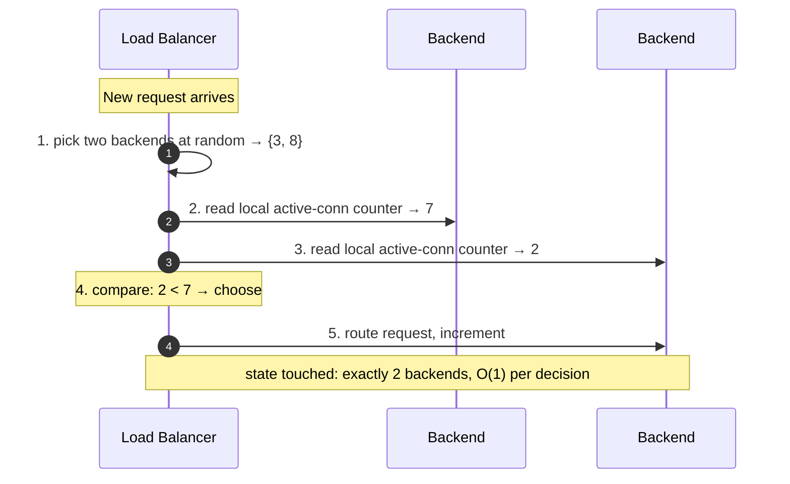
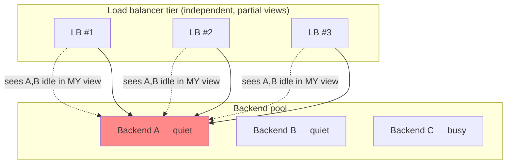
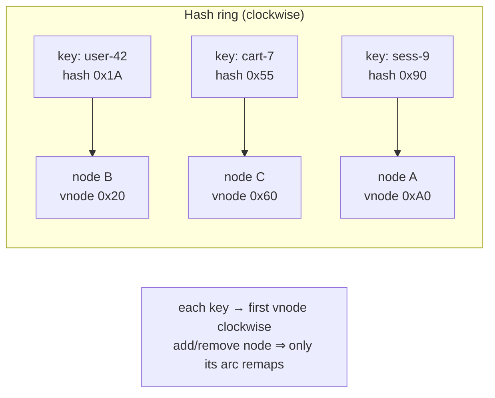
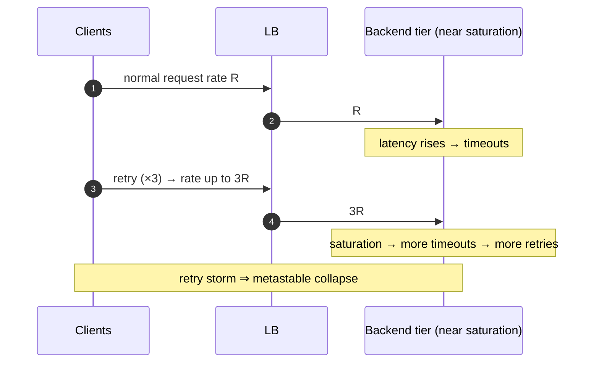

# Load Balancing Algorithms — Senior

<!-- level-focus -->
At senior level, focus on this question:

> Which system invariant is affected by **Load Balancing Algorithms** under failure, load, and change?

Use the smallest realistic scenario that exposes the decision and its failure behavior.
## 1. Why Global Load State Doesn't Scale

Least-connections and least-response-time are the "obvious" upgrades over round-robin: track each backend's outstanding work and send the next request to the emptiest one. On a *single* balancer with an accurate, real-time view, this is near-optimal — it is essentially the Join-Shortest-Queue (JSQ) discipline, and JSQ is known to minimize expected latency for identical servers.

The trouble is the phrase "accurate, real-time view." Maintaining a genuinely correct picture of every backend's queue depth requires that the balancer's counters reflect reality at the instant of each routing decision. Three things break that:

- **Staleness.** Load reported by health checks or gossip is seconds old. A backend that was idle 2 s ago may now be saturated. Decisions made on stale minima are systematically wrong in the worst possible way — they steer traffic toward whatever *looked* idle.
- **Concurrency.** Multiple requests routed in the same millisecond all see the same "least loaded" backend and pile onto it before any of them updates the counter. This is a herd on a per-balancer basis even before you add more balancers.
- **Multiplicity.** With N independent balancers, "least loaded" is computed N times against N partial views. They do not coordinate, so they all converge on the same victim (§3).

The senior insight: **exact global load state is expensive to maintain and stops being exact the moment you use it.** The frontier algorithms — P2C above all — deliberately give up on global state and instead make a *randomized local* decision that is provably almost as good. Cheaper *and* more robust: that is why the literature moved this way.

## 2. Power of Two Choices: Near-Optimal with O(1) State

**Power of two choices (P2C)**, also called "the two-random-choices paradigm," is the pivotal result. Instead of tracking all N backends or picking one at random, the balancer picks **two backends uniformly at random** and routes to the **less loaded of the two** (fewer active connections / shorter queue). That is the entire algorithm.



The mathematical result (Azar, Broder, Karlin, Upfal 1994; Mitzenmacher's thesis 1996) is startling. If you throw `m` balls into `n` bins:

- **Random placement (one choice):** the most-loaded bin has roughly `Θ(log n / log log n)` balls above average — the classic max-load bound.
- **P2C (two choices, take the emptier):** the most-loaded bin has only `log log n / log 2 + Θ(1)` above average.

That is an **exponential reduction in imbalance** from adding a single extra random probe. For `n = 1000` backends the peak overload drops from ~a handful to ~2–3 — practically flat. Crucially, going from two choices to `d` choices only shaves the `log log n` constant; **the leap is entirely in going from one to two.** This is why "power of *two*" is the sweet spot and nobody bothers with power-of-ten.

Why this matters operationally:

- **O(1) state, O(1) work per decision.** No fleet-wide scan, no global counter, no coordination. Two reads and a comparison.
- **It rivals least-connections without a global view.** P2C's local, two-sample estimate captures most of JSQ's benefit while being immune to the staleness/concurrency traps of exact least-conn, because a randomly-chosen pair rarely *both* happen to be the current victim.
- **It degrades gracefully.** If one backend is briefly hot, only requests that happen to sample it *and* something worse land on it — the probability of repeatedly picking the hot node in *both* draws is small.

A subtle failure of naïve P2C: if "load" is read from a **stale shared estimate** rather than the balancer's own live counters, P2C loses its magic and can even herd (this is the "P2C with stale load information can be worse than random" result, Mitzenmacher 2000). The fix at high fanout is to blend in freshness — e.g. **P2C with an age penalty** or the periodic-update model — but the default and safest signal is the balancer's *own* in-flight count, which is always fresh.

## 3. The Distributed Load-Balancer State Problem

Here is the trap that catches teams who "just use least-connections." Picture a fleet: many load balancer instances in front of a shared pool of backends, each LB handling a fraction of client traffic.



Each LB independently computes "A is the least loaded backend *that I know of*" — and each is right about its own slice. But because they don't share state, **all three simultaneously herd onto A**, instantly turning the least-loaded backend into the most-loaded one. The next interval they all observe A is now hot and stampede onto B. The result is a **synchronized oscillation** that produces *worse* balance than plain round-robin, plus latency spikes as backends flip between starved and slammed.

This is the "**herd onto least loaded**" problem, and it is fundamental: any algorithm that makes each balancer chase a globally-defined minimum, using a partial and stale view, will herd. It is why exact least-connections is a single-LB technique that quietly breaks in a horizontally-scaled LB tier.

Three ways senior designs escape it:

1. **Randomize the choice (P2C).** Because each LB samples a *different random pair*, the probability that all of them pick the same victim is low. P2C is inherently herd-resistant — this is arguably its biggest practical advantage over least-conn at fleet scale. Envoy and HAProxy default their "least request" LB to a P2C sampling for exactly this reason.
2. **Share a *distributed* view carefully.** Some designs (e.g. Google's Maglev, deterministic subsetting) coordinate which backends each LB even considers, so the herd is bounded by construction rather than by luck.
3. **Add jitter / add an aging term.** Deterministic minima are the enemy; a small random tie-break or a freshness penalty smears the herd across backends.

The one-line takeaway to bring to a design review: *"least-connections assumes a single global queue view; with N balancers you have N partial views and they will herd — use P2C (least-request over two random samples) instead."*

## 4. Consistent Hashing for Affinity — and Bounded-Load

Some workloads *need* a stable request→backend mapping, not just even spread: a cache tier where you want the same key served by the same node (to maximize hit rate), sticky sessions, or sharded stateful services. Modulo hashing (`hash(key) % N`) fails catastrophically here — adding or removing one backend remaps almost *every* key, wiping the cache and shifting `≈ (N-1)/N` of all keys.

**Consistent hashing** solves this. Backends and keys are hashed onto the same circular keyspace (the "ring"); a key is served by the first backend encountered walking clockwise. Adding or removing a node remaps only the keys in that node's arc — on average `K/N` keys, not `K`.



Two refinements every senior owner should know:

- **Virtual nodes (vnodes).** With few physical nodes, arcs are wildly uneven and load is lopsided. Placing each backend at many points on the ring (100–200 vnodes is common) smooths the distribution and, on failure, spreads the departed node's arc across *many* survivors rather than dumping it all on one neighbor.
- **The hotspot problem.** Plain consistent hashing balances *keyspace*, not *load*. If one key (or one arc) is disproportionately hot, its owning node overloads while others idle — affinity and balance are in tension.

**Consistent hashing with bounded loads (CHBL)** (Mirrokni, Thorup, Zadimoghaddam — Google, 2016; used in HAProxy and Vimeo's infrastructure) resolves that tension. You set a **capacity factor** `c > 1`; each backend may hold at most `⌈c · average_load⌉` items. Walking clockwise, if the natural owner is at capacity, the key **overflows to the next non-full node**. This caps the imbalance at `c` (e.g. `c = 1.25` ⇒ no node exceeds 125% of average) while preserving *most* of consistent hashing's stability — only the overflowed keys move on membership change. It is the go-to when you need affinity *and* a hard ceiling on any single node's load.

The senior trade-off: **the smaller `c`, the tighter the balance but the more keys overflow** (less affinity, more churn on change); the larger `c`, the more affinity you keep but the looser the balance. Tune `c` against your cache-hit sensitivity versus your tolerance for hotspots.

## 5. Algorithm Comparison: State, Quality, Failure Mode

| Algorithm | State needed | Balance quality | Coordination across LBs | Primary failure mode |
|---|---|---|---|---|
| **Round-robin** | O(1) counter | Good if backends homogeneous; poor if heterogeneous or requests uneven | None needed | Ignores actual load; a slow backend still gets its 1/N share and queues up |
| **Least-connections** | O(N) live per-backend counters (accurate view) | Near-optimal on a *single* LB (approx. JSQ) | **Breaks** — N balancers herd onto the min | Herd onto least-loaded (§3); one slow backend becomes a magnet (§6) |
| **Power of two choices (P2C)** | O(1) — 2 samples per decision, own in-flight counters | Exponentially better than random; rivals least-conn; peak overload ≈ `log log n` | **None needed** — randomization prevents herding | Degrades toward random if fed *stale shared* load estimates |
| **Consistent hashing** | O(N·vnodes) ring, but O(1) lookup | Balances *keyspace*, not load; hotspots possible | Deterministic — all LBs agree by construction | Hot key/arc overloads its owner; no load ceiling |
| **Consistent hashing + bounded load** | Ring + per-node load counters | Affinity **and** capped imbalance (≤ `c`×avg) | Deterministic ring + overflow rule | Overflow churn as `c → 1`; affinity loss under skew |

Reading of the table: **round-robin** is the safe default when backends are homogeneous and requests are cheap and uniform. **P2C** is the modern default for general request balancing at fleet scale — it captures least-connections' load-awareness *without* least-connections' herding pathology and *without* O(N) state. **Consistent hashing (± bounded load)** is a different axis entirely: you reach for it only when the workload demands *affinity* (cache locality, sharding, stickiness), accepting balance as the thing you tune rather than get for free.

## 6. Failure Modes: Retry Storms and the Slow-Backend Magnet

Two failure modes recur in every real deployment and are the ones a senior owner is expected to anticipate.

**The slow-backend magnet.** This is the dark side of load-aware algorithms. Suppose one backend degrades — a slow disk, GC pauses, a poisoned cache — so its requests take longer but it does not *fail health checks*. Under **least-connections**, slowness means requests linger, so its active-connection count *drops* (it finishes fewer, but a subtle variant is: if it's returning *fast errors*, its connection count stays low and it looks idle). The pathology has two faces:

- If the slow backend returns **fast failures** (immediate 500s), its in-flight count is low, so least-connections and P2C both see it as "idle" and **route *more* traffic to the failing node** — the black-hole effect. Every request routed there fails fast, freeing the slot instantly, attracting the next request. The healthiest-looking backend is the most broken one.
- If it is slow but succeeding, connections *accumulate* there, which least-connections correctly avoids — but a naïve response-time algorithm might still over-send during the measurement lag.

The defenses: **health-aware routing** that treats error rate and latency as load (not just connection count), **outlier detection / passive health checks** (Envoy ejects a host that trips an error threshold), and **circuit breakers** that pull a backend from rotation once its error rate crosses a bound. The rule: *never let "empty queue" alone mean "healthy" — a fast-failing node has an empty queue.*

**Retry storms.** When backends slow down, clients time out and retry. Retries multiply load at exactly the moment the system is least able to absorb it, and a partial brownout tips into total collapse — a **metastable failure**. If each client retries up to 3×, a struggling tier can suddenly face 3× or 4× its normal request rate.



Defenses the LB and clients must implement together: **exponential backoff with jitter** (never synchronized retries), **retry budgets** (cap retries as a fraction of live traffic, e.g. ≤10% — the approach Envoy and Google's SRE book advocate), **circuit breaking** to shed retry load, and **load shedding / admission control** at the LB so overload returns fast, cheap rejections instead of slow timeouts that themselves trigger retries.

## 7. Slow-Start and Graceful Ramp

A backend that has *just* joined the pool — freshly booted, or just passing health checks after a deploy — is cold: empty connection pools, cold caches, an unwarmed JIT, unfilled OS page cache. If your algorithm is strictly load-aware, this new node has **zero active connections**, so least-connections and P2C both see it as the emptiest node and **slam it with a disproportionate burst** the instant it appears. The cold node, unable to keep up, spikes in latency or falls over — the "thundering herd on the new instance" problem, common right after autoscaling events and rolling deploys.

**Slow-start** (a.k.a. graceful ramp / warm-up) fixes this by ramping the new backend's share of traffic from near-zero up to full over a configured window (commonly 30–60 s). Mechanically this is a **time-decayed weight**: the backend's effective weight grows linearly from 0 to its target during the slow-start period, so it receives only a small, growing fraction of what its true capacity would command.

```text
effective_weight(t) = target_weight × min(1, elapsed_since_ready / slow_start_window)

Example, 60s window, target weight 100:
  t=0s   → weight  0   (essentially no traffic)
  t=15s  → weight 25
  t=30s  → weight 50
  t=60s+ → weight 100  (fully ramped)
```

This is a first-class feature in production balancers: NGINX (`slow_start=` on upstream servers), HAProxy (`slowstart`), and Envoy (slow-start mode with an aggression parameter on the round-robin/least-request policies). Senior owners tune the window against measured warm-up time — long enough that caches and pools fill, short enough that autoscaling still responds to load promptly. The same mechanism should also **ramp down** a backend being drained, so connection draining plus slow-start together give you graceful rotation in *and* out.

## 8. Owning the Choice: A Decision Framework

Bring these questions to any load-balancing design review:

- **Is the request→backend mapping required to be stable?** If yes (cache locality, sharding, stickiness) → **consistent hashing**; add **bounded-load** if hotspots or capacity ceilings matter. If no → a spreading algorithm.
- **How many load balancers front the pool?** More than one → **do not use exact least-connections** (it herds). Use **P2C / least-request-of-two**.
- **Are backends homogeneous, and requests uniform and cheap?** Yes → round-robin is fine and simplest. No (heterogeneous capacity, variable request cost) → load-aware **P2C**.
- **What signal defines "load"?** Prefer the balancer's *own* in-flight count (always fresh). Treat **errors and latency as load** so fast-failing nodes are not mistaken for idle ones.
- **Does the pool scale dynamically (autoscaling, rolling deploys)?** Yes → enable **slow-start** on join and **connection draining** on leave.
- **What happens under overload?** Ensure **retry budgets, backoff-with-jitter, circuit breaking, and load shedding** are in place *before* the storm, not after.

The through-line: at fleet scale, the winning strategy is almost always **P2C for spreading + consistent-hashing-with-bounded-load for affinity**, hardened with health-aware load signals, slow-start ramps, and retry governance. Exact global-state algorithms look better on a whiteboard with one balancer and fall apart in production with many.

> 🎞️ **See it animated:** [Consistent hashing](https://www.toptal.com/big-data/consistent-hashing)

## 9. Owner Checklist

- [ ] Multi-LB tier uses **P2C / least-request** rather than exact least-connections (no herding).
- [ ] "Load" signal is the balancer's own in-flight count, or blends fresh latency/error rate — never a stale shared estimate.
- [ ] **Errors and latency count as load** so fast-failing backends are not treated as idle (black-hole defense).
- [ ] Affinity workloads use **consistent hashing with vnodes**; capacity ceilings use **bounded-load** with a tuned `c`.
- [ ] **Slow-start** enabled on backend join; **connection draining** on backend leave.
- [ ] **Retry budgets, exponential backoff with jitter, circuit breakers, and load shedding** are configured and tested in game days.
- [ ] Outlier detection / passive health checks eject degraded hosts automatically.
- [ ] Balance quality is measured (per-backend load distribution dashboard), not assumed.

## 10. Next Step

Senior ownership means choosing the right algorithm for the state you actually have, defending against herding, magnets, and storms, and ramping capacity gracefully. The professional level goes deeper into the formal side: the queueing-theory derivation of P2C's `log log n` bound, the mean-field / fluid-limit analysis of load distributions, and precise capacity and imbalance math you can put in a design doc.

*Next step:* [Load Balancing Algorithms — Professional](professional.md)

---

## Apply it

1. State the system invariant that **Load Balancing Algorithms** must protect.
2. Mark ownership, state, and failure propagation at each boundary.
3. Compare two designs under load, dependency failure, and future change.
4. Define recovery and compatibility behavior before implementation.
5. Test the riskiest assumption with a focused experiment.

## Verify your work

- The experiment supports the design with evidence, not preference.
- Failure injection shows the blast radius and recovery path.
- Compatibility checks cover old and new callers or data.
- Operational signals reveal invariant violations and recovery progress.

## Review questions

- Which invariant must remain true when Load Balancing Algorithms fails?
- Where should recovery responsibility live, and why?
- Which assumption deserves an experiment before implementation?
- How can the design evolve without changing every consumer at once?
