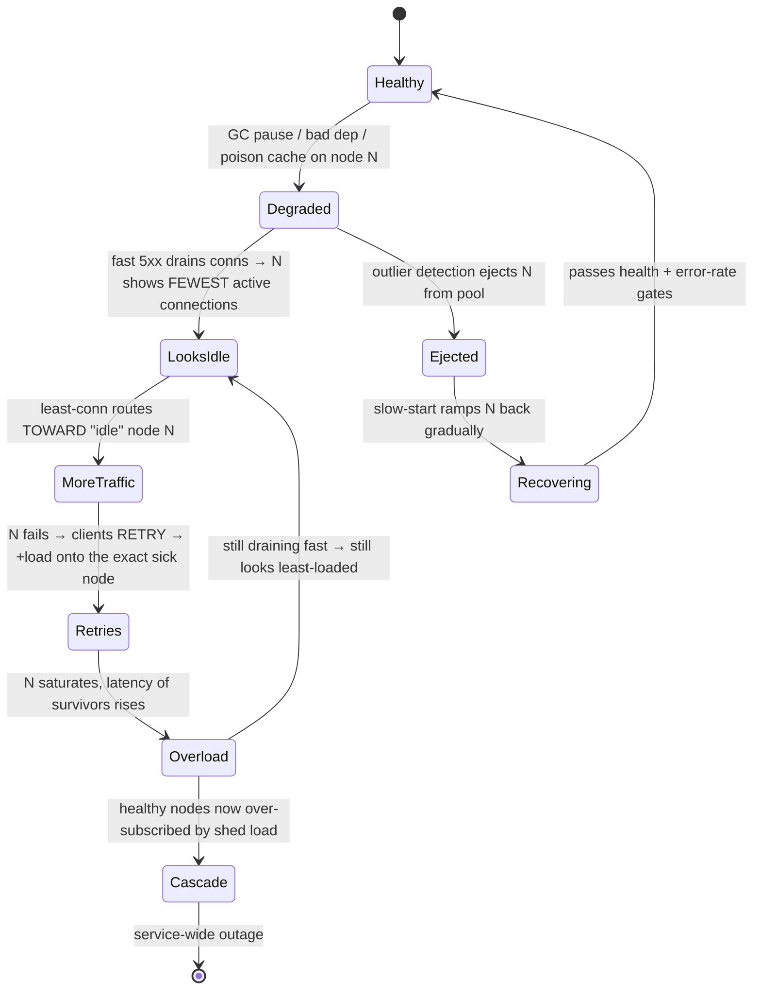
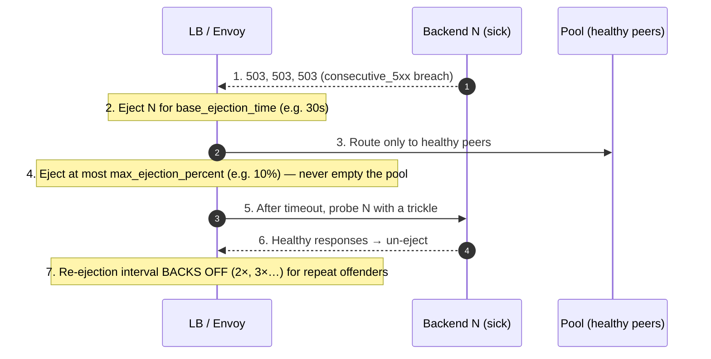
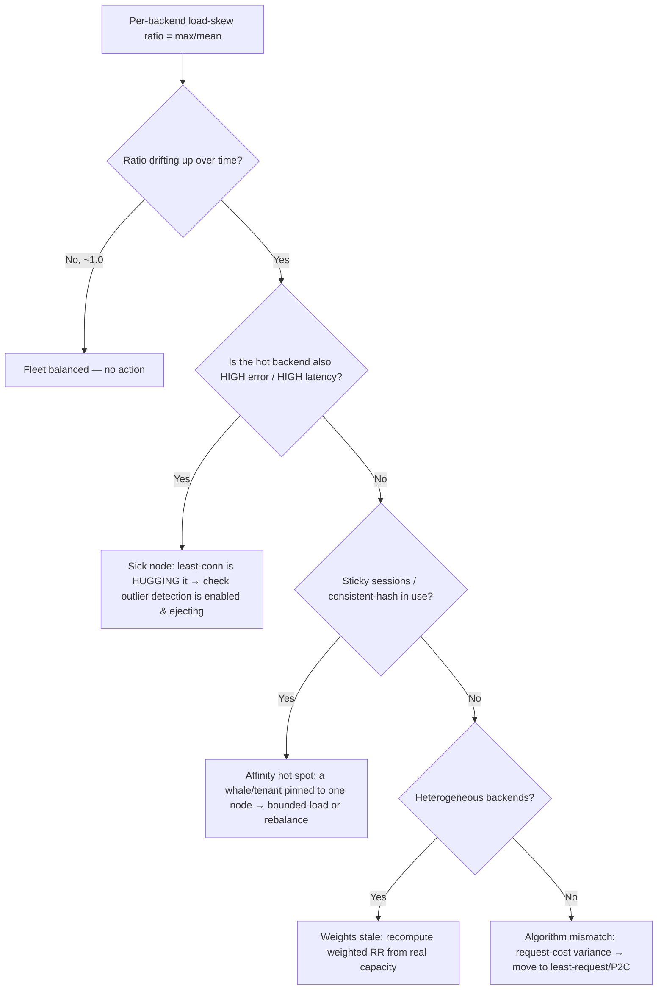

# Load Balancing Algorithms — Staff

> **Axis:** organizational scope & judgment — NOT deeper theory (that is `professional.md`).
> This file answers: across many teams and years, which balancing algorithm is *actually*
> worth choosing, when the clever one becomes an outage generator, and how you prove your
> fleet is balanced at all. The staff insight is subtractive: the default is almost always
> correct, and the failure mode of a "smarter" algorithm is worse than the imbalance it fixes.

## Table of Contents
1. [The Staff Thesis: The Default Is the Decision](#1-the-staff-thesis-the-default-is-the-decision)
2. [Why Least-Connections Is a Cascading-Failure Machine](#2-why-least-connections-is-a-cascading-failure-machine)
3. [The Non-Negotiable Companions: Outlier Detection & Slow-Start](#3-the-non-negotiable-companions-outlier-detection--slow-start)
4. [Algorithm Choice by Workload (The Only Table That Matters)](#4-algorithm-choice-by-workload-the-only-table-that-matters)
5. [Affinity vs Statelessness as an Architecture Decision](#5-affinity-vs-statelessness-as-an-architecture-decision)
6. [Observability: How You Know Your LB Is Balancing At All](#6-observability-how-you-know-your-lb-is-balancing-at-all)
7. [When NOT to Change the Algorithm (Over-Optimization)](#7-when-not-to-change-the-algorithm-over-optimization)
8. [Second-Order Consequences & The Metric You Watch](#8-second-order-consequences--the-metric-you-watch)
9. [Staff Checklist](#9-staff-checklist)

---

## 1. The Staff Thesis: The Default Is the Decision

Most engineers treat "pick a load balancing algorithm" as an optimization problem: find the
one that spreads load most evenly. That framing is the trap. At staff scale the question is a
**risk-management** problem, and the risk lives on the tail, not the mean.

Three facts drive every judgment call below:

1. **Round-robin and least-connections both converge to even load on homogeneous,
   fast-request fleets.** The difference between them is invisible in steady state and only
   appears when requests are heterogeneous or a backend is sick. So the algorithm you pick is
   really a bet about your *failure* behavior, not your *happy-path* distribution.
2. **The "smart" algorithm's intelligence is a feedback loop, and feedback loops on a
   degraded signal amplify.** Least-connections routes *toward* the node with the fewest open
   connections. A node that is failing fast (returning errors in 2 ms) *drains* connections
   fastest, so it looks least-loaded — and the algorithm sends it more traffic. The smarter
   the router, the harder it can hug a black hole.
3. **You cannot reason about balance you cannot see.** The single most common finding in a
   real LB post-mortem is not "wrong algorithm" — it is "nobody had a per-backend load
   distribution graph, so a 3× skew ran for months." Observability is the prerequisite, not the
   follow-up.

The staff move is therefore: **start with round-robin (or weighted round-robin for known
heterogeneity), keep it until a per-backend metric proves it is inadequate, and add
least-request only together with outlier detection and slow-start.** Never ship the clever
algorithm naked.

> A defensible default that you understand beats a clever default that surprises you at 3 a.m.
> Load balancing is one of the purest expressions of this rule, because the clever version's
> surprise is specifically a *cascading* surprise.

---

## 2. Why Least-Connections Is a Cascading-Failure Machine

The canonical staff-level incident is not "the LB distributed unevenly." It is "the LB
detected a struggling node and *concentrated* traffic on it until the whole service fell
over." Understanding this loop is the difference between senior and staff on this topic.

### The failure loop

A backend degrades — GC pause, a poisoned cache, a slow dependency, a bad deploy on one
instance. Its requests now either (a) fail fast with 5xx, or (b) time out and get **retried**.
Both paths feed the same doom loop under least-connections / least-request routing:

### Why retries are the accelerant

Retries and least-connections are individually reasonable and jointly lethal. A retry storm
multiplies offered load exactly when capacity has dropped, and least-connections *aims* that
multiplied load at the weakest node. The "connection count" signal is measuring the wrong
thing: it reads **how fast a node sheds work**, not **how much useful work it completes**. A
node returning instant errors is the fastest sheddder in the fleet.

The same pathology appears with:

- **Least-response-time / EWMA routing** when a node fails fast — low latency on errors reads
  as "healthiest."
- **Power-of-two-choices (P2C)** — better than pure least-conn because it samples only two
  backends and picks the less loaded, damping the herd, but it *still* prefers the fast-erroring
  node unless the load metric is error-aware.

### The mitigations you must pair with any load-aware algorithm

| Guardrail | What it prevents | Cost if omitted |
|-----------|------------------|-----------------|
| **Outlier detection / passive health** (eject on consecutive 5xx or high error ratio) | LB hugging a black hole | Cascading failure onto the sick node |
| **Slow-start / ramp** on (re)joining nodes | New/cold node instantly overloaded | Deploy-triggered latency spikes; flapping |
| **Retry budgets** (cap retries to a % of live traffic) | Retry-storm amplification | Multiplied load onto shrinking capacity |
| **Load-report signal that counts successes, not just open conns** | Fast-error node looking idle | The doom loop of §2 |
| **Circuit breaking per backend** | Unbounded pending requests to a dead node | Connection-pool exhaustion, head-of-line block |

The load-aware algorithm is not wrong. It is *incomplete* without these. Shipping
least-connections without outlier detection is the load-balancing equivalent of a chainsaw
without a chain brake.

---

## 3. The Non-Negotiable Companions: Outlier Detection & Slow-Start

If you take one operational lesson from this file: **the algorithm is 10% of the decision; the
guardrails are 90%.** Two guardrails are mandatory whenever the algorithm reacts to live load.

### Outlier detection (the chain brake)

Passive outlier detection watches real traffic and temporarily ejects a backend that crosses a
threshold — consecutive gateway errors, consecutive local-origin errors, or an error ratio
statistically worse than peers. Envoy's implementation is the reference model:

Staff-critical parameters and *why they exist*:

- **`max_ejection_percent`** — the safety valve. Without a cap, a correlated failure (bad
  config pushed fleet-wide, or an unhealthy *dependency* making every node error) ejects the
  entire pool and you have manufactured a total outage from a partial one. Cap it (10–50%) so
  the LB can never route to zero backends.
- **Base ejection time with back-off** — a flapping node that keeps failing should be ejected
  for progressively longer, not re-added every 30 s to fail again.
- **Distinguish local vs upstream errors** — a 503 from your dependency is not the backend's
  fault; ejecting on it just shrinks capacity during a shared brownout.

### Slow-start (the ramp)

A newly started, freshly deployed, or just-un-ejected node has **cold caches, cold JITs, empty
connection pools, and unwarmed CPU**. Least-connections sees it with *zero* connections and
dumps a full share of traffic onto it in one step — the node's first second is its worst
second, and it may fail health checks and flap right back out. Slow-start linearly ramps a
node's weight over a window (e.g., 30–60 s) so it earns load as it warms.

Slow-start matters *most* at exactly the moments you deploy, autoscale, or recover — i.e., the
high-change moments where incidents cluster. A fleet without slow-start turns every rolling
deploy into a series of micro-brownouts on each new instance.

> Rule of thumb: **if the algorithm can react within seconds, it can also overreact within
> seconds.** Outlier detection bounds the downside; slow-start bounds the upside shock. You need
> both, and you need them *before* you enable the load-aware algorithm, not after the first
> incident.

---

## 4. Algorithm Choice by Workload (The Only Table That Matters)

The decision is a function of **request-cost variance** and **backend homogeneity**, not of
which algorithm sounds smartest. Read this as "what is my default, and what evidence would make
me change it."

| Workload profile | Sensible default | When to change | Do NOT reach for |
|---|---|---|---|
| Short, uniform requests; homogeneous backends (typical stateless HTTP API) | **Round-robin** | Almost never — RR is optimal here | Least-conn adds risk, zero benefit |
| Heterogeneous backend sizes (mixed instance types, canary) | **Weighted round-robin** (weight ∝ capacity) | Only if capacity varies *dynamically* | Manual weights that drift stale |
| Long-lived connections (WebSocket, gRPC streams, DB pools) | **Least-connections** (+ outlier detection) | If connection count ≠ true load, switch to least-request | Round-robin (piles new streams on busy nodes) |
| High request-cost variance (some requests 100× others) | **Least-request / P2C EWMA** (+ guardrails) | If tail latency skews, tune EWMA half-life | Round-robin (variance → head-of-line skew) |
| Cache-affinity-sensitive (per-key hot data, sticky compute) | **Consistent hashing / Maglev / ring-hash** | If key distribution is skewed → bounded-load variant | Round-robin (destroys cache locality) |
| Geo / multi-zone with cost & latency asymmetry | **Zone-aware / locality-weighted** RR or least-request | If a zone degrades, spill to others (priority) | Global least-conn (drags traffic across zones) |
| Anything with retries + load-aware routing | Add **retry budget + outlier detection** first | — | Least-conn *without* outlier detection (see §2) |

### The heuristic that collapses the table

Ask two questions:

1. **Do requests vary a lot in cost?** No → round-robin. Yes → load-aware (least-request /
   P2C), *with guardrails*.
2. **Do connections outlive requests?** Yes → least-*connections* is a reasonable proxy for
   load. No → prefer least-*request* (in-flight requests), because a node with many idle keep-alive
   connections is not actually busy.

Everything else — Maglev, ring-hash, zone-aware — is a modifier you add when a *specific*
constraint (cache locality, cross-zone egress cost, connection consistency across LB restarts)
demands it. Do not add those modifiers speculatively; each one narrows how you can reason about
the system and complicates capacity planning.

> **See it animated:** [Consistent hashing](https://www.toptal.com/big-data/consistent-hashing) ·
> [The power of two random choices (Eric Langlois)](https://brooker.co.za/blog/2012/01/17/two-random.html)
> — Marc Brooker's write-up on why P2C beats least-conn at scale.

---

## 5. Affinity vs Statelessness as an Architecture Decision

Sticky sessions (session affinity) are frequently treated as a load-balancer *setting*. At
staff level they are an **architecture decision** that constrains everything downstream:
deploys, autoscaling, failure blast radius, and which balancing algorithms are even available
to you.

### What affinity actually costs you

- **It defeats balancing.** The moment a client is pinned to a node, your algorithm no longer
  chooses per request — it chooses once, per session. Load skew becomes *sticky*: a whale
  customer's session stays on one node for its whole lifetime. Long-lived sticky sessions and
  "even distribution" are in tension by construction.
- **It concentrates blast radius.** When a node dies, *every* session pinned to it drops
  simultaneously. Statelessness turns a node failure into "some in-flight requests retry
  elsewhere"; affinity turns it into "N thousand users logged out at once."
- **It fights autoscaling and deploys.** Scaling *in* or draining a node for deploy must now
  evict live sessions or wait them out. Rolling deploys become session-draining exercises;
  scale-in is delayed by your longest session.
- **It creates hot spots on skewed traffic.** Consistent-hash affinity by user/tenant makes a
  single hot tenant a single hot backend. This is why **bounded-load** consistent hashing exists —
  affinity with an overflow valve.

### The decision framework

| Situation | Choose | Rationale |
|---|---|---|
| Session state is externalized (Redis/DB/JWT) | **Stateless (no affinity)** | Any node serves any request; best balance & failover |
| Legacy app with in-memory session, can't refactor yet | **Cookie-based affinity** as a *bridge* | Buys time; log it as tech debt with an exit date |
| Cache-locality is a genuine perf win (per-key hot data) | **Consistent hashing (bounded-load)** | Affinity for locality, capped to prevent hot-node overload |
| Stateful protocol (WebSocket, long gRPC stream) | **Connection affinity is inherent** | The connection *is* the state; use least-conn + graceful drain |
| Multi-tenant with noisy-neighbor risk | **Stateless + per-tenant fairness/quotas** | Don't let affinity turn one tenant into one hot node |

**The staff default is statelessness.** Push session state out of the process (token or shared
store) so the load balancer is free to make the best per-request decision, failover is trivial,
and every algorithm in §4 is on the table. Reach for affinity only when (a) a measured cache or
protocol benefit justifies it, or (b) as an explicitly time-boxed bridge for legacy code — and
when you do, document that you have just given up a chunk of your balancing freedom.

> Affinity is borrowing balance from the future. Sometimes the loan is worth it (cache
> locality), but price it as debt with an exit plan, not as a free checkbox.

---

## 6. Observability: How You Know Your LB Is Balancing At All

The most expensive load-balancing failures are silent: a persistent skew or a hot backend that
nobody graphed. A staff engineer's real deliverable here is not the algorithm choice — it's the
**per-backend visibility that lets any on-call engineer answer "is traffic even, and if not,
why?"** in under a minute.

### The signals you must have per backend (not just aggregate)

Aggregate LB metrics *hide* the exact problem you care about. Per-backend is mandatory:

- **Requests/sec, in-flight requests, and active connections per backend** — the raw
  distribution. Graph max/min or the coefficient of variation across backends. A healthy
  homogeneous fleet sits within a few percent; a widening spread is the early warning.
- **Error rate and latency (P50/P99) per backend** — so you can distinguish "node N is getting
  more traffic" from "node N is *sick*." Same-traffic-worse-latency ≠ more-traffic.
- **Outlier-detection ejections per backend** — a node that ejects repeatedly is flapping;
  chronic ejections across many nodes usually means the *dependency* is sick, not the fleet.
- **Slow-start / warm-up state** — so a post-deploy latency bump reads as "expected ramp," not
  "regression."
- **Retry rate and retry-budget consumption** — the accelerant from §2. A rising retry rate
  concurrent with a latency climb is the signature of an emerging doom loop.

### The one graph that catches most incidents

Plot **per-backend request share** (or in-flight requests) as a stacked/overlaid time series,
plus a **load-skew ratio = max_backend_load / mean_backend_load**. In a balanced fleet this
ratio hovers near 1.0.

An alert on `load_skew_ratio > 2` (sustained) catches stale weights, affinity hot spots, and
the early phase of the doom loop *before* users notice. If you ship nothing else from this file,
ship that ratio and that alert.

---

## 7. When NOT to Change the Algorithm (Over-Optimization)

Half of staff judgment on this topic is *refusing* to tune. Load-balancing algorithms are a
magnet for over-engineering because they feel like a clean optimization with a right answer.
They are not; they are a risk trade with a boring correct default.

Do **not** move off round-robin (or weighted RR) when:

- **The fleet is homogeneous and requests are short and uniform.** RR is already optimal here.
  Least-connections buys you nothing on the mean and adds the §2 failure mode on the tail.
- **You have no per-backend skew graph.** If you can't *measure* imbalance, you can't know a
  new algorithm helped — you've traded a legible system for an illegible one on a hunch.
  Instrument first; only measured skew justifies a change.
- **The real problem is capacity, retries, or a slow dependency.** A hot backend is often a
  *symptom* — a bad deploy, an un-ejected sick node, or a retry storm. Changing the algorithm
  papers over the cause and makes the next incident harder to diagnose.
- **The gain is a few percent of mean utilization.** Squeezing 3% better packing while adding a
  feedback loop that can cascade is a catastrophic trade. The cost of the tail event dwarfs the
  utilization win.

The anti-pattern to name in reviews: **"least-connections because it's smarter."** Smarter is
not the goal; *predictable under failure* is. When someone proposes a load-aware algorithm, the
staff question is not "is it more even?" but **"what happens when a backend fails fast, and is
outlier detection wired up to stop it?"** If the answer is fuzzy, the change is not ready.

> The cheapest, most reliable load balancer configuration is the simplest one your workload
> tolerates, plus the guardrails. Complexity in the routing decision is a liability you pay for
> in every future incident's mean-time-to-understand.

---

## 8. Second-Order Consequences & The Metric You Watch

Choosing (or changing) a balancing algorithm ripples past the request path:

- **On deploys (6–12 months):** load-aware routing without slow-start makes every rolling
  deploy a series of cold-node micro-brownouts; teams learn to deploy at low traffic, which
  slows delivery. Slow-start removes that tax and keeps deploys boring.
- **On capacity planning:** consistent-hashing / affinity makes per-node load *lumpy and
  hard to forecast* — you can no longer assume load ÷ N per node. Your headroom model must
  account for the hottest shard, not the average, which raises the cost floor.
- **On failure blast radius:** affinity converts "one node down" into "all its sessions down."
  Statelessness keeps the blast radius proportional to in-flight requests.
- **On cross-team ownership:** the LB config is a shared choke point. A team enabling
  least-connections for *their* long-lived streams changes behavior for *everyone* behind that
  LB. Algorithm and outlier-detection settings belong in reviewed config (IaC), not ad-hoc
  console changes, precisely because the blast radius is multi-team.
- **On cost:** zone-aware balancing that "spills" across zones under load can silently generate
  cross-AZ egress charges; a locality-blind least-conn can drag traffic across zones for a
  marginal balance gain that costs real money.

**The metric you watch to know the decision is going wrong:** the **per-backend load-skew ratio
(max/mean) correlated against per-backend error rate.** Rising skew *with* rising error rate on
the hot node = the doom loop of §2 (kill it via outlier detection + retry budget). Rising skew
*without* error rate = stale weights or an affinity hot spot (rebalance). Flat skew near 1.0 =
leave it alone, no matter how "smart" a newer algorithm sounds.

---

## 9. Staff Checklist

- [ ] Default is **round-robin / weighted RR**; any move to load-aware routing is justified by a
      *measured* per-backend skew or tail-latency problem, captured in an ADR.
- [ ] **Outlier detection is enabled with a `max_ejection_percent` cap** *before* any
      load-aware algorithm ships — the LB can never route to zero backends.
- [ ] **Slow-start / warm-up ramp** is configured so new, redeployed, and un-ejected nodes earn
      load gradually; verified across a real rolling deploy.
- [ ] **Retry budgets** cap retries as a fraction of live traffic; retry rate is graphed against
      latency to catch doom-loop onset.
- [ ] **Per-backend** RPS, in-flight requests, error rate, latency, and ejections are graphed —
      not just aggregate — and a **load-skew-ratio (max/mean) alert** exists.
- [ ] **Affinity vs statelessness** is an explicit, documented decision; sticky sessions exist
      only for a measured cache/protocol reason or as a time-boxed legacy bridge with an exit date.
- [ ] LB algorithm and health/outlier settings live in **reviewed config (IaC)**, because the
      blast radius is cross-team; no ad-hoc console tuning.
- [ ] A "when NOT to change the algorithm" note is written so others don't cargo-cult
      least-connections as "the smarter choice."

*Next step:* [Load Balancing Algorithms — Interview](interview.md)
