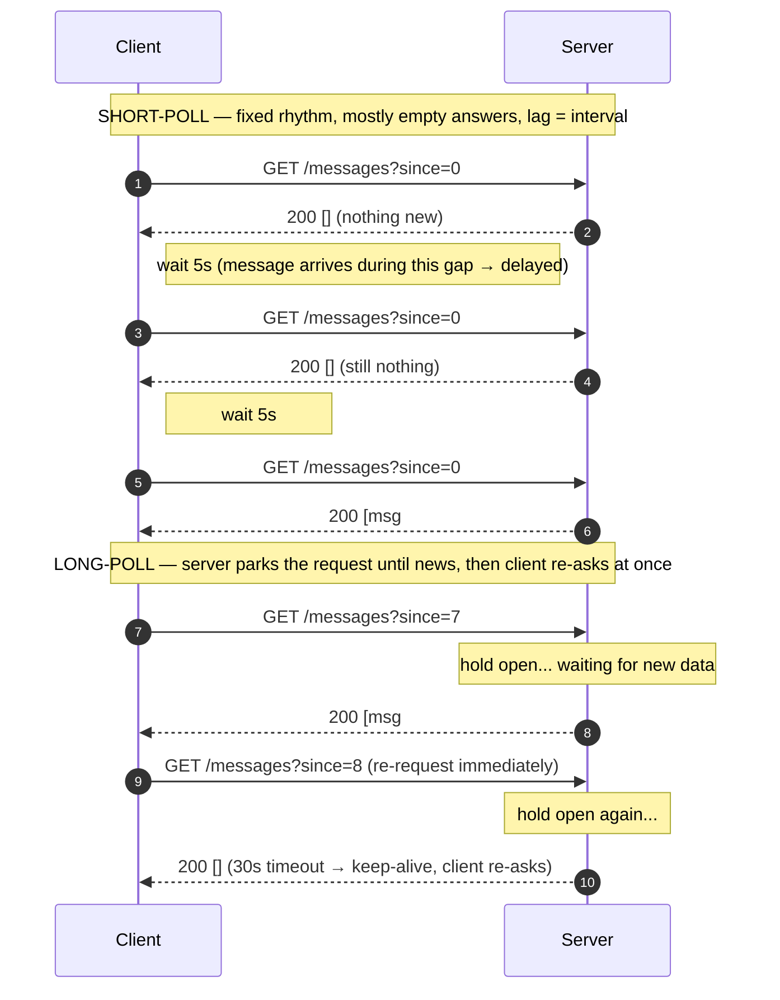

# Long-Polling & Streaming — Junior

<!-- level-focus -->
At junior level, focus on this question:

> How can I apply **Long-Polling & Streaming** in one small example and prove the result?

Use the smallest realistic scenario that exposes the decision and its failure behavior.
## 1. Why this exists: HTTP is request/response

HTTP was designed around a simple, one-directional idea: the **client asks**, the **server answers**, and the connection is done. The client speaks first, every time. The server cannot decide, on its own, to reach out and say "hey, something changed."

That model is perfect for loading a web page. It is awkward the moment you want **push**: a chat message arriving, a stock price ticking, a "your order shipped" notification, a live sports score. The new data lives on the server, but the server has no way to volunteer it — it can only respond to a request that the client already made.

So the whole game becomes: *how do we fake server-to-client push using only client-initiated HTTP requests?* Three answers emerged, each cleverer than the last:

- **Short-polling** — keep asking, over and over.
- **Long-polling** — ask once, but let the server wait to answer until it has news.
- **HTTP streaming** — ask once, and let the server keep answering, in pieces, forever.

Everything below is a variation on those three ideas.

---

## 2. Short-polling: ask every N seconds

Short-polling is the most obvious approach, and the first one anyone invents. The client sets a timer and repeatedly asks the server "anything new?" — for example every 5 seconds.

```javascript
// Short-polling: ask every 5 seconds, forever.
setInterval(async () => {
  const res = await fetch('/api/messages?since=' + lastSeenId);
  const data = await res.json();
  if (data.messages.length > 0) {
    render(data.messages);
    lastSeenId = data.messages.at(-1).id;
  }
}, 5000);
```

Each request is a complete, independent round trip: open connection, ask, get an answer (often an empty "nothing new"), close. Then wait for the timer and do it all again.

**What's good about it**

- Dead simple. Any backend that can serve a normal HTTP endpoint already supports it.
- Nothing special on the server — no long-lived connections, no state to manage.
- Works through every proxy, firewall, and ancient browser on earth.

**What's bad about it**

- **Wasteful.** Most requests return "nothing new." If a chat is quiet for 10 minutes, you still fired ~120 pointless requests, each with its own headers, TLS overhead, and log line.
- **Laggy.** A message that arrives 1 second *after* a poll waits ~4 seconds until the next poll. Your worst-case latency is your polling interval.
- **Bad trade-off.** To reduce lag you poll more often, which increases waste. To reduce waste you poll less often, which increases lag. You can't win both.

Short-polling is fine for data that changes slowly and where a few seconds of delay is acceptable — a dashboard that refreshes every 30 seconds, for instance. It is a poor fit for anything that should feel instant.

---

## 3. Long-polling: hold the request open

Long-polling keeps the simplicity of "the client asks" but removes the waste and most of the lag with one twist: **the server does not answer immediately if there's nothing to say.** Instead it *holds the request open* — parks it — until new data appears (or a timeout is reached). The moment there's news, it responds. The client, upon receiving that response, immediately fires the next request.

```javascript
// Long-polling: one request that waits, then re-request instantly.
async function poll() {
  try {
    const res = await fetch('/api/messages?since=' + lastSeenId);
    const data = await res.json();          // resolves only when server has news
    if (data.messages.length > 0) {
      render(data.messages);
      lastSeenId = data.messages.at(-1).id;
    }
  } catch (e) {
    await sleep(1000);                       // brief backoff on error
  }
  poll();                                    // immediately ask again
}
poll();
```

On the server, instead of replying "nothing new" right away, the handler *waits* — subscribing to whatever event source it has (a message queue, a database notification, an in-memory pub/sub) — and only writes the response when data is ready:

```javascript
// Server side (pseudo): don't respond until there's something to send.
app.get('/api/messages', async (req, res) => {
  const since = req.query.since;
  const messages = await waitForNewMessages(since, { timeout: 30_000 });
  res.json({ messages });   // sent the instant data arrives, or [] after 30s
});
```

Notice the **timeout**. The server won't hold forever — after, say, 30 seconds it responds with an empty result. That keeps the connection healthy (proxies and load balancers kill connections that are silent too long) and gives the client a natural chance to re-request. This is the normal, expected cycle, not an error.

### The two side by side

The diagram below stages both techniques so you can see the difference in shape: short-polling is a rhythm of separate mostly-empty round trips; long-polling is a single waiting request that fires again the instant it's answered.



**Why long-polling is better than short-polling**

- **Lower latency.** Data reaches the client almost the instant it exists on the server, not up to N seconds later.
- **Less waste.** During quiet periods there's one parked request, not a stream of empty ones. No message means no traffic (until the periodic timeout).

**The cost you pay**

- The server now holds many open connections at once — one per waiting client. A server that blocks a thread per request will run out of threads fast, so long-polling pairs best with an **async / event-driven** server (Node.js, Go, Java NIO, async Python) that can park thousands of idle requests cheaply.
- It's still "one message per response." After each delivery the client must re-establish the request. There's a tiny gap between "response received" and "next request sent" where a message could theoretically arrive — good implementations use a `since`/cursor parameter (as above) so nothing is missed.

---

## 4. Short-poll vs long-poll, side by side

| Aspect | Short-polling | Long-polling |
|---|---|---|
| Who initiates | Client, on a timer | Client, but re-fires right after each response |
| Server behavior | Answers immediately (often empty) | Holds the request until data or timeout |
| Latency when quiet then busy | Up to one interval of delay | Near-instant |
| Requests during a quiet hour | Hundreds (one per interval) | A few (one per timeout window) |
| Server connections held open | None (short bursts) | One per waiting client |
| Best server style | Anything | Async / event-driven |
| Complexity | Trivial | Modest (server must "park" requests) |

The takeaway: long-polling is short-polling with the empty responses squeezed out. Same request/response HTTP, dramatically better behavior for "notify me when something happens."

---

## 5. HTTP streaming: one open response, many chunks

Both polling styles share one limit: **one response carries one payload, then the connection closes.** HTTP streaming breaks that limit. The client makes a single request, and the server sends back a response that it *never finishes* — it keeps writing new pieces (chunks) down the same open connection as events occur.

This works because of a standard HTTP feature called **chunked transfer encoding**. Normally a response declares its total size up front with a `Content-Length` header. With chunked encoding the server instead says "I'll send this in chunks and tell you when I'm done" — and then simply never says it's done. Each chunk can be flushed to the client the moment there's something to send.

```
HTTP/1.1 200 OK
Content-Type: text/event-stream
Transfer-Encoding: chunked

data: {"price": 101.2}\n\n      ← chunk 1, flushed immediately
data: {"price": 101.5}\n\n      ← chunk 2, seconds later
data: {"price": 100.9}\n\n      ← chunk 3, and so on...
                                  (connection stays open)
```

The client reads this response as a **stream**: it processes each chunk as it arrives instead of waiting for the whole thing to finish (which never happens).

**Why streaming beats long-polling for high-frequency updates**

- **No re-request overhead.** Long-polling reconnects after every message; streaming reuses one connection for thousands of messages. For a chatty feed (live scores, telemetry, a busy chat room) that saves a lot of round trips.
- **Truly continuous.** There's no gap between messages where a request has to be rebuilt.

**Why streaming is trickier**

- **Intermediaries interfere.** Some proxies, older CDNs, and antivirus/corporate firewalls **buffer** responses — they wait to collect the "whole" response before passing it along. With a response that never ends, the client gets... nothing, until the buffer or the connection times out. This is the classic reason a stream "works on my machine" but breaks behind some corporate network.
- **Still one-directional.** Like polling, streaming pushes server→client only. To send data client→server you still make separate normal requests.
- **Reconnection is on you** (at the raw level) — if the connection drops, something has to notice and re-open it and resume from the right point.

HTTP streaming is the direct ancestor of **Server-Sent Events (SSE)**, which is essentially "HTTP streaming, standardized, with automatic reconnection and a defined `text/event-stream` message format." More on that next.

---

## 6. A little history: the "Comet" era

In the mid-2000s, the web wanted to feel alive — Gmail, Google Talk, Meebo, live-updating pages — but WebSockets didn't exist yet (they arrived around 2011). So developers built real-time features out of long-polling and streaming, and the community gave this bag of tricks a name: **Comet** (a playful counterpart to *Ajax*; both are, in on the nose fashion, household cleaning brands).

"Comet" was never a single protocol. It was an umbrella term for *any* technique that let a server push data to the browser over plain HTTP without the user clicking anything. Under that umbrella lived two main styles you now recognize:

- **Long-polling** (called "the hanging GET" back then).
- **HTTP streaming** (often via a hidden `<iframe>` that the server kept feeding `<script>` chunks into, or via a never-ending XHR response).

These techniques were clever but fragile — full of workarounds for browser quirks and proxy buffering. The pain of maintaining them is *exactly* why purpose-built real-time protocols were later standardized. Comet was the problem statement; SSE and WebSockets were the answer.

---

## 7. How SSE and WebSockets grew out of this

The two modern real-time technologies are direct descendants of the Comet techniques, each cleaning up one of them:

- **Server-Sent Events (SSE)** is *HTTP streaming, done properly.* It standardizes the streaming response as a `text/event-stream` MIME type, defines a simple `data:`/`event:`/`id:` line format, and — crucially — builds **automatic reconnection** into the browser's `EventSource` API. You still get one-directional server→client push over one long-lived HTTP response; SSE just removes the hand-rolled fragility. If your app only needs the server to push to the client (notifications, feeds, live scores), SSE is the natural, HTTP-friendly choice.

- **WebSockets** go further and abandon the request/response model entirely. A WebSocket connection starts as an HTTP request (the "upgrade handshake") and then switches the connection to a persistent, **two-way** channel where either side can send messages at any time. This is the right tool when the client also needs to push frequently — multiplayer games, collaborative editors, chat with typing indicators.

The lineage is worth remembering:

- Short-poll → long-poll → **HTTP streaming → SSE** (one-way push, still plain HTTP).
- HTTP handshake → **WebSockets** (two-way, dedicated protocol).

You'll meet SSE and WebSockets in depth on later pages. For now, the key insight is that they exist to solve the problems that polling and streaming exposed.

---

## 8. Why long-polling still matters as a fallback

If SSE and WebSockets are better, why learn long-polling at all? Because **the network isn't always on your side**, and long-polling is the technique most likely to work *anywhere*.

Long-polling uses nothing but ordinary `GET`/`POST` requests that return normally-shaped responses. That means:

- **It passes through hostile proxies and firewalls.** Corporate networks, some mobile carriers, and older infrastructure sometimes block WebSocket upgrades or break streaming responses by buffering them. A plain request/response almost always gets through.
- **It works in old browsers.** Very old browsers lack `WebSocket` or `EventSource`. They can still do `fetch`/`XMLHttpRequest`, so they can still long-poll.
- **It's easy to reason about and debug.** Each cycle is a normal HTTP call you can see in the network tab and replay with `curl`.

For this reason, major real-time libraries treat long-polling as a **fallback tier**. The classic example is **Socket.IO**, which historically *starts* a connection with long-polling (guaranteed to work) and then transparently **upgrades** to WebSockets if the environment allows it. If the upgrade fails or later breaks, it falls back to long-polling again. The user never notices; they just get a working real-time connection.

So the mental model is a ladder, best-to-most-compatible:

1. **WebSockets** — best for two-way, high-frequency traffic (when the network permits).
2. **SSE / HTTP streaming** — great for one-way server push (when the network permits).
3. **Long-polling** — the universal fallback that works when the others are blocked.
4. **Short-polling** — the last resort, or fine on its own when updates are slow and lag is acceptable.

Knowing long-polling isn't nostalgia — it's your insurance policy for the messy real-world networks your users actually sit behind.

---

## 9. Comparison table: short-poll vs long-poll vs streaming

| Dimension | Short-polling | Long-polling | HTTP streaming |
|---|---|---|---|
| How push is faked | Repeated requests on a timer | One waiting request, re-fired after each reply | One request, response never closes |
| Connections | New one each interval | One held open per client, re-opened per message | One held open per client, reused for all messages |
| Latency | Up to one interval | Near-instant | Near-instant, continuous |
| Wasted traffic | High (many empty replies) | Low (one reply per event/timeout) | Very low (no reconnect overhead) |
| Direction | Server → client (fetched) | Server → client (fetched) | Server → client (pushed) |
| Server style needed | Any | Async / event-driven | Async / event-driven |
| Proxy / firewall friendliness | Excellent | Excellent | Fair (buffering can break it) |
| Client complexity | Trivial | Modest | Modest (must read a stream) |
| Best for | Slow-changing data, generous lag budget | Notifications, chat, universal fallback | High-frequency one-way feeds (basis of SSE) |
| Modern descendant | — | Fallback tier in Socket.IO etc. | Server-Sent Events (SSE) |

Read the table as a progression: each column trades a little more complexity (and a little less universal compatibility) for less waste and lower latency.

---

## 10. Common beginner mistakes

- **Polling too aggressively.** A 500 ms short-poll across 10,000 users is 20,000 requests/second of mostly-empty traffic. Pick an interval that matches how fresh the data truly needs to be, and prefer long-polling if you need it fresher.
- **Forgetting the cursor.** Without a `since` / `lastSeenId` parameter, a client that reconnects (or long-polls) can miss messages that arrived in the gap, or replay ones it already saw. Always track "what have I seen?" and ask for what's after it.
- **No timeout on the held request.** A long-poll that waits *forever* will be silently killed by a load balancer or proxy and the client won't know why. Cap the hold (e.g. 30 s) and respond empty, letting the client re-ask.
- **Blocking a thread per waiting request.** On a thread-per-request server, thousands of parked long-polls exhaust the thread pool. Use an async runtime, or you'll fall over under modest load.
- **Assuming streaming "just works" everywhere.** Buffering proxies and corporate firewalls break never-ending responses. Test behind real networks, and keep long-polling as a fallback.
- **Reaching for WebSockets when you only push one way.** If the client never needs to send real-time data, SSE (or even long-polling) is simpler, cheaper, and more compatible.

---

## 11. Key terms

- **Polling** — the client repeatedly asking the server for updates.
- **Short-polling** — polling on a fixed timer; the server answers immediately, empty or not.
- **Long-polling** — the server holds a request open until data is ready (or a timeout), then answers; the client re-requests at once. Also called the *hanging GET*.
- **HTTP streaming** — a single response that stays open and delivers many chunks over time.
- **Chunked transfer encoding** — the HTTP feature (no fixed `Content-Length`) that lets a server send a response in pieces and flush each piece immediately.
- **Comet** — mid-2000s umbrella term for pushing data to the browser over plain HTTP via long-polling or streaming.
- **SSE (Server-Sent Events)** — standardized one-way server→client streaming over HTTP, with an auto-reconnecting `EventSource` browser API.
- **WebSocket** — a persistent, two-way connection that starts with an HTTP upgrade handshake, then leaves request/response behind.
- **Fallback** — a compatible-but-simpler technique used when the preferred one is unavailable or blocked (long-polling is the classic real-time fallback).
- **Cursor / `since` parameter** — a marker of the last item a client saw, so it can ask for only what's new without missing or duplicating data.

---

## Apply it

1. Choose one small, known input for **Long-Polling & Streaming**.
2. Predict the output or observable behavior.
3. Run the smallest example or probe that exercises the concept.
4. Change one input to trigger a failure or boundary case.
5. Explain the evidence using the guide's vocabulary.

## Verify your work

- Record the exact input, command or code path, and output.
- Repeat the probe and confirm the result is consistent.
- Show one expected success and one expected failure.
- Resolve any difference between the prediction and the evidence.

## Review questions

- What problem does Long-Polling & Streaming solve in the example?
- Which input changes the observed result, and why?
- What is the smallest useful success check?
- Which beginner mistake would your evidence catch?
