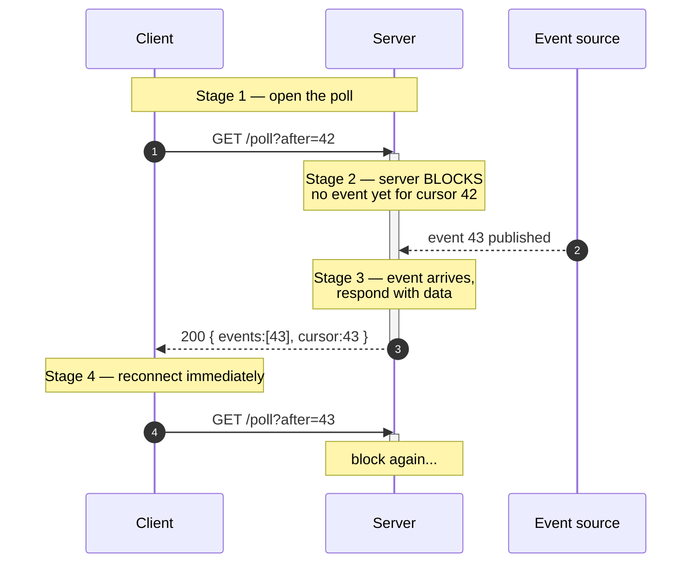
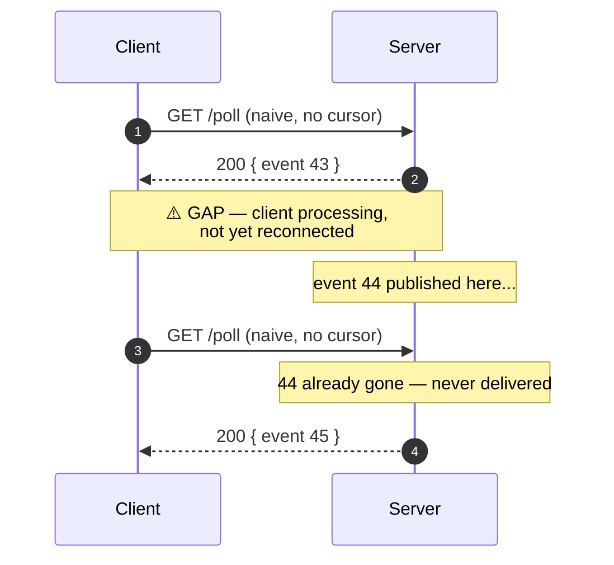
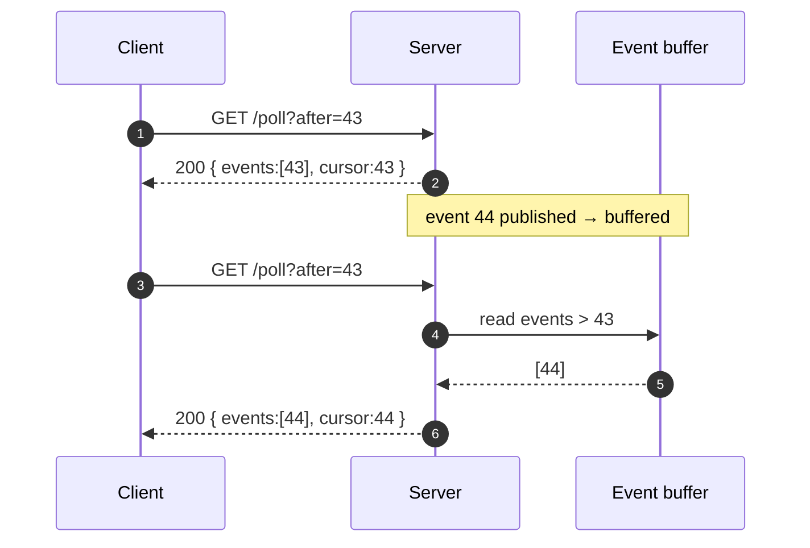

# Long-Polling & Streaming — Middle

<!-- level-focus -->
At middle level, focus on this question:

> Where does **Long-Polling & Streaming** belong in a maintainable component, and which trade-off selects the design?

Use the smallest realistic scenario that exposes the decision and its failure behavior.
## 1. The long-poll loop, step by step

A short poll asks "anything new?" on a fixed timer and usually gets "no." A **long poll** asks the same question but the server *holds the request open* until it has something to say — or until a hold timeout expires. The client then reconnects immediately, so from the outside it looks like a persistent subscription built entirely from ordinary request/response pairs.

The loop has four phases. Read the diagram top to bottom; the numbered stages map to the numbered list below it.



1. **Open the poll.** The client issues a normal `GET` (or `POST`) carrying a cursor — "give me everything after event 42." The TCP/TLS connection is established or reused from the keep-alive pool.
2. **The server blocks.** Instead of replying immediately, the handler parks the request: it registers a listener on the event source and suspends the coroutine/goroutine/async task. No CPU is spent spinning; the socket simply stays open with no bytes flowing.
3. **Respond on event.** When a matching event is published, the server serializes it, writes the HTTP response, and closes (or releases) the request. If no event arrives before the **hold timeout**, it responds with an empty result (see §5).
4. **Reconnect immediately.** The moment the client finishes reading the response, it fires the next request — carrying the *new* cursor from the response it just processed. The gap between response and reconnect is the danger zone we address next.

The blocking in stage 2 is the whole point. On the server it must be implemented with async I/O or lightweight threads; a classic one-thread-per-blocked-request model collapses at a few thousand concurrent polls because each parked request pins an OS thread.

---

## 2. The message-gap problem

The loop above hides a race. Between **stage 3** (server responds) and **stage 4's arrival** (next request registers its listener) there is a window — often only milliseconds, but real — during which the client is *not connected*. Any event the server publishes in that window has no open request to be delivered on.



Event 44 is **silently lost**. Nothing errors; the client just never sees it and has no way to know it existed. This is the single most common long-polling bug, and it is invisible under light load — the gap is tiny and events are rare, so it "works on my machine" and in staging. Under production traffic, where events fire continuously, the gap starts swallowing messages and you get mysterious "missing notification" tickets.

The root cause is that a naive server treats each poll as *"tell me what's happening right now."* Events are ephemeral: if no one is listening at publish time, they vanish. The fix is to make the server treat each poll as *"tell me everything I haven't seen yet"* — which requires the server to **retain** recent events and the client to **name a position** it wants to resume from.

---

## 3. Cursors and sequence IDs

The cure for the gap is a **cursor**: a monotonic marker the client sends to say "I have consumed everything up to and including X; give me what comes after." The server keeps a buffer (a ring buffer, an append-only log, a Redis stream, a Kafka offset — anything replayable) and, on each poll, returns all events with an ID greater than the cursor.

Now the gap is harmless. If event 44 is published while the client is reconnecting, it lands in the buffer. The next request arrives with `after=43`, the server sees 44 (and 45) waiting, and returns both immediately — no blocking needed because there is already unconsumed data.



Practical rules for cursors:

- **Monotonic and dense enough to compare.** A sequence integer, a log offset, or a hybrid `timestamp_ms:seq` all work. A bare wall-clock timestamp is risky: clock skew and same-millisecond events cause ties and reordering.
- **The client is the source of truth for its position.** The server must never assume "the client got everything I sent." It only knows the client advanced *because* the next request carried a higher cursor.
- **Bound the retention window.** You cannot keep every event forever. Retain enough to cover realistic disconnect gaps (seconds to minutes). If a client returns with a cursor older than the retained window, respond with a **"cursor expired / resync"** signal so it can re-fetch a full snapshot rather than silently missing data.
- **Idempotent by design.** Because a client may reconnect with a slightly stale cursor after a failure, it can legitimately receive an event it already processed. Cursors make delivery *at-least-once*, not exactly-once — see §6.

This cursor pattern is not optional decoration; it is what turns "long polling" from a demo into a reliable transport.

---

## 4. The timeout triangle

Long polling deliberately holds a request open with no data flowing — which is exactly the pattern every intermediary between client and server is tuned to kill. Three independent timeout budgets are in play, and they must be ordered correctly.

| Timeout | Owned by | Typical default | Behavior when it fires |
|---|---|---|---|
| **Server hold time** | Your application | 25–30 s (chosen by you) | Server proactively sends an empty response; client reconnects cleanly |
| **Proxy / LB idle timeout** | ELB, nginx, Cloudflare | 60 s (often lower) | Intermediary drops the connection; client sees an abrupt reset |
| **Client request timeout** | HTTP library / browser | 30 s–2 min | Client aborts and retries, possibly logging a spurious error |

The rule is simple and non-negotiable:

> **Server hold time < proxy idle timeout < client timeout.**

If you hold longer than the proxy's idle timeout, the proxy severs the connection mid-poll. The client sees a connection reset instead of a clean empty response, which looks like an error, triggers backoff, and can lose the in-flight cursor state. Keeping the hold *shorter* means the server always wins the race: it returns a tidy `200` or `204` before any intermediary gets impatient.

Concretely: if your load balancer idles connections at 60 seconds, set the server hold to ~30 seconds and the client's per-request timeout to ~45 seconds. Always leave margin — a few seconds of network jitter should never push a normal empty response past a proxy limit. And audit the *whole path*: CDN, WAF, reverse proxy, service mesh sidecar, and the app server each impose their own idle timeout, and the smallest one wins.

---

## 5. Empty responses and heartbeats

When the hold time expires with no event, the server does **not** hang up — it returns a deliberate "nothing happened, poll again" response. Two conventions:

- **`204 No Content`** — cleanest for a pure long-poll endpoint. No body, unambiguous meaning, and the client simply reissues the request with the *same* cursor.
- **`200` with an empty event list** (`{ "events": [], "cursor": 43 }`) — friendlier when the response envelope also carries metadata (updated cursor, server hints, backoff advice). The cursor echoed back should be unchanged.

Either way, the empty response is the mechanism that keeps the connection cycling *inside* the proxy's tolerance. It converts "an idle socket the proxy will kill" into "a steady drumbeat of quick request/response pairs." Think of it as an application-level heartbeat: even when nothing is happening, the client and every intermediary see regular, legitimate traffic and never conclude the connection is dead.

Two things to get right:

- **Preserve the cursor across empties.** An empty response must not advance the cursor. Advancing it on "nothing new" would skip past events published a moment later.
- **Don't stampede on reconnect.** If the server restarts and 50,000 clients get simultaneous empty responses, they all reconnect at once. Add small randomized jitter to the client's reconnect delay to smear the herd across a few hundred milliseconds.

---

## 6. Ordering and duplicate delivery

Long polling gives you **ordered, at-least-once** delivery *if* you build it that way — and neither property is free.

**Ordering.** Order is preserved only when a single logical stream has a single monotonic cursor and the server returns events in cursor order. It breaks in two ways:

- **Client-side concurrency.** If a buggy client ever has *two* polls in flight for the same stream (e.g., it reconnected before the previous response landed), the two responses can interleave and arrive out of order. Enforce **one outstanding poll per stream**; never open the next until the previous fully resolves.
- **Cross-partition merging.** If events come from multiple partitions/shards each with its own sequence, there is no global order. Either expose one cursor per partition, or accept that ordering is only guaranteed within a partition.

**Duplicates.** At-least-once is the honest guarantee. A client can receive the same event twice whenever:

- It processed a response but its cursor update was lost to a crash, so it reconnects with the *old* cursor and re-fetches the last batch.
- A network failure hid the response; the client retried and the server had already advanced-then-replayed.

You cannot make the transport exactly-once without heavy coordination, so make the **consumer idempotent** instead. Give every event a stable ID, and have the client (and any downstream side effect) deduplicate on it — e.g., "if I've already applied event 44, ignore it." This is the same at-least-once + idempotency contract that message queues live by; long polling is no different.

---

## 7. HTTP chunked streaming mechanics

The other technique keeps **one** response open and dribbles data into it over time, instead of reconnecting per message. This is HTTP **chunked transfer encoding**.

Normally an HTTP response declares `Content-Length` up front, so the client knows exactly how many bytes to read. A stream doesn't know its total length in advance, so the server instead sends:

```
HTTP/1.1 200 OK
Content-Type: application/x-ndjson
Transfer-Encoding: chunked
```

With `Transfer-Encoding: chunked`, the body is a sequence of chunks, each prefixed by its size in hex, terminated by a zero-length chunk that signals the end:

```
1f\r\n
{"event":43,"data":"..."}\n\r\n
21\r\n
{"event":44,"data":"..."}\n\r\n
0\r\n
\r\n
```

The mechanics that matter in practice:

- **Flush after every message.** Writing to the response is not enough — application, runtime, and TLS layers buffer. The server must explicitly **flush** after each chunk (`Flusher.Flush()` in Go, `response.flush()` in Node, `flush()` on the servlet output stream) so the bytes leave the process immediately instead of accumulating until the buffer fills.
- **Keep-alive stays open.** The connection is not closed after the first chunk; it lives until the server sends the terminating `0\r\n\r\n`, the hold budget expires, or the connection drops.
- **The client reads incrementally.** `fetch()` with a `ReadableStream` reader, an XHR `onprogress` handler, or a streaming HTTP client on the backend consumes chunks as they arrive rather than waiting for `Content-Length`.

Compared to long polling, chunked streaming eliminates the per-message reconnect cost and the message-gap window: the connection never closes between events, so nothing falls through a gap. The trade is that a stuck or slow connection holds server resources for its whole lifetime, and — critically — buffering intermediaries can defeat the whole thing.

---

## 8. The buffering pitfall

Chunked streaming's signature failure is **buffering**: something between your `flush()` and the client accumulates the chunks and releases them in a lump, destroying the real-time property. The connection works; messages just arrive late, in bursts, or only when the connection closes.

Common culprits and fixes:

- **Reverse-proxy response buffering.** nginx buffers upstream responses by default. For a streaming endpoint you must disable it — `proxy_buffering off;` (or emit the `X-Accel-Buffering: no` response header). Without this, nginx holds your carefully-flushed chunks until *its* buffer fills or the response ends.
- **Compression middleware.** A gzip/deflate layer needs a block of input before it can emit a compressed block, so it inherently batches. Either disable compression on streaming routes or use a flush-aware compressor that emits on every application flush.
- **The Nagle algorithm (`TCP_NODELAY`).** The OS may coalesce small writes to reduce packet count, adding tens of milliseconds. Set `TCP_NODELAY` on streaming sockets so small chunks go out immediately.
- **Client-side buffering.** Some HTTP stacks won't surface data until a newline, a minimum byte count, or a full read. Delimit messages clearly (newline-delimited JSON is the pragmatic default) and use a genuinely streaming client API.

The insidious part: buffering is **invisible in tests**. A quick curl or a localhost test with no proxy shows perfect streaming, because there's no intermediary to buffer. The bug only appears once traffic goes through the real CDN/LB/proxy chain — exactly like the message-gap problem, it hides until production. When adopting chunked streaming, test end-to-end through the *actual* proxy stack, and watch whether chunks arrive continuously or in suspicious bursts.

---

## 9. Long-poll vs streaming vs SSE vs WebSocket

All four deliver server-to-client updates, but they sit at different points on the complexity/efficiency curve. Middle-level judgment is picking the *least* machinery that meets the requirement.

| Dimension | Long polling | HTTP chunked streaming | SSE | WebSocket |
|---|---|---|---|---|
| **Connection** | Reconnect per message | One long-lived response | One long-lived response | One long-lived duplex socket |
| **Direction** | Server→client (client polls) | Server→client | Server→client | Full duplex |
| **Transport** | Plain HTTP req/resp | HTTP chunked | HTTP + `text/event-stream` | Upgraded TCP framing |
| **Auto-reconnect / replay** | Manual (cursor) | Manual | Built-in (`Last-Event-ID`, retry) | Manual |
| **Proxy/firewall friendliness** | Excellent | Good (if unbuffered) | Good | Sometimes blocked; needs upgrade support |
| **Per-message overhead** | High (full req/resp cycle) | Low | Low | Lowest |
| **Server cost per idle client** | Low (no held socket between msgs) | Held socket + flush loop | Held socket | Held socket |
| **Client complexity** | Simple loop | Streaming reader | `EventSource` (trivial) | Framing + heartbeat + reconnect |

Rules of thumb:

- **Long polling** wins when messages are infrequent, when you must traverse hostile proxies/firewalls with zero configuration, or when you need the broadest possible client and infrastructure compatibility. Its per-message overhead only hurts under high message rates.
- **Chunked streaming** is the raw mechanism; in practice you rarely hand-roll it — you reach for **SSE**, which is standardized chunked streaming with automatic reconnection and event-ID replay baked in. Prefer SSE over hand-built streaming for any server→client-only feed.
- **WebSocket** is the answer only when you genuinely need low-latency *client→server* traffic too (chat, collaborative editing, games). For pure fan-out of updates, it's more moving parts than the job requires.

A frequent and correct architecture: **default to SSE/long-poll for read-only feeds, reserve WebSocket for true bidirectional workloads**, and keep long polling in your pocket as the universal fallback that works everywhere.

---

## 10. Failure modes and mitigations

The concrete failure catalogue for these transports. Most of these bite in production specifically because they're invisible in local testing.

| Failure mode | Symptom | Mitigation |
|---|---|---|
| **Message gap** | Events silently lost between response and reconnect | Cursor/sequence-id; server retains events; client resumes with `after=X` |
| **Proxy kills held connection** | Random connection resets, client backoff loops | Server hold time < proxy idle timeout < client timeout; audit every hop |
| **Cursor expired** | Client returns after long offline; gap in data | Bounded retention window + explicit "resync / full snapshot" signal |
| **Duplicate delivery** | Same event processed twice after retry/crash | Stable event IDs + idempotent consumer (dedupe on ID) |
| **Out-of-order events** | State corruption, flicker | One outstanding poll per stream; per-partition cursors |
| **Streaming chunks arrive in bursts** | Real-time feels laggy, then dumps | Disable proxy buffering (`proxy_buffering off`), flush per chunk, `TCP_NODELAY` |
| **Compression batches the stream** | Chunks appear only on connection close | Disable gzip on streaming routes or use flush-aware compression |
| **Thread-per-poll exhaustion** | Server OOM / thread starvation at scale | Async / lightweight-thread I/O so blocked polls don't pin OS threads |
| **Reconnect stampede** | Traffic spike after server restart | Randomized jitter on client reconnect delay |
| **Empty-response advances cursor** | Events published just after a hold are skipped | Never advance cursor on empty/`204`; echo the same cursor back |
| **Slow/stuck client holds resources** | Streaming sockets accumulate, memory climbs | Cap held-connection lifetime; idle-detect and close; backpressure on writes |

The pattern across this table: **long polling's failures are about the gaps between requests; streaming's failures are about intermediaries buffering a single long request.** Knowing which class of bug you've signed up for tells you where to look when the feed misbehaves.

---

## 11. Key takeaways

- The long-poll loop is *request → server blocks → respond on event or hold timeout → client immediately reconnects*. The blocking must be async, or you burn a thread per waiting client.
- The **message gap** between response and reconnect silently drops events. The fix is a **cursor**: the server retains recent events and the client resumes with "give me everything after X," turning delivery into reliable at-least-once.
- Order your timeouts: **server hold < proxy idle < client timeout**, with margin, and audit *every* hop in the path.
- Use **empty `204`/`200`** responses as an application heartbeat to keep the connection cycling inside proxy limits; never advance the cursor on an empty response.
- Delivery is **ordered at-least-once** only if you enforce one outstanding poll per stream and make consumers idempotent on stable event IDs.
- **Chunked streaming** keeps one response open and flushes per message — but its nemesis is **buffering** by proxies, compressors, and TCP. Disable buffering, flush explicitly, set `TCP_NODELAY`, and test through the real proxy stack.
- Pick the least machinery for the job: long-poll for infrequent updates and universal reach, SSE for server→client feeds, WebSocket only for true bidirectional low-latency traffic.

*Next step:* [Senior level](senior.md)

---

## Apply it

1. Find a real component where **Long-Polling & Streaming** affects an interface or dependency.
2. Write two plausible choices and the constraint that favors each one.
3. Make the smallest reversible change at that boundary.
4. Exercise the component alone, then exercise the integrated flow.
5. Keep the decision note with the evidence that selected the option.

## Verify your work

- A focused check proves the local behavior.
- An integrated check proves callers and dependencies still agree.
- Logs, traces, compiler output, or benchmarks expose the boundary.
- Reverting the change restores the previous behavior without unrelated edits.

## Review questions

- Which boundary is most affected by Long-Polling & Streaming?
- What constraint would make you choose the alternative design?
- How would you isolate a local defect from an integration defect?
- What evidence shows that the change remains maintainable?
