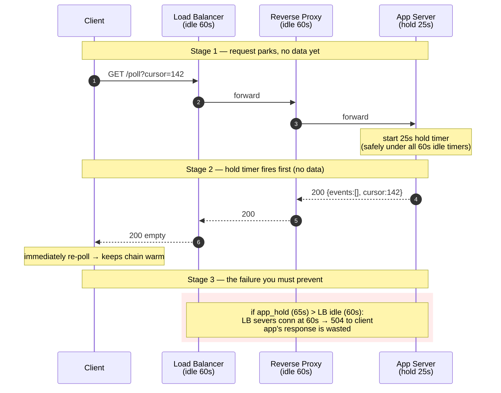
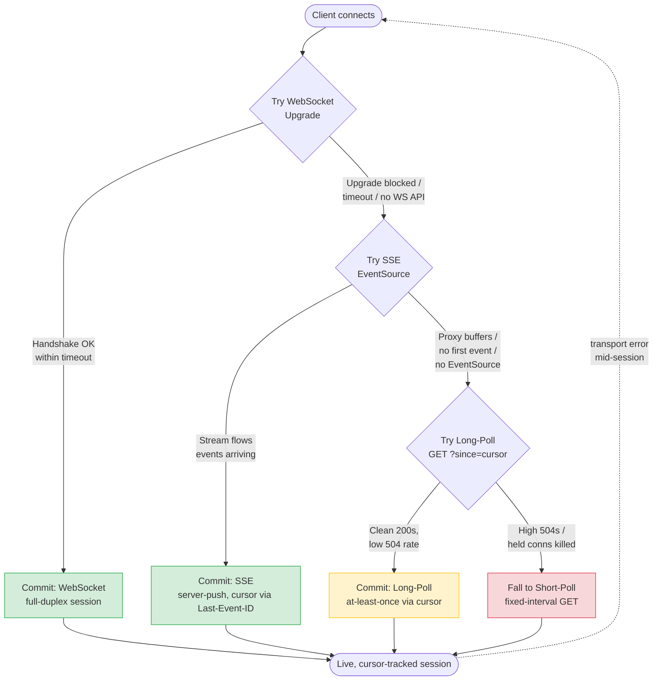

# Long-Polling & Streaming — Senior

<!-- level-focus -->
At senior level, focus on this question:

> Which system invariant is affected by **Long-Polling & Streaming** under failure, load, and change?

Use the smallest realistic scenario that exposes the decision and its failure behavior.
## 1. The Resource Cost of a Held-Open Request

Short-polling and long-polling differ in one decisive way: a short poll returns immediately and frees its slot; a long poll *parks*. The server accepts the request, finds no new data, and holds the socket open — for 25, 30, maybe 60 seconds — until data arrives or a timer fires. During that entire window the request occupies a live TCP connection and whatever server-side resource is bound to it.

That "whatever resource" is the crux. On a thread-per-connection server it is an OS thread (roughly 0.5–1 MB of stack plus scheduler overhead). On an event-loop server it is a file descriptor plus a few kilobytes of heap state. The difference is two to three orders of magnitude, and it decides whether your fleet survives ten thousand concurrent waiters or falls over at a few hundred.

Do the arithmetic for a modest real-time feature. Suppose 50,000 users each hold one long-poll open, and your average hold time is 30 s. At any instant you have **50,000 concurrent parked connections**. If each parked request costs a thread with a 1 MB stack, that is **~50 GB of stack memory** before you write a single line of business logic — clearly impossible on commodity hardware. On an event-loop server at ~10 KB per idle connection, the same 50,000 waiters cost **~500 MB**: comfortable on one box.

There is a second, subtler cost: **the reconnect storm**. Every time a long poll returns (data delivered or timeout hit), the client immediately re-issues. With a 30 s cycle and 50,000 clients, you absorb `50,000 / 30 ≈ 1,667 new requests/second` of pure reconnection churn — TLS handshakes, auth, routing — even when nothing is happening. Streaming transports (SSE, WebSocket) amortize that setup once per session; long-poll pays it on every cycle. Senior owners budget for the churn, not just the steady state.

Key cost dimensions to hold in your head:

- **Connection slots** — every parked request is one live socket against LB, proxy, and app limits.
- **Worker/thread occupancy** — the model (blocking vs async) sets the per-connection memory floor.
- **Reconnect overhead** — TLS + auth + routing per cycle, multiplied by `clients / hold_time`.
- **File-descriptor ceilings** — `ulimit -n`, `net.core.somaxconn`, ephemeral port range all bite before RAM does.

## 2. Thread-per-Connection vs Event-Loop: The C10K Wall

The **C10K problem** (Dan Kegel, 1999) named the barrier: how do you serve ten thousand concurrent clients on one machine? A blocking, thread-per-connection server cannot — the threads alone exhaust memory and drown the scheduler in context switches long before you reach 10K. Long-polling is precisely a C10K workload because *idle* connections are the whole point: most parked requests are doing nothing but waiting.

The escape is an **async / event-loop** architecture (epoll on Linux, kqueue on BSD, IOCP on Windows), where one thread multiplexes thousands of sockets and only wakes for the ones with activity. This is why long-polling and streaming belong on Node.js, Go (goroutines over netpoller), Netty/Vert.x, nginx, or Python's asyncio — and why dropping them onto a classic synchronous Apache-prefork or a fixed Rails/PHP-FPM worker pool is a capacity trap.

| Dimension | Thread-per-connection (blocking) | Event-loop / async |
|---|---|---|
| Per-idle-connection cost | ~0.5–1 MB (thread stack) | ~2–10 KB (fd + heap state) |
| Concurrent parked conns (per box) | Hundreds to low thousands | Tens of thousands to 100K+ |
| Idle-heavy workload (long-poll) | Falls over — threads all blocked | Ideal — idle costs almost nothing |
| Context-switch overhead | High under load | Minimal (one loop thread) |
| Failure mode at saturation | Thread-pool exhaustion → all requests queue | fd exhaustion / backpressure (graceful-ish) |
| Representative stacks | Apache prefork, sync Rails/PHP-FPM, Java servlet-per-thread | Node, Go, Netty, Vert.x, nginx, asyncio |

The operational tell that you are on the wrong side of this table: **latency for *unrelated* endpoints climbs whenever long-poll traffic rises.** That coupling means parked long-polls are eating threads the rest of your app needs. The fix is architectural (move real-time onto an async tier or a dedicated service), not a config knob.

Isolate the real-time tier. Put long-poll/SSE/WS endpoints on their own async service so that a spike in parked connections cannot starve your synchronous request/response API. This also lets you scale and tune the two workloads independently — the long-poll tier is memory-and-fd bound, the API tier is CPU bound.

## 3. Timeout Tuning Across the Whole Chain

This is where most long-polling deployments silently fail. A long-poll request passes through several intermediaries, each with its own **idle timeout** — the maximum time it will keep a connection open with no bytes flowing. If your application's hold time exceeds *any* of them, that intermediary kills the connection first — usually returning a **504 Gateway Timeout** to the client instead of your clean, empty 200/204 "no data yet" response.

The invariant is one line and you should memorize it:

> **`app_hold_time < min(all upstream idle timeouts)`** — with margin.

Walk the chain from browser to backend and note every timer:

Concrete numbers for a typical AWS-style stack:

| Hop | Timeout knob | Default | Set to |
|---|---|---|---|
| App hold timer | your code | — | **25 s** (the anchor) |
| Nginx reverse proxy | `proxy_read_timeout` | 60 s | ≥ 30 s |
| ALB / ELB | idle timeout | 60 s | ≥ 30 s |
| CDN / API gateway | origin/response timeout | 30–60 s | ≥ 30 s |
| Client `XMLHttpRequest` | request timeout | none/long | ≥ 30 s |
| Corporate proxy (uncontrolled) | idle timeout | **unknown, often 30–60 s** | assume the worst |

Set the app hold time first, as the anchor, and make every timer *above* it strictly larger. The reason for a short hold like 25 s rather than a greedy 5-minute hold is exactly the unknown corporate proxy in the last row: you do not control it, so keeping holds under ~30 s survives most default enterprise proxy configurations. A held connection that gets guillotined mid-flight not only wastes work — it also loses the in-flight response, which is why delivery guarantees (next section) must not depend on the response ever arriving.

A practical detection tactic: instrument the ratio of **clean timeouts (your empty 200s) vs 504s**. A rising 504 rate is the canonical signal that some timer in the chain drifted below your hold time — often after an infra change you did not make.

## 4. Message Delivery Guarantees: Cursors, At-Least-Once, Dedup

Long-poll has a structural gap: between one poll returning and the next one arriving, the client is **disconnected**. Any event produced in that window must be buffered server-side and handed over on the next poll — or it is lost. The mechanism that makes this reliable is the **cursor** (a.k.a. offset, sequence number, `Last-Event-ID`, or opaque continuation token).

The contract is simple and you should enforce it on both ends:

1. Every event carries a **monotonic cursor**.
2. The client sends its **last-seen cursor** on each poll: `GET /poll?since=142`.
3. The server returns only events with cursor `> 142`, plus the new high-water cursor.
4. The client advances its stored cursor **only after** it has durably processed the batch.

This gives you **at-least-once** delivery, which is the honest guarantee for any transport that can lose a response mid-flight (recall Stage 3 above: a 504 can eat a response the server believed it delivered). Exactly-once over the network is a fiction; the achievable and correct design is **at-least-once + idempotent client**.

Consequences you must design for:

- **The client must dedup.** Because a batch can be re-delivered (client advanced nothing after a failed poll), the client keeps a small set of recently seen event IDs, or its processing is naturally idempotent (e.g., "set state to X" rather than "increment by 1"). Cursor-based dedup — "ignore anything ≤ my stored cursor" — handles the common re-poll-after-timeout case for free.
- **The server buffer needs bounds.** You cannot hold events forever for a client that vanished. Keep a bounded, TTL'd per-topic buffer (a Redis sorted-set keyed by cursor is a common pattern). When a client's `since` cursor falls off the back of the buffer, you must detect the gap and signal a **resync** (send a snapshot + new cursor) rather than silently skipping data.
- **Ordering is per-cursor-stream.** Guarantees hold within one monotonic stream. Fan-out across shards or topics needs per-stream cursors, not one global counter.

| Guarantee | How to get it with long-poll | Cost / caveat |
|---|---|---|
| At-most-once | Fire-and-forget, no cursor | Lossy on any timeout — rarely acceptable |
| **At-least-once** | Cursor + server buffer + client dedup | The correct default; requires idempotent client |
| Exactly-once | Not achievable over lossy transport | Approximate via at-least-once + dedup |
| Ordered (per stream) | Monotonic cursor, single stream | Breaks across shards without per-stream cursors |
| Gap detection | Bounded buffer + resync-on-miss | Needs snapshot path for cursor-too-old |

The senior insight: **the cursor protocol is transport-independent.** The exact same `since`/`Last-Event-ID` cursor machinery serves SSE reconnection and WebSocket resume. Design the cursor contract once, at the application layer, and every rung of the degradation ladder inherits it. That is what makes graceful fallback *possible* rather than a rewrite per transport.

## 5. Long-Poll as a Fallback Tier, Not a First Choice

Be blunt about this in design reviews: **in 2020s greenfield systems, long-poll is not your first choice.** When the environment permits, **WebSocket** (full-duplex, lowest per-message overhead) or **Server-Sent Events** (one-way server→client, dead simple, auto-reconnect built into `EventSource`) beat long-poll on latency, on server cost, and on operational simplicity. Long-poll's per-cycle reconnect churn and buffering complexity are pure overhead that streaming transports avoid.

So why does long-poll still matter, and why should you still implement it? Because **some environments break the better transports**, and you rarely control those environments:

- **Restrictive corporate proxies** that buffer or strip streaming responses, breaking SSE's chunked flow, or that block the WebSocket `Upgrade` handshake outright.
- **Very old clients / browsers / SDKs** without `EventSource` or a usable WebSocket API.
- **Intermediaries that misbehave with long-lived connections** — some legacy proxies terminate anything that stays open "too long" but happily pass ordinary HTTP request/response pairs, which is exactly what long-poll looks like on the wire.

Long-poll's superpower is that it is **indistinguishable from a plain, slightly-slow HTTP request**. Nothing in the network stack needs to understand streaming or upgrades. That universality is why it endures as the **last reliable rung** below WS and SSE — the transport that still works when the fancier ones are silently mangled by middleboxes you cannot see or fix.

The mature posture: **build streaming-first, keep long-poll as the guaranteed floor.** You are not choosing long-poll *instead of* SSE/WS; you are choosing to *always have* long-poll so that a client behind a hostile proxy still gets real-time-ish updates rather than nothing. This is exactly the philosophy behind libraries like Socket.IO, SockJS, and SignalR — a single logical API that negotiates the best available transport and degrades gracefully.

## 6. The Transport Degradation Ladder

The negotiation follows a fixed preference order: try the best transport first, fall back one rung whenever a probe fails. Owners should be able to recite this ladder and, critically, the *signal that triggers each step down*.

| Rung | Transport | Direction | When it wins | Falls to next when… |
|---|---|---|---|---|
| 1 | **WebSocket** | Full-duplex | Interactive, high-frequency, bidirectional (chat, games, collab) | `Upgrade` handshake blocked/fails, or no WS API |
| 2 | **SSE** | Server → client | One-way streams (feeds, notifications, live prices) | Proxy buffers/strips chunked stream; no `EventSource` |
| 3 | **Long-poll** | Request/response | Restrictive proxies, old clients; low-to-moderate update rate | Even held connections get killed / high 504 rate |
| 4 | **Short-poll** | Request/response | Absolute worst case; any HTTP works; freshness can lag | (Floor — always works, at cost of latency + load) |

Reading the ladder as an owner:

- **Latency and server efficiency degrade as you descend.** WS pushes with microseconds of framing overhead; short-poll may be seconds stale and hammers the server with empty requests.
- **Compatibility *improves* as you descend.** Short-poll works literally everywhere HTTP works, which is why it is the floor and never removed.
- **Most clients never leave rung 1 or 2.** The lower rungs exist for the tail — the corporate-proxy and legacy-client minority — but that tail is often the enterprise customers who pay the most, so you cannot drop it.
- **The cursor protocol (Section 4) spans all four rungs**, which is what lets a client move down the ladder mid-session without losing or duplicating events.

Track *which rung each client landed on* as a first-class metric. A sudden spike in rung-3/rung-4 usage from a particular corporate ASN or region is an early warning that a customer's new proxy or firewall is breaking your streaming transports — actionable intelligence you would otherwise miss.

## 7. Staged Fallback Negotiation

Negotiation is not "try everything and race." It is a **staged probe-and-commit**: attempt the top rung, watch for a fast success signal, and step down deterministically on failure. Here is the canonical flow (Socket.IO's model, generalized).

Design rules that make this robust:

- **Probe with a short, fast timeout at each rung.** A WebSocket upgrade that has not completed in ~3–5 s is treated as a failure and you drop to SSE. Do not let a client hang for 60 s hoping a blocked upgrade will complete.
- **Fall back *silently and once*, not on a loop.** Once a client commits to a rung, stay there for the session. Re-probing WS every few seconds from a client that is permanently behind a WS-blocking proxy is wasted load and log noise.
- **Sticky routing matters.** During negotiation and for a parked long-poll, the client should reach the same backend (or a shared coordination layer like Redis pub/sub) so buffered events and cursor state are consistent. Consistent hashing or session affinity at the LB handles this; a shared bus removes the affinity requirement entirely.
- **Carry the cursor through every transition.** When a client drops from SSE to long-poll mid-session, it hands over its `Last-Event-ID` as the long-poll `since` cursor. Because the cursor protocol is transport-independent, the switch is seamless — no gap, no duplicate beyond what the client already dedups.
- **`mid-session error → renegotiate from the top.`** A dropped session restarts the ladder; conditions may have changed (roaming off the corporate network, proxy reconfigured), so it is worth re-attempting WebSocket rather than assuming the client is stuck.

## 8. Operating It: Metrics, Capacity, Failure Modes

Owning this transport means having numbers, not vibes. The dashboard for a long-poll / streaming tier centers on these signals:

- **Concurrent parked connections** — the primary capacity number. Alert well before your fd/thread ceiling. This is the metric that tells you how close you are to the C10K wall on each box.
- **504 rate on poll endpoints** — the canonical "a timeout in the chain drifted below my hold time" alarm (Section 3). Should be near zero; any sustained rise means an intermediary is severing connections.
- **Transport-rung distribution** — what fraction of clients are on WS / SSE / long-poll / short-poll, sliced by region and ASN (Section 6). Rising lower-rung usage flags an emerging proxy problem.
- **Reconnect rate** — per-cycle churn; a proxy for the setup overhead you are paying (Section 1). Spikes can indicate flapping.
- **Buffer eviction / resync rate** — how often clients fall off the back of the server buffer and need a snapshot (Section 4). High values mean the buffer is too small or clients are gone.
- **End-to-end delivery latency** — event-produced to event-acked. This is what the *user* feels and the reason real-time exists.

Capacity planning shortcut: `max_concurrent_clients ≈ boxes × conns_per_box`, where `conns_per_box` is bounded by the *smaller* of memory and file descriptors — on an async server it is almost always the fd/port ceiling (`ulimit -n`, ephemeral port range), not RAM. Raise `ulimit -n`, tune `net.core.somaxconn` and `net.ipv4.ip_local_port_range`, and confirm the LB's per-target connection limit is not the real bottleneck.

The three failure modes you will actually meet:

1. **Silent 504 storm** after an infra change (LB idle timeout lowered under your hold time). Detection: 504 rate. Fix: re-anchor the timeout invariant.
2. **Thread/fd exhaustion** when parked connections outgrow the box, coupling latency into unrelated endpoints. Detection: parked-conn count + cross-endpoint latency correlation. Fix: async tier isolation, higher fd limits, more boxes.
3. **Lost events across the poll gap** because the server buffer was too small or non-durable. Detection: eviction/resync rate + client-side gap reports. Fix: bounded-but-adequate durable buffer, cursor gap detection, snapshot resync path.

## 9. Owner Checklist

- [ ] Real-time endpoints run on an **async / event-loop tier**, isolated from the synchronous API, so parked connections cannot starve it.
- [ ] `app_hold_time < min(all upstream idle timeouts)` holds with margin; hold time is short (~25 s) to survive **unknown corporate proxies**.
- [ ] The chain's every timeout (client, CDN, LB, proxy, app) is documented and monitored; **504 rate on poll endpoints is a first-class alert**.
- [ ] Delivery is **at-least-once via a transport-independent cursor**; the client is idempotent / dedups; the server buffer is bounded with a **resync-on-cursor-too-old** path.
- [ ] The system is **streaming-first (WS → SSE)** with long-poll → short-poll as the **guaranteed degradation floor** for hostile proxies and legacy clients.
- [ ] Negotiation is **staged probe-and-commit with fast per-rung timeouts**, sticky routing (or a shared bus), and **cursor carried across transitions**.
- [ ] Dashboards cover **parked-conn count, 504 rate, transport-rung distribution (by ASN/region), reconnect rate, buffer eviction, and delivery latency**.
- [ ] fd/port ceilings (`ulimit -n`, `somaxconn`, ephemeral ports, LB per-target limits) are raised and understood as the **true capacity bound**, not RAM.

## 10. Next Step

Senior ownership is knowing the costs, the timeout invariant, the delivery contract, and the degradation ladder — and being able to quantify each. The professional level goes further: running this transport at large scale across many failure domains, negotiating SLAs on delivery latency, and making the buy-vs-build call on managed real-time platforms versus a self-operated tier.

*Next step:* [Professional level](professional.md)

---

## Apply it

1. State the system invariant that **Long-Polling & Streaming** must protect.
2. Mark ownership, state, and failure propagation at each boundary.
3. Compare two designs under load, dependency failure, and future change.
4. Define recovery and compatibility behavior before implementation.
5. Test the riskiest assumption with a focused experiment.

## Verify your work

- The experiment supports the design with evidence, not preference.
- Failure injection shows the blast radius and recovery path.
- Compatibility checks cover old and new callers or data.
- Operational signals reveal invariant violations and recovery progress.

## Review questions

- Which invariant must remain true when Long-Polling & Streaming fails?
- Where should recovery responsibility live, and why?
- Which assumption deserves an experiment before implementation?
- How can the design evolve without changing every consumer at once?
