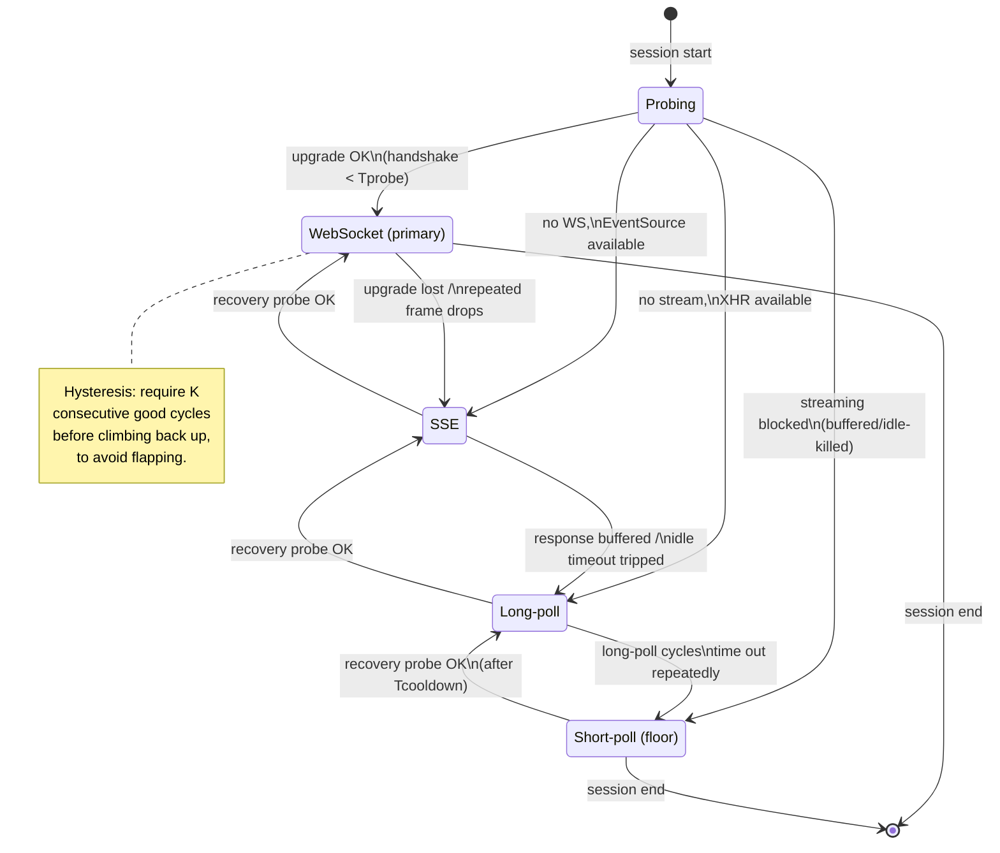

# Long-Polling & Streaming — Staff / Principal Level

At the staff level, long-polling and streaming stop being a protocol choice and become a *portfolio* decision. You are not asking "which transport is best?" — you are asking "how many transports must the org fund, who owns the degradation ladder, and what fraction of revenue depends on the ugliest tier still working?" This page treats real-time transport as an availability, cost, and organizational problem: why the humble long-poll survives in a WebSocket world, how to make degradation a first-class engineering artifact instead of an accident, and how to decide whether the fallback tier earns its keep.

## Table of Contents

1. [The strategic framing: transport as a portfolio](#1-the-strategic-framing-transport-as-a-portfolio)
2. [Why long-poll survives: the lowest common denominator](#2-why-long-poll-survives-the-lowest-common-denominator)
3. [Which users actually need the fallback](#3-which-users-actually-need-the-fallback)
4. [The degradation ladder as an availability decision](#4-the-degradation-ladder-as-an-availability-decision)
5. [The transport-negotiation state machine](#5-the-transport-negotiation-state-machine)
6. [Ownership: who is on the hook for the ladder](#6-ownership-who-is-on-the-hook-for-the-ladder)
7. [Does the fallback tier earn its keep? Measuring the fallback rate](#7-does-the-fallback-tier-earn-its-keep-measuring-the-fallback-rate)
8. [Capacity planning: the fallback is heavier per message](#8-capacity-planning-the-fallback-is-heavier-per-message)
9. [Abstractions that hide it: Socket.IO, SignalR, and operational opacity](#9-abstractions-that-hide-it-socketio-signalr-and-operational-opacity)
10. [Testing the tiers you hope never run](#10-testing-the-tiers-you-hope-never-run)
11. [The standardization decision: kill a tier or keep it](#11-the-standardization-decision-kill-a-tier-or-keep-it)
12. [Staff signals and anti-patterns](#12-staff-signals-and-anti-patterns)

---

## 1. The strategic framing: transport as a portfolio

A single real-time feature — presence, a live feed, a trading ticker, a collaborative cursor — can be delivered over WebSocket, Server-Sent Events, long-polling, or short-polling. Each has a different reachability, a different per-message cost, and a different operational failure mode. The naive org picks one and ships. The staff engineer recognizes that **no single transport reaches 100% of a large, heterogeneous user base**, and that the transport is not chosen once at design time — it is *negotiated per session*, and re-negotiated when the network changes underneath a live connection.

The portfolio framing forces three questions that a "just use WebSocket" decision hides:

- **Reachability tail.** What percentage of your sessions physically cannot hold the primary transport, and what is that tail worth in revenue, retention, or safety? A 2% tail on a consumer app is a rounding error; a 2% tail on a hospital's clinical alerting is a lawsuit.
- **Blast radius.** If the primary transport degrades globally (a CDN pushes a bad config, a proxy vendor changes buffering behavior), does the whole feature go dark, or does it silently fall back a rung and keep working at reduced quality?
- **Carrying cost.** Every extra tier is code paths, dashboards, on-call runbooks, and load tests that must be exercised. The tier that is never tested is not a fallback — it is a latent outage.

The rest of this page is the machinery for answering those three questions with numbers rather than opinions.

## 2. Why long-poll survives: the lowest common denominator

WebSocket and SSE are strictly better transports for the *happy path*. Long-polling survives because a meaningful, non-negligible slice of the internet is not the happy path. The failure is almost never the browser — it is the network between the browser and your edge:

- **Corporate forward proxies and TLS-inspecting middleboxes.** Many enterprise proxies do not understand the HTTP `Upgrade` handshake, buffer responses until the connection closes (killing SSE and long-poll-with-chunking), or terminate any idle-looking connection at 30–60 seconds. A WebSocket that never completes its upgrade and an SSE stream that is buffered into oblivion both fail. A plain long-poll — a normal `GET` that returns a normal `200` with a full body — sails through, because to the proxy it is indistinguishable from any other request/response.
- **Legacy and locked-down browsers.** Kiosks, embedded webviews, government/enterprise-mandated old browsers, and some smart-TV/set-top runtimes lack reliable WebSocket or `EventSource`. Long-poll needs only `XMLHttpRequest`.
- **Hostile or lossy mobile networks.** Some carrier NATs and captive portals mangle upgraded connections but pass ordinary request/response fine.
- **Aggressive load balancers and serverless platforms.** Some managed platforms cap connection duration or don't support bidirectional streaming; long-poll degrades to short-poll cleanly there.

Long-poll is the **universal lowest common denominator**: if a client can make an HTTP request and read a response body, long-poll works. That is the entire value proposition. It is not fast, it is not cheap, and it is not elegant — it is *reachable*. In a portfolio, you keep it for the same reason an airline keeps a manual fallback for a fly-by-wire system: not because you expect to use it, but because the cost of the tail having no path at all is unacceptable.

## 3. Which users actually need the fallback

The strategic mistake is treating "needs fallback" as uniform. It is not — it clusters sharply by environment. Model it explicitly so you can size the tier and decide whether it is worth funding.

| User / network segment | Primary transport usually works? | Typical failure mode | Falls back to | Business weight |
|---|---|---|---|---|
| Modern browser, home broadband | Yes (WS) | — | — | Bulk of traffic |
| Modern browser, mobile carrier NAT | Mostly (WS/SSE) | Intermittent upgrade drops, idle timeouts | SSE → long-poll | High volume, tolerant |
| Corporate desktop behind inspecting proxy | Often no | `Upgrade` stripped, response buffered | long-poll | High value (B2B seats) |
| Government / regulated enterprise, old browser | No | No WS, no `EventSource` | long-poll → short-poll | High value, low churn tolerance |
| Embedded webview / kiosk / set-top | Varies | Missing APIs, forced HTTP/1.0 proxies | long-poll | Niche but contractual |
| Serverless/edge-hosted client callbacks | No persistent conn | Platform caps connection duration | long-poll / short-poll | Depends on product |
| Automated clients / integrations / bots | N/A (by design) | They *want* simple request/response | short-poll or webhook | Partner-facing |

Two staff-level reads of this table. First, **the fallback population is disproportionately your paying, low-churn, high-support-cost users** — enterprise seats behind the exact proxies that break WebSocket. The fallback tier's traffic share understates its revenue share. Second, **not every "can't hold WS" case wants the same rung.** Automated integrators do not want a held-open connection at all; pushing them onto long-poll wastes your capacity and theirs. The right move for that segment is often a *different pattern entirely* (webhooks), not the next rung down. Degradation is not a single ladder for everyone.

## 4. The degradation ladder as an availability decision

The canonical ladder is **WebSocket → SSE → long-poll → short-poll**, ordered by capability and efficiency descending, and by reachability ascending. Each rung down trades real-time quality for a higher chance the transport survives the network in front of it.

| Rung | Directionality | Reachability | Per-message overhead | Latency profile | When it's the right floor |
|---|---|---|---|---|---|
| WebSocket | Full duplex | Lowest (breaks behind hostile middleboxes) | Minimal (framing only, one connection) | Push, sub-ms after connect | Interactive, high-frequency, bidirectional |
| SSE | Server→client only | Medium (needs unbuffered streaming) | Low (one long-lived response) | Push, low | Server-push feeds, no client→server stream needed |
| Long-poll | Half duplex via re-request | Highest that still feels "live" | High (new request per message-ish) | Near-real-time, request setup per cycle | Universal fallback, moderate message rate |
| Short-poll | Request/response | Highest, works literally everywhere | Highest per delivered event (mostly empty polls) | Bounded by poll interval | Last resort; low update rate; automated clients |

Treating this as an **availability decision** (not a performance one) changes how you reason about it. The ladder is a graceful-degradation mechanism: the feature's *availability SLO* should be defined against "the user receives updates within N seconds by *some* transport," not against "the WebSocket stays up." Under that definition, a global WebSocket incident that auto-falls-back to long-poll is a latency regression, not an outage — and your incident severity, paging, and error budget accounting should reflect that. The single biggest lever a staff engineer has here is reframing "WS is down" from SEV-1 to SEV-3 *by making the ladder real and automatic.* That reframing is only legitimate if the lower rungs are actually exercised (see §10); otherwise you are counting on an untested code path during your worst hour.

## 5. The transport-negotiation state machine

Negotiation must handle three regimes: initial selection, mid-session degradation (the network changed under a live connection), and *recovery* back up the ladder (which most implementations skip, and which is where budget silently leaks). Model it as an explicit state machine with capability probing, timeouts, and hysteresis.

Design points the state machine makes explicit:

- **Probe with a deadline, not a hope.** The first WebSocket upgrade or SSE open must be raced against a timer (`Tprobe`, typically a few seconds). A middlebox that silently buffers will *look* like a slow connect forever; without a deadline the client hangs on a dead primary instead of dropping a rung.
- **Degrade on *evidence*, not on a single blip.** One dropped frame is a network hiccup; three failed reconnects inside a window is a structural problem. Encode a threshold so transient loss doesn't demote everyone.
- **Recovery needs hysteresis.** Climbing back up on the first good probe causes flapping when the network is marginal — the classic symptom is a session oscillating WS↔long-poll every 30 seconds, doubling connection churn. Require K consecutive healthy cycles and a cooldown before promoting.
- **Cap the floor per segment.** Automated/integration clients should be pinned at short-poll or off the ladder entirely; interactive clients should never silently sit on short-poll without emitting a signal, because that means the whole ladder above them failed and you want to know.

## 6. Ownership: who is on the hook for the ladder

A degradation ladder with no owner degrades into "whoever last touched the client." Staff-level clarity means naming an accountable team for the *ladder as a whole*, not just the individual transports.

- **Platform / real-time infra team owns the negotiation contract.** The state machine, the capability-probe protocol, the shared client SDK, and the server-side handlers for every rung. This is the team that can be paged when "SSE is silently being buffered by a customer's new proxy" and that owns the load tests for each tier.
- **Product/feature teams own the *SLO*, not the transport.** They declare "updates within N seconds" and consume the SDK. They must *not* reach past the SDK to open raw sockets, because that fragments the ladder and creates untested paths.
- **Edge/networking team owns the middlebox reality.** LB idle timeouts, proxy buffering config, HTTP/2 vs HTTP/1.1 behavior at the edge — the settings that decide whether SSE and long-poll survive the last mile are usually theirs, and a change there can silently push traffic down a rung.

The recurring failure is a **split-brain ladder**: the client team implements fallback, the server team doesn't fully support the lower rungs, and the edge team changes a timeout that invalidates both. The fix is a single owning team with an explicit interface contract and a shared, versioned integration test that all three run against. If you cannot name the owner of the ladder in one sentence, the ladder is decorative.

## 7. Does the fallback tier earn its keep? Measuring the fallback rate

You cannot manage the portfolio without instrumenting it. The single most important number is the **fallback rate**: the fraction of sessions (and, separately, of *weighted business value*) that end up below the primary transport. Emit, per session, the transport it settled on, why it degraded, and the segment it belongs to.

Key metrics:

- **Fallback rate by tier** — % of sessions on WS / SSE / long-poll / short-poll. Trend it. A slow rise in long-poll share often means a middlebox or edge-config regression, not a client bug.
- **Value-weighted fallback rate** — the same, weighted by revenue/retention. This is what justifies (or kills) the tier. A 1.5% session fallback rate that carries 12% of enterprise ARR is a tier you keep.
- **Degradation cause histogram** — upgrade-stripped, response-buffered, idle-timeout, missing-API. This tells you *whether the tail is shrinking on its own* as the browser/proxy ecosystem modernizes.
- **Recovery success rate** — how often sessions climb back up. Low recovery + high long-poll share = you are paying long-poll costs for sessions that could hold WS but never re-probe.

The decision rule is blunt: **if the value-weighted fallback rate for a tier trends toward zero and the causes are legacy environments that are demonstrably disappearing, schedule the tier's deprecation.** If it is flat or rising and concentrated in high-value segments, the tier is load-bearing and any "let's just standardize on WebSocket" proposal is proposing to drop those users. Bring the number to that meeting.

## 8. Capacity planning: the fallback is heavier per message

The uncomfortable truth that makes standardization tempting: **long-poll and short-poll are dramatically more expensive per delivered message than WebSocket or SSE.** A held-open WebSocket carries a message as a small frame over an existing connection. A long-poll delivers roughly one message per full HTTP request/response cycle — new (or reused-but-revalidated) connection handling, full request headers and cookies inbound, response headers outbound, TLS record framing, and a fresh trip through the LB, auth, and routing layers *for each message-ish*. Short-poll is worse: most polls return empty, so you pay the full round-trip cost to deliver *nothing* the majority of the time.

Concrete planning implications (order-of-magnitude, model with your own numbers):

- **Header and TLS tax.** At high fan-out, per-request headers (cookies, auth tokens, tracing) can dwarf the payload. A 200-byte update wrapped in 1–2 KB of headers per long-poll cycle is a 5–10× amplification versus a WebSocket frame.
- **Connection churn and ephemeral ports.** Long-poll cycles reconnect frequently; at scale this stresses connection tables, ephemeral port ranges, and TLS-handshake CPU on your edge, even with keep-alive. Size the LB and edge for *cycles per second*, not *concurrent connections*.
- **Empty-poll waste (short-poll).** If updates arrive every 5 minutes but clients poll every 10 seconds, ~97% of requests are wasted round trips. Short-poll capacity scales with *poll frequency × client count*, decoupled from actual event rate — the worst scaling law in the portfolio.
- **Message rate sensitivity.** Long-poll's overhead is amortized *per cycle*, so it is tolerable for low-to-moderate message rates and catastrophic for chatty, high-frequency streams. This is why a chat presence feed can survive on long-poll but a live orderbook cannot.

The staff move: capacity-plan the fallback tiers *separately* from the primary, because their cost curves are different in kind. Budget the fallback for its *peak* — which often coincides with your worst moment, since a global WebSocket incident dumps the entire user base onto long-poll simultaneously. The fallback tier must be sized for "everyone lands here at once," or the graceful-degradation story collapses into a second, correlated outage.

## 9. Abstractions that hide it: Socket.IO, SignalR, and operational opacity

Libraries like Socket.IO (Node) and SignalR (.NET) exist precisely to hide this ladder: they present one API and internally negotiate and fall back across transports. They are genuinely valuable — they encode a battle-tested negotiation machine you would otherwise build and get subtly wrong. The staff-level tension is **convenience versus operational opacity.**

| Dimension | Roll-your-own ladder | Managed abstraction (Socket.IO / SignalR) |
|---|---|---|
| Time to first working feature | Slow | Fast |
| Transport negotiation correctness | Your bugs to find | Encoded, widely tested |
| Visibility into *which* transport a session uses | Whatever you instrument | Often hidden unless you dig into internals |
| Sticky-session / affinity requirements | Explicit, your choice | Often *required* (e.g. Socket.IO long-poll needs session affinity), constrains LB & scaling |
| Protocol lock-in | None | Custom wire protocol; client and server must match versions |
| Debugging a stuck session | Your logs | Framework internals; harder to trace across the fallback boundary |
| Scaling out (multi-node) | Your design | Needs an adapter/backplane (Redis, Azure SignalR Service); another dependency |

The opacity bites in three predictable ways. **(1) Hidden affinity requirements:** several abstractions require sticky sessions specifically because their long-poll fallback threads a session across multiple HTTP requests that must hit the same node — a constraint that silently rules out naive round-robin load balancing and complicates autoscaling. **(2) The fallback is invisible until it's a bill:** teams ship on the abstraction, never look at the transport breakdown, and discover months later that 15% of sessions are on the expensive long-poll path — the abstraction happily degraded them and never raised its hand. **(3) Cross-version fragility:** the custom wire protocol means client and server library versions are coupled; an SDK upgrade can break negotiation for old clients you can't force-update.

The staff position is not "avoid the abstraction." It is: **if you adopt it, you still own the observability.** Export the transport breakdown, alert on fallback-rate anomalies, understand and provision for its affinity/backplane requirements, and treat the library's negotiation as a dependency with its own failure modes — not as a solved problem you can stop thinking about.

## 10. Testing the tiers you hope never run

A fallback tier that is not tested continuously is not a fallback — it is an unexploded outage that will detonate during your worst incident, when the primary is already down and the lower rung takes live traffic for the first time in months. The entire availability argument in §4 is a lie unless the lower rungs are exercised on purpose.

- **Synthetic clients pinned per tier.** Run monitors that *force* SSE-only, long-poll-only, and short-poll-only, continuously, in production. They alert the moment a rung breaks — independently of whether real users are on it yet.
- **Middlebox simulation in the test env.** Put a buffering/`Upgrade`-stripping proxy in front of a staging environment so CI can prove that a client behind a hostile proxy correctly degrades to long-poll and still receives updates. This catches edge-config regressions before they ship.
- **Game-day: kill the primary.** Periodically disable WebSocket for a canary cohort and confirm the fleet degrades gracefully, capacity holds for the fallback surge, and the SLO ("updates within N seconds") is still met. This is the only honest way to validate the §8 "everyone lands here at once" assumption.
- **Recovery tests.** Verify sessions climb *back up* after the network heals, with hysteresis, without flapping. The most common untested behavior is recovery, and its absence quietly inflates fallback cost.

If you cannot point to a green test that proves long-poll works behind a hostile proxy *today*, you do not have a fallback tier — you have a hope.

## 11. The standardization decision: kill a tier or keep it

Every extra tier is permanent carrying cost: code, dashboards, runbooks, on-call knowledge, load tests, and a wider matrix of "which transport × which failure" incidents. The pressure to standardize on one transport is legitimate and should be revisited on a schedule. Decide it with the data from §7 and the cost model from §8, not with aesthetics.

Keep the fallback tier when: the value-weighted fallback rate is non-trivial and flat/rising; the tail is concentrated in high-value, low-churn-tolerance segments; the degradation causes are structural (proxies, regulated environments) rather than transiently modernizing; or the feature is safety/revenue-critical enough that *any* dark session is unacceptable.

Retire a fallback tier when: its value-weighted fallback rate trends to near-zero; its degradation causes are legacy environments verifiably disappearing (measure, don't assume); the carrying cost (incident load, test surface, the affinity constraints it forces on your LB) demonstrably exceeds the revenue it protects; and you can migrate the residual users to an *alternative pattern* (webhooks for integrators, a native app path for kiosks) rather than stranding them. Retire it explicitly and gradually — announce, migrate the known holdouts, watch the fallback rate, then remove — never by silent code deletion that turns a 1% tail into a 1% outage.

The one standardization move that is almost always wrong: dropping the universal lowest-common-denominator tier (long-poll → short-poll) *first* because it is the ugliest. It is ugly precisely because it is the last thing reaching your hardest-to-reach, often highest-value users. Kill middle rungs before you kill the floor.

## 12. Staff signals and anti-patterns

**Signals of staff-level judgment:**

- Frames real-time transport as an availability + cost portfolio, and defines the SLO against "updates delivered by *some* transport within N seconds," not against a specific connection staying up.
- Instruments and reports the **value-weighted** fallback rate, and uses it to drive keep/kill decisions with numbers.
- Names one accountable owner for the whole ladder and enforces a single SDK/negotiation contract so no team opens raw sockets around it.
- Capacity-plans the fallback tiers separately, sized for "everyone lands here at once," and continuously tests the lower rungs in production behind simulated hostile middleboxes.
- Adopts abstractions like Socket.IO/SignalR with eyes open — owning the observability, the affinity/backplane cost, and the version-coupling risk rather than treating them as solved.

**Anti-patterns:**

- "Just use WebSocket" with no measured picture of the reachability tail — silently dropping the enterprise seats behind inspecting proxies.
- A degradation ladder that exists in the client but has never been exercised, so the fallback path takes live traffic for the first time during the primary's outage.
- Counting a WebSocket incident as a full outage despite a working fallback (mis-severity), or the reverse — assuming a fallback exists when it's untested.
- No hysteresis on recovery, causing sessions to flap between rungs and double connection churn.
- Killing the lowest-common-denominator tier first because it's ugly, stranding the hardest-to-reach users.
- Sizing the fallback for its steady-state share instead of its incident-time peak, turning a graceful degradation into a second correlated outage.

---

*Next step:* [Interview questions](interview.md)