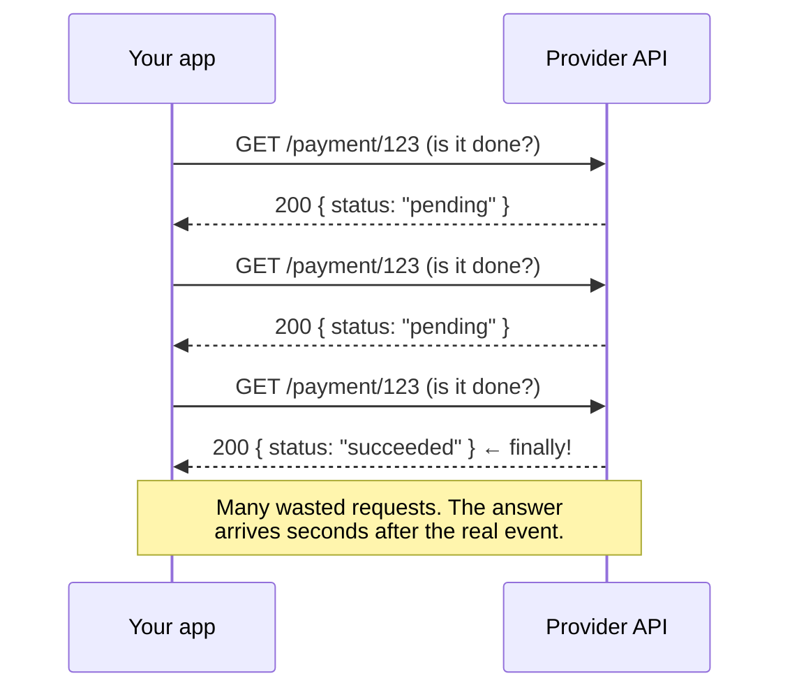
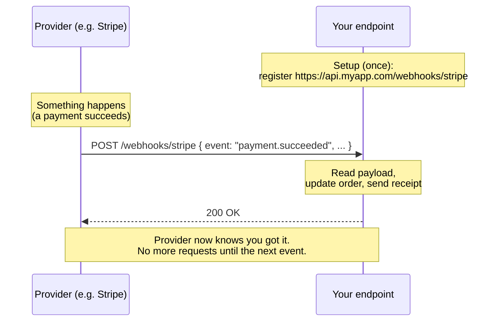
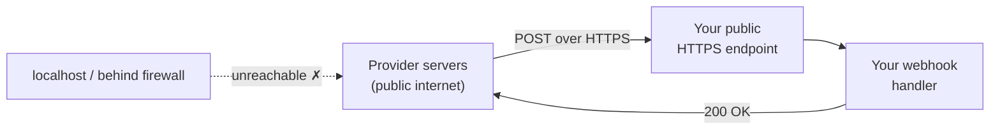

# Webhooks — Junior

<!-- level-focus -->
At junior level, focus on this question:

> How can I apply **Webhooks** in one small example and prove the result?

Use the smallest realistic scenario that exposes the decision and its failure behavior.
## 1. The polling problem

Say your app needs to know when a customer's payment succeeds. The payment happens on Stripe's servers, not yours. How do you find out?

The naive answer is **polling**: your app calls Stripe's API on a timer — every few seconds — and asks *"is this payment done yet?"*



Polling has two structural problems:

- **Wasteful.** The vast majority of requests return *"nothing changed."* If you poll every 5 seconds, that is ~17,000 requests per day *per resource* — almost all of them useless. You burn your rate limit, your CPU, and the provider's capacity for nothing.
- **Laggy.** You only learn about the change on your *next* poll. Poll every 30 seconds and you may react up to 30 seconds late. Poll faster to cut the lag, and you multiply the waste. You are trading latency against load, and losing on both.

The deeper issue: **the app that cares about the change is the one doing all the work**, even though it has no idea when the change will happen. Only the provider knows that.

---

## 2. Webhooks: the inversion

A webhook flips the relationship. Instead of you asking, **the provider tells you.**

You register a URL with the provider — an endpoint on your server, for example `https://api.myapp.com/webhooks/stripe`. When a relevant event happens, the provider sends an HTTP `POST` to that URL with a description of the event. Your server receives it, does whatever it needs to do, and replies `200 OK`.

The vocabulary:

| Term | Meaning |
| --- | --- |
| **Provider / sender** | The system where the event happens (Stripe, GitHub). It POSTs the webhook. |
| **Subscriber / receiver** | Your system. It exposes a URL and handles incoming POSTs. |
| **Event** | The thing that happened (`payment succeeded`, `PR opened`). |
| **Payload** | The JSON body of the POST describing the event. |
| **Endpoint URL** | The public address you registered to receive events. |

The key mental shift: **zero requests are wasted.** You get exactly one POST per event, and you get it within moments of the event happening. No timer, no guessing, no idle chatter.

---

## 3. Flow: event happens → provider POSTs → subscriber 200s



Three steps:

1. **Register (once).** You tell the provider your endpoint URL, usually in their dashboard or via an API call.
2. **Event fires.** Something meaningful happens on the provider's side.
3. **POST + acknowledge.** The provider POSTs the event to your URL. Your server processes it and returns `200 OK` to confirm receipt.

That `200` matters: it is your way of saying *"got it."* If you return an error or time out, the provider assumes delivery failed. (Retries and reliability are a Middle-tier topic — for now, just know the `200` is an acknowledgement, not a formality.)

---

## 4. The event payload

The POST body is a JSON object describing what happened. There is no universal standard, but real-world payloads almost always carry the same core fields:

```json
{
  "id": "evt_1P9x2c",
  "type": "payment.succeeded",
  "created": 1719840000,
  "data": {
    "payment_id": "pay_abc123",
    "amount": 4999,
    "currency": "usd",
    "customer_id": "cus_789"
  }
}
```

The pieces to recognize:

- **`id`** — a unique identifier for *this delivery*. Useful later for detecting duplicates.
- **`type`** — which kind of event this is. Your code branches on this (`payment.succeeded` vs `payment.refunded` vs …).
- **`created`** — when the event happened.
- **`data`** — the details specific to this event type: the actual amount, customer, resource, etc.

Your handler reads `type`, decides what to do, pulls the specifics out of `data`, acts on them, and returns `200`.

---

## 5. Webhooks vs polling

Same job — *"find out when something changes"* — two opposite strategies.

| Dimension | Polling | Webhooks |
| --- | --- | --- |
| **Direction** | You ask the provider (pull) | Provider tells you (push) |
| **Latency** | Up to one poll interval late | Near real-time |
| **Load** | High — mostly empty responses | Low — one POST per real event |
| **Who initiates** | The subscriber, on a timer | The provider, on the event |
| **Infrastructure** | Just an outbound HTTP client | A public HTTPS endpoint you must run |
| **Works when** | You control the timing, don't mind lag | You need timely, efficient updates |

Rule of thumb: **if the provider offers webhooks for the event you care about, prefer them.** Polling remains a reasonable fallback when no webhook exists, or as a safety net to catch events a webhook might have missed — but as the primary mechanism, webhooks win on both latency and load.

---

## 6. Real examples

Webhooks are everywhere in modern APIs. Two of the most familiar:

- **Stripe — `payment_intent.succeeded`.** A customer's card is charged successfully. Stripe POSTs the event to your endpoint; your server marks the order as paid, provisions access, and emails a receipt. You never poll Stripe asking *"did it clear yet?"* See stripe.com/docs/webhooks.
- **GitHub — `pull_request` opened.** A developer opens a pull request. GitHub POSTs a `pull_request` event to your registered URL; your CI system kicks off a build, or a bot posts a review checklist. This is how most CI/CD integrations react instantly to repository activity. See docs.github.com/webhooks.

Other everyday examples: a shipping provider notifying you a package was delivered, a chat platform notifying your bot of a new message, a form service POSTing you each new submission.

The pattern is identical in every case: *event happens on their side → they POST it to your side → you act and return `200`.*

---

## 7. Why the receiver must be a public HTTPS endpoint

For a webhook to work, **the provider's servers have to be able to reach your server.** That has two consequences.

**It must be publicly reachable.** A URL like `http://localhost:3000/webhook` or an address behind your office firewall means nothing to Stripe's servers — they cannot route to it. The endpoint has to resolve on the public internet. (During local development, tools that create a temporary public tunnel to your machine are the standard workaround, but that is still a *public* address the provider can hit.)

**It must be HTTPS.** Webhook payloads carry real, often sensitive data — payment amounts, customer identifiers, account activity. Sending that over plain `http` would expose it to anyone on the network path. Providers therefore require `https`, so the connection is encrypted in transit. In practice, registering an `http://` URL is usually rejected outright.



The mirror image of polling is worth noting: with polling, *your* client makes the outbound call, so it works fine from a laptop behind a firewall. With webhooks, the provider makes the *inbound* call, so you must stand up a reachable, encrypted endpoint for it to land on. That extra piece of infrastructure is the price of admission for push-based updates.

---

## 8. Key takeaways

- **Polling is pull:** you repeatedly ask; most answers are *"nothing changed"* — wasteful and laggy.
- **Webhooks are push:** the provider POSTs an event to your registered URL the moment it happens — one request, near real-time.
- The **flow** is: register a URL → event fires → provider POSTs the payload → your handler returns `200 OK`.
- A **payload** is JSON, typically with `id`, `type`, `created`, and a `data` object; you branch on `type`.
- Prefer webhooks when the provider offers them; keep polling as a fallback where they don't.
- Real examples are everywhere: Stripe `payment_intent.succeeded`, GitHub `pull_request` opened.
- Your receiver **must be a public HTTPS endpoint** — the provider has to reach it from the internet, and the data must be encrypted in transit.

*Next step:* [Webhooks — Middle](middle.md)

---

## Apply it

1. Choose one small, known input for **Webhooks**.
2. Predict the output or observable behavior.
3. Run the smallest example or probe that exercises the concept.
4. Change one input to trigger a failure or boundary case.
5. Explain the evidence using the guide's vocabulary.

## Verify your work

- Record the exact input, command or code path, and output.
- Repeat the probe and confirm the result is consistent.
- Show one expected success and one expected failure.
- Resolve any difference between the prediction and the evidence.

## Review questions

- What problem does Webhooks solve in the example?
- Which input changes the observed result, and why?
- What is the smallest useful success check?
- Which beginner mistake would your evidence catch?
