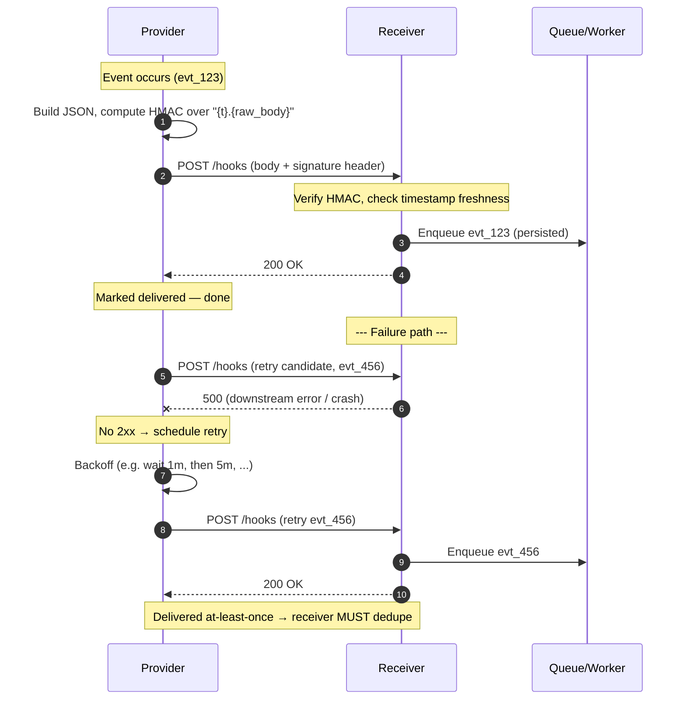

# Webhooks — Middle

<!-- level-focus -->
At middle level, focus on this question:

> Where does **Webhooks** belong in a maintainable component, and which trade-off selects the design?

Use the smallest realistic scenario that exposes the decision and its failure behavior.
## 1. Registration and subscription

Before any event can be delivered, the subscriber tells the provider *where* to send events and *which* events it cares about. This is done once, out of band, via the provider's dashboard or an API call. The subscriber supplies:

- **A destination URL** — an HTTPS endpoint under the subscriber's control (e.g. `https://api.acme.com/hooks/stripe`).
- **A set of event types** to subscribe to (e.g. `payment_intent.succeeded`, `charge.refunded`). Subscribing to a filtered set avoids receiving traffic the receiver will only discard.
- Optionally, an API version so the payload shape stays stable even as the provider evolves.

In return, the provider issues a **signing secret** (a shared secret, e.g. Stripe's `whsec_...`) bound to that endpoint. The subscriber stores this secret and uses it to verify every incoming delivery. The secret is symmetric: the provider signs with it, the receiver verifies with it, and it never travels over the wire.

The result is a durable subscription record on the provider side: `{ endpoint_url, event_types, signing_secret, status }`.

## 2. Delivery mechanics: the POST

When a subscribed event occurs, the provider constructs an event object and sends it:

- **Method**: `POST` to the registered URL.
- **Body**: a JSON document describing the event, including a **unique event id** (e.g. `evt_1abc...`), an event `type`, a `created` timestamp, and a `data` object.
- **Headers**: `Content-Type: application/json`, a **signature header**, and often a **delivery/event id header** for correlation and dedupe.
- **Expectation**: the receiver must return a **2xx** status quickly — typically within a short timeout (on the order of seconds). Anything else, or no response before the timeout, counts as a failed delivery.

The provider treats the raw request body as the canonical payload. That matters for signatures: verification is computed over the *exact bytes received*, not over a re-serialized object.

## 3. Signature verification (HMAC-SHA256)

Because the endpoint is a public URL, anyone can `POST` to it. Signature verification lets the receiver prove the request genuinely came from the provider and was not tampered with in transit.

The scheme (Stripe-style) works as follows:

1. The provider computes `HMAC-SHA256(secret, signed_payload)` where `signed_payload` combines a **timestamp** and the **raw request body** (e.g. `"{timestamp}.{raw_body}"`).
2. The provider sends the timestamp and the resulting hex digest in the signature header.
3. The receiver recomputes the HMAC over the raw body it received, using its stored secret, and **compares digests with a constant-time comparison** to avoid timing side channels.
4. The receiver also checks that the **timestamp is recent** (within a tolerance window, e.g. 5 minutes) to reject **replayed** requests — an attacker resending a captured, validly-signed payload later.

| Signature header component | Purpose |
| --- | --- |
| `t` (timestamp) | When the provider signed the request; bounds a replay window |
| `v1` (signature) | `HMAC-SHA256(secret, "{t}.{raw_body}")` hex digest; proves authenticity + integrity |
| Scheme version (`v1`) | Lets the provider roll the algorithm without breaking receivers |

Two rules the receiver must not violate: verify over the **raw, unparsed body** (parsing then re-serializing changes the bytes and breaks the HMAC), and use **constant-time comparison** for the digest. If verification fails, the receiver rejects the request (typically `400`) and does not process it.

## 4. Response codes and provider action

The receiver's HTTP status code is the entire protocol the provider listens to. Semantics:

| Receiver response | Meaning to provider | Provider action |
| --- | --- | --- |
| `2xx` | Delivery accepted | Mark delivered; stop |
| `5xx` | Receiver failed transiently | Retry later with backoff |
| Timeout / connection error | Receiver unreachable or too slow | Retry later with backoff |
| `4xx` (e.g. `400`, `410`) | Permanent client-side problem (bad signature, endpoint gone) | Usually do **not** retry; may disable endpoint after repeated failures |

The key asymmetry: `5xx` and timeouts are **retryable** (the provider assumes the fault is temporary), while `4xx` signals a permanent problem the provider cannot fix by retrying. A receiver should therefore return `2xx` *only* once it has safely accepted responsibility for the event, and return `5xx` when it genuinely wants a retry.

## 5. Retries and at-least-once delivery

When a delivery is not acknowledged with `2xx`, the provider **retries** — usually with **exponential backoff** (increasing gaps: seconds, then minutes, then hours) over a bounded window (e.g. up to a few days). This makes delivery robust against brief receiver outages, deploys, and network blips.

The direct consequence: webhooks are **at-least-once**, not exactly-once. Consider the failure mode where the receiver processes the event successfully but its `200` response is lost (network drop, or the receiver crashed *after* committing but *before* responding). The provider never saw the ack, so it retries — and the receiver now sees the **same event twice**.

Because retries are inherent to the design, **you cannot engineer duplicates away on the provider side**. The receiver must be built to tolerate them.

## 6. Idempotency: event-id dedupe

At-least-once delivery makes **idempotency a receiver requirement**, not an optimization. The standard technique uses the provider's unique **event id**:

1. On each delivery, read the event id (`evt_...`) from the payload.
2. Attempt to record it in a dedupe store (a `processed_events` table with a unique constraint on the id, or a Redis `SET NX` with TTL).
3. If the id is **new**, process the event, then commit the record.
4. If the id **already exists**, the event is a duplicate — return `2xx` immediately and skip processing.

The two ends of the pipeline both benefit: dedupe at ingestion prevents re-enqueueing, and dedupe at the worker prevents double side effects. Ideally the "mark processed" write and the business side effect happen in the **same transaction**, so a crash cannot leave the record set without the effect applied (or vice versa). Where a single transaction is impossible (e.g. calling a third-party API), make the downstream operation itself idempotent — for example, by forwarding the event id as an idempotency key.

## 7. Fast-ack: return 200, process async

The provider times out fast and interprets slowness as failure. If the receiver does its heavy work (DB writes, downstream API calls, sending email) *inline* before responding, three things go wrong: it risks blowing the timeout, it holds the connection open, and any hiccup in that work turns into a `5xx` and a retry storm.

The **fast-ack pattern** decouples acceptance from processing:

1. Verify the signature.
2. **Persist** the raw event durably (write it to a queue, log, or table).
3. Return `200` **immediately**.
4. A **separate worker** consumes the queue and performs the real processing asynchronously.

This keeps the synchronous handler minimal and fast, so it reliably acks inside the timeout. It also means transient failures in downstream processing are handled by the *receiver's* own retry logic on the queue — not by triggering provider retries. The critical rule: only return `200` after the event is **durably stored**. Returning `200` before persistence means a crash loses the event, and the provider (having seen the ack) will never resend it.

## 8. Ordering is not guaranteed

Webhook deliveries are independent HTTP requests, often dispatched by parallel workers on the provider side and retried on their own schedules. As a result:

- Events may arrive **out of the order they occurred**. A `subscription.updated` can land before the `subscription.created` that preceded it.
- Retries reshuffle order further: a delayed retry of an earlier event can arrive *after* later events.

The receiver must not assume arrival order equals event order. Practical defenses:

- Use the event's **`created` timestamp** or a provider sequence number to order or discard stale events.
- Prefer **state-conveying** events (the payload carries the current object state) over pure deltas, so a late or duplicate delivery still resolves to the correct final state.
- When strict ordering matters, **fetch the current state** from the provider's API on receipt rather than trusting the webhook payload to be the latest.

## 9. End-to-end trace

Putting the mechanics together — one event, one retry, one duplicate:

1. **Event occurs.** A charge succeeds; the provider creates `evt_123` with type `payment_intent.succeeded`.
2. **Sign.** The provider computes `HMAC-SHA256(whsec_..., "{t}.{raw_body}")` and sets the timestamp + digest in the signature header.
3. **POST.** The provider sends `POST /hooks/stripe` with the raw JSON body.
4. **Verify.** The receiver recomputes the HMAC over the raw body, constant-time compares it, and confirms the timestamp is within tolerance. Fail → `400`, stop.
5. **Dedupe check + persist.** The receiver checks `evt_123` against its dedupe store; it's new, so it writes the raw event to a queue in one durable step.
6. **Ack.** The receiver returns `200`. The provider marks the delivery complete.
7. **Async process.** A worker pulls `evt_123`, applies the business logic in a transaction that also records the id as processed, and commits.
8. **Failure + retry.** For a different event `evt_456`, the worker's downstream call fails and the handler returns `500`. The provider waits per its backoff schedule and re-POSTs `evt_456`. This time the receiver enqueues it and returns `200`.
9. **Duplicate.** Suppose `evt_123`'s original `200` had been lost. The provider retries `evt_123`; the receiver's dedupe store already contains it, so it returns `200` without reprocessing — at-least-once delivery, exactly-once *effect*.

This is the full contract at the middle tier: **signed POST → verify → persist → fast-ack → async process, made safe by idempotent dedupe under at-least-once retries and unordered arrival.** The senior tier builds on this to cover delivery infrastructure at scale, endpoint health and auto-disabling, secret rotation, and observability.

*Next step:* [Webhooks — Senior](senior.md)

---

## Apply it

1. Find a real component where **Webhooks** affects an interface or dependency.
2. Write two plausible choices and the constraint that favors each one.
3. Make the smallest reversible change at that boundary.
4. Exercise the component alone, then exercise the integrated flow.
5. Keep the decision note with the evidence that selected the option.

## Verify your work

- A focused check proves the local behavior.
- An integrated check proves callers and dependencies still agree.
- Logs, traces, compiler output, or benchmarks expose the boundary.
- Reverting the change restores the previous behavior without unrelated edits.

## Review questions

- Which boundary is most affected by Webhooks?
- What constraint would make you choose the alternative design?
- How would you isolate a local defect from an integration defect?
- What evidence shows that the change remains maintainable?
