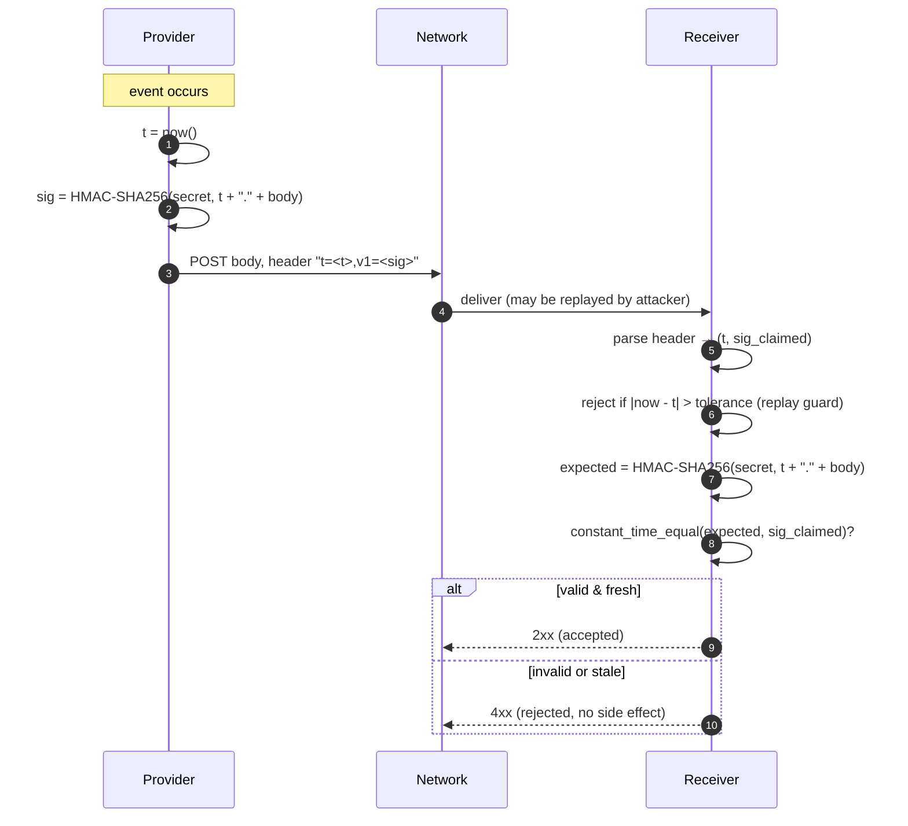
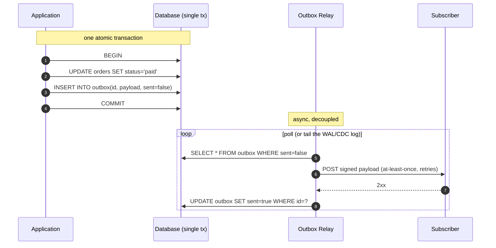

# Webhooks — Professional

<!-- level-focus -->
At professional level, focus on this question:

> How should teams adopt and operate **Webhooks** with measurable outcomes and limited coordination?

Use the smallest realistic scenario that exposes the decision and its failure behavior.
## 1. Signature schemes in rigor

A webhook receiver must answer one question before parsing the body: *did the
party that holds my shared secret produce this exact byte sequence?* The answer
is a keyed MAC, almost universally **HMAC-SHA256**, computed over a
concatenation of a timestamp and the raw payload.

The critical detail is the **signed string construction**. Signing the payload
alone lets an attacker who captured one delivery replay it forever. Binding a
timestamp into the MAC input, and rejecting stale timestamps on the receiver,
closes that window. The canonical construction (Stripe's) is:

```
signed_payload = timestamp + "." + raw_request_body
signature      = HMAC_SHA256(secret, signed_payload)   // hex-encoded
```

The provider transmits both in a single header, using a scheme that carries the
timestamp and one-or-more signature versions:

```
Stripe-Signature: t=1710000000,v1=5257a869e7ecebeda32affa62cdca3fa...,v0=...
```

`t` is the Unix timestamp the provider signed. `v1` is the current HMAC-SHA256
scheme; `v0` (or additional `v1` entries) exist so a provider can sign with
multiple secrets at once during rotation (see §2). The receiver parses the
header, recomputes `HMAC_SHA256(secret, t + "." + body)`, and compares it to the
`v1` value.

Two rules the receiver **must not** get wrong:

- **Sign the raw bytes, verify the raw bytes.** Re-serializing parsed JSON
  changes whitespace and key order, producing a different MAC. Capture the body
  as the exact received byte string *before* JSON parsing.
- **Use a constant-time comparison.** `a == b` on strings short-circuits at the
  first differing byte; timing that difference leaks the correct signature one
  byte at a time. Use `hmac.compare_digest` (Python), `crypto.timingSafeEqual`
  (Node), `hmac.Equal` (Go), or `MessageDigest.isEqual` (Java 6+).



The verification is *authentication plus freshness*, not encryption — the body
travels in cleartext at the application layer and relies on TLS for
confidentiality. The HMAC proves origin and integrity; the timestamp tolerance
proves recency.

---

## 2. Secret rotation and replay windows

**Replay window.** The receiver rejects any delivery whose timestamp is older
than a tolerance (Stripe's default is 5 minutes). This bounds how long a
captured-and-replayed request stays valid. A tolerance that is too tight will
reject legitimate deliveries delayed by retries or clock skew; too loose and the
replay window widens. Five minutes is the common compromise. For strict
at-most-once side effects, pair the window with **event-id deduplication** (§3)
so that even an in-window replay is caught.

**Secret rotation.** A single shared secret cannot be swapped atomically across
two independently deployed systems — there is always an interval where the
provider signs with the new secret but the receiver still checks the old one, or
vice versa. The solution is **overlapping validity**: allow multiple secrets to
be simultaneously valid.

- Provider side: sign each delivery with *all* currently-valid secrets, emitting
  one `v1=` entry per secret in the signature header.
- Receiver side: accept a delivery if it matches *any* configured active secret.

Rotation then proceeds without downtime:

1. Add the new secret alongside the old (both active).
2. Deploy receivers that accept either.
3. Cut the provider to sign with both, then to the new only.
4. Retire the old secret once no active traffic uses it.

This is the same principle as JWT signing-key rotation via a key set — never a
flip, always an overlap.

---

## 3. Delivery guarantees: why exactly-once is impossible

Network delivery has three achievable semantics. **Exactly-once delivery does
not exist** over an unreliable channel: after the provider POSTs and the receiver
processes, the acknowledgement can be lost, leaving the provider unable to
distinguish "receiver never got it" from "receiver got it, my ACK vanished." Its
only safe move is to retry — which the receiver may then see twice.

| Semantic | How achieved | Duplicates? | Loss? | Practicality |
|---|---|---|---|---|
| At-most-once | Fire and forget, no retry | No | Yes (on any failure) | Unsafe for anything that matters |
| At-least-once | Retry until a 2xx ACK | **Yes** | No | The standard webhook contract |
| Exactly-once (delivery) | — | — | — | **Impossible** over a lossy network |
| Effectively-once (processing) | At-least-once delivery **+** receiver dedup | Delivered yes, *applied* no | No | The achievable target |

Every serious webhook system ships **at-least-once delivery** and pushes the
duplicate problem onto the receiver, which achieves **effectively-once
processing** through **idempotent handling keyed on a stable event id**.

The provider therefore MUST attach a unique, immutable `id` to every event (and
retransmit the *same* id on retries — not a fresh one). The receiver MUST:

```
on delivery(event):
    if seen_store.contains(event.id):     # atomic check
        return 200 OK                     # already applied; ack and drop
    apply_side_effects(event)             # the business action
    seen_store.record(event.id)           # commit id + effect together
    return 200 OK
```

The `seen_store` is a durable set of processed ids (a table with a unique
constraint, or Redis with a TTL longer than the provider's maximum retry
horizon). The subtlety: recording the id and applying the effect must be atomic,
or a crash between them reopens the duplicate window. In a relational receiver,
insert the id row and perform the side effect in the same transaction; the unique
constraint on `event_id` turns a duplicate into a caught constraint violation
rather than a repeated action.

---

## 4. The transactional outbox pattern

On the **provider** side there is a symmetric hazard: the **dual-write
problem**. Handling a request means (a) committing a business state change to the
database and (b) emitting the webhook event. If these are two separate
operations, any interleaving of a crash produces an inconsistency:

- Commit business row, crash before emitting → state changed, **no event ever
  fires** (silent data loss for subscribers).
- Emit event, crash before committing business row → subscribers act on a change
  **that never happened**.

You cannot wrap an HTTP call and a database commit in one atomic transaction.
The **transactional outbox** removes the second write from the hot path: instead
of emitting the event directly, you write an event *row* into an `outbox` table
**inside the same local transaction** as the business change. One transaction,
one commit, no dual write. A separate **relay** (poller or log-tailer) reads the
outbox and performs the actual delivery, marking rows as sent.



Key properties:

- **Atomicity restored.** Because the event row and business row commit
  together, the event exists **if and only if** the business change committed.
- **The relay is at-least-once by construction.** If it crashes after delivering
  but before marking `sent=true`, it re-delivers on restart — which is exactly
  why the receiver's dedup (§3) is mandatory. The provider guarantees *no lost*
  events; the receiver guarantees *no repeated effects*.
- **Polling vs. log-tailing.** A `SELECT ... WHERE sent=false` poller is simple
  but adds query load and latency. Change Data Capture (tailing the database's
  replication log, e.g. Debezium) delivers lower latency and zero polling
  overhead by reacting to the committed outbox insert directly.
- **Ordering hook.** Adding a monotonic sequence column to the outbox lets the
  relay preserve emission order (§5).

The outbox turns an unsafe dual write into a safe single write plus an
idempotent, retriable delivery loop.

---

## 5. Ordering strategies

At-least-once delivery with retries means events can arrive **out of order**: a
retried `order.updated` can land after a later `order.updated` that succeeded
first. Three strategies address this, in increasing order of receiver
simplicity:

- **Per-entity sequence numbers.** Attach a monotonically increasing `sequence`
  (per aggregate/entity) to each event. The receiver tracks the highest sequence
  applied per entity and discards any event whose sequence is not greater. This
  yields correct last-writer-wins ordering *within* an entity without requiring
  global order. The outbox's monotonic column is the natural source of these
  numbers.
- **Stateless re-fetch of current state.** Treat the webhook as a *notification*,
  not a *state transfer*: the payload carries only the entity id and event type,
  and the receiver calls back to the provider's API to read the current state.
  Ordering of the notifications no longer matters, because whichever
  notification the receiver processes last, it re-reads the authoritative
  current value. This is the most robust option and the reason many providers
  ("thin payloads") deliberately send minimal bodies.
- **Ordered channels / partitioning.** If the delivery substrate is a partitioned
  log (Kafka-style) keyed by entity id, per-key order is preserved by the
  transport. This trades transport complexity for receiver simplicity but only
  gives *per-partition* order, so the partition key must equal the entity's
  ordering key.

Global total order across all entities is rarely worth its cost; scope ordering
to the smallest unit that the business actually requires (usually one entity).

---

## 6. DLQ, poison handling, and backpressure

**Retry and the dead-letter queue.** The relay retries a failed delivery with
**exponential backoff and jitter** (e.g. 1s, 2s, 4s, … capped, with random
spread to avoid synchronized retry storms). A **poison message** — one that
fails every attempt because the endpoint is permanently misconfigured or the
payload triggers a receiver bug — must not retry forever. After a bounded number
of attempts (or a time budget), the event is moved to a **dead-letter queue**:

- The DLQ decouples a single bad endpoint from the health of the delivery
  pipeline; without it, poison messages accumulate and starve retry capacity.
- Providers typically expose DLQ contents through a dashboard and offer manual or
  scheduled **replay** once the endpoint is fixed.
- Distinguish **poison** (deterministic failure — send to DLQ fast) from
  **transient** failure (5xx, timeout — keep retrying within budget). A blanket
  retry policy wastes work on poison; a blanket DLQ policy loses recoverable
  events.

**Backpressure from slow receivers.** A subscriber that responds slowly (or holds
connections open) can, if delivery is unbounded, consume all of the provider's
delivery workers and degrade delivery to *every* subscriber — a noisy-neighbor
failure. Defenses:

- **Per-endpoint concurrency caps.** Bound in-flight deliveries per destination
  so one slow endpoint cannot monopolize the worker pool (a bulkhead).
- **Circuit breaking a dead endpoint.** Track consecutive failures per endpoint;
  after a threshold, **open the circuit** — stop attempting delivery, buffer or
  DLQ new events, and periodically probe (half-open) before resuming. This stops
  the pipeline from burning resources on an endpoint that is down.
- **Aggressive timeouts.** Cap the response wait (single-digit seconds).
  Receivers should ACK immediately and process asynchronously; a webhook handler
  that does heavy synchronous work is the usual root cause of provider-side
  backpressure.

Together these keep one misbehaving subscriber from becoming a systemic outage.

---

## 7. WebSub — a standardized webhook protocol

Ad-hoc webhooks require every provider to invent its own subscription,
verification, and delivery conventions. **WebSub** (formerly PubSubHubbub, a W3C
Recommendation) standardizes the *subscription lifecycle* around three roles:

- **Publisher** — owns the topic (a resource URL) and notifies a hub when it
  changes.
- **Hub** — accepts subscriptions and fans out content to subscribers.
- **Subscriber** — registers a callback URL with the hub for a given topic.

The distinctive mechanics:

- **Subscription** is a `POST` to the hub with `hub.mode=subscribe`,
  `hub.topic`, and `hub.callback`.
- **Intent verification.** The hub confirms the subscriber actually wants the
  subscription by issuing a `GET` to the callback with a `hub.challenge`; the
  subscriber must echo the challenge back. This prevents an attacker from
  subscribing a victim URL to a flood of content.
- **Authenticated delivery.** When the topic updates, the hub POSTs the content
  to the callback; if the subscriber supplied a `hub.secret`, the hub signs the
  body with an HMAC in an `X-Hub-Signature` header — the same MAC-verification
  discipline as §1, standardized.
- **Lease renewal.** Subscriptions expire (`hub.lease_seconds`) and must be
  renewed, so stale callbacks eventually stop receiving traffic.

WebSub is essentially the webhook pattern with a standardized, verifiable
subscription handshake and a decoupling hub for fan-out — valuable when many
independent subscribers follow the same public topics.

---

## 8. CloudEvents — a standardized envelope

Where WebSub standardizes *how you subscribe and deliver*, **CloudEvents** (a
CNCF specification, cloudevents.io) standardizes *what an event looks like* — a
common envelope so that a consumer can route, filter, and dedup events without
understanding each producer's bespoke JSON shape. The envelope defines required
and optional context attributes carried alongside the domain-specific `data`.

| Attribute | Required | Purpose |
|---|---|---|
| `id` | Yes | Unique per event; the **dedup key** (§3). `source` + `id` is globally unique. |
| `source` | Yes | URI identifying the producer/context that emitted the event. |
| `specversion` | Yes | CloudEvents spec version the envelope conforms to. |
| `type` | Yes | Event type, e.g. `com.example.order.paid`; drives routing. |
| `subject` | No | The specific entity within `source` (the natural **ordering key**, §5). |
| `time` | No | Timestamp of occurrence (RFC 3339). |
| `datacontenttype` | No | Media type of `data`, e.g. `application/json`. |
| `dataschema` | No | URI of the schema the `data` payload validates against. |
| `data` | No | The domain-specific payload. |

CloudEvents supports multiple **bindings** — HTTP *structured* mode (the whole
event, envelope and data, is one JSON body) and *binary* mode (context
attributes become `ce-` HTTP headers, `data` is the raw body). Adopting it buys
interoperability: the `id` becomes the standard idempotency key, `source`+`type`
become the standard routing tuple, and `subject` becomes the standard per-entity
ordering key — turning the ad-hoc conventions of §§3–5 into a portable contract.

---

## Apply it

1. Define the user or business outcome that **Webhooks** should improve.
2. Assign one owner for code, contracts, operations, and incidents.
3. Split delivery into reversible increments that produce evidence early.
4. Publish responsibilities, escalation paths, and compatibility windows.
5. Stop or expand only when the agreed measures support that decision.

## Verify your work

- Each increment has an owner, rollback path, and observable exit condition.
- Adoption, reliability, delivery time, and coordination cost are measured.
- Incident and migration exercises prove that responsibility is executable.
- The old path is removed only after telemetry proves it is unused.

## Review questions

- Which measurable outcome justifies investing in Webhooks?
- Which team owns the full lifecycle and incident response?
- What reversible increment produces the earliest useful evidence?
- Which exit condition proves that migration or adoption is complete?
