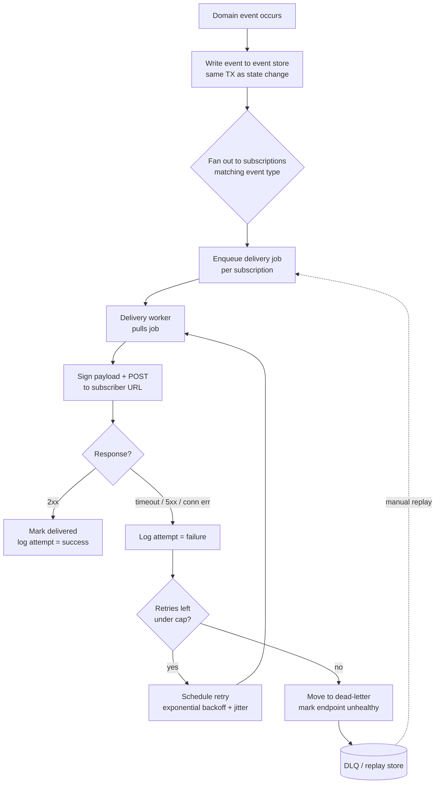

# Webhooks — Senior

<!-- level-focus -->
At senior level, focus on this question:

> Which system invariant is affected by **Webhooks** under failure, load, and change?

Use the smallest realistic scenario that exposes the decision and its failure behavior.
## 1. Reliability is a provider-side durability problem

The naive implementation is fatal: in the same request that mutates your domain state, you fire an outbound HTTP POST to the subscriber's URL. This couples your write path to a third party's uptime. If their endpoint hangs for 30 seconds, your request thread hangs with it; if it 500s, the event is gone; if your process crashes between the DB commit and the POST, the event never existed.

The senior reframe: **a webhook is a durable, asynchronous message you owe to a subscriber, and delivery is a background concern.** The event must be persisted the moment the domain fact is committed, then delivered by an independent worker that can retry, back off, and give up gracefully. This is the *transactional outbox* pattern applied to the network edge.

The core invariant: **persist the event in the same transaction as the state change, or you will drop events during partial failures.** Everything else — queues, retries, DLQs — is machinery layered on top of that durable record.

---

## 2. The durable delivery pipeline

A production webhook system separates four concerns: capturing the event, enqueueing a delivery, attempting the HTTP call, and recording the outcome. Each delivery attempt is itself a persisted, queryable fact.

Stage by stage:

- **Event store** — the append-only source of truth for *what happened*. Written transactionally with the state change. Retained for a bounded window (e.g. 30–90 days) so replays are possible.
- **Fan-out** — one domain event may match many subscriptions (multiple tenants, multiple endpoints per tenant). Each match produces an independent delivery so one dead endpoint never blocks another.
- **Delivery queue** — decouples "an event happened" from "we successfully called your URL." Workers scale horizontally and independently of the write path.
- **Attempt log** — every attempt records timestamp, request headers/body hash, response status, latency, and error. This is what powers debugging, the subscriber-facing dashboard, and disabling decisions.
- **Dead-letter queue** — where deliveries land after exhausting retries. Explicitly *not* silently dropped: it is a store you can inspect and replay from.

Keep the outbound payload small and the worker's per-attempt timeout tight (a few seconds). A subscriber that takes 25 seconds to respond is a failure, not a success you should wait for.

---

## 3. Retry policy, backoff, and dead-lettering

Retries turn transient failures (a subscriber redeploy, a brief network blip) into eventual success. Done wrong, they turn a subscriber outage into a self-inflicted DDoS.

**Exponential backoff with jitter.** Fixed-interval retries synchronize: if a subscriber goes down and 10,000 pending events all retry every 60s, they hammer the endpoint in lockstep the moment it recovers. Exponential backoff (1s, 4s, 16s, 1m, 5m, 30m, …) spreads load and gives a struggling endpoint room to recover; **jitter** (randomizing each delay) breaks the thundering-herd synchronization.

**A cap on attempts and a total-time budget.** Retrying forever wastes resources and lets stale events pile up behind a permanently dead endpoint. Cap both the *number* of attempts (e.g. ~10–15) and the *total elapsed window* (e.g. give up after 24–72 hours). After that, dead-letter.

**Retry only what is retryable.** A `5xx`, a connection error, or a timeout is transient — retry. A `410 Gone` means the endpoint is permanently deleted — stop and disable. A `400`/`422` means the subscriber rejects the payload shape — retrying won't help; surface it, don't loop. Honor `Retry-After` if the subscriber sends it.

| Failure class | Example | Action |
|---|---|---|
| Transient network | timeout, connection refused, DNS blip | Retry with backoff |
| Server error | `500`, `502`, `503` | Retry with backoff (honor `Retry-After`) |
| Rate limited | `429` | Retry, respect `Retry-After` |
| Permanent client error | `400`, `422` | Do not retry; surface to subscriber |
| Endpoint gone | `410` | Stop; disable subscription |
| Auth failure | `401`, `403` | Alert subscriber; limited retries then disable |

**Dead-letter, don't drop.** The DLQ is a first-class feature. It lets a subscriber who fixed their endpoint after a 12-hour outage recover the events they missed via **manual replay** — re-enqueuing a specific event, a time range, or everything for one subscription. Replay must be idempotent-safe (same event id, same signature) so a consumer that already processed an event can safely ignore it.

---

## 4. Disabling chronically-failing endpoints

An endpoint that has been failing every attempt for days is a liability: it consumes worker capacity, inflates queue depth, and produces noise. A mature provider **auto-disables** subscriptions that cross a failure threshold — e.g. N consecutive failures, or a sustained failure rate over a window.

Design choices that make this humane rather than hostile:

- **Warn before you cut.** Email/notify the subscription owner as failures accumulate, and again at disable time, with a link to the attempt log and a re-enable button.
- **Distinguish "disabled" from "deleted."** A disabled subscription stops receiving new deliveries but retains its config; the owner fixes their endpoint and re-enables. Events that occurred while disabled are recoverable from the event store within the retention window (this is why thin events and a replay API matter — see §6).
- **Circuit-break, don't hard-delete.** Treat the endpoint like any failing dependency: open the circuit after repeated failures, probe periodically, close it when it recovers. This is the circuit breaker pattern applied to outbound webhooks — keep the mechanism in-house.

The trade-off is sensitivity vs. patience: too aggressive and you disable subscribers over a transient outage; too lenient and dead endpoints rot in your queues. Tie the threshold to *consecutive* failures plus a *time* dimension, not a raw count.

---

## 5. Delivery semantics: at-least-once, idempotency, ordering

**At-least-once is the honest guarantee.** Because delivery involves retries over an unreliable network, and because a subscriber can receive a webhook, process it, and then have its `2xx` acknowledgment lost before it reaches you (so you retry), **duplicates are inevitable.** Exactly-once delivery across a network is a fiction; exactly-once *processing* is achievable only by the receiver being idempotent.

This pushes a hard requirement onto consumers: **every webhook must carry a stable, unique event id, and the consumer must deduplicate on it.** The consumer records processed event ids (with a TTL matching the provider's retry window) and no-ops on a repeat. The provider's job is to make this possible — same event id on every retry, never a fresh id per attempt.

**Ordering is not guaranteed.** With parallel workers, independent retries, and per-subscription backoff, event B can arrive before event A even though A happened first. Do not design either side to depend on receipt order. Coping strategies:

- **Event versioning / sequence numbers.** Include a monotonic sequence or a timestamp per resource so the consumer can detect and discard stale events (drop a `v3` update if it already saw `v5`).
- **Fetch-latest-state instead of trusting the payload.** The most robust pattern: treat the webhook as a *hint that something changed*, not as the authoritative new value. On receipt, the consumer calls your API to fetch the current state of the resource. This makes ordering and even duplicate delivery irrelevant — whatever order the hints arrive in, the consumer always converges on truth. This is a strong argument for **thin events** (§6).

The design stance: **build the system to tolerate duplication and reordering, rather than trying to prevent them.** Prevention is expensive and fragile; tolerance is cheap and robust.

---

## 6. Thin vs fat events

A pivotal design axis: does the webhook carry the full changed data (**fat**), or just an id and event type that the subscriber uses to fetch state (**thin**)?

| Dimension | Thin (id + type only) | Fat (full payload) |
|---|---|---|
| Payload | `{"event":"invoice.paid","id":"inv_123"}` | Full invoice object inline |
| Consumer flow | Receive hint → fetch current state via API | Read data directly from payload |
| Ordering sensitivity | Low — always fetches latest, so stale/reordered hints self-heal | High — an out-of-order fat event can overwrite newer data |
| Data freshness | Always current at fetch time | Snapshot at emit time; may be stale by receipt |
| Network cost | Two round trips (webhook + fetch) | One (webhook only) |
| Authorization | Fetch re-checks the caller's permissions at read time | Data leaves your boundary in the signed POST |
| Sensitive data exposure | Minimal — id only crosses the wire | Full object sits in logs, proxies, the DLQ |
| Coupling to schema | Loose — API response schema evolves independently | Tight — every consumer parses your payload shape |

**Thin events** are the more defensible default at scale: they minimize sensitive data on the wire, sidestep ordering problems (the consumer always fetches current truth), and re-authorize on fetch. The cost is a second round trip and a hard dependency on your read API being available. **Fat events** save a round trip and work when the subscriber can't (or shouldn't) call back — but they leak data into logs and DLQs, and they make ordering matter.

Many mature providers offer a **hybrid**: a fat-ish payload for convenience plus a stable id, and consumers are documented to re-fetch when they need authoritative state. Whatever you choose, version the payload schema explicitly (`"api_version"` in the event) so you can evolve it without breaking existing subscribers.

---

## 7. Security: signatures, replay protection, SSRF

A webhook endpoint is an unauthenticated, publicly-reachable POST target. Without protection, anyone can forge events to it. And on the provider side, you are making outbound requests to URLs *users supplied* — which is an SSRF vector.

**HMAC signatures — prove the payload came from you.** Sign the raw request body with a per-subscription shared secret and send the signature in a header (e.g. `X-Signature: sha256=...`). The receiver recomputes the HMAC over the exact bytes and compares in constant time. This proves authenticity and integrity without shipping the secret. Sign the **raw body**, not a re-serialized version — JSON key reordering will break verification.

**Replay protection — a signature alone isn't enough.** A captured, validly-signed request can be replayed by an attacker. Include a **timestamp** in the signed payload (or a signed header) and have the receiver reject requests outside a tolerance window (e.g. ±5 minutes), plus optionally dedupe on event id. The window trades attacker replay opportunity against clock skew tolerance.

**Secret rotation.** Support two active secrets during rotation so the provider can sign with the new one while receivers still accept the old — then retire the old. Never rotate atomically without overlap.

**SSRF — the receiver URL is attacker-controlled input.** When a user registers `https://internal-metadata.local/` or `http://169.254.169.254/` or `http://localhost:8080/admin`, a naive provider will happily POST to its own internal services or a cloud metadata endpoint. Defenses:

- **Allow-list schemes and ports** — HTTPS only, standard ports.
- **Resolve the hostname and reject private/loopback/link-local IP ranges** (`10/8`, `172.16/12`, `192.168/16`, `127/8`, `169.254/16`, IPv6 equivalents) — and re-check *after* DNS resolution to defeat DNS-rebinding.
- **Disable or constrain redirects** — a `302` to an internal address bypasses the front-door check.
- **Egress isolation** — run delivery workers in a network segment with no route to internal services or metadata endpoints.

The receiver, symmetrically, must treat every incoming webhook as untrusted until the signature verifies, and must not act on unsigned or stale requests.

---

## 8. The receiver's dead-endpoint and slow-consumer problem

Reliability is a two-sided contract. Even a perfect provider can't help a receiver that mishandles delivery.

- **The slow consumer.** If the receiver does heavy synchronous work (DB writes, downstream calls, business logic) *inside* the webhook request before returning `2xx`, it will exceed the provider's timeout, get counted as a failure, and trigger retries — which pile more load on the already-slow endpoint. The correct receiver pattern: **acknowledge fast, process asynchronously.** Validate the signature, persist the raw event to a local queue/table, return `200` immediately, and process off the request path. The webhook handler's only job is durable capture.

- **The dead endpoint.** A receiver whose service is down or whose URL changed silently drops events; from the provider's side these become retries then dead-letters then a disabled subscription. This is why the provider must offer **replay from the event store** and why **thin events + re-fetch** is so resilient: a receiver that was down for a day can reconcile by fetching current state, no replay needed.

- **Poison messages.** A single event that always throws in the consumer must not block the whole stream. The receiver needs its own DLQ so one bad event doesn't wedge processing of everything behind it.

The senior insight: the provider designs for *the receiver being unreliable*, and a good receiver designs for *itself being unreliable*. Both sides assume failure.

---

## 9. Webhooks vs the alternatives

Webhooks are one point in the design space of "get events from A to B." Choosing them is a trade-off, not a default.

| Mechanism | Direction | Latency | Who bears complexity | Best for |
|---|---|---|---|---|
| **Polling** | Consumer pulls | High (poll interval) | Consumer (wasteful, but dead-simple) | Low-frequency events; no callback endpoint; behind a firewall |
| **Webhooks** | Provider pushes (HTTP) | Low (near-real-time) | Provider (delivery infra) + receiver (public endpoint) | Server-to-server event notifications at scale |
| **SSE** | Server → client stream (long-lived HTTP) | Low | Server (connection state) | Browser/client live updates, one-directional |
| **WebSocket** | Bidirectional stream | Low | Both (persistent connections) | Interactive real-time (chat, collaboration) |
| **Message bus / EventBridge** | Broker mediates | Low | Broker infra | Internal service-to-service; managed fan-out, filtering, replay |
| **WebSub** | Standardized pub/sub over webhooks | Low | Hub | Open, standards-based content-feed subscriptions |

How to read this:

- **Polling** wastes requests (most polls return "nothing new") and adds latency equal to the poll interval, but it needs no public endpoint on the consumer and is trivial behind a firewall. For rare events, polling can be the *right* boring choice.
- **SSE / WebSocket** keep a persistent connection *client → server*; they're for pushing to an active client (a browser), not for delivering to another backend that may be offline. A webhook, by contrast, targets a durable server endpoint and retries on absence.
- **A managed message bus / EventBridge** is the better answer for *internal* eventing: it gives you fan-out, filtering, ordering guarantees, and replay without you building the delivery pipeline. Webhooks earn their keep at the **external boundary**, where you're notifying third parties who can't consume your internal bus.
- **WebSub** standardizes the webhook handshake (subscription, verification, delivery) so publishers and subscribers interoperate without bespoke integration — valuable for public feeds, overkill for a private API.

Rule of thumb: **webhooks for third-party, server-to-server notifications; a message bus for internal fan-out; SSE/WebSocket for live client updates; polling when the consumer can't be called back.**

---

## 10. Testing and observability: "was it delivered?"

The defining operational question for a webhook system is *"did the subscriber actually receive this event?"* — and every design decision above exists to make that answerable.

- **Delivery attempt log as a first-class, subscriber-visible artifact.** Every attempt records event id, subscription, timestamp, request signature, response status, latency, and error. Expose it in a dashboard so subscribers can self-diagnose ("your endpoint returned 500 at 14:03") without opening a support ticket. This is the single highest-leverage feature for reducing integration friction.

- **Manual replay from the UI/API.** Subscribers must be able to re-send a specific event or a time range after fixing their endpoint — backed by the event store and DLQ from §2.

- **Test delivery / ping events.** A "send test event" button that fires a synthetic, clearly-marked event to the registered URL lets integrators verify signature handling and connectivity before going live. Support a local-tunnel workflow so developers can test against localhost.

- **Metrics and alerting.** Track per-subscription success rate, retry rate, queue depth, and delivery latency. Alert on rising DLQ depth (a systemic delivery problem) and on individual subscriptions crossing the disable threshold. Correlate an outbound delivery with an `event_id` end-to-end via structured logs/traces.

- **Idempotency verification in tests.** Because the system is at-least-once, a receiver's test suite must assert that processing the same event twice has the same effect as once. Deliberately re-deliver in staging to prove it.

If you cannot answer "was it delivered, and if not, why?" from your own dashboards in under a minute, the system isn't done.

---

## 11. Senior takeaways

- **Webhook reliability is a durability problem, not a networking problem.** Persist the event transactionally with the state change; deliver asynchronously via a worker that retries. Never POST from the write path.
- **The pipeline is event store → fan-out → queue → attempt → DLQ,** with every attempt logged. The DLQ and replay are features, not afterthoughts.
- **Retries use exponential backoff + jitter, a cap on attempts and total time, and retry only retryable failures.** Auto-disable chronically-failing endpoints — with warning, and recoverable via replay.
- **Delivery is at-least-once and unordered.** Push idempotency (dedupe on stable event id) and order-tolerance (versioning, or fetch-latest-state) onto the design. Tolerate failure rather than trying to prevent it.
- **Prefer thin events + re-fetch** for security and ordering robustness; choose fat events knowingly, and version the payload either way.
- **Security is two-sided:** HMAC-sign the raw body, add timestamp-based replay protection, rotate secrets with overlap — and on the provider side, treat the receiver URL as an SSRF vector (allow-list, block private IPs post-DNS, isolate egress).
- **Design for the other side being unreliable.** Providers assume dead/slow receivers; good receivers acknowledge fast, process async, and are idempotent.
- **Pick webhooks deliberately:** third-party server-to-server notifications. Use a message bus internally, SSE/WebSocket for live clients, polling when there's no callback endpoint.
- **The system is only complete when you can answer "was it delivered?"** — via attempt logs, replay, test events, and per-subscription metrics.

*Next step:* [Webhooks — Professional](professional.md)

---

## Apply it

1. State the system invariant that **Webhooks** must protect.
2. Mark ownership, state, and failure propagation at each boundary.
3. Compare two designs under load, dependency failure, and future change.
4. Define recovery and compatibility behavior before implementation.
5. Test the riskiest assumption with a focused experiment.

## Verify your work

- The experiment supports the design with evidence, not preference.
- Failure injection shows the blast radius and recovery path.
- Compatibility checks cover old and new callers or data.
- Operational signals reveal invariant violations and recovery progress.

## Review questions

- Which invariant must remain true when Webhooks fails?
- Where should recovery responsibility live, and why?
- Which assumption deserves an experiment before implementation?
- How can the design evolve without changing every consumer at once?
