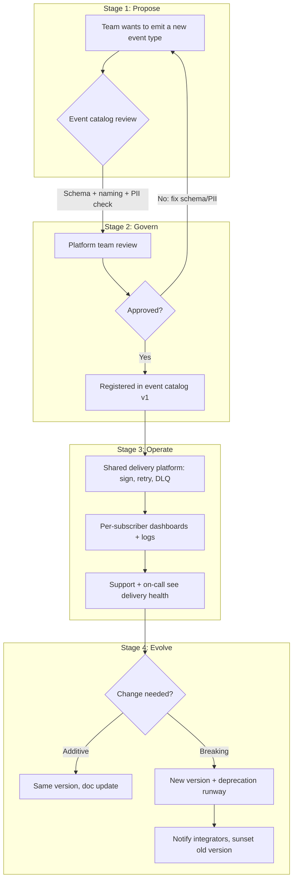

# Webhooks — Staff

At staff level, webhooks stop being a feature you ship and become a **platform you own**. A single team can build a POST-with-retries loop in a sprint. What a staff engineer is accountable for is different: whether the organization has *one* webhook product or *twelve* incompatible ones, whether a payload change silently breaks 400 integrators overnight, whether "webhooks are flaky" is a recurring line item in the support queue, and whether the honest build-vs-buy math has actually been done. This file is about those judgment calls — the organizational, contractual, and investment decisions — not about tighter code.

## Contents

1. [Reframing: webhooks are a product, not an endpoint](#1-reframing-webhooks-are-a-product-not-an-endpoint)
2. [The real cost curve — why a POST loop is a trap](#2-the-real-cost-curve--why-a-post-loop-is-a-trap)
3. [Build vs buy the delivery infrastructure](#3-build-vs-buy-the-delivery-infrastructure)
4. [One shared platform vs every team rolling its own](#4-one-shared-platform-vs-every-team-rolling-its-own)
5. [Ownership and governance flow](#5-ownership-and-governance-flow)
6. [Event schema governance and versioning](#6-event-schema-governance-and-versioning)
7. [Deprecating an event type](#7-deprecating-an-event-type)
8. [Partner trust and the support-burden economics](#8-partner-trust-and-the-support-burden-economics)
9. [Org-wide security posture](#9-org-wide-security-posture)
10. [Framing the investment to leadership](#10-framing-the-investment-to-leadership)
11. [Staff signals and anti-signals](#11-staff-signals-and-anti-signals)

---

## 1. Reframing: webhooks are a product, not an endpoint

The single most valuable move a staff engineer makes here is to reframe the conversation. Middle and senior tiers ask *"how do we deliver events reliably?"* Staff asks *"what does it take to run a public event platform that hundreds of external companies build their businesses on?"*

A webhook, once integrators depend on it, has the same contract weight as a public REST API — arguably more, because the integrator's *server* is the client and you cannot ship a coordinated fix to their code. That reframing pulls in a set of product surfaces that a POST loop never anticipated:

- **Event catalog** — a discoverable, documented list of every event type, its trigger conditions, and its payload schema. Without it, integrators reverse-engineer your events from observed traffic, and then any change breaks them.
- **Schemas and versioning** — machine-readable payload definitions with an explicit versioning contract, so both sides know what "the same event" means over time.
- **Subscriber self-service** — integrators register endpoints, choose event types, rotate signing secrets, and test deliveries without filing a ticket.
- **Delivery dashboards and logs** — per-subscriber visibility into attempts, response codes, retries, and dead-letters. This is what turns "your webhooks are broken" into "your endpoint returned 500 at 14:03; here is the payload."
- **Docs and a replay/test tool** — the difference between a platform partners trust and one they tolerate.

None of these exist in a quick POST loop. Recognizing that the gap between them is a *product investment*, not a backlog ticket, is the staff-level insight.

---

## 2. The real cost curve — why a POST loop is a trap

The trap is that the first 80% looks cheap. Sending an HTTP POST when something happens is a day of work, so the platform gets scoped and funded as a day of work. The cost lives entirely in the long tail that only surfaces once real integrators depend on it:

| Requirement | Naive POST loop | What production actually demands |
|---|---|---|
| Delivery on failure | Fire-and-forget | Durable queue, bounded retries with backoff + jitter, dead-letter queue |
| Slow/hung subscribers | Blocks the caller | Async decoupled delivery, per-subscriber concurrency isolation |
| Ordering | Accidental | Explicit per-resource ordering guarantee (or an explicit "no ordering" contract) |
| Duplicates | Ignored | At-least-once + documented idempotency keys for subscribers |
| Authenticity | None | HMAC signing, timestamped, replay-window enforced |
| Debuggability | Log line | Per-delivery record, dashboard, manual replay |
| Payload evolution | Break everyone | Versioned schemas, deprecation runway |
| Abusive/dead endpoints | Retry forever | Auto-disable, circuit-breaking, subscriber notification |

Each row is a small project. Collectively they are a multi-quarter platform investment, and the staff engineer's job is to make that curve *visible* before the org commits to "just add webhooks."

---

## 3. Build vs buy the delivery infrastructure

There is now a mature market for webhook delivery-as-a-service — Svix, Hookdeck — plus cloud-native primitives like AWS EventBridge and its API destinations. The staff decision is not religious; it is about where the differentiation actually lives. **Webhook delivery mechanics are not a differentiator for almost any company.** Signing, retries, DLQs, and dashboards are table stakes that a specialist vendor has already solved better than you will in your first year.

| Dimension | Buy (Svix / Hookdeck / EventBridge) | Build in-house |
|---|---|---|
| Time to production | Weeks | Multiple quarters |
| Signing / retries / DLQ / dashboards | Included, battle-tested | You build and maintain each |
| Subscriber self-service portal | Provided | Significant additional build |
| Ongoing eng cost | Vendor fee + light integration | A team's standing headcount |
| Data residency / compliance | Vendor's boundary — may block regulated data | Full control |
| Deep custom routing / enrichment | Constrained to vendor model | Unlimited |
| Vendor lock-in / pricing risk | Real; migration is non-trivial | None |
| Egress from your trust boundary | Events leave your perimeter | Stays in-house |

**Default recommendation:** buy first. Reach for build only when a concrete constraint forces it — hard data-residency rules that keep events inside your boundary, extreme volume where per-message vendor pricing dominates, or routing/enrichment logic so specific to your domain that no vendor model fits. Even then, "build" often means *build the routing layer, rent the delivery layer.* The failure mode to name explicitly for leadership: teams love building delivery infra because it is a satisfying distributed-systems problem, and that emotional pull, not a business case, is usually what drives the in-house decision.

---

## 4. One shared platform vs every team rolling its own

The second structural decision: when multiple product teams need to emit webhooks, do they share one internal platform or each build their own? Left ungoverned, the default is fragmentation — and fragmentation is expensive in ways that don't show up on any one team's roadmap.

| Signal | Shared platform | Per-team implementations |
|---|---|---|
| Signature scheme | One scheme, one verification doc | Team A uses HMAC-SHA256, Team B uses a bearer token, Team C forgot |
| Retry / DLQ behavior | Uniform, documented | Divergent; some have no DLQ |
| Integrator experience | One portal, one secret model, one mental model | N portals, N secret rotations, N support paths |
| Security review | Reviewed once, centrally | N surfaces, each a fresh SSRF/secret risk |
| Observability | One dashboard, org-wide delivery health | Siloed or absent |
| Incremental cost per new event source | Register + emit | Re-solve the entire delivery problem |
| Autonomy | Central team can become a bottleneck | Full team autonomy |

The tension is real: a shared platform can become a bottleneck, and teams resent a mandate. The staff move is to make the shared platform the **path of least resistance** — self-service onboarding, good defaults, no ticket required — so teams *choose* it rather than being forced. Consistency of signing, retries, and observability is worth far more than the autonomy each team gives up, but that trade only lands if the platform is genuinely easy to adopt. A shared platform that requires a two-week integration is one teams will route around.

---

## 5. Ownership and governance flow

The load-bearing idea in this flow is that **the platform team owns the contract discipline and the delivery mechanics, while product teams own the events' meaning.** Product teams should not be re-deciding how signing works; the platform team should not be deciding what a `payment.settled` event means. Draw that line clearly and both sides can move fast.

---

## 6. Event schema governance and versioning

A webhook payload is a public contract. The moment an integrator writes `if (payload.status === "completed")`, that field is frozen from their perspective. Breaking it — renaming a field, changing a type, tightening an enum — breaks their production system, and they find out from *their* customers, not from you. This is exactly the discipline of public API versioning, applied to a payload you push instead of a response you return.

Governance principles a staff engineer should hold the line on:

- **Additive changes are safe; everything else is breaking.** Adding a new field is fine if integrators are told to ignore unknown fields (and your docs must say so). Removing, renaming, or retyping a field is a breaking change requiring a new version.
- **Version the event, not just the API.** Payloads carry an explicit version (in the type name, e.g. `invoice.paid.v2`, or a version field) so a subscriber can opt into a new shape on their timeline.
- **Machine-readable schemas are the source of truth.** JSON Schema or equivalent, published in the catalog, validated in CI. A schema that lives only in prose drifts from reality within a quarter.
- **PII and data-minimization review at registration.** Every field pushed to an external endpoint is data leaving your boundary. Payloads should carry references and minimal state, not full customer records, unless there is a reviewed reason.
- **Compatibility is enforced, not hoped for.** A CI check that fails the build if a schema change is non-additive is the single highest-leverage control here — it turns "please don't break the payload" from a code-review plea into an automated gate.

---

## 7. Deprecating an event type

Deprecating a webhook is harder than deprecating an API endpoint, because you have no synchronous signal that a caller is still using it — the *subscriber* is the passive party. You must drive the whole lifecycle from your own telemetry and outreach:

1. **Announce with a dated sunset.** Publish the deprecation in the catalog and changelog with a firm end date and a migration path to the replacement event.
2. **Instrument who still depends on it.** Use delivery records to identify exactly which subscribers still receive the event. This is your real migration list — not a guess.
3. **Notify by segment, not by broadcast.** Reach the active subscribers directly; a blanket email is ignored. Delivery data lets you target only those who matter.
4. **Add friction gradually.** Deprecation headers, then dashboard warnings, then (optionally) reduced-frequency delivery, then sunset. Never a silent cutoff.
5. **Sunset and monitor for fallout.** After removal, watch support and error channels for stragglers who never migrated — there always are some.

The judgment call is the runway length. Public integrators with slow release cycles may need 6–12 months; internal consumers, weeks. Setting that runway too short generates a support crisis; too long, and you carry the maintenance cost of a dead event forever. Match the runway to the *slowest integrator you're willing to support*, and state that policy explicitly rather than negotiating it case by case.

---

## 8. Partner trust and the support-burden economics

Every failed delivery is a potential support ticket, and support tickets are the hidden operating cost that makes or breaks the webhook product's economics. When an integrator's endpoint 500s and your platform has no self-service visibility, the integrator opens a ticket, an engineer digs through logs, and both sides lose hours on what was *the integrator's own bug*.

The staff-level economic argument is that **self-service delivery dashboards are not a nice-to-have; they are how you keep support cost sublinear as integrations grow.** Give integrators:

- Per-delivery logs (payload, headers, response code, latency) they can inspect themselves.
- A manual replay button so they can re-drive a delivery after fixing their endpoint.
- A test/sandbox mode to validate signature verification before going live.
- Clear auto-disable semantics *with notification*, so a partner whose endpoint died learns why deliveries stopped instead of filing a "webhooks stopped working" ticket.

This is also a trust argument. Integrators bet their product on your events firing reliably. A platform with transparent delivery health earns the trust that turns integrators into advocates; an opaque one accumulates resentment that surfaces in churn and in every renewal conversation. Trust and support cost are two views of the same investment.

---

## 9. Org-wide security posture

Webhooks invert the normal request direction — *your* infrastructure makes outbound requests to *attacker-influenceable* URLs — which creates security concerns that must be governed centrally, not per-team.

- **SSRF is the marquee risk.** A subscriber URL is user-supplied. Without a policy, an attacker registers `http://169.254.169.254/...` or an internal address and turns your delivery worker into a proxy into your own network. The control — an allowlist/denylist for destination IP ranges, DNS-rebinding protection, egress through a controlled proxy — must be a platform-level policy applied uniformly, because one team forgetting it is a company-wide breach.
- **Signing secrets are org-scale secret management.** Every subscriber has a signing secret; that is potentially hundreds of thousands of secrets to store, rotate, and revoke. This belongs behind a real secrets-management system with rotation support, not scattered per-team.
- **Signature scheme consistency.** One HMAC scheme, one timestamp/replay-window policy, one verification document that every integrator uses. Divergent per-team schemes multiply both integrator confusion and the attack surface.
- **Payload minimization as a security control.** Every field in a payload is data crossing your trust boundary to a third party. Central schema review that keeps payloads to references-plus-minimal-state is a security posture, not just a governance nicety.

The common thread: these are properties that are only cheap to enforce once, at the platform layer. Enforced per-team, they are guaranteed to be inconsistent, and the weakest team sets the org's actual security level.

---

## 10. Framing the investment to leadership

Leadership does not fund "durable delivery with DLQs." They fund outcomes. The staff engineer's job is to translate the platform work into the language of the business:

- **Frame it as ecosystem enablement, not infrastructure.** "This is how partners build on us without a support engineer in the loop" lands; "we need a retry queue" does not. Webhooks are frequently what lets an integration *exist at all*, which maps directly to partnership and revenue goals.
- **Quantify the support-cost avoidance.** Model the ticket volume of an opaque webhook product versus a self-service one at your projected integrator count. The delta is a headcount number leadership understands.
- **Name the build-vs-buy trade in dollars and quarters.** Present buying as the default with a clear cost, and require a concrete constraint to justify building. This prevents the "fun distributed-systems project" from consuming a team by default.
- **Make the breakage risk concrete.** "A single unversioned payload change can break every integrator simultaneously, and we'd learn about it from their customers." That risk framing is what justifies schema governance and CI compatibility gates — controls that look like overhead until the first outage.
- **Right-size the ask.** Not every org needs Svix-grade tooling. Match the investment to how many external integrators actually depend on the events; an internal-only, two-consumer webhook does not warrant a self-service portal. Knowing when *not* to build the full product is as much a staff signal as building it.

---

## 11. Staff signals and anti-signals

**Signals:**

- Reframes "add webhooks" into "run an event platform" and surfaces the real cost curve before commitment.
- Defaults to buying delivery infra and requires a concrete constraint to justify building.
- Pushes for one shared platform made adoptable by being the easy path, not by mandate.
- Treats payload schemas with the same versioning discipline as public APIs, backed by an automated compatibility gate.
- Governs SSRF and secret management centrally, so the weakest team doesn't set the security level.
- Frames the work to leadership as ecosystem enablement and support-cost avoidance, with real numbers.

**Anti-signals:**

- Lets every team roll its own delivery loop and calls the resulting inconsistency "team autonomy."
- Builds in-house delivery infra because it is interesting, without a business case.
- Ships unversioned payloads and treats a field rename as a routine change.
- Deprecates events by silent cutoff, then absorbs the support fallout as unavoidable.
- Over-invests — a full self-service portal for two internal consumers.

---

*Next step:* [Webhooks — Interview](interview.md)