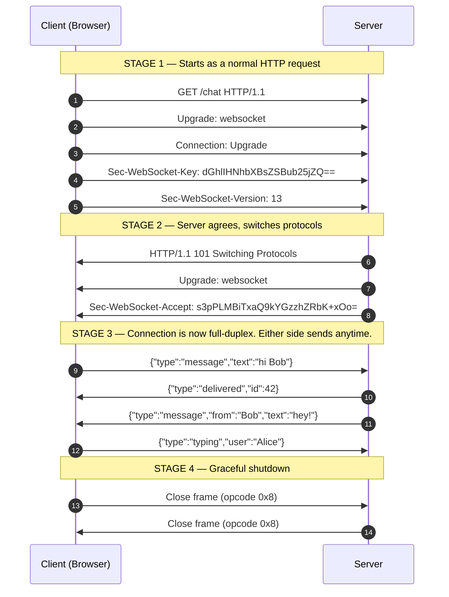

# WebSockets — Junior

<!-- level-focus -->
At junior level, focus on this question:

> How can I apply **WebSockets** in one small example and prove the result?

Use the smallest realistic scenario that exposes the decision and its failure behavior.
## 1. The problem WebSockets solve

Imagine you are building a chat app. Alice types "hello" and it should appear on
Bob's screen instantly. But there is a catch baked into how the classic web
works: **the browser can only get data by asking for it.** The server has no way
to tap Bob on the shoulder and say "new message arrived." Bob's browser has to
keep asking, over and over: *"Anything new? Anything new? Anything new?"*

That constant asking is called **polling**, and it is wasteful. Most of the time
the answer is "no, nothing new," yet you paid for a full round trip anyway — a
new connection, request headers, response headers, all to hear silence.

WebSockets fix this at the root. They open **one connection that stays open**,
and over that single connection **either side can speak at any time**. The server
can finally push Bob his message the instant Alice sends it, without Bob asking.

Think of the difference this way:

- **HTTP polling** is like calling a friend every 10 seconds to ask *"Did the
  package arrive yet?"* — expensive, annoying, and always a little behind.
- **A WebSocket** is like keeping the phone line open the whole time, so the
  moment the package arrives your friend just tells you.

---

## 2. What a WebSocket actually is

A **WebSocket** is a communication protocol that provides a **full-duplex,
persistent connection between a client (usually a browser) and a server over a
single TCP connection.** It was standardized as [RFC 6455](https://datatracker.ietf.org/doc/html/rfc6455)
in 2011 and is supported by every modern browser.

Break that definition into three concrete promises:

1. **Single TCP connection.** One connection is established and reused for the
   entire conversation — you do not pay the setup cost again for every message.
2. **Persistent.** The connection stays open for seconds, minutes, or hours,
   until one side deliberately closes it (or the network drops).
3. **Full-duplex.** Both the client and the server can send data at the same
   time, independently, without waiting for a turn.

A crucial and clever detail: a WebSocket connection **begins its life as an
ordinary HTTP request.** This is deliberate. Because it starts as HTTP on the
familiar ports 80 and 443, it slips through firewalls, proxies, and load
balancers that already know how to handle web traffic. After a brief handshake,
the connection *upgrades* and stops behaving like HTTP entirely.

---

## 3. Full-duplex, persistent, bidirectional — in plain words

These three words appear in every WebSocket definition. Here is what each one
actually means, with a real-life analogy.

| Term | Plain meaning | Analogy |
|---|---|---|
| **Bidirectional** | Data flows in both directions — client to server AND server to client. | A road with traffic going both ways. |
| **Full-duplex** | Both directions are open *simultaneously*; nobody has to wait for the other to finish. | A phone call, where both people can talk and hear at once. |
| **Persistent** | The connection is opened once and kept alive for the whole session. | Leaving the phone line connected instead of redialing for each sentence. |

Contrast **full-duplex** with **half-duplex**: a walkie-talkie is half-duplex —
one person talks, releases the button, then the other talks. Only one direction
at a time. A phone call is full-duplex — both talk at once. WebSockets are the
phone call.

The word **bidirectional** is worth dwelling on, because it is the headline
feature. In plain HTTP, only the *client* starts conversations. With a WebSocket,
**the server can start speaking whenever it wants.** That is the capability chat,
live scores, and notifications all depend on.

---

## 4. How this differs from HTTP request/response

The traditional web runs on the **request/response** model. It is strict and
one-sided:

1. The client sends a **request** ("GET me this page").
2. The server sends back exactly **one response**.
3. The connection's job for that exchange is done.

Two properties fall out of this model, and they are exactly what WebSockets
overturn:

- **The client must always speak first.** The server cannot originate a message.
  It can only ever *reply*. If the server has fresh data and the client has not
  asked, that data just sits and waits.
- **One request, one response.** There is no built-in way for a server to send
  three updates over the next minute off of a single request.

WebSockets flip both of these. After the handshake:

- **The server can PUSH data without the client asking.** This is the single
  most important thing to remember about WebSockets. New chat message? The server
  pushes it. Stock price ticked? Pushed. Teammate moved their cursor in a shared
  doc? Pushed.
- **Many messages flow over one connection**, in both directions, for as long as
  the connection lives.

Here is the mental model side by side:

| Model | Who can start a message? | Messages per connection | Connection lifetime |
|---|---|---|---|
| **HTTP request/response** | Client only | One response per request | Short — often closed right after |
| **WebSocket** | Client *and* server | Unlimited, both ways | Long-lived — stays open |

---

## 5. The upgrade handshake, step by step

So how does a connection that *starts* as HTTP *become* a WebSocket? Through the
**upgrade handshake**. The client sends a normal-looking HTTP GET request, but
with special headers that say "I would like to switch protocols, please."

The key request headers are:

- `Upgrade: websocket` — "I want to change from HTTP to the WebSocket protocol."
- `Connection: Upgrade` — "This connection should be upgraded, not treated as a
  normal request."
- `Sec-WebSocket-Key` — a random one-time value the client generates; the server
  transforms it in a defined way to prove it genuinely understood the handshake.
- `Sec-WebSocket-Version: 13` — the protocol version (13 is the current standard).

If the server agrees, it does **not** reply with the usual `200 OK`. Instead it
replies with the special status **`101 Switching Protocols`**, plus a matching
`Sec-WebSocket-Accept` header. That `101` is the moment the connection stops
being HTTP. From then on, the same TCP connection carries WebSocket messages in
both directions until someone closes it.

The staged sequence below shows the full lifecycle: the HTTP upgrade first, then
the free-flowing bidirectional messages.

Read the diagram top to bottom:

- **Stage 1** looks exactly like a web request. Nothing exotic — just extra
  headers.
- **Stage 2** is the pivot. The `101 Switching Protocols` response is the
  handshake being accepted.
- **Stage 3** is the payoff. Notice that the server sends message #8 (`Bob`'s
  reply) *without* the client asking for it. That is server push in action, and
  it is impossible in plain request/response.
- **Stage 4** is the polite goodbye. Either side sends a *close frame* and the
  connection tears down.

---

## 6. The `ws://` and `wss://` schemes

Just as web pages use `http://` and `https://`, WebSocket URLs use two dedicated
schemes:

- **`ws://`** — an **unencrypted** WebSocket, analogous to `http://`. Data
  travels in plaintext. Fine for local experiments; **never** use it in
  production.
- **`wss://`** — a **secure**, TLS-encrypted WebSocket, analogous to `https://`.
  The connection is encrypted end to end. This is what you use in the real world.

An example URL: `wss://chat.example.com/socket`.

| Scheme | Encrypted? | Default port | Web analogue | Use in production? |
|---|---|---|---|---|
| `ws://` | No | 80 | `http://` | No — plaintext, insecure |
| `wss://` | Yes (TLS) | 443 | `https://` | Yes — always prefer this |

A practical rule: if your page is served over `https://`, browsers will **refuse**
to open a plain `ws://` connection from it (mixed-content blocking). So on any
real HTTPS site you must use `wss://`. Treat `wss://` as the default and `ws://`
as a local-only convenience.

---

## 7. What a message looks like once connected

Once the handshake is done, you no longer think in terms of headers and status
codes. You think in **messages** (also called *frames*). A message is just a chunk
of data you send across the open pipe. It can be:

- **Text** — most commonly a JSON string like `{"type":"chat","text":"hi"}`.
- **Binary** — raw bytes, useful for images, audio, or compact game state.

From a beginner's point of view, the browser API is refreshingly simple. You
open a socket, then react to a small set of events:

- **open** — the handshake succeeded; the pipe is ready.
- **message** — data arrived from the server (this fires every time the server
  pushes something).
- **close** — the connection ended.
- **error** — something went wrong.

And to send, you simply call *send* with your text or bytes. There is no URL to
hit, no method to choose, no headers to set per message. The heavy lifting
happened once, during the handshake.

Under the hood, the protocol also uses tiny **ping/pong** control frames to check
that the other side is still alive. You rarely deal with these directly as a
junior — the browser and server libraries handle them — but it is good to know
they exist and are how a WebSocket detects a silently dead connection.

---

## 8. Real-world use cases

WebSockets shine wherever data needs to flow **fast and in real time, often
initiated by the server.** Concrete examples you have almost certainly used:

- **Chat and messaging.** WhatsApp Web, Slack, Discord, customer-support widgets.
  A new message must appear the instant it is sent — the server pushes it to
  every participant.
- **Live sports scores and news tickers.** As soon as a goal is scored, the
  server pushes the update to thousands of connected fans simultaneously.
- **Collaborative editing.** Google Docs, Figma, Notion. When a teammate types or
  moves their cursor, everyone else sees it live. Each keystroke is a message
  flowing both ways.
- **Multiplayer games.** Player positions, actions, and world state must sync many
  times per second with the lowest possible latency. The persistent connection
  avoids per-message setup cost.
- **Trading and financial dashboards.** Stock prices, crypto tickers, and order
  books update continuously. A trader needs the price *now*, not after the next
  poll.
- **Live notifications and presence.** "3 people are viewing this," "someone
  liked your post," ride-share driver location on a moving map.

The common thread: **the server has information the client wants the instant it
exists, and the client shouldn't have to keep asking.** Whenever you see that
pattern, WebSockets are a natural fit.

---

## 9. WebSocket vs HTTP polling — a comparison

Before WebSockets, the common workaround was **polling**: the client repeatedly
sends HTTP requests on a timer to check for updates. It works, but it is a blunt
instrument. This table lays the two approaches side by side.

| Aspect | HTTP Polling | WebSocket |
|---|---|---|
| **Connection** | New connection (or short-lived) per request | One persistent connection reused for everything |
| **Who initiates data** | Client only — must keep asking | Both sides; server can push freely |
| **Latency of updates** | Up to one polling interval late (e.g. every 5 s) | Near-instant — pushed the moment data changes |
| **Overhead per message** | Full HTTP headers + handshake every time | Tiny frame overhead (a few bytes) after setup |
| **Wasted requests** | Many — most polls return "nothing new" | None — messages sent only when there's data |
| **Server load (many clients)** | High — constant flood of requests | Lower — idle connections cost little |
| **Complexity to build** | Very simple; just a timer + a fetch | More setup: handshake, reconnection, state |
| **Firewall/proxy friendliness** | Excellent — it's just HTTP | Good — starts as HTTP, but some old proxies fumble it |
| **Good fit for** | Infrequent, non-urgent updates | Frequent, real-time, two-way data |

The takeaway: **polling trades efficiency and freshness for simplicity.** If
updates are rare and a few seconds of delay is fine (say, checking for a new
email every minute), polling is perfectly acceptable and easier to build. But for
anything that must feel *live* — chat, games, prices, collaboration — polling
falls apart under its own overhead, and WebSockets are the right tool.

> 🎞️ **See it animated:** [The WebSocket handshake and message flow (MDN WebSocket API)](https://developer.mozilla.org/en-US/docs/Web/API/WebSockets_API)

---

## 10. When you should NOT reach for WebSockets

WebSockets are exciting, but they are not the answer to every problem. Reaching
for them by default is a common junior mistake. Prefer simpler tools when:

- **The data flows only one way, server to client.** If clients never need to
  send anything back in real time (a live scoreboard you only *watch*), a simpler
  one-directional stream called **Server-Sent Events (SSE)** is often easier and
  works over plain HTTP.
- **Updates are rare or not time-sensitive.** If checking every 30 seconds is
  fine, plain polling is simpler to build, debug, and scale.
- **You just need to fetch or submit data once.** Loading a page, submitting a
  form, calling a REST API — that is exactly what request/response is for. Don't
  open a persistent socket to do a single lookup.

A good instinct: start with ordinary HTTP. Reach for WebSockets only when you
genuinely need **frequent, low-latency, two-way** communication. Using the
simplest tool that fits is a hallmark of good engineering.

---

## 11. Common beginner misconceptions

A few things trip up almost everyone learning WebSockets:

- **"WebSockets replace HTTP."** No. They *complement* it. Your app still uses
  HTTP for loading pages, images, and REST calls. WebSockets handle the specific
  slice that needs real-time two-way data.
- **"It's just AJAX / polling under a nicer name."** No. Polling repeatedly opens
  short requests. A WebSocket is one long-lived connection where the server can
  push. The mechanics are fundamentally different.
- **"The connection lives forever automatically."** No. Networks drop, phones
  sleep, Wi-Fi switches to cellular. Real apps must **detect disconnects and
  reconnect** — you'll learn this at the middle level.
- **"WebSockets guarantee messages are delivered in order and never lost."** They
  ride on TCP, so bytes arrive ordered *while the connection is up* — but if the
  connection drops mid-message, delivery is not guaranteed. Robust apps add their
  own acknowledgements.
- **"`ws://` is fine, it's basically the same as `wss://`."** No. `ws://` is
  unencrypted plaintext. Always use `wss://` in production.

---

## 12. Key takeaways

- A **WebSocket** is a **full-duplex, persistent, bidirectional** connection over
  a **single TCP connection** — one pipe, kept open, that both sides can use at
  once.
- Its defining superpower versus HTTP: **the server can PUSH data without the
  client asking.** No more constant "anything new?" polling.
- Every WebSocket **starts as an ordinary HTTP request** and then performs an
  **upgrade handshake**: `Upgrade: websocket` → the server replies `101 Switching
  Protocols` → the connection is now a live two-way channel.
- Use **`wss://`** (encrypted) in production; `ws://` is plaintext and local-only.
- Perfect for **chat, live scores, collaborative editing, multiplayer games, and
  trading dashboards** — anything real-time and two-way.
- Not a silver bullet: for one-way streams consider **SSE**, and for rare or
  non-urgent updates plain **polling** or a simple **HTTP request** is often the
  better, simpler choice.

Once these fundamentals click, the next level digs into what happens *after* the
handshake in real systems: framing, ping/pong keep-alives, reconnection, scaling
across many servers, and the subprotocols that structure your messages.

*Next step:* [Middle level](middle.md)

---

## Apply it

1. Choose one small, known input for **WebSockets**.
2. Predict the output or observable behavior.
3. Run the smallest example or probe that exercises the concept.
4. Change one input to trigger a failure or boundary case.
5. Explain the evidence using the guide's vocabulary.

## Verify your work

- Record the exact input, command or code path, and output.
- Repeat the probe and confirm the result is consistent.
- Show one expected success and one expected failure.
- Resolve any difference between the prediction and the evidence.

## Review questions

- What problem does WebSockets solve in the example?
- Which input changes the observed result, and why?
- What is the smallest useful success check?
- Which beginner mistake would your evidence catch?
