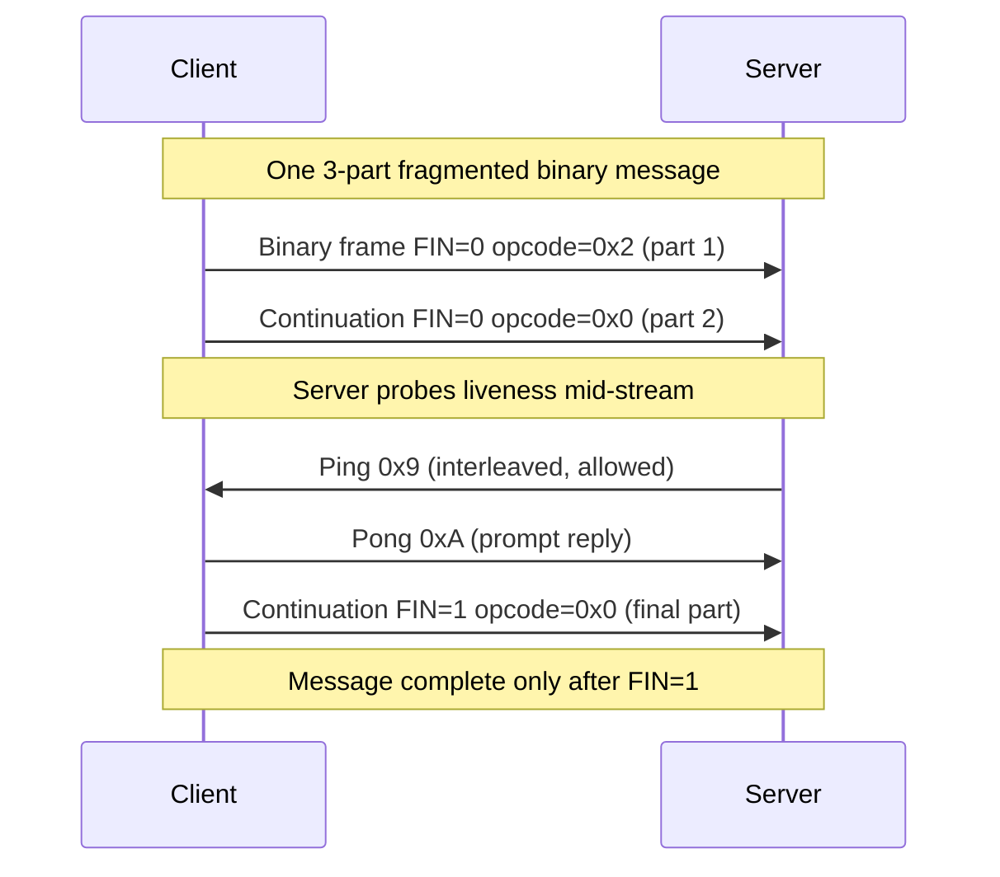

# WebSockets — Middle

<!-- level-focus -->
At middle level, focus on this question:

> Where does **WebSockets** belong in a maintainable component, and which trade-off selects the design?

Use the smallest realistic scenario that exposes the decision and its failure behavior.
## 1. The Upgrade handshake

A WebSocket connection does not open with a bespoke protocol negotiation. It *starts life as an ordinary HTTP/1.1 GET request* and then asks the server to switch the byte stream underneath it to the WebSocket wire protocol. This piggybacking is deliberate: it reuses port 443, existing TLS, proxies, and auth cookies, so a WebSocket can travel the same paths as normal web traffic.

The client sends a GET with an `Upgrade` header:

```
GET /chat HTTP/1.1
Host: example.com
Upgrade: websocket
Connection: Upgrade
Sec-WebSocket-Key: dGhlIHNhbXBsZSBub25jZQ==
Sec-WebSocket-Version: 13
Origin: https://app.example.com
Sec-WebSocket-Protocol: chat.v2, chat.v1
```

Four headers are load-bearing:

- **`Upgrade: websocket`** and **`Connection: Upgrade`** together signal "stop treating this as HTTP after the response." Both are required; `Connection: Upgrade` tells intermediaries the `Upgrade` header is hop-by-hop and must be honored, not forwarded blindly.
- **`Sec-WebSocket-Version: 13`** is the version defined by RFC 6455. If the server speaks a different version it replies `426 Upgrade Required` with a `Sec-WebSocket-Version` header listing what it supports.
- **`Sec-WebSocket-Key`** is a random 16-byte nonce, base64-encoded — the client's half of a challenge (Section 2).

If the server agrees, it replies with the pivotal status line:

```
HTTP/1.1 101 Switching Protocols
Upgrade: websocket
Connection: Upgrade
Sec-WebSocket-Accept: s3pPLMBiTxaQ9kYGzzhZRbK+xOo=
Sec-WebSocket-Protocol: chat.v2
```

**`101 Switching Protocols`** is the whole point. It is the only 1xx-adjacent code that transfers ownership of the TCP connection: after the empty line following these headers, *nothing on the wire is HTTP anymore* — it is WebSocket frames in both directions. There is no body, no `Content-Length`; the response ends at the blank line and the socket becomes a full-duplex frame channel.

A common failure mode: the server returns `200 OK` or `400 Bad Request` instead of `101`. That means something in the path (a reverse proxy, a WAF, an old load balancer) stripped or mishandled the `Upgrade`/`Connection` headers. WebSocket upgrades break silently on infrastructure that isn't Upgrade-aware — this is one of the most common "it works locally, fails in staging" incidents.

## 2. Sec-WebSocket-Key and Sec-WebSocket-Accept

The `Sec-WebSocket-Key` / `Sec-WebSocket-Accept` exchange is **not** authentication and **not** encryption. It is a handshake-integrity check: it proves the responding endpoint actually understood the WebSocket handshake rather than being, say, a cache that blindly echoed a stored `101` or an HTTP server that got confused by the request. Without it, a poorly-behaved proxy could replay a canned response and both sides would start writing frames into a peer that isn't listening.

The computation is fixed and deterministic:

1. Take the client's `Sec-WebSocket-Key` value (the raw base64 string, e.g. `dGhlIHNhbXBsZSBub25jZQ==`).
2. Concatenate the magic GUID `258EAFA5-E914-47DA-95CA-C5AB0DC85B11` (this constant is baked into RFC 6455).
3. Take the SHA-1 hash of that ASCII string.
4. Base64-encode the 20-byte digest → that is `Sec-WebSocket-Accept`.

The client, having generated the key, can compute the expected `Accept` independently and reject the connection if the server's value doesn't match. Because the key is a fresh random nonce per connection, a cache cannot pre-store a valid answer.

Two things middle engineers get wrong here:

- **It provides zero security.** SHA-1 over a public constant is trivially forgeable by any real WebSocket server. Anyone treating this as auth is mistaken — put real authentication in the handshake HTTP request (a cookie, a bearer token in a header, or a token in the query string), which is validated *before* you return `101`.
- **The `Key` must be freshly random.** Reusing it isn't a functional bug (the math still works) but it defeats the anti-caching intent.

## 3. Subprotocols and extensions

RFC 6455 defines the transport — frames of bytes — but says nothing about *what those bytes mean*. That is left to a **subprotocol**, negotiated at handshake time via `Sec-WebSocket-Protocol`.

The client advertises an ordered preference list:

```
Sec-WebSocket-Protocol: wamp, mqtt, chat.v2
```

The server picks **exactly one** it supports and echoes it back in its `101` response, or omits the header entirely to mean "no application subprotocol, we'll use whatever the app assumes." If the server picks something not in the client's list, the client must fail the connection. This is the mechanism behind real protocols layered on WebSocket: **STOMP**, **WAMP**, **MQTT-over-WS**, **GraphQL over WebSocket** (`graphql-transport-ws`), and countless app-specific ones like `chat.v2`.

Subprotocols are also the clean way to do **API versioning on a persistent connection**: bump `chat.v1` to `chat.v2`, let old and new clients advertise what they speak, and let the server negotiate — no URL change, no separate endpoint.

Distinct from subprotocols are **extensions**, negotiated with `Sec-WebSocket-Extensions`. Extensions modify the framing layer itself. The one you'll actually meet is **`permessage-deflate`** (RFC 7692), which compresses message payloads. It cuts bandwidth substantially for text (JSON) but costs CPU and — importantly — memory: each connection keeps a compression context (a sliding window, often ~32 KB per direction), which multiplies across thousands of connections. Enable it deliberately, not reflexively.

## 4. Framing: data frames and control frames

Once upgraded, all communication is **frames**. A WebSocket message is one or more frames; framing exists so the protocol can carry binary safely, interleave control signals, and stream large payloads without buffering everything first.

Each frame carries a few key fields:

- **FIN bit** — 1 if this is the final frame of a message, 0 if more fragments follow. A single logical message can be split across many frames.
- **Opcode** (4 bits) — what kind of frame this is.
- **MASK bit + masking key** — client-to-server frames **must** be masked with a random 4-byte key XORed over the payload; server-to-client frames must **not** be masked. Masking exists to defeat cache-poisoning attacks against intermediaries that might misinterpret WebSocket bytes as HTTP.
- **Payload length** — 7 bits, or 7+16, or 7+64 bits depending on size, allowing frames up to 2⁶³ bytes.

The opcodes split into two families:

| Opcode | Name | Family | Meaning |
|--------|------|--------|---------|
| `0x0` | Continuation | Data | Continues a fragmented message |
| `0x1` | Text | Data | UTF-8 text payload (must be valid UTF-8) |
| `0x2` | Binary | Data | Arbitrary bytes (protobuf, images, msgpack) |
| `0x8` | Close | Control | Begin/acknowledge the close handshake |
| `0x9` | Ping | Control | Liveness probe |
| `0xA` | Pong | Control | Reply to a ping |

**Text (`0x1`) vs Binary (`0x2`)** is a real semantic choice, not cosmetic. Text frames must be valid UTF-8 and are decoded to strings by the client (`event.data` is a `String` in the browser). Binary frames deliver a `Blob` or `ArrayBuffer` — use them for protobuf, MessagePack, compressed blobs, or anything that isn't text. Sending raw bytes as a text frame corrupts them; sending JSON as binary works but forces manual decoding. Pick the frame type that matches your payload.

**Control frames** (`0x8`, `0x9`, `0xA`) have hard rules: they must be ≤125 bytes, must not be fragmented (FIN must be 1), and may be **injected in the middle of a fragmented data message**. That last rule is why a Ping can be answered promptly even while a 4 MB binary upload is streaming across multiple continuation frames.



## 5. Ping/pong keepalive and idle timeouts

TCP can hold a connection "open" that is actually dead — a NAT box dropped the mapping, a laptop went to sleep, a mobile radio switched networks. Nothing arrives, nothing errors; the socket just sits there. WebSocket's answer is the **ping/pong** control-frame pair.

Either side sends a **Ping (`0x9`)**; the peer **must** reply with a **Pong (`0xA`)** carrying the same application data, "as soon as is practical." This gives you two things:

1. **Liveness detection.** If you ping every N seconds and don't get a pong within a timeout, the connection is dead — tear it down and reclaim the resources rather than leaking a zombie.
2. **Keepalive against idle timeouts.** Load balancers and proxies aggressively close idle connections. AWS ALB defaults to **60 seconds** of idle before it drops the connection; nginx `proxy_read_timeout` defaults to **60s**; many corporate proxies are stricter. If your app has quiet periods longer than that, the intermediary silently kills the socket. A ping every 20–30 seconds keeps traffic flowing and the mapping warm.

A frequent mistake: relying on browser `WebSocket` to expose ping/pong. It doesn't — the browser sends pongs automatically in response to server pings, but JavaScript can't send a protocol-level ping. So the **server** should drive keepalive pings, or the app should send its own application-level heartbeat message (a tiny `{"t":"ping"}` text frame) if it needs the client to initiate. Set your ping interval *below* the tightest idle timeout in the path (e.g., 25s for a 60s ALB timeout) to leave margin.

## 6. The connection lifecycle

A WebSocket has three phases: **opening** (the HTTP upgrade), the **open** data phase (bidirectional frames), and **closing** (the close handshake). Modeling this explicitly matters because each phase has distinct failure modes and each browser `WebSocket` readyState (`CONNECTING=0`, `OPEN=1`, `CLOSING=2`, `CLOSED=3`) maps directly onto it.

Walking the happy path:

1. **Connecting.** Client fires the upgrade GET. The browser exposes `readyState = CONNECTING`. No application data may be sent yet.
2. **Open.** Server returns `101`; the `onopen` event fires, `readyState = OPEN`. Now either side sends text/binary frames at any time, in any order — this is full duplex, unlike request/response. Ping/pong runs underneath.
3. **Closing.** One side initiates the close handshake (Section 7). `readyState = CLOSING`.
4. **Closed.** Both Close frames exchanged (or the connection dropped abnormally); `onclose` fires with a code and reason; `readyState = CLOSED`. The connection object is dead and cannot be reused — reconnection means a brand-new handshake.

The lifecycle is symmetric in the open phase — a crucial mental shift from HTTP. There is no "the client asked, the server answers." The server can push a frame the instant it has data, and the client can too, without either polling.

## 7. The close handshake and close codes

WebSocket closes are **not** a silent TCP FIN. RFC 6455 defines a graceful close handshake so both sides agree *why* the connection ended and can flush in-flight data cleanly.

The initiator sends a **Close frame (`0x8`)** whose payload is a 2-byte close code plus an optional UTF-8 reason string. The peer replies with its own Close frame (echoing a code), and *then* the underlying TCP connection is closed — ideally by the server, to avoid TIME_WAIT accumulating on the server side. Until it receives the echo, the initiator stays in CLOSING.

The close codes are a defined vocabulary. The ones worth knowing:

| Code | Name | When you'll see it |
|------|------|--------------------|
| `1000` | Normal Closure | Clean, intentional shutdown; the default "we're done" |
| `1001` | Going Away | Server shutting down / page navigating away |
| `1002` | Protocol Error | Peer sent a malformed frame |
| `1003` | Unsupported Data | Got binary when only text is accepted (or vice versa) |
| `1006` | Abnormal Closure | **Reserved — never sent on the wire**; the local endpoint synthesizes it when the connection died without a Close frame (TCP reset, network drop) |
| `1008` | Policy Violation | Generic "you broke a rule" (e.g., failed a message-level auth check) |
| `1009` | Message Too Big | Frame/message exceeded the receiver's limit |
| `1011` | Internal Error | Server hit an unexpected condition |
| `1012`/`1013` | Service Restart / Try Again Later | Backpressure or maintenance; hint the client to reconnect with backoff |

**`1006` is the one you'll actually chase in logs.** It never travels over the wire — it means "the connection vanished without a close handshake." A wall of `1006` in your metrics points at network instability, a proxy killing idle sockets (Section 5), OOM-killed server processes, or clients on flaky mobile networks. Because there was no graceful close, any frames in flight may have been lost, so your reconnect logic must assume the last message may not have been delivered.

Practical guidance: send `1000` for clean shutdowns, use `1012`/`1013` before a deploy so clients back off instead of thundering, and always implement client reconnection with **exponential backoff and jitter** — a server restart that drops 50,000 connections will get 50,000 simultaneous reconnects otherwise.

## 8. WebSockets vs SSE vs long-polling

WebSockets are not always the answer. Three techniques deliver "server sends data to client without the client re-asking," and the right choice depends on directionality, infrastructure, and payload.

| Dimension | Long-polling | Server-Sent Events (SSE) | WebSockets |
|-----------|--------------|--------------------------|------------|
| Direction | Client→server per poll; server replies once | **Server→client only** (unidirectional) | **Full duplex** (both directions) |
| Transport | Plain HTTP request/response | HTTP response held open (`text/event-stream`) | TCP after HTTP `101` upgrade |
| Data type | Any | **UTF-8 text only** (no binary) | Text **and** binary |
| Auto-reconnect | Manual | **Built-in** (browser retries, `Last-Event-ID`) | Manual (you write the reconnect loop) |
| Proxy/infra friendliness | Highest (just HTTP) | High (ordinary HTTP response) | Lowest (needs Upgrade-aware proxies/LBs) |
| Overhead per update | New request each time (headers, TCP/TLS if not kept alive) | One long-lived response, low overhead | One connection, lowest per-message overhead |
| HTTP/2 multiplexing | N/A | Yes (shares a connection) | No (WS is its own connection) |
| Browser API | `fetch`/`XHR` loop | `EventSource` | `WebSocket` |
| Best for | Legacy fallback, rare updates | Feeds, notifications, live scores, LLM token streaming | Chat, multiplayer, collaborative editing, trading |

Decision heuristics:

- **You only need server→client push, text is fine, and you want it dead-simple?** Use **SSE**. Automatic reconnection with `Last-Event-ID`, works over plain HTTP, no special proxy config. This is why LLM streaming UIs use SSE, not WebSockets.
- **You need the client to push to the server frequently and with low latency, or you need binary?** Use **WebSockets**. Chat, presence, multiplayer game state, collaborative cursors.
- **Your infrastructure can't handle either (ancient proxy, corporate firewall)?** **Long-polling** as a fallback — Socket.IO and similar libraries degrade to it automatically.

A note SSE's one classic limitation carries: over **HTTP/1.1**, browsers cap concurrent connections per origin at ~6, and each SSE stream consumes one — open several and the tab stalls. Over **HTTP/2**, streams multiplex and the limit effectively disappears. WebSockets don't multiplex over HTTP/2, but each browser tab typically needs only one WS connection anyway.

## 9. The stateful-connection tax on servers

Here is the operational reality that separates a middle engineer from a junior: **every open WebSocket is a stateful object the server must hold in memory, for the entire lifetime of the connection.** HTTP request/response is stateless — a request arrives, you handle it, you free everything. A WebSocket is the opposite: it may live for hours, and while it lives it consumes resources whether or not any data flows.

What each connection costs:

- **A file descriptor.** Every socket is an fd. The kernel default `ulimit -n` is often **1024** — meaning a naïvely-configured process refuses the 1025th connection. Serving 100k connections per box requires raising this to well above 100k (`fs.file-max`, `ulimit -n`, `LimitNOFILE` in systemd) *before* you scale, or you hit a hard wall.
- **Kernel socket buffers.** Each TCP socket has send and receive buffers (tunable via `net.ipv4.tcp_rmem` / `tcp_wmem`), often tens of KB each. At 100k connections that's gigabytes of kernel memory before your app allocates a single byte.
- **Application state.** Your per-connection object — user ID, subscriptions, a write queue/buffer, the `permessage-deflate` context if enabled. Keep this lean; a fat per-connection struct multiplied by 100k is where memory disappears.
- **Threads, if you use blocking I/O.** A thread-per-connection model (one OS thread blocked on each socket) collapses at a few thousand connections — each thread's stack is ~1 MB. This is why high-connection WebSocket servers use **event-driven / async I/O** (epoll/kqueue, Go goroutines, Node's event loop, Netty): one thread multiplexes thousands of idle sockets, spending CPU only when a frame actually arrives.

The mental model shift: with HTTP you provision for **requests per second** (throughput). With WebSockets you provision for **concurrent connections** (a standing population), plus the message rate on top. A server can be nearly idle CPU-wise while pinned at its connection limit purely on memory and fds. Capacity planning must count *simultaneous open connections*, not just RPS.

## 10. Sticky sessions and the first scaling wall

Because a WebSocket is stateful and lives on **one specific server**, it introduces a constraint that stateless HTTP doesn't: **affinity**.

With stateless HTTP behind a load balancer, request #1 can hit server A and request #2 can hit server B — they share nothing, so it doesn't matter. With WebSockets, the connection *is* the state, and it physically resides in server A's memory and on server A's fd. Every frame on that connection **must** return to server A. If the load balancer routes a frame to server B, there is no connection there — the frame is meaningless.

Two consequences follow:

1. **The upgrade must land on a server that will keep the connection.** Since the whole connection is pinned from the `101` onward, you need the load balancer to be Layer-4 (TCP) aware, or to use **sticky sessions** so the upgrade and all subsequent traffic stay on one backend. AWS ALB, HAProxy, and nginx all support WebSocket passthrough, but you must configure it (e.g., nginx needs the `Upgrade`/`Connection` header proxying block and a long `proxy_read_timeout`).

2. **Cross-server messaging needs a backplane.** If user Alice is connected to server A and Bob to server B, and Alice sends Bob a message, server A has no direct way to reach Bob's socket — it's on B. The standard solution is a **pub/sub backplane** (Redis pub/sub, NATS, Kafka): server A publishes "message for Bob" to a channel, every app server subscribes, server B sees it and writes to Bob's local socket. This decouples "which server holds the connection" from "which server originated the message," and is the foundation of horizontally-scaled real-time systems.

This is the first scaling wall you hit, and it reshapes the architecture: you can no longer treat app servers as interchangeable and disposable. A deploy that restarts servers drops their connections (send `1012` first), clients reconnect and may land on a *different* server, and your backplane must make that transparent. Senior-level material builds the full fan-out and scaling design on top of exactly this constraint.

## 11. Practical checklist

- **Handshake:** confirm your entire path (LB, WAF, CDN, reverse proxy) forwards `Upgrade`/`Connection` and returns `101`, not `200`/`400`.
- **Auth in the handshake:** validate a cookie or token on the upgrade request *before* returning `101`. Never treat `Sec-WebSocket-Accept` as security.
- **Framing:** choose Text for UTF-8, Binary for everything else; enable `permessage-deflate` only after weighing its per-connection memory cost.
- **Keepalive:** server-driven ping every 20–30s, below the tightest idle timeout (ALB/nginx default 60s); tear down on missing pong.
- **Close:** send `1000` for clean shutdowns, `1012`/`1013` before deploys; expect `1006` in logs and design reconnection with exponential backoff + jitter around it.
- **Capacity:** raise `ulimit -n` well above your target connection count; plan for concurrent connections (memory, fds), not just RPS; use async I/O, never thread-per-connection.
- **Scaling:** enable WebSocket-aware sticky routing on the LB and put a pub/sub backplane between app servers before you add the second box.

---

*Next step:* [Senior level](senior.md)

---

## Apply it

1. Find a real component where **WebSockets** affects an interface or dependency.
2. Write two plausible choices and the constraint that favors each one.
3. Make the smallest reversible change at that boundary.
4. Exercise the component alone, then exercise the integrated flow.
5. Keep the decision note with the evidence that selected the option.

## Verify your work

- A focused check proves the local behavior.
- An integrated check proves callers and dependencies still agree.
- Logs, traces, compiler output, or benchmarks expose the boundary.
- Reverting the change restores the previous behavior without unrelated edits.

## Review questions

- Which boundary is most affected by WebSockets?
- What constraint would make you choose the alternative design?
- How would you isolate a local defect from an integration defect?
- What evidence shows that the change remains maintainable?
