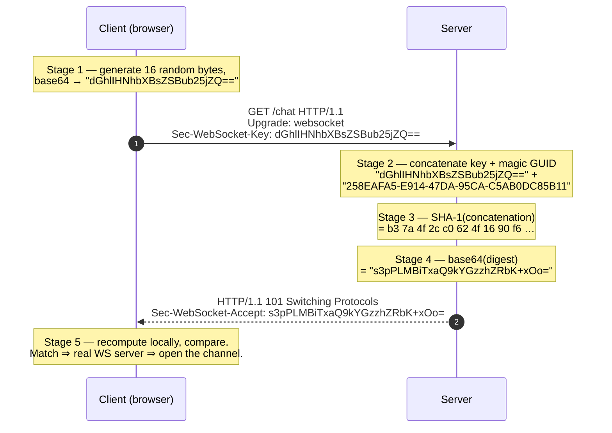

# WebSockets — Theory and Formal Foundations

<!-- level-focus -->
At professional level, focus on this question:

> How should teams adopt and operate **WebSockets — Theory and Formal Foundations** with measurable outcomes and limited coordination?

Use the smallest realistic scenario that exposes the decision and its failure behavior.
## 1. Why WebSockets Exist as a Distinct Protocol

Before RFC 6455, "real-time" browser communication meant abusing HTTP: long-polling (hold a request open until data arrives, then reconnect), forever-frames, or repeated short polls. Every one of these pays HTTP's per-message tax — request line, header block, and a fresh round trip — and none is truly bidirectional: the server cannot speak unless the client has an outstanding request pending.

WebSockets solve a narrow problem precisely. After a one-time HTTP-shaped handshake, the connection is *upgraded*: both endpoints stop speaking HTTP and start speaking the WebSocket framing protocol over the same TCP bytestream. From that point the channel is:

- **Full-duplex** — either side may send at any time, independently.
- **Message-oriented** — the wire carries discrete messages (text or binary), not an undelimited byte stream. Framing restores message boundaries that TCP erases.
- **Low-overhead** — a small message costs as few as 2 bytes of framing overhead (plus 4 for the client mask), versus hundreds of header bytes for an HTTP request.
- **Origin-aware** — the handshake carries the browser `Origin`, letting servers apply cross-origin policy.

The design tension baked into RFC 6455 is *compatibility with the existing web*. WebSockets must traverse HTTP proxies, terminate on port 80/443, and start as something a proxy recognizes as HTTP — while defending against the fact that intermediaries were never designed to see a bytestream that stops being HTTP mid-connection. Almost every peculiar detail below (the magic GUID, mandatory masking, the specific handshake shape) is a direct consequence of that tension.

---

## 2. The Opening Handshake, Formally

The handshake is an ordinary HTTP/1.1 `GET` carrying an `Upgrade` request. It is HTTP so that the request survives proxies, load balancers, and TLS termination that only understand HTTP. It requests a *protocol switch* so that, once the server agrees, both parties abandon HTTP.

A conforming client request contains, at minimum:

```
GET /chat HTTP/1.1
Host: server.example.com
Upgrade: websocket
Connection: Upgrade
Sec-WebSocket-Key: dGhlIHNhbXBsZSBub25jZQ==
Sec-WebSocket-Version: 13
Origin: https://client.example.com
```

The four load-bearing fields are: `Upgrade: websocket` and `Connection: Upgrade` (the switch request), `Sec-WebSocket-Version: 13` (the RFC 6455 version — any other value the server rejects with a `Sec-WebSocket-Version` header listing what it supports), and `Sec-WebSocket-Key` (a 16-byte random nonce, base64-encoded to a 24-character string). Optional but common: `Sec-WebSocket-Protocol` (subprotocol negotiation, e.g. `chat`, `mqtt`) and `Sec-WebSocket-Extensions` (e.g. `permessage-deflate`).

A conforming server response is an HTTP `101 Switching Protocols`:

```
HTTP/1.1 101 Switching Protocols
Upgrade: websocket
Connection: Upgrade
Sec-WebSocket-Accept: s3pPLMBiTxaQ9kYGzzhZRbK+xOo=
```

The `101` status is the pivot. Before it, the connection is HTTP; after the response's terminating CRLF, every byte in both directions is WebSocket framing. There is no third phase: the handshake is a single request/response, and either it produces `101` or it fails as a normal HTTP error (e.g. `400`, `426 Upgrade Required`).

Critically, the handshake is **not** a security boundary by itself. Origin checks, subprotocol validation, and authentication (cookies, bearer tokens in the URL or subprotocol) all live in this HTTP exchange, because it is the last moment the connection is inspectable as HTTP. Anything you fail to check here, you cannot cleanly check later.

---

## 3. Sec-WebSocket-Accept: A Proof, Not a Password

The single most misunderstood part of RFC 6455 is `Sec-WebSocket-Key` / `Sec-WebSocket-Accept`. It is **not** authentication, not encryption, and not a nonce against replay in the cryptographic sense. It is a *proof that the responding endpoint actually understood the WebSocket handshake* — that it is a real RFC 6455 server, not some other service tricked into echoing bytes.

The computation is fixed and deterministic. The server takes the client's `Sec-WebSocket-Key` string exactly as received, concatenates the magic GUID `258EAFA5-E914-47DA-95CA-C5AB0DC85B11`, computes SHA-1 over that ASCII string, and base64-encodes the 20-byte digest. That value goes back as `Sec-WebSocket-Accept`.



Why does this ceremony exist? Consider what an attacker controls. A malicious page can make a browser issue a `GET` to any origin (subject to CORS for the *response body*, but the request still goes out). Suppose the target is not a WebSocket server but a naive HTTP endpoint, or a caching proxy. Without the accept challenge, an attacker could:

- **Cache-poison** — trick a caching proxy into treating a crafted request/response pair as a normal HTTP exchange and caching attacker-influenced content under a legitimate URL.
- **Confuse a non-WS service** into a state where it echoes attacker-chosen bytes, which the browser might then interpret as a valid upgrade.

The accept challenge closes this: only a server that knows the RFC 6455 algorithm — take *my specific random key*, append *this specific GUID*, hash, encode — can produce the exact `Sec-WebSocket-Accept` the client is expecting. A cache serving a stale or generic response cannot; an HTTP service that merely echoes cannot; an attacker cannot precompute it because the key is fresh per connection. The magic GUID is a shared constant that makes the transform WebSocket-specific — it guarantees the SHA-1 input could only have been assembled by code that implements this exact protocol. It is *domain separation*, not a secret.

Two properties follow. First, the client MUST verify `Sec-WebSocket-Accept` and abort if it mismatches (RFC 6455 §4.1). Second, because SHA-1 here is used only for its bijective-enough, well-known mapping — not for collision resistance — its cryptographic weakness is irrelevant; no security claim rests on SHA-1 being unbroken.

---

## 4. The Frame Format

Once upgraded, all data flows as *frames*. A frame is a self-describing binary unit: its header tells the receiver the frame's type, its length, and whether it is masked, so the receiver can extract exactly the payload with no external delimiters. This is how message boundaries survive TCP's stream abstraction.

The base frame header, per RFC 6455 §5.2:

```
 0                   1                   2                   3
 0 1 2 3 4 5 6 7 8 9 0 1 2 3 4 5 6 7 8 9 0 1 2 3 4 5 6 7 8 9 0 1
+-+-+-+-+-------+-+-------------+-------------------------------+
|F|R|R|R| opcode|M| Payload len |    Extended payload length    |
|I|S|S|S|  (4)  |A|     (7)     |             (16/64)           |
|N|V|V|V|       |S|             |   (if payload len==126/127)   |
| |1|2|3|       |K|             |                               |
+-+-+-+-+-------+-+-------------+ - - - - - - - - - - - - - - - +
|     Extended payload length continued, if payload len == 127  |
+ - - - - - - - - - - - - - - - +-------------------------------+
|                               |Masking-key, if MASK set to 1  |
+-------------------------------+-------------------------------+
| Masking-key (continued)       |          Payload Data         |
+-------------------------------- - - - - - - - - - - - - - - - +
:                     Payload Data continued ...                :
+ - - - - - - - - - - - - - - - - - - - - - - - - - - - - - - - +
|                     Payload Data continued ...                |
+---------------------------------------------------------------+
```

Field by field:

- **FIN (1 bit)** — 1 means this is the final fragment of a message; 0 means more fragments follow (see [Fragmentation](#8-fragmentation)). A single-frame message has FIN=1.
- **RSV1, RSV2, RSV3 (1 bit each)** — reserved. They MUST be 0 unless an extension that was negotiated in the handshake defines a meaning. `permessage-deflate`, for instance, uses RSV1 to flag a compressed frame. Receiving a nonzero RSV bit without a negotiated extension is a protocol error and MUST fail the connection.
- **opcode (4 bits)** — the frame type (next section).
- **MASK (1 bit)** — 1 if the payload is masked and a masking-key is present. Client-to-server frames MUST set this; server-to-client frames MUST NOT.
- **Payload len (7 bits)** + **extended length** — the payload size (see [Payload-Length Encoding](#6-payload-length-encoding)).
- **Masking-key (0 or 4 bytes)** — present iff MASK=1.
- **Payload data** — application data (for data frames) or control data (for control frames), possibly XOR-masked.

Everything a receiver needs to parse one frame is in the frame itself; there is no per-connection length prefix or trailer.

---

## 5. The Opcode Table

The 4-bit opcode partitions frames into **data frames** (`0x0`–`0x2`) and **control frames** (`0x8`–`0xA`), with both ranges reserving codes for future use. The high bit of the opcode (`0x8` set) is the discriminator: opcodes `0x8`–`0xF` are control frames, subject to stricter rules (must not be fragmented, payload ≤ 125 bytes).

| Opcode | Category | Name | Meaning |
|--------|----------|------|---------|
| `0x0` | data | Continuation | Continues a fragmented message; carries no type of its own |
| `0x1` | data | Text | UTF-8 text payload (MUST be valid UTF-8) |
| `0x2` | data | Binary | Arbitrary binary payload |
| `0x3`–`0x7` | data | *(reserved)* | Reserved for future non-control frames |
| `0x8` | control | Close | Initiates/acknowledges the closing handshake |
| `0x9` | control | Ping | Heartbeat / liveness probe; peer must reply with Pong |
| `0xA` | control | Pong | Reply to a Ping; may also be sent unsolicited as a keepalive |
| `0xB`–`0xF` | control | *(reserved)* | Reserved for future control frames |

A few non-obvious rules attach to the opcode:

- A **Text** frame's payload MUST be valid UTF-8. If a receiver observes invalid UTF-8, it MUST *fail the connection* with close code `1007`. This validation must span reassembled fragments, not each fragment individually.
- **Continuation** (`0x0`) frames inherit their type from the first frame of the message. Only the first frame of a fragmented message carries `0x1` or `0x2`; all subsequent fragments use `0x0`.
- Receiving a **reserved** opcode, or a control frame with FIN=0, is a protocol error: the connection MUST be failed.

---

## 6. Payload-Length Encoding

WebSockets use a variable-length integer for payload size so that the common case — small messages — costs only 7 bits, while large messages up to 2⁶⁴−1 bytes remain expressible. The 7-bit `Payload len` field acts as both a value and a tag:

| 7-bit value | Actual length source | Total length bytes |
|-------------|----------------------|--------------------|
| `0`–`125` | The 7-bit value *is* the length | 0 extra |
| `126` | Next **16 bits** (unsigned, network order) hold the length | 2 extra |
| `127` | Next **64 bits** (unsigned, network order, MSB MUST be 0) hold the length | 8 extra |

Rules that a correct parser enforces:

- The length MUST use the *minimal* encoding. A payload of 200 bytes MUST use the 16-bit form (tag `126`), never the 64-bit form. Non-minimal length is a protocol error. This prevents ambiguity and a class of framing-desync attacks.
- For the 64-bit form, the most-significant bit MUST be 0, capping the addressable length at 2⁶³−1 and keeping the value non-negative when interpreted as a signed 64-bit integer.
- **Control frames** have an additional hard cap: their payload MUST NOT exceed **125 bytes**, so they always use the 7-bit form (values 0–125). A control frame that tries to use the 16- or 64-bit form is malformed.

The design mirrors many binary protocols (e.g. QUIC varints) in spirit: pay for length precision only when the payload actually needs it.

---

## 7. Why Client→Server Frames MUST Be Masked

RFC 6455 §5.3 mandates that **every** client-to-server frame set MASK=1 and XOR its payload with a fresh 32-bit masking-key chosen randomly per frame. Server-to-client frames MUST NOT be masked. A server that receives an unmasked frame MUST fail the connection; a client that receives a masked frame MUST fail the connection.

The masking operation is trivial: with a 4-byte key `K` and payload byte at index `i`, the transformed byte is `payload[i] XOR K[i mod 4]`. Because XOR is its own inverse, the server unmasks with the same operation. It provides **zero confidentiality** — the key travels in the clear in the same frame. So why is it mandatory?

The answer is **proxy cache-poisoning defense**, and it is one of the most important security lessons encoded in a wire format. Consider the threat model that killed earlier "raw TCP from the browser" proposals:

1. A malicious page runs attacker JavaScript in a victim's browser.
2. The browser sits behind a *transparent* HTTP-caching proxy that the victim does not control.
3. Over a WebSocket connection, the attacker's script sends bytes of the attacker's choosing.

If the client could place *arbitrary attacker-chosen bytes* on the wire, it could craft a payload that, to a buggy or naive intermediary, looks like a complete, well-formed HTTP request — e.g. `GET /sensitive.js HTTP/1.1\r\nHost: victim.com\r\n...`. A confused proxy might parse those bytes as a real HTTP request, forward it, cache the response, and later serve the attacker-poisoned content to *other* users under a legitimate URL. This is not hypothetical: it is precisely the attack ("cache poisoning via a confused intermediary") that the original 2010–2011 WebSocket security analysis demonstrated against proxies.

Masking defeats this because the attacker cannot control the bytes that actually appear on the wire. The masking-key is chosen *by the browser*, not the script, and is fresh per frame. To force a specific poisoned byte sequence onto the wire, an attacker would have to predict or control the random masking-key — which they cannot. The XOR of attacker-controlled plaintext with a browser-controlled random key yields, from the attacker's perspective, unpredictable ciphertext that will not coincidentally form a valid HTTP request at a proxy.

Two corollaries: (1) masking is asymmetric because only the *client* is the untrusted party running in a browser sandbox exposed to attacker scripts; a server has no equivalent need. (2) The requirement that the key be **random per frame** matters — a fixed or predictable key would restore the attacker's ability to control on-wire bytes. Masking is a mitigation *for the ecosystem*, not for the endpoints, which is why it is mandatory even under TLS (`wss://`), where the poisoning threat is already largely mooted but the spec keeps the rule uniform.

---

## 8. Fragmentation

A single logical message may be split across multiple frames. Fragmentation exists so that an endpoint can begin sending a message before its total length is known (streaming), and so an implementation can bound the buffer it must hold for any single frame.

The rules (RFC 6455 §5.4):

- The **first** fragment carries the real opcode (`0x1` text or `0x2` binary) and FIN=0.
- **Middle** fragments carry opcode `0x0` (continuation) and FIN=0.
- The **final** fragment carries opcode `0x0` and FIN=1.
- An unfragmented message is a single frame with a real opcode and FIN=1.

The reassembled message is the concatenation of all fragment payloads, in order. Fragment boundaries carry no application meaning — a receiver MUST NOT assume a fragment corresponds to a semantic unit.

The one subtlety that trips up naive implementations: **control frames may be interleaved between the fragments of a data message.** Because control frames must be handled promptly (a Ping needs a timely Pong; a Close must be acted on), the sender is permitted to inject a Ping/Pong/Close *in the middle* of a fragmented Text or Binary message. The receiver must process the control frame immediately and then resume reassembling the interrupted message. Control frames themselves, however, MUST NOT be fragmented — their FIN is always 1. Data messages of different types cannot be interleaved; only one fragmented data message may be in flight per direction at a time.

---

## 9. Control Frames and the Closing Handshake

Control frames (`0x8`–`0xA`) manage the connection rather than carry application data. All three share constraints: FIN MUST be 1 (never fragmented), and payload MUST be ≤ 125 bytes.

**Ping (`0x9`) / Pong (`0xA`).** A Ping is a liveness probe. On receiving a Ping, an endpoint MUST send a Pong in response, and that Pong's payload MUST echo the Ping's payload exactly. Pings and Pongs let either side detect a dead peer (no Pong within a timeout ⇒ presume the connection is gone) and keep NAT/proxy timeouts from silently reaping an idle-but-live connection. A Pong may also be sent *unsolicited* as a one-way keepalive; the peer need not respond to it.

**Close (`0x8`) — the closing handshake.** WebSocket teardown is a two-phase, symmetric exchange, mirroring TCP's own FIN/FIN. To close cleanly:

```mermaid
sequenceDiagram
    autonumber
    participant A as Endpoint A
    participant B as Endpoint B
    A->>B: Close frame (code 1000, optional reason)
    Note over A: A stops sending data frames.<br/>A may still receive.
    B-->>A: Close frame (echo/own code)
    Note over B: B stops sending data frames too.
    Note over A,B: Both send TCP FIN.<br/>Server SHOULD close TCP first;<br/>client waits then closes.
```

The initiator sends a Close frame and MUST NOT send further *data* frames afterward (it may still receive them until the peer's Close arrives). The peer, on receiving a Close, MUST send a Close in response (if it has not already) and then close the connection. Only after this exchange does either side close the underlying TCP. A Close frame's payload, if present, is a 2-byte big-endian status code optionally followed by a UTF-8 reason string.

Performing the handshake before dropping TCP matters: it lets the peer distinguish an *intentional, application-level* close (with a meaningful code) from an abrupt transport failure, and it flushes in-flight frames deterministically.

---

## 10. Close Codes

The 2-byte close code (RFC 6455 §7.4) tells the peer *why* the connection is ending. Codes are partitioned into ranges: `0`–`999` unused, `1000`–`2999` reserved by the RFC/IANA, `3000`–`3999` for libraries/frameworks (registered), `4000`–`4999` for private application use. The essential codes:

| Code | Name | Meaning / when used |
|------|------|---------------------|
| `1000` | Normal Closure | Purpose fulfilled; a clean, expected shutdown |
| `1001` | Going Away | Endpoint disappearing — server shutting down, or browser navigating away |
| `1002` | Protocol Error | Peer violated the protocol (bad framing, reserved bits, etc.) |
| `1003` | Unsupported Data | Received a data type it cannot accept (e.g. binary to a text-only endpoint) |
| `1005` | No Status Received | *Reserved* — MUST NOT be sent on the wire; signals "Close had no code" |
| `1006` | Abnormal Closure | *Reserved* — MUST NOT be sent; the connection dropped without a Close frame (TCP reset, crash) |
| `1007` | Invalid Payload Data | Data inconsistent with the message type (e.g. invalid UTF-8 in a text frame) |
| `1008` | Policy Violation | Generic "you broke a policy" when no specific code fits |
| `1009` | Message Too Big | A frame/message exceeded a size limit the receiver enforces |
| `1010` | Mandatory Extension | Client expected an extension the server did not negotiate |
| `1011` | Internal Error | Server hit an unexpected condition and cannot continue |
| `1015` | TLS Handshake | *Reserved* — MUST NOT be sent; TLS failed to establish |

The pseudo-codes `1005`, `1006`, and `1015` are the ones engineers most often misread. They **never appear on the wire** — no endpoint transmits them in a Close frame. They exist only as values a *local API* reports to application code to describe what happened. In particular, `1006` (Abnormal Closure) is the code your client library surfaces when the TCP connection vanished without a proper Close handshake — a crash, a killed proxy, a network partition. If your dashboards are full of `1006`, the problem is transport-level, not application-level; no peer ever *chose* to send it.

---

## 11. WebSockets vs HTTP/2 Streams vs WebTransport

WebSockets are not the only way to get bidirectional, low-latency messaging in a browser. The two serious alternatives are HTTP/2 (and HTTP/3) streams and WebTransport (built on HTTP/3 / QUIC). The right choice hinges on ordering guarantees, head-of-line blocking, and whether you need unreliable delivery.

| Property | WebSocket (RFC 6455) | HTTP/2 Stream | WebTransport (over HTTP/3 / QUIC) |
|----------|----------------------|---------------|-----------------------------------|
| Transport | TCP (single connection) | TCP (multiplexed over one connection) | QUIC (UDP-based) |
| Bidirectional | Yes, full-duplex | Yes, but request/response biased; true server push is limited | Yes, native bidirectional streams |
| Message framing | Built-in (text/binary frames) | Byte streams; app must frame | Streams *and* datagrams |
| Multiplexing | One logical channel per connection | Many streams per connection | Many streams per connection |
| Head-of-line blocking | Yes (single TCP stream) | Yes at the TCP level (all streams share one TCP) | No cross-stream HOL blocking (QUIC per-stream) |
| Unreliable delivery | No (TCP only) | No | **Yes** — QUIC datagrams (unordered, unreliable) |
| Ordering | Total, per connection | Per stream | Per stream; datagrams unordered |
| Handshake | HTTP Upgrade → `101` | HTTP/2 stream, no upgrade needed | HTTP/3 `CONNECT` (extended) over QUIC |
| Congestion control | TCP's | TCP's (shared) | QUIC's (modern, pluggable) |
| Browser support | Universal | Universal (for HTTP/2 requests) | Growing, not universal |
| Best for | Chat, live feeds, collaborative editing | RPC-style APIs, gRPC-web | Games, media, telemetry needing datagrams / no HOL blocking |

The decisive distinctions:

- **Head-of-line blocking.** A WebSocket rides a single TCP stream, so one lost segment stalls *all* subsequent messages until retransmission — fine for a chat, painful for a game. HTTP/2 multiplexes many streams but still over one TCP connection, so a single TCP loss blocks *every* stream (HTTP/2's well-known HOL-blocking flaw). QUIC (HTTP/3, WebTransport) eliminates cross-stream blocking because each stream has independent loss recovery.
- **Unreliable delivery.** Neither WebSocket nor HTTP/2 can drop-and-forget a message; both are strictly reliable and ordered. WebTransport adds **QUIC datagrams** — unreliable, unordered, best-effort messages. For real-time position updates or lossy media where a late packet is worse than a lost one, this is transformative and impossible over TCP-based transports.
- **Framing.** WebSocket gives you message boundaries for free; HTTP/2 hands you a byte stream and expects you (or gRPC) to frame it. WebTransport gives you both streams and datagrams.

WebSockets remain the pragmatic default: universally supported, message-oriented, and simple. Reach for WebTransport when you specifically need unreliable datagrams or must escape TCP's head-of-line blocking; reach for HTTP/2 streams when your traffic is fundamentally request/response and you want to share one connection with your regular API calls.

---

## 12. Failure Modes and Invariants

A production-grade implementation is defined by the invariants it refuses to violate. The ones RFC 6455 makes non-negotiable:

- **"Fail the connection" means fail hard.** On any protocol error — nonzero RSV without a negotiated extension, a reserved opcode, a fragmented control frame, invalid UTF-8 in text, non-minimal length, an unmasked client frame — an endpoint MUST send a Close (usually `1002`) if feasible and then close the TCP connection. It MUST NOT try to "recover" and keep parsing; framing desync is unrecoverable.
- **Masking is not optional and not symmetric.** A server MUST reject unmasked client frames; a client MUST reject masked server frames. Getting this wrong reopens the cache-poisoning hole for the whole ecosystem.
- **UTF-8 validity is a wire-level contract for text.** Validate across reassembled fragments; a fragment boundary can split a multi-byte code point, so per-fragment validation is a bug.
- **Control frames are urgent and small.** Handle them before finishing a fragmented data message; never fragment them; never exceed 125 bytes.
- **`1006` is a diagnosis, not a decision.** It is your evidence that the transport died without a handshake — investigate proxies, timeouts, and crashes, not application logic.
- **The handshake is your only inspection point.** Authenticate, check `Origin`, negotiate subprotocols, and enforce authorization during the HTTP handshake, because after `101` the connection is opaque to HTTP-layer tooling.

---

## Apply it

1. Define the user or business outcome that **WebSockets — Theory and Formal Foundations** should improve.
2. Assign one owner for code, contracts, operations, and incidents.
3. Split delivery into reversible increments that produce evidence early.
4. Publish responsibilities, escalation paths, and compatibility windows.
5. Stop or expand only when the agreed measures support that decision.

## Verify your work

- Each increment has an owner, rollback path, and observable exit condition.
- Adoption, reliability, delivery time, and coordination cost are measured.
- Incident and migration exercises prove that responsibility is executable.
- The old path is removed only after telemetry proves it is unused.

## Review questions

- Which measurable outcome justifies investing in WebSockets — Theory and Formal Foundations?
- Which team owns the full lifecycle and incident response?
- What reversible increment produces the earliest useful evidence?
- Which exit condition proves that migration or adoption is complete?
