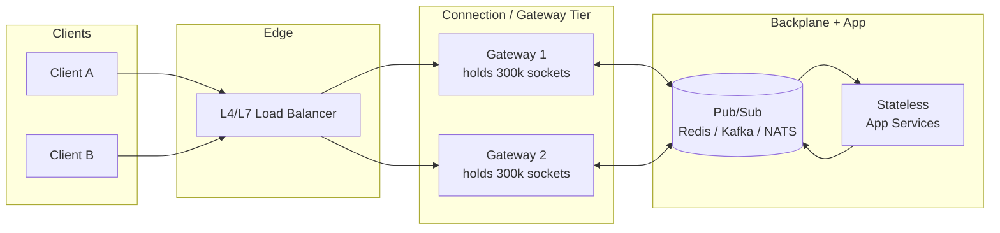
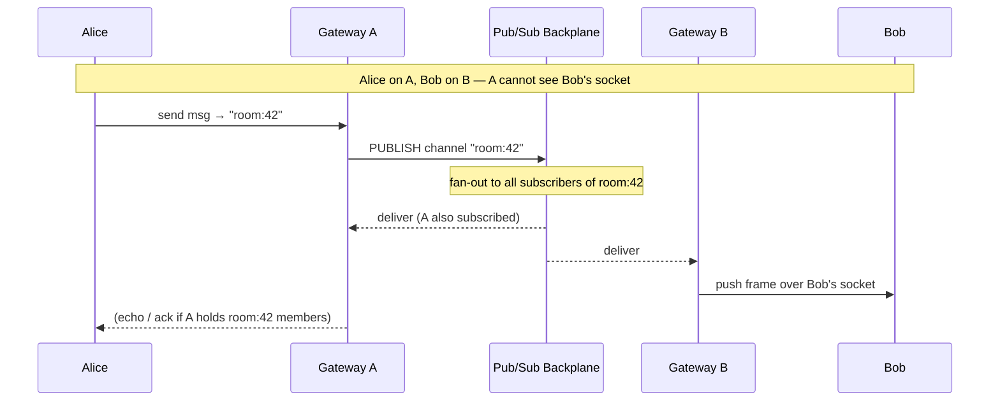
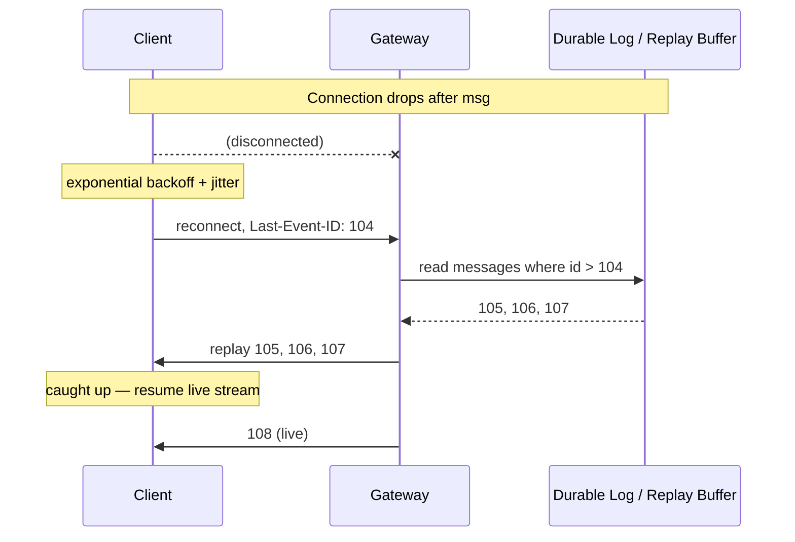

# WebSockets — Senior

<!-- level-focus -->
At senior level, focus on this question:

> Which system invariant is affected by **WebSockets** under failure, load, and change?

Use the smallest realistic scenario that exposes the decision and its failure behavior.
## 1. The stateful-connection problem

A stateless HTTP request tier is easy to reason about: a request arrives, is served, and the resources it held are freed within milliseconds. Capacity is a function of *throughput* — requests per second times per-request cost. You can drain a node in seconds and reboot it with zero user-visible impact.

WebSockets invert this. Capacity is a function of *concurrency* — how many sockets are open *right now*, each held open for minutes or hours, most of them idle most of the time. The scarce resources are not CPU cycles; they are the per-connection footprints that never get returned until the client disconnects.

Four hard limits govern how many connections a single node holds:

- **File descriptors.** Every socket is an fd. The default `ulimit -n` of 1024 is a toy; a real connection node needs `nofile` raised to 1–2 million and `fs.file-max` raised system-wide. Forget this and your node caps out at ~1000 connections and starts throwing `EMFILE`.
- **Memory.** Each connection carries kernel socket buffers (`rmem`/`wmem`, tunable but with a floor), a userland connection object, TLS session state (~10–40 KB with a live session), and any per-connection app state (subscriptions, auth context, send queue). Budget **10–50 KB/connection** end to end. At 50 KB, 1M connections = 50 GB of RAM *before* you buffer a single outbound message.
- **The ephemeral-port ceiling — on the *upstream* side.** A single source IP talking to a single destination IP:port has only ~28k–64k ephemeral ports. This bites you when a gateway node opens connections *to a backend* (e.g. the pub/sub broker), not on the inbound side where the tuple varies by client. Watch it on the backplane fan-in.
- **Conntrack.** Stateful firewalls and NAT boxes track every connection in a `nf_conntrack` table. The default table size (~256k) overflows silently under a million connections and drops new SYNs. Either raise `nf_conntrack_max` or bypass conntrack (`NOTRACK`) on the connection path.

The uncomfortable consequence: a WebSocket fleet's cost is dominated by *idle* connections. You pay for presence, not for traffic. This is why a chat app with 2M concurrent users and 5 messages/user/minute still needs a serious connection tier — the messages are trivial; the 2M open sockets are the bill.

Quantify before you architect. At **10 KB/conn** overhead, a 64 GB node holds ~5M connections on paper but ~500k–1M in practice once you leave headroom for GC pauses, send buffering, and traffic spikes. Plan for **200k–500k connections per node** as a safe, operable target, not the theoretical max.

## 2. The dedicated connection/gateway tier

The single most important structural decision at scale: **do not terminate WebSockets in your application servers.** Put a thin, stateless-*ish* connection tier in front. This tier does exactly three things — hold the socket, authenticate it, and shuttle frames between the client and the backplane. All business logic lives behind it in ordinary stateless services.

Why the split earns its keep:

- **Deploy cadence decoupling.** App logic ships several times a day. Every app deploy that terminated sockets would disconnect every user. A thin gateway that rarely changes lets you ship business logic freely behind it — the app services are stateless and restart instantly.
- **Independent scaling.** Connection count and request rate scale on different curves. You scale gateways on open-connection count and memory; you scale app services on CPU and QPS. Coupling them means over-provisioning one to satisfy the other.
- **Blast-radius control.** A gateway crash drops its connections; clients reconnect and the LB spreads them. Because the gateway holds no durable state, losing one is a reconnection event, not a data-loss event.
- **Protocol isolation.** The messy parts — fd tuning, TLS termination, ping/pong keepalive, frame parsing, backpressure — are concentrated in one specialized, heavily-tuned service instead of smeared across every app node.

The gateway keeps a **connection registry**: which `connectionId`/`userId` is held locally, and what it is subscribed to. Whether that registry is purely local or also mirrored to a shared store (Redis hash, etc.) is a real trade — local is fast and simple; shared enables targeted delivery ("send to userId 42 wherever they are") without broadcasting to every gateway.

## 3. Load balancing long-lived sockets

A WebSocket starts as an HTTP `GET` with `Upgrade: websocket`; once the LB passes the 101 through, the TCP connection is pinned for its whole lifetime. This breaks the assumptions of round-robin HTTP load balancing in three ways.

**L4 vs L7.** An **L4 (TCP) load balancer** forwards packets by 4-tuple without parsing HTTP. It is cheaper per connection, lower latency, and — critically — never re-terminates. It cannot route on path or header, and it cannot terminate TLS for you. An **L7 (HTTP) load balancer** understands the Upgrade handshake, can route `/ws` distinctly from `/api`, can terminate TLS, and can enforce per-route policy — at higher per-connection cost and with its own timeout defaults that will bite you. Most large WS fleets use **L4 for the socket path** (or L7 only to route the handshake, then pass through) and reserve L7 for the stateless API.

**Distribution: sticky vs consistent hashing.** With a pub/sub backplane, a client does *not* need to return to a specific server — any gateway can receive any message via the backplane. So you rarely need true HTTP session stickiness. What you *do* need is a stable, even spread:

- **Consistent hashing** on client IP (or a routing key) spreads connections evenly *and* minimizes reshuffling when you add/remove a gateway — only `1/N` of connections move, instead of everything rehashing. This is the default for large fleets.
- **Sticky sessions** (cookie or source-IP affinity) matter only if you keep session state *on the gateway* and cannot afford to rebuild it on reconnect — an anti-pattern once you have a backplane, because it couples the client to a single node's uptime.

**Idle-timeout tuning — the silent killer.** Load balancers, proxies, and NAT gateways all kill connections they judge idle. AWS ALB defaults to a **60-second** idle timeout; many corporate proxies to 30. A WebSocket with no traffic for 61 seconds gets silently reset, and the client sees a mysterious disconnect. Two fixes, applied together:

1. Raise the LB idle timeout well above your keepalive interval (e.g. ALB to 300–3600s).
2. Send **WebSocket ping frames** (or app-level heartbeats) at an interval *shorter* than the tightest timeout in the path — typically every **20–30 seconds**. Ping frames reset every idle timer in the chain and double as a liveness probe: no pong within `2×interval` ⇒ declare the peer dead and reclaim the fd. Do not rely on TCP keepalive alone; its default of 2 hours is useless here and it does not traverse L7 proxies.

## 4. Horizontal scaling with a pub/sub backplane

Here is the defining problem of a multi-node WebSocket fleet: **Alice is connected to Gateway A, Bob to Gateway B. Alice sends a message for Bob. Gateway A does not hold Bob's socket.** With one node this is a local hash-map lookup. With a fleet it is a distributed routing problem, and the answer is a **pub/sub backplane** every gateway subscribes to.

The message never travels gateway-to-gateway directly. It is published to a channel/topic; every interested gateway is subscribed and delivers to whichever of Bob's sockets it happens to hold.

**Choosing the backplane** is choosing your delivery semantics and durability:

- **Redis Pub/Sub** — dead simple, sub-millisecond, fire-and-forget. But it is **at-most-once and has no persistence**: a message published while a gateway is momentarily disconnected is *gone*. Fine for presence/typing/live cursors where a dropped update is harmless. Redis Streams (or a `PUBLISH` + a short replay list) buys you a bounded replay window.
- **Kafka** — durable, partitioned, ordered-within-partition, replayable by offset. The right choice when messages must survive a gateway hiccup and when you want a **cursor/offset for resume** (see §6). Higher latency (single-digit to tens of ms) and heavier to operate; consumer-group semantics don't map cleanly to per-user fan-out, so gateways typically consume broadly and filter locally.
- **NATS (Core or JetStream)** — subject-based routing with wildcards, very low latency, lighter than Kafka. Core NATS is at-most-once like Redis; **JetStream** adds persistence and replay. A common middle ground for real-time systems that want durability without Kafka's operational weight.

**The fan-out trap.** Naive designs broadcast every message to every gateway and let each filter for its local subscribers. At 100 gateways and 10k msg/s, that is 1M deliveries/s of mostly-discarded traffic — the backplane becomes the bottleneck. Mitigations: **channel/topic per room** (a gateway subscribes only to rooms it holds members for), **sharded channels** by hashing the routing key, or a **shared subscription registry** so the publisher targets only the gateways that actually hold a recipient. The right granularity depends on your fan-out shape: few huge rooms vs many tiny ones vs direct 1:1 messaging each want a different topology.

## 5. Backpressure and slow consumers

Every open socket has a send queue. When your system produces messages faster than a *particular client* can drain them — a mobile client on a train, a browser tab throttled in the background, a client behind a saturated link — that client's queue grows without bound. Unbounded, it consumes the memory of the *server*, not the client. A handful of slow consumers can OOM a gateway that is nominally handling millions of healthy sockets. This is the WebSocket equivalent of head-of-line memory pressure, and it is one of the top causes of gateway crashes in production.

Backpressure signals propagate through the TCP send buffer: when the kernel `wmem` buffer fills because the client isn't ACKing, `write()` would block (or return `EWOULDBLOCK` on a non-blocking socket). Your gateway must *notice* this and *react*, rather than buffering endlessly in userland. Strategies, roughly in order of aggressiveness:

- **Bounded per-connection queue.** Cap the outbound queue (by message count or bytes). This is non-negotiable; an unbounded queue is a latent OOM.
- **Drop policy on overflow.** For lossy data (presence, live metrics, cursor positions), drop the oldest or coalesce — the newest state supersedes the old anyway. Coalescing ("conflate to latest") is far better than dropping-oldest for state-snapshot streams.
- **Disconnect the slow consumer.** For streams where every message matters, the correct move is to **close the socket** once the queue exceeds threshold and force the client to reconnect and resume from a cursor (§6). Sacrificing one slow client protects the fleet.
- **Flow control / credit-based sending.** Sophisticated clients ACK application-level messages; the server only sends up to N unacknowledged messages ahead. This turns "server guesses client speed" into "client explicitly grants capacity."

The senior instinct: **never let one client's slowness become the server's memory problem.** Bound the queue, pick a per-stream overflow policy, and instrument `send_queue_depth` as a first-class metric with an alert. A rising p99 queue depth is your early warning of a backpressure incident before it becomes an OOM.

## 6. Reconnection, resume, and missed-message replay

Long-lived connections *will* drop — LB idle timeouts, gateway deploys, mobile network handoffs, laptop lid-close. At a million connections, disconnects are a constant background rate, not an exception. Reconnection is not an edge case; it is a core feature you design deliberately. Three parts:

**1. Client-side backoff.** A naive client reconnects instantly on drop. When a gateway restarts, *all* its clients reconnect *simultaneously* — a thundering herd that can knock over the gateway that just came back, causing a reconnect storm that never converges. Mandate **exponential backoff with full jitter**: `delay = random(0, min(cap, base · 2^attempt))`, with a cap around 30–60s. The jitter is the load-bearing part — it spreads the herd across a window instead of synchronizing everyone to the same retry tick.

**2. Session resume vs cold reconnect.** A *cold* reconnect re-authenticates and re-subscribes from scratch — simple, and correct if the client can tolerate a gap. A *resume* re-establishes the logical session and replays what was missed. Resume requires the server to hold recent state keyed by a session id, which costs memory and complexity; adopt it only where a message gap is unacceptable.

**3. Missed-message replay via a cursor.** The pattern that makes resume tractable: every message the client receives carries a monotonic id (sequence number or offset). On reconnect, the client sends its **last-seen id** — a `Last-Event-ID`-style cursor (borrowed directly from SSE) — and the server replays everything after it from a bounded buffer or the durable log.

The **retention window** is the key trade: the buffer holds a bounded history (last N messages or last T seconds). If a client is offline longer than the window, the server can't fully replay — it must tell the client to do a full state re-sync (fetch a snapshot over HTTP, then resume live). This "**snapshot + delta**" pattern — bootstrap current state via a plain request, then stream incremental changes over the socket — is the standard shape for live-data apps and cleanly bounds replay memory. Kafka makes this natural because the offset *is* the cursor and the log *is* the replay buffer; with Redis Pub/Sub you must build the replay list yourself.

## 7. Scaling-approach comparison

There is no single "scale WebSockets" answer — the backplane and delivery model follow from your semantics. This table maps the main options to what they actually buy you.

| Approach | Delivery guarantee | Replay / durability | Latency | Ops burden | Best fit |
|---|---|---|---|---|---|
| **Single node, in-memory map** | N/A (local) | None | Lowest | Lowest | Prototype, <50k connections, single-region toy |
| **Sticky sessions, no backplane** | Local only | None | Low | Low, but fragile | Small fleet where cross-node delivery is rare; couples client to node uptime |
| **Redis Pub/Sub backplane** | At-most-once | None (add Streams for bounded replay) | Sub-ms | Low–medium | Presence, typing, live cursors — dropped msgs harmless |
| **Redis Streams / list replay** | At-least-once (bounded) | Bounded window | Low | Medium | Chat/notifications needing short replay, moderate scale |
| **NATS JetStream** | Configurable (at-least/exactly-once) | Persistent, replayable | Very low | Medium | Real-time systems wanting durability without Kafka weight |
| **Kafka backplane** | At-least-once, ordered per partition | Durable, offset = cursor | ms–tens of ms | High | Must-not-lose messages, replay-by-offset resume, huge scale |
| **Managed WS service** (API GW WebSockets, Ably, Pusher, PubNub) | Provider-defined | Provider-defined | Varies | Lowest (outsourced) | Ship fast, small team, accept per-connection pricing + lock-in |

Reading the table as an owner: start as far *up* it as your semantics allow. Most teams over-reach for Kafka when Redis Pub/Sub plus a small replay list would serve presence-style traffic at a fraction of the operational cost. Conversely, teams that pick Redis Pub/Sub for financial or ordering-sensitive streams discover the "at-most-once, no persistence" clause during their first incident. **Match the backplane to the cost of a dropped message**, then to scale.

## 8. When NOT to use WebSockets

The highest-leverage senior decision on this page is often *not* to use WebSockets at all. They are the most powerful and the most expensive real-time primitive — bidirectional, persistent, stateful — and much real-time traffic needs none of that power. Reach for the cheapest primitive that meets the requirement.

- **One-way, server→client streaming → use SSE.** If clients only *receive* (live feeds, notifications, progress bars, dashboards, log tails), **Server-Sent Events** deliver server-push over plain HTTP/1.1 or HTTP/2. SSE brings built-in auto-reconnect, a native `Last-Event-ID` cursor, works through ordinary HTTP proxies and CDNs, and needs no special LB handling. You lose client→server messaging (send those over a normal `POST`) and gain enormous operational simplicity. A staggering share of "we need WebSockets" is actually "we need server push," which is SSE.

- **Request/response → use HTTP.** If the interaction is "ask, get an answer," it is a request, not a stream. Do not hold a socket open to carry occasional RPCs — you pay the full stateful-connection cost for traffic that a stateless request handles for free. WebSockets earn their cost only when the message *rate* or the need for *unsolicited server push* makes per-request HTTP overhead the bottleneck.

- **Infrequent updates → poll or long-poll.** If updates arrive every few minutes, a periodic `GET` (or long-poll) is simpler, cache-friendly, CDN-able, and needs no connection tier. Reserve persistent sockets for genuinely high-frequency or latency-critical push.

- **Behind restrictive proxies / corporate networks → prefer SSE or long-poll with fallback.** Some corporate proxies, older load balancers, and inspection middleboxes mishandle the `Upgrade` handshake or aggressively kill idle sockets. If a meaningful slice of your users sits behind such infrastructure, either front WebSockets with a transport-fallback library (Socket.IO / SockJS degrade to long-polling) or choose SSE, which rides ordinary HTTP and traverses proxies far more reliably.

- **Massive one-to-many broadcast → consider a CDN/streaming approach.** Fanning identical data to millions (live scores to spectators, a stock ticker) can be cheaper via HTTP/2 push, chunked responses, or a streaming CDN than via millions of individually-held sockets.

The decision test: **Do you need bidirectional, low-latency, high-frequency, server-initiated messaging?** If any of those four is missing, a cheaper primitive almost certainly wins. WebSockets are the answer to collaborative editing, multiplayer games, and live chat — not to "the dashboard should update."

## 9. The senior decision checklist

Owning WebSockets means these are decisions you make explicitly and defend with numbers, not defaults you inherit:

- **Do we even need WebSockets?** Run the four-part test in §8 first. The cheapest primitive that satisfies the requirement wins.
- **What's the per-connection budget?** Measure real overhead (fd + socket buffers + TLS + app state). Multiply by peak concurrent connections. That number sets node count, RAM, and cost — quantify it before you commit.
- **Are the kernel limits raised?** `nofile`, `fs.file-max`, `nf_conntrack_max`, ephemeral port range, socket buffer tuning. Verify on the actual node type, not in a doc.
- **What's the disconnect story?** Backoff-with-jitter on the client, LB idle timeout well above the ping interval, and a replay cursor with a defined retention window. Design the reconnect *before* launch, because at scale it runs continuously.
- **What does a dropped message cost?** That single answer picks the backplane (§7). Harmless ⇒ Redis Pub/Sub. Unacceptable ⇒ durable log with offset-based replay.
- **What happens when a gateway dies?** Losing a node should be a reconnection event affecting `1/N` of users for a few seconds — not data loss and not a fleet-wide thundering herd. Consistent hashing plus jittered backoff is what makes that true.
- **How do slow consumers fail?** Bounded send queue with an explicit overflow policy per stream, and `send_queue_depth` alerting. Never let one client's slowness become the server's OOM.

Get these seven right and a WebSocket fleet is boring in the best way. Get the reconnect story or the per-connection budget wrong and it fails at exactly the moment it matters most — under peak concurrency, during a deploy, when the herd all comes back at once.

## 10. Next step

The professional level goes deeper on the parts a senior owns but a professional *runs*: gateway internals and event-loop tuning, TLS session resumption at fleet scale, zero-downtime gateway deploys (connection draining and handoff), multi-region WebSocket topologies, capacity models with worked numbers, and the observability stack that catches a backpressure incident before it pages you.

*Next step:* [Professional level](professional.md)

---

## Apply it

1. State the system invariant that **WebSockets** must protect.
2. Mark ownership, state, and failure propagation at each boundary.
3. Compare two designs under load, dependency failure, and future change.
4. Define recovery and compatibility behavior before implementation.
5. Test the riskiest assumption with a focused experiment.

## Verify your work

- The experiment supports the design with evidence, not preference.
- Failure injection shows the blast radius and recovery path.
- Compatibility checks cover old and new callers or data.
- Operational signals reveal invariant violations and recovery progress.

## Review questions

- Which invariant must remain true when WebSockets fails?
- Where should recovery responsibility live, and why?
- Which assumption deserves an experiment before implementation?
- How can the design evolve without changing every consumer at once?
