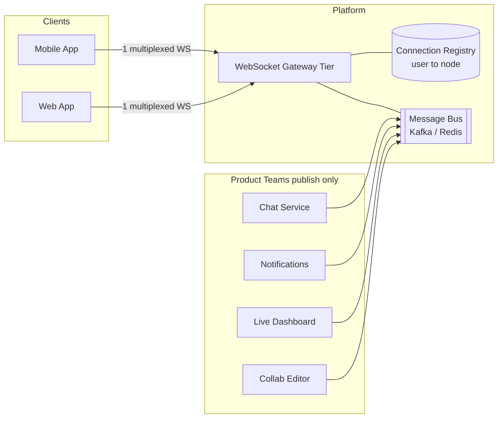
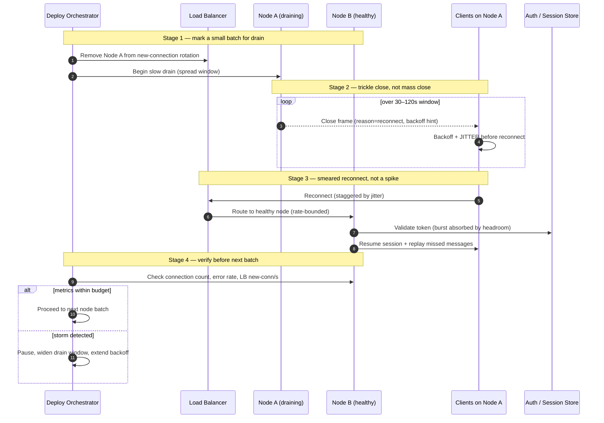

# WebSockets — Staff / Principal Level

At staff level, WebSockets stop being a protocol question and become a *capacity and organizational* question. The bidirectional frame format is trivial; the hard part is that you have committed your company to holding millions of TCP sockets open, indefinitely, and paying for that commitment every second whether or not a byte flows. This document treats real-time connectivity as a platform decision: who owns the connection tier, what a persistent connection actually costs, how a stateful fleet is operated without dropping the world on every deploy, and when to buy the whole thing instead of building it.

## Table of Contents

1. [The strategic reframe: connections are inventory, not requests](#1-the-strategic-reframe-connections-are-inventory-not-requests)
2. [The connection tier as shared infrastructure](#2-the-connection-tier-as-shared-infrastructure)
3. [The cost of millions of persistent connections](#3-the-cost-of-millions-of-persistent-connections)
4. [Operating a stateful service: deploys, drains, and reconnect storms](#4-operating-a-stateful-service-deploys-drains-and-reconnect-storms)
5. [Staged deploy and reconnect-storm mitigation](#5-staged-deploy-and-reconnect-storm-mitigation)
6. [Build vs buy](#6-build-vs-buy)
7. [Migration and graceful degradation](#7-migration-and-graceful-degradation)
8. [Connection-count as the scaling metric](#8-connection-count-as-the-scaling-metric)
9. [A decision framework](#9-a-decision-framework)
10. [Staff-level takeaways](#10-staff-level-takeaways)

---

## 1. The strategic reframe: connections are inventory, not requests

Every request-response system you have scaled behaves as a *flow*: requests arrive, do work, and leave. Capacity is a function of throughput (QPS) and latency, and idle capacity costs almost nothing because a released thread or connection is immediately reusable. Autoscaling works because load and machines rise and fall together.

WebSockets break this model. A connection is *inventory* you hold, not traffic you process. Ten million connected clients that send nothing still occupy ten million file descriptors, ten million socket buffers, and ten million load-balancer slots. Your bill is proportional to *connected population*, not to *message rate*. A chat app where users type occasionally and a live-scores app pushing updates every second can cost nearly the same to *hold open* — the message rate barely moves the needle next to the fixed per-connection overhead.

This single shift drives everything else in this document:

- **Capacity planning** is sized on peak concurrent connections, not peak QPS.
- **Deploys** are dangerous because terminating a process destroys inventory that must be rebuilt, all at once, by clients.
- **Cost** is *always-on*: you pay for the connection at 3 a.m. when nobody is looking at the screen.
- **The scaling signal** is connection count and memory pressure, not CPU or request latency.

Staff engineers who miss this reframe design real-time systems as if they were REST services and are surprised when a routine deploy takes the fleet down.

## 2. The connection tier as shared infrastructure

The first organizational decision is whether real-time connectivity is a *product-team capability* or a *platform capability*. Two models compete.

**Model A — every team runs its own WebSocket service.** The notifications team, the chat team, the live-dashboard team, and the collaborative-editor team each stand up their own gateway, their own connection handling, their own reconnect logic, their own client SDK. This is fast to start and gives each team autonomy. It is also how you end up with a mobile app holding four separate WebSocket connections to four services, each with its own auth handshake, heartbeat interval, and reconnect-backoff bug.

**Model B — one org-wide connection gateway.** A dedicated platform team owns a single WebSocket tier. Product teams do not manage sockets at all; they *publish* messages to a backend bus (Kafka, Redis, NATS) addressed to a user, device, or topic, and the gateway fans them out to whichever connections are currently subscribed. The gateway owns the socket lifecycle, auth, presence, backpressure, and reconnect semantics. Product teams own *content*, not *connectivity*.

The platform model wins at scale for reasons that compound:

- **One connection per device.** A mobile client holds a *single* multiplexed socket and demultiplexes topics client-side. This roughly quarters battery drain, radio wake-ups, and — critically — the number of persistent connections the company pays to hold open. This is the single largest cost lever available.
- **Auth, presence, and backpressure are solved once.** Token refresh over a live socket, "who is online," and slow-consumer handling are genuinely hard. Solving them four times produces four subtly different, subtly broken implementations.
- **Deploy risk is centralized.** Only one team owns the stateful fleet and its drain choreography (§4–5). Product teams deploy stateless publishers freely.
- **A uniform client SDK** means reconnect-with-backoff-and-jitter is implemented correctly *once* instead of being reinvented — usually without jitter — by every team.

The cost of Model B is a real platform team, a hard internal API boundary (publish-only, no direct socket access), and the political work of convincing product teams to give up control. The failure mode is a gateway that becomes a bottleneck or a single point of failure for every real-time feature at once — so the platform team must treat availability and multi-region isolation as first-class, not the individual product teams.

Rule of thumb: **below two or three independent real-time features, per-team is fine; above that, the connection tier should be shared infrastructure.** Retrofitting a platform after five teams have shipped five gateways is one of the more expensive migrations you will run.

## 3. The cost of millions of persistent connections

To make platform decisions you must be able to price a connection. Break the cost into its components.

**Memory.** A tuned WebSocket server holds a connection in tens of kilobytes: socket send/receive buffers (often the dominant term), TLS session state, application-level session and subscription metadata, and heartbeat timers. Call it ~30–50 KB in a lean stack; naive frameworks reach hundreds of KB by allocating fat per-connection buffers and objects. At 40 KB/connection, one million connections is ~40 GB of RAM *doing nothing but existing*. Buffer tuning (`SO_SNDBUF`/`SO_RCVBUF`, autotuning limits) is the highest-leverage optimization because it multiplies across the entire population.

**File descriptors and kernel limits.** Each connection is an fd. The default `ulimit -n` of 1024 is a toy; production nodes run 1M+ fds, tuned `net.ipv4.ip_local_port_range`, raised `net.core.somaxconn`, and enlarged conntrack tables. The famous **C10K** problem (10K concurrent connections) was solved two decades ago by epoll/kqueue; the live frontier is **C10M** — ten million connections on a single box — which requires kernel-bypass techniques, careful NUMA placement, and lock-free connection tables. Most companies do not need C10M per node, but they must understand *why* a node caps out: it is fds and memory, not CPU.

**Load-balancer slots.** This is the cost engineers forget. A WebSocket is a long-lived L4/L7 connection that the load balancer must track for its entire lifetime. Managed LBs (AWS ALB/NLB, GCP LB) price and cap on *active connections* and *new connections per second*, and their connection tables are finite. A reconnect storm (§4) can exhaust the LB's new-connections-per-second budget long before it touches your servers, causing the LB itself to reject clients. You are paying for LB capacity that is idle 99% of the time and saturated during exactly the incident you cannot afford.

**Always-on capacity.** Because connections are inventory, you provision for *peak concurrent population plus reconnect-storm headroom*, and that capacity sits deployed around the clock. Unlike a request tier, you cannot scale to near-zero overnight without dropping everyone's connection. Idle real-time capacity is not waste to be eliminated; it is the product.

A useful mental model: **cost ≈ (peak concurrent connections × per-connection memory) + LB connection-slot fees + reconnect-storm headroom.** Message throughput is often a rounding error next to the cost of merely holding the population open.

## 4. Operating a stateful service: deploys, drains, and reconnect storms

A stateless service deploy is invisible: drain in-flight requests, swap the binary, clients never notice. A WebSocket fleet is *stateful* — the state is the set of open connections — and terminating a process **destroys that state**. Every client on that node is disconnected and must reconnect.

The danger is *synchronization*. If you deploy by replacing all nodes at once, every connected client reconnects in the same few seconds. This is a **reconnect storm** (a thundering herd): a spike of new-connection setups — TLS handshakes, auth token validation, subscription replay, presence updates — arriving simultaneously. The storm can:

- exhaust the load balancer's new-connections-per-second budget,
- overwhelm the auth service and session store with a synchronized burst,
- and, if clients retry immediately on failure, *self-amplify* into a retry loop that prevents the fleet from ever settling.

The naive fixes make it worse. A fixed reconnect delay just moves the whole herd to a later synchronized instant. No backoff turns a transient blip into a permanent outage. The disciplines that actually work:

- **Reconnect with exponential backoff *and jitter*.** Backoff spreads retries over time; jitter (randomized delay) breaks synchronization so the herd smears across seconds instead of hammering one instant. This is non-negotiable client behavior and belongs in the shared SDK (§2). Without jitter, backoff alone still produces synchronized waves.
- **Rolling deploys with connection draining.** Take a small fraction of nodes out of rotation at a time. Send a WebSocket **close frame** (ideally with a "please reconnect elsewhere" reason and a suggested backoff) so clients reconnect *intentionally* rather than detecting a dead socket via timeout. Draining a fraction at a time keeps the reconnect rate bounded to a fraction of the population.
- **Slow drain windows.** Rather than closing all connections on a draining node at once, close them over a spread window (e.g., trickle out over 30–120 seconds) so even a single node's clients don't reconnect in lockstep.
- **Connection handoff / long-lived sessions.** Advanced fleets support session resumption: on reconnect the client presents a session token and the new node restores subscriptions and replays missed messages from the bus, so a reconnect is cheap and lossless rather than a cold rebuild.
- **Capacity headroom for the storm.** Because *some* reconnect surge is unavoidable, the fleet, the LB, and the auth path must be provisioned to absorb a multiple of steady-state connection setup rate.

The organizational consequence: **deploys are the primary operational risk of a real-time platform, and they must be automated, staged, and rehearsed.** A team that deploys its WebSocket tier the way it deploys a REST service will eventually take down every real-time feature in the company with a routine release.

## 5. Staged deploy and reconnect-storm mitigation

The following sequence shows a rolling deploy that keeps the reconnect rate bounded and prevents the storm from self-amplifying.

The load-bearing ideas: only a *batch* drains at once (bounding reconnect rate to a fraction of the population), each node closes connections over a *window* (breaking intra-node synchronization), clients add *jitter* (breaking inter-client synchronization), and the orchestrator *verifies* connection-setup metrics before advancing (a control loop, not a fixed schedule). Session resume turns each reconnect into a cheap operation instead of a full cold start.

## 6. Build vs buy

Because the connection tier is expensive to build correctly and dangerous to operate, "buy" is a serious option. The managed real-time market (Pusher, Ably, PubNub) and the cloud-native option (AWS API Gateway WebSockets) exist precisely because the C10M / drain / reconnect problems are hard enough that many companies should not solve them in-house.

| Dimension | Self-hosted (build) | Managed real-time (Pusher / Ably / PubNub) | AWS API Gateway WebSockets |
|---|---|---|---|
| **Time to first feature** | Weeks to months (fleet, LB tuning, drain choreography, SDK) | Days — SDK + dashboard, connectivity solved | Days if already on AWS |
| **Who operates the stateful fleet** | You (deploys, drains, C10M tuning, on-call) | Vendor | AWS (serverless, no fleet to run) |
| **Cost model** | Fixed always-on infra (instances + LB), cheap per-message; efficient at large steady population | Per-connection + per-message tiers; cheap at small scale, expensive at very large populations | Per-connection-minute + per-message; connection-minutes dominate for always-on clients |
| **Scale ceiling** | Whatever you engineer (millions to C10M) — but you own the ceiling | High, vendor-managed; may hit account/plan limits | Real hard limits (message size, connection duration caps, throttles) |
| **Latency control** | Full — colocate gateway with backend, tune everything | Vendor edge network; often globally good, but a black box | AWS-region-bound; extra hop through API Gateway |
| **Lock-in** | None (your code, your protocol) | High — proprietary SDK, channel/presence semantics | High — tied to AWS + Lambda integration model |
| **Advanced features** | Build presence, history, guaranteed delivery yourself | Presence, message history, delivery guarantees built in | Minimal — you build fan-out, presence, registry on Lambda/DynamoDB |
| **Best fit** | Very large always-on population, cost-sensitive at scale, need protocol control | Ship fast, moderate scale, don't want a platform team | Bursty/moderate scale, deep AWS shop, serverless preference |

The TCO crossover is the crux. Managed vendors are cheap when you have thousands to low-hundreds-of-thousands of connections and expensive to run a platform team — buying is clearly right. As the connected population climbs into the millions and stays always-on, the vendor's per-connection pricing can exceed the fully loaded cost of a self-hosted fleet *including* the platform team's salaries. Companies frequently start on a managed vendor to ship, then migrate to self-hosted once connection volume makes the bill dwarf the engineering cost — and the reverse mistake (building a bespoke gateway for a feature with 5,000 concurrent users) burns a quarter of platform time on undifferentiated infrastructure.

The staff-level framing: **buy connectivity until the connection bill approaches the cost of a platform team; then building becomes cheaper *and* removes lock-in.** Model both curves explicitly — vendor cost as a function of peak connections, and self-hosted cost including operational salaries — and find their intersection before committing.

## 7. Migration and graceful degradation

A WebSocket-only real-time strategy is fragile. A meaningful fraction of real-world networks — corporate proxies that strip the `Upgrade` header, older middleboxes, some captive portals and mobile carriers — will not let a WebSocket establish or hold. If your product breaks on those networks, you have shipped a feature that silently fails for a slice of users you cannot see.

The mitigation is a **transport ladder** with automatic degradation:

1. **WebSocket** — the preferred transport: full-duplex, low overhead.
2. **Server-Sent Events (SSE)** — for one-way server-to-client push (notifications, live feeds, dashboards) where the client rarely talks back. SSE rides plain HTTP, survives most proxies, and auto-reconnects natively. If your traffic is push-dominant, SSE may be the *primary* choice, not a fallback.
3. **HTTP long-polling** — the universal fallback. Works through nearly any proxy because it is ordinary HTTP request-response held open. Higher latency and per-message overhead, but it connects where nothing else will.

Mature client libraries (the model popularized by Socket.IO and similar stacks) implement this ladder transparently: attempt WebSocket, detect failure quickly, fall back to SSE or long-poll, and keep the application's message API identical across transports. The application code neither knows nor cares which transport is live.

Organizationally, the transport ladder is another argument for a **shared client SDK and shared gateway** (§2): fallback logic, transport negotiation, and reconnect-with-jitter are exactly the cross-cutting concerns you do not want re-implemented per team. A per-team WebSocket-only implementation almost always *skips* the fallback ladder — the team ships, and the corporate-network failures surface months later as unreproducible support tickets.

Also plan the *reverse* migration path: if you are on a managed vendor, the day the bill justifies self-hosting you want to switch transport without rewriting product features. A publish-only internal API (product teams emit messages to a bus; the gateway owns delivery) makes the gateway swappable — vendor today, self-hosted tomorrow — without touching the teams that publish. Designing that boundary up front is the difference between a migration and a rewrite.

## 8. Connection-count as the scaling metric

Everything above converges on one operational truth: **the scaling metric for a real-time tier is concurrent connection count and per-node memory, not QPS or CPU.**

- **Autoscaling triggers** fire on connections-per-node and memory pressure, not on CPU utilization. A node can be at 95% memory (fds and buffers) while its CPU sits at 10% — CPU-based autoscaling would never add capacity and the node would OOM.
- **Scaling *out* is easy; scaling *in* is hard.** Adding nodes lets new connections spread across more capacity. Removing nodes means *draining* existing connections — a controlled reconnect storm (§4–5). So scale-in must be slow, staged, and off-peak, never a reactive downscale.
- **Dashboards and SLOs** track connected population, connection-setup rate (the storm signal), reconnect rate, message-delivery latency, and slow-consumer / backpressure counts. Request latency is nearly irrelevant here.
- **Capacity reviews** forecast *peak concurrent population* growth and reconnect-storm headroom, not request volume.

If your on-call runbooks, alerts, and autoscaling policies are still written in the language of QPS and CPU, you do not yet operate a real-time platform — you operate a REST service that happens to hold sockets open, and it will fail you on your next big traffic day.

## 9. A decision framework

Pull the threads together into a sequence a staff engineer can walk with product and infra leadership.

1. **How many independent real-time features will exist?** One or two → per-team is acceptable. Three or more → invest in a shared connection tier before the sprawl calcifies (§2).
2. **What is the peak concurrent connection count, now and in two years?** This — not QPS — sizes the fleet and drives the build-vs-buy math (§3, §6).
3. **Is the workload push-dominant or truly bidirectional?** Push-dominant may be better served by SSE as the primary transport, cutting complexity and cost (§7).
4. **Build or buy?** Below hundreds of thousands of always-on connections, buy and ship fast. Approaching millions where the vendor bill nears platform-team cost, build to save money and shed lock-in — behind a publish-only boundary so the choice stays reversible (§6).
5. **Is the deploy story staged, drained, and jittered?** If not, the platform is one routine release away from an outage; fix this before scaling connections (§4–5).
6. **Do the transport ladder and reconnect logic live in one shared SDK?** If every team reimplements them, corporate-network failures and reconnect storms are inevitable (§7).
7. **Are autoscaling, alerts, and capacity reviews expressed in connections and memory?** If they still speak QPS and CPU, the operational model is wrong (§8).

## 10. Staff-level takeaways

- **Connections are inventory, not requests.** You pay for the connected population continuously, idle or not; capacity is sized on peak concurrent connections, not QPS. Internalizing this reframes cost, deploys, and scaling.
- **The connection tier is platform infrastructure once you have several real-time features.** One org-wide gateway with a publish-only API gives you one connection per device (the biggest cost lever), solves auth/presence/backpressure once, and centralizes deploy risk. Retrofitting it later is an expensive migration.
- **Price a connection before you argue about it.** Memory (buffers dominate), file descriptors, LB connection slots, and always-on capacity — not message throughput — determine cost. The frontier is C10M, and nodes cap on fds and memory, not CPU.
- **Deploys are the top operational risk.** Terminating a stateful process destroys connection inventory and triggers reconnect storms. Rolling drains with slow close windows, exponential backoff *with jitter*, session resume, and a verify-before-advance control loop are mandatory, not optional.
- **Buy until the bill meets the cost of a platform team; then build.** Managed vendors are cheap and fast at small-to-moderate scale; self-hosting wins at large always-on populations and removes lock-in. Model both curves and keep the boundary swappable.
- **Never ship WebSocket-only.** A transport ladder (WebSocket → SSE → long-poll) with transparent fallback is required for the fraction of networks that block WebSockets — and it belongs in the shared SDK, not in each team's code.
- **Scale on connections and memory, not QPS and CPU.** Scale-out is easy, scale-in is a controlled reconnect storm. Your alerts, autoscaling, SLOs, and capacity reviews must all speak the language of connected population.

*Next step:* [Interview questions](interview.md)
