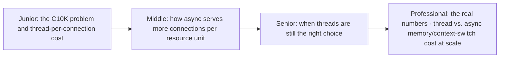
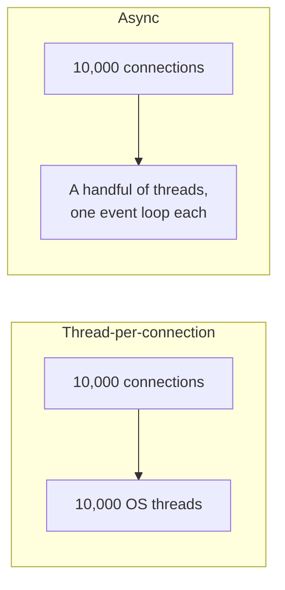

# Why Async (vs Threads)

> The C10K problem — serving 10,000 concurrent connections — breaks
> thread-per-connection models long before it breaks the network or CPU.
> Async programming exists specifically to serve massive I/O concurrency
> without needing massive thread counts.

## Choose a level

| Level | Guide | You are done when |
|---|---|---|
| Junior | [The C10K problem](junior.md) | You can explain why 10,000 threads is a real, measurable resource problem. |
| Middle | [How async serves more with less](middle.md) | You can explain how one thread can service thousands of connections via an event loop. |
| Senior | [When threads are still right](senior.md) | You can identify workloads where async provides no benefit over threads. |
| Professional | [Real thread vs. async cost numbers](professional.md) | You can cite concrete memory/context-switch costs justifying the async trade-off at scale. |

## Practice rule

Before adopting async for a new service, ask: "what's the actual expected
concurrent connection count, and is the bottleneck genuinely I/O wait,
not CPU?" Async's benefit is proportional to how much of your
concurrency is spent waiting, not computing.

## Related

- [Async/Await (Concurrency Model Overview)](../../concurrency/04-async-await/README.md)
- [Event Loop](../02-event-loop/README.md)
