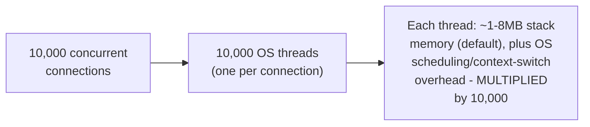
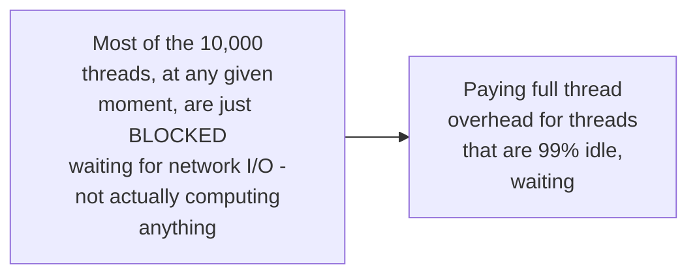

# Why Async — Junior

<!-- level-focus -->
At junior level, focus on this question:

> Why does serving 10,000 concurrent connections with one thread each
> become a real problem, even before the network or CPU is saturated?

---

## The C10K problem, stated precisely

Each OS thread carries real, fixed overhead — a stack (megabytes by
default in many runtimes), kernel bookkeeping, and a slot in the OS
scheduler's context-switching rotation. At 10,000 threads, this overhead
alone can consume gigabytes of memory and meaningfully degrade scheduler
performance — **before** any of those connections have sent a single
byte of actual data. This is the "C10K problem" (named after a famous
1999 essay by Dan Kegel), and it was the original motivating problem
behind async I/O models.

## Why most of those threads are just... waiting

The wastefulness is compounded by the fact that most connections spend
most of their time **waiting** (for the next request, for a slow client)
— you're paying full per-thread resource cost for threads that are doing
essentially nothing most of the time.

> 🎓 **Takeaway:** the C10K problem isn't about the network or CPU being
> overwhelmed — it's specifically about the **fixed per-thread overhead**
> becoming the bottleneck when connection count scales into the
> thousands, especially when most connections are I/O-bound and idle
> most of the time.

## Test yourself

1. Why does thread-per-connection overhead become a real problem even
   before the network is saturated?
2. Why is it wasteful specifically that most connections are "just
   waiting" most of the time under this model?
3. Estimate roughly how much memory 10,000 threads with an 8MB default
   stack size each would consume, even if each thread is otherwise idle.

Continue to [`middle.md`](middle.md).
