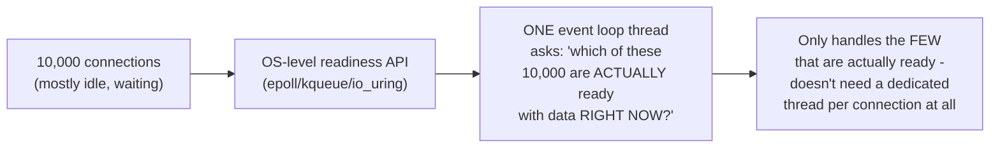
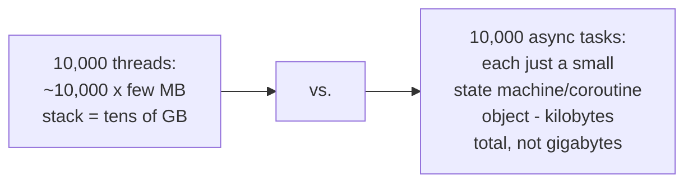

# Why Async — Middle

<!-- level-focus -->
At middle level, focus on this question:

> How can a single thread actually service thousands of connections
> simultaneously via an event loop?

Prerequisite: [`junior.md`](junior.md).

---

## One thread, many connections, via OS-level readiness notification

Instead of a dedicated OS thread blocking on each individual connection,
async I/O uses an OS-level readiness API (`epoll` on Linux, `kqueue` on
BSD/macOS, `io_uring` more recently, IOCP on Windows) that lets **one**
thread ask the OS: "of these 10,000 file descriptors I care about, which
ones actually have data ready right now?" — and only processes those,
handling potentially thousands of connections' worth of readiness checks
in one syscall, on one thread.

## The memory math

An async "connection" is typically just a small data structure (a state
machine tracking where it is in its request-handling logic) rather than
an entire OS thread with its own stack — this is the direct mechanism
behind async's dramatically lower per-connection memory cost, which is
`professional.md`'s subject in precise numbers.

> 🎓 **Takeaway:** the event loop's core trick is replacing "one thread
> blocked per connection" with "one thread asking the OS which of many
> connections need attention right now" — turning thousands of blocking
> waits into one efficient, batched readiness check.

## Test yourself

1. Why does asking the OS "which of these are ready" in one call scale
   better than having a dedicated thread block on each connection
   individually?
2. Why is an async task's memory footprint typically much smaller than a
   full OS thread's?
3. What does `epoll`/`kqueue` actually return, conceptually, when you ask
   it "which connections are ready"?

Continue to [`senior.md`](senior.md).
