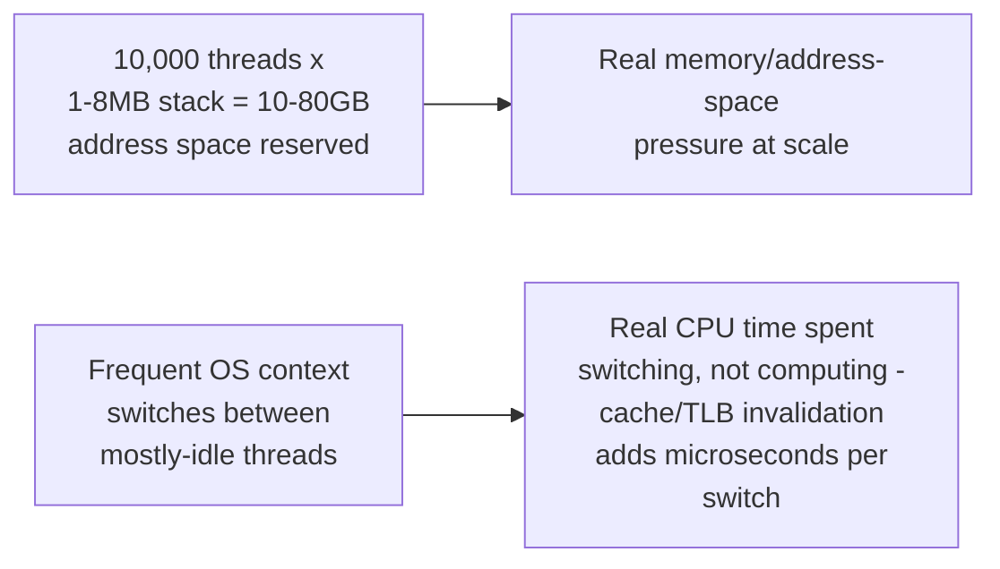

# Why Async — Professional

<!-- level-focus -->
At professional level, focus on this question:

> What are the actual, concrete memory and context-switch cost numbers
> that justify the async trade-off at real production scale?

Prerequisite: [`senior.md`](senior.md).

---

## Concrete per-thread cost, and where it actually comes from

A default Linux thread stack is commonly 8MB (configurable, often
reducible to 64KB-1MB for threads known not to need deep call stacks,
but rarely tuned in practice) — at 10,000 threads, even a conservatively
reduced 1MB-per-thread stack is **10GB** of address space reserved
(not necessarily all resident in physical memory immediately, due to
lazy page allocation, but still a real constraint on address space and
eventual physical memory pressure under load). Beyond memory, **context-
switch cost** is real and measurable: each switch involves saving/
restoring CPU registers and can trigger cache/TLB (translation lookaside
buffer) invalidation, costing microseconds per switch — at high thread
counts with the OS scheduler frequently rotating through thousands of
mostly-idle threads, this overhead compounds into measurable CPU time
spent on scheduling rather than useful work.



## Async's actual per-task cost

An async task (a coroutine/state machine in most runtimes) typically
costs on the order of a few hundred bytes to a few kilobytes — no
dedicated stack, no OS scheduler involvement at all for switching between
tasks (the language runtime's own cooperative scheduler, per the
Async/Await concurrency-model page's cooperative-scheduling discussion,
handles switching entirely in user-space, without a kernel context
switch). This is the concrete, quantifiable basis for async's famous
scalability to tens or hundreds of thousands of concurrent connections
on a single machine — Node.js, Python's asyncio, and Rust's tokio have
all published benchmarks demonstrating six-figure concurrent connection
counts on commodity hardware specifically because of this per-task cost
difference.

## Production checklist (staff-level)

1. **Measure your actual expected concurrent connection count before
   choosing an architecture** — the C10K-scale problem this whole page
   addresses only applies once you're genuinely operating at thousands-
   plus concurrent I/O-bound connections.
2. **Profile actual thread stack sizes in a thread-per-connection
   deployment** before assuming the default is appropriate — tuning
   stack size down (where safe) can meaningfully extend a thread-based
   architecture's practical connection-count ceiling without a full
   async rewrite.
3. **Understand that async's benefit is proportional to I/O-wait time,
   not raw connection count alone** — a connection doing constant,
   CPU-heavy work per request doesn't benefit from async's core value
   proposition the way a connection mostly idle between infrequent
   requests does.
4. **Benchmark your specific workload under both models before
   committing**, rather than assuming published general benchmarks (Node/
   asyncio/tokio's six-figure connection counts) transfer directly to your
   specific request pattern and payload sizes.
5. **In an architecture review proposing a full async rewrite,
   require an explicit, measured justification** (current or projected
   connection count, I/O-wait fraction of request time) rather than
   accepting "async is more modern/scalable" as sufficient justification
   on its own.

## Cheat Sheet

```text
+------------------------------------------------------------------+
|                    WHY ASYNC — INTERNALS & SCALE                    |
+------------------------------------------------------------------+
| Thread-per-connection real cost: 1-8MB stack PER THREAD (10,000        |
| threads = 10-80GB address space) + real context-switch CPU cost        |
| (register save/restore, cache/TLB invalidation) at high thread count   |
+------------------------------------------------------------------+
| Async task real cost: hundreds of bytes to a few KB (state machine/    |
| coroutine, no dedicated stack) + ZERO kernel context switches          |
| between tasks (user-space cooperative scheduling) - this is WHY        |
| Node/asyncio/tokio scale to 6-figure concurrent connections on          |
| commodity hardware                                                    |
+------------------------------------------------------------------+
| Adopt async based on MEASURED connection count + I/O-wait fraction,   |
| not "it's modern" - benchmark your specific workload, don't assume     |
| published general benchmarks transfer directly                        |
+------------------------------------------------------------------+
```

## Test yourself

1. Roughly how much address space would 50,000 threads with a 2MB stack
   each reserve, and why does this matter even before physical memory is
   touched?
2. Why does an async task switch avoid the kernel context-switch cost
   that a thread switch incurs?
3. Design the specific measurements you'd take on an existing service
   before deciding whether to invest in an async rewrite.

## Further Reading

- Dan Kegel — "The C10K Problem" (the original 1999 essay that named and
  motivated this entire problem space).
- Node.js, Python asyncio, and Rust tokio benchmark documentation —
  published concurrent-connection scalability numbers.
- See also: [Async/Await (Concurrency Model Overview) — senior](../../concurrency/04-async-await/senior.md).
