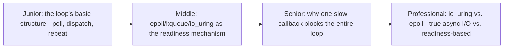
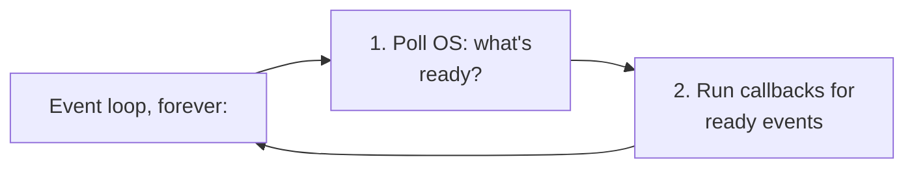

# The Event Loop

> The single-threaded scheduler at the heart of every async runtime — it
> repeatedly asks the OS "what's ready," runs the corresponding callbacks/
> coroutines, and loops. Understanding its actual loop structure explains
> both async's power and its sharpest footgun (a slow callback blocks
> everything).

## Choose a level

| Level | Guide | You are done when |
|---|---|---|
| Junior | [The loop's basic structure](junior.md) | You can describe the poll-dispatch-repeat cycle in your own words. |
| Middle | [epoll/kqueue/io_uring](middle.md) | You can explain what a readiness-based API actually tells the event loop. |
| Senior | [Why one slow callback blocks everything](senior.md) | You can trace why a synchronous, slow operation inside a callback stalls the entire loop. |
| Professional | [io_uring vs. epoll](professional.md) | You can explain the architectural difference between readiness-based and true-async I/O models. |

## Practice rule

For any callback/handler registered with an event loop, ask: "does this
ever call a blocking, synchronous operation (file I/O, a CPU-heavy
computation, a synchronous library call)?" If yes, it will stall every
other task on that loop for its duration — this is the single most
common async programming bug.

## Related

- [Why Async](../01-why-async/README.md)
- [Async/Await (Concurrency Model Overview) — middle](../../concurrency/04-async-await/middle.md)
