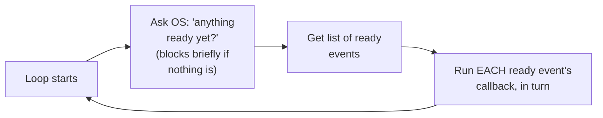

# The Event Loop — Junior

<!-- level-focus -->
At junior level, focus on this question:

> What does the event loop actually do, in its most basic form, on every
> single iteration?

---

## The core loop, in pseudocode

```python
def event_loop():
    while True:
        ready_events = poll_os_for_ready_events(timeout=next_timer_deadline)
        for event in ready_events:
            callback = event.get_registered_callback()
            callback()  # run the code waiting for this event
        run_any_expired_timers()
```



This is the entire event loop, at its most fundamental: **poll** the OS
for what's ready, **dispatch** to the corresponding registered callback
for each ready item, **repeat** forever. Every `await` in your async code
(per the Async/Await concurrency-model page) ultimately compiles down to
"register a callback for when this operation is ready, then let the loop
continue with other work."

> 🎓 **Takeaway:** no matter how sophisticated a specific async runtime's
> implementation gets, this poll-dispatch-repeat structure is the
> foundational shape every event loop shares — understanding this loop is
> understanding the mechanical reality underneath every `await` you write.

## Test yourself

1. Why does the loop need to "block briefly" during the poll step rather
   than spinning continuously checking for readiness?
2. What happens to a registered callback between when it's registered and
   when the loop actually calls it?
3. Why does every `await` ultimately reduce to "register a callback, let
   the loop continue"?

Continue to [`middle.md`](middle.md).
