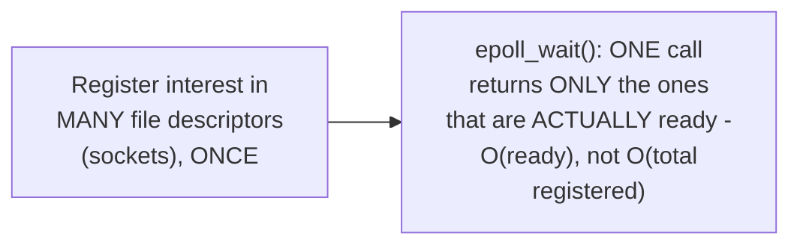

# The Event Loop — Middle

<!-- level-focus -->
At middle level, focus on this question:

> What does a readiness-based API like `epoll` actually tell the event
> loop, precisely?

Prerequisite: [`junior.md`](junior.md).

---

## Registering interest, then polling for readiness

```c
// Conceptual epoll usage (simplified)
int epfd = epoll_create1(0);
epoll_ctl(epfd, EPOLL_CTL_ADD, socket_fd, &event);  // "tell me when
                                                       // socket_fd is
                                                       // readable"

struct epoll_event ready_events[MAX_EVENTS];
int n = epoll_wait(epfd, ready_events, MAX_EVENTS, timeout_ms);
// n = number of file descriptors that are ACTUALLY ready right now,
// out of potentially THOUSANDS registered
```



The critical efficiency property: `epoll_wait` (and `kqueue`'s
equivalent) returns information proportional to the number of **ready**
descriptors, not the total number **registered** — checking whether any
of 10,000 registered sockets are ready doesn't require iterating through
all 10,000 one by one (which the older `select`/`poll` APIs did,
scaling poorly); the kernel maintains this efficiently internally and
returns just the relevant subset.

> 🎓 **Takeaway:** "readiness" means "this socket has data available to
> read, or buffer space available to write, right now" — the event loop
> doesn't get the actual data through this API; it gets a signal that
> it's now safe to perform a non-blocking read/write without stalling,
> which it then does as a separate, fast operation.

## Test yourself

1. Why does `epoll_wait` scale better than the older `select`/`poll`
   APIs at high registered-descriptor counts?
2. What does "ready" actually mean for a socket — does it mean data has
   already been delivered to the application, or something else?
3. Why does the event loop still need to perform an actual read/write
   call after being told a descriptor is "ready," rather than the
   readiness API delivering the data directly?

Continue to [`senior.md`](senior.md).
