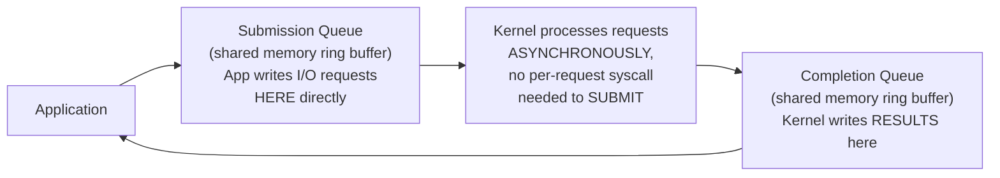
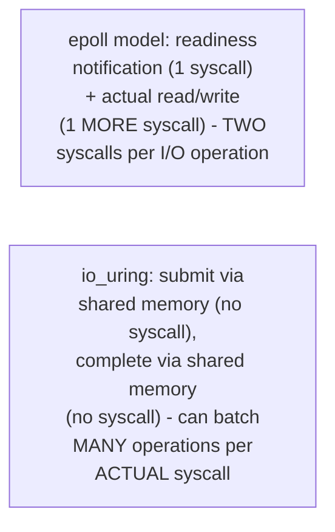

# The Event Loop — Professional

<!-- level-focus -->
At professional level, focus on this question:

> How does `io_uring`'s architecture fundamentally differ from `epoll`'s
> readiness-based model, and what does that difference actually buy you?

Prerequisite: [`senior.md`](senior.md).

---

## epoll: readiness-based — you still perform the I/O yourself

Per `middle.md`, `epoll` tells you "this descriptor is ready," and your
application then makes a **separate** system call (`read()`/`write()`) to
actually perform the I/O — meaning every I/O operation still costs at
least one syscall (a user-space/kernel-space transition, a real, if
small, per-call cost) beyond the readiness notification itself.

## io_uring: true asynchronous I/O via shared ring buffers



`io_uring` (a more recent Linux kernel interface) uses **two shared-memory
ring buffers** between the application and kernel: a **submission queue**
(the application writes I/O requests directly into shared memory, no
syscall needed per request) and a **completion queue** (the kernel writes
completed results directly into shared memory, application reads them
without a syscall per completion). This eliminates the "readiness
notification, then separate syscall to actually do the I/O" two-step
dance entirely — the actual I/O operation itself is submitted and
completed **asynchronously**, batched, with dramatically fewer syscalls
than the epoll model requires for the same volume of I/O operations.



## Why this matters at extreme scale

At very high I/O rates (databases, high-performance proxies), the
syscall overhead itself (context switches into/out of kernel mode)
becomes a measurable cost independent of the actual I/O work being done —
`io_uring`'s shared-ring-buffer design specifically targets and
eliminates this per-operation syscall cost, which is why it's been
adopted by high-performance database engines and proxies (and why
RocksDB and other performance-critical storage engines have added
`io_uring` support) specifically for I/O-syscall-bound workloads, not as
a general "always better" replacement for epoll in every context.

## Production checklist (staff-level)

1. **Understand which readiness model your language/runtime's async
   implementation actually uses** — most mainstream async runtimes
   (Python asyncio, Node.js) historically default to epoll/kqueue-based
   models; `io_uring` support is a newer, often opt-in or
   still-maturing addition.
2. **Reach for `io_uring`-based I/O specifically when syscall overhead
   itself is a measured bottleneck** — extremely high I/O operation
   rates, not general "is my server fast enough" concerns.
3. **Never assume `io_uring` is a drop-in performance win without
   measurement** — its benefit is proportional to how syscall-bound
   (versus genuinely I/O-latency-bound) your workload actually is.
4. **Continue applying `senior.md`'s "never block the loop" discipline
   regardless of the underlying readiness/completion mechanism** —
   both epoll-based and io_uring-based event loops share the same
   single-threaded, run-to-completion structure at the application level.
5. **In a performance review for a high-throughput I/O-bound service,
   profile syscall counts specifically** (via `strace -c` or equivalent)
   before concluding whether an `io_uring`-based approach would provide a
   measurable benefit over the existing epoll-based implementation.

## Cheat Sheet

```text
+------------------------------------------------------------------+
|                 THE EVENT LOOP — INTERNALS & SCALE                   |
+------------------------------------------------------------------+
| epoll/kqueue: READINESS-based - notify "this is ready," application  |
| makes a SEPARATE syscall to actually perform the read/write -          |
| TWO syscalls per I/O operation (notify + do)                          |
+------------------------------------------------------------------+
| io_uring: TRUE async I/O via SHARED-MEMORY RING BUFFERS (submission    |
| queue + completion queue) - application submits/reads results          |
| directly in shared memory, NO per-operation syscall needed -            |
| eliminates the two-syscall-per-operation cost at extreme I/O rates     |
+------------------------------------------------------------------+
| Both models share the SAME single-threaded, run-to-completion          |
| structure at the application level - senior.md's "never block the     |
| loop" rule applies regardless of the underlying readiness mechanism   |
+------------------------------------------------------------------+
```

## Test yourself

1. Why does the epoll model require two separate syscalls per I/O
   operation (readiness notification + actual read/write), while
   io_uring can avoid per-operation syscalls entirely?
2. Why is io_uring's benefit specifically tied to syscall-bound
   workloads, rather than being a universal performance improvement?
3. Design the profiling approach you'd use to determine whether a
   high-throughput service would benefit from migrating to an
   io_uring-based I/O implementation.

## Further Reading

- Jens Axboe — "Efficient IO with io_uring" (the original design
  document from io_uring's creator).
- `man 7 epoll` — the Linux epoll manual page (readiness semantics).
- See also: [Why Async — professional](../01-why-async/professional.md).
