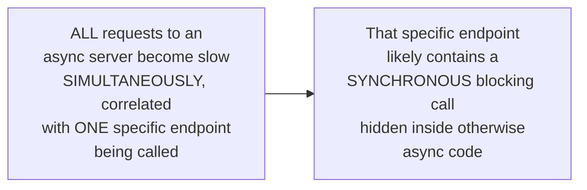

# The Event Loop — Senior

<!-- level-focus -->
At senior level, focus on this question:

> Why does a single slow, synchronous callback stall every other task
> sharing the same event loop?

Prerequisite: [`middle.md`](middle.md).

---

## The loop is single-threaded; a callback runs to completion before the next

```mermaid
sequenceDiagram
    participant Loop as Event Loop
    participant CB1 as Callback 1 (has a SLOW synchronous DB call)
    participant CB2 as Callback 2 (waiting, fast, ready)
    Loop->>CB1: dispatch (ready event fired)
    Note over CB1: Makes a SYNCHRONOUS,\nblocking database call -\ntakes 2 SECONDS
    Note over Loop,CB2: The ENTIRE loop is stuck\nhere - CB2 cannot run,\nNO other events can be\npolled or dispatched,\nfor 2 FULL SECONDS
    CB1-->>Loop: finally returns
    Loop->>CB2: NOW dispatches CB2
```

This is precisely the same "cooperative scheduling" issue from the
Async/Await concurrency-model page's `middle.md`, made concrete at the
event-loop mechanism level: because the loop is single-threaded and runs
one callback to completion before moving to the next, **any** callback
that blocks synchronously (a synchronous file read, a CPU-heavy
computation, a non-async database driver call) freezes the **entire**
loop — every other task, regardless of how ready or fast it would
otherwise be, is starved for that callback's entire duration.

## Diagnosing this in practice



> 🎯 **Senior takeaway:** this single-threaded, run-to-completion property
> is the direct mechanistic reason why "never call a blocking/synchronous
> operation inside async code" is the single most important async
> programming rule — a violation doesn't just slow down the specific
> request; it stalls **every concurrent request** the event loop is
> currently servicing, converting a localized slow operation into a
> system-wide outage for the duration of that one blocking call.

## Test yourself

1. Why does the event loop's single-threaded, run-to-completion design
   mean one slow callback affects every other pending task, not just its
   own request?
2. What symptom would you look for in production monitoring to diagnose
   this specific bug pattern?
3. Why is this bug pattern often intermittent/hard to reproduce in
   testing, but severe in production?

Continue to [`professional.md`](professional.md) to compare io_uring's
different architecture against epoll's readiness-based model.
